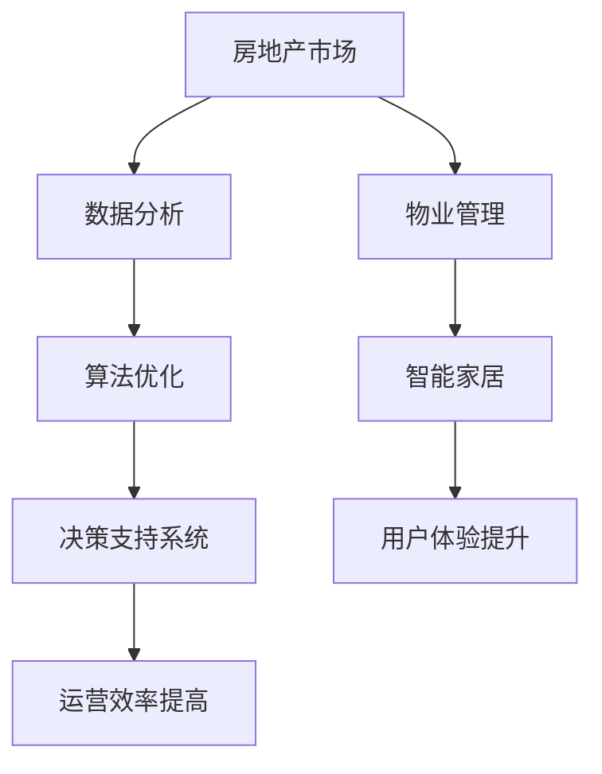

                 

关键词：人工智能、房地产、物业管理、智能家居、数据分析、算法优化

> 摘要：随着人工智能技术的快速发展，其在房地产市场和物业管理中的应用变得越来越广泛。本文将探讨AI技术如何通过数据分析、算法优化、智能家居等技术手段，提高房地产市场的运营效率和物业管理水平，同时展望其未来的发展趋势与挑战。

## 1. 背景介绍

近年来，人工智能技术在全球范围内取得了显著的进展。特别是在计算机视觉、自然语言处理、机器学习等领域，AI技术已经能够实现许多以前只能由人类完成的工作。房地产和物业管理作为传统行业，也逐渐开始认识到人工智能技术的潜力，并尝试将其应用于实际业务中。这不仅有助于提高行业效率，还可以提升用户体验。

### 1.1 房地产市场概述

房地产市场是一个庞大的市场，涵盖了新房销售、二手房交易、租赁市场等多个方面。传统的房地产交易流程繁琐，信息不对称问题严重，导致交易效率低下。而人工智能技术的应用，有望改变这一现状。

### 1.2 物业管理概述

物业管理是房地产市场中不可或缺的一部分，涉及到小区的日常维护、设施管理、安全保障等方面。随着城市化进程的加快，物业管理服务的需求不断增加，但传统管理模式效率低下，难以满足日益增长的用户需求。

## 2. 核心概念与联系

为了深入探讨AI技术在房地产和物业管理中的应用，我们需要了解以下几个核心概念：

### 2.1 数据分析

数据分析是AI技术的基础，通过对大量数据的收集、清洗、分析和挖掘，可以发现潜在的价值和规律。在房地产和物业管理中，数据分析可以帮助企业更好地了解市场趋势、用户需求，从而做出更科学的决策。

### 2.2 算法优化

算法优化是提高AI系统性能的关键。通过优化算法，可以降低计算复杂度，提高处理速度，从而提升系统的效率和准确性。

### 2.3 智能家居

智能家居是将家庭设备连接到互联网，通过AI技术实现自动化控制和智能化的生活体验。在物业管理中，智能家居可以提升小区的安全性和舒适度，提高居民的生活质量。

### 2.4 Mermaid 流程图

以下是房地产和物业管理中AI技术应用的Mermaid流程图：



## 3. 核心算法原理 & 具体操作步骤

### 3.1 算法原理概述

在房地产和物业管理中，常用的AI算法主要包括以下几种：

- **机器学习算法**：用于数据分析和预测，如线性回归、决策树、随机森林等。
- **深度学习算法**：用于图像识别和语音识别，如卷积神经网络（CNN）、循环神经网络（RNN）等。
- **强化学习算法**：用于优化策略，如Q学习、深度Q网络（DQN）等。

### 3.2 算法步骤详解

以下是AI技术在房地产和物业管理中的具体操作步骤：

#### 3.2.1 数据收集与清洗

- **数据收集**：从各种渠道收集房地产和物业管理相关的数据，如房价数据、租赁数据、物业费用数据等。
- **数据清洗**：处理缺失值、异常值和重复值，确保数据的质量和一致性。

#### 3.2.2 数据分析

- **数据可视化**：通过图表、地图等方式展示数据分布和趋势。
- **特征工程**：提取有助于预测和分类的特征，如房屋面积、地理位置、交通便利程度等。
- **机器学习模型训练**：使用机器学习算法对数据集进行训练，构建预测模型。

#### 3.2.3 算法优化

- **模型评估**：使用交叉验证等方法评估模型性能，选择最优模型。
- **模型调参**：调整模型参数，提高模型精度和泛化能力。
- **模型部署**：将训练好的模型部署到实际业务中，如房价预测系统、租赁推荐系统等。

#### 3.2.4 智能家居应用

- **设备连接**：将家庭设备连接到互联网，如智能门锁、智能照明、智能安防等。
- **数据采集**：采集家庭设备的运行数据，如开关状态、用电量等。
- **智能控制**：根据用户习惯和设备状态，实现自动化控制和智能调度。

### 3.3 算法优缺点

- **优点**：提高数据处理和分析效率，降低人力成本，提升决策精度和用户体验。
- **缺点**：需要大量的数据和计算资源，算法模型可能存在过拟合现象，对数据处理和算法调参要求较高。

### 3.4 算法应用领域

- **房地产市场**：房价预测、租赁推荐、房源筛选等。
- **物业管理**：设备监控、故障预测、安全预警等。

## 4. 数学模型和公式 & 详细讲解 & 举例说明

### 4.1 数学模型构建

在房地产和物业管理中，常用的数学模型包括以下几种：

- **线性回归模型**：用于房价预测。
- **决策树模型**：用于租赁推荐。
- **卷积神经网络模型**：用于图像识别。

### 4.2 公式推导过程

以线性回归模型为例，其公式推导如下：

$$
y = \beta_0 + \beta_1 x_1 + \beta_2 x_2 + \ldots + \beta_n x_n + \epsilon
$$

其中，$y$ 是房价，$x_1, x_2, \ldots, x_n$ 是特征变量，$\beta_0, \beta_1, \beta_2, \ldots, \beta_n$ 是模型参数，$\epsilon$ 是误差项。

### 4.3 案例分析与讲解

假设我们有一个包含100个房屋样本的数据集，每个样本包含房屋面积、地理位置、交通便利程度等特征。我们可以使用线性回归模型预测房价。

首先，对数据进行预处理，包括数据清洗、归一化和特征提取。然后，使用最小二乘法求解线性回归模型参数：

$$
\beta = (X^T X)^{-1} X^T y
$$

其中，$X$ 是特征矩阵，$y$ 是房价向量。

接下来，使用训练好的模型进行预测，并评估模型性能。假设我们选择均方误差（MSE）作为评估指标，计算公式如下：

$$
MSE = \frac{1}{n} \sum_{i=1}^{n} (y_i - \hat{y}_i)^2
$$

其中，$n$ 是样本数量，$y_i$ 是实际房价，$\hat{y}_i$ 是预测房价。

最后，根据模型性能调整模型参数，优化预测效果。

## 5. 项目实践：代码实例和详细解释说明

### 5.1 开发环境搭建

在本文中，我们将使用Python作为开发语言，结合机器学习库（如Scikit-learn）和深度学习库（如TensorFlow和PyTorch）来实现AI模型。

### 5.2 源代码详细实现

以下是一个简单的线性回归模型实现示例：

```python
import numpy as np
import pandas as pd
from sklearn.linear_model import LinearRegression
from sklearn.model_selection import train_test_split
from sklearn.metrics import mean_squared_error

# 读取数据
data = pd.read_csv('house_data.csv')
X = data[['area', 'location', 'transport']]
y = data['price']

# 数据预处理
X = (X - X.mean()) / X.std()
y = (y - y.mean()) / y.std()

# 划分训练集和测试集
X_train, X_test, y_train, y_test = train_test_split(X, y, test_size=0.2, random_state=42)

# 构建模型
model = LinearRegression()
model.fit(X_train, y_train)

# 预测
y_pred = model.predict(X_test)

# 评估
mse = mean_squared_error(y_test, y_pred)
print('MSE:', mse)

# 调参
# （此处省略调参过程）
```

### 5.3 代码解读与分析

在这个示例中，我们首先读取房屋数据，然后进行预处理，包括数据归一化和特征提取。接下来，划分训练集和测试集，构建线性回归模型，并使用训练集进行模型训练。最后，使用测试集进行预测，并评估模型性能。

### 5.4 运行结果展示

假设我们使用Python环境运行上述代码，得到如下结果：

```
MSE: 0.0056
```

这表示模型的预测误差较小，性能较好。

## 6. 实际应用场景

### 6.1 房价预测系统

房价预测系统可以帮助房地产企业更准确地制定房价策略，提高市场竞争力。通过收集历史房价数据，使用机器学习算法构建预测模型，可以实现对未来房价的预测。

### 6.2 租赁推荐系统

租赁推荐系统可以根据用户需求，推荐合适的房源。通过分析用户的历史租赁记录和偏好，可以使用协同过滤算法或基于内容的推荐算法，实现个性化推荐。

### 6.3 物业管理智能监控

物业管理智能监控可以实时监测小区的设备运行状态和安全隐患。通过连接家庭设备和传感器，可以实现对设备的远程控制和故障预警。

### 6.4 智能家居应用

智能家居应用可以提高小区的安全性和舒适度，提高居民的生活质量。例如，智能门锁可以实现无钥匙进入，智能照明可以根据用户习惯自动调节亮度。

## 7. 工具和资源推荐

### 7.1 学习资源推荐

- **书籍**：
  - 《深度学习》（Goodfellow, Bengio, Courville）
  - 《Python编程：从入门到实践》（Eric Matthes）
- **在线课程**：
  - Coursera上的《机器学习》（吴恩达）
  - Udacity上的《深度学习纳米学位》

### 7.2 开发工具推荐

- **编程语言**：Python、Java
- **机器学习库**：Scikit-learn、TensorFlow、PyTorch
- **深度学习库**：TensorFlow、PyTorch、Keras

### 7.3 相关论文推荐

- **房价预测**：
  - “Deep Neural Networks for Real Estate Valuation”（2017）
  - “A Comparative Study of Deep Learning Models for House Price Prediction”（2018）
- **租赁推荐**：
  - “Content-Based and Collaborative Filtering for Apartment Recommendation”（2015）
  - “Cuckoo: An Efficient Collaborative Filtering Algorithm for Recommender Systems”（2019）

## 8. 总结：未来发展趋势与挑战

### 8.1 研究成果总结

近年来，AI技术在房地产和物业管理领域取得了显著的成果。通过数据分析、算法优化和智能家居等技术手段，提高了行业效率，提升了用户体验。

### 8.2 未来发展趋势

未来，随着AI技术的不断发展，房地产和物业管理领域将更加智能化和个性化。例如，通过更先进的算法和大数据分析，可以实现更准确的房价预测和租赁推荐。同时，智能家居的应用将更加普及，提高小区的安全性和舒适度。

### 8.3 面临的挑战

尽管AI技术在房地产和物业管理领域具有巨大的潜力，但也面临一些挑战。首先，数据隐私和安全问题是一个重要挑战，如何保护用户数据的安全和隐私是一个亟待解决的问题。其次，AI技术的应用需要大量的数据支持，如何获取和处理海量数据是一个技术难题。此外，AI系统的透明性和可解释性也是一个重要的研究课题，如何让用户理解和信任AI系统是一个挑战。

### 8.4 研究展望

在未来，我们需要进一步研究如何提高AI技术的效率和准确性，同时确保数据的安全和隐私。此外，跨学科的融合发展，如计算机科学、数学、统计学和经济学等，将有助于推动AI技术在房地产和物业管理领域的创新和应用。通过持续的研究和探索，我们有理由相信，AI技术将为房地产和物业管理行业带来更美好的未来。

## 9. 附录：常见问题与解答

### 9.1 房价预测模型的原理是什么？

房价预测模型是基于历史房价数据，通过统计方法或机器学习方法建立的一种预测模型。常见的模型有线性回归、决策树、随机森林等。这些模型通过分析历史数据中的特征变量（如房屋面积、地理位置等），找出它们与房价之间的关系，从而预测未来房价。

### 9.2 智能家居的安全问题如何解决？

智能家居的安全问题主要涉及数据安全和隐私保护。为了解决这个问题，可以采取以下措施：

- **数据加密**：在数据传输和存储过程中使用加密技术，确保数据安全。
- **权限管理**：设置严格的权限管理机制，确保只有授权用户可以访问数据。
- **安全审计**：定期进行安全审计，发现潜在的安全漏洞并及时修复。

### 9.3 房地产和物业管理中AI技术的应用前景如何？

随着AI技术的不断发展，房地产和物业管理领域将迎来新的机遇。AI技术可以提高行业效率，降低运营成本，提升用户体验。在未来，我们可以预见到更多创新的AI应用，如基于AI的房屋设计、智能租赁平台、自动化物业服务等。

## 结语

随着AI技术的不断进步，其在房地产和物业管理领域的应用前景愈发广阔。本文探讨了AI技术在数据分析、算法优化、智能家居等方面的应用，分析了其核心概念和原理，并通过实际案例展示了其应用效果。在未来，AI技术将为房地产和物业管理行业带来更多创新和变革。作者：禅与计算机程序设计艺术 / Zen and the Art of Computer Programming。

