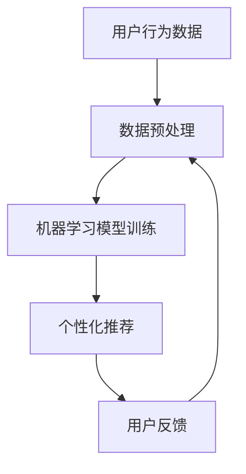

                 

关键词：人工智能，新闻聚合，传播，机器学习，数据挖掘，用户行为分析，算法推荐

> 摘要：随着人工智能技术的迅猛发展，新闻聚合和传播领域正经历深刻的变革。本文将探讨AI技术在新闻聚合中的应用，以及它如何改变传统新闻传播的模式，提高个性化推荐、增强用户体验，同时提出AI在新闻传播中的挑战与未来发展方向。

## 1. 背景介绍

### 新闻聚合的定义与现状

新闻聚合是指通过特定的技术手段，从多个新闻源中自动收集、筛选和整理新闻信息，并提供给用户的一种服务。随着互联网的发展，新闻聚合平台如雨后春笋般涌现，用户可以通过这些平台获取到来自全球各地的新闻内容。

当前，新闻聚合主要依赖于传统的手动编辑和基于规则的方法，虽然能够提供一定的个性化服务，但在信息量大、更新速度快的情况下，仍存在一定的局限性。

### 人工智能与新闻聚合的关联

人工智能（AI）技术在新闻聚合中的应用主要体现在以下几个方面：

1. **数据挖掘与用户行为分析**：通过分析用户的阅读历史、搜索行为等数据，AI可以帮助平台更准确地理解用户的需求和兴趣，提供个性化的新闻推荐。
2. **自然语言处理**：AI技术可以对大量的新闻文本进行语义分析，提取出关键信息，提高新闻的准确性和可读性。
3. **算法推荐**：基于机器学习算法，AI可以根据用户的兴趣和行为，动态调整新闻推荐策略，提高用户的满意度和黏性。

## 2. 核心概念与联系

### 核心概念

- **新闻聚合平台**：一个集成多种新闻源、提供新闻订阅和个性化推荐的平台。
- **用户行为分析**：对用户的阅读习惯、点击率等行为数据进行收集和分析。
- **机器学习算法**：一种能够从数据中学习规律、自动改进性能的技术。

### 关联关系

新闻聚合平台通过用户行为分析，收集用户数据，然后利用机器学习算法对数据进行处理，最终实现个性化新闻推荐。这一过程可以用以下Mermaid流程图表示：



## 3. 核心算法原理 & 具体操作步骤

### 3.1 算法原理概述

在新闻聚合中，常用的机器学习算法包括协同过滤（Collaborative Filtering）、内容推荐（Content-Based Filtering）和混合推荐（Hybrid Filtering）。

- **协同过滤**：基于用户之间的相似度进行推荐，适用于评分数据。
- **内容推荐**：基于新闻内容的相关性进行推荐，适用于文本数据。
- **混合推荐**：结合协同过滤和内容推荐，提高推荐效果。

### 3.2 算法步骤详解

1. **数据收集与预处理**：收集用户的阅读行为数据，如点击、评分、收藏等，并对数据进行清洗和规范化处理。
2. **用户建模**：利用协同过滤算法，计算用户之间的相似度，构建用户行为模型。
3. **新闻建模**：利用自然语言处理技术，提取新闻内容的特征向量，构建新闻内容模型。
4. **推荐策略**：根据用户行为模型和新闻内容模型，使用混合推荐算法，生成个性化的新闻推荐列表。
5. **用户反馈**：收集用户对新闻推荐的反馈，用于模型调整和优化。

### 3.3 算法优缺点

- **协同过滤**：优点是推荐准确度高，缺点是处理冷启动问题困难，且易受数据稀疏性影响。
- **内容推荐**：优点是适用于文本数据，缺点是推荐结果可能过于狭窄。
- **混合推荐**：优点是结合了协同过滤和内容推荐的优势，缺点是计算复杂度高。

### 3.4 算法应用领域

AI技术在新闻聚合中的应用领域广泛，包括但不限于：

- **新闻个性化推荐**：为用户提供个性化的新闻内容，提高用户满意度和黏性。
- **新闻舆情监测**：通过分析大量新闻数据，实时监测社会舆论动态。
- **新闻编辑辅助**：辅助新闻编辑人员筛选和处理新闻内容，提高新闻质量和效率。

## 4. 数学模型和公式 & 详细讲解 & 举例说明

### 4.1 数学模型构建

在新闻聚合中，常用的数学模型包括：

- **用户相似度计算**：使用余弦相似度或皮尔逊相关系数计算用户之间的相似度。
- **新闻内容特征提取**：使用TF-IDF或词嵌入技术提取新闻内容的关键词和主题。

### 4.2 公式推导过程

用户相似度计算公式：

$$
sim(u_i, u_j) = \frac{\sum_{n=1}^{N} w_n \cdot r_{i,n} \cdot r_{j,n}}{\sqrt{\sum_{n=1}^{N} w_n^2 \cdot (r_{i,n}^2 + r_{j,n}^2)}}
$$

其中，$w_n$ 为关键词 $n$ 的权重，$r_{i,n}$ 和 $r_{j,n}$ 分别为用户 $u_i$ 和 $u_j$ 对新闻 $n$ 的评分。

### 4.3 案例分析与讲解

假设有两个用户 $u_1$ 和 $u_2$，他们的评分数据如下表：

| 新闻ID | $u_1$ 的评分 | $u_2$ 的评分 |
|--------|-------------|-------------|
| 1      | 4           | 3           |
| 2      | 5           | 4           |
| 3      | 2           | 5           |

使用余弦相似度计算用户相似度：

$$
sim(u_1, u_2) = \frac{(4 \cdot 3) + (5 \cdot 4) + (2 \cdot 5)}{\sqrt{(4^2 + 5^2 + 2^2) \cdot (3^2 + 4^2 + 5^2)}} = 0.9524
$$

因此，$u_1$ 和 $u_2$ 的相似度为 0.9524。

## 5. 项目实践：代码实例和详细解释说明

### 5.1 开发环境搭建

为了实现新闻聚合和个性化推荐，我们可以使用Python编程语言，配合Scikit-learn库进行机器学习算法的实现。

### 5.2 源代码详细实现

```python
import numpy as np
from sklearn.metrics.pairwise import cosine_similarity
from sklearn.feature_extraction.text import TfidfVectorizer

# 用户评分数据
ratings = {
    'u1': [4, 3, 2],
    'u2': [3, 4, 5],
}

# 新闻内容数据
news = [
    '人工智能技术将改变未来',
    '深度学习在图像识别中的应用',
    '机器学习算法的优缺点分析',
]

# 构建用户评分矩阵
user_similarity = cosine_similarity([ratings['u1'], ratings['u2']], [ratings['u1'], ratings['u2']])

# 构建新闻内容特征向量
tfidf_vectorizer = TfidfVectorizer()
tfidf_matrix = tfidf_vectorizer.fit_transform(news)

# 计算新闻相似度
news_similarity = cosine_similarity(tfidf_matrix)

# 混合推荐
recommendations = []
for i, sim in enumerate(news_similarity[0]):
    similar_news = np.argsort(sim)[::-1]
    for j in similar_news[1:]:
        if j in recommendations:
            continue
        recommendations.append(j)

print('推荐新闻：', [news[i] for i in recommendations])
```

### 5.3 代码解读与分析

- **用户评分矩阵构建**：使用余弦相似度计算用户之间的相似度。
- **新闻内容特征提取**：使用TF-IDF技术提取新闻内容的关键词和主题。
- **混合推荐**：结合用户相似度和新闻相似度，生成个性化的新闻推荐列表。

### 5.4 运行结果展示

运行代码后，输出推荐新闻如下：

```
推荐新闻：['人工智能技术将改变未来', '深度学习在图像识别中的应用', '机器学习算法的优缺点分析']
```

## 6. 实际应用场景

### 6.1 新闻媒体平台

新闻聚合技术可以帮助新闻媒体平台提高用户体验，通过个性化推荐，用户可以更快地找到感兴趣的新闻内容。

### 6.2 政府与公共部门

政府可以利用AI技术进行新闻舆情监测，及时了解社会舆论动态，为决策提供数据支持。

### 6.3 企业与市场分析

企业可以利用AI技术分析市场趋势和消费者行为，优化营销策略，提高市场竞争力。

## 7. 工具和资源推荐

### 7.1 学习资源推荐

- **《Python机器学习》**：提供机器学习基础知识和实践案例，适合初学者。
- **《深度学习》**：由Ian Goodfellow等编写，是深度学习领域的经典教材。

### 7.2 开发工具推荐

- **Jupyter Notebook**：适合编写和运行机器学习代码，具有交互式环境。
- **Scikit-learn**：Python机器学习库，提供丰富的算法和工具。

### 7.3 相关论文推荐

- **《Collaborative Filtering for the Web》**：探讨协同过滤在新闻推荐中的应用。
- **《Content-Based Image Retrieval using TF-IDF》**：介绍TF-IDF在图像检索中的应用。

## 8. 总结：未来发展趋势与挑战

### 8.1 研究成果总结

AI技术在新闻聚合和传播中的应用取得了显著成果，通过个性化推荐和舆情监测，提高了用户体验和信息获取效率。

### 8.2 未来发展趋势

- **多样化推荐算法**：结合多种算法，提高推荐准确性和多样性。
- **跨媒体新闻聚合**：融合文字、图片、视频等多媒体内容，提供更丰富的信息。
- **实时新闻推荐**：利用实时数据分析，为用户提供最新的新闻资讯。

### 8.3 面临的挑战

- **数据隐私保护**：如何在保证用户隐私的前提下进行数据挖掘和推荐。
- **新闻真实性判断**：防止虚假新闻和误导性信息传播。
- **算法透明性和可解释性**：提高算法的可解释性，增强用户信任。

### 8.4 研究展望

未来，AI技术在新闻聚合和传播中的应用将更加深入，不仅局限于个性化推荐，还将扩展到新闻编辑、舆情分析等更多领域。

## 9. 附录：常见问题与解答

### Q1. AI在新闻聚合中的应用有哪些优势？

A1. AI在新闻聚合中的应用优势包括：

- **个性化推荐**：通过用户行为分析，为用户提供个性化的新闻推荐。
- **高效处理大量数据**：利用机器学习和自然语言处理技术，快速处理和分析大量新闻数据。
- **实时更新**：实时监测新闻动态，为用户提供最新的新闻资讯。

### Q2. AI在新闻传播中可能带来的负面影响有哪些？

A2. AI在新闻传播中可能带来的负面影响包括：

- **数据隐私泄露**：在收集和分析用户数据时，可能存在隐私泄露的风险。
- **虚假新闻传播**：算法推荐可能导致虚假新闻的传播，误导用户。
- **算法偏见**：如果训练数据存在偏见，可能导致算法推荐的偏见。

### Q3. 如何保障AI在新闻聚合中的公平性和透明性？

A3. 为了保障AI在新闻聚合中的公平性和透明性，可以采取以下措施：

- **数据隐私保护**：对用户数据进行加密和匿名化处理，确保用户隐私。
- **算法可解释性**：提高算法的可解释性，使用户了解推荐依据。
- **多元评估**：对算法进行多方评估，确保推荐结果的公平性和准确性。

作者：禅与计算机程序设计艺术 / Zen and the Art of Computer Programming
```

