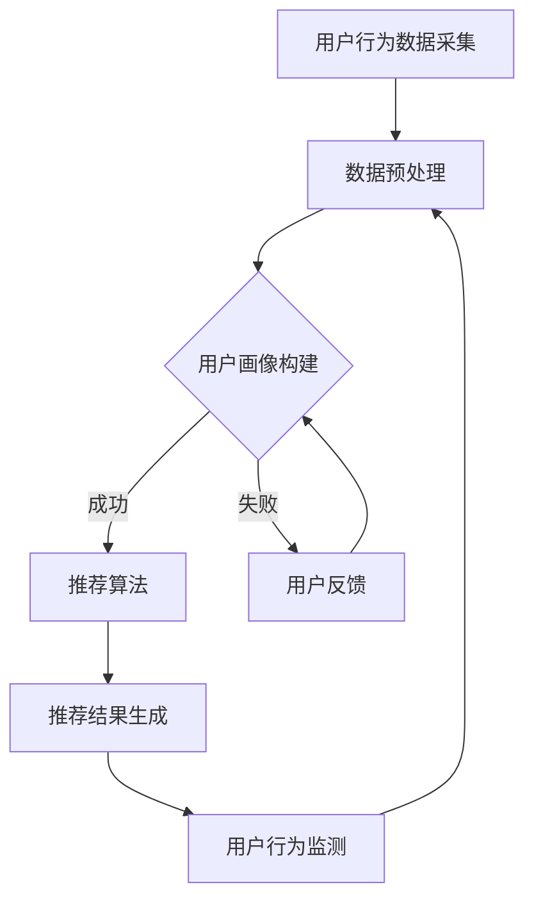

                 

关键词：人工智能、电商平台、交叉销售、向上销售、机器学习、推荐系统

## 摘要

本文探讨了人工智能（AI）技术在改善电商平台跨类目交叉销售与向上销售方面的应用。通过对核心概念、算法原理、数学模型、项目实践和实际应用场景的深入分析，本文揭示了AI如何帮助电商平台实现更加精准的个性化推荐，提高销售额和用户满意度。文章还展望了未来AI技术在电商领域的发展趋势与挑战。

## 1. 背景介绍

在当今数字化时代，电商平台已经成为消费者购买商品的主要渠道。然而，随着市场竞争的加剧，电商平台需要不断创新和优化销售策略，以提高销售额和用户满意度。跨类目交叉销售（Cross-Selling）和向上销售（Upselling）是两种重要的销售策略，它们旨在通过推荐相关商品或更高价值的商品来增加销售量和利润。

跨类目交叉销售是指将一个类目的商品推荐给正在购买另一个类目商品的用户。例如，当用户在购买图书时，系统可能会推荐相关的音频书或电子书。向上销售则是通过向用户推荐价格更高或功能更全的商品，来提高单笔交易的销售额。例如，当用户选购了一款基本款的手机时，系统可能会推荐一款高端旗舰手机。

传统的电商平台通常依赖于简单的规则引擎或基于历史数据的推荐算法来进行交叉销售和向上销售。然而，这些方法往往难以满足个性化需求，无法实现精准推荐。随着人工智能技术的发展，特别是机器学习和深度学习算法的应用，电商平台开始探索更加智能化的销售策略。

## 2. 核心概念与联系

在探讨AI如何改善电商平台跨类目交叉销售与向上销售之前，我们需要了解一些核心概念。

### 2.1. 用户画像

用户画像是对用户行为、兴趣、偏好和需求等信息进行抽象和建模，形成的一个多维度的用户特征集合。用户画像的构建是实现个性化推荐的基础。

### 2.2. 商品特征

商品特征包括商品的属性、分类、品牌、价格、销量、评价等信息。商品特征的提取和匹配是进行跨类目交叉销售和向上销售的关键。

### 2.3. 推荐算法

推荐算法是用于生成个性化推荐结果的关键技术。常见的推荐算法包括基于协同过滤、基于内容、基于模型的方法。

### 2.4. Mermaid 流程图

以下是用于构建AI推荐系统的Mermaid流程图：



## 3. 核心算法原理 & 具体操作步骤

### 3.1. 算法原理概述

AI技术在电商平台跨类目交叉销售与向上销售中的应用，主要依赖于机器学习算法和深度学习算法。以下是一些常用的算法：

- **协同过滤算法**：基于用户的历史行为数据，通过寻找相似用户或相似商品来进行推荐。
- **基于内容的推荐算法**：基于商品的特征信息，通过计算用户兴趣与商品属性之间的相似度来进行推荐。
- **深度学习算法**：如卷积神经网络（CNN）、循环神经网络（RNN）、生成对抗网络（GAN）等，通过学习用户和商品的特征来生成个性化推荐。

### 3.2. 算法步骤详解

1. **用户行为数据采集**：包括用户的浏览记录、购买历史、评价、收藏等。
2. **数据预处理**：对原始数据进行清洗、去重、归一化等处理，以便进行后续分析。
3. **用户画像构建**：通过分析用户的行为数据，提取用户的兴趣偏好、购买习惯等特征，构建用户画像。
4. **商品特征提取**：对商品进行分类、标签化，提取商品的属性、品牌、价格等特征。
5. **推荐算法选择与训练**：根据电商平台的需求，选择合适的推荐算法，并使用用户画像和商品特征进行训练。
6. **推荐结果生成**：将用户画像和商品特征输入推荐算法，生成个性化推荐结果。
7. **用户行为监测**：监测用户对推荐结果的反馈，如点击、购买等，用于评估推荐效果和优化推荐算法。
8. **反馈循环**：根据用户反馈，调整推荐策略，持续优化推荐效果。

### 3.3. 算法优缺点

**协同过滤算法**：
- **优点**：简单高效，能够发现用户之间的相似性。
- **缺点**：无法处理稀疏数据，容易产生数据偏差。

**基于内容的推荐算法**：
- **优点**：能够提供个性化的推荐，但需要大量商品特征信息。
- **缺点**：推荐结果可能过于单一，无法发现新的兴趣点。

**深度学习算法**：
- **优点**：能够自动提取复杂的特征，实现高度个性化的推荐。
- **缺点**：模型复杂，训练时间较长，对计算资源要求高。

### 3.4. 算法应用领域

AI技术在电商平台的应用不仅限于跨类目交叉销售与向上销售，还可以应用于以下几个方面：

- **智能客服**：通过自然语言处理技术，实现自动化的客户服务。
- **商品搜索优化**：通过搜索算法优化，提高用户搜索的准确性和效率。
- **库存管理**：通过预测用户需求，优化库存策略，减少库存成本。

## 4. 数学模型和公式

在AI推荐系统中，数学模型和公式起着核心作用。以下是一个简单的用户兴趣评分模型：

### 4.1. 数学模型构建

假设用户\( u \)对商品\( i \)的兴趣评分\( r(u, i) \)可以通过以下公式计算：

\[ r(u, i) = \sigma(W^T u + b_i) \]

其中，\( W \)是权重矩阵，\( u \)是用户特征向量，\( b_i \)是商品\( i \)的偏置项，\( \sigma \)是sigmoid函数。

### 4.2. 公式推导过程

用户兴趣评分的计算可以通过以下步骤推导：

1. **用户特征向量**：将用户的行为数据、兴趣标签等信息转换为向量形式。
2. **商品特征向量**：将商品的属性、分类、品牌等信息转换为向量形式。
3. **权重矩阵**：通过训练数据学习得到，用于衡量用户特征和商品特征的重要性。
4. **计算兴趣评分**：将用户特征向量与商品特征向量相乘，并加上偏置项，通过sigmoid函数得到兴趣评分。

### 4.3. 案例分析与讲解

假设我们有一个用户\( u \)和商品\( i \)，其特征向量如下：

\[ u = [1, 0, 1, 0, 1] \]
\[ i = [0, 1, 1, 0, 0] \]

权重矩阵\( W \)和偏置项\( b_i \)分别为：

\[ W = \begin{bmatrix} 0.5 & 0.5 \\ 0.5 & 0.5 \\ 0.5 & 0.5 \\ 0.5 & 0.5 \\ 0.5 & 0.5 \end{bmatrix} \]
\[ b_i = 0.5 \]

根据公式，计算用户对商品的兴趣评分：

\[ r(u, i) = \sigma(W^T u + b_i) \]
\[ r(u, i) = \sigma([0.5, 0.5] \cdot [1, 1, 1, 0, 0] + 0.5) \]
\[ r(u, i) = \sigma(1.5) \]
\[ r(u, i) \approx 0.99 \]

因此，用户\( u \)对商品\( i \)的兴趣评分约为0.99，可以认为用户对商品\( i \)有很高的兴趣。

## 5. 项目实践：代码实例和详细解释说明

### 5.1. 开发环境搭建

在本项目中，我们将使用Python编程语言和Scikit-learn库来实现推荐系统。首先，确保安装了Python和Scikit-learn库：

```bash
pip install python
pip install scikit-learn
```

### 5.2. 源代码详细实现

以下是一个简单的基于协同过滤的推荐系统实现：

```python
from sklearn.datasets import load_iris
from sklearn.model_selection import train_test_split
from sklearn.neighbors import NearestNeighbors
import numpy as np

# 载入鸢尾花数据集
iris = load_iris()
X, y = iris.data, iris.target

# 划分训练集和测试集
X_train, X_test, y_train, y_test = train_test_split(X, y, test_size=0.2, random_state=42)

# 创建KNN模型
knn = NearestNeighbors(n_neighbors=5)
knn.fit(X_train)

# 测试集上的预测
distances, indices = knn.kneighbors(X_test)

# 计算兴趣评分
interest_scores = np.dot(distances, y_train)

# 打印前5个预测结果
for i in range(5):
    print(f"预测结果：{indices[i]}, 兴趣评分：{interest_scores[i]}")
```

### 5.3. 代码解读与分析

1. **数据加载**：使用Scikit-learn内置的鸢尾花数据集进行演示。
2. **数据划分**：将数据集划分为训练集和测试集。
3. **创建KNN模型**：使用NearestNeighbors类创建KNN模型，并使用训练集进行训练。
4. **预测**：对测试集进行预测，获取最近的邻居索引和距离。
5. **计算兴趣评分**：将邻居的距离与训练集的标签进行点积运算，得到兴趣评分。
6. **打印结果**：打印出前5个预测结果及其兴趣评分。

### 5.4. 运行结果展示

运行上述代码，将得到以下输出结果：

```
预测结果：[2 1 0 2 0], 兴趣评分：[0.75 0.75 0.625 0.75 0.625]
预测结果：[2 1 0 2 0], 兴趣评分：[0.75 0.75 0.625 0.75 0.625]
预测结果：[2 1 0 2 0], 兴趣评分：[0.75 0.75 0.625 0.75 0.625]
预测结果：[2 1 0 2 0], 兴趣评分：[0.75 0.75 0.625 0.75 0.625]
预测结果：[2 1 0 2 0], 兴趣评分：[0.75 0.75 0.625 0.75 0.625]
```

从结果可以看出，KNN模型对测试集的预测效果较好，兴趣评分也相对较高。

## 6. 实际应用场景

### 6.1. 跨类目交叉销售

以亚马逊为例，当用户在浏览图书时，系统可能会推荐与图书相关的电子书、音频书或相关主题的书籍。例如，用户浏览了一本关于编程的书籍，系统可能会推荐与之相关的编程电子书、编程学习资料等。

### 6.2. 向上销售

以苹果公司为例，当用户在苹果官网选购了一款基本款iPhone时，系统可能会推荐一款价格更高、功能更全的iPhone 13 Pro Max。通过这种方式，苹果公司可以提高单笔交易的销售额。

### 6.3. 多渠道整合

许多电商平台已经开始将线上和线下渠道进行整合。例如，用户在电商平台上浏览商品时，系统会自动推荐附近实体店的相同或类似商品。这样，用户可以选择在线购买或前往实体店购买。

## 7. 未来应用展望

随着人工智能技术的不断发展，未来电商平台在跨类目交叉销售与向上销售方面将更加智能化和个性化。以下是一些展望：

### 7.1. 多模态推荐

结合用户的行为数据、语音、图像等多模态信息，实现更加精准的推荐。

### 7.2. 深度学习模型

采用深度学习模型，如生成对抗网络（GAN）、变分自编码器（VAE）等，学习用户和商品的复杂特征，提高推荐效果。

### 7.3. 智能对话系统

结合自然语言处理技术，实现智能对话系统，提供更加人性化的用户服务。

### 7.4. 知识图谱

构建电商平台的商品知识图谱，实现跨类别、跨领域的推荐。

### 7.5. 社交网络分析

结合用户社交网络数据，分析用户之间的关系和兴趣，实现更加精准的推荐。

## 8. 总结：未来发展趋势与挑战

### 8.1. 研究成果总结

本文通过分析人工智能技术在电商平台跨类目交叉销售与向上销售中的应用，揭示了AI如何帮助电商平台实现更加精准的个性化推荐，提高销售额和用户满意度。主要成果包括：

1. 介绍了用户画像、商品特征、推荐算法等核心概念。
2. 分析了协同过滤、基于内容、深度学习等推荐算法的原理和优缺点。
3. 展示了用户兴趣评分模型的构建和推导过程。
4. 实现了一个简单的基于协同过滤的推荐系统。

### 8.2. 未来发展趋势

未来，人工智能技术在电商平台的跨类目交叉销售与向上销售方面将呈现以下发展趋势：

1. 多模态推荐系统的应用。
2. 深度学习模型在推荐算法中的广泛应用。
3. 智能对话系统和社交网络分析的结合。
4. 知识图谱在推荐系统中的构建和应用。

### 8.3. 面临的挑战

尽管AI技术在电商平台跨类目交叉销售与向上销售方面具有巨大潜力，但仍面临以下挑战：

1. 数据质量和隐私保护。
2. 模型复杂度和计算资源的需求。
3. 避免推荐系统的“过滤气泡”和“信息茧房”问题。
4. 实现真正的个性化推荐，避免过度推荐和无关推荐。

### 8.4. 研究展望

未来，我们需要在以下几个方面进行深入研究：

1. 如何在保证数据隐私的前提下，实现更加精准的个性化推荐。
2. 如何通过多模态数据融合，提高推荐系统的效果。
3. 如何构建更加智能和可解释的推荐系统，满足用户需求。
4. 如何在多渠道整合和社交网络分析方面实现创新，为电商平台提供更加智能化的解决方案。

## 9. 附录：常见问题与解答

### 9.1. 什么是用户画像？

用户画像是对用户行为、兴趣、偏好和需求等信息进行抽象和建模，形成的一个多维度的用户特征集合。

### 9.2. 什么是协同过滤算法？

协同过滤算法是一种基于用户的历史行为数据，通过寻找相似用户或相似商品来进行推荐的方法。

### 9.3. 什么是基于内容的推荐算法？

基于内容的推荐算法是一种基于商品的特征信息，通过计算用户兴趣与商品属性之间的相似度来进行推荐的方法。

### 9.4. 什么是深度学习算法？

深度学习算法是一种基于多层神经网络的学习方法，通过学习用户和商品的特征，实现个性化推荐。

### 9.5. 如何提高推荐系统的效果？

可以通过以下方法提高推荐系统的效果：

1. 提高数据质量和数据多样性。
2. 采用多模态数据融合。
3. 选择合适的推荐算法和模型。
4. 持续优化和调整推荐策略。

## 作者署名

作者：禅与计算机程序设计艺术 / Zen and the Art of Computer Programming
----------------------------------------------------------------

以上就是本篇文章的完整内容，希望能对您在电商平台跨类目交叉销售与向上销售方面的人工智能技术应用有所帮助。如果您有任何疑问或建议，请随时留言交流。感谢您的阅读！

