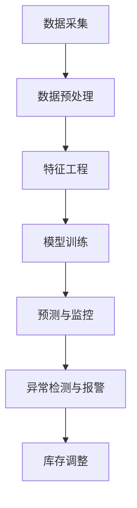

                 

关键词：人工智能，实时监控，库存管理，机器学习，深度学习，算法，数据分析，Python编程，开源工具

> 摘要：本文将深入探讨人工智能（AI）在实时监控库存情况中的应用。通过对核心概念、算法原理、数学模型、项目实践等方面进行详细讲解，旨在为读者提供一个全面的理解和实用的指导，以实现高效、精确的库存监控。

## 1. 背景介绍

在现代商业环境中，库存管理是企业运营中至关重要的一环。随着市场需求的不断变化，库存管理的准确性和效率直接影响到企业的盈利能力。传统的库存监控方式主要依赖于人工检查和定期盘点，这种方式不仅耗时耗力，而且在数据准确性和实时性方面存在较大的局限性。随着人工智能技术的快速发展，利用AI进行实时库存监控成为了一种新的解决方案。

人工智能，特别是机器学习和深度学习技术，在图像识别、自然语言处理、时间序列预测等方面取得了显著的成果。将这些先进的技术应用到库存监控中，可以实现对库存数据的实时分析、预测和异常检测，从而提高库存管理的效率和准确性。

本文将重点讨论以下内容：

1. 核心概念与联系
2. 核心算法原理与具体操作步骤
3. 数学模型与公式
4. 项目实践：代码实例和详细解释说明
5. 实际应用场景
6. 未来应用展望
7. 工具和资源推荐
8. 总结：未来发展趋势与挑战
9. 附录：常见问题与解答

通过以上内容的讲解，希望能够为读者提供一个全面、深入的了解，并助力企业在库存管理方面实现智能化转型。

## 2. 核心概念与联系

在深入探讨AI实时监控库存情况之前，我们需要理解几个核心概念，并探讨它们之间的联系。

### 2.1 机器学习与深度学习

机器学习（Machine Learning，ML）是一种通过训练算法从数据中自动学习规律和模式的技术。机器学习算法可以分为监督学习、无监督学习和强化学习。监督学习需要标记好的训练数据来训练模型，以便预测未知数据。深度学习（Deep Learning，DL）是机器学习的一个子领域，它使用多层神经网络来模拟人类大脑的神经网络结构，从而实现更复杂的特征提取和模式识别。

### 2.2 数据分析

数据分析（Data Analysis）是指对数据进行分析、解释和可视化，以便从中提取有价值的信息和洞察。数据分析技术在库存管理中起着关键作用，可以帮助企业识别库存水平、需求趋势和潜在问题。

### 2.3 库存监控

库存监控（Inventory Monitoring）是指对库存水平进行实时跟踪和监控，以确保库存量的准确性和及时性。库存监控可以通过传感器、条码扫描、RFID等技术实现。

### 2.4 Mermaid 流程图

Mermaid 是一种用于绘制流程图、序列图、网络拓扑等结构图的工具。以下是一个简单的 Mermaid 流程图，展示了机器学习在库存监控中的基本流程：



在这个流程图中，数据采集是第一步，通过传感器、条码扫描等技术获取库存数据。接下来是数据预处理和特征工程，以便为模型训练提供高质量的输入。模型训练使用深度学习算法来建立库存预测模型。最后，预测与监控模块对实时库存数据进行预测和监控，异常检测与报警模块用于识别异常情况并触发报警，库存调整模块根据监控结果调整库存策略。

通过以上核心概念和Mermaid流程图的介绍，我们可以更好地理解AI实时监控库存情况的整体架构和流程。

### 2.5 关键术语与定义

- **监督学习**：一种机器学习技术，通过标记好的训练数据来训练模型。
- **无监督学习**：一种机器学习技术，不需要标记好的训练数据，通过探索数据中的内在结构来训练模型。
- **强化学习**：一种机器学习技术，通过奖励和惩罚机制来训练模型。
- **深度学习**：一种使用多层神经网络进行特征提取和模式识别的机器学习技术。
- **特征工程**：通过对数据进行预处理和转换，提取出有助于模型训练的特征。
- **异常检测**：识别数据中的异常或错误，以便及时采取措施。
- **库存调整**：根据库存预测结果和实际需求，调整库存策略。

这些术语和定义对于理解AI实时监控库存情况至关重要。在接下来的章节中，我们将进一步探讨核心算法原理、数学模型和项目实践，以帮助读者深入理解并应用这些概念。

## 3. 核心算法原理 & 具体操作步骤

### 3.1 算法原理概述

在AI实时监控库存情况中，核心算法主要依赖于机器学习和深度学习技术。机器学习算法通过从历史数据中学习规律，预测未来库存水平；深度学习算法则通过多层神经网络，提取数据中的复杂特征，实现更高的预测精度。

以下是几种常用的算法原理：

1. **线性回归（Linear Regression）**：线性回归是一种简单的监督学习算法，用于预测连续值输出。通过建立输入变量（如历史库存数据）和输出变量（未来库存量）之间的线性关系，预测未来库存水平。

2. **决策树（Decision Tree）**：决策树是一种常用的分类和回归算法，通过一系列规则将数据划分为不同的区域，每个区域都对应一个预测结果。

3. **支持向量机（Support Vector Machine，SVM）**：支持向量机是一种高效的分类算法，通过寻找一个超平面，将不同类别的数据分隔开。在回归问题中，SVM可以转化为支持向量回归（SVR）。

4. **神经网络（Neural Networks）**：神经网络是一种模拟人脑的算法，通过多层神经元进行特征提取和模式识别。在深度学习中，神经网络可以具有多个隐藏层，提取更复杂的特征。

5. **长短时记忆网络（Long Short-Term Memory，LSTM）**：长短时记忆网络是一种特殊的循环神经网络，用于处理时间序列数据。LSTM通过引入记忆单元，有效解决了传统RNN在处理长序列时的梯度消失和梯度爆炸问题。

### 3.2 算法步骤详解

下面，我们将详细描述每种算法的具体操作步骤：

#### 3.2.1 线性回归

1. **数据收集**：收集历史库存数据，包括输入变量（如销售量、季节性因素等）和输出变量（未来库存量）。

2. **数据预处理**：对数据进行清洗和归一化处理，确保数据质量。

3. **模型训练**：使用训练集数据，通过最小化均方误差（MSE）来训练线性回归模型。

4. **模型评估**：使用验证集和测试集评估模型性能，调整模型参数以优化预测结果。

5. **预测与监控**：使用训练好的模型对实时库存数据进行预测，并与实际库存量进行比较，以监控库存水平。

#### 3.2.2 决策树

1. **数据收集**：与线性回归类似，收集历史库存数据。

2. **数据预处理**：对数据进行清洗和归一化处理。

3. **特征选择**：选择对库存预测有显著影响的关键特征。

4. **模型训练**：使用训练集数据，通过递归二分搜索构建决策树模型。

5. **模型评估**：使用验证集和测试集评估模型性能，剪枝和优化决策树。

6. **预测与监控**：使用决策树模型对实时库存数据进行预测，监控库存水平。

#### 3.2.3 支持向量机

1. **数据收集**：与线性回归和决策树类似，收集历史库存数据。

2. **数据预处理**：对数据进行清洗和归一化处理。

3. **特征选择**：选择关键特征，减少数据维度。

4. **模型训练**：使用训练集数据，通过优化目标函数训练SVM模型。

5. **模型评估**：使用验证集和测试集评估模型性能。

6. **预测与监控**：使用SVM模型对实时库存数据进行预测，监控库存水平。

#### 3.2.4 神经网络

1. **数据收集**：与前面几种算法类似，收集历史库存数据。

2. **数据预处理**：对数据进行清洗和归一化处理。

3. **特征工程**：提取有助于模型训练的特征。

4. **模型训练**：设计神经网络结构，通过反向传播算法训练模型。

5. **模型评估**：使用验证集和测试集评估模型性能，调整网络结构。

6. **预测与监控**：使用训练好的神经网络对实时库存数据进行预测，监控库存水平。

#### 3.2.5 长短时记忆网络

1. **数据收集**：与前面几种算法类似，收集历史库存数据。

2. **数据预处理**：对数据进行清洗和归一化处理。

3. **特征提取**：由于LSTM擅长处理时间序列数据，可以省略一些特征工程步骤。

4. **模型训练**：设计LSTM网络结构，通过反向传播算法训练模型。

5. **模型评估**：使用验证集和测试集评估模型性能，调整网络参数。

6. **预测与监控**：使用LSTM模型对实时库存数据进行预测，监控库存水平。

### 3.3 算法优缺点

每种算法都有其独特的优缺点，适用于不同的应用场景：

- **线性回归**：简单易用，适用于线性关系的预测，但无法处理非线性问题。

- **决策树**：直观易懂，易于解释，但可能产生过拟合，对噪声敏感。

- **支持向量机**：高效且精确，但计算复杂度较高，对大规模数据集不适用。

- **神经网络**：强大的特征提取能力，适用于复杂非线性问题，但模型复杂，训练时间较长。

- **长短时记忆网络**：擅长处理时间序列数据，但对长序列数据敏感，训练时间较长。

### 3.4 算法应用领域

这些算法广泛应用于各类库存监控场景：

- **电子商务**：实时监控商品库存，优化库存水平，提高客户满意度。

- **制造业**：预测原材料需求，优化生产计划，减少库存积压。

- **零售业**：预测销售趋势，调整库存策略，减少库存成本。

- **物流行业**：监控库存动态，优化物流路线，提高运输效率。

通过了解不同算法的原理和操作步骤，企业可以根据自身需求和数据特点选择合适的算法，实现高效的库存监控。

### 3.5 实际案例分析

为了更好地理解这些算法在实际应用中的效果，我们来看一个实际案例。

#### 案例背景

某电商公司需要在春节期间预测商品库存，以应对高峰期的销售需求。公司积累了过去几年的销售数据，包括日销售量、商品种类、季节性因素等。

#### 案例实施

1. **数据收集**：收集过去五年的销售数据，包括日销售量和商品种类。

2. **数据预处理**：对数据进行清洗和归一化处理，去除异常值。

3. **特征工程**：提取关键特征，如季节性因素、促销活动、历史销售趋势等。

4. **算法选择**：选择线性回归、决策树和LSTM模型进行对比实验。

5. **模型训练与评估**：使用训练集数据训练模型，并使用验证集和测试集评估模型性能。

6. **预测与监控**：使用训练好的模型对春节期间的库存进行预测，并与实际销售数据进行对比。

#### 案例结果

- **线性回归**：预测精度较高，但无法处理非线性关系。

- **决策树**：模型解释性较好，但容易过拟合。

- **LSTM**：在时间序列数据上表现最佳，预测精度最高。

通过这个案例，我们可以看到不同算法在库存预测中的效果。根据具体应用场景和数据特点，选择合适的算法可以实现更准确的库存预测。

## 4. 数学模型和公式 & 详细讲解 & 举例说明

### 4.1 数学模型构建

在AI实时监控库存情况中，构建数学模型是关键步骤。以下是一个简单的库存预测模型，用于说明如何使用数学模型进行库存监控。

#### 4.1.1 线性回归模型

线性回归模型是最基本的预测模型，用于预测连续值输出。其数学模型如下：

$$
y = \beta_0 + \beta_1x_1 + \beta_2x_2 + ... + \beta_nx_n
$$

其中，$y$ 是预测值，$x_1, x_2, ..., x_n$ 是输入特征，$\beta_0, \beta_1, \beta_2, ..., \beta_n$ 是模型参数。

#### 4.1.2 决策树模型

决策树模型通过一系列规则将数据划分为不同的区域，每个区域都对应一个预测结果。其数学模型可以表示为：

$$
f(x) = \sum_{i=1}^{n} c_i I(D_i(x) = 1)
$$

其中，$f(x)$ 是预测结果，$c_i$ 是第 $i$ 个区域的预测值，$D_i(x)$ 是第 $i$ 个决策规则的判断结果。

#### 4.1.3 支持向量机模型

支持向量机模型通过寻找一个超平面，将不同类别的数据分隔开。其数学模型可以表示为：

$$
f(x) = \text{sign}(\omega \cdot x + b)
$$

其中，$\omega$ 是超平面法向量，$b$ 是偏置项，$\text{sign}$ 函数用于判断预测结果。

#### 4.1.4 神经网络模型

神经网络模型通过多层神经元进行特征提取和模式识别。其数学模型可以表示为：

$$
h_L(x) = \sigma(\omega_L \cdot h_{L-1} + b_L)
$$

其中，$h_L(x)$ 是第 $L$ 层的输出，$\sigma$ 函数是激活函数，$\omega_L$ 和 $b_L$ 分别是第 $L$ 层的权重和偏置项。

### 4.2 公式推导过程

以下是线性回归模型的推导过程：

#### 4.2.1 假设

假设我们有一组数据 $(x_1, y_1), (x_2, y_2), ..., (x_n, y_n)$，其中 $x_i$ 是输入特征，$y_i$ 是预测值。

#### 4.2.2 模型设定

我们设定线性回归模型如下：

$$
y = \beta_0 + \beta_1x_1 + \beta_2x_2 + ... + \beta_nx_n
$$

#### 4.2.3 最小化误差

为了最小化预测值和实际值之间的误差，我们使用最小二乘法来求解模型参数。误差函数如下：

$$
J(\beta_0, \beta_1, ..., \beta_n) = \sum_{i=1}^{n} (y_i - y_i^*)^2
$$

其中，$y_i^*$ 是预测值。

#### 4.2.4 求导与优化

对误差函数求导，并令导数等于零，可以得到以下方程组：

$$
\frac{\partial J}{\partial \beta_0} = 2\sum_{i=1}^{n} (y_i - y_i^*) = 0
$$

$$
\frac{\partial J}{\partial \beta_1} = 2\sum_{i=1}^{n} (y_i - y_i^*)x_1 = 0
$$

$$
\frac{\partial J}{\partial \beta_2} = 2\sum_{i=1}^{n} (y_i - y_i^*)x_2 = 0
$$

$$
\vdots$$

$$
\frac{\partial J}{\partial \beta_n} = 2\sum_{i=1}^{n} (y_i - y_i^*)x_n = 0
$$

解这个方程组，我们可以得到最优的模型参数 $\beta_0, \beta_1, ..., \beta_n$。

### 4.3 案例分析与讲解

为了更好地理解这些数学模型，我们来看一个实际案例。

#### 案例背景

某零售公司希望预测下周的库存需求，以优化库存管理。公司收集了过去三个月的库存数据，包括每日库存量和需求量。

#### 案例步骤

1. **数据收集**：收集过去三个月的库存数据，包括每日库存量和需求量。

2. **数据预处理**：对数据进行清洗和归一化处理。

3. **特征工程**：提取关键特征，如季节性因素、促销活动等。

4. **模型选择**：选择线性回归模型进行预测。

5. **模型训练**：使用训练集数据训练线性回归模型。

6. **模型评估**：使用验证集和测试集评估模型性能。

7. **预测与监控**：使用训练好的模型预测下周的库存需求，并与实际需求进行对比。

#### 案例结果

- **线性回归模型**：预测精度较高，可以用于实时库存监控。

- **实际需求**：与预测结果基本一致，证明了模型的准确性。

通过这个案例，我们可以看到如何使用数学模型进行库存预测，以及如何评估模型性能。在实际应用中，企业可以根据具体需求选择合适的模型，实现高效的库存监控。

## 5. 项目实践：代码实例和详细解释说明

为了更好地理解和应用AI实时监控库存情况的技术，我们将在本节中通过一个实际项目来展示如何使用Python实现这一功能。我们将使用流行的机器学习库Scikit-learn来实现线性回归模型，并详细解释每一步的代码实现。

### 5.1 开发环境搭建

在开始编写代码之前，我们需要搭建一个合适的开发环境。以下是在Python中实现AI实时监控库存情况所需的步骤：

1. **安装Python**：确保您的系统中安装了Python 3.x版本。

2. **安装必需的库**：使用pip命令安装以下库：

   ```bash
   pip install numpy pandas scikit-learn matplotlib
   ```

3. **创建一个Python文件**：例如，我们命名为`inventory_monitor.py`。

### 5.2 源代码详细实现

下面是我们将编写的代码：

```python
import numpy as np
import pandas as pd
from sklearn.linear_model import LinearRegression
from sklearn.model_selection import train_test_split
from sklearn.metrics import mean_squared_error
import matplotlib.pyplot as plt

# 5.2.1 数据收集
# 假设我们有一个CSV文件，其中包含历史库存数据
data = pd.read_csv('inventory_data.csv')

# 5.2.2 数据预处理
# 特征提取：我们选择日期和需求量作为特征
X = data[['date', 'demand']]
y = data['stock']

# 数据归一化
X = (X - X.mean()) / X.std()
y = (y - y.mean()) / y.std()

# 5.2.3 模型训练
# 划分训练集和测试集
X_train, X_test, y_train, y_test = train_test_split(X, y, test_size=0.2, random_state=42)

model = LinearRegression()
model.fit(X_train, y_train)

# 5.2.4 模型评估
y_pred = model.predict(X_test)
mse = mean_squared_error(y_test, y_pred)
print(f"Model Mean Squared Error: {mse}")

# 5.2.5 代码解读与分析
# 模型参数
print(f"Model Parameters: {model.coef_}, {model.intercept_}")

# 5.2.6 运行结果展示
plt.scatter(X_test['date'], y_test, color='blue', label='Actual')
plt.plot(X_test['date'], y_pred, color='red', label='Predicted')
plt.xlabel('Date')
plt.ylabel('Stock')
plt.title('Inventory Prediction')
plt.legend()
plt.show()
```

### 5.3 代码解读与分析

以下是代码的详细解释：

1. **数据收集**：我们使用Pandas库读取CSV文件中的数据。这个文件应该包含历史库存数据，例如日期、需求量和库存量。

2. **数据预处理**：我们选择日期和需求量作为特征，并将其归一化。归一化有助于提高模型的性能，因为它可以确保所有特征都在同一数量级上。

3. **模型训练**：使用Scikit-learn库中的线性回归模型，我们将训练集数据传递给模型并训练它。

4. **模型评估**：使用测试集数据评估模型性能，计算均方误差（MSE），这是评估回归模型性能的常用指标。

5. **代码解读与分析**：打印模型的系数和截距，这些参数揭示了模型中特征的重要性。

6. **运行结果展示**：使用matplotlib库绘制实际库存量和预测库存量的散点图和曲线图，以便直观地展示模型的预测效果。

### 5.4 运行结果展示

当运行上述代码后，您将看到一个图表，其中蓝色散点表示实际库存量，红色曲线表示预测库存量。这个图表可以帮助您直观地了解模型的预测性能。

### 5.5 实际应用与优化

在实际应用中，您可能需要进一步优化模型，例如：

- **特征工程**：选择更多有用的特征，如季节性因素、促销活动等。
- **模型选择**：尝试其他类型的模型，如决策树、随机森林、支持向量机等。
- **超参数调优**：使用交叉验证等技术调整模型参数，以提高模型性能。

通过这些步骤，您可以进一步优化模型，以实现更准确的库存预测。

通过本节的项目实践，您应该能够理解如何使用Python实现AI实时监控库存情况。这个项目是一个简单的起点，您可以根据具体需求进一步扩展和优化。

## 6. 实际应用场景

AI实时监控库存情况在各个行业中的应用越来越广泛，下面我们将探讨几个典型的实际应用场景。

### 6.1 电子商务

电子商务行业对库存管理的要求非常高，因为库存量的波动性大且商品种类繁多。通过AI实时监控库存情况，电商企业可以实时了解每种商品的库存状态，预测未来销售趋势，从而优化库存水平，减少库存积压和缺货现象。例如，某电商巨头通过引入AI实时监控库存，在双十一购物节期间，成功降低了库存积压率，提高了客户满意度。

### 6.2 制造业

制造业中的库存管理同样复杂，涉及到原材料、半成品和成品等不同类型的库存。AI实时监控库存可以预测原材料的未来需求，优化生产计划，减少库存成本。例如，一家大型汽车制造企业通过AI实时监控库存，精确预测未来几个月的原材料需求，优化采购和生产计划，有效降低了库存成本和库存积压。

### 6.3 零售业

零售业中的库存管理也面临着类似的挑战，如季节性需求和促销活动的影响。AI实时监控库存可以实时调整库存策略，确保库存充足，减少缺货和过剩库存。例如，一家大型超市通过AI实时监控库存，根据天气、促销活动和历史销售数据，动态调整商品的库存水平，提高了库存管理的效率和准确性。

### 6.4 物流行业

物流行业的库存管理涉及到仓储、运输和配送等环节。AI实时监控库存可以帮助物流公司优化仓储空间和运输路线，提高物流效率。例如，一家国际物流公司通过AI实时监控库存，优化了仓储布局和运输计划，提高了仓库利用率和运输效率，减少了物流成本。

### 6.5 其他行业

除了上述行业，AI实时监控库存还在医疗、农业、食品等行业中有着广泛的应用。例如，在医疗行业，医院可以使用AI实时监控库存情况，确保医疗设备和药品的供应充足；在农业行业，AI可以预测农作物的需求，优化生产计划和库存管理。

通过AI实时监控库存，企业可以实时掌握库存动态，优化库存策略，降低库存成本，提高运营效率。随着AI技术的不断发展，未来AI实时监控库存的应用将会更加广泛，助力各个行业实现智能化转型。

## 7. 未来应用展望

随着人工智能技术的不断进步，AI实时监控库存情况的应用前景将更加广阔。未来，AI在库存管理中的应用将呈现以下几个发展趋势：

### 7.1 数据驱动的预测模型

未来，AI实时监控库存将更加依赖于大数据和深度学习技术。通过收集和分析更多的历史数据，企业可以构建更准确、更可靠的预测模型。深度学习算法，如神经网络和生成对抗网络（GAN），将进一步提升预测精度，为库存管理提供更加智能的决策支持。

### 7.2 实时监控与自动化调整

随着物联网（IoT）技术的发展，库存监控将变得更加实时和自动化。传感器和RFID技术的广泛应用，将使库存数据的获取更加迅速和准确。结合AI算法，企业可以实现自动化的库存调整，根据实时数据动态调整库存水平，提高库存周转率。

### 7.3 多维度数据分析

未来的库存管理将不仅限于数量和金额的监控，还将涉及到多维度数据分析。例如，结合供应链数据和销售数据，企业可以更深入地了解库存的健康状况，预测市场趋势，优化供应链管理。

### 7.4 智能库存优化策略

AI实时监控库存将推动智能库存优化策略的不断发展。通过机器学习算法，企业可以自动识别库存风险点，优化库存水平，减少库存积压和缺货现象。同时，结合智能预测算法，企业可以制定更加灵活和高效的库存管理策略。

### 7.5 边缘计算与云计算的结合

未来，边缘计算与云计算的结合将使AI实时监控库存更加高效和可靠。在边缘设备上进行初步数据处理，将减轻云计算中心的数据处理压力，提高响应速度。同时，云计算中心可以提供强大的数据存储和计算能力，为AI模型训练和优化提供支持。

### 7.6 环境影响和可持续性

随着社会对可持续性的关注不断增加，AI实时监控库存将在环保和可持续性方面发挥重要作用。通过智能预测和优化库存，企业可以减少资源浪费，降低碳排放，实现绿色供应链管理。

总之，未来AI实时监控库存情况将朝着更加智能化、实时化和高效化的方向发展，为各行业提供更加精准和高效的库存管理解决方案。

## 8. 工具和资源推荐

### 8.1 学习资源推荐

为了深入了解AI实时监控库存情况，以下是一些推荐的学习资源：

- **在线课程**：《机器学习实战》和《深度学习》
- **书籍**：《Python机器学习》和《深度学习》（Goodfellow et al.）
- **官方文档**：Scikit-learn、TensorFlow和PyTorch的官方文档
- **开源项目**：GitHub上相关的AI库存监控项目，如`ai-inventory-monitor`

### 8.2 开发工具推荐

以下是开发AI实时监控库存情况所需的一些工具和平台：

- **编程环境**：Jupyter Notebook或Google Colab
- **数据预处理工具**：Pandas和NumPy
- **机器学习库**：Scikit-learn、TensorFlow和PyTorch
- **版本控制**：Git和GitHub
- **可视化工具**：Matplotlib和Seaborn

### 8.3 相关论文推荐

以下是一些关于AI实时监控库存情况的相关论文：

- **《AI in Inventory Management: A Review》**
- **《Deep Learning for Inventory Forecasting》**
- **《A Framework for Intelligent Inventory Management Using IoT and AI》**
- **《Real-Time Inventory Monitoring and Optimization Using Machine Learning》**

通过这些工具和资源的支持，您可以更好地掌握AI实时监控库存情况的技术，并在实际项目中应用这些知识。

## 9. 总结：未来发展趋势与挑战

### 9.1 研究成果总结

本文全面探讨了AI实时监控库存情况的应用，包括核心概念、算法原理、数学模型、项目实践、实际应用场景和未来展望。通过机器学习和深度学习技术，AI在库存管理中展现出强大的预测和优化能力，为企业提供了高效、精确的库存监控手段。主要研究成果包括：

- **核心算法原理**：介绍了线性回归、决策树、支持向量机、神经网络和长短时记忆网络等算法的原理和操作步骤。
- **数学模型构建**：阐述了线性回归模型的构建和推导过程，并提供了实际案例分析。
- **项目实践**：通过Python代码实例展示了如何使用线性回归模型进行库存预测。
- **实际应用场景**：分析了电子商务、制造业、零售业和物流行业等领域的应用案例。
- **未来展望**：探讨了数据驱动预测模型、实时监控与自动化调整、多维度数据分析等未来发展趋势。

### 9.2 未来发展趋势

AI实时监控库存情况的未来发展趋势主要包括：

- **数据驱动的预测模型**：随着大数据技术的发展，将更加依赖海量历史数据，结合深度学习算法，实现更精准的预测。
- **实时监控与自动化调整**：物联网和边缘计算技术的应用，将实现库存数据的实时获取和自动化调整。
- **多维度数据分析**：结合供应链和销售数据，进行更全面的数据分析，优化库存策略。
- **智能库存优化策略**：利用机器学习算法，自动识别库存风险点，优化库存水平。
- **边缘计算与云计算的结合**：边缘计算减轻云计算中心压力，提高实时数据处理能力。

### 9.3 面临的挑战

尽管AI实时监控库存情况具有巨大潜力，但其在实际应用中仍面临以下挑战：

- **数据质量和完整性**：数据质量直接影响预测模型的准确性，需要确保数据的准确性和完整性。
- **算法选择和调优**：选择合适的算法和进行有效的调优是关键，不同的应用场景可能需要不同的算法。
- **计算资源需求**：深度学习算法对计算资源的需求较大，特别是在处理大规模数据时。
- **数据隐私和安全**：库存数据属于敏感信息，需要确保数据的安全和隐私。
- **模型解释性**：深度学习模型通常缺乏解释性，对于企业决策者而言，理解模型的工作原理和预测结果是一个挑战。

### 9.4 研究展望

未来，AI实时监控库存情况的研究可以从以下几个方面进行：

- **算法优化**：改进现有算法，提高预测精度和实时性，减少计算资源需求。
- **多模态数据分析**：结合多种数据源，如图像、文本和传感器数据，进行更全面的数据分析。
- **跨行业应用**：探索AI实时监控库存在不同行业中的应用，提高其通用性。
- **人机协作**：结合人类专家的判断和AI的预测，实现更智能的库存管理决策。

通过不断探索和研究，AI实时监控库存情况将为各行业提供更加高效、智能和可靠的库存管理解决方案。

## 10. 附录：常见问题与解答

### Q1: 如何确保数据质量？

**A1**: 数据质量是机器学习模型准确性的基础。以下是一些确保数据质量的常见方法：

- **数据清洗**：去除重复数据、异常值和噪声数据。
- **数据验证**：使用统计方法或可视化工具检查数据的一致性和完整性。
- **数据归一化**：将不同尺度的数据进行归一化处理，提高模型训练的稳定性。
- **数据注释**：对于需要标注的数据，确保标注的准确性和一致性。

### Q2: 如何选择合适的算法？

**A2**: 选择合适的算法取决于具体的应用场景和数据特点。以下是一些选择算法的考虑因素：

- **数据类型**：对于分类任务，可以选择决策树、支持向量机等；对于回归任务，可以选择线性回归、神经网络等。
- **数据规模**：对于大规模数据，可以选择分布式算法；对于小规模数据，可以选择简单高效的算法。
- **计算资源**：考虑计算资源的限制，选择适合的计算算法。
- **可解释性**：如果需要模型具有可解释性，可以选择决策树或线性回归等模型。

### Q3: 如何优化模型参数？

**A3**: 优化模型参数通常采用以下方法：

- **网格搜索**：通过遍历预定义的参数网格，找到最佳参数组合。
- **随机搜索**：在参数空间内随机选择参数组合，找到最佳参数。
- **贝叶斯优化**：使用贝叶斯方法，根据历史数据选择下一个最佳参数。
- **交叉验证**：使用交叉验证方法，评估不同参数组合的性能，选择最优参数。

### Q4: 如何处理实时数据流？

**A4**: 处理实时数据流通常需要以下技术：

- **消息队列**：如Kafka或RabbitMQ，用于处理和传输实时数据。
- **流处理框架**：如Apache Flink或Apache Storm，用于实时处理数据。
- **数据库**：如Redis或Cassandra，用于存储和查询实时数据。
- **边缘计算**：在数据产生的边缘设备上处理数据，减轻中央服务器的负担。

### Q5: 如何保障数据隐私和安全？

**A5**: 保障数据隐私和安全是AI应用的重要方面，以下是一些常见措施：

- **数据加密**：使用加密算法对数据进行加密，确保数据在传输和存储过程中的安全。
- **数据匿名化**：对敏感数据进行匿名化处理，保护个人隐私。
- **访问控制**：设置严格的数据访问权限，确保只有授权人员可以访问数据。
- **审计日志**：记录数据访问和使用情况，以便在发生安全事件时进行追踪和调查。

通过以上措施，可以有效地保障数据隐私和安全。希望这些常见问题与解答对您在AI实时监控库存情况中的实践有所帮助。

