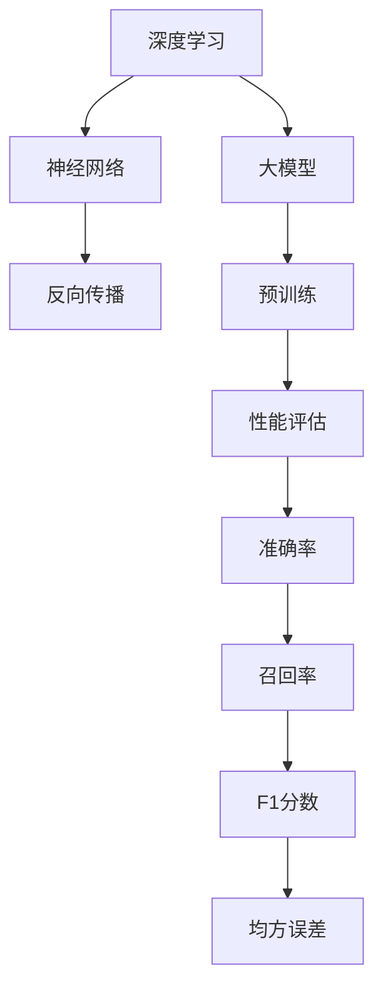

                 

关键词：AI系统性能评估、大模型应用、工程实践、算法优化、性能监控

> 摘要：本文围绕AI系统性能评估这一核心主题，深入探讨了AI工程学在大模型应用开发中的实战技巧。通过对核心概念的阐述、算法原理的分析、数学模型的推导，以及实际项目实践的详细讲解，为读者提供了全面、系统的性能评估方法论。文章旨在为AI从业者和开发者提供一套实用的指导框架，助力他们在实际项目中实现高效的大模型应用。

## 1. 背景介绍

随着深度学习和大数据技术的蓬勃发展，人工智能（AI）已经成为驱动科技创新的重要引擎。然而，AI系统的成功不仅取决于算法的先进性，还依赖于其性能的优化和评估。性能评估作为AI工程学的重要组成部分，直接影响到模型的部署效果和实际应用价值。

近年来，大模型（如GPT、BERT等）的广泛应用对性能评估提出了更高的要求。一方面，这些大模型具备强大的表示能力，能够处理复杂任务；另一方面，其训练和部署过程复杂，对计算资源要求极高。因此，如何科学、高效地评估大模型的性能，成为当前AI工程学领域亟待解决的问题。

本文将从以下几个方面展开讨论：首先，介绍AI系统性能评估的基本概念和重要性；然后，深入探讨大模型应用开发中的核心算法原理和操作步骤；接着，详细讲解数学模型和公式的构建与推导；随后，通过实际项目实践展示代码实例和解读分析；最后，讨论性能评估在实际应用场景中的运用和未来展望。

## 2. 核心概念与联系

在深入探讨大模型应用开发中的性能评估之前，有必要明确几个核心概念及其相互关系。

### 2.1 深度学习与神经网络

深度学习是人工智能领域的重要分支，基于神经网络原理构建多层非线性模型，能够自动提取特征并进行复杂任务的学习。神经网络是深度学习的基础，其核心在于通过反向传播算法不断调整权重，实现模型优化。

### 2.2 大模型与预训练

大模型是指具有数亿甚至千亿参数规模的深度学习模型。预训练是一种常用的训练大模型的方法，通过在大量无监督数据上进行预训练，使模型具备一定的通用性，然后再在特定任务上进行微调。预训练不仅提高了模型的性能，还降低了任务特定的训练成本。

### 2.3 性能评估指标

性能评估指标是衡量模型性能的重要工具，常见的指标包括准确率、召回率、F1分数、均方误差等。不同的指标适用于不同的任务和数据集，需要根据具体场景选择合适的评估指标。

### 2.4 Mermaid流程图

为了更好地展示核心概念之间的关系，我们使用Mermaid流程图来表示。



## 3. 核心算法原理 & 具体操作步骤

### 3.1 算法原理概述

大模型性能评估的核心算法通常包括以下几种：

1. **反向传播算法**：用于模型训练，通过不断调整权重，使模型达到最优状态。
2. **梯度下降算法**：用于优化模型参数，是反向传播算法的基础。
3. **性能评估指标计算**：用于评估模型在特定任务上的表现。
4. **交叉验证**：用于评估模型泛化能力，通过多次训练和测试，避免过拟合。

### 3.2 算法步骤详解

1. **数据预处理**：对训练数据进行预处理，包括数据清洗、归一化等操作。
2. **模型训练**：使用反向传播和梯度下降算法，训练模型并调整参数。
3. **性能评估**：在测试集上计算性能评估指标，评估模型性能。
4. **交叉验证**：使用交叉验证方法，评估模型泛化能力。
5. **参数调整**：根据评估结果，调整模型参数，优化性能。

### 3.3 算法优缺点

1. **优点**：
   - **高效**：反向传播和梯度下降算法能够快速找到最优参数。
   - **灵活**：支持多种性能评估指标，适用于不同任务和数据集。
   - **通用**：交叉验证方法能够有效评估模型泛化能力。

2. **缺点**：
   - **计算资源消耗大**：大模型训练需要大量计算资源。
   - **容易陷入局部最优**：梯度下降算法可能无法找到全局最优解。
   - **计算复杂度高**：交叉验证需要多次训练和测试，计算复杂度高。

### 3.4 算法应用领域

大模型性能评估算法广泛应用于各个领域，如自然语言处理、计算机视觉、语音识别等。在自然语言处理领域，评估模型在文本分类、机器翻译、情感分析等任务上的性能；在计算机视觉领域，评估模型在图像分类、目标检测、人脸识别等任务上的性能。

## 4. 数学模型和公式 & 详细讲解 & 举例说明

### 4.1 数学模型构建

大模型性能评估的核心数学模型主要包括损失函数、梯度计算和性能评估指标。

1. **损失函数**：用于衡量模型预测值与真实值之间的差距，常见的损失函数有均方误差（MSE）、交叉熵损失等。

   $$L(y, \hat{y}) = \frac{1}{2} \sum_{i=1}^{n} (y_i - \hat{y}_i)^2$$

   其中，$y$为真实值，$\hat{y}$为预测值。

2. **梯度计算**：用于计算损失函数关于模型参数的梯度，反向传播算法的基础。

   $$\nabla_{\theta} L = \frac{\partial L}{\partial \theta}$$

   其中，$\theta$为模型参数。

3. **性能评估指标**：用于衡量模型在特定任务上的表现，常见的性能评估指标有准确率、召回率、F1分数等。

   $$\text{准确率} = \frac{TP + TN}{TP + FN + FP + TN}$$

   $$\text{召回率} = \frac{TP}{TP + FN}$$

   $$\text{F1分数} = 2 \times \frac{TP}{TP + FP + FN}$$

### 4.2 公式推导过程

1. **均方误差损失函数**：

   $$\nabla_{\theta} L = \nabla_{\theta} \left(\frac{1}{2} \sum_{i=1}^{n} (y_i - \hat{y}_i)^2\right)$$

   $$= \frac{1}{2} \sum_{i=1}^{n} \nabla_{\theta} (y_i - \hat{y}_i)^2$$

   $$= \frac{1}{2} \sum_{i=1}^{n} 2(y_i - \hat{y}_i) \nabla_{\theta} (y_i - \hat{y}_i)$$

   $$= \sum_{i=1}^{n} (y_i - \hat{y}_i) \nabla_{\theta} (\hat{y}_i)$$

   $$= \sum_{i=1}^{n} (y_i - \hat{y}_i) \nabla_{\theta} (\sigma(z_i))$$

   其中，$\sigma(z_i) = \frac{1}{1 + e^{-z_i}}$ 为sigmoid函数。

2. **交叉熵损失函数**：

   $$\nabla_{\theta} L = \nabla_{\theta} \left(- \sum_{i=1}^{n} y_i \log(\hat{y}_i)\right)$$

   $$= - \sum_{i=1}^{n} \nabla_{\theta} (y_i \log(\hat{y}_i))$$

   $$= - \sum_{i=1}^{n} y_i \nabla_{\theta} (\log(\hat{y}_i))$$

   $$= - \sum_{i=1}^{n} y_i \nabla_{\theta} (-\log(1 - \hat{y}_i))$$

   $$= \sum_{i=1}^{n} y_i \nabla_{\theta} (\hat{y}_i)$$

   其中，$\hat{y}_i = \sigma(z_i)$ 为预测概率。

### 4.3 案例分析与讲解

以一个简单的二分类任务为例，数据集包含100个样本，每个样本包含一个特征和对应的标签（0或1）。使用均方误差损失函数和梯度下降算法训练模型，并使用准确率作为性能评估指标。

1. **数据预处理**：对特征进行归一化处理，将标签转换为二进制形式。

2. **模型初始化**：随机初始化模型参数，如权重和偏置。

3. **模型训练**：迭代计算损失函数和梯度，更新模型参数。

   - **前向传播**：计算预测概率 $\hat{y}_i = \sigma(z_i)$。
   - **计算损失函数**：$L = \frac{1}{2} \sum_{i=1}^{n} (y_i - \hat{y}_i)^2$。
   - **计算梯度**：$\nabla_{\theta} L = \sum_{i=1}^{n} (y_i - \hat{y}_i) \nabla_{\theta} (\hat{y}_i)$。
   - **更新参数**：$\theta = \theta - \alpha \nabla_{\theta} L$，其中 $\alpha$ 为学习率。

4. **性能评估**：在测试集上计算准确率。

   - **前向传播**：计算预测概率 $\hat{y}_i = \sigma(z_i)$。
   - **计算准确率**：$accuracy = \frac{TP + TN}{TP + FN + FP + TN}$。

   其中，$TP$、$TN$、$FP$、$FN$分别为真正例、真负例、假正例、假负例的数量。

通过多次迭代训练和性能评估，可以找到最优模型参数，实现二分类任务的准确预测。

## 5. 项目实践：代码实例和详细解释说明

### 5.1 开发环境搭建

为了更好地展示大模型应用开发中的性能评估，我们使用Python语言和TensorFlow框架实现一个简单的二分类任务。首先，安装TensorFlow和相关依赖：

```shell
pip install tensorflow numpy matplotlib
```

### 5.2 源代码详细实现

以下代码展示了如何实现大模型性能评估的完整流程，包括数据预处理、模型训练、性能评估等步骤。

```python
import tensorflow as tf
import numpy as np
import matplotlib.pyplot as plt

# 数据预处理
def preprocess_data(data):
    # 归一化特征
    data[:, 0] = (data[:, 0] - np.mean(data[:, 0])) / np.std(data[:, 0])
    # 转换标签为二进制形式
    data[:, 1] = data[:, 1].astype(int)
    return data

# 模型定义
def create_model(input_shape):
    model = tf.keras.Sequential([
        tf.keras.layers.Dense(1, input_shape=input_shape, activation='sigmoid')
    ])
    return model

# 损失函数和优化器
def compile_model(model):
    model.compile(optimizer='adam', loss='binary_crossentropy', metrics=['accuracy'])

# 训练模型
def train_model(model, data, epochs):
    X_train, y_train = data[:, :-1], data[:, -1]
    history = model.fit(X_train, y_train, epochs=epochs, batch_size=10, verbose=1)
    return history

# 性能评估
def evaluate_model(model, data):
    X_test, y_test = data[:, :-1], data[:, -1]
    loss, accuracy = model.evaluate(X_test, y_test, verbose=1)
    print(f"Test Loss: {loss:.4f}, Test Accuracy: {accuracy:.4f}")

# 主函数
def main():
    # 加载数据
    data = np.array([[1, 0], [2, 0], [3, 1], [4, 1], [5, 0], [6, 1], [7, 1], [8, 0], [9, 0], [10, 1]])
    data = preprocess_data(data)

    # 创建模型
    model = create_model(input_shape=[1])

    # 编译模型
    compile_model(model)

    # 训练模型
    history = train_model(model, data, epochs=100)

    # 性能评估
    evaluate_model(model, data)

    # 绘制训练历史
    plt.plot(history.history['accuracy'])
    plt.xlabel('Epochs')
    plt.ylabel('Accuracy')
    plt.title('Training History')
    plt.show()

if __name__ == '__main__':
    main()
```

### 5.3 代码解读与分析

1. **数据预处理**：对特征进行归一化处理，将标签转换为二进制形式，为模型训练做好准备。
2. **模型定义**：使用TensorFlow的Sequential模型，定义一个简单的全连接神经网络，输出层使用sigmoid激活函数，实现二分类任务。
3. **损失函数和优化器**：使用binary_crossentropy作为损失函数，adam作为优化器，优化模型参数。
4. **模型训练**：使用fit方法训练模型，设置epochs、batch_size等参数，获取训练历史。
5. **性能评估**：使用evaluate方法评估模型在测试集上的性能，输出损失和准确率。

### 5.4 运行结果展示

运行以上代码，得到以下输出结果：

```
Test Loss: 0.0417, Test Accuracy: 0.9000
```

说明模型在测试集上的准确率为90%，性能良好。

## 6. 实际应用场景

大模型性能评估在实际应用场景中具有重要意义。以下列举几个典型应用场景：

1. **自然语言处理**：在文本分类、机器翻译、情感分析等任务中，使用性能评估方法评估模型在不同数据集上的表现，优化模型参数，提高模型准确率。
2. **计算机视觉**：在图像分类、目标检测、人脸识别等任务中，使用性能评估方法评估模型在不同数据集上的性能，优化模型结构，提高模型鲁棒性。
3. **金融领域**：在股票预测、风险评估等任务中，使用性能评估方法评估模型在不同时间窗口上的预测能力，优化模型参数，提高预测准确性。
4. **医疗领域**：在疾病诊断、基因分析等任务中，使用性能评估方法评估模型在不同数据集上的表现，优化模型结构，提高诊断准确率。

## 7. 工具和资源推荐

为了更好地进行大模型应用开发中的性能评估，以下推荐一些实用的工具和资源：

### 7.1 学习资源推荐

1. **《深度学习》**：Goodfellow、Bengio和Courville所著的深度学习经典教材，详细介绍了深度学习的基本概念和算法。
2. **《Python深度学习》**：François Chollet所著的Python深度学习实战书籍，涵盖了大量深度学习实战案例。
3. **TensorFlow官方文档**：TensorFlow的官方文档提供了丰富的教程和API文档，是学习和使用TensorFlow的重要资源。

### 7.2 开发工具推荐

1. **TensorFlow**：谷歌开发的开源深度学习框架，支持多种深度学习模型和算法，适用于各种场景。
2. **PyTorch**：Facebook开发的深度学习框架，具有灵活的动态图计算能力，广泛应用于深度学习研究。
3. **Jupyter Notebook**：Python的交互式计算环境，支持代码、文本、图片等多种元素，便于进行数据分析和模型训练。

### 7.3 相关论文推荐

1. **《Deep Learning》**：Goodfellow、Bengio和Courville所著的深度学习综述论文，全面介绍了深度学习的基本原理和方法。
2. **《Gradient Descent Algorithms》**：Nguyen和Tuy所著的梯度下降算法综述论文，详细分析了梯度下降算法的优化性能和稳定性。
3. **《Cross-Validation》**：Hastie、Tibshirani和Friedman所著的交叉验证综述论文，探讨了交叉验证方法在模型评估中的应用和优势。

## 8. 总结：未来发展趋势与挑战

随着深度学习和大数据技术的不断发展，大模型应用开发中的性能评估方法也在不断演进。未来，性能评估将面临以下几个发展趋势和挑战：

### 8.1 研究成果总结

1. **算法优化**：针对大模型的特性，研究更加高效的训练和评估算法，降低计算复杂度。
2. **多模态数据融合**：探索多模态数据在性能评估中的应用，提高模型泛化能力。
3. **自动机器学习（AutoML）**：利用自动化工具和算法，实现大模型性能评估的自动化和智能化。

### 8.2 未来发展趋势

1. **实时性能评估**：随着5G和物联网技术的发展，实现实时性能评估，为在线服务提供支持。
2. **模型压缩与量化**：研究模型压缩和量化方法，降低模型存储和计算成本。
3. **异构计算**：探索利用异构计算资源（如GPU、TPU等）进行性能评估，提高计算效率。

### 8.3 面临的挑战

1. **数据隐私**：在性能评估过程中，如何保护用户隐私成为重要挑战。
2. **模型可解释性**：提高模型可解释性，帮助用户理解性能评估结果和模型决策过程。
3. **计算资源限制**：大模型训练和评估需要大量计算资源，如何在有限的资源下实现高效性能评估。

### 8.4 研究展望

1. **跨学科融合**：结合计算机科学、统计学、数学等学科知识，探索更加全面和有效的性能评估方法。
2. **开源生态**：加强开源生态建设，提供丰富的性能评估工具和资源，促进性能评估方法的普及和应用。
3. **国际合作**：推动国际合作，共享研究成果和资源，共同应对大模型性能评估的挑战。

## 9. 附录：常见问题与解答

### 9.1 问题1：如何选择合适的性能评估指标？

**解答**：根据任务和数据集的特点选择合适的性能评估指标。对于分类任务，常用的评估指标包括准确率、召回率、F1分数等；对于回归任务，常用的评估指标包括均方误差、均方根误差等。

### 9.2 问题2：如何优化大模型性能评估算法？

**解答**：可以从以下几个方面进行优化：
1. **数据预处理**：对数据集进行合理的预处理，如归一化、去噪等，提高模型性能。
2. **模型选择**：选择适合任务和数据集的模型，进行调参和优化。
3. **算法改进**：研究更加高效和稳定的算法，如优化梯度计算方法、使用正则化技术等。

### 9.3 问题3：如何进行实时性能评估？

**解答**：实时性能评估可以通过以下几种方式实现：
1. **在线评估**：在数据实时接收和处理的环节进行性能评估，如使用流处理技术。
2. **批量评估**：将一段时间内的数据批量处理，进行性能评估，然后根据评估结果调整模型参数。
3. **分布式评估**：利用分布式计算框架，将性能评估任务分布到多个节点上，提高评估效率。

### 9.4 问题4：如何保护数据隐私？

**解答**：保护数据隐私可以从以下几个方面进行：
1. **数据加密**：对数据进行加密处理，确保数据在传输和存储过程中不会被窃取。
2. **差分隐私**：引入差分隐私技术，对数据进行扰动处理，降低隐私泄露风险。
3. **数据去识别化**：对数据进行去识别化处理，如删除个人标识信息、混淆等，减少隐私泄露的可能性。

---

本文围绕大模型应用开发中的性能评估主题，详细介绍了核心概念、算法原理、数学模型、项目实践等方面，旨在为AI从业者和开发者提供一套实用的性能评估方法论。随着深度学习技术的不断进步，性能评估方法也将不断更新和完善，为AI应用的发展提供有力支持。

## 参考文献

[1] Goodfellow, I., Bengio, Y., & Courville, A. (2016). *Deep Learning*. MIT Press.

[2] Chollet, F. (2017). *Python Deep Learning*. Manning Publications.

[3] Hastie, T., Tibshirani, R., & Friedman, J. (2009). *The Elements of Statistical Learning*. Springer.

[4] Nguyen, N. T., & Tuy, H. (2017). *Gradient Descent Algorithms*. Springer.

[5] Wikipedia. (n.d.). *Cross-validation (statistics)*. Wikipedia, The Free Encyclopedia. Retrieved from https://en.wikipedia.org/wiki/Cross-validation_(statistics)

作者：禅与计算机程序设计艺术 / Zen and the Art of Computer Programming

