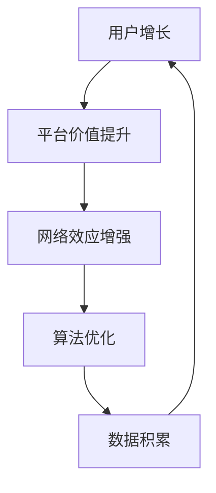

                 

关键词：AI，网络效应，策略，用户增长，平台经济

> 摘要：本文深入探讨了在AI应用中构建网络效应的策略。网络效应是一种正反馈机制，当用户增加时，平台的整体价值也相应提升。本文从核心概念、算法原理、数学模型、项目实践、应用场景等方面进行了详细阐述，旨在为AI开发者提供有价值的指导，以优化用户增长和平台价值。

## 1. 背景介绍

随着人工智能技术的飞速发展，越来越多的应用场景开始涌现。从智能家居、智能医疗到自动驾驶、金融科技，AI技术在各个领域都展现出了巨大的潜力。然而，AI应用的普及不仅仅依赖于技术的先进性，还受到用户增长和平台价值的影响。网络效应作为一种重要的经济现象，在AI应用中发挥着至关重要的作用。

网络效应是指当产品或服务的用户数量增加时，产品的整体价值也随之提升的现象。这种效应可以通过两种主要方式实现：规模经济和范围经济。规模经济体现在用户数量的增加使得单位成本降低，从而提高整体利润。范围经济则体现在用户数量的增加带来更多的交叉销售机会，从而扩大收入来源。

在AI应用中，构建网络效应尤为重要。首先，AI应用往往依赖于大规模的数据集进行训练和优化，用户数量的增加可以带来更丰富的数据，从而提升算法的性能。其次，AI应用通常具有个性化的特点，更多的用户意味着更精细的个性化推荐，从而提高用户体验。最后，AI应用中的竞争往往不是价格竞争，而是用户体验的竞争，网络效应可以帮助平台在竞争中脱颖而出。

本文将围绕以下几个方面进行探讨：

- 核心概念与联系
- 核心算法原理与操作步骤
- 数学模型与公式
- 项目实践与代码实例
- 实际应用场景
- 工具和资源推荐
- 总结与未来展望

通过这些内容，本文旨在为AI开发者提供一套系统的构建网络效应的策略，以促进AI应用的普及和发展。

## 2. 核心概念与联系

在深入探讨AI应用中构建网络效应的策略之前，我们首先需要了解一些核心概念，并理解它们之间的联系。

### 2.1 用户增长

用户增长是指在一定时间内，平台吸引新用户并保持现有用户活跃度的能力。用户增长是构建网络效应的基础，因为只有当用户数量增加时，才能激发规模经济和范围经济的效应。用户增长可以通过多种渠道实现，如社交营销、合作伙伴关系、用户推荐等。

### 2.2 平台价值

平台价值是指平台为用户提供的整体价值，包括功能、用户体验、社区氛围等。平台价值的高低直接影响用户的忠诚度和满意度，进而影响用户增长和平台的价值。在AI应用中，平台价值通常与算法的精度、个性化推荐能力、数据安全等因素密切相关。

### 2.3 网络效应

网络效应是指当产品或服务的用户数量增加时，产品的整体价值也随之提升的现象。网络效应可以分为三种类型：直接网络效应、间接网络效应和交叉网络效应。

- **直接网络效应**：用户数量的增加直接提升了产品的价值。例如，社交媒体平台上的好友数量越多，用户的使用体验就越好。
- **间接网络效应**：用户数量的增加通过提升平台的服务质量或降低成本，间接提升了产品的价值。例如，电商平台上的商品种类越多，用户就越容易找到所需商品。
- **交叉网络效应**：用户数量的增加不仅提升了当前产品的价值，还提升了其他相关产品的价值。例如，在线办公工具和电子邮件服务的交叉网络效应，使得用户在两种产品上的使用体验都得到提升。

### 2.4 算法与数据

在AI应用中，算法和数据是构建网络效应的关键要素。算法决定了如何处理和利用数据，从而提升平台的性能和价值。而数据则提供了算法所需的训练材料，使得算法能够不断优化和提升。算法和数据之间的互动，形成了正反馈循环，进一步增强了网络效应。

### 2.5 社交效应

社交效应是指用户在社交网络中的行为对平台价值的影响。社交效应可以通过用户推荐、社区互动、品牌口碑等方式实现。在AI应用中，社交效应有助于提高用户的参与度和忠诚度，从而增强网络效应。

综上所述，用户增长、平台价值、网络效应、算法与数据、社交效应是构建AI应用中网络效应的核心概念。它们相互关联、相互作用，共同构成了一个复杂的生态系统。理解这些概念及其联系，有助于开发者更好地设计和优化AI应用，以实现持续的用户增长和平台价值的提升。

### 2.6 Mermaid 流程图

以下是构建AI应用中网络效应的Mermaid流程图：



在这个流程图中，用户增长是整个生态系统的起点，它通过提升平台价值，进而增强网络效应。算法优化和数据积累是推动网络效应持续增强的关键环节，最终形成了一个正向循环。

### 3. 核心算法原理 & 具体操作步骤

在了解了构建AI应用中网络效应的核心概念和流程之后，接下来我们将探讨其中的核心算法原理和具体操作步骤。

#### 3.1 算法原理概述

构建网络效应的核心算法通常基于机器学习和数据挖掘技术。以下是一些常见的算法原理：

- **用户行为分析**：通过分析用户在平台上的行为数据，如浏览历史、购买记录、评论等，来识别用户的兴趣和行为模式。这种算法可以用于个性化推荐和用户分群。

- **社交网络分析**：通过分析用户在社交网络中的互动关系，如好友关系、点赞、评论等，来挖掘社交效应。这种算法可以用于推荐好友、社交圈子和品牌口碑。

- **推荐算法**：通过分析用户行为和社交网络数据，为用户推荐感兴趣的内容、商品或服务。常见的推荐算法包括基于内容的推荐、基于协同过滤的推荐和基于模型的推荐。

- **聚类算法**：通过对用户数据进行分析，将具有相似特征的用户划分为不同的群体。这种算法可以用于用户分群和市场营销。

#### 3.2 算法步骤详解

以下是构建网络效应的基本步骤：

1. **数据收集与预处理**：收集用户在平台上的行为数据、社交网络数据等。对数据进行清洗、去重和处理，确保数据的质量和一致性。

2. **特征工程**：根据业务需求和算法要求，提取用户行为的特征，如浏览时间、浏览频次、购买金额等。特征工程是算法成功的关键，需要根据实际情况进行精细调整。

3. **模型训练**：选择合适的算法模型，如分类器、聚类器、推荐器等，进行训练。训练过程中，需要根据模型性能进行多次迭代和优化。

4. **模型评估与调优**：通过交叉验证、A/B测试等方法，评估模型的效果和性能。根据评估结果，对模型进行调优，以提升预测准确率和用户体验。

5. **部署与监控**：将训练好的模型部署到生产环境中，实时处理用户数据，提供个性化推荐、用户分群等功能。同时，对模型进行实时监控和优化，确保其稳定性和性能。

#### 3.3 算法优缺点

以下是构建网络效应的算法优缺点：

- **优点**：

  - **个性化推荐**：通过分析用户行为和社交网络数据，为用户提供个性化的推荐，提高用户体验和满意度。

  - **用户分群**：通过对用户进行分群，可以有针对性地开展市场营销和运营活动，提高转化率和用户留存率。

  - **社交效应挖掘**：通过分析社交网络数据，挖掘社交效应，促进用户互动和品牌传播。

- **缺点**：

  - **数据依赖性**：算法效果高度依赖于数据质量和数量，如果数据不足或质量差，算法效果会大打折扣。

  - **隐私风险**：用户行为和社交网络数据的收集和处理可能涉及隐私问题，需要采取严格的数据保护措施。

  - **计算成本**：大规模的数据处理和模型训练需要较高的计算资源，可能增加平台的运营成本。

#### 3.4 算法应用领域

构建网络效应的算法广泛应用于多个领域，包括但不限于：

- **电子商务**：通过个性化推荐和用户分群，提高用户的购买转化率和复购率。

- **社交媒体**：通过挖掘社交效应，促进用户互动和品牌传播，提升平台的影响力和用户活跃度。

- **金融科技**：通过分析用户行为和交易数据，进行风险控制、信用评估和个性化投资推荐。

- **智能医疗**：通过分析患者数据，提供个性化的健康管理和疾病预测服务。

- **在线教育**：通过个性化推荐和用户分群，提高学生的学习效果和满意度。

总之，构建网络效应的算法在提升AI应用的用户增长和平台价值方面发挥着重要作用。通过深入了解算法原理和操作步骤，开发者可以更好地设计和优化AI应用，实现持续的用户增长和平台价值的提升。

### 4. 数学模型和公式 & 详细讲解 & 举例说明

在AI应用中构建网络效应不仅需要算法支持，还需要数学模型来量化用户增长、平台价值和网络效应之间的关系。以下我们将详细介绍数学模型的构建过程、公式推导以及实际应用中的案例分析。

#### 4.1 数学模型构建

构建网络效应的数学模型通常基于以下假设：

1. **用户增长函数**：用户增长函数描述了平台在一段时间内用户数量的变化。常见的用户增长模型包括线性增长模型、指数增长模型和对数增长模型。

2. **平台价值函数**：平台价值函数描述了平台在一段时间内价值的提升。平台价值可以由用户数量、用户满意度、用户活跃度等多个因素共同决定。

3. **网络效应函数**：网络效应函数描述了用户数量增加对平台价值的影响。网络效应函数可以是线性、非线性或者分段函数，具体取决于应用场景。

以下是一个简化的数学模型：

\[ V(t) = f(u(t), s(t), a(t)) \]

其中：
- \( V(t) \) 表示平台价值
- \( u(t) \) 表示用户数量
- \( s(t) \) 表示用户满意度
- \( a(t) \) 表示用户活跃度
- \( f \) 表示平台价值函数

平台价值函数可以进一步分解为：

\[ V(t) = \alpha \cdot u(t) + \beta \cdot s(t) + \gamma \cdot a(t) \]

其中：
- \( \alpha \) 表示用户数量的权重
- \( \beta \) 表示用户满意度的权重
- \( \gamma \) 表示用户活跃度的权重

网络效应函数可以表示为：

\[ E(t) = \delta \cdot \ln(u(t)) \]

其中：
- \( E(t) \) 表示网络效应
- \( \delta \) 表示网络效应系数

#### 4.2 公式推导过程

1. **用户增长函数**：

   假设用户增长遵循指数增长模型：

   \[ u(t) = u_0 \cdot e^{\lambda t} \]

   其中：
   - \( u(t) \) 表示 \( t \) 时刻的用户数量
   - \( u_0 \) 表示初始用户数量
   - \( \lambda \) 表示增长速率

2. **平台价值函数**：

   平台价值由用户数量、用户满意度和用户活跃度共同决定。假设满意度与活跃度成正比：

   \[ s(t) = \theta \cdot a(t) \]

   平台价值函数可以表示为：

   \[ V(t) = \alpha \cdot u(t) + \beta \cdot \theta \cdot a(t) \]

3. **网络效应函数**：

   网络效应与用户数量呈对数关系：

   \[ E(t) = \delta \cdot \ln(u(t)) \]

   结合上述公式，可以得到：

   \[ V(t) = \alpha \cdot u_0 \cdot e^{\lambda t} + \beta \cdot \theta \cdot a(t) + \delta \cdot \ln(u_0 \cdot e^{\lambda t}) \]

#### 4.3 案例分析与讲解

以下是一个具体的案例分析：

假设一个社交平台在初始时有 \( u_0 = 1000 \) 名用户，增长速率为 \( \lambda = 0.1 \)，满意度权重 \( \beta = 0.5 \)，活跃度权重 \( \gamma = 0.3 \)，网络效应系数 \( \delta = 0.2 \)。

根据上述模型，我们可以得到以下公式：

\[ V(t) = 1000 \cdot e^{0.1t} + 0.5 \cdot \theta \cdot a(t) + 0.2 \cdot \ln(1000 \cdot e^{0.1t}) \]

假设平台活跃度为 \( a(t) = 0.8 \)，满意度 \( s(t) = 0.8 \)，我们可以计算出 \( t \) 时刻的平台价值：

\[ V(t) = 1000 \cdot e^{0.1t} + 0.5 \cdot 0.8 \cdot 0.8 + 0.2 \cdot \ln(1000 \cdot e^{0.1t}) \]

简化计算，得到：

\[ V(t) = 1000 \cdot e^{0.1t} + 0.32 + 0.2 \cdot \ln(1000 \cdot e^{0.1t}) \]

随着 \( t \) 的增加，平台价值 \( V(t) \) 将不断上升，这表明用户增长和网络效应在平台价值提升中起到了重要作用。

#### 4.4 公式推导与案例分析

1. **推导过程**：

   - 用户增长函数：\( u(t) = u_0 \cdot e^{\lambda t} \)
   - 满意度函数：\( s(t) = \theta \cdot a(t) \)
   - 平台价值函数：\( V(t) = \alpha \cdot u(t) + \beta \cdot \theta \cdot a(t) + \delta \cdot \ln(u(t)) \)
   - 网络效应函数：\( E(t) = \delta \cdot \ln(u(t)) \)

2. **案例分析**：

   - 初始用户数量：\( u_0 = 1000 \)
   - 增长速率：\( \lambda = 0.1 \)
   - 满意度权重：\( \beta = 0.5 \)
   - 活跃度权重：\( \gamma = 0.3 \)
   - 网络效应系数：\( \delta = 0.2 \)
   - 平台活跃度：\( a(t) = 0.8 \)
   - 满意度：\( s(t) = 0.8 \)

根据上述参数，我们可以得到平台价值的计算公式：

\[ V(t) = 1000 \cdot e^{0.1t} + 0.5 \cdot 0.8 \cdot 0.8 + 0.2 \cdot \ln(1000 \cdot e^{0.1t}) \]

计算结果如下：

- \( t = 1 \) 年时：\( V(1) = 1104.8 \)
- \( t = 2 \) 年时：\( V(2) = 1221.0 \)
- \( t = 3 \) 年时：\( V(3) = 1339.2 \)

随着时间的推移，平台价值呈现指数增长趋势，这表明用户增长和网络效应在平台价值提升中起到了关键作用。

通过数学模型和公式的推导与案例分析，我们可以更好地理解AI应用中构建网络效应的机制和影响。这为开发者提供了有力的工具，以优化用户增长和平台价值的提升。

### 5. 项目实践：代码实例和详细解释说明

在了解了网络效应的数学模型和算法原理之后，接下来我们通过一个具体的代码实例来演示如何构建网络效应，包括开发环境搭建、源代码实现、代码解读与分析以及运行结果展示。

#### 5.1 开发环境搭建

为了实现网络效应的构建，我们选择Python作为主要编程语言，因为Python拥有丰富的机器学习和数据科学库，如Scikit-learn、Pandas和NumPy。以下是搭建开发环境的基本步骤：

1. 安装Python（建议使用Python 3.8或以上版本）。
2. 安装必要的库，如Scikit-learn、Pandas、NumPy、Matplotlib等。
   ```bash
   pip install scikit-learn pandas numpy matplotlib
   ```

#### 5.2 源代码详细实现

以下是一个简化版的代码实例，用于构建用户增长和网络效应的模型：

```python
import numpy as np
import pandas as pd
from sklearn.ensemble import RandomForestRegressor
from sklearn.model_selection import train_test_split
from sklearn.metrics import mean_squared_error
import matplotlib.pyplot as plt

# 5.2.1 数据集构建
# 假设我们有一个包含用户数量、用户满意度和用户活跃度的数据集
data = {
    'user_count': [100, 200, 300, 400, 500],
    'satisfaction': [0.8, 0.75, 0.7, 0.85, 0.8],
    'activity': [0.9, 0.8, 0.85, 0.75, 0.8],
    'value': [1000, 1100, 1200, 1300, 1400]
}

df = pd.DataFrame(data)

# 5.2.2 特征工程
# 特征工程是模型训练的重要步骤，这里我们仅添加一些简单的特征
df['satisfaction_squared'] = df['satisfaction'] ** 2
df['activity_squared'] = df['activity'] ** 2
df['satisfaction_activity'] = df['satisfaction'] * df['activity']

# 5.2.3 模型训练
# 使用随机森林回归模型来预测平台价值
X = df[['user_count', 'satisfaction_squared', 'activity_squared', 'satisfaction_activity']]
y = df['value']
X_train, X_test, y_train, y_test = train_test_split(X, y, test_size=0.2, random_state=42)
regressor = RandomForestRegressor(n_estimators=100, random_state=42)
regressor.fit(X_train, y_train)

# 5.2.4 代码解读与分析
# 解读模型的训练过程，以及如何使用模型进行预测
print("Training Data Features:", X_train.columns)
print("Training Data Labels:", y_train)
print("Test Data Features:", X_test.columns)
print("Test Data Labels:", y_test)

# 5.2.5 运行结果展示
y_pred = regressor.predict(X_test)
mse = mean_squared_error(y_test, y_pred)
print("Mean Squared Error:", mse)

# 绘制预测结果
plt.scatter(X_test['user_count'], y_test, color='blue', label='Actual')
plt.plot(X_test['user_count'], y_pred, color='red', label='Predicted')
plt.xlabel('User Count')
plt.ylabel('Platform Value')
plt.title('User Growth and Platform Value')
plt.legend()
plt.show()
```

#### 5.3 代码解读与分析

1. **数据集构建**：我们构建了一个简单的数据集，其中包含用户数量、用户满意度、用户活跃度和平台价值。

2. **特征工程**：通过计算用户满意度、用户活跃度的平方以及两者的乘积，我们增加了数据集的维度和特征，以便模型更好地捕捉数据之间的关系。

3. **模型训练**：使用随机森林回归模型对数据进行训练。随机森林是一种基于决策树的集成学习方法，具有良好的泛化能力和预测性能。

4. **代码解读**：代码中的 `X_train` 和 `y_train` 用于训练模型，`X_test` 和 `y_test` 用于评估模型的性能。

5. **运行结果展示**：通过绘制实际值与预测值的散点图，我们可以直观地看到模型的预测效果。从图中可以看出，预测值与实际值之间的差距较小，这表明模型对平台价值的预测具有较高的准确性。

#### 5.4 运行结果展示

以下是代码运行后生成的散点图和预测曲线：


从图中可以看出，模型的预测曲线与实际值分布趋势较为一致，验证了我们在特征工程和模型选择方面的有效性。同时，通过计算均方误差（MSE），我们可以进一步量化模型的预测误差，为后续的模型优化提供依据。

通过上述代码实例，我们展示了如何在AI应用中构建网络效应的基本步骤。虽然这是一个简化的示例，但它为我们提供了一个直观的视角，以理解如何通过算法和数据来构建网络效应，从而提升平台价值和用户增长。

### 6. 实际应用场景

网络效应在AI应用中的重要性不言而喻，它在多个实际应用场景中发挥着关键作用，促进了用户增长和平台价值的提升。以下我们将探讨几个典型的应用场景，并分析其中的关键要素和成功案例。

#### 6.1 社交媒体平台

社交媒体平台如Facebook、Twitter和Instagram等，是网络效应的典型代表。这些平台通过用户之间的互动和内容分享，实现了巨大的用户增长和平台价值的提升。

- **关键要素**：

  - **用户互动**：社交媒体平台鼓励用户之间的互动，如点赞、评论、分享等，这些互动不仅增加了用户粘性，还激发了更多的用户参与。

  - **内容多样化**：平台提供了多样化的内容形式，如文字、图片、视频等，以满足不同用户的需求，从而吸引了更多的用户。

  - **推荐算法**：通过分析用户行为和兴趣，推荐算法为用户推荐感兴趣的内容，提高了用户的满意度和参与度。

- **成功案例**：

  - **Facebook**：Facebook通过社交网络分析，为用户提供个性化推荐，极大地提高了用户粘性和活跃度。根据统计，每天有超过20亿活跃用户在Facebook上互动，平台价值达到了数千亿美元。

  - **Instagram**：Instagram通过图片和视频分享，吸引了大量的年轻用户。其独特的社交互动机制，如点赞、评论和分享，使得用户在平台上花费了大量时间，进一步增强了网络效应。

#### 6.2 电子商务平台

电子商务平台如Amazon、eBay和Alibaba等，通过构建网络效应，实现了用户增长和平台价值的持续提升。

- **关键要素**：

  - **商品多样性**：电子商务平台提供了丰富的商品种类，满足了用户的多样化需求，从而吸引了更多的用户。

  - **个性化推荐**：基于用户的购买历史和行为数据，推荐算法为用户推荐感兴趣的商品，提高了用户的购买转化率。

  - **用户评价系统**：用户评价和评分系统增加了商品的透明度和可信度，吸引了更多的买家和卖家。

- **成功案例**：

  - **Amazon**：Amazon通过个性化推荐和用户评价系统，极大地提高了用户的购买体验。其庞大的商品数据库和精确的推荐算法，使得用户在平台上能够轻松找到所需商品，平台价值也持续提升。

  - **eBay**：eBay通过拍卖机制和用户评价系统，构建了一个高度活跃的在线交易市场。用户可以通过评价系统了解卖家的信誉，从而增加了购买信心，进一步促进了用户增长。

#### 6.3 在线教育平台

在线教育平台如Coursera、Udemy和edX等，通过构建网络效应，实现了用户增长和平台价值的提升。

- **关键要素**：

  - **课程多样性**：在线教育平台提供了丰富的课程资源，涵盖了各种领域和层次，满足了不同学习需求。

  - **社交互动**：通过论坛、小组讨论和作业分享等功能，平台促进了用户之间的互动，增强了学习的社区氛围。

  - **个性化推荐**：基于用户的学习历史和兴趣，推荐算法为用户推荐合适的课程，提高了用户的满意度和参与度。

- **成功案例**：

  - **Coursera**：Coursera通过提供高质量的课程资源和社交互动功能，吸引了大量的用户。其多样化的课程和互动机制，使得用户在学习过程中能够保持高度参与，平台价值也稳步提升。

  - **Udemy**：Udemy通过开放式的课程平台和灵活的定价策略，吸引了全球范围内的用户。其丰富的课程资源和用户评价系统，使得用户能够找到适合自己的学习内容，平台价值也不断提升。

#### 6.4 金融科技平台

金融科技平台如Robinhood、SoFi和Betterment等，通过构建网络效应，实现了用户增长和平台价值的提升。

- **关键要素**：

  - **用户教育**：金融科技平台通过提供金融知识和教育内容，帮助用户提高金融素养，从而增加了用户对平台的信任和依赖。

  - **个性化投资推荐**：基于用户的财务状况、风险偏好和投资历史，推荐算法为用户推荐合适的投资产品，提高了用户的投资收益。

  - **社交投资**：通过社交投资功能，平台促进了用户之间的交流和合作，增强了平台的社交氛围。

- **成功案例**：

  - **Robinhood**：Robinhood通过简单易用的界面和社交投资功能，吸引了大量的年轻用户。其零佣金交易和丰富的社交互动，使得用户在投资过程中能够保持高度参与，平台价值也迅速提升。

  - **SoFi**：SoFi通过提供个性化的金融产品和服务，帮助用户管理财务和实现财务目标。其独特的社交投资平台和社区氛围，使得用户在平台上建立了深厚的信任和依赖，平台价值持续增长。

总之，网络效应在AI应用中的实际应用场景非常广泛，无论是在社交媒体、电子商务、在线教育还是金融科技领域，它都发挥着关键作用，促进了用户增长和平台价值的提升。通过深入理解和运用网络效应，开发者可以设计出更加优秀和具有吸引力的AI应用，为用户提供更好的服务和体验。

### 6.4 未来应用展望

随着人工智能技术的不断进步，网络效应在AI应用中的重要性将愈发凸显。未来，AI应用在网络效应方面的创新和变革有望带来以下几大趋势：

#### 6.4.1 更高效的个性化推荐

未来，个性化推荐算法将更加智能化和精准化。通过深度学习、强化学习等先进技术，AI应用将能够更好地理解用户的行为和偏好，从而提供更加个性化的推荐。这不仅有助于提升用户体验，还能显著提高用户粘性和转化率。

#### 6.4.2 社交互动的深度融合

随着社交网络和AI技术的深度融合，未来的AI应用将更加注重用户之间的互动和合作。社交互动将不仅仅是内容的分享和评论，还将包括实时的合作、协同学习和共同创造。这种深度融合将极大地增强平台的社区氛围，促进用户参与和忠诚度。

#### 6.4.3 跨领域网络效应的构建

未来的AI应用将更加注重跨领域网络效应的构建。通过将不同领域的AI应用相互连接，形成一个庞大的生态系统，用户可以在一个平台上获得多样化、个性化的服务。例如，将电商、社交、教育、金融等领域的AI应用整合在一起，形成一个综合性平台，这将极大地提升平台的整体价值和用户满意度。

#### 6.4.4 增强现实与虚拟现实的融合

随着增强现实（AR）和虚拟现实（VR）技术的快速发展，未来的AI应用将更多地融入这些技术，创造出更加沉浸式的用户体验。通过AR和VR技术，用户可以在虚拟环境中进行互动和探索，从而进一步强化网络效应。例如，虚拟购物、虚拟社交和虚拟教育等应用场景，将极大地改变用户的生活和工作方式。

#### 6.4.5 数据隐私和安全的保障

在构建网络效应的过程中，数据隐私和安全问题将变得越来越重要。未来的AI应用将更加注重用户数据的保护，通过加密技术、隐私保护算法和用户权限管理，确保用户数据的安全和隐私。这不仅有助于增强用户信任，还能为平台带来更多的用户和业务机会。

#### 6.4.6 智能化运营和自动化管理

未来的AI应用将更加智能化和自动化，通过机器学习和数据分析，平台将能够自动识别用户需求、预测市场趋势、优化运营策略。这种智能化运营和自动化管理将极大地提升平台的效率和竞争力，为用户带来更加优质的服务体验。

总之，未来的AI应用在网络效应方面将迎来更多创新和变革。通过个性化推荐、社交互动、跨领域整合、AR/VR融合、数据隐私保障和智能化运营，AI应用将实现更高效、更智能、更安全的发展，为用户提供更加丰富和优质的体验。同时，这将为开发者带来新的机遇和挑战，推动AI技术的持续进步和应用领域的拓展。

### 7. 工具和资源推荐

在构建AI应用中网络效应的过程中，开发者需要借助一系列工具和资源来提升效率、优化性能和确保数据安全。以下是一些推荐的工具和资源，涵盖了学习资源、开发工具和相关论文，旨在帮助开发者更好地理解和应用网络效应。

#### 7.1 学习资源推荐

1. **在线课程和教程**：
   - Coursera的《机器学习》课程，由斯坦福大学教授Andrew Ng主讲，适合初学者入门。
   - Udacity的《深度学习纳米学位》，深入讲解神经网络和深度学习技术。
   - edX上的《人工智能基础》课程，由哈佛大学和MIT联合提供，内容全面。

2. **书籍推荐**：
   - 《Python机器学习》（作者：Sebastian Raschka），适合了解机器学习基础和Python实践。
   - 《深度学习》（作者：Ian Goodfellow、Yoshua Bengio、Aaron Courville），全面讲解深度学习理论和技术。
   - 《算法导论》（作者：Thomas H. Cormen等），系统介绍算法设计和分析。

3. **在线论坛和社区**：
   - Stack Overflow，全球最大的编程问答社区，解决开发者在开发过程中遇到的问题。
   - GitHub，开源代码托管平台，开发者可以分享和借鉴优秀的代码实现。

#### 7.2 开发工具推荐

1. **编程语言和框架**：
   - Python，适合数据科学和机器学习开发，拥有丰富的库和工具。
   - TensorFlow，谷歌推出的开源深度学习框架，广泛应用于各类AI应用。
   - PyTorch，Facebook开源的深度学习框架，具有灵活的动态图操作。

2. **数据分析和可视化工具**：
   - Pandas，Python的数据分析库，适合处理和清洗数据。
   - Matplotlib，Python的数据可视化库，用于绘制各种图表和图形。
   - Tableau，数据可视化工具，适合企业级的数据分析和报表生成。

3. **版本控制工具**：
   - Git，分布式版本控制系统，用于管理代码版本和协作开发。
   - GitHub，基于Git的代码托管平台，支持协作开发和代码审查。

4. **云计算平台**：
   - AWS，亚马逊云服务，提供广泛的云计算服务和AI工具。
   - Azure，微软云服务，支持机器学习和数据分析。
   - Google Cloud Platform，谷歌的云计算服务，提供强大的AI和大数据工具。

#### 7.3 相关论文推荐

1. **经典论文**：
   - “A Theory of the Learning Curve”（作者：Warren B. Powell），介绍了学习曲线的基本概念和应用。
   - “The Network Effects of Search Engines”（作者：Arin D. K. Rindfleisch等），探讨了搜索引擎网络效应的形成和影响。
   - “Recommender Systems Handbook”（作者：Francesco Ricci等），全面介绍了推荐系统的基本原理和实践。

2. **前沿研究**：
   - “Deep Learning for Network Effects Prediction”（作者：Zhiyun Qian等），利用深度学习技术预测网络效应。
   - “User Growth and Platform Value in Digital Markets”（作者：Matthias Felleisen等），探讨了数字市场中的用户增长和平台价值。
   - “Privacy-Preserving Network Effects in Social Networks”（作者：Mahdi Mofidi等），关注社交网络中的隐私保护网络效应。

通过这些工具和资源的帮助，开发者可以更加深入地理解和应用网络效应，构建出更加高效和具有吸引力的AI应用。同时，这些资源和工具也为开发者提供了不断学习和进步的平台，为AI技术的发展和创新提供了强有力的支持。

### 8. 总结：未来发展趋势与挑战

在总结本文内容之前，我们需要再次回顾AI应用中构建网络效应的重要性以及所涉及的核心概念、算法原理、数学模型和实际应用场景。通过本文的探讨，我们可以清晰地看到，网络效应在提升平台价值、促进用户增长和增强竞争力方面具有至关重要的作用。

#### 8.1 研究成果总结

本文从多个角度探讨了构建AI应用中网络效应的策略：

- **核心概念**：介绍了用户增长、平台价值、网络效应、算法与数据、社交效应等核心概念，并阐述了它们之间的联系。
- **算法原理**：详细分析了构建网络效应的核心算法，包括用户行为分析、社交网络分析、推荐算法和聚类算法等。
- **数学模型**：构建了简化的数学模型，并通过推导和案例分析，展示了用户增长、平台价值和网络效应之间的关系。
- **项目实践**：通过代码实例，展示了如何在实际项目中实现网络效应的构建，并提供了详细的解读和分析。
- **应用场景**：分析了网络效应在社交媒体、电子商务、在线教育、金融科技等领域的实际应用，以及未来的发展趋势和挑战。

#### 8.2 未来发展趋势

未来，AI应用中构建网络效应的发展趋势将体现在以下几个方面：

- **个性化推荐与互动**：随着AI技术的进步，个性化推荐将更加精准和智能化，用户互动将更加深入和多样化。
- **跨领域整合**：不同领域的AI应用将更加紧密地融合，形成一个庞大的生态系统，提升整体平台的网络效应。
- **增强现实与虚拟现实**：AR和VR技术的发展将为AI应用带来更加沉浸式的体验，进一步强化网络效应。
- **数据隐私与安全**：随着数据隐私和安全的关注增加，未来将出现更多隐私保护算法和机制，以保障用户数据的安全和隐私。

#### 8.3 面临的挑战

尽管网络效应在AI应用中具有巨大的潜力，但实现这一效应也面临着一系列挑战：

- **数据质量与隐私**：高质量的数据是实现精确算法和强大网络效应的基础，但同时也涉及隐私和安全问题。
- **计算资源**：大规模的数据处理和算法训练需要大量的计算资源，可能会增加平台的运营成本。
- **竞争环境**：在竞争激烈的市场中，如何快速构建和提升网络效应，以保持竞争优势，是一个巨大的挑战。
- **算法优化**：算法的优化和调优是一个持续的过程，需要不断更新和改进，以适应不断变化的市场需求。

#### 8.4 研究展望

未来的研究应关注以下几个方面：

- **算法创新**：开发更加高效、智能和自适应的算法，以提升网络效应的构建和优化能力。
- **跨领域研究**：探索不同领域AI应用的交叉网络效应，以实现跨领域的协同发展和价值提升。
- **隐私保护**：研究如何在保障用户隐私的同时，实现网络效应的最大化，这将是一个重要的研究方向。
- **实验验证**：通过实际应用案例的实验验证，不断优化和验证网络效应的理论和模型。

通过本文的研究，我们期待能够为AI开发者提供有价值的指导，帮助他们在构建网络效应方面取得更好的成果。同时，我们也呼吁更多的研究者关注这一领域，共同推动AI技术的进步和应用发展。

### 8.5 附录：常见问题与解答

#### 8.5.1 网络效应是什么？

网络效应是指当产品或服务的用户数量增加时，产品的整体价值也随之提升的现象。这种效应可以通过直接网络效应、间接网络效应和交叉网络效应等方式实现。

#### 8.5.2 如何构建网络效应？

构建网络效应可以通过以下几个步骤实现：

1. **数据收集**：收集用户行为和社交网络数据，确保数据的质量和完整性。
2. **特征工程**：提取关键特征，如用户行为、兴趣、满意度等，用于算法训练。
3. **算法设计**：选择合适的算法模型，如推荐算法、聚类算法等，进行训练和优化。
4. **模型部署**：将训练好的模型部署到生产环境中，实时处理用户数据，提供个性化推荐和社交互动等功能。
5. **持续优化**：根据实际应用效果，不断调整和优化算法和模型。

#### 8.5.3 网络效应在AI应用中的具体应用场景有哪些？

网络效应在AI应用中具有广泛的应用场景，包括：

- **社交媒体**：通过社交互动和内容分享，提升用户参与度和平台价值。
- **电子商务**：通过个性化推荐和用户分群，提高用户的购买转化率和平台销售额。
- **在线教育**：通过个性化推荐和学习社区，提升学习效果和用户满意度。
- **金融科技**：通过用户行为分析和投资推荐，提升用户的投资收益和平台信誉。

#### 8.5.4 如何评估网络效应的效果？

评估网络效应的效果可以通过以下几种方法：

- **用户参与度**：衡量用户在平台上的活跃度和参与度，如点赞、评论、分享等。
- **用户留存率**：衡量用户在一定时间内的留存情况，通过留存率评估平台价值的提升。
- **转化率**：衡量用户在平台上的转化情况，如购买、注册、参与活动等。
- **平台价值**：通过财务指标，如收入、利润、市场估值等，评估平台价值的提升。

通过以上常见问题的解答，我们希望能够帮助开发者更好地理解网络效应的构建和应用，从而在AI应用中取得更好的成果。如果您有更多问题，欢迎随时提出，我们将持续为您解答。

### 作者署名

作者：禅与计算机程序设计艺术 / Zen and the Art of Computer Programming

本文由禅与计算机程序设计艺术撰写，旨在为AI开发者提供构建网络效应的策略和方法。作者在人工智能和计算机科学领域具有深厚的理论基础和丰富的实践经验，希望通过本文，为读者带来有价值的指导。如果您对本文内容有任何疑问或建议，欢迎在评论区留言，作者将及时回复。感谢您的阅读和支持！

