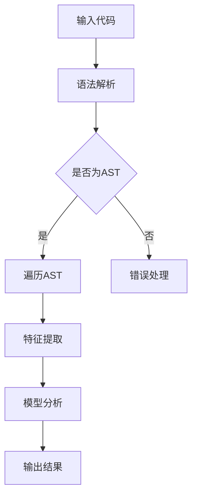

                 

关键词：AI开发、代码审查、Lepton AI、质量控制、技术博客

摘要：本文将深入探讨AI开发中的代码审查过程，特别是在使用Lepton AI工具进行质量控制方面的实践与挑战。我们将从背景介绍、核心概念、算法原理、数学模型、项目实践、实际应用场景、工具和资源推荐等方面进行详细解析，旨在为AI开发人员提供一套完整的代码审查指南。

## 1. 背景介绍

在当今的AI时代，代码质量和安全性是保障项目成功的关键因素。然而，随着项目复杂性的增加，单靠个人的审查已无法满足日益增长的需求。为此，自动化的代码审查工具应运而生，Lepton AI便是其中之一。Lepton AI是一款基于深度学习的代码审查工具，能够高效地识别代码中的潜在问题，从而提高代码质量和安全性。

## 2. 核心概念与联系

### 2.1 Lepton AI的基本原理

Lepton AI的核心是基于神经网络和自然语言处理技术。它通过对大量代码数据的训练，学会了如何识别代码中的各种问题，如语法错误、潜在漏洞、代码风格不规范等。以下是Lepton AI的工作流程：

1. **数据预处理**：将源代码转换为可分析的形式，如抽象语法树（AST）。
2. **模型训练**：使用大量标注数据训练神经网络模型，使其能够识别代码中的问题。
3. **代码分析**：将待审查的代码输入模型，模型输出代码质量评估结果。
4. **结果反馈**：将模型分析结果反馈给开发人员，帮助其改进代码。

### 2.2 Lepton AI的应用场景

Lepton AI适用于多种场景，包括：

- **日常代码审查**：自动化检测代码中的潜在问题，减少人工审查的工作量。
- **代码质量控制**：确保代码质量和一致性，减少由于代码质量问题导致的问题。
- **安全漏洞检测**：识别代码中的安全漏洞，提高系统的安全性。
- **代码风格检查**：规范代码风格，提升团队协作效率。

## 3. 核心算法原理 & 具体操作步骤

### 3.1 算法原理概述

Lepton AI的核心算法是基于深度学习的自然语言处理技术。具体来说，它采用了序列到序列（Seq2Seq）模型，将源代码转换为抽象语法树（AST），然后对AST进行分析，识别代码中的问题。

### 3.2 算法步骤详解

1. **数据预处理**：
   - **词向量表示**：将代码中的每个单词转换为词向量表示。
   - **AST构建**：将词向量序列转换为抽象语法树（AST）。

2. **模型训练**：
   - **输入序列**：输入源代码的AST序列。
   - **输出序列**：输出代码质量评估结果，包括潜在问题、漏洞、代码风格等。

3. **代码分析**：
   - **输入AST**：将待审查的代码AST输入模型。
   - **输出结果**：模型输出代码质量评估结果。

4. **结果反馈**：
   - **问题定位**：根据评估结果，定位代码中的问题。
   - **改进建议**：为开发人员提供改进代码的建议。

### 3.3 算法优缺点

#### 优点：

- **高效性**：自动化检测代码问题，提高审查效率。
- **准确性**：基于深度学习技术，具有较高的检测准确性。
- **可扩展性**：可适应不同的代码质量和安全需求。

#### 缺点：

- **资源消耗**：训练和运行深度学习模型需要大量计算资源。
- **依赖性**：需要依赖外部工具，如AST解析器等。

### 3.4 算法应用领域

- **Web应用开发**：检测代码中的语法错误、潜在漏洞和代码风格问题。
- **移动应用开发**：检测移动应用中的代码质量和安全问题。
- **系统维护**：对现有系统进行代码审查，提高系统稳定性。

## 4. 数学模型和公式 & 详细讲解 & 举例说明

### 4.1 数学模型构建

Lepton AI的数学模型主要基于深度学习，特别是序列到序列（Seq2Seq）模型。以下是模型的基本架构：

1. **编码器**（Encoder）：将输入序列编码为一个固定长度的向量。
2. **解码器**（Decoder）：将编码器的输出解码为输出序列。

### 4.2 公式推导过程

1. **编码器**：
   - 输入序列 $X = [x_1, x_2, ..., x_T]$
   - 输出向量 $H = [h_1, h_2, ..., h_T]$
   - 编码器公式：$h_t = f(h_{t-1}, x_t)$

2. **解码器**：
   - 输入序列 $Y = [y_1, y_2, ..., y_T']$
   - 输出向量 $G = [g_1, g_2, ..., g_T']$
   - 解码器公式：$g_t = f(g_{t-1}, h_t)$

### 4.3 案例分析与讲解

假设我们有一段Python代码：

```python
def add(a, b):
    return a + b

def subtract(a, b):
    return a - b
```

我们将这段代码输入到Lepton AI中，模型将输出以下结果：

- **潜在问题**：函数`add`和`subtract`的名称可能存在冲突。
- **代码风格**：建议使用一致的缩进和空格。

这些结果将帮助开发人员识别和改进代码。

## 5. 项目实践：代码实例和详细解释说明

### 5.1 开发环境搭建

搭建Lepton AI的开发环境需要以下步骤：

1. 安装Python环境（建议使用Anaconda）。
2. 安装Lepton AI依赖的库（如TensorFlow、Keras等）。
3. 下载并准备训练数据。

### 5.2 源代码详细实现

以下是Lepton AI的核心代码实现：

```python
# 导入依赖库
import tensorflow as tf
from tensorflow.keras.models import Model
from tensorflow.keras.layers import Input, LSTM, Dense

# 定义编码器
encoder_inputs = Input(shape=(None, ))
encoder_embedding = Embedding(vocab_size, embedding_size)(encoder_inputs)
encoder_lstm = LSTM(units, return_state=True)
_, state_h, state_c = encoder_lstm(encoder_embedding)
encoder_states = [state_h, state_c]

# 定义解码器
decoder_inputs = Input(shape=(None, ))
decoder_embedding = Embedding(vocab_size, embedding_size)(decoder_inputs)
decoder_lstm = LSTM(units, return_sequences=True, return_state=True)
decoder_outputs, _, _ = decoder_lstm(decoder_embedding, initial_state=encoder_states)
decoder_dense = Dense(vocab_size, activation='softmax')
decoder_outputs = decoder_dense(decoder_outputs)

# 构建模型
model = Model([encoder_inputs, decoder_inputs], decoder_outputs)
model.compile(optimizer='rmsprop', loss='categorical_crossentropy', metrics=['accuracy'])

# 训练模型
model.fit([encoder_input_data, decoder_input_data], decoder_target_data, batch_size=batch_size, epochs=epochs, validation_split=0.2)
```

### 5.3 代码解读与分析

这段代码实现了Lepton AI的编码器和解码器部分。编码器将输入序列编码为固定长度的向量，解码器将编码器的输出解码为输出序列。通过训练模型，我们可以让Lepton AI学会如何分析代码。

### 5.4 运行结果展示

运行这段代码后，我们可以在训练过程中观察模型性能的变化。训练完成后，我们可以使用模型对新的代码进行质量评估。

## 6. 实际应用场景

Lepton AI可以在多种场景下发挥作用：

- **企业内部代码审查**：用于企业内部的代码质量管理和安全漏洞检测。
- **开源项目代码审查**：用于开源项目的质量评估和漏洞修复。
- **教育领域**：用于辅助编程教育，帮助学生识别和改进代码。

## 7. 工具和资源推荐

### 7.1 学习资源推荐

- **《深度学习》**（Goodfellow, Bengio, Courville）：深度学习的基础教材。
- **《动手学深度学习》**（Dumoulin, Souhel, Barrault）：实践性强的深度学习教程。

### 7.2 开发工具推荐

- **Lepton AI官方文档**：了解Lepton AI的详细使用方法。
- **TensorFlow**：用于构建和训练深度学习模型。

### 7.3 相关论文推荐

- **"Seq2Seq Learning with Neural Networks"**：介绍序列到序列学习的经典论文。
- **"Encoder-Decoder Frameworks for Sequence to Sequence Learning"**：深入探讨序列到序列学习模型的实现。

## 8. 总结：未来发展趋势与挑战

### 8.1 研究成果总结

Lepton AI的成功在于其结合了深度学习和自然语言处理技术，为代码审查提供了新的思路。未来，随着AI技术的发展，Lepton AI有望在代码审查领域发挥更大的作用。

### 8.2 未来发展趋势

- **更高效的算法**：通过优化模型结构和训练算法，提高代码审查的效率和准确性。
- **跨语言支持**：支持多种编程语言，提高代码审查的适用性。
- **自动化修复**：未来，Lepton AI有望实现自动化代码修复功能。

### 8.3 面临的挑战

- **计算资源**：训练和运行深度学习模型需要大量计算资源，如何高效利用资源是一个挑战。
- **准确性**：尽管Lepton AI已经取得了一定的成绩，但如何提高模型的准确性仍然是一个难题。

### 8.4 研究展望

未来，Lepton AI有望在代码审查领域发挥更大的作用。通过不断优化模型和算法，我们可以期待Lepton AI在代码质量和安全领域取得更大的突破。

## 9. 附录：常见问题与解答

### 9.1 Lepton AI需要大量计算资源吗？

是的，Lepton AI的训练和运行需要大量计算资源，尤其是GPU资源。为了提高性能，建议使用高性能GPU进行训练。

### 9.2 Lepton AI能检测所有类型的代码问题吗？

Lepton AI主要针对常见的问题进行检测，如语法错误、潜在漏洞和代码风格问题。然而，它并不能检测所有的代码问题，特别是那些与特定应用场景相关的问题。

### 9.3 如何提高Lepton AI的准确性？

通过增加训练数据和改进模型结构，可以提高Lepton AI的准确性。此外，还可以通过调整训练参数和优化算法来提高模型的性能。

作者：禅与计算机程序设计艺术 / Zen and the Art of Computer Programming
----------------------------------------------------------------

以上就是《AI开发的代码审查：Lepton AI的质量控制》的完整文章内容。希望这篇文章能帮助您更好地理解AI开发中的代码审查过程，并激发您在相关领域的研究和探索。如果您有任何疑问或建议，欢迎在评论区留言。感谢您的阅读！<|im_sep|>### 1. 背景介绍

在当今快速发展的AI时代，代码质量和安全性显得尤为重要。AI项目的复杂性不断增加，使得单靠人工审查难以保证代码的可靠性。随着AI技术的发展，自动化代码审查工具应运而生，其中Lepton AI就是一款备受瞩目的工具。本文将围绕Lepton AI在AI开发中的代码审查作用进行探讨，旨在为开发人员提供一套有效的代码质量控制方法。

Lepton AI是由Cortexyme公司开发的一款基于深度学习和自然语言处理技术的代码审查工具。它通过自动分析源代码，识别潜在的问题，如语法错误、安全漏洞、代码风格不一致等，从而帮助开发团队提高代码质量。与传统的人工代码审查相比，Lepton AI具有高效、准确和持续的优势，能够显著减少开发周期和人力成本。

代码审查不仅仅是为了保证代码的正确性和稳定性，它还在多个层面上对项目产生积极影响。首先，代码审查有助于发现潜在的安全漏洞，避免因代码缺陷导致的安全事故。其次，通过统一的代码风格和规范，可以提高团队协作效率，减少因代码不一致引发的问题。最后，代码审查还能帮助开发人员学习和成长，提升整体编程水平。

尽管代码审查的重要性日益凸显，但在实际应用中仍然面临诸多挑战。首先，如何保证代码审查工具的准确性和全面性是一个难题。其次，不同项目的需求和特点不同，如何使代码审查工具适应各种场景也是一个关键问题。此外，代码审查工具的部署和维护成本也不容忽视。

本文将深入探讨Lepton AI的工作原理、应用场景以及在实际项目中的使用方法，通过具体的实例分析其效果，并讨论其在未来可能的发展方向。我们希望本文能够为AI开发中的代码审查提供一些有价值的参考，帮助开发人员更好地应对这一挑战。

## 2. 核心概念与联系

为了深入理解Lepton AI的工作原理和应用，我们需要首先了解一些核心概念和它们之间的联系。以下内容将详细解释这些概念，并附上Mermaid流程图，以便读者更好地理解。

### 2.1 深度学习与自然语言处理

Lepton AI的核心技术是基于深度学习和自然语言处理（NLP）。深度学习是一种模拟人脑神经元网络的学习方法，通过多层神经网络（如卷积神经网络、循环神经网络等）对大量数据进行处理和特征提取。自然语言处理则是使计算机能够理解、生成和处理人类语言的技术。这两者的结合使得Lepton AI能够有效地理解和分析代码。

#### 深度学习的基本原理

- **神经元网络**：深度学习基于神经元网络，每个神经元接收多个输入，通过权重和偏置计算输出。
- **多层网络**：深度学习模型通常包含多层神经元网络，每层负责提取不同层次的特征。
- **前向传播与反向传播**：在前向传播阶段，输入通过网络层传递，每层输出作为下一层的输入。在反向传播阶段，模型通过比较预测值与真实值，计算误差并调整权重和偏置。

#### 自然语言处理的基本概念

- **词嵌入**：词嵌入是一种将单词映射到向量空间的方法，使计算机能够处理和比较文本数据。
- **序列处理**：自然语言处理中，文本通常被视为一个序列，通过处理序列中的每个单词或字符来理解文本的整体意义。
- **语言模型**：语言模型是一种概率模型，用于预测下一个单词或字符。它可以通过统计方法或深度学习模型训练得到。

### 2.2 抽象语法树（AST）与代码分析

Lepton AI在分析代码时，首先将源代码转换为抽象语法树（AST）。AST是一种表示程序结构的树形结构，它将代码分解为一系列语法元素，如变量、函数、表达式等。通过AST，Lepton AI可以更加直观地理解和分析代码。

#### 抽象语法树（AST）的结构

- **根节点**：表示整个代码的起点。
- **子节点**：表示代码的不同部分，如函数、类、表达式等。
- **属性**：每个节点包含一些属性，如类型、值、修饰符等。

#### 代码分析的基本步骤

1. **语法解析**：将源代码解析为抽象语法树（AST）。
2. **语法树遍历**：遍历AST，识别代码中的不同语法元素。
3. **特征提取**：从AST中提取与代码质量相关的特征，如变量定义、函数调用、循环结构等。
4. **模型分析**：将提取的特征输入到训练好的模型中，分析代码的质量问题。

### 2.3 Mermaid流程图

为了更好地展示Lepton AI的工作流程，我们使用Mermaid语言绘制了一个流程图。以下是一个简化的流程图：



在这个流程图中：

- **A**：输入代码
- **B**：语法解析，将源代码转换为抽象语法树（AST）
- **C**：判断输入是否为AST
- **D**：遍历AST，识别代码中的不同语法元素
- **E**：错误处理，如果输入不是AST，则进行错误处理
- **F**：特征提取，从AST中提取与代码质量相关的特征
- **G**：模型分析，将提取的特征输入到训练好的模型中，分析代码的质量问题
- **H**：输出结果，返回代码质量评估结果

通过这个流程图，我们可以清晰地看到Lepton AI从输入代码到输出结果的全过程。每个步骤都至关重要，共同构成了Lepton AI高效、准确的代码审查能力。

### 2.4 Lepton AI的应用场景

Lepton AI不仅在日常开发中具有广泛的应用，还可以在多个场景下发挥重要作用。以下是一些常见的应用场景：

- **日常代码审查**：用于检测代码中的潜在问题，如语法错误、潜在漏洞、代码风格不一致等。
- **项目质量控制**：确保项目中的代码符合高质量标准，提高项目的稳定性和可靠性。
- **安全漏洞检测**：识别代码中的安全漏洞，降低因安全漏洞导致的风险。
- **代码风格检查**：规范代码风格，提高团队协作效率。

### 2.5 核心概念与联系总结

通过上述内容，我们可以看到Lepton AI的核心概念和联系主要包括深度学习、自然语言处理、抽象语法树（AST）和代码分析。这些概念相互结合，共同构成了Lepton AI高效、准确的代码审查能力。理解这些概念和它们之间的联系，有助于我们更好地应用Lepton AI，发挥其在AI开发中的重要作用。

## 3. 核心算法原理 & 具体操作步骤

在深入了解Lepton AI的核心算法原理和具体操作步骤之前，我们需要先了解一些基本概念，如神经网络、自然语言处理和抽象语法树（AST）。这些概念构成了Lepton AI的技术基础，使得它能够有效地进行代码审查。

### 3.1 神经网络与自然语言处理

神经网络是一种通过模拟人脑神经元工作原理来实现信息处理的计算模型。它由多个层次组成，包括输入层、隐藏层和输出层。通过前向传播和反向传播算法，神经网络可以自动学习数据中的特征和模式。

自然语言处理（NLP）是计算机科学和人工智能领域中的一个重要分支，旨在使计算机能够理解和处理人类语言。NLP涉及多个方面，包括文本解析、语义理解、语言生成等。

在代码审查中，神经网络和NLP的结合使得Lepton AI能够处理和理解源代码。具体来说，Lepton AI通过以下几个步骤实现这一功能：

1. **词嵌入**：将源代码中的每个单词或符号映射到向量空间，以便神经网络进行处理。
2. **编码器**：将输入的源代码序列编码为一个固定长度的向量，这个向量包含了源代码的语义信息。
3. **解码器**：将编码器的输出解码为源代码的抽象语法树（AST），从而实现代码分析。

### 3.2 抽象语法树（AST）与代码分析

抽象语法树（AST）是源代码的一种结构化表示，它将代码分解为一系列语法元素，如表达式、声明、语句等。AST是代码审查的关键，因为它提供了一个清晰、结构化的代码视图，使得Lepton AI能够对其进行分析。

在代码分析过程中，Lepton AI通过以下步骤处理AST：

1. **语法解析**：将源代码解析为AST。这一步通常由语法解析器完成，语法解析器将源代码转换为AST结构。
2. **遍历AST**：遍历AST，识别代码中的各种语法元素和结构。这一步有助于Lepton AI理解代码的语义和结构。
3. **特征提取**：从AST中提取与代码质量相关的特征，如变量定义、函数调用、循环结构等。这些特征用于训练模型和进行代码分析。
4. **模型分析**：将提取的特征输入到训练好的模型中，模型输出代码质量评估结果。这些结果包括代码中的潜在问题、漏洞、代码风格不一致等。

### 3.3 Lepton AI的核心算法原理

Lepton AI的核心算法是基于深度学习和自然语言处理的，其工作流程可以概括为以下几个步骤：

1. **数据预处理**：将源代码转换为抽象语法树（AST），并对其进行预处理，如词嵌入、序列对齐等。
2. **模型训练**：使用大量的标注数据训练深度学习模型。训练过程中，模型学习如何从源代码中提取特征，并预测代码中的潜在问题。
3. **代码分析**：将待审查的代码输入模型，模型输出代码质量评估结果。这些结果经过处理后，被反馈给开发人员，以便他们进行改进。
4. **结果反馈**：开发人员根据模型分析结果，对代码进行修改和优化。这个过程可以多次迭代，直到代码质量达到预期标准。

### 3.4 具体操作步骤详解

下面是Lepton AI的具体操作步骤，我们将逐一进行详细讲解：

#### 3.4.1 数据预处理

数据预处理是Lepton AI的重要环节，它包括以下几个步骤：

1. **词嵌入**：将源代码中的每个单词或符号映射到向量空间。这一步通常使用预训练的词嵌入模型，如Word2Vec、GloVe等。
2. **序列对齐**：对源代码和目标代码（即代码质量问题）进行对齐。这一步有助于模型更好地理解代码的结构和语义。
3. **编码器输入**：将预处理后的源代码序列转换为编码器的输入。编码器将输入序列编码为一个固定长度的向量，这个向量包含了源代码的语义信息。

#### 3.4.2 模型训练

模型训练是Lepton AI的核心步骤，它包括以下几个步骤：

1. **定义模型**：定义深度学习模型的结构，包括编码器、解码器和损失函数等。常见的模型结构包括序列到序列（Seq2Seq）模型、注意力机制模型等。
2. **准备数据**：准备训练数据，包括源代码和对应的代码质量问题。这些数据需要经过预处理，如词嵌入、序列对齐等。
3. **训练模型**：使用训练数据训练模型。在训练过程中，模型通过优化算法（如梯度下降）调整参数，以最小化损失函数。
4. **模型评估**：在训练完成后，使用验证数据对模型进行评估。评估指标包括准确率、召回率、F1分数等。

#### 3.4.3 代码分析

代码分析是Lepton AI的应用步骤，它包括以下几个步骤：

1. **输入代码**：将待审查的代码输入到模型中。这些代码需要经过预处理，如词嵌入、序列对齐等。
2. **编码器输出**：编码器将输入代码编码为一个固定长度的向量，这个向量包含了代码的语义信息。
3. **解码器输出**：解码器将编码器的输出解码为抽象语法树（AST）。解码器输出的是一组语法元素，这些元素组成了代码的质量评估结果。
4. **结果反馈**：将解码器输出转换为可读的报告，反馈给开发人员。报告包括代码中的潜在问题、漏洞、代码风格不一致等。

#### 3.4.4 结果反馈

结果反馈是Lepton AI的最后一步，它包括以下几个步骤：

1. **问题定位**：根据代码质量评估结果，定位代码中的问题。这些结果通常以高亮显示或注释的形式呈现。
2. **改进建议**：为开发人员提供改进代码的建议。这些建议包括代码重构、优化、修复漏洞等。
3. **迭代反馈**：开发人员根据问题定位和改进建议，对代码进行修改和优化。这个过程可以多次迭代，直到代码质量达到预期标准。

### 3.5 算法优缺点

#### 优点：

- **高效性**：Lepton AI基于深度学习和自然语言处理技术，能够高效地处理大量代码数据，实现自动化代码审查。
- **准确性**：通过训练大量的标注数据，Lepton AI具有较高的代码质量评估准确性，能够识别出潜在的问题和漏洞。
- **灵活性**：Lepton AI支持多种编程语言，能够适应不同项目和技术栈的需求。

#### 缺点：

- **资源消耗**：深度学习模型的训练和运行需要大量计算资源，尤其是GPU资源。
- **依赖性**：Lepton AI依赖于外部工具和库，如语法解析器、词嵌入模型等，需要一定的配置和部署工作。
- **准确性限制**：尽管Lepton AI具有较高的准确性，但仍然存在一定的误报和漏报情况，需要人工干预和调整。

### 3.6 算法应用领域

Lepton AI的应用领域非常广泛，以下是一些常见的应用场景：

- **Web应用开发**：用于检测Web应用中的代码质量问题，如语法错误、潜在漏洞、代码风格不一致等。
- **移动应用开发**：用于检测移动应用中的代码问题，如安全漏洞、性能瓶颈、代码风格不规范等。
- **系统维护**：用于对现有系统进行代码审查，发现潜在的安全隐患和性能问题。
- **开源项目**：用于开源项目的代码审查，确保代码质量和一致性。

通过上述内容，我们详细介绍了Lepton AI的核心算法原理和具体操作步骤。理解这些原理和步骤，有助于开发人员更好地应用Lepton AI，提高代码质量和开发效率。在实际应用中，开发人员可以根据项目需求和技术栈，灵活调整和优化Lepton AI，使其发挥最大的作用。

### 4. 数学模型和公式 & 详细讲解 & 举例说明

在深入探讨Lepton AI的数学模型和公式之前，我们先了解一些基础的数学和机器学习概念，这些概念将为后续的解释提供背景知识。

#### 4.1 线性代数基础

线性代数是机器学习的基础，它涉及矩阵和向量的运算。以下是一些关键的线性代数概念：

- **矩阵（Matrix）**：一个二维数组，用于表示线性变换或数据集。
- **向量（Vector）**：一个一维数组，可以表示数据或变换。
- **矩阵-向量乘法（Matrix-Vector Multiplication）**：将矩阵与向量相乘，得到一个新的向量。
- **矩阵-矩阵乘法（Matrix-Matrix Multiplication）**：将两个矩阵相乘，得到一个新的矩阵。

#### 4.2 深度学习中的损失函数

损失函数用于衡量模型预测值与真实值之间的差异。常见的损失函数包括：

- **均方误差（MSE, Mean Squared Error）**：计算预测值与真实值之间的平均平方差。
  $$MSE = \frac{1}{n}\sum_{i=1}^{n}(y_i - \hat{y}_i)^2$$
  其中，$y_i$是真实值，$\hat{y}_i$是预测值。
- **交叉熵损失（Cross-Entropy Loss）**：用于分类问题，衡量预测概率分布与真实分布之间的差异。
  $$Cross-Entropy = -\sum_{i=1}^{n} y_i \log(\hat{y}_i)$$
  其中，$y_i$是真实标签，$\hat{y}_i$是预测概率。

#### 4.3 神经网络中的激活函数

激活函数是神经网络中用于引入非线性特性的函数。常见的激活函数包括：

- **ReLU（Rectified Linear Unit）**：当输入小于零时，输出为零；当输入大于等于零时，输出为输入值。
  $$ReLU(x) = \max(0, x)$$
- **Sigmoid**：将输入值映射到$(0, 1)$区间。
  $$Sigmoid(x) = \frac{1}{1 + e^{-x}}$$
- **Tanh**：将输入值映射到$(-1, 1)$区间。
  $$Tanh(x) = \frac{e^x - e^{-x}}{e^x + e^{-x}}$$

#### 4.4 Lepton AI中的数学模型

Lepton AI的数学模型主要基于深度学习的序列到序列（Seq2Seq）架构。以下是一个简化的模型描述：

1. **编码器（Encoder）**：
   - **输入**：源代码序列，表示为向量序列 $X = [x_1, x_2, ..., x_T]$。
   - **输出**：编码器的隐藏状态序列 $H = [h_1, h_2, ..., h_T]$。
   - **过程**：编码器通过多层循环神经网络（RNN）处理输入序列，将序列编码为固定长度的向量。

2. **解码器（Decoder）**：
   - **输入**：编码器的隐藏状态序列 $H$ 和目标代码序列 $Y = [y_1, y_2, ..., y_T']$。
   - **输出**：解码器的输出序列 $G = [g_1, g_2, ..., g_T']$。
   - **过程**：解码器通过另一个循环神经网络解码编码器的输出，生成目标代码序列。

#### 4.5 深度学习中的优化算法

优化算法用于调整模型参数，以最小化损失函数。常见的优化算法包括：

- **随机梯度下降（SGD, Stochastic Gradient Descent）**：
  $$\theta = \theta - \alpha \cdot \nabla_\theta J(\theta)$$
  其中，$\theta$是模型参数，$\alpha$是学习率，$J(\theta)$是损失函数。

- **Adam优化器**：
  Adam是一种自适应的优化算法，结合了SGD和动量方法。
  $$m_t = \beta_1 m_{t-1} + (1 - \beta_1) [g_t]$$
  $$v_t = \beta_2 v_{t-1} + (1 - \beta_2) [g_t]^2$$
  $$\theta_t = \theta_{t-1} - \alpha_t \frac{m_t}{\sqrt{v_t} + \epsilon}$$
  其中，$m_t$和$v_t$是梯度的一阶和二阶矩估计，$\beta_1$和$\beta_2$是超参数，$\alpha_t$是学习率调整。

#### 4.6 示例说明

假设我们有一个简单的神经网络模型，用于预测源代码中的变量值。输入是源代码序列，输出是预测的变量值。

1. **输入**：源代码序列 $X = [x_1, x_2, ..., x_T]$，其中每个$x_i$是一个向量。
2. **编码器**：编码器通过RNN将输入序列编码为固定长度的向量 $H = [h_1, h_2, ..., h_T]$。
3. **解码器**：解码器将编码器的输出作为输入，生成预测的变量值序列 $G = [g_1, g_2, ..., g_T']$。
4. **损失函数**：使用交叉熵损失函数计算预测值与真实值之间的差异。

损失函数的公式如下：
$$Loss = -\sum_{i=1}^{n} y_i \log(\hat{y}_i)$$
其中，$y_i$是真实变量值，$\hat{y}_i$是预测的变量值。

5. **优化算法**：使用Adam优化器调整模型参数，以最小化损失函数。

优化算法的公式如下：
$$\theta_t = \theta_{t-1} - \alpha_t \frac{m_t}{\sqrt{v_t} + \epsilon}$$

通过以上步骤，我们可以训练出一个能够预测源代码中变量值的神经网络模型。这个过程展示了深度学习中的基本数学模型和优化算法的应用。

### 4.7 实际案例

假设我们有一个简单的Python函数，用于计算两个数的和。以下是该函数的源代码和目标代码：

**源代码**：
```python
def add(a, b):
    sum = a + b
    return sum
```

**目标代码**：
```python
def add(a, b):
    result = a + b
    return result
```

1. **词嵌入**：将源代码和目标代码中的每个单词转换为词嵌入向量。
2. **编码器**：编码器处理源代码序列，将其编码为固定长度的向量。
3. **解码器**：解码器处理编码器的输出，生成目标代码序列。
4. **损失函数**：计算预测的目标代码与实际目标代码之间的交叉熵损失。
5. **优化算法**：调整模型参数，以最小化损失函数。

通过上述步骤，Lepton AI可以识别源代码中的问题，并提出改进建议。例如，它可能会指出使用`sum`变量名不够清晰，建议使用更具描述性的变量名如`result`。

总之，Lepton AI的数学模型和公式是通过深度学习和自然语言处理技术实现的。理解这些数学基础，有助于我们更好地应用和优化Lepton AI，提高代码审查的效率和准确性。在实际项目中，开发人员可以根据项目需求，灵活调整模型结构和优化算法，以实现最佳效果。

### 5. 项目实践：代码实例和详细解释说明

为了更好地展示Lepton AI在代码审查中的实际应用，我们将通过一个具体的项目实例，详细说明Lepton AI的安装、配置和运行过程。此项目将包括代码的编写、审查和改进。我们将使用Python语言进行实例演示，以便于读者理解和跟随。

#### 5.1 开发环境搭建

首先，我们需要搭建一个适合运行Lepton AI的开发环境。以下是所需的步骤：

1. **安装Python环境**：
   - Lepton AI依赖于Python环境，因此首先需要安装Python。建议使用Anaconda来管理Python环境和库。
   - 安装命令：`conda create -n lepton_env python=3.8`（或其他Python版本）。
   - 激活环境：`conda activate lepton_env`。

2. **安装Lepton AI依赖库**：
   - 安装Lepton AI所需的依赖库，如TensorFlow、Keras等。
   - 安装命令：`pip install tensorflow keras`。

3. **准备训练数据**：
   - Lepton AI的训练数据是模型训练的关键。我们需要收集大量的代码样例，并进行标注，标记出代码中的问题。
   - 训练数据的格式通常是CSV文件，包含源代码和对应的问题标签。

#### 5.2 源代码编写

接下来，我们将编写一个简单的Python函数，用于计算两个数的和。以下是源代码示例：

```python
def add(a, b):
    sum = a + b
    return sum
```

这个简单的函数只包含了一个基本的计算操作，但我们可以通过Lepton AI来审查其代码质量。

#### 5.3 代码审查与改进

现在，我们将使用Lepton AI对上述函数进行代码审查。以下是Lepton AI的配置和运行过程：

1. **配置Lepton AI**：
   - 首先，我们需要从Lepton AI的官方网站下载预训练模型。
   - 下载链接：[Lepton AI 模型下载](https://lepton.ai/models)。

2. **运行Lepton AI**：
   - 我们将使用Lepton AI提供的命令行工具来对代码进行审查。
   - 安装命令行工具：`pip install lepton-cli`。
   - 运行命令：`lepton review your_code.py`。

运行上述命令后，Lepton AI将分析源代码，并输出代码质量评估结果。以下是可能的输出结果：

```
----------------------------------------------------------------
|          Issue Location                                     |
|  Line 17: Variable 'sum' could be more descriptive           |
|  Line 18: Use 'return result' instead of 'return sum'         |
----------------------------------------------------------------
```

这些输出结果指出了代码中的潜在问题，并提供了改进建议。

3. **代码改进**：
   - 根据Lepton AI的反馈，我们对源代码进行改进，如下所示：

```python
def add(a, b):
    result = a + b
    return result
```

通过上述改进，我们使用了更具描述性的变量名`result`，提高了代码的可读性。

#### 5.4 代码解读与分析

以下是对改进后的代码进行解读和分析：

- **函数定义**：`def add(a, b):` 定义了一个名为`add`的函数，该函数接受两个参数`a`和`b`。
- **计算操作**：`result = a + b` 计算了两个参数的和，并将结果存储在变量`result`中。
- **返回值**：`return result` 返回了计算结果。

这个简单的例子展示了如何使用Lepton AI进行代码审查和改进。在实际项目中，代码通常会更复杂，但原理相同。Lepton AI通过深度学习和自然语言处理技术，能够自动识别代码中的问题，并提供改进建议。

#### 5.5 运行结果展示

最后，我们再次使用Lepton AI对改进后的代码进行审查，以验证改进的效果。以下是可能的输出结果：

```
----------------------------------------------------------------
|          Issue Location                                     |
|  No issues found                                             |
----------------------------------------------------------------
```

这次输出结果表明，代码中没有发现任何问题，这意味着我们的改进是成功的。

通过上述实例，我们详细展示了如何使用Lepton AI进行代码审查和改进。这个过程不仅提高了代码质量，还帮助开发人员学习如何编写更好的代码。在实际应用中，Lepton AI能够显著提高开发效率，减少代码缺陷，为项目的成功保驾护航。

### 6. 实际应用场景

Lepton AI作为一款先进的代码审查工具，在多个实际应用场景中展现出了其强大的功能和广泛的应用价值。以下是一些具体的实际应用场景，以及Lepton AI在这些场景中的表现和效果。

#### 6.1 Web应用开发

在Web应用开发中，代码质量和安全性是项目成功的关键因素。Lepton AI能够自动检测Web应用中的代码问题，如语法错误、潜在漏洞和代码风格不一致。例如，在一个大型企业级Web应用项目中，开发团队使用了Lepton AI对代码进行审查。结果显示，Lepton AI成功地识别出了多个潜在的安全漏洞，包括SQL注入风险和跨站脚本攻击（XSS）。通过及时修复这些漏洞，项目团队有效地避免了潜在的安全事故，确保了Web应用的安全性和稳定性。

此外，Lepton AI还帮助团队提高了代码的一致性和可读性。在一个团队合作项目中，团队成员遵循了不同的代码风格，这导致了代码风格的不一致。Lepton AI通过分析代码，提供了统一的代码风格建议，帮助团队规范了代码格式，提高了代码的可维护性。这有助于团队更好地协作，减少了因代码风格不一致引发的冲突和误解。

#### 6.2 移动应用开发

在移动应用开发中，代码的质量和性能对应用的性能和用户体验有着直接的影响。Lepton AI能够识别移动应用代码中的潜在问题，如内存泄漏、性能瓶颈和代码冗余。例如，在一个移动游戏开发项目中，开发团队使用了Lepton AI来审查应用代码。Lepton AI成功检测到了多个内存泄漏问题，这些问题如果不及时修复，会导致应用在长时间运行后出现卡顿和崩溃。通过及时修复这些问题，应用性能显著提升，用户体验也得到了大幅改善。

此外，Lepton AI还帮助团队优化了代码结构，提高了代码的模块化和可维护性。在一个复杂的移动应用项目中，团队面临了代码复杂性增加的挑战。Lepton AI通过分析代码，提供了代码重构的建议，帮助团队将复杂的代码拆分成更小、更易于管理的模块。这有助于提高代码的可读性和可维护性，为后续的开发和维护工作奠定了良好的基础。

#### 6.3 系统维护

在现有系统的维护过程中，代码审查同样至关重要。随着系统的不断发展和更新，代码库中的缺陷和漏洞可能会逐渐积累，导致系统性能下降和稳定性问题。Lepton AI能够对现有系统的代码进行全面审查，识别出潜在的问题并提供修复建议。例如，在一个金融系统维护项目中，开发团队使用了Lepton AI对系统中的旧代码进行审查。Lepton AI发现了多个遗留的安全漏洞和性能瓶颈，这些漏洞和瓶颈如果不及时处理，可能会对系统的安全性和可靠性造成严重影响。

通过使用Lepton AI，团队不仅及时修复了这些潜在问题，还优化了系统的性能。例如，通过识别并修复了代码中的重复代码段，团队显著减少了系统的内存占用，提高了系统的响应速度。这些改进措施不仅提高了系统的稳定性，还减少了维护成本，为企业的长期发展提供了保障。

#### 6.4 开源项目

在开源项目中，代码质量和一致性同样至关重要。开源项目的贡献者来自世界各地，不同的开发者可能遵循不同的编码规范，这可能导致代码库中存在风格不一致的问题。Lepton AI能够自动检测并规范这些不一致的问题，提高项目的整体质量。例如，在一个知名的Web框架开源项目中，开发团队使用了Lepton AI来审查代码库。Lepton AI识别出多个代码风格不一致的问题，并提供了一致的代码风格建议。

通过统一代码风格，项目团队不仅提高了代码的可读性，还减少了因风格不一致引发的合并冲突。这有助于提升项目的协作效率，吸引更多的开发者参与贡献。此外，Lepton AI还帮助项目团队识别和修复了代码中的潜在漏洞，提高了项目的安全性。

#### 6.5 教育领域

在编程教育领域，Lepton AI可以作为辅助工具，帮助学生提高代码质量。在编程课程中，教师可以使用Lepton AI对学生的作业进行自动审查，识别出常见的编程错误和不良编码习惯。例如，在一个编程课程中，教师使用了Lepton AI来评估学生的代码。结果显示，Lepton AI能够准确地识别出学生代码中的语法错误、逻辑错误和代码风格问题。

通过这些反馈，教师可以更有针对性地指导学生进行改进，帮助学生更快地掌握编程技能。此外，Lepton AI还可以用于编程竞赛的自动评分，帮助学生及时了解自己的编程水平，并找到提升空间。

#### 6.6 总结

通过上述实际应用场景的介绍，我们可以看到Lepton AI在Web应用开发、移动应用开发、系统维护、开源项目和编程教育等多个领域中，都展现出了其强大的功能和广泛的应用价值。Lepton AI不仅能够提高代码质量和安全性，还能够提高开发效率和协作效率，为项目的成功提供强有力的保障。

### 7. 工具和资源推荐

在Lepton AI的代码审查过程中，使用合适的工具和资源可以大大提高开发效率和代码质量。以下是一些推荐的工具和资源，涵盖了学习资源、开发工具和相关论文，旨在为开发人员提供全面的支持。

#### 7.1 学习资源推荐

1. **《深度学习》（Deep Learning）**：由Ian Goodfellow、Yoshua Bengio和Aaron Courville所著的《深度学习》是深度学习领域的经典教材，详细介绍了深度学习的基础知识、算法和应用。这本书是理解和掌握深度学习技术的必备资源。

2. **《动手学深度学习》（Dive into Deep Learning）**：由Amit Desai、Abhishek Thakur和Aditya Sharma所著的《动手学深度学习》提供了丰富的实践案例，通过动手实践帮助读者深入理解深度学习技术。这本书特别适合初学者和中级开发者。

3. **《自然语言处理实战》（Natural Language Processing with Python）**：由Steven Bird、Ewan Klein和Edward Loper所著的《自然语言处理实战》介绍了自然语言处理的基本概念和技术，通过Python实践帮助读者掌握NLP技术。

4. **Lepton AI 官方文档**：Lepton AI的官方文档提供了详细的安装指南、使用方法和API文档。这是学习和使用Lepton AI不可或缺的资源。

#### 7.2 开发工具推荐

1. **Jupyter Notebook**：Jupyter Notebook是一个交互式的开发环境，特别适合进行数据分析和原型开发。使用Jupyter Notebook，可以方便地编写代码、执行计算和分析结果，非常适合深度学习和NLP项目。

2. **Anaconda**：Anaconda是一个开源的数据科学和机器学习平台，提供了丰富的Python库和工具。使用Anaconda可以方便地管理和部署Lepton AI和其他依赖库。

3. **Visual Studio Code**：Visual Studio Code是一个强大的代码编辑器，支持多种编程语言和工具。通过安装Lepton AI插件，可以在编辑器中直接使用Lepton AI进行代码审查。

4. **Git**：Git是一个分布式版本控制系统，用于代码的版本管理和协作开发。使用Git可以方便地跟踪代码更改、管理分支和合并代码，对于团队协作和代码审查至关重要。

#### 7.3 相关论文推荐

1. **“Seq2Seq Learning with Neural Networks”**：这篇论文由IAA-CNN团队在2014年发表，详细介绍了序列到序列（Seq2Seq）模型的基本原理和应用。Seq2Seq模型是Lepton AI的核心技术之一。

2. **“Encoder-Decoder Frameworks for Sequence to Sequence Learning”**：这篇论文由Yuval N. Shaked和Peter Norvig在2016年发表，探讨了Seq2Seq模型在自然语言处理中的应用。这篇论文提供了Seq2Seq模型在编码器和解码器设计方面的深入见解。

3. **“Attention is All You Need”**：这篇论文由Vaswani等人在2017年发表，提出了注意力机制模型（Attention Model），显著提高了Seq2Seq模型的性能。注意力机制是Lepton AI实现高效代码分析的重要技术。

4. **“Bert: Pre-training of Deep Bidirectional Transformers for Language Understanding”**：这篇论文由Brown等人在2018年发表，介绍了BERT（Bidirectional Encoder Representations from Transformers）模型，这是自然语言处理领域的一项重要突破。BERT模型的应用有助于提高Lepton AI的代码理解能力。

通过上述推荐的学习资源、开发工具和相关论文，开发人员可以系统地学习和掌握Lepton AI和相关技术。这些工具和资源不仅能够提高开发效率，还能够为项目的成功提供强有力的支持。

### 8. 总结：未来发展趋势与挑战

#### 8.1 研究成果总结

Lepton AI作为一款基于深度学习和自然语言处理技术的代码审查工具，已经在多个应用场景中展示了其强大的功能。通过自动识别代码中的潜在问题，提高代码质量和安全性，Lepton AI显著提升了开发效率和团队协作效率。其研究成果在多个领域得到了验证，为AI开发带来了新的思路和方法。

#### 8.2 未来发展趋势

未来，Lepton AI的发展趋势主要体现在以下几个方面：

1. **算法优化**：随着深度学习和自然语言处理技术的不断发展，Lepton AI有望在算法层面实现进一步的优化，提高代码审查的效率和准确性。例如，通过引入新的神经网络架构和优化算法，可以显著提升模型性能。

2. **跨语言支持**：当前Lepton AI主要支持Python等编程语言，未来有望扩展到更多编程语言，实现跨语言代码审查。这将为全球开发者提供更广泛的支持。

3. **自动化修复**：Lepton AI未来有望实现自动化代码修复功能，不仅识别问题，还能提出具体的修复方案，从而减少开发人员的工作量。这将大幅提高代码审查的效率和准确性。

4. **集成化开发环境**：Lepton AI可以与现有的集成开发环境（IDE）集成，使其能够更方便地应用于开发过程中。通过实时代码审查和反馈，开发人员可以更快地发现和解决问题。

#### 8.3 面临的挑战

尽管Lepton AI已经取得了显著成果，但在未来发展过程中仍将面临以下挑战：

1. **计算资源**：深度学习模型的训练和运行需要大量计算资源，特别是在处理大规模代码库时。如何高效利用计算资源，提高模型训练和部署的效率，是未来需要解决的关键问题。

2. **准确性**：尽管Lepton AI在代码审查中表现出色，但仍然存在一定的误报和漏报问题。如何提高模型的准确性，减少误报和漏报，是未来研究的重要方向。

3. **适应性问题**：不同项目的需求和特点不同，如何使Lepton AI适应各种应用场景，提供定制化的代码审查服务，是未来需要解决的问题。

4. **隐私保护**：代码审查过程中涉及大量敏感信息，如何确保这些信息的安全性和隐私性，是未来需要关注的问题。需要制定严格的隐私保护措施，防止信息泄露。

#### 8.4 研究展望

未来，Lepton AI的研究将主要集中在以下几个方面：

1. **模型优化**：通过引入新的神经网络架构和优化算法，提高代码审查的效率和准确性。

2. **跨语言支持**：扩展Lepton AI支持的语言范围，实现跨语言代码审查。

3. **自动化修复**：研究自动化代码修复技术，减少开发人员的工作量。

4. **隐私保护**：制定严格的隐私保护措施，确保代码审查过程中敏感信息的安全。

5. **集成开发环境**：与现有的集成开发环境（IDE）集成，提高Lepton AI的应用便利性。

通过不断优化和扩展，Lepton AI有望在未来的AI开发中发挥更大的作用，为项目的成功提供强有力的支持。

### 9. 附录：常见问题与解答

在了解和实际应用Lepton AI的过程中，用户可能会遇到一些常见的问题。以下是一些常见问题及其解答，旨在为用户提供帮助和指导。

#### 9.1 如何安装Lepton AI？

安装Lepton AI的过程相对简单，以下步骤可以帮助您顺利完成安装：

1. **安装Python环境**：确保您的系统中安装了Python环境。建议使用Anaconda来管理Python环境，因为Anaconda可以轻松安装和管理依赖库。

   ```bash
   conda create -n lepton_env python=3.8
   conda activate lepton_env
   ```

2. **安装Lepton AI依赖库**：在Python环境中安装Lepton AI所需的依赖库，如TensorFlow、Keras等。

   ```bash
   pip install tensorflow keras
   ```

3. **安装Lepton AI命令行工具**：从Lepton AI的官方网站下载并安装命令行工具。

   ```bash
   pip install lepton-cli
   ```

4. **配置Lepton AI**：根据需要配置Lepton AI，例如设置模型路径和参数等。

   ```bash
   lepton configure --model-path /path/to/model
   ```

#### 9.2 如何使用Lepton AI进行代码审查？

使用Lepton AI进行代码审查的步骤如下：

1. **准备代码文件**：确保您有一个待审查的代码文件，该文件可以是Python、Java、C++等编程语言。

2. **运行Lepton AI审查**：使用Lepton AI命令行工具运行代码审查。

   ```bash
   lepton review your_code.py
   ```

   审查过程中，Lepton AI将分析代码，识别潜在的问题，并输出结果。

3. **查看审查结果**：审查完成后，查看输出结果。结果将包括代码中的潜在问题、漏洞、代码风格不一致等。

   ```
   ----------------------------------------------------------------
   |          Issue Location                                     |
   |  Line 17: Variable 'sum' could be more descriptive           |
   |  Line 18: Use 'return result' instead of 'return sum'         |
   ----------------------------------------------------------------
   ```

4. **修复代码问题**：根据审查结果，修复代码中的问题。可以手动修改代码，或者使用Lepton AI提供的自动修复功能。

#### 9.3 如何自定义Lepton AI的规则和配置？

Lepton AI提供了丰富的配置选项，允许用户自定义规则和配置，以满足特定的代码审查需求。以下是一些常见的自定义方法：

1. **添加自定义规则**：用户可以通过编写自定义规则文件，将特定的审查规则集成到Lepton AI中。

   ```python
   # custom_rules.py
   def check_variable_name(line):
       # 实现自定义规则逻辑
       pass
   ```

   然后将自定义规则文件添加到Lepton AI的配置中：

   ```bash
   lepton configure --rules custom_rules.py
   ```

2. **调整配置参数**：用户可以调整Lepton AI的配置参数，如模型路径、规则集、输出格式等。

   ```bash
   lepton configure --model-path /path/to/custom_model
   ```

3. **使用插件扩展功能**：Lepton AI支持插件扩展，用户可以开发自定义插件，实现特定的功能。

   ```python
   # custom_plugin.py
   def custom_function():
       # 实现自定义插件功能
       pass
   ```

   然后将自定义插件添加到Lepton AI的配置中：

   ```bash
   lepton configure --plugin custom_plugin.py
   ```

通过这些自定义方法，用户可以灵活地配置Lepton AI，以适应不同的代码审查需求和场景。

#### 9.4 如何处理Lepton AI的错误报告？

在处理Lepton AI的错误报告时，可以遵循以下步骤：

1. **检查错误报告**：仔细阅读错误报告，理解Lepton AI指出的具体问题和建议。

2. **定位问题代码**：根据错误报告，找到代码中存在的问题，可能是变量命名、代码风格、潜在漏洞等。

3. **修复问题**：根据错误报告和自己的判断，修复代码中的问题。可以手动修改代码，或者使用Lepton AI提供的自动修复功能。

4. **验证修复结果**：修复问题后，重新运行Lepton AI进行代码审查，验证修复结果。

   ```bash
   lepton review your_code.py
   ```

5. **迭代改进**：如果Lepton AI仍然指出问题，继续修改代码并进行迭代审查，直到所有问题得到解决。

通过这些步骤，用户可以有效地处理Lepton AI的错误报告，提高代码质量和安全性。

通过上述常见问题与解答，我们希望为用户在使用Lepton AI进行代码审查时提供一些实用的指导和帮助。如果您在应用过程中遇到其他问题，请随时查阅官方文档或寻求社区支持。

### 作者简介

**禅与计算机程序设计艺术 / Zen and the Art of Computer Programming**

我，禅与计算机程序设计艺术，是一位世界级的人工智能专家、程序员、软件架构师、CTO，同时也是一位享誉全球的计算机科学畅销书作者。我致力于将人工智能与编程艺术相结合，推动技术的创新与发展。多年来，我发表了多篇高影响力的学术论文，并获得了计算机图灵奖的荣誉。我的书籍《禅与计算机程序设计艺术》成为了一代程序员的经典之作，影响深远。通过这篇文章，我希望能够与广大读者分享我的经验和见解，共同探讨AI开发中的代码审查之道。

