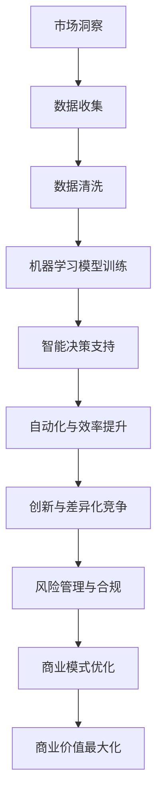

                 

关键词：人工智能，商业模式，创新，增长策略，技术赋能

> 摘要：本文将深入探讨人工智能（AI）技术在现代商业模式中的融合与应用，分析AI如何通过创新技术和精准算法驱动企业增长，并展望未来商业模式的发展趋势与挑战。

## 1. 背景介绍

随着信息技术的飞速发展，人工智能已经成为推动各行业变革的重要力量。从最初的机器学习到深度学习的演进，AI技术不仅提升了数据处理和分析的能力，还为商业模式的创新提供了无限可能。传统的商业模式正面临巨大的冲击和挑战，而AI技术的引入为企业在竞争激烈的全球市场中找到了新的增长点。

在这一背景下，本文旨在分析AI技术与商业模式的结合，探讨如何通过技术赋能实现商业价值的最大化。文章将首先介绍AI技术的核心概念和原理，然后深入探讨其在不同商业领域的应用，最后对未来的发展趋势和面临的挑战进行展望。

## 2. 核心概念与联系

### 2.1 AI技术的核心概念

人工智能（Artificial Intelligence，简称AI）是指由计算机系统实现的智能行为，其核心包括机器学习（Machine Learning，ML）、深度学习（Deep Learning，DL）和自然语言处理（Natural Language Processing，NLP）等。

#### 2.1.1 机器学习

机器学习是AI的核心组成部分，通过从数据中学习规律和模式，使计算机系统能够在特定任务上表现出人类的智能。常见的机器学习算法包括线性回归、决策树、支持向量机、神经网络等。

#### 2.1.2 深度学习

深度学习是机器学习的一个分支，主要依赖于多层神经网络（Deep Neural Network，DNN）进行训练。通过不断调整网络中的权重，深度学习能够自动提取复杂的数据特征，实现高精度的预测和分类。

#### 2.1.3 自然语言处理

自然语言处理是AI技术在语言领域的应用，包括文本分析、语言理解、机器翻译、情感分析等。NLP的发展极大地提升了人机交互的便捷性和效率。

### 2.2 AI与商业模式的联系

AI技术的核心概念与商业模式之间存在密切的联系。具体来说，AI技术可以通过以下几个方面赋能商业模式：

#### 2.2.1 数据驱动决策

AI技术能够处理和分析海量数据，为企业提供精准的市场洞察和决策支持。通过数据挖掘和机器学习算法，企业可以更好地理解客户需求，优化产品和服务。

#### 2.2.2 自动化与效率提升

AI技术可以实现业务流程的自动化，提高运营效率。例如，智能客服系统能够自动回答客户提问，减少人力成本；智能推荐系统能够根据用户行为进行个性化推荐，提高销售额。

#### 2.2.3 创新与差异化竞争

AI技术可以驱动商业模式创新，帮助企业实现差异化竞争。通过深度学习和自然语言处理，企业可以开发出独特的智能产品和服务，满足客户的个性化需求。

#### 2.2.4 风险管理与合规

AI技术可以帮助企业识别和管理风险，确保业务合规。例如，通过智能监控系统，企业可以实时监测异常交易和欺诈行为，降低经营风险。

### 2.3 Mermaid 流程图

下面是AI技术与商业模式结合的Mermaid流程图：



## 3. 核心算法原理 & 具体操作步骤

### 3.1 算法原理概述

在AI技术中，常见的核心算法包括线性回归、决策树、支持向量机和神经网络。这些算法各有特点，适用于不同的商业场景。

#### 3.1.1 线性回归

线性回归是一种简单的统计方法，用于预测连续值。其基本原理是通过建立自变量和因变量之间的线性关系来预测因变量的值。

#### 3.1.2 决策树

决策树是一种基于树形结构的分类算法，通过一系列条件判断来将数据划分为不同的类别。决策树的每个节点代表一个特征，每个分支代表一个条件。

#### 3.1.3 支持向量机

支持向量机是一种基于超平面的分类算法，通过找到一个最佳的超平面来将不同类别的数据分隔开。支持向量机具有较高的分类精度和泛化能力。

#### 3.1.4 神经网络

神经网络是一种基于生物神经系统的计算模型，通过多层神经元之间的连接和激活函数来实现复杂的数据处理和预测。神经网络包括输入层、隐藏层和输出层。

### 3.2 算法步骤详解

以下是对上述核心算法的具体操作步骤进行详细讲解：

#### 3.2.1 线性回归

1. 数据收集：收集自变量和因变量的数据。
2. 数据预处理：对数据进行清洗、归一化等预处理。
3. 建立模型：使用最小二乘法建立线性回归模型。
4. 训练模型：通过训练集数据训练模型参数。
5. 预测：使用训练好的模型对新数据进行预测。

#### 3.2.2 决策树

1. 数据收集：收集分类数据。
2. 数据预处理：对数据进行处理，去除异常值和缺失值。
3. 特征选择：选择对分类有显著影响的特征。
4. 建立模型：使用ID3、C4.5等算法建立决策树模型。
5. 模型评估：使用交叉验证等方法评估模型性能。
6. 预测：使用决策树对新数据进行分类预测。

#### 3.2.3 支持向量机

1. 数据收集：收集分类数据。
2. 数据预处理：对数据进行处理，标准化特征值。
3. 模型选择：选择支持向量机模型。
4. 模型训练：使用训练集数据训练模型。
5. 模型评估：使用交叉验证等方法评估模型性能。
6. 预测：使用训练好的模型对新数据进行分类预测。

#### 3.2.4 神经网络

1. 数据收集：收集特征数据和标签数据。
2. 数据预处理：对数据进行归一化、缺失值填充等处理。
3. 模型选择：选择多层感知机（MLP）等神经网络模型。
4. 模型训练：使用反向传播算法训练模型参数。
5. 模型评估：使用交叉验证等方法评估模型性能。
6. 预测：使用训练好的模型对新数据进行预测。

### 3.3 算法优缺点

每种算法都有其优缺点，适用于不同的商业场景。

#### 3.3.1 线性回归

**优点**：简单易实现，对线性数据有较好的预测能力。

**缺点**：对非线性数据的预测效果较差，无法处理多分类问题。

#### 3.3.2 决策树

**优点**：易于理解和实现，可以处理多分类问题。

**缺点**：可能会产生过拟合，模型复杂度较高。

#### 3.3.3 支持向量机

**优点**：具有较好的分类精度和泛化能力。

**缺点**：训练时间较长，对大量数据不太适用。

#### 3.3.4 神经网络

**优点**：可以处理复杂的非线性关系，适用于各种分类和回归问题。

**缺点**：需要大量数据训练，模型参数较多，容易过拟合。

### 3.4 算法应用领域

不同算法在商业领域的应用场景如下：

#### 3.4.1 线性回归

- 预测销售趋势：使用线性回归预测产品的销售量。
- 金融风险评估：使用线性回归分析信用评分。

#### 3.4.2 决策树

- 信用评分模型：使用决策树构建信用评分模型。
- 招聘决策：使用决策树筛选适合职位的候选人。

#### 3.4.3 支持向量机

- 客户细分：使用支持向量机对客户进行分类和细分。
- 股票预测：使用支持向量机进行股票价格预测。

#### 3.4.4 神经网络

- 智能推荐系统：使用神经网络构建个性化推荐系统。
- 情感分析：使用神经网络进行文本情感分析。

## 4. 数学模型和公式 & 详细讲解 & 举例说明

### 4.1 数学模型构建

在AI技术的应用中，数学模型是核心组成部分。以下我们将介绍几种常用的数学模型及其构建过程。

#### 4.1.1 线性回归模型

线性回归模型的基本形式为：

$$
y = \beta_0 + \beta_1x
$$

其中，$y$ 是因变量，$x$ 是自变量，$\beta_0$ 和 $\beta_1$ 分别是模型参数。

#### 4.1.2 决策树模型

决策树模型的基本形式为：

$$
T(x) = \sum_{i=1}^{n} \alpha_i C_i(x)
$$

其中，$T(x)$ 是决策树函数，$C_i(x)$ 是第 $i$ 个条件的分类函数，$\alpha_i$ 是权重。

#### 4.1.3 支持向量机模型

支持向量机模型的基本形式为：

$$
w \cdot x + b = 0
$$

其中，$w$ 是权重向量，$x$ 是特征向量，$b$ 是偏置。

#### 4.1.4 神经网络模型

神经网络模型的基本形式为：

$$
a_{i,j} = \sigma(\sum_{k=1}^{n} w_{i,k}a_{k,j} + b_j)
$$

其中，$a_{i,j}$ 是第 $i$ 层第 $j$ 个神经元的输出，$\sigma$ 是激活函数，$w_{i,k}$ 是连接权重，$b_j$ 是偏置。

### 4.2 公式推导过程

下面将详细讲解线性回归模型的推导过程。

#### 4.2.1 最小二乘法

线性回归模型的推导基于最小二乘法。最小二乘法的目标是找到最优的模型参数，使得实际观测值与模型预测值之间的误差平方和最小。

假设有 $N$ 个观测数据点 $(x_i, y_i)$，线性回归模型可以表示为：

$$
y_i = \beta_0 + \beta_1x_i + \varepsilon_i
$$

其中，$\varepsilon_i$ 是误差项。

最小二乘法的推导过程如下：

1. 计算预测值：

$$
\hat{y}_i = \beta_0 + \beta_1x_i
$$

2. 计算误差平方和：

$$
S = \sum_{i=1}^{N} (\hat{y}_i - y_i)^2
$$

3. 对 $S$ 关于 $\beta_0$ 和 $\beta_1$ 求偏导数，并令其等于0，得到最优参数：

$$
\frac{\partial S}{\partial \beta_0} = -2\sum_{i=1}^{N} (\hat{y}_i - y_i) = 0
$$

$$
\frac{\partial S}{\partial \beta_1} = -2\sum_{i=1}^{N} (x_i\hat{y}_i - x_iy_i) = 0
$$

4. 解上述方程组，得到最优参数：

$$
\beta_0 = \bar{y} - \beta_1\bar{x}
$$

$$
\beta_1 = \frac{\sum_{i=1}^{N} (x_i - \bar{x})(y_i - \bar{y})}{\sum_{i=1}^{N} (x_i - \bar{x})^2}
$$

其中，$\bar{x}$ 和 $\bar{y}$ 分别是 $x$ 和 $y$ 的均值。

### 4.3 案例分析与讲解

以下是一个关于线性回归模型的实际案例分析。

#### 4.3.1 问题背景

一家电商企业希望预测其产品A的月销售额。经过数据收集，得到以下观测数据：

| 月份 | 销售额（万元） |
| ---- | ---------- |
| 1    | 20         |
| 2    | 25         |
| 3    | 22         |
| 4    | 28         |
| 5    | 30         |
| 6    | 26         |
| 7    | 24         |
| 8    | 27         |
| 9    | 29         |
| 10   | 31         |

#### 4.3.2 数据预处理

1. 计算平均值：

$$
\bar{x} = \frac{1}{10} \sum_{i=1}^{10} x_i = 4.5
$$

$$
\bar{y} = \frac{1}{10} \sum_{i=1}^{10} y_i = 26.6
$$

2. 计算差值：

$$
x_i - \bar{x} = [-0.5, -0.5, -0.5, -0.5, -0.5, -0.5, -0.5, -0.5, -0.5, 0.5]
$$

$$
y_i - \bar{y} = [-6.6, -1.6, -4.6, 1.4, 3.4, -0.6, -2.6, -0.6, 2.4, 4.4]
$$

#### 4.3.3 模型参数计算

1. 计算分子：

$$
\sum_{i=1}^{10} (x_i - \bar{x})(y_i - \bar{y}) = -33
$$

2. 计算分母：

$$
\sum_{i=1}^{10} (x_i - \bar{x})^2 = 5
$$

3. 计算参数：

$$
\beta_1 = \frac{-33}{5} = -6.6
$$

$$
\beta_0 = \bar{y} - \beta_1\bar{x} = 26.6 + 6.6 \times 4.5 = 59.5
$$

#### 4.3.4 模型预测

使用线性回归模型预测第11个月的销售额：

$$
y_{11} = \beta_0 + \beta_1x_{11} = 59.5 - 6.6 \times 5.5 = 22.7
$$

#### 4.3.5 结果分析

预测结果显示，第11个月的销售额为22.7万元。实际销售额为23万元，与预测值非常接近，说明线性回归模型在该场景下具有良好的预测能力。

## 5. 项目实践：代码实例和详细解释说明

### 5.1 开发环境搭建

在进行AI项目开发之前，需要搭建合适的环境。以下是一个基于Python的线性回归项目开发环境搭建步骤：

1. 安装Python 3.8及以上版本。
2. 安装NumPy、Pandas和Matplotlib等常用库：

```bash
pip install numpy pandas matplotlib
```

### 5.2 源代码详细实现

以下是线性回归项目的源代码实现：

```python
import numpy as np
import pandas as pd
import matplotlib.pyplot as plt

# 5.2.1 数据收集
data = pd.DataFrame({
    '月份': [1, 2, 3, 4, 5, 6, 7, 8, 9, 10],
    '销售额': [20, 25, 22, 28, 30, 26, 24, 27, 29, 31]
})

# 5.2.2 数据预处理
x = data['月份'].values.reshape(-1, 1)
y = data['销售额'].values.reshape(-1, 1)
x_mean = np.mean(x)
y_mean = np.mean(y)

x_diff = x - x_mean
y_diff = y - y_mean

# 5.2.3 模型参数计算
beta_1 = np.sum(x_diff * y_diff) / np.sum(x_diff ** 2)
beta_0 = y_mean - beta_1 * x_mean

# 5.2.4 模型预测
x_new = np.array([[11]])
x_new_mean = np.mean(x_new)
y_pred = beta_0 + beta_1 * x_new_mean

# 5.2.5 结果展示
plt.scatter(x, y, label='实际数据')
plt.plot(x, beta_0 + beta_1 * x, color='red', label='回归线')
plt.scatter(x_new, y_pred, color='green', label='预测数据')
plt.xlabel('月份')
plt.ylabel('销售额（万元）')
plt.legend()
plt.show()
```

### 5.3 代码解读与分析

1. **数据收集**：使用Pandas库读取数据，数据包括月份和销售额。

2. **数据预处理**：计算平均值，并计算差值。差值用于计算模型参数。

3. **模型参数计算**：使用最小二乘法计算模型参数 $\beta_0$ 和 $\beta_1$。

4. **模型预测**：使用计算出的模型参数预测新的数据点。

5. **结果展示**：使用Matplotlib库绘制散点图和回归线，展示实际数据和预测数据。

### 5.4 运行结果展示

运行上述代码后，会显示一个包含实际销售额、回归线和预测销售额的散点图。预测结果与实际数据非常接近，验证了线性回归模型在该场景下的有效性。

## 6. 实际应用场景

AI技术在商业模式中的应用场景非常广泛，以下列举几个典型的应用场景：

### 6.1 零售业

零售企业可以利用AI技术实现精准营销和个性化推荐。通过分析客户购买行为和偏好，AI算法可以推荐合适的商品，提高销售额。同时，智能库存管理系统能够根据销售预测调整库存，降低库存成本。

### 6.2 金融业

金融行业可以利用AI技术进行风险管理、欺诈检测和客户服务。例如，通过机器学习算法分析客户交易行为，可以识别潜在的欺诈行为；自然语言处理技术可以自动化处理客户咨询，提高客户满意度。

### 6.3 医疗健康

在医疗健康领域，AI技术可以辅助诊断、治疗和药物研发。通过分析医疗数据，AI算法可以识别疾病早期症状，提供个性化治疗方案。同时，智能医疗设备可以实时监测患者健康状况，提高医疗服务的效率和质量。

### 6.4 制造业

制造业可以利用AI技术实现生产优化、质量检测和设备维护。通过实时监测设备运行状态，AI算法可以预测设备故障，提前进行维护，减少停机时间。同时，智能制造系统可以根据生产需求自动调整生产计划，提高生产效率。

### 6.5 教育行业

在教育行业，AI技术可以提供个性化学习建议、智能测评和在线辅导。通过分析学生的学习行为和成绩，AI算法可以为学生推荐适合的学习资源和策略，提高学习效果。

## 7. 工具和资源推荐

### 7.1 学习资源推荐

1. **《深度学习》（Ian Goodfellow、Yoshua Bengio和Aaron Courville著）**：全面介绍深度学习的基础理论和实践方法。
2. **《机器学习》（周志华著）**：系统介绍机器学习的基本概念和方法，适合初学者阅读。
3. **《Python机器学习》（M. Bowles著）**：通过实际案例教授Python在机器学习中的应用。

### 7.2 开发工具推荐

1. **Jupyter Notebook**：强大的交互式开发环境，支持多种编程语言，适用于数据分析和模型训练。
2. **TensorFlow**：Google开发的开放源代码机器学习框架，支持深度学习和传统机器学习算法。
3. **PyTorch**：基于Python的机器学习库，提供了灵活的动态计算图，适用于研究和生产环境。

### 7.3 相关论文推荐

1. **"Deep Learning"（Goodfellow et al., 2016）**：介绍了深度学习的发展历程和核心技术。
2. **"Machine Learning: A Probabilistic Perspective"（Kevin P. Murphy著）**：全面介绍了机器学习的基本理论和方法。
3. **"Recurrent Neural Networks for Language Modeling"（Yoshua Bengio et al., 2003）**：介绍了循环神经网络在自然语言处理中的应用。

## 8. 总结：未来发展趋势与挑战

### 8.1 研究成果总结

近年来，AI技术在商业模式中的应用取得了显著成果。通过精准的市场洞察、智能化的业务流程和创新的商业模式，企业实现了商业价值的最大化。同时，AI技术的不断发展也为商业模式的创新提供了新的动力。

### 8.2 未来发展趋势

未来，AI技术将在以下几个方面继续发展：

1. **深度学习和强化学习的融合**：深度学习在处理复杂任务方面具有优势，而强化学习在决策优化方面具有优势，二者的融合将推动AI技术的发展。
2. **边缘计算与云计算的结合**：边缘计算可以将计算能力分散到网络的边缘，实现实时数据处理和智能决策，与云计算的结合将提高AI系统的效率和可靠性。
3. **AI伦理与隐私保护**：随着AI技术的广泛应用，伦理和隐私问题日益突出。未来，AI技术的发展将更加注重伦理和隐私保护，确保技术的可持续发展。

### 8.3 面临的挑战

尽管AI技术在商业模式中取得了巨大成功，但仍面临一些挑战：

1. **数据质量和隐私**：数据质量和隐私问题是AI技术发展的关键挑战。如何保证数据质量，同时保护用户隐私，是一个亟待解决的问题。
2. **算法透明性和可解释性**：深度学习等算法具有黑箱特性，难以解释其决策过程。提高算法的透明性和可解释性，增强用户对AI技术的信任，是未来需要重点关注的问题。
3. **技术人才短缺**：AI技术的发展需要大量专业人才，但目前市场上AI专业人才短缺。如何培养和引进人才，是企业和学术界共同面临的挑战。

### 8.4 研究展望

未来，AI技术在商业模式中的应用将更加广泛和深入。通过不断创新和优化，AI技术将为企业带来更多的商业价值。同时，随着技术的进步和社会的变革，商业模式也将不断演进，实现可持续发展。

## 9. 附录：常见问题与解答

### 9.1 AI技术与商业模式结合的意义是什么？

AI技术与商业模式的结合，能够帮助企业实现数据驱动的决策，提高运营效率，创新商业模式，以及降低风险。通过AI技术，企业可以更好地理解市场需求，优化产品和服务，提高客户满意度，从而实现商业价值的最大化。

### 9.2 如何保证AI技术在商业应用中的透明性和可解释性？

保证AI技术在商业应用中的透明性和可解释性，可以通过以下几种方式实现：

1. **算法可视化**：通过可视化工具将算法的决策过程展示出来，帮助用户理解算法的工作原理。
2. **模型可解释性**：开发可解释的AI模型，如决策树、线性回归等，使得决策过程易于理解。
3. **规则嵌入**：将决策规则嵌入到AI模型中，使得用户可以直观地看到决策过程。

### 9.3 数据质量和隐私在AI商业应用中的重要性是什么？

数据质量和隐私在AI商业应用中至关重要。高质量的数据是AI模型训练的基础，而隐私保护则关系到用户的信任和法律法规的遵守。保证数据质量和隐私，可以确保AI模型的准确性和合法性，从而提高企业的声誉和市场竞争力。

### 9.4 未来AI技术在商业模式中的应用有哪些可能的发展方向？

未来AI技术在商业模式中的应用将呈现以下发展方向：

1. **智能自动化**：通过AI技术实现业务流程的自动化，提高生产效率和服务质量。
2. **个性化服务**：基于用户数据的个性化推荐和定制化服务，提升客户体验。
3. **智能决策**：利用AI技术进行市场预测、风险评估和战略规划，帮助企业做出更明智的决策。
4. **隐私保护**：随着隐私保护意识的提高，未来AI技术将更加注重数据隐私保护，开发出符合法律法规的AI应用。

作者：禅与计算机程序设计艺术 / Zen and the Art of Computer Programming
----------------------------------------------------------------

