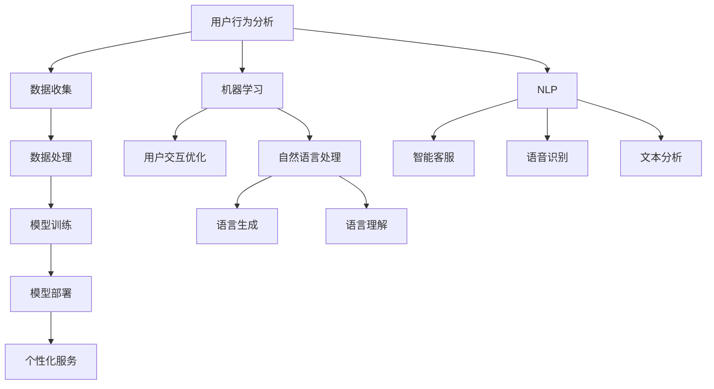

                 

关键词：人工智能、用户体验、算法优化、技术实现、应用场景、未来展望

> 摘要：随着人工智能技术的不断发展，人工智能在提升用户体验方面展现出了巨大的潜力。本文将从多个角度探讨人工智能如何通过算法优化、技术实现和应用创新来提升用户体验，并对未来发展的趋势与挑战进行展望。

## 1. 背景介绍

用户体验（User Experience，简称UX）在产品设计和开发中占据了至关重要的地位。一个优秀的产品不仅仅要功能完善，更需要在用户使用过程中提供流畅、愉悦的体验。随着互联网的普及和用户需求的多样化，提升用户体验已成为企业竞争的关键因素。

近年来，人工智能（Artificial Intelligence，简称AI）技术的迅速发展，为提升用户体验提供了新的思路和手段。从智能推荐系统到虚拟助手，从图像识别到自然语言处理，人工智能的应用已经在很多领域取得了显著成效。本文将探讨人工智能在以下几个方面如何提升用户体验：

- 算法优化：通过智能算法提高系统性能，降低用户等待时间。
- 技术实现：利用AI技术实现个性化服务，满足用户个性化需求。
- 应用创新：将AI应用于新型产品和服务中，提供前所未有的用户体验。

## 2. 核心概念与联系

在探讨人工智能提升用户体验的方法之前，我们需要了解一些核心概念和其相互关系。

### 2.1. 用户行为分析

用户行为分析是通过收集和分析用户在使用产品或服务时的行为数据，来了解用户需求和使用习惯。这包括点击流分析、浏览时长、页面停留时间、用户交互行为等。

### 2.2. 机器学习

机器学习是一种让计算机通过数据学习并做出决策的技术。通过训练模型，机器学习可以识别用户行为模式，提供个性化推荐。

### 2.3. 自然语言处理

自然语言处理（Natural Language Processing，简称NLP）是人工智能的一个分支，旨在使计算机能够理解、解释和生成人类语言。在用户体验提升中，NLP技术可以用于智能客服、语音识别和文本分析。

### 2.4. 人工智能架构

人工智能架构是指用于实现AI功能的技术和系统设计。包括数据收集、处理、存储、模型训练和部署等环节。

下面是核心概念原理和架构的Mermaid流程图：

## 3. 核心算法原理 & 具体操作步骤

### 3.1 算法原理概述

在提升用户体验的过程中，核心算法的原理至关重要。以下是几种常用的AI算法及其原理：

- **协同过滤（Collaborative Filtering）**：通过分析用户的历史行为和偏好，为用户推荐相似的产品或内容。
- **决策树（Decision Tree）**：通过一系列条件判断，将用户分类，以实现个性化推荐。
- **支持向量机（Support Vector Machine，简称SVM）**：用于分类和回归分析，帮助系统做出精准的预测。
- **神经网络（Neural Network）**：模仿人脑神经网络结构，用于复杂模式识别和预测。

### 3.2 算法步骤详解

以下是使用协同过滤算法推荐商品的步骤：

1. **数据收集**：收集用户的行为数据，如购买历史、浏览记录、评分等。
2. **数据预处理**：清洗数据，去除噪声，并将数据转换为算法可处理的格式。
3. **计算相似度**：计算用户之间的相似度，常用的相似度度量方法有余弦相似度和皮尔逊相关系数。
4. **生成推荐列表**：根据用户相似度和商品评分，生成个性化的推荐列表。
5. **评估与优化**：评估推荐系统的效果，根据评估结果优化算法参数。

### 3.3 算法优缺点

- **协同过滤**：优点是简单易实现，效果好；缺点是容易产生“冷启动”问题，即对新用户无法提供有效的推荐。
- **决策树**：优点是易于理解和实现，可解释性强；缺点是对于复杂问题可能效果不佳。
- **支持向量机**：优点是泛化能力强，可处理高维数据；缺点是训练时间较长，对参数敏感。
- **神经网络**：优点是强大且灵活，能处理复

