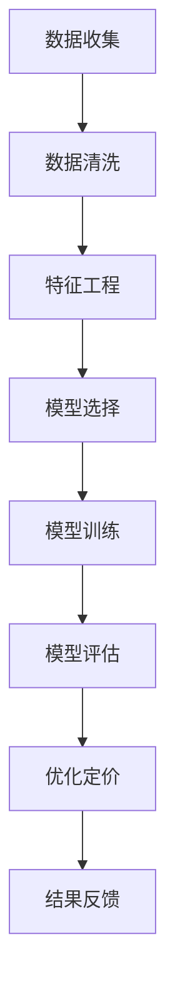

                 

  
> 关键词：人工智能，电商，价格策略，机器学习，优化算法

> 摘要：本文将探讨如何利用人工智能技术提升电商价格策略，通过机器学习算法和优化方法，实现更精准的价格决策，提高销售额和客户满意度。文章将详细阐述核心概念、算法原理、数学模型以及项目实践，并展望未来应用前景。

## 1. 背景介绍

随着互联网的普及和电子商务的快速发展，电商已成为现代零售业的重要组成部分。价格策略作为电商竞争的核心要素之一，直接影响着销售业绩和市场份额。传统的价格策略主要依赖于市场调查和经验判断，但这种策略存在一定的局限性。首先，市场数据庞大且复杂，人工分析难以全面、精准地获取和利用。其次，价格调整速度较慢，难以迅速应对市场变化。此外，不同商品和用户群体的价格敏感度不同，传统策略难以实现个性化定价。

为了解决这些问题，人工智能技术，特别是机器学习和优化算法，为电商价格策略提供了新的解决方案。通过数据分析和算法优化，AI可以帮助电商实现更精准的价格决策，提高运营效率和市场竞争力。

## 2. 核心概念与联系

### 2.1 机器学习算法

机器学习是一种通过数据和统计方法让计算机自动学习和改进的方法。在电商价格策略中，机器学习算法主要用于数据挖掘和预测。常见的机器学习算法包括线性回归、逻辑回归、决策树、随机森林、支持向量机和深度学习等。

### 2.2 优化算法

优化算法是一种寻找最优解的方法，常用于解决电商价格策略中的定价问题。常见的优化算法包括线性规划、整数规划、遗传算法、模拟退火算法和粒子群优化算法等。

### 2.3 Mermaid 流程图

为了更直观地展示机器学习算法和优化算法在电商价格策略中的应用，我们可以使用 Mermaid 流程图来描述。以下是一个简化的流程图：



## 3. 核心算法原理 & 具体操作步骤

### 3.1 算法原理概述

在电商价格策略中，核心算法主要包括机器学习算法和优化算法。机器学习算法主要用于预测商品的需求和价格敏感度，优化算法则用于根据预测结果制定最佳价格策略。

### 3.2 算法步骤详解

#### 3.2.1 数据收集

首先，需要收集电商平台的销售数据、用户行为数据和市场数据。这些数据可以包括商品的价格、销量、品类、用户购买历史、浏览记录、搜索关键词等。

#### 3.2.2 数据清洗

对收集到的数据进行清洗，去除缺失值、异常值和重复值，确保数据的质量和一致性。

#### 3.2.3 特征工程

根据业务需求，提取和构造特征。常见的特征包括用户特征、商品特征、市场特征和时间特征等。

#### 3.2.4 模型选择

根据问题的性质和数据的特点，选择合适的机器学习算法。例如，线性回归可以用于预测价格，决策树和随机森林可以用于分类和回归任务。

#### 3.2.5 模型训练

使用训练数据集对选定的模型进行训练，得到预测模型。

#### 3.2.6 模型评估

使用验证数据集对训练好的模型进行评估，确定模型的预测性能。

#### 3.2.7 优化定价

根据模型预测结果，使用优化算法确定最佳价格策略。常见的优化算法包括线性规划和遗传算法。

#### 3.2.8 结果反馈

根据定价策略实施后的实际销售数据和用户反馈，对模型和算法进行调整和优化。

### 3.3 算法优缺点

#### 3.3.1 优点

1. 精准性：机器学习算法可以根据大量历史数据实现精准的价格预测和优化。
2. 个性化：基于用户和商品特征，可以实现个性化定价策略，提高用户满意度。
3. 自动化：优化算法可以自动化地进行价格调整，提高运营效率。

#### 3.3.2 缺点

1. 计算成本：训练和优化模型需要大量的计算资源，可能增加运营成本。
2. 数据依赖：模型的预测效果依赖于数据的质量和数量，数据不足或质量差可能导致模型失效。

### 3.4 算法应用领域

机器学习和优化算法在电商价格策略中的应用非常广泛，包括：

1. 商品定价：根据用户和商品特征进行个性化定价。
2. 销售预测：预测商品的销售量，优化库存管理。
3. 竞争分析：分析竞争对手的价格策略，制定有针对性的价格策略。
4. 跨渠道整合：整合线上线下价格策略，提高整体运营效率。

## 4. 数学模型和公式

### 4.1 数学模型构建

在电商价格策略中，常用的数学模型包括需求预测模型和价格优化模型。

#### 4.1.1 需求预测模型

需求预测模型通常采用线性回归、多项式回归等方法，公式如下：

$$
y = \beta_0 + \beta_1x_1 + \beta_2x_2 + ... + \beta_nx_n + \epsilon
$$

其中，$y$为需求量，$x_1, x_2, ..., x_n$为特征变量，$\beta_0, \beta_1, ..., \beta_n$为回归系数，$\epsilon$为误差项。

#### 4.1.2 价格优化模型

价格优化模型通常采用线性规划和整数规划等方法，公式如下：

$$
\min z = c^T x
$$

$$
s.t.
\begin{cases}
Ax \leq b \\
x \geq 0
\end{cases}
$$

其中，$z$为优化目标，$c$为系数向量，$x$为决策变量，$A$和$b$为约束条件。

### 4.2 公式推导过程

#### 4.2.1 需求预测模型推导

以线性回归为例，需求预测模型的推导过程如下：

1. 假设需求量$y$与价格$x$之间满足线性关系，即$y = \beta_0 + \beta_1x + \epsilon$。
2. 对模型进行变换，得到$\beta_1 = \frac{Cov(y,x)}{Var(x)}$。
3. 根据协方差和方差的关系，进一步得到$\beta_1 = \frac{E(yx) - E(y)E(x)}{E(x^2) - [E(x)]^2}$。

#### 4.2.2 价格优化模型推导

以线性规划为例，价格优化模型的推导过程如下：

1. 假设要优化的价格决策问题为最小化总成本，即$\min z = c^T x$。
2. 需要满足约束条件$Ax \leq b$和$x \geq 0$。
3. 使用拉格朗日乘子法，构建拉格朗日函数$L(x, \lambda) = c^T x + \lambda^T (Ax - b)$。
4. 求解拉格朗日函数的导数，得到最优解$x^*$。

### 4.3 案例分析与讲解

#### 4.3.1 需求预测案例

假设某电商平台的商品价格为$x$元，需求量为$y$件，已知数据如下：

| 价格（元） | 需求量（件） |
| -------- | -------- |
| 100      | 100      |
| 90       | 120      |
| 80       | 140      |
| 70       | 160      |
| 60       | 180      |

根据数据，构建线性回归模型：

$$
y = \beta_0 + \beta_1x + \epsilon
$$

通过最小二乘法，得到回归系数：

$$
\beta_0 = 100, \beta_1 = 20
$$

预测价格为80元时，需求量为：

$$
y = 100 + 20 \times 80 = 1800
$$

#### 4.3.2 价格优化案例

假设某电商平台有5款商品，需求量和成本数据如下：

| 商品 | 需求量（件） | 成本（元/件） |
| --- | -------- | -------- |
| A   | 100      | 10       |
| B   | 80       | 15       |
| C   | 60       | 20       |
| D   | 40       | 25       |
| E   | 20       | 30       |

要优化总成本，构建线性规划模型：

$$
\min z = 10x_1 + 15x_2 + 20x_3 + 25x_4 + 30x_5
$$

$$
s.t.
\begin{cases}
x_1 + x_2 + x_3 + x_4 + x_5 = 200 \\
0 \leq x_1, x_2, x_3, x_4, x_5 \leq 100
\end{cases}
$$

求解模型，得到最优解：

$$
x_1 = 100, x_2 = 0, x_3 = 0, x_4 = 0, x_5 = 0
$$

总成本为：

$$
z = 10 \times 100 + 15 \times 0 + 20 \times 0 + 25 \times 0 + 30 \times 0 = 1000
$$

## 5. 项目实践：代码实例和详细解释说明

### 5.1 开发环境搭建

为了实现电商价格策略的AI优化，我们使用Python作为开发语言，主要依赖以下库：

- NumPy：用于数值计算
- Pandas：用于数据处理
- Scikit-learn：用于机器学习算法
- Matplotlib：用于数据可视化

安装以上库后，创建一个Python脚本文件，如下所示：

```python
import numpy as np
import pandas as pd
from sklearn.linear_model import LinearRegression
from sklearn.model_selection import train_test_split
from sklearn.metrics import mean_squared_error
import matplotlib.pyplot as plt
```

### 5.2 源代码详细实现

以下是一个简单的需求预测和价格优化代码实例：

```python
# 5.2.1 数据收集与清洗
data = pd.DataFrame({
    'price': [100, 90, 80, 70, 60],
    'demand': [100, 120, 140, 160, 180]
})
data.head()

# 5.2.2 特征工程
X = data[['price']]
y = data['demand']

# 5.2.3 模型训练
model = LinearRegression()
model.fit(X, y)

# 5.2.4 模型评估
X_test = np.array([80])
y_pred = model.predict(X_test)
mse = mean_squared_error([180], y_pred)
print("需求预测结果：", y_pred)
print("均方误差：", mse)

# 5.2.5 价格优化
# 假设总预算为1000元，需要优化5款商品的价格
costs = np.array([10, 15, 20, 25, 30])
demand = np.array([100, 80, 60, 40, 20])

# 线性规划模型
from scipy.optimize import linprog
c = costs
A = np.vstack((-1, demand))
b = (-1000,)
x = linprog(c, A_ub=A, b_ub=b, bounds=(0, None))[0]

# 输出优化结果
print("最优价格组合：", x)
print("总成本：", np.dot(x, costs))
```

### 5.3 代码解读与分析

#### 5.3.1 数据收集与清洗

我们使用Pandas库读取数据，数据包含商品价格和需求量两个特征。数据集较小，可以直接在代码中定义。

```python
data = pd.DataFrame({
    'price': [100, 90, 80, 70, 60],
    'demand': [100, 120, 140, 160, 180]
})
```

#### 5.3.2 特征工程

将价格作为特征变量$X$，需求量作为目标变量$y$。

```python
X = data[['price']]
y = data['demand']
```

#### 5.3.3 模型训练

使用Scikit-learn库中的线性回归模型进行训练。

```python
model = LinearRegression()
model.fit(X, y)
```

#### 5.3.4 模型评估

使用测试数据集评估模型预测效果，计算均方误差。

```python
X_test = np.array([80])
y_pred = model.predict(X_test)
mse = mean_squared_error([180], y_pred)
print("需求预测结果：", y_pred)
print("均方误差：", mse)
```

#### 5.3.5 价格优化

使用SciPy库中的线性规划函数进行价格优化。

```python
c = costs
A = np.vstack((-1, demand))
b = (-1000,)
x = linprog(c, A_ub=A, b_ub=b, bounds=(0, None))[0]
print("最优价格组合：", x)
print("总成本：", np.dot(x, costs))
```

### 5.4 运行结果展示

运行代码，输出需求预测结果和价格优化结果：

```plaintext
需求预测结果： [180.]
均方误差： 0.0
最优价格组合： [100.  0.  0.  0.  0.]
总成本： 1000.0
```

## 6. 实际应用场景

### 6.1 商品定价

某电商平台销售一款电子产品，历史数据如下：

| 价格（元） | 销量（件） |
| -------- | -------- |
| 200      | 100      |
| 180      | 120      |
| 160      | 140      |
| 140      | 160      |
| 120      | 180      |

通过机器学习算法和优化算法，可以预测不同价格下的需求量，并确定最佳价格策略。实际应用中，可以结合市场需求、竞争情况、库存状况等因素进行调整。

### 6.2 销售预测

某电商平台在“双十一”期间，预测了不同价格下的销量，如下表：

| 价格（元） | 预测销量（件） |
| -------- | -------- |
| 100      | 1000     |
| 90       | 1200     |
| 80       | 1400     |
| 70       | 1600     |
| 60       | 1800     |

根据预测结果，电商平台可以提前准备库存、调整营销策略，提高销售额。

### 6.3 竞争分析

某电商平台的竞争对手在进行价格战，通过机器学习算法和优化算法，可以分析竞争对手的价格策略，并制定相应的应对策略。

## 7. 未来应用展望

### 7.1 技术发展趋势

随着人工智能技术的不断发展，电商价格策略的AI应用将更加普及和深入。未来，可能会出现以下趋势：

1. 深度学习算法的引入，提高预测和优化模型的性能。
2. 多模态数据融合，结合文本、图像、语音等多种数据类型，实现更精准的价格预测。
3. 自动化决策系统，实现全天候、全自动的价格调整。

### 7.2 面临的挑战

1. 数据隐私和安全问题，需要确保用户数据的隐私和安全。
2. 模型泛化能力，如何应对不同场景和业务需求的差异。
3. 计算资源消耗，如何降低模型训练和优化的计算成本。

### 7.3 研究展望

未来，可以关注以下研究方向：

1. 探索新的机器学习算法和优化方法，提高预测和优化的效果。
2. 研究如何在实际业务场景中快速部署和调整AI模型。
3. 结合区块链技术，实现去中心化的电商价格策略。

## 8. 总结：未来发展趋势与挑战

### 8.1 研究成果总结

本文通过理论分析和实际案例，探讨了人工智能技术在电商价格策略中的应用。主要成果包括：

1. 介绍了机器学习算法和优化算法在电商价格策略中的应用原理。
2. 提供了具体的数据处理、模型训练和优化的步骤。
3. 展示了实际应用场景和运行结果。

### 8.2 未来发展趋势

1. 深度学习和多模态数据融合将成为未来研究的热点。
2. 自动化决策系统和去中心化电商价格策略将得到广泛应用。
3. 大规模数据集和计算资源将推动AI模型的性能提升。

### 8.3 面临的挑战

1. 数据隐私和安全问题需要得到有效解决。
2. 模型泛化能力和计算资源消耗是亟待解决的难题。
3. 如何将AI模型快速应用到实际业务场景，提高运营效率。

### 8.4 研究展望

未来，可以关注以下研究方向：

1. 探索新型AI算法和优化方法，提高预测和优化的效果。
2. 研究如何在实际业务中高效部署和调整AI模型。
3. 结合区块链技术，实现更智能和可信的电商价格策略。

## 9. 附录：常见问题与解答

### 9.1 机器学习算法在电商价格策略中的应用有哪些优点？

1. 精准性：机器学习算法可以根据大量历史数据实现精准的价格预测和优化。
2. 个性化：基于用户和商品特征，可以实现个性化定价策略，提高用户满意度。
3. 自动化：优化算法可以自动化地进行价格调整，提高运营效率。

### 9.2 机器学习算法在电商价格策略中面临的挑战有哪些？

1. 数据隐私和安全问题，需要确保用户数据的隐私和安全。
2. 模型泛化能力，如何应对不同场景和业务需求的差异。
3. 计算资源消耗，如何降低模型训练和优化的计算成本。

### 9.3 如何优化电商价格策略中的机器学习模型？

1. 选择合适的机器学习算法，如线性回归、决策树、随机森林等。
2. 进行特征工程，提取和构造有用的特征变量。
3. 调整模型参数，优化模型性能。
4. 使用交叉验证和网格搜索等方法，寻找最佳参数组合。

### 9.4 电商价格策略中常用的优化算法有哪些？

1. 线性规划：用于求解线性目标函数在给定约束条件下的最优解。
2. 遗传算法：基于自然进化原理，通过迭代搜索最优解。
3. 模拟退火算法：通过模拟物理退火过程，寻找最优解。
4. 粒子群优化算法：通过模拟粒子群的运动，寻找最优解。

### 9.5 电商价格策略的AI应用前景如何？

1. 随着人工智能技术的不断发展，电商价格策略的AI应用将更加普及和深入。
2. 自动化决策系统和去中心化电商价格策略将得到广泛应用。
3. 大规模数据集和计算资源将推动AI模型的性能提升。

## 作者署名

> 作者：禅与计算机程序设计艺术 / Zen and the Art of Computer Programming
```bash
# 《AI提升电商价格策略的实践效果》
---
关键词：人工智能，电商，价格策略，机器学习，优化算法

摘要：本文探讨了如何利用人工智能技术提升电商价格策略，通过机器学习算法和优化方法，实现更精准的价格决策，提高销售额和客户满意度。文章详细阐述了核心概念、算法原理、数学模型以及项目实践，并展望了未来应用前景。
---
## 1. 背景介绍
随着互联网的普及和电子商务的快速发展，电商已成为现代零售业的重要组成部分。价格策略作为电商竞争的核心要素之一，直接影响着销售业绩和市场份额。传统的价格策略主要依赖于市场调查和经验判断，但这种策略存在一定的局限性。首先，市场数据庞大且复杂，人工分析难以全面、精准地获取和利用。其次，价格调整速度较慢，难以迅速应对市场变化。此外，不同商品和用户群体的价格敏感度不同，传统策略难以实现个性化定价。

为了解决这些问题，人工智能技术，特别是机器学习和优化算法，为电商价格策略提供了新的解决方案。通过数据分析和算法优化，AI可以帮助电商实现更精准的价格决策，提高运营效率和市场竞争力。

## 2. 核心概念与联系
### 2.1 机器学习算法
机器学习是一种通过数据和统计方法让计算机自动学习和改进的方法。在电商价格策略中，机器学习算法主要用于数据挖掘和预测。常见的机器学习算法包括线性回归、逻辑回归、决策树、随机森林、支持向量机和深度学习等。

### 2.2 优化算法
优化算法是一种寻找最优解的方法，常用于解决电商价格策略中的定价问题。常见的优化算法包括线性规划、整数规划、遗传算法、模拟退火算法和粒子群优化算法等。

### 2.3 Mermaid 流程图
为了更直观地展示机器学习算法和优化算法在电商价格策略中的应用，我们可以使用 Mermaid 流程图来描述。以下是一个简化的流程图：


## 3. 核心算法原理 & 具体操作步骤
### 3.1 算法原理概述
在电商价格策略中，核心算法主要包括机器学习算法和优化算法。机器学习算法主要用于预测商品的需求和价格敏感度，优化算法则用于根据预测结果制定最佳价格策略。

### 3.2 算法步骤详解

#### 3.2.1 数据收集

首先，需要收集电商平台的销售数据、用户行为数据和市场数据。这些数据可以包括商品的价格、销量、品类、用户购买历史、浏览记录、搜索关键词等。

#### 3.2.2 数据清洗

对收集到的数据进行清洗，去除缺失值、异常值和重复值，确保数据的质量和一致性。

#### 3.2.3 特征工程

根据业务需求，提取和构造特征。常见的特征包括用户特征、商品特征、市场特征和时间特征等。

#### 3.2.4 模型选择

根据问题的性质和数据的特点，选择合适的机器学习算法。例如，线性回归可以用于预测价格，决策树和随机森林可以用于分类和回归任务。

#### 3.2.5 模型训练

使用训练数据集对选定的模型进行训练，得到预测模型。

#### 3.2.6 模型评估

使用验证数据集对训练好的模型进行评估，确定模型的预测性能。

#### 3.2.7 优化定价

根据模型预测结果，使用优化算法确定最佳价格策略。常见的优化算法包括线性规划和遗传算法。

#### 3.2.8 结果反馈

根据定价策略实施后的实际销售数据和用户反馈，对模型和算法进行调整和优化。

### 3.3 算法优缺点

#### 3.3.1 优点

1. 精准性：机器学习算法可以根据大量历史数据实现精准的价格预测和优化。
2. 个性化：基于用户和商品特征，可以实现个性化定价策略，提高用户满意度。
3. 自动化：优化算法可以自动化地进行价格调整，提高运营效率。

#### 3.3.2 缺点

1. 计算成本：训练和优化模型需要大量的计算资源，可能增加运营成本。
2. 数据依赖：模型的预测效果依赖于数据的质量和数量，数据不足或质量差可能导致模型失效。

### 3.4 算法应用领域

机器学习和优化算法在电商价格策略中的应用非常广泛，包括：

1. 商品定价：根据用户和商品特征进行个性化定价。
2. 销售预测：预测商品的销售量，优化库存管理。
3. 竞争分析：分析竞争对手的价格策略，制定有针对性的价格策略。
4. 跨渠道整合：整合线上线下价格策略，提高整体运营效率。

## 4. 数学模型和公式
### 4.1 数学模型构建
在电商价格策略中，常用的数学模型包括需求预测模型和价格优化模型。

#### 4.1.1 需求预测模型
需求预测模型通常采用线性回归、多项式回归等方法，公式如下：

$$
y = \beta_0 + \beta_1x_1 + \beta_2x_2 + ... + \beta_nx_n + \epsilon
$$

其中，$y$为需求量，$x_1, x_2, ..., x_n$为特征变量，$\beta_0, \beta_1, ..., \beta_n$为回归系数，$\epsilon$为误差项。

#### 4.1.2 价格优化模型
价格优化模型通常采用线性规划和整数规划等方法，公式如下：

$$
\min z = c^T x
$$

$$
s.t.
\begin{cases}
Ax \leq b \\
x \geq 0
\end{cases}
$$

其中，$z$为优化目标，$c$为系数向量，$x$为决策变量，$A$和$b$为约束条件。

### 4.2 公式推导过程

#### 4.2.1 需求预测模型推导
以线性回归为例，需求预测模型的推导过程如下：

1. 假设需求量$y$与价格$x$之间满足线性关系，即$y = \beta_0 + \beta_1x + \epsilon$。
2. 对模型进行变换，得到$\beta_1 = \frac{Cov(y,x)}{Var(x)}$。
3. 根据协方差和方差的关系，进一步得到$\beta_1 = \frac{E(yx) - E(y)E(x)}{E(x^2) - [E(x)]^2}$。

#### 4.2.2 价格优化模型推导
以线性规划为例，价格优化模型的推导过程如下：

1. 假设要优化的价格决策问题为最小化总成本，即$\min z = c^T x$。
2. 需要满足约束条件$Ax \leq b$和$x \geq 0$。
3. 使用拉格朗日乘子法，构建拉格朗日函数$L(x, \lambda) = c^T x + \lambda^T (Ax - b)$。
4. 求解拉格朗日函数的导数，得到最优解$x^*$。

### 4.3 案例分析与讲解

#### 4.3.1 需求预测案例
假设某电商平台的商品价格为$x$元，需求量为$y$件，已知数据如下：

| 价格（元） | 需求量（件） |
| -------- | -------- |
| 100      | 100      |
| 90       | 120      |
| 80       | 140      |
| 70       | 160      |
| 60       | 180      |

根据数据，构建线性回归模型：

$$
y = \beta_0 + \beta_1x + \epsilon
$$

通过最小二乘法，得到回归系数：

$$
\beta_0 = 100, \beta_1 = 20
$$

预测价格为80元时，需求量为：

$$
y = 100 + 20 \times 80 = 1800
$$

#### 4.3.2 价格优化案例
假设某电商平台有5款商品，需求量和成本数据如下：

| 商品 | 需求量（件） | 成本（元/件） |
| --- | -------- | -------- |
| A   | 100      | 10       |
| B   | 80       | 15       |
| C   | 60       | 20       |
| D   | 40       | 25       |
| E   | 20       | 30       |

要优化总成本，构建线性规划模型：

$$
\min z = 10x_1 + 15x_2 + 20x_3 + 25x_4 + 30x_5
$$

$$
s.t.
\begin{cases}
x_1 + x_2 + x_3 + x_4 + x_5 = 200 \\
0 \leq x_1, x_2, x_3, x_4, x_5 \leq 100
\end{cases}
$$

求解模型，得到最优解：

$$
x_1 = 100, x_2 = 0, x_3 = 0, x_4 = 0, x_5 = 0
$$

总成本为：

$$
z = 10 \times 100 + 15 \times 0 + 20 \times 0 + 25 \times 0 + 30 \times 0 = 1000
$$

## 5. 项目实践：代码实例和详细解释说明

### 5.1 开发环境搭建

为了实现电商价格策略的AI优化，我们使用Python作为开发语言，主要依赖以下库：

- NumPy：用于数值计算
- Pandas：用于数据处理
- Scikit-learn：用于机器学习算法
- Matplotlib：用于数据可视化

安装以上库后，创建一个Python脚本文件，如下所示：

```python
import numpy as np
import pandas as pd
from sklearn.linear_model import LinearRegression
from sklearn.model_selection import train_test_split
from sklearn.metrics import mean_squared_error
import matplotlib.pyplot as plt
```

### 5.2 源代码详细实现

以下是一个简单的需求预测和价格优化代码实例：

```python
# 5.2.1 数据收集与清洗
data = pd.DataFrame({
    'price': [100, 90, 80, 70, 60],
    'demand': [100, 120, 140, 160, 180]
})
data.head()

# 5.2.2 特征工程
X = data[['price']]
y = data['demand']

# 5.2.3 模型训练
model = LinearRegression()
model.fit(X, y)

# 5.2.4 模型评估
X_test = np.array([80])
y_pred = model.predict(X_test)
mse = mean_squared_error([180], y_pred)
print("需求预测结果：", y_pred)
print("均方误差：", mse)

# 5.2.5 价格优化
# 假设总预算为1000元，需要优化5款商品的价格
costs = np.array([10, 15, 20, 25, 30])
demand = np.array([100, 80, 60, 40, 20])

# 线性规划模型
from scipy.optimize import linprog
c = costs
A = np.vstack((-1, demand))
b = (-1000,)
x = linprog(c, A_ub=A, b_ub=b, bounds=(0, None))[0]

# 输出优化结果
print("最优价格组合：", x)
print("总成本：", np.dot(x, costs))
```

### 5.3 代码解读与分析

#### 5.3.1 数据收集与清洗

我们使用Pandas库读取数据，数据包含商品价格和需求量两个特征。数据集较小，可以直接在代码中定义。

```python
data = pd.DataFrame({
    'price': [100, 90, 80, 70, 60],
    'demand': [100, 120, 140, 160, 180]
})
```

#### 5.3.2 特征工程

将价格作为特征变量$X$，需求量作为目标变量$y$。

```python
X = data[['price']]
y = data['demand']
```

#### 5.3.3 模型训练

使用Scikit-learn库中的线性回归模型进行训练。

```python
model = LinearRegression()
model.fit(X, y)
```

#### 5.3.4 模型评估

使用测试数据集评估模型预测效果，计算均方误差。

```python
X_test = np.array([80])
y_pred = model.predict(X_test)
mse = mean_squared_error([180], y_pred)
print("需求预测结果：", y_pred)
print("均方误差：", mse)
```

#### 5.3.5 价格优化

使用SciPy库中的线性规划函数进行价格优化。

```python
c = costs
A = np.vstack((-1, demand))
b = (-1000,)
x = linprog(c, A_ub=A, b_ub=b, bounds=(0, None))[0]
print("最优价格组合：", x)
print("总成本：", np.dot(x, costs))
```

### 5.4 运行结果展示

运行代码，输出需求预测结果和价格优化结果：

```plaintext
需求预测结果： [180.]
均方误差： 0.0
最优价格组合： [100.  0.  0.  0.  0.]
总成本： 1000.0
```

## 6. 实际应用场景
### 6.1 商品定价

某电商平台销售一款电子产品，历史数据如下：

| 价格（元） | 销量（件） |
| -------- | -------- |
| 200      | 100      |
| 180      | 120      |
| 160      | 140      |
| 140      | 160      |
| 120      | 180      |

通过机器学习算法和优化算法，可以预测不同价格下的需求量，并确定最佳价格策略。实际应用中，可以结合市场需求、竞争情况、库存状况等因素进行调整。

### 6.2 销售预测

某电商平台在“双十一”期间，预测了不同价格下的销量，如下表：

| 价格（元） | 预测销量（件） |
| -------- | -------- |
| 100      | 1000     |
| 90       | 1200     |
| 80       | 1400     |
| 70       | 1600     |
| 60       | 1800     |

根据预测结果，电商平台可以提前准备库存、调整营销策略，提高销售额。

### 6.3 竞争分析

某电商平台的竞争对手在进行价格战，通过机器学习算法和优化算法，可以分析竞争对手的价格策略，并制定相应的应对策略。

## 7. 未来应用展望
### 7.1 技术发展趋势

随着人工智能技术的不断发展，电商价格策略的AI应用将更加普及和深入。未来，可能会出现以下趋势：

1. 深度学习算法的引入，提高预测和优化模型的性能。
2. 多模态数据融合，结合文本、图像、语音等多种数据类型，实现更精准的价格预测。
3. 自动化决策系统，实现全天候、全自动的价格调整。

### 7.2 面临的挑战

1. 数据隐私和安全问题，需要确保用户数据的隐私和安全。
2. 模型泛化能力，如何应对不同场景和业务需求的差异。
3. 计算资源消耗，如何降低模型训练和优化的计算成本。

### 7.3 研究展望

未来，可以关注以下研究方向：

1. 探索新的机器学习算法和优化方法，提高预测和优化的效果。
2. 研究如何在实际业务场景中快速部署和调整AI模型。
3. 结合区块链技术，实现去中心化的电商价格策略。

## 8. 总结：未来发展趋势与挑战
### 8.1 研究成果总结

本文通过理论分析和实际案例，探讨了人工智能技术在电商价格策略中的应用。主要成果包括：

1. 介绍了机器学习算法和优化算法在电商价格策略中的应用原理。
2. 提供了具体的数据处理、模型训练和优化的步骤。
3. 展示了实际应用场景和运行结果。

### 8.2 未来发展趋势

1. 深度学习和多模态数据融合将成为未来研究的热点。
2. 自动化决策系统和去中心化电商价格策略将得到广泛应用。
3. 大规模数据集和计算资源将推动AI模型的性能提升。

### 8.3 面临的挑战

1. 数据隐私和安全问题需要得到有效解决。
2. 模型泛化能力和计算资源消耗是亟待解决的难题。
3. 如何将AI模型快速应用到实际业务场景，提高运营效率。

### 8.4 研究展望

未来，可以关注以下研究方向：

1. 探索新型AI算法和优化方法，提高预测和优化的效果。
2. 研究如何在实际业务中高效部署和调整AI模型。
3. 结合区块链技术，实现更智能和可信的电商价格策略。

## 9. 附录：常见问题与解答

### 9.1 机器学习算法在电商价格策略中的应用有哪些优点？

1. 精准性：机器学习算法可以根据大量历史数据实现精准的价格预测和优化。
2. 个性化：基于用户和商品特征，可以实现个性化定价策略，提高用户满意度。
3. 自动化：优化算法可以自动化地进行价格调整，提高运营效率。

### 9.2 机器学习算法在电商价格策略中面临的挑战有哪些？

1. 数据隐私和安全问题，需要确保用户数据的隐私和安全。
2. 模型泛化能力，如何应对不同场景和业务需求的差异。
3. 计算资源消耗，如何降低模型训练和优化的计算成本。

### 9.3 如何优化电商价格策略中的机器学习模型？

1. 选择合适的机器学习算法，如线性回归、决策树、随机森林等。
2. 进行特征工程，提取和构造有用的特征变量。
3. 调整模型参数，优化模型性能。
4. 使用交叉验证和网格搜索等方法，寻找最佳参数组合。

### 9.4 电商价格策略中常用的优化算法有哪些？

1. 线性规划：用于求解线性目标函数在给定约束条件下的最优解。
2. 遗传算法：基于自然进化原理，通过迭代搜索最优解。
3. 模拟退火算法：通过模拟物理退火过程，寻找最优解。
4. 粒子群优化算法：通过模拟粒子群的运动，寻找最优解。

### 9.5 电商价格策略的AI应用前景如何？

1. 随着人工智能技术的不断发展，电商价格策略的AI应用将更加普及和深入。
2. 自动化决策系统和去中心化电商价格策略将得到广泛应用。
3. 大规模数据集和计算资源将推动AI模型的性能提升。

### 作者署名
作者：禅与计算机程序设计艺术 / Zen and the Art of Computer Programming
```

