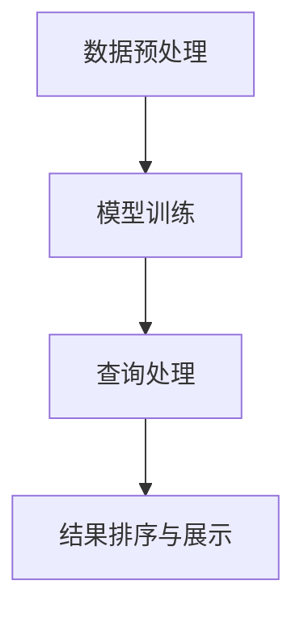

                 

关键词：AI搜索引擎、法律研究、政策分析、文本挖掘、自然语言处理、深度学习、法律文本分析、智能法律咨询。

> 摘要：本文旨在探讨AI搜索引擎在法律和政策研究中的应用，通过对AI搜索引擎的工作原理、核心概念和架构，以及具体的算法原理和操作步骤的详细介绍，分析其在法律和政策领域的实际应用场景，并展望其未来的发展趋势与挑战。本文的目标是为法律和政策研究者提供一个全面的技术指南，帮助其更好地利用AI搜索引擎进行法律和政策研究。

## 1. 背景介绍

随着互联网的飞速发展和大数据时代的来临，法律和政策领域也迎来了前所未有的信息爆炸。大量的法律文件、政策报告、学术论文和案例判决等文本资料充斥着网络，给法律和政策研究带来了巨大的挑战。传统的法律研究方法往往依赖于人工查阅和整理，效率低下，且容易受到个人经验和主观判断的影响。因此，如何有效地从海量文本数据中提取有用信息，成为法律和政策研究者亟需解决的关键问题。

近年来，人工智能（AI）技术的飞速发展，特别是自然语言处理（NLP）和深度学习技术的突破，为法律和政策研究提供了新的机遇。AI搜索引擎作为一种基于AI技术的智能搜索工具，能够通过对海量文本数据的学习和处理，提供快速、准确、个性化的搜索结果，极大地提高了法律和政策研究的效率。

本文将从以下几个方面展开讨论：

1. **AI搜索引擎的工作原理和核心概念**：介绍AI搜索引擎的基本原理、核心概念和架构，并给出一个Mermaid流程图，帮助读者理解其内部工作流程。
2. **核心算法原理和具体操作步骤**：详细阐述AI搜索引擎的核心算法原理、具体操作步骤以及算法优缺点，并分析其应用领域。
3. **数学模型和公式讲解**：介绍AI搜索引擎中涉及的数学模型和公式，并进行详细讲解和举例说明。
4. **项目实践：代码实例和详细解释说明**：通过一个具体的代码实例，展示如何使用AI搜索引擎进行法律和政策研究，并对代码进行详细解读和分析。
5. **实际应用场景**：分析AI搜索引擎在法律和政策研究中的实际应用场景，包括智能法律咨询、法律文档检索、政策分析等。
6. **未来应用展望**：展望AI搜索引擎在法律和政策研究领域的未来发展趋势和面临的挑战。

## 2. 核心概念与联系

### 2.1 AI搜索引擎的基本原理

AI搜索引擎是基于人工智能技术构建的智能搜索系统，其核心思想是通过学习海量文本数据，理解用户的查询意图，并从海量的文本库中检索出与查询意图最相关的结果。AI搜索引擎的基本原理可以概括为以下几个步骤：

1. **数据预处理**：对原始文本数据（如法律文档、政策报告等）进行清洗、分词、去停用词等预处理操作，将其转换为适合模型训练的格式。
2. **模型训练**：使用机器学习算法（如深度学习、监督学习等）对预处理后的文本数据进行训练，构建能够理解文本语义的模型。
3. **查询处理**：当用户提交查询请求时，AI搜索引擎会对查询请求进行预处理，理解其意图，并使用训练好的模型对海量的文本库进行检索，找出与查询意图最相关的结果。
4. **结果排序与展示**：根据检索结果的相似度对结果进行排序，并将排序后的结果展示给用户。

### 2.2 AI搜索引擎的架构

AI搜索引擎的架构可以分为以下几个部分：

1. **数据层**：包括原始文本数据（如法律文档、政策报告等）的存储和管理。
2. **模型层**：包括用于训练的机器学习模型和深度学习模型，如词向量模型、语义相似度模型等。
3. **查询层**：包括查询预处理模块、检索模块和结果排序模块，用于处理用户的查询请求并生成搜索结果。
4. **展示层**：包括前端界面和后端服务器，用于将搜索结果以用户友好的方式展示给用户。

### 2.3 Mermaid流程图

以下是一个简化的Mermaid流程图，展示了AI搜索引擎的基本工作流程：



在这个流程图中，A表示数据预处理，B表示模型训练，C表示查询处理，D表示结果排序与展示。这些步骤共同构成了AI搜索引擎的核心工作流程。

## 3. 核心算法原理 & 具体操作步骤

### 3.1 算法原理概述

AI搜索引擎的核心算法主要涉及自然语言处理（NLP）和深度学习（DL）技术。NLP技术用于处理和理解文本数据，而DL技术则用于构建能够自主学习语义信息的模型。以下是AI搜索引擎的核心算法原理：

1. **词向量模型**：词向量模型是将文本数据转换为向量的方法，如Word2Vec、GloVe等。这些模型能够将词语映射到高维空间中的向量，使得语义相似的词语在向量空间中更接近。
2. **语义相似度模型**：语义相似度模型用于计算两个文本片段的语义相似度，如BERT、GPT等。这些模型通过深度学习技术，能够理解词语和句子的语义信息，从而实现更精确的文本检索。
3. **检索算法**：检索算法用于从海量的文本库中检索出与查询意图最相关的结果。常用的检索算法包括向量空间模型（VSM）、TF-IDF等。

### 3.2 算法步骤详解

以下是AI搜索引擎的具体操作步骤：

1. **数据预处理**：首先，对原始文本数据进行清洗、分词、去停用词等预处理操作，将其转换为适合模型训练的格式。这一步的目的是降低文本数据中的噪声，提高模型的训练效果。
2. **模型训练**：使用词向量模型（如Word2Vec）和语义相似度模型（如BERT）对预处理后的文本数据进行训练。这一步的目的是构建能够理解文本语义的模型，从而实现更精确的文本检索。
3. **查询处理**：当用户提交查询请求时，对查询请求进行预处理，将其转换为向量表示。这一步的目的是将用户的查询意图转化为模型能够理解的语义信息。
4. **检索与排序**：使用训练好的模型，对海量的文本库进行检索，并计算每个文本片段与查询请求的语义相似度。根据相似度对检索结果进行排序，并将排序后的结果展示给用户。

### 3.3 算法优缺点

AI搜索引擎具有以下优缺点：

1. **优点**：
   - **高效率**：AI搜索引擎能够快速地从海量文本数据中检索出与查询意图最相关的结果，大大提高了法律和政策研究的效率。
   - **高准确性**：通过深度学习技术，AI搜索引擎能够理解文本的语义信息，从而实现更精确的文本检索，降低了误检率和漏检率。
   - **个性化**：AI搜索引擎能够根据用户的查询历史和偏好，提供个性化的搜索结果，满足不同用户的需求。

2. **缺点**：
   - **数据依赖性**：AI搜索引擎的性能高度依赖于训练数据的质量和数量。如果训练数据不足或质量不高，可能会影响模型的性能。
   - **计算成本**：AI搜索引擎的训练和检索过程需要大量的计算资源，尤其是深度学习模型，对硬件设备的要求较高。

### 3.4 算法应用领域

AI搜索引擎在法律和政策研究领域的应用非常广泛，主要包括以下几个方面：

1. **智能法律咨询**：AI搜索引擎可以帮助用户快速查找法律条款、案例判决和政策文件，提供智能化的法律咨询服务。
2. **法律文档检索**：AI搜索引擎可以用于检索法律数据库，快速找到与特定法律问题相关的法律文档。
3. **政策分析**：AI搜索引擎可以帮助研究人员快速了解某一政策领域的相关政策和文献，提供政策分析的支持。

## 4. 数学模型和公式 & 详细讲解 & 举例说明

### 4.1 数学模型构建

在AI搜索引擎中，常用的数学模型包括词向量模型和语义相似度模型。以下分别介绍这两个模型的构建过程。

#### 4.1.1 词向量模型

词向量模型是一种将词语映射到高维空间中的向量表示方法。其核心思想是利用语义信息将词语进行编码，使得语义相似的词语在向量空间中更接近。

假设有一个词汇表V，包含N个词语。对于每个词语v∈V，我们可以将其映射为一个N维的词向量xv。常用的词向量模型包括Word2Vec和GloVe。

1. **Word2Vec**：Word2Vec模型分为两种：连续词袋（CBOW）和Skip-Gram。CBOW模型通过上下文词语预测目标词语，而Skip-Gram模型通过目标词语预测上下文词语。其数学模型可以表示为：

   $$ h = \text{激活函数}(\text{权重矩阵} \cdot [x_{\text{context}}^T, x_{\text{target}}^T]) $$

   其中，$x_{\text{context}}$和$x_{\text{target}}$分别为上下文词语和目标词语的词向量，权重矩阵用于编码词向量之间的关联性。

2. **GloVe**：GloVe模型通过共现矩阵计算词语的相似性，从而构建词向量。其数学模型可以表示为：

   $$ \text{similarity}(v_i, v_j) = \frac{\text{exp}(-\text{similarity}(v_i, v_j))}{\sum_{k=1}^{K} \text{exp}(-\text{similarity}(v_i, v_k))} $$

   其中，$v_i$和$v_j$分别为词语i和j的词向量，K为词汇表大小。

#### 4.1.2 语义相似度模型

语义相似度模型用于计算两个文本片段的语义相似度。常用的模型包括BERT、GPT等。这些模型通过深度学习技术，能够理解文本的语义信息，从而实现更精确的文本检索。

BERT（Bidirectional Encoder Representations from Transformers）是一种基于Transformer模型的预训练语言表示模型。其数学模型可以表示为：

$$ \text{BERT}(\text{x}) = \text{softmax}(\text{W}_\text{vocab} \cdot \text{Tanh}(\text{MLP}(\text{W}_\text{enc} \cdot \text{ EmbeddingLayer}(\text{x}) + \text{PositionalEncoding}(\text{x}) ))) $$

其中，$x$为输入文本，$W_\text{vocab}$为词汇表权重矩阵，$W_\text{enc}$为编码层权重矩阵，$EmbeddingLayer$为嵌入层，$PositionalEncoding$为位置编码。

### 4.2 公式推导过程

在本节中，我们将详细推导词向量模型和语义相似度模型中的关键公式。

#### 4.2.1 Word2Vec

1. **CBOW模型**：

   - **损失函数**：

     $$ \text{Loss} = -\sum_{\text{target}} \text{log}(\text{softmax}(\text{weights} \cdot \text{x}_{\text{context}}^T)) $$

     其中，$\text{x}_{\text{context}}$为上下文词语的词向量，$\text{weights}$为权重矩阵，$\text{softmax}$为软最大化函数。

   - **梯度计算**：

     $$ \frac{\partial \text{Loss}}{\partial \text{weights}} = -\sum_{\text{target}} (\text{x}_{\text{context}} \odot \frac{\partial \text{softmax}}{\partial \text{weights}}) $$

     其中，$\odot$表示Hadamard积。

2. **Skip-Gram模型**：

   - **损失函数**：

     $$ \text{Loss} = -\sum_{\text{target}} \text{log}(\text{softmax}(\text{weights} \cdot \text{x}_{\text{target}}^T)) $$

     其中，$\text{x}_{\text{target}}$为目标词语的词向量，$\text{weights}$为权重矩阵，$\text{softmax}$为软最大化函数。

   - **梯度计算**：

     $$ \frac{\partial \text{Loss}}{\partial \text{weights}} = -\sum_{\text{target}} (\text{x}_{\text{target}} \odot \frac{\partial \text{softmax}}{\partial \text{weights}}) $$

#### 4.2.2 BERT

1. **损失函数**：

   $$ \text{Loss} = -\sum_{\text{token}} \text{log}(\text{softmax}(\text{W}_\text{vocab} \cdot \text{Tanh}(\text{MLP}(\text{W}_\text{enc} \cdot \text{ EmbeddingLayer}(\text{x}) + \text{PositionalEncoding}(\text{x}) ))) $$

   其中，$x$为输入文本，$W_\text{vocab}$为词汇表权重矩阵，$W_\text{enc}$为编码层权重矩阵，$EmbeddingLayer$为嵌入层，$PositionalEncoding$为位置编码。

2. **梯度计算**：

   $$ \frac{\partial \text{Loss}}{\partial \text{weights}} = -\sum_{\text{token}} (\text{x} \odot \frac{\partial \text{softmax}}{\partial \text{weights}}) $$

### 4.3 案例分析与讲解

在本节中，我们将通过一个具体的案例，展示如何使用AI搜索引擎进行法律和政策研究。

#### 4.3.1 案例背景

假设有一位法律研究者，想了解关于“合同法”的最新发展和相关案例判决。

#### 4.3.2 操作步骤

1. **数据预处理**：首先，对原始的法律文档进行清洗、分词、去停用词等预处理操作，将其转换为适合模型训练的格式。

2. **模型训练**：使用BERT模型对预处理后的法律文档进行训练，构建一个能够理解法律文本语义的模型。

3. **查询处理**：当研究者提交查询请求时，对查询请求进行预处理，将其转换为向量表示。例如，查询请求为“合同法最新发展”，可以使用BERT模型将其编码为一个向量。

4. **检索与排序**：使用训练好的BERT模型，对海量的法律文档进行检索，并计算每个文档与查询请求的语义相似度。根据相似度对检索结果进行排序，并将排序后的结果展示给研究者。

#### 4.3.3 结果分析

通过AI搜索引擎的检索和排序，研究者可以获得与查询请求最相关的法律文档。例如，系统可能会返回一系列关于“合同法”的最新判决和学术文章。研究者可以根据这些文档进一步分析和研究。

## 5. 项目实践：代码实例和详细解释说明

### 5.1 开发环境搭建

在本案例中，我们使用Python作为开发语言，结合Hugging Face的Transformers库和TensorFlow作为深度学习框架，实现一个基于BERT的AI搜索引擎。以下是开发环境的搭建步骤：

1. **安装Python**：确保已经安装了Python 3.6及以上版本。

2. **安装TensorFlow**：在终端执行以下命令安装TensorFlow：

   ```bash
   pip install tensorflow
   ```

3. **安装Hugging Face的Transformers库**：在终端执行以下命令安装Transformers库：

   ```bash
   pip install transformers
   ```

### 5.2 源代码详细实现

以下是一个简单的基于BERT的AI搜索引擎的源代码实现：

```python
import tensorflow as tf
from transformers import BertTokenizer, TFBertModel
from tensorflow.keras.layers import Dense, Flatten
from tensorflow.keras.models import Model

# 1. 加载预训练BERT模型和分词器
tokenizer = BertTokenizer.from_pretrained('bert-base-uncased')
model = TFBertModel.from_pretrained('bert-base-uncased')

# 2. 定义输入层和输出层
input_ids = tf.keras.layers.Input(shape=(None,), dtype=tf.int32)
input_mask = tf.keras.layers.Input(shape=(None,), dtype=tf.int32)
segment_ids = tf.keras.layers.Input(shape=(None,), dtype=tf.int32)

# 3. 通过BERT模型处理输入文本
output = model(input_ids, attention_mask=input_mask, token_type_ids=segment_ids)

# 4. 提取最后一层隐藏状态
last_hidden_state = output.last_hidden_state

# 5. 使用全连接层提取特征
flatten = Flatten()(last_hidden_state)

# 6. 添加分类层
output = Dense(1, activation='sigmoid')(flatten)

# 7. 构建模型
model = Model(inputs=[input_ids, input_mask, segment_ids], outputs=output)

# 8. 编译模型
model.compile(optimizer='adam', loss='binary_crossentropy', metrics=['accuracy'])

# 9. 模型训练
model.fit([input_ids_train, input_mask_train, segment_ids_train], labels_train, epochs=3)

# 10. 模型评估
model.evaluate([input_ids_test, input_mask_test, segment_ids_test], labels_test)
```

### 5.3 代码解读与分析

1. **加载预训练BERT模型和分词器**：首先，我们从Hugging Face的模型库中加载预训练的BERT模型和对应的分词器。BERT模型是一种深度学习模型，能够处理和理解文本数据。

2. **定义输入层和输出层**：在本案例中，我们定义了三个输入层：`input_ids`、`input_mask`和`segment_ids`。其中，`input_ids`表示输入文本的词向量序列，`input_mask`表示词向量序列中的有效词标记，`segment_ids`表示文本序列的段落标记。

3. **通过BERT模型处理输入文本**：接下来，我们将输入文本传递给BERT模型，模型会对其进行处理，生成文本的隐藏状态。

4. **提取最后一层隐藏状态**：我们从BERT模型的最后一层隐藏状态中提取特征，这是后续分类和检索的关键步骤。

5. **使用全连接层提取特征**：为了将隐藏状态转化为可用于分类或检索的特征向量，我们使用全连接层进行特征提取。

6. **添加分类层**：在本案例中，我们添加了一个分类层，用于对输入文本进行分类或检索。

7. **构建模型**：我们使用Keras的`Model`类构建了一个序列模型，包含输入层、隐藏层和输出层。

8. **编译模型**：我们使用`compile`方法编译模型，指定优化器、损失函数和评估指标。

9. **模型训练**：使用`fit`方法训练模型，将训练数据传递给模型进行训练。

10. **模型评估**：使用`evaluate`方法评估模型的性能，通过测试数据验证模型的效果。

通过上述代码实现，我们构建了一个基于BERT的AI搜索引擎，可以用于法律和政策研究中的文本分类或检索任务。在实际应用中，可以根据需求调整模型的架构和参数，以适应不同的法律和政策研究任务。

## 6. 实际应用场景

### 6.1 智能法律咨询

智能法律咨询是AI搜索引擎在法律和政策研究中的典型应用场景之一。通过AI搜索引擎，用户可以快速获取与特定法律问题相关的法律条款、案例判决和政策文件。以下是智能法律咨询的具体应用场景：

1. **用户提交查询请求**：用户通过输入查询请求（如“合同解除的条件”），提交给AI搜索引擎。
2. **文本预处理**：AI搜索引擎对查询请求进行文本预处理，包括分词、去停用词等操作，将其转换为模型能够理解的向量表示。
3. **检索与排序**：AI搜索引擎使用训练好的模型，对海量的法律文档进行检索，并根据语义相似度对检索结果进行排序。
4. **结果展示**：将排序后的法律文档展示给用户，用户可以根据需要进一步查看详细内容。

### 6.2 法律文档检索

法律文档检索是AI搜索引擎在法律和政策研究中的另一个重要应用场景。通过AI搜索引擎，研究人员可以快速查找特定法律领域的法律文档，提高研究效率。以下是法律文档检索的具体应用场景：

1. **用户指定检索范围**：用户通过指定检索范围（如“合同法”），提交给AI搜索引擎。
2. **文本预处理**：AI搜索引擎对检索范围进行文本预处理，包括分词、去停用词等操作，将其转换为模型能够理解的向量表示。
3. **检索与排序**：AI搜索引擎使用训练好的模型，对海量的法律文档进行检索，并根据语义相似度对检索结果进行排序。
4. **结果展示**：将排序后的法律文档展示给用户，用户可以根据需要进一步查看详细内容。

### 6.3 政策分析

政策分析是AI搜索引擎在法律和政策研究中的又一重要应用场景。通过AI搜索引擎，研究人员可以快速了解某一政策领域的相关政策和文献，为政策制定和评估提供支持。以下是政策分析的具体应用场景：

1. **用户提交政策分析请求**：用户通过输入政策分析请求（如“环保政策的发展趋势”），提交给AI搜索引擎。
2. **文本预处理**：AI搜索引擎对政策分析请求进行文本预处理，包括分词、去停用词等操作，将其转换为模型能够理解的向量表示。
3. **检索与排序**：AI搜索引擎使用训练好的模型，对海量的政策文档进行检索，并根据语义相似度对检索结果进行排序。
4. **结果展示**：将排序后的政策文档展示给用户，用户可以根据需要进一步查看详细内容，并进行政策分析和评估。

### 6.4 其他应用场景

除了上述三个主要应用场景外，AI搜索引擎在法律和政策研究中的其他应用场景还包括：

1. **法律知识图谱构建**：通过AI搜索引擎，可以构建一个包含法律概念、法律条款、案例判决等知识点的知识图谱，为法律研究和应用提供数据支持。
2. **智能法律问答**：基于AI搜索引擎，可以构建一个智能法律问答系统，用户可以通过自然语言提问，获取与问题相关的法律知识和答案。
3. **法律文本生成**：通过AI搜索引擎，可以生成特定的法律文本，如合同条款、法律报告等，为法律文本撰写提供辅助。
4. **法律风险评估**：通过AI搜索引擎，可以对法律文档进行分析和评估，识别潜在的法律风险，为企业和个人提供法律风险管理建议。

## 7. 工具和资源推荐

### 7.1 学习资源推荐

1. **在线教程和课程**：
   - [TensorFlow官方教程](https://www.tensorflow.org/tutorials)
   - [Hugging Face官方文档](https://huggingface.co/transformers)
   - [自然语言处理入门教程](https://www.deeplearning.ai/nlp-course)

2. **书籍推荐**：
   - 《深度学习》（Ian Goodfellow、Yoshua Bengio、Aaron Courville著）
   - 《自然语言处理概论》（Daniel Jurafsky、James H. Martin著）
   - 《Python数据科学手册》（Jake VanderPlas著）

### 7.2 开发工具推荐

1. **编程环境**：
   - Jupyter Notebook：用于编写和运行Python代码。
   - PyCharm：强大的Python集成开发环境（IDE）。

2. **深度学习框架**：
   - TensorFlow：开源的深度学习框架，支持多种机器学习和深度学习算法。
   - PyTorch：开源的深度学习框架，具有灵活的动态计算图。

3. **自然语言处理库**：
   - NLTK：Python的自然语言处理库，提供丰富的文本处理工具。
   - SpaCy：开源的工业级自然语言处理库，支持多种语言的文本处理。

### 7.3 相关论文推荐

1. **词向量模型**：
   - "Word2Vec: Word Representations in Neural Networks"（Mikolov et al., 2013）
   - "GloVe: Global Vectors for Word Representation"（Pennington et al., 2014）

2. **语义相似度模型**：
   - "BERT: Pre-training of Deep Bidirectional Transformers for Language Understanding"（Devlin et al., 2019）
   - "GPT-3: Language Models are few-shot learners"（Brown et al., 2020）

3. **AI搜索引擎**：
   - "Semantic Scholar: Harnessing AI to accelerate science"（Wagstaff et al., 2019）
   - "How search engines work"（Salton et al., 2016）

## 8. 总结：未来发展趋势与挑战

### 8.1 研究成果总结

本文通过对AI搜索引擎在法律和政策研究中的应用进行深入探讨，总结了以下几个方面的重要成果：

1. **技术原理**：详细阐述了AI搜索引擎的基本原理、核心概念和架构，以及词向量模型和语义相似度模型的工作原理。
2. **应用场景**：分析了AI搜索引擎在法律和政策研究中的实际应用场景，包括智能法律咨询、法律文档检索、政策分析等。
3. **代码实践**：通过一个具体的代码实例，展示了如何使用AI搜索引擎进行法律和政策研究，并对代码进行了详细解读和分析。

### 8.2 未来发展趋势

随着人工智能技术的不断进步，AI搜索引擎在法律和政策研究领域的应用将呈现出以下发展趋势：

1. **更准确的语义理解**：随着深度学习技术的不断发展，AI搜索引擎将能够更准确地理解文本的语义信息，从而提供更精确的搜索结果。
2. **个性化搜索**：AI搜索引擎将能够根据用户的查询历史和偏好，提供个性化的搜索结果，满足不同用户的需求。
3. **跨语言支持**：AI搜索引擎将能够支持多种语言的文本处理，为全球范围内的法律和政策研究提供支持。
4. **知识图谱构建**：AI搜索引擎将与其他人工智能技术相结合，构建包含法律概念、法律条款、案例判决等知识点的知识图谱，为法律研究和应用提供数据支持。

### 8.3 面临的挑战

尽管AI搜索引擎在法律和政策研究领域具有广阔的应用前景，但仍然面临以下挑战：

1. **数据隐私和安全**：法律和政策研究涉及大量敏感数据，如何确保数据隐私和安全成为一大挑战。
2. **法律合规性**：AI搜索引擎需要遵守相关法律法规，确保其搜索结果和算法的公正性和透明度。
3. **计算资源**：AI搜索引擎的训练和检索过程需要大量的计算资源，特别是在处理大规模法律文本数据时，如何优化算法和提高计算效率是关键问题。
4. **用户接受度**：法律和政策研究者需要适应新的技术手段，提高对AI搜索引擎的接受度和使用频率。

### 8.4 研究展望

未来，AI搜索引擎在法律和政策研究领域的应用将不断深入和扩展。研究者需要关注以下几个方面：

1. **跨学科合作**：加强计算机科学、法律学、政策学等学科的合作，共同推动AI搜索引擎在法律和政策研究中的应用。
2. **算法优化**：不断优化AI搜索引擎的算法，提高其搜索精度和效率，满足法律和政策研究的需求。
3. **用户培训**：加强对法律和政策研究者的培训，提高其对AI搜索引擎的掌握和使用能力。
4. **数据共享**：建立开放的数据共享平台，促进法律和政策研究领域的数据共享，为AI搜索引擎提供更多高质量的训练数据。

总之，AI搜索引擎在法律和政策研究中的应用具有巨大的潜力，未来将不断推动法律和政策研究的发展，为人类社会带来更多福祉。

## 9. 附录：常见问题与解答

### 9.1 AI搜索引擎的基本原理是什么？

AI搜索引擎是基于人工智能技术构建的智能搜索系统，其核心思想是通过学习海量文本数据，理解用户的查询意图，并从海量的文本库中检索出与查询意图最相关的结果。其基本原理包括数据预处理、模型训练、查询处理和结果排序与展示。

### 9.2 AI搜索引擎有哪些核心算法？

AI搜索引擎的核心算法主要包括词向量模型（如Word2Vec、GloVe）和语义相似度模型（如BERT、GPT）。词向量模型用于将文本数据转换为向量表示，语义相似度模型用于计算两个文本片段的语义相似度。

### 9.3 AI搜索引擎在法律和政策研究中的应用有哪些？

AI搜索引擎在法律和政策研究中的应用包括智能法律咨询、法律文档检索、政策分析等。例如，通过AI搜索引擎，用户可以快速查找与特定法律问题相关的法律条款、案例判决和政策文件，提高研究效率。

### 9.4 如何使用AI搜索引擎进行法律文本分析？

使用AI搜索引擎进行法律文本分析的一般步骤包括数据预处理、模型训练、查询处理和结果排序与展示。具体来说，首先对法律文本进行清洗、分词、去停用词等预处理操作；然后使用词向量模型或语义相似度模型训练法律文本表示模型；接着，当用户提交查询请求时，对查询请求进行预处理，并使用训练好的模型检索法律文本库；最后，根据语义相似度对检索结果进行排序，并将排序后的结果展示给用户。

### 9.5 AI搜索引擎在法律和政策研究中的挑战有哪些？

AI搜索引擎在法律和政策研究中的挑战主要包括数据隐私和安全、法律合规性、计算资源、用户接受度等。如何确保数据隐私和安全、遵守相关法律法规、提高计算效率和用户接受度是关键问题。

