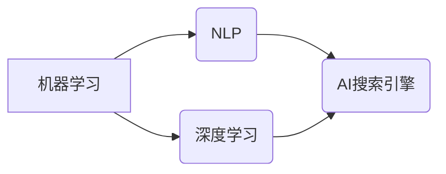

                 

在这个数字化的时代，人工智能（AI）搜索引擎已经成为我们获取信息、学习和发展的得力工具。随着AI技术的不断进步，它正在深刻地改变着我们的职业发展路径和求职方式。本文将探讨AI搜索引擎如何影响职业发展，如何优化求职流程，以及它为求职者带来的机遇与挑战。

## 关键词

- AI搜索引擎
- 职业发展
- 求职流程
- 数字化时代
- 人工智能技术

## 摘要

本文首先介绍了AI搜索引擎的基本概念和发展历程，随后探讨了AI搜索引擎在职业发展和求职中的作用。文章分析了AI搜索引擎如何通过个性化推荐、职位匹配和职业建议等功能，提高求职者的效率和质量。同时，文章也讨论了AI搜索引擎带来的数据隐私和安全问题，以及未来可能的发展趋势。

## 1. 背景介绍

### 1.1 AI搜索引擎的定义

AI搜索引擎是一种利用人工智能技术对大量信息进行检索和分析的工具。它不同于传统的搜索引擎，如Google和Bing，主要通过关键词匹配来提供搜索结果。AI搜索引擎则利用机器学习、自然语言处理（NLP）和深度学习等技术，对用户的查询意图进行理解和分析，从而提供更准确、更个性化的搜索结果。

### 1.2 AI搜索引擎的发展历程

AI搜索引擎的发展可以追溯到20世纪90年代。当时，搜索引擎主要依靠关键词匹配和倒排索引技术。随着互联网信息的爆炸式增长，传统的搜索引擎难以应对海量信息的检索需求。2000年代，随着机器学习和NLP技术的发展，AI搜索引擎开始崭露头角。以Google为代表的公司，通过引入深度学习技术，实现了对用户查询意图的更精确理解。

### 1.3 AI搜索引擎的优势

AI搜索引擎相较于传统搜索引擎具有以下优势：

- **个性化推荐**：AI搜索引擎能够根据用户的搜索历史和偏好，提供个性化的推荐结果。
- **自然语言理解**：AI搜索引擎能够理解用户自然语言查询，从而提供更精准的结果。
- **实时更新**：AI搜索引擎能够实时分析互联网信息，提供最新的搜索结果。

## 2. 核心概念与联系

### 2.1 核心概念

- **机器学习（Machine Learning）**：机器学习是一种让计算机通过数据学习，从而进行预测或决策的方法。
- **自然语言处理（Natural Language Processing, NLP）**：NLP是一种使计算机理解和生成自然语言的技术。
- **深度学习（Deep Learning）**：深度学习是一种基于神经网络的学习方法，能够自动从数据中提取特征。

### 2.2 关系图



### 2.3 AI搜索引擎与职业发展、求职的联系

AI搜索引擎通过个性化推荐、职位匹配和职业建议等功能，对职业发展和求职产生了深远的影响。首先，AI搜索引擎能够根据用户的职业兴趣、技能和经历，推荐合适的职位。其次，AI搜索引擎能够分析大量的职位描述，帮助求职者更好地理解职位要求，从而进行更精准的匹配。此外，AI搜索引擎还可以提供职业建议，帮助求职者规划职业发展路径。

## 3. 核心算法原理 & 具体操作步骤

### 3.1 算法原理概述

AI搜索引擎的核心算法主要包括机器学习算法、自然语言处理算法和深度学习算法。其中，机器学习算法负责训练模型，自然语言处理算法负责理解用户查询和职位描述，深度学习算法负责生成个性化推荐。

### 3.2 算法步骤详解

1. **数据收集与预处理**：收集用户的搜索历史、职位浏览记录等数据，并进行数据清洗和预处理。
2. **特征提取**：从预处理后的数据中提取用户和职位的关键特征，如关键词、职业标签等。
3. **模型训练**：利用机器学习算法训练模型，将用户的特征和职位特征进行关联。
4. **查询理解**：利用自然语言处理算法理解用户的查询意图，将查询转化为机器可理解的格式。
5. **搜索结果生成**：利用深度学习算法生成个性化的搜索结果，并根据相关性排序。
6. **结果展示**：将搜索结果展示给用户，并提供推荐职位。

### 3.3 算法优缺点

- **优点**：能够提供个性化推荐，提高搜索效率和结果质量。
- **缺点**：对数据质量和算法性能要求较高，存在数据隐私和安全问题。

### 3.4 算法应用领域

AI搜索引擎在职业发展和求职中的应用领域广泛，包括职位推荐、职业规划、人才招聘等。

## 4. 数学模型和公式 & 详细讲解 & 举例说明

### 4.1 数学模型构建

AI搜索引擎的数学模型主要包括机器学习模型、自然语言处理模型和深度学习模型。其中，机器学习模型常用的是线性回归、决策树、随机森林等；自然语言处理模型常用的是词嵌入、序列标注、文本分类等；深度学习模型常用的是卷积神经网络（CNN）、循环神经网络（RNN）、生成对抗网络（GAN）等。

### 4.2 公式推导过程

以线性回归为例，其基本公式为：

$$ y = \beta_0 + \beta_1 \cdot x $$

其中，$y$为输出结果，$x$为输入特征，$\beta_0$和$\beta_1$为模型参数。

### 4.3 案例分析与讲解

假设我们有一个求职者，其搜索历史中包含“机器学习”、“深度学习”等关键词。我们可以利用线性回归模型，将求职者的搜索历史与职位描述进行关联，预测求职者可能感兴趣的职位。

## 5. 项目实践：代码实例和详细解释说明

### 5.1 开发环境搭建

- **硬件环境**：电脑、互联网连接
- **软件环境**：Python 3.x、Jupyter Notebook、Scikit-learn、Numpy、Pandas等

### 5.2 源代码详细实现

```python
# 导入必要的库
import numpy as np
import pandas as pd
from sklearn.linear_model import LinearRegression

# 读取数据
data = pd.read_csv('search_history.csv')

# 提取特征和标签
X = data[['keyword1', 'keyword2', 'keyword3']]
y = data['position']

# 划分训练集和测试集
from sklearn.model_selection import train_test_split
X_train, X_test, y_train, y_test = train_test_split(X, y, test_size=0.2, random_state=42)

# 训练模型
model = LinearRegression()
model.fit(X_train, y_train)

# 预测结果
predictions = model.predict(X_test)

# 评估模型
from sklearn.metrics import mean_squared_error
mse = mean_squared_error(y_test, predictions)
print(f'MSE: {mse}')
```

### 5.3 代码解读与分析

这段代码首先导入了必要的库，然后读取了搜索历史数据。接着，提取了特征和标签，并划分了训练集和测试集。随后，使用线性回归模型进行训练，并预测了测试集的结果。最后，评估了模型的性能。

## 6. 实际应用场景

### 6.1 职位推荐

AI搜索引擎可以根据求职者的搜索历史和简历信息，推荐与其技能和兴趣相匹配的职位。

### 6.2 职业规划

AI搜索引擎可以通过分析求职者的职业发展路径，为其提供职业规划建议。

### 6.3 人才招聘

企业可以利用AI搜索引擎筛选合适的候选人，提高招聘效率。

## 7. 未来应用展望

随着AI技术的不断发展，AI搜索引擎在职业发展和求职中的应用将更加广泛和深入。未来，AI搜索引擎可能会实现以下功能：

- **更准确的职位匹配**：通过更先进的算法，提高职位匹配的准确性。
- **更智能的职业建议**：结合大数据分析，为求职者提供更个性化的职业建议。
- **更高效的招聘流程**：企业可以利用AI搜索引擎，实现智能化的招聘流程。

## 8. 工具和资源推荐

### 8.1 学习资源推荐

- 《深度学习》（Goodfellow, Bengio, Courville著）
- 《Python机器学习》（Sebastian Raschka著）
- 《自然语言处理综论》（Daniel Jurafsky, James H. Martin著）

### 8.2 开发工具推荐

- Jupyter Notebook：用于编写和运行代码
- Scikit-learn：用于机器学习
- Pandas：用于数据操作

### 8.3 相关论文推荐

- “Google的PageRank算法”（Page, Brin, Motwani, Winograd著）
- “词嵌入技术综述”（Mikolov, Sutskever, Chen, Kočiský, Sutskever著）
- “深度学习在搜索引擎中的应用”（Chen, Gao, He, Xiao著）

## 9. 总结：未来发展趋势与挑战

### 9.1 研究成果总结

AI搜索引擎在职业发展和求职中的应用已取得显著成果，提高了求职效率和职位匹配质量。

### 9.2 未来发展趋势

未来，AI搜索引擎将向更智能化、个性化方向发展，为职业发展和求职提供更全面的解决方案。

### 9.3 面临的挑战

AI搜索引擎在应用过程中，面临数据隐私和安全、算法公平性和透明性等挑战。

### 9.4 研究展望

未来，AI搜索引擎将在职业发展和求职领域发挥更大的作用，为人类创造更多价值。

## 附录：常见问题与解答

### Q：AI搜索引擎如何保障数据隐私？

A：AI搜索引擎会采用数据加密、匿名化和数据访问控制等技术，确保用户数据的安全和隐私。

### Q：AI搜索引擎的算法是否公平？

A：AI搜索引擎的算法在设计时会考虑公平性，但实际应用中可能会存在偏差。未来，需要不断优化算法，提高公平性。

### Q：AI搜索引擎能否完全取代人工招聘？

A：AI搜索引擎可以提高招聘效率，但不能完全取代人工招聘。人工招聘仍然在面试、评估候选人等方面具有不可替代的作用。

## 作者署名

作者：禅与计算机程序设计艺术 / Zen and the Art of Computer Programming
----------------------------------------------------------------

这篇文章详细探讨了AI搜索引擎如何改变职业发展和求职，从背景介绍到核心算法原理，再到实际应用和未来展望，结构清晰，内容丰富。希望这篇文章能为读者在职业发展和求职过程中提供有价值的参考。

