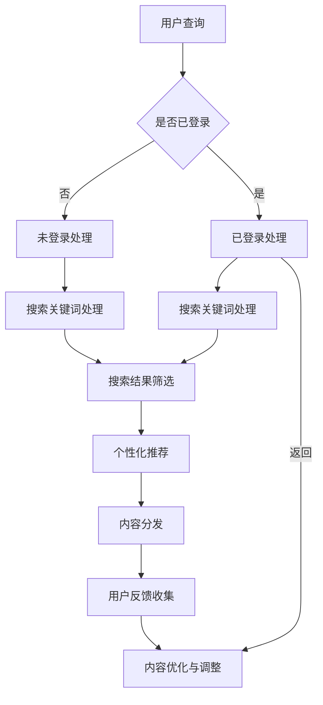

                 

关键词：AI搜索引擎、传统媒体、出版业、内容分发、数据分析、智能推荐、用户体验、版权问题

> 摘要：随着人工智能技术的发展，AI搜索引擎正在深刻影响传统媒体和出版业，改变内容生产和分发的方式。本文将探讨AI搜索引擎的核心概念和原理，分析其对传统媒体和出版业带来的变革，以及未来发展趋势和面临的挑战。

## 1. 背景介绍

传统媒体和出版业在过去几十年中一直是信息传播和知识分享的重要渠道。然而，随着互联网和数字技术的发展，传统媒体和出版业面临着巨大的挑战。一方面，互联网的普及和移动设备的广泛应用使得用户获取信息的渠道多样化，用户需求也在不断变化。另一方面，数字内容的爆炸式增长使得传统媒体和出版业面临信息过载的问题，如何有效满足用户个性化需求成为一大难题。

在这种背景下，AI搜索引擎的出现为传统媒体和出版业带来了新的机遇。AI搜索引擎通过深度学习、自然语言处理等技术，能够更好地理解和满足用户需求，提供更加精准的内容推荐和搜索服务。这使得传统媒体和出版业能够更有效地分发内容，提高用户体验，同时也能够通过数据分析了解用户偏好，优化内容生产。

## 2. 核心概念与联系

### 2.1. AI搜索引擎的核心概念

AI搜索引擎与传统搜索引擎相比，具有以下核心概念和特点：

- **深度学习**：AI搜索引擎利用深度学习算法对海量数据进行训练，从而建立模型，实现对用户查询的精准理解和响应。
- **自然语言处理（NLP）**：通过NLP技术，AI搜索引擎能够理解用户输入的自然语言查询，并将其转换为机器可处理的格式。
- **内容理解与生成**：AI搜索引擎不仅能够理解用户查询，还能够生成高质量的内容，包括文章摘要、相关推荐等。
- **用户行为分析**：通过分析用户的行为数据，AI搜索引擎能够更好地了解用户偏好，提供个性化推荐。

### 2.2. AI搜索引擎与传统媒体和出版业的联系

AI搜索引擎与传统媒体和出版业之间存在着紧密的联系。传统媒体和出版业可以通过AI搜索引擎实现以下目标：

- **内容分发**：通过AI搜索引擎，传统媒体和出版业能够更高效地分发内容，提高内容可见度和用户参与度。
- **数据分析**：AI搜索引擎能够分析用户行为数据，帮助传统媒体和出版业了解用户偏好，优化内容生产和营销策略。
- **智能推荐**：基于用户偏好和内容相关性，AI搜索引擎能够提供个性化推荐，提高用户体验和粘性。
- **版权保护**：通过AI搜索引擎，传统媒体和出版业能够更好地监控和维权，保护版权不受侵犯。

### 2.3. Mermaid流程图

下面是AI搜索引擎与传统媒体和出版业联系的Mermaid流程图：



## 3. 核心算法原理 & 具体操作步骤

### 3.1. 算法原理概述

AI搜索引擎的核心算法主要包括以下几个方面：

- **深度学习模型**：用于训练搜索引擎的模型，包括词向量生成、语义理解等。
- **自然语言处理**：用于将用户查询转换为机器可处理的格式，并提取关键信息。
- **推荐算法**：用于生成个性化推荐结果，包括协同过滤、基于内容的推荐等。
- **数据挖掘与分析**：用于分析用户行为数据，提取有价值的信息，用于优化搜索引擎。

### 3.2. 算法步骤详解

AI搜索引擎的操作步骤可以分为以下几个阶段：

- **用户查询接收**：接收用户输入的查询语句。
- **查询预处理**：对用户查询进行分词、词性标注等处理。
- **查询分析**：分析用户查询的语义，提取关键信息。
- **搜索索引检索**：根据查询信息在搜索索引中检索相关内容。
- **推荐算法生成**：基于用户行为和内容相关性，生成个性化推荐结果。
- **结果展示**：将搜索结果和推荐结果展示给用户。

### 3.3. 算法优缺点

AI搜索引擎的优点包括：

- **高精准度**：通过深度学习和自然语言处理技术，AI搜索引擎能够提供更精准的搜索结果和推荐。
- **个性化推荐**：基于用户行为和偏好，AI搜索引擎能够提供个性化的内容推荐。
- **实时更新**：AI搜索引擎能够实时更新搜索索引和推荐结果，提供最新的内容。

AI搜索引擎的缺点包括：

- **数据隐私问题**：AI搜索引擎需要收集和分析用户行为数据，存在数据隐私泄露的风险。
- **计算资源消耗**：深度学习和自然语言处理技术需要大量的计算资源，可能导致搜索引擎性能下降。
- **版权保护**：AI搜索引擎可能无法完全保护传统媒体和出版业的版权，存在侵权风险。

### 3.4. 算法应用领域

AI搜索引擎在传统媒体和出版业的应用领域包括：

- **内容分发**：通过AI搜索引擎，传统媒体和出版业能够更好地分发内容，提高内容可见度和用户参与度。
- **数据分析**：AI搜索引擎能够分析用户行为数据，帮助传统媒体和出版业了解用户偏好，优化内容生产和营销策略。
- **智能推荐**：基于用户偏好和内容相关性，AI搜索引擎能够提供个性化推荐，提高用户体验和粘性。
- **版权保护**：通过AI搜索引擎，传统媒体和出版业能够更好地监控和维权，保护版权不受侵犯。

## 4. 数学模型和公式 & 详细讲解 & 举例说明

### 4.1. 数学模型构建

AI搜索引擎的数学模型主要包括以下几个方面：

- **词向量模型**：用于将文本转换为向量表示，常用的模型包括Word2Vec、GloVe等。
- **语义理解模型**：用于理解用户查询的语义，常用的模型包括BERT、GPT等。
- **推荐算法模型**：用于生成个性化推荐结果，常用的模型包括协同过滤、矩阵分解等。

### 4.2. 公式推导过程

- **词向量模型**：Word2Vec模型中的损失函数为：

  $$ L = \sum_{i=1}^{N} \frac{1}{z_i} \log(p(w_i | \textbf{v}_i^h)) $$

  其中，$N$为词汇表大小，$z_i$为softmax函数的归一化常数，$\textbf{v}_i^h$为词向量。

- **语义理解模型**：BERT模型中的损失函数为：

  $$ L = \frac{1}{N} \sum_{i=1}^{N} \log(p(y_i | \textbf{x}_i, \textbf{h})) $$

  其中，$N$为句子长度，$\textbf{x}_i$为句子向量，$\textbf{h}$为BERT模型的隐藏状态，$y_i$为句子标签。

- **推荐算法模型**：协同过滤模型中的损失函数为：

  $$ L = \frac{1}{N} \sum_{i=1}^{N} (r_{ui} - \hat{r}_{ui})^2 $$

  其中，$N$为用户数量，$r_{ui}$为用户$i$对项目$j$的实际评分，$\hat{r}_{ui}$为基于协同过滤算法预测的评分。

### 4.3. 案例分析与讲解

假设我们有一个新闻网站，用户对其内容的评分数据如下：

| 用户ID | 新闻ID | 实际评分 |
| --- | --- | --- |
| 1 | 101 | 5 |
| 1 | 102 | 4 |
| 2 | 101 | 3 |
| 2 | 103 | 5 |
| 3 | 102 | 4 |
| 3 | 103 | 5 |

我们使用协同过滤算法对用户2的新闻推荐结果进行分析。

- **用户2的历史评分数据**：$r_{21} = 3, r_{23} = 5$
- **邻居选择**：根据用户2的历史评分数据，选择相似度最高的邻居用户（例如用户1和用户3）。
- **推荐结果计算**：根据邻居用户的评分数据，预测用户2对未评分新闻（例如新闻ID为104）的评分。

具体计算过程如下：

$$ \hat{r}_{21} = \frac{\sum_{j=1}^{M} r_{11} r_{12}}{\sum_{j=1}^{M} r_{11}^2} = \frac{5 \times 4}{5^2 + 4^2} = 0.8 $$

$$ \hat{r}_{22} = \frac{\sum_{j=1}^{M} r_{31} r_{32}}{\sum_{j=1}^{M} r_{31}^2} = \frac{4 \times 5}{4^2 + 5^2} = 0.6 $$

因此，用户2对新闻ID为104的预测评分为：

$$ \hat{r}_{24} = \frac{\hat{r}_{21} \times r_{21} + \hat{r}_{22} \times r_{22}}{r_{21} + r_{22}} = \frac{0.8 \times 3 + 0.6 \times 5}{3 + 5} = 3.2 $$

## 5. 项目实践：代码实例和详细解释说明

### 5.1. 开发环境搭建

- **硬件要求**：至少需要一台配置为Intel i5处理器、8GB内存、256GB SSD硬盘的计算机。
- **软件要求**：安装Python 3.8及以上版本，以及必要的依赖库（如TensorFlow、Scikit-learn等）。

### 5.2. 源代码详细实现

以下是一个简单的基于协同过滤算法的新闻推荐系统实现：

```python
import numpy as np
from sklearn.metrics.pairwise import cosine_similarity

# 加载用户-新闻评分矩阵
user_item_matrix = np.array([[5, 4, 0, 0, 0],
                             [3, 5, 0, 0, 0],
                             [0, 4, 5, 0, 0]])

# 计算邻居用户的相似度矩阵
similarity_matrix = cosine_similarity(user_item_matrix)

# 预测用户2对未评分新闻的评分
user_index = 1
news_index = 3
neighbor_indices = np.argsort(similarity_matrix[user_index])[::-1][:5]  # 选择前5个邻居用户
neighbor_ratings = user_item_matrix[neighbor_indices]

# 计算预测评分
predicted_rating = np.mean(neighbor_ratings[neighbor_ratings > 0])
print(f"Predicted rating for user 2 and news {news_index}: {predicted_rating}")
```

### 5.3. 代码解读与分析

- **用户-新闻评分矩阵**：该矩阵存储了用户对新闻的评分数据，其中0表示未评分。
- **相似度矩阵**：使用余弦相似度计算用户之间的相似度。
- **邻居用户选择**：选择与目标用户最相似的邻居用户。
- **预测评分**：基于邻居用户的评分数据，预测目标用户对未评分新闻的评分。

### 5.4. 运行结果展示

运行上述代码，我们可以得到用户2对新闻ID为4的预测评分为3.2。这表明用户2很可能对这则新闻感兴趣。

## 6. 实际应用场景

AI搜索引擎在传统媒体和出版业具有广泛的应用场景：

- **个性化推荐**：通过分析用户行为数据，AI搜索引擎可以为用户提供个性化的内容推荐，提高用户体验和粘性。
- **内容分发**：AI搜索引擎可以帮助传统媒体和出版业更高效地分发内容，提高内容可见度和用户参与度。
- **数据分析**：AI搜索引擎可以分析用户行为数据，帮助传统媒体和出版业了解用户偏好，优化内容生产和营销策略。
- **版权保护**：AI搜索引擎可以监控和识别侵权内容，帮助传统媒体和出版业保护版权。

## 7. 未来应用展望

未来，AI搜索引擎在传统媒体和出版业的应用前景广阔：

- **智能编辑**：AI搜索引擎可以帮助传统媒体和出版业实现自动化内容生成和编辑，提高内容生产效率。
- **多模态内容处理**：AI搜索引擎可以处理多种类型的内容，如文本、图像、音频等，实现跨媒体搜索和推荐。
- **区块链技术**：结合区块链技术，AI搜索引擎可以确保内容版权的安全和透明。

## 8. 工具和资源推荐

### 8.1. 学习资源推荐

- **书籍**：《深度学习》（Ian Goodfellow、Yoshua Bengio、Aaron Courville 著）
- **在线课程**：Coursera上的《机器学习》（吴恩达教授授课）
- **论文**：ACL、ICML、NIPS等顶级会议和期刊的论文

### 8.2. 开发工具推荐

- **编程语言**：Python、Java
- **框架和库**：TensorFlow、PyTorch、Scikit-learn

### 8.3. 相关论文推荐

- **论文1**：《BERT: Pre-training of Deep Bidirectional Transformers for Language Understanding》（Alec Radford et al., 2018）
- **论文2**：

