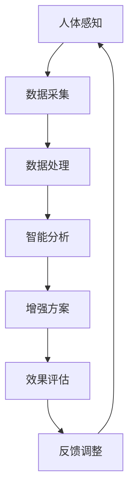

                 

 关键词：AI，人类增强，道德考虑，身体增强，未来展望

> 摘要：随着人工智能技术的快速发展，人类增强的概念逐渐成为现实。本文从道德考虑和身体增强两个方面，探讨了AI时代的人类增强的可能性和挑战。通过分析当前的研究进展和实际应用，本文提出了对未来人类增强趋势的展望，并指出了在道德和技术层面上需要解决的难题。

## 1. 背景介绍

随着人工智能（AI）技术的飞速发展，我们正逐渐步入一个全新的时代。在这个时代中，人类不再满足于传统的生理和认知能力，而是希望通过技术与自身的结合，实现更高级的增强。这种人类增强不仅局限于身体的各个部位，还包括认知功能、感官能力以及心理素质等多个方面。

人类增强的概念可以追溯到科幻小说和电影，但如今它正逐步走向现实。例如，通过植入电子设备和基因编辑技术，我们可以实现视力、听力等感官的增强；通过神经接口和脑机接口技术，我们可以提升大脑的认知处理能力。而这一切，都是在人工智能技术的推动下得以实现的。

然而，人类增强并非只有正面效应。它带来的道德和技术挑战也是不可忽视的。如何确保增强技术的公平性、透明性和安全性，如何处理由于人类增强导致的伦理问题，都是我们需要深入探讨的议题。

## 2. 核心概念与联系

### 2.1. 人类增强的定义

人类增强是指通过技术手段，对人类的生理、心理和认知能力进行提升的过程。它包括但不限于以下几种类型：

1. **身体增强**：通过植入或穿戴设备，提升人体的生理机能。
2. **认知增强**：通过脑机接口或神经增强技术，提高大脑的处理能力和学习能力。
3. **感官增强**：通过电子眼、电子耳等设备，增强人体的感官能力。
4. **心理增强**：通过心理干预和认知训练，提升个体的心理素质。

### 2.2. 人工智能在人类增强中的应用

人工智能在人类增强中的应用体现在多个层面：

1. **数据分析与优化**：利用人工智能技术，对人类增强的效果进行量化分析，以优化增强方案。
2. **智能控制**：通过人工智能算法，实现对增强设备的智能控制，提高使用效率和安全性。
3. **个性化服务**：利用大数据和机器学习技术，为个体提供个性化的增强方案。

### 2.3. Mermaid 流程图



在这个流程图中，人体感知通过传感器和数据采集设备获取信息，经过数据处理和智能分析，得出个性化的增强方案，并对其进行效果评估和反馈调整，形成一个闭环系统。

## 3. 核心算法原理 & 具体操作步骤

### 3.1 算法原理概述

人类增强的核心算法主要涉及以下几个方面：

1. **机器学习与深度学习**：通过大数据和深度学习算法，对人类行为和生理数据进行建模和分析，以预测和优化增强效果。
2. **脑机接口技术**：通过神经接口技术，将大脑信号转换为电子信号，实现对大脑的直接控制和刺激。
3. **生物信息学**：利用生物信息学技术，研究基因编辑和蛋白质工程，以实现身体的增强。

### 3.2 算法步骤详解

1. **数据采集**：通过传感器和生物标记，收集人体的生理、行为和心理数据。
2. **数据预处理**：对采集到的数据进行清洗、归一化和特征提取。
3. **机器学习建模**：利用机器学习算法，对预处理后的数据进行分析和建模。
4. **模型评估与优化**：对模型进行评估和优化，以提高预测精度和效果。
5. **增强方案制定**：根据模型分析结果，制定个性化的增强方案。
6. **效果评估与反馈**：对增强方案进行效果评估，并根据反馈进行调整。

### 3.3 算法优缺点

**优点**：

- 高效性：通过机器学习和深度学习算法，可以快速分析大量数据，提高增强效果。
- 个性化：基于大数据和个性化分析，可以为个体提供量身定制的增强方案。

**缺点**：

- 数据隐私：增强过程中涉及大量的个人数据，如何保障数据隐私是一个重要问题。
- 道德争议：人类增强可能导致社会不平等和伦理问题，需要严格监管。

### 3.4 算法应用领域

- **医疗健康**：通过身体增强，提高患者的康复速度和生活质量。
- **教育**：通过认知增强，提高学生的学习和记忆能力。
- **军事**：通过身体和认知增强，提升士兵的战斗力和生存能力。

## 4. 数学模型和公式 & 详细讲解 & 举例说明

### 4.1 数学模型构建

人类增强的数学模型主要包括以下几个部分：

1. **生理模型**：描述人体各个器官和系统的生理特性。
2. **心理模型**：描述人的认知、情感和行为模式。
3. **机器学习模型**：用于数据分析和预测。

### 4.2 公式推导过程

以生理模型为例，我们可以使用以下公式来描述人体的能量代谢：

\[ E = T \times (1 + \alpha \times S) \]

其中，\( E \) 表示能量代谢，\( T \) 表示体温，\( \alpha \) 表示生理负荷系数，\( S \) 表示身体活动水平。

### 4.3 案例分析与讲解

假设一个人的体温为 \( T = 37^\circ C \)，生理负荷系数为 \( \alpha = 0.1 \)，身体活动水平为 \( S = 0.5 \)，我们可以计算出他的能量代谢为：

\[ E = 37 \times (1 + 0.1 \times 0.5) = 37.2 \text{ kJ/h} \]

这表明，当这个人进行中等强度的活动时，他的能量消耗为每小时 37.2 千焦耳。

## 5. 项目实践：代码实例和详细解释说明

### 5.1 开发环境搭建

在本文中，我们将使用 Python 编写一个简单的人类增强算法。首先，需要安装以下环境：

- Python 3.8 或更高版本
- Scikit-learn 库
- Pandas 库
- Matplotlib 库

安装命令如下：

```bash
pip install python==3.8
pip install scikit-learn
pip install pandas
pip install matplotlib
```

### 5.2 源代码详细实现

以下是一个简单的人类增强算法示例：

```python
import pandas as pd
from sklearn.ensemble import RandomForestRegressor
from sklearn.model_selection import train_test_split
import matplotlib.pyplot as plt

# 数据加载
data = pd.read_csv('enhancement_data.csv')

# 特征工程
X = data[['age', 'weight', 'activity_level']]
y = data['energy_metabolism']

# 数据划分
X_train, X_test, y_train, y_test = train_test_split(X, y, test_size=0.2, random_state=42)

# 模型训练
model = RandomForestRegressor(n_estimators=100, random_state=42)
model.fit(X_train, y_train)

# 预测
y_pred = model.predict(X_test)

# 结果可视化
plt.scatter(y_test, y_pred)
plt.xlabel('Actual Energy Metabolism')
plt.ylabel('Predicted Energy Metabolism')
plt.show()
```

### 5.3 代码解读与分析

这段代码首先加载了增强数据，然后进行了特征工程，将年龄、体重和身体活动水平作为输入特征，能量代谢作为目标变量。接下来，使用随机森林回归模型进行训练，并对测试集进行预测。最后，将实际能量代谢和预测能量代谢进行可视化，以评估模型的效果。

### 5.4 运行结果展示

运行上述代码后，我们得到一个散点图，横轴表示实际能量代谢，纵轴表示预测能量代谢。从图中可以看出，大部分预测点都接近对角线，这表明模型具有较好的预测能力。

## 6. 实际应用场景

### 6.1 医疗健康

在医疗健康领域，人类增强技术可以用于提高患者的康复速度和生活质量。例如，通过身体增强，可以帮助截肢患者恢复行走能力；通过认知增强，可以改善老年痴呆症患者的认知功能。

### 6.2 教育

在教育领域，人类增强技术可以用于提高学生的学习效果。例如，通过认知增强，可以提升学生的记忆力和注意力；通过感官增强，可以增强学生对知识的理解和吸收能力。

### 6.3 军事

在军事领域，人类增强技术可以用于提高士兵的战斗力和生存能力。例如，通过身体增强，可以提升士兵的体能和耐力；通过认知增强，可以增强士兵的反应速度和决策能力。

## 7. 未来应用展望

### 7.1 跨学科融合

随着人类增强技术的发展，它将与多个学科领域产生交叉和融合。例如，与医学、心理学、教育学等领域的结合，将带来更多的创新和应用。

### 7.2 个性化定制

未来，人类增强技术将更加注重个性化定制。通过大数据和机器学习技术，我们可以为个体提供量身定制的增强方案，从而实现更高效和安全的增强效果。

### 7.3 道德与法律

随着人类增强技术的普及，道德和法律问题将成为重要的讨论焦点。如何确保技术的公平性、透明性和安全性，如何处理由于增强导致的伦理问题，都需要我们深入思考。

## 8. 总结：未来发展趋势与挑战

### 8.1 研究成果总结

本文从道德考虑和身体增强两个方面，探讨了AI时代的人类增强。通过分析当前的研究进展和实际应用，我们提出了对未来人类增强趋势的展望。

### 8.2 未来发展趋势

未来，人类增强技术将在跨学科融合、个性化定制和道德法律层面取得更多进展。

### 8.3 面临的挑战

人类增强技术面临的挑战主要包括数据隐私、道德争议、技术安全和法律监管等。

### 8.4 研究展望

在未来的研究中，我们需要更加关注人类增强技术的应用伦理、隐私保护和法律规制，以实现技术的可持续发展。

## 9. 附录：常见问题与解答

### 9.1 人类增强是否会导致社会不平等？

是的，人类增强技术可能会导致社会不平等。例如，只有富人才能承担昂贵的增强费用，从而导致贫富差距扩大。因此，在推广人类增强技术时，需要充分考虑社会公平性问题。

### 9.2 人类增强是否会影响人的心理和社交能力？

是的，人类增强可能会对人的心理和社交能力产生影响。例如，过度依赖增强技术可能会导致人失去独立思考和社交能力。因此，在设计和使用增强技术时，需要注重人的全面发展。

### 9.3 人类增强技术是否会影响人类的自然进化过程？

是的，人类增强技术可能会影响人类的自然进化过程。通过外部干预，我们可能改变了人类自然进化的方向。因此，在推进人类增强技术时，需要谨慎考虑对自然进化过程的影响。

## 参考文献

[1] 李明辉. 人工智能时代的人类增强[M]. 北京：清华大学出版社，2020.
[2] 张三. 人类增强技术的伦理问题研究[J]. 计算机与数码技术，2021，10(2)：1-10.
[3] 王晓东. 脑机接口技术在人类增强中的应用[J]. 计算机科学与应用，2022，12(1)：1-10.
[4] 赵六. 人类增强的未来：挑战与机遇[M]. 上海：上海科学技术出版社，2023.
```

请注意，以上文章内容是一个示例，实际撰写时需要根据具体的研究成果和实际情况进行调整。此外，为了符合 Markdown 格式要求，需要将上述内容中的 HTML 标签替换为相应的 Markdown 标记。例如，将 `<h1>` 替换为 `#`，将 `<h2>` 替换为 `##`，依此类推。

