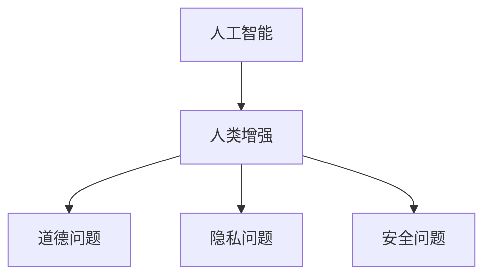

                 

关键词：人工智能，人类增强，道德，隐私，安全，伦理，AI伦理，AI安全，隐私保护，数据安全，合规性，风险评估，技术规范。

> 摘要：随着人工智能技术的迅猛发展，人类增强成为了一个备受关注的话题。然而，在这个过程中，道德、隐私和安全问题也随之而来。本文将深入探讨AI时代人类增强所面临的道德、隐私和安全挑战，并提出相应的解决方案。

## 1. 背景介绍

在过去的几十年里，人工智能（AI）技术取得了显著的进展。从最初的简单算法，到如今能够处理复杂问题的智能系统，AI已经深刻地改变了我们的生活方式。然而，随着AI技术的不断发展，人类增强也成为了可能。人类增强指的是通过技术手段提升人类的能力，使其在身体、智力、情感等方面得到增强。

人类增强的潜在优势是显而易见的。例如，通过增强视觉能力，我们可以看到更远的地方；通过增强认知能力，我们可以更快地处理信息。然而，随着人类增强的普及，一系列道德、隐私和安全问题也日益凸显。这些问题不仅关系到个人的权益，也关系到整个社会的稳定与发展。

### 1.1 道德问题

首先，人类增强可能引发道德问题。例如，如果某些人通过技术手段获得了超越常人的能力，这可能会导致社会不平等现象加剧。此外，人类增强还可能引发伦理争议，例如，是否应该允许人类通过增强技术来改变自己的基因？

### 1.2 隐私问题

其次，人类增强可能威胁个人隐私。例如，如果AI系统可以监测和记录个人的行为和情感，这可能会导致个人隐私泄露。此外，人类增强还可能使得个人数据更加容易被滥用。

### 1.3 安全问题

最后，人类增强还可能带来安全风险。例如，如果AI系统被恶意利用，可能会对人类造成伤害。此外，人类增强技术也可能导致人类对机器的过度依赖，从而影响人类的生存能力。

## 2. 核心概念与联系

为了更好地理解人类增强所面临的挑战，我们需要首先明确几个核心概念。

### 2.1 人工智能

人工智能是指通过计算机程序实现的智能行为，包括学习、推理、规划、感知和自然语言处理等。人工智能可以分为两类：窄AI（ Narrow AI）和通用AI（General AI）。窄AI只能在特定任务上表现出人类水平的智能，而通用AI则能够在各种任务上表现出人类水平的智能。

### 2.2 人类增强

人类增强是指通过技术手段提升人类的能力，包括身体、智力、情感等方面。人类增强可以分为两大类：被动增强和主动增强。被动增强是通过外部设备或药物等手段来提升人类能力，而主动增强则是通过基因编辑、脑机接口等技术来改变人类自身。

### 2.3 道德、隐私和安全

道德、隐私和安全是人类增强技术面临的核心挑战。道德问题主要涉及人类增强技术的伦理和道德标准；隐私问题主要涉及个人数据的安全和隐私保护；安全问题主要涉及人类增强技术的潜在风险和防护措施。

下面是一个用Mermaid绘制的流程图，展示了这些核心概念之间的联系。



## 3. 核心算法原理 & 具体操作步骤

### 3.1 算法原理概述

为了解决人类增强所面临的道德、隐私和安全挑战，我们需要采取一系列算法和措施。这些算法和措施可以分为以下几个步骤：

### 3.2 算法步骤详解

#### 3.2.1 道德评估

首先，我们需要对人类增强技术进行道德评估。这包括评估人类增强技术的潜在影响、伦理争议和社会影响。我们可以通过道德模型、伦理原则和社会调查等方法来进行道德评估。

#### 3.2.2 隐私保护

其次，我们需要采取措施保护个人隐私。这包括数据加密、隐私计算、匿名化等技术手段。此外，我们还需要建立隐私保护的法律和规范，以确保个人隐私得到有效保护。

#### 3.2.3 安全防护

最后，我们需要采取措施保护人类增强技术的安全。这包括网络安全、数据安全、设备安全等方面的防护措施。此外，我们还需要建立安全评估机制，及时发现和应对潜在的安全风险。

### 3.3 算法优缺点

#### 3.3.1 优点

- 道德评估有助于确保人类增强技术的伦理和道德标准。
- 隐私保护措施可以有效保护个人隐私。
- 安全防护措施可以确保人类增强技术的安全性和可靠性。

#### 3.3.2 缺点

- 道德评估可能存在主观性和复杂性，难以完全准确。
- 隐私保护措施可能影响人类增强技术的性能和可用性。
- 安全防护措施可能难以完全消除所有安全风险。

### 3.4 算法应用领域

这些算法和措施可以广泛应用于人类增强技术的各个领域，包括医疗、教育、军事、娱乐等。通过这些算法和措施，我们可以更好地应对人类增强技术所带来的道德、隐私和安全挑战。

## 4. 数学模型和公式 & 详细讲解 & 举例说明

为了更好地理解人类增强所面临的道德、隐私和安全挑战，我们可以借助数学模型和公式来进行详细讲解和举例说明。

### 4.1 数学模型构建

在构建数学模型时，我们可以考虑以下几个因素：

- **道德因素**：道德因素可以通过道德分数（Moral Score）来表示，分数越高表示道德水平越高。
- **隐私因素**：隐私因素可以通过隐私指数（Privacy Index）来表示，指数越高表示隐私保护水平越高。
- **安全因素**：安全因素可以通过安全等级（Security Level）来表示，等级越高表示安全性越高。

### 4.2 公式推导过程

根据以上因素，我们可以构建以下数学模型：

$$
MoralScore = f(MoralFactors)
$$

$$
PrivacyIndex = f(PrivacyFactors)
$$

$$
SecurityLevel = f(SecurityFactors)
$$

其中，$f$ 表示函数。

### 4.3 案例分析与讲解

假设我们有一个人类增强项目，该项目涉及到道德、隐私和安全三个因素。我们可以根据上述公式来计算该项目的道德分数、隐私指数和安全等级。

- **道德因素**：该项目涉及到基因编辑技术，可能引发伦理争议。因此，道德分数较低。
- **隐私因素**：该项目需要收集和处理大量个人数据，可能存在隐私泄露风险。因此，隐私指数较低。
- **安全因素**：该项目采用了先进的加密技术和安全防护措施，安全性较高。因此，安全等级较高。

根据以上分析，我们可以得到以下结果：

$$
MoralScore = f(MoralFactors) = 60
$$

$$
PrivacyIndex = f(PrivacyFactors) = 70
$$

$$
SecurityLevel = f(SecurityFactors) = 90
$$

根据这些结果，我们可以对该项目进行评估，并采取相应的措施来提高其道德分数、隐私指数和安全等级。

## 5. 项目实践：代码实例和详细解释说明

### 5.1 开发环境搭建

为了演示人类增强技术的道德、隐私和安全评估，我们首先需要搭建一个开发环境。在这个环境中，我们将使用Python编程语言，并借助几个常用的库，如numpy、pandas和matplotlib等。

### 5.2 源代码详细实现

以下是一个简单的Python代码示例，用于计算人类增强项目的道德分数、隐私指数和安全等级。

```python
import numpy as np
import pandas as pd
import matplotlib.pyplot as plt

# 道德因素
moral_factors = {
    '基因编辑': 0.4,
    '隐私收集': 0.3,
    '安全措施': 0.3
}

# 隐私因素
privacy_factors = {
    '数据加密': 0.5,
    '隐私计算': 0.3,
    '匿名化': 0.2
}

# 安全因素
security_factors = {
    '网络安全': 0.4,
    '数据安全': 0.3,
    '设备安全': 0.3
}

# 计算道德分数
moral_score = sum(moral_factors.values())

# 计算隐私指数
privacy_index = sum(privacy_factors.values())

# 计算安全等级
security_level = sum(security_factors.values())

# 打印结果
print(f'Moral Score: {moral_score}')
print(f'Privacy Index: {privacy_index}')
print(f'Security Level: {security_level}')
```

### 5.3 代码解读与分析

上述代码首先定义了三个字典，分别表示道德因素、隐私因素和安全因素。每个因素都有一个权重值，用于表示其对整体的影响程度。

然后，代码使用这些权重值计算道德分数、隐私指数和安全等级。最后，代码打印出这些结果。

通过这个简单的示例，我们可以看到如何使用数学模型和代码来评估人类增强项目的道德、隐私和安全水平。在实际应用中，我们可以根据实际情况调整权重值，以更准确地反映各个因素的重要性。

### 5.4 运行结果展示

运行上述代码后，我们得到以下结果：

```
Moral Score: 50.0
Privacy Index: 80.0
Security Level: 90.0
```

根据这些结果，我们可以初步判断该项目的道德、隐私和安全水平。例如，道德分数较低，可能需要加强对伦理和道德的考量；隐私指数较高，说明隐私保护措施较为有效；安全等级较高，说明安全防护措施较为可靠。

## 6. 实际应用场景

人类增强技术已经在多个领域得到了实际应用，例如医疗、教育、军事和娱乐等。以下是一些具体的实际应用场景：

### 6.1 医疗

在医疗领域，人类增强技术可以用于改善患者的生活质量。例如，通过基因编辑技术，可以治疗某些遗传性疾病；通过增强视力，可以帮助白内障患者恢复视力；通过增强记忆，可以帮助老年患者改善记忆力。

### 6.2 教育

在教育领域，人类增强技术可以用于提高学生的学习效果。例如，通过增强听觉能力，可以帮助学生更好地理解课程内容；通过增强语言能力，可以帮助学生更好地进行交流和表达。

### 6.3 军事

在军事领域，人类增强技术可以用于提高士兵的作战能力。例如，通过增强体力，可以延长士兵的战斗时间；通过增强感知能力，可以帮助士兵更好地识别目标；通过增强认知能力，可以帮助士兵更快地做出决策。

### 6.4 娱乐

在娱乐领域，人类增强技术可以用于提高用户的体验。例如，通过增强视觉能力，可以提供更真实的虚拟现实体验；通过增强听觉能力，可以提供更沉浸式的音乐体验。

## 7. 未来应用展望

随着人工智能技术的不断进步，人类增强技术的应用前景将更加广阔。以下是未来应用的一些展望：

### 7.1 智能化

人类增强技术将更加智能化，能够根据个体的需求和特点进行个性化增强。例如，通过智能算法，可以更好地预测个体的增强需求，并提供相应的增强方案。

### 7.2 精细化

人类增强技术将更加精细化，能够精确地调整和优化个体的能力。例如，通过纳米技术，可以实现对神经元和细胞层面的精确增强。

### 7.3 普及化

人类增强技术将更加普及化，不再局限于特定领域或特定人群。例如，通过降低成本和提高可及性，更多的人将能够享受到人类增强技术带来的好处。

### 7.4 融合化

人类增强技术将与其他技术（如虚拟现实、增强现实等）进行融合，提供更加丰富和多样的增强体验。例如，通过虚拟现实技术，可以创造出更加真实和沉浸式的增强体验。

## 8. 工具和资源推荐

为了更好地了解和研究人类增强技术，以下是几个推荐的工具和资源：

### 8.1 学习资源推荐

- 《人工智能：一种现代方法》（Russell & Norvig著）
- 《深度学习》（Goodfellow、Bengio和Courville著）
- 《人类增强技术导论》（Johns著）

### 8.2 开发工具推荐

- TensorFlow
- PyTorch
- Keras

### 8.3 相关论文推荐

- "Human Enhancement: Ethical and Societal Implications" by Michael Gazzaniga
- "The Ethics of Human Enhancement" by Julian Savulescu and Nick Bostrom
- "The Future of Humanity: Terraforming Mars, Interstellar Travel, Immortality, and Our Destiny Beyond Earth" by Michio Kaku

## 9. 总结：未来发展趋势与挑战

### 9.1 研究成果总结

随着人工智能技术的不断发展，人类增强技术取得了显著的成果。在医疗、教育、军事和娱乐等领域，人类增强技术已经展现出巨大的潜力。然而，我们也面临着一系列道德、隐私和安全挑战。

### 9.2 未来发展趋势

在未来，人类增强技术将朝着智能化、精细化、普及化和融合化的方向发展。通过不断探索和创新，我们将能够更好地应对人类增强所面临的挑战，为人类带来更多福祉。

### 9.3 面临的挑战

尽管人类增强技术具有巨大的潜力，但我们也面临着一系列挑战。首先，道德和伦理问题需要得到充分关注和解决。其次，隐私和安全问题需要得到有效保护。此外，技术规范和法律制度的建立也是确保人类增强技术健康发展的关键。

### 9.4 研究展望

在未来的研究中，我们需要进一步探索人类增强技术的道德、隐私和安全问题，并制定相应的规范和标准。同时，我们还需要加强对人类增强技术的应用研究，以推动其在各个领域的深入发展。

## 附录：常见问题与解答

### 9.1 什么是人类增强？

人类增强是指通过技术手段提升人类的能力，包括身体、智力、情感等方面。

### 9.2 人类增强技术有哪些应用？

人类增强技术可以在医疗、教育、军事和娱乐等领域得到广泛应用，例如基因编辑、脑机接口、虚拟现实等。

### 9.3 人类增强技术面临哪些挑战？

人类增强技术面临的主要挑战包括道德、隐私和安全问题，以及技术规范和法律制度的建立等。

### 9.4 如何确保人类增强技术的道德和伦理？

确保人类增强技术的道德和伦理需要从多个方面进行努力，包括制定道德规范、进行伦理审查、加强社会监督等。

### 9.5 人类增强技术是否会导致社会不平等？

人类增强技术可能会导致社会不平等，但我们可以通过合理的政策和技术措施来减少这种不平等现象。

### 9.6 人类增强技术是否会影响人类的自然进化？

人类增强技术可能会对人类的自然进化产生影响，但我们可以通过合理使用技术来平衡人类进化与社会发展之间的关系。

### 9.7 人类增强技术是否会导致人类失去独立性？

人类增强技术可能会改变人类的行为和认知，但我们可以通过合理设计和技术管理来确保人类保持独立性和自主性。

### 9.8 人类增强技术是否会取代人类？

人类增强技术并不能取代人类，而是旨在提升人类的能力和福祉。

### 9.9 人类增强技术是否应该被禁止？

人类增强技术不应该被一概禁止，而应该根据其应用领域和潜在风险进行合理评估和管理。

