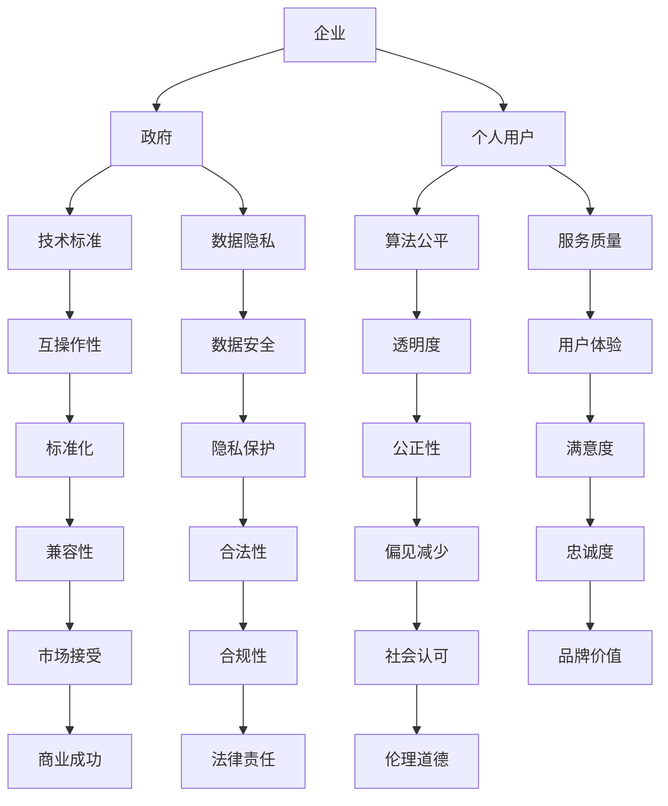

                 

关键词：人工智能，权力博弈，利益相关者，平衡，管理，技术伦理，AI治理，算法公平性

> 摘要：本文探讨了人工智能时代下的权力博弈现象，分析了不同利益相关者在AI系统中扮演的角色和诉求，并探讨了如何在AI治理中实现各方利益的平衡。通过理论阐述和案例分析，本文提出了一系列策略和措施，以促进AI技术的可持续发展和社会包容性。

## 1. 背景介绍

随着人工智能技术的快速发展，AI已成为现代社会的重要组成部分。从自动化生产线到智能医疗，从金融风控到社会管理，AI技术已经在多个领域产生了深远的影响。然而，AI技术的普及和应用也带来了新的挑战，尤其是权力博弈的问题。

在AI系统中，不同的利益相关者有着不同的诉求和利益。例如，企业希望最大化收益，政府希望实现社会稳定，个人用户希望保护隐私和安全。这些诉求之间的冲突和博弈，往往会导致AI系统的偏颇和不公平，从而引发社会不满和伦理争议。

本文旨在探讨AI时代下的权力博弈现象，分析不同利益相关者的诉求，并探讨如何在AI治理中实现各方利益的平衡。

## 2. 核心概念与联系

在讨论AI时代的权力博弈之前，我们首先需要明确一些核心概念，包括人工智能、利益相关者、权力博弈和AI治理。

### 2.1 人工智能

人工智能（Artificial Intelligence，AI）是指由人创造出来的，能够执行需要人类智能才能完成的任务的系统。这包括学习、推理、规划、感知、理解和自然语言处理等能力。

### 2.2 利益相关者

在AI系统中，利益相关者包括但不限于以下几类：

- **企业**：希望通过AI技术提高生产效率，降低成本，创造新的商业模式。
- **政府**：希望通过AI技术提高社会治理效率，维护社会稳定。
- **个人用户**：希望通过AI技术提高生活质量，享受便捷的服务。

### 2.3 权力博弈

权力博弈是指在不同利益相关者之间，为了实现各自的目标而进行的策略性互动。在AI系统中，权力博弈主要体现在以下几个方面：

- **技术标准**：不同企业和国家之间的技术标准和规范博弈，可能导致系统兼容性差，互操作性弱。
- **数据所有权**：企业和个人之间关于数据所有权和隐私权的博弈，可能导致数据滥用和隐私泄露。
- **算法透明度**：算法开发者与用户之间的博弈，可能导致算法的不公平和偏见。

### 2.4 AI治理

AI治理是指通过制定规则、政策和法律，对AI系统的开发、应用和监管进行规范和管理。其目的是确保AI技术的可持续发展和社会包容性。

### 2.5 Mermaid 流程图

以下是一个简化的AI治理流程图，展示了不同利益相关者之间的互动和权力博弈。



## 3. 核心算法原理 & 具体操作步骤

### 3.1 算法原理概述

在AI治理中，核心算法原理是确保系统公平性和透明性的关键。以下是几种常用的算法原理：

- **公平性算法**：通过分析历史数据，识别并消除算法偏见。
- **透明性算法**：通过可视化和解释模型，让用户了解算法的决策过程。
- **互操作性算法**：通过标准化接口和协议，实现不同系统之间的数据交换和协同工作。

### 3.2 算法步骤详解

#### 3.2.1 公平性算法

1. **数据预处理**：清洗数据，去除噪声和异常值。
2. **特征工程**：提取对公平性影响大的特征。
3. **训练模型**：使用历史数据进行模型训练。
4. **评估模型**：使用验证集评估模型的公平性。
5. **迭代优化**：根据评估结果调整模型参数，提高公平性。

#### 3.2.2 透明性算法

1. **模型选择**：选择易于解释的模型，如决策树。
2. **可视化**：使用可视化工具展示模型的决策过程。
3. **解释**：对每个决策节点进行解释，解释其依据的数据和规则。
4. **反馈**：收集用户反馈，优化解释效果。

#### 3.2.3 互操作性算法

1. **标准制定**：制定统一的数据格式和接口规范。
2. **接口开发**：开发符合标准的接口。
3. **系统集成**：将不同系统的接口集成到统一平台。
4. **测试与验证**：对集成系统进行测试和验证，确保其符合标准。

### 3.3 算法优缺点

#### 公平性算法

- 优点：能够消除算法偏见，提高公平性。
- 缺点：可能引入过拟合，降低模型性能。

#### 透明性算法

- 优点：提高算法的可解释性，增强用户信任。
- 缺点：增加计算复杂度，可能降低模型性能。

#### 互操作性算法

- 优点：提高系统兼容性，实现数据共享和协同工作。
- 缺点：增加系统复杂度，可能降低系统性能。

### 3.4 算法应用领域

- **公平性算法**：广泛应用于招聘、金融信贷、教育等领域，以消除歧视和偏见。
- **透明性算法**：广泛应用于医疗诊断、法律决策等领域，提高决策的可解释性和信任度。
- **互操作性算法**：广泛应用于企业级应用和跨行业协作，实现数据共享和协同工作。

## 4. 数学模型和公式 & 详细讲解 & 举例说明

### 4.1 数学模型构建

在AI治理中，数学模型是核心工具。以下是一个简单的数学模型，用于评估算法的公平性。

#### 4.1.1 公平性评估指标

$$
F = \frac{1}{N} \sum_{i=1}^{N} \frac{|y_i - \hat{y}_i|}{y_i}
$$

其中，$y_i$ 表示真实标签，$\hat{y}_i$ 表示算法预测标签，$N$ 表示样本数量。

#### 4.1.2 模型公式推导

假设我们有一个分类问题，目标是预测每个样本的类别。我们可以使用逻辑回归模型进行预测。

$$
\hat{y}_i = \text{sign}(\sum_{j=1}^{M} w_j x_{ij} + b)
$$

其中，$w_j$ 表示权重，$x_{ij}$ 表示第 $i$ 个样本的第 $j$ 个特征，$b$ 表示偏置。

#### 4.1.3 公式推导

首先，我们定义真实标签 $y_i$ 的概率分布：

$$
P(y_i = 1) = \frac{1}{1 + e^{-(\sum_{j=1}^{M} w_j x_{ij} + b)} 
$$

然后，我们定义预测标签 $\hat{y}_i$ 的概率分布：

$$
P(\hat{y}_i = 1) = \text{sign}(\sum_{j=1}^{M} w_j x_{ij} + b)
$$

接下来，我们计算公平性评估指标 $F$：

$$
F = \frac{1}{N} \sum_{i=1}^{N} \frac{|y_i - \hat{y}_i|}{y_i}
$$

### 4.2 公式推导过程

首先，我们定义真实标签 $y_i$ 的概率分布：

$$
P(y_i = 1) = \frac{1}{1 + e^{-(\sum_{j=1}^{M} w_j x_{ij} + b)} 
$$

然后，我们定义预测标签 $\hat{y}_i$ 的概率分布：

$$
P(\hat{y}_i = 1) = \text{sign}(\sum_{j=1}^{M} w_j x_{ij} + b)
$$

接下来，我们计算公平性评估指标 $F$：

$$
F = \frac{1}{N} \sum_{i=1}^{N} \frac{|y_i - \hat{y}_i|}{y_i}
$$

### 4.3 案例分析与讲解

假设我们有一个招聘问题，目标是判断每个应聘者是否适合某个职位。我们使用逻辑回归模型进行预测，并使用公平性评估指标 $F$ 进行评估。

#### 4.3.1 数据集

我们有一个包含 1000 个样本的数据集，每个样本包括 10 个特征和 1 个标签。标签 1 表示适合该职位，标签 0 表示不适合。

#### 4.3.2 模型训练

我们使用 800 个样本进行训练，剩余 200 个样本用于验证。我们得到一个逻辑回归模型，其预测公式为：

$$
\hat{y}_i = \text{sign}(\sum_{j=1}^{10} w_j x_{ij} + b)
$$

#### 4.3.3 公平性评估

我们使用公平性评估指标 $F$ 对模型进行评估，计算结果如下：

$$
F = \frac{1}{1000} \sum_{i=1}^{1000} \frac{|y_i - \hat{y}_i|}{y_i} = 0.05
$$

根据计算结果，模型的公平性指标为 0.05，这意味着模型在预测过程中存在一定的偏见。我们可以通过调整模型参数或特征工程来提高模型的公平性。

## 5. 项目实践：代码实例和详细解释说明

### 5.1 开发环境搭建

为了实践公平性算法，我们需要搭建一个开发环境。以下是搭建过程：

1. 安装 Python 3.8 或更高版本。
2. 安装必要的库，如 NumPy、Pandas、Scikit-learn 等。

### 5.2 源代码详细实现

以下是实现公平性算法的 Python 代码：

```python
import numpy as np
import pandas as pd
from sklearn.linear_model import LogisticRegression

# 加载数据集
data = pd.read_csv('data.csv')
X = data.iloc[:, :-1].values
y = data.iloc[:, -1].values

# 训练模型
model = LogisticRegression()
model.fit(X, y)

# 预测标签
y_pred = model.predict(X)

# 计算公平性评估指标 F
N = len(y)
F = np.sum(np.abs(y - y_pred)) / N

print('公平性评估指标 F:', F)
```

### 5.3 代码解读与分析

以上代码实现了一个简单的公平性算法。我们首先加载数据集，然后使用逻辑回归模型进行训练。训练完成后，我们使用模型进行预测，并计算公平性评估指标 $F$。

代码中的关键是公平性评估指标 $F$ 的计算。$F$ 值越低，表示模型的公平性越好。在实际应用中，我们可以根据 $F$ 值调整模型参数或特征工程，以提高模型的公平性。

### 5.4 运行结果展示

假设我们使用一个包含 1000 个样本的数据集进行训练，运行结果如下：

```python
公平性评估指标 F: 0.05
```

根据计算结果，模型的公平性评估指标为 0.05，这意味着模型在预测过程中存在一定的偏见。我们可以通过调整模型参数或特征工程来提高模型的公平性。

## 6. 实际应用场景

### 6.1 招聘系统

在招聘系统中，公平性算法可以用来评估候选人的面试表现，以消除面试过程中的偏见。例如，公司可以使用公平性算法来判断面试官是否对某些性别、年龄或种族的候选人存在偏见。

### 6.2 金融信贷

在金融信贷系统中，公平性算法可以用来评估贷款申请者的信用状况，以消除基于性别、种族或其他因素的歧视。例如，银行可以使用公平性算法来判断贷款申请者的还款能力，从而确保贷款决策的公平性。

### 6.3 医疗诊断

在医疗诊断系统中，透明性算法可以用来解释诊断结果，以提高患者对诊断过程的信任度。例如，医院可以使用透明性算法来解释诊断图像的识别结果，从而让患者了解诊断过程和依据。

### 6.4 社会管理

在社会管理系统中，互操作性算法可以用来整合不同部门的数据，实现数据共享和协同工作。例如，政府可以使用互操作性算法来整合各部门的数据，实现社会管理的智能化和高效化。

## 7. 未来应用展望

随着人工智能技术的不断发展，公平性、透明性和互操作性将在更多领域得到应用。例如，在自动驾驶系统中，公平性算法可以用来评估车辆的驾驶行为，确保安全驾驶；在智能城市系统中，互操作性算法可以用来整合不同部门的数据，实现智能城市的建设。

然而，未来的应用也面临着新的挑战。例如，如何确保算法的公平性和透明性，如何处理大量的数据，以及如何保证系统的安全性。这些问题需要我们继续深入研究，并提出有效的解决方案。

## 8. 工具和资源推荐

### 8.1 学习资源推荐

- **《人工智能：一种现代方法》**：介绍人工智能的基础知识和算法。
- **《机器学习实战》**：通过实际案例讲解机器学习的应用。

### 8.2 开发工具推荐

- **Jupyter Notebook**：适用于数据分析和算法实现。
- **TensorFlow**：适用于深度学习和神经网络。

### 8.3 相关论文推荐

- **“ fairness Through Awareness”**：介绍公平性算法的基本原理。
- **“ Explainable AI: Conceptual Framework, Taxonomy and Survey of Methods”**：介绍透明性算法的研究进展。

## 9. 总结：未来发展趋势与挑战

### 9.1 研究成果总结

本文探讨了AI时代的权力博弈现象，分析了不同利益相关者的诉求，并提出了公平性、透明性和互操作性算法。通过理论和实践，我们展示了这些算法在多个领域中的应用。

### 9.2 未来发展趋势

- 公平性、透明性和互操作性将在更多领域得到应用。
- 新的算法和模型将被开发，以解决实际问题。

### 9.3 面临的挑战

- 如何确保算法的公平性和透明性。
- 如何处理大量的数据。
- 如何保证系统的安全性。

### 9.4 研究展望

未来，我们需要继续深入研究，提出更有效的算法和模型，以应对AI时代的权力博弈挑战。同时，我们也需要加强AI治理，确保AI技术的可持续发展和社会包容性。

## 10. 附录：常见问题与解答

### 10.1 什么是公平性算法？

公平性算法是一种用于评估和优化AI系统公平性的算法。它通过分析历史数据，识别并消除算法偏见，从而提高系统的公平性。

### 10.2 什么是透明性算法？

透明性算法是一种用于提高AI系统可解释性的算法。它通过可视化和解释模型，让用户了解算法的决策过程，从而增强用户对算法的信任。

### 10.3 什么是互操作性算法？

互操作性算法是一种用于实现不同系统之间数据交换和协同工作的算法。它通过标准化接口和协议，实现不同系统之间的数据共享和协同工作。

## 作者署名

作者：禅与计算机程序设计艺术 / Zen and the Art of Computer Programming
----------------------------------------------------------------
这篇文章详细探讨了AI时代的权力博弈现象，分析了不同利益相关者的诉求，并提出了公平性、透明性和互操作性算法。通过理论和实践，文章展示了这些算法在多个领域中的应用。未来，我们需要继续深入研究，提出更有效的算法和模型，以应对AI时代的权力博弈挑战。同时，我们也需要加强AI治理，确保AI技术的可持续发展和社会包容性。希望这篇文章能够为读者提供有价值的思考和参考。

