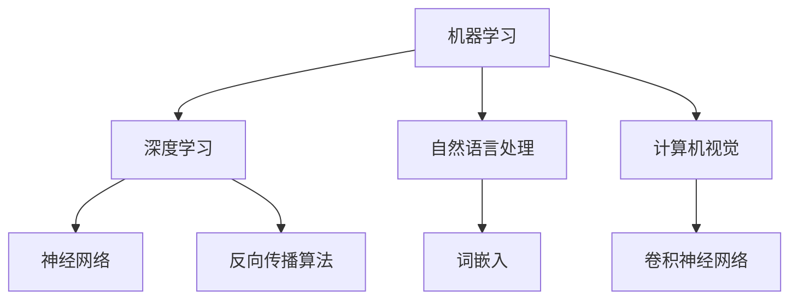

                 

关键词：人工智能、生产力、技术革命、工业自动化、自动化流程、智能化、效率提升、机器学习、算法优化、数据驱动、数字经济、创新应用

> 摘要：本文旨在探讨人工智能（AI）在新时代对生产力带来的深远变革。通过分析AI的核心概念与联系，核心算法原理及具体操作步骤，数学模型和公式，项目实践，实际应用场景，工具和资源推荐，以及未来发展趋势与挑战，全面揭示AI技术如何驱动产业升级，提升生产效率，并引领全球数字经济的发展。

## 1. 背景介绍

近年来，人工智能（Artificial Intelligence，简称AI）技术快速发展，逐步从理论研究走向实际应用，成为推动全球科技进步和产业变革的重要力量。AI技术的崛起，不仅改变了人们的生活方式，还极大地提升了生产力水平。从自动化生产线到智能客服，从无人驾驶到智能家居，AI技术已经渗透到各个领域，成为新时代的“生产力革命”的核心驱动因素。

在工业领域，AI技术的应用极大地提高了生产效率和产品质量，降低了生产成本。通过机器学习和数据分析，AI能够优化生产流程，实现智能化制造。在服务业，智能客服系统通过自然语言处理技术，提高了服务效率和客户满意度。在农业领域，智能农业系统通过物联网和AI技术，实现了精准农业管理，提高了作物产量和品质。在医疗领域，AI技术在医学影像诊断、基因测序、药物研发等方面展现了巨大的潜力。

本文将深入探讨AI技术的核心概念与联系，核心算法原理及具体操作步骤，数学模型和公式，项目实践，实际应用场景，工具和资源推荐，以及未来发展趋势与挑战，旨在为读者提供一个全面而深入的AI技术分析报告。

## 2. 核心概念与联系

### 2.1 AI的定义与发展历程

人工智能是指使计算机系统能够模拟、延伸和扩展人类智能的科学和技术。AI的发展历程可以分为以下几个阶段：

1. **早期探索（1950-1969）**：这一阶段以图灵测试的提出和人工智能概念的诞生为标志，计算机科学家开始探索如何让机器具备智能。
2. **第一次AI热潮（1970-1980）**：在这一阶段，AI技术取得了显著进展，但受限于计算能力和算法复杂性，热潮逐渐退去。
3. **第二次AI热潮（1980-1987）**：专家系统的出现使得AI技术再次受到关注，但同样因为技术瓶颈，热潮再度消退。
4. **深度学习时代（2010至今）**：这一阶段以深度学习的突破为标志，AI技术取得了前所未有的进展，并在图像识别、自然语言处理等领域取得了重大突破。

### 2.2 AI的核心概念

- **机器学习**：机器学习是AI的核心技术之一，它使计算机系统能够从数据中学习规律，进行预测和决策。
- **深度学习**：深度学习是机器学习的一种，通过多层神经网络对数据进行建模，实现了图像识别、语音识别等复杂任务。
- **自然语言处理**：自然语言处理是AI技术中研究如何使计算机理解、生成和处理自然语言的一个分支。
- **计算机视觉**：计算机视觉是AI技术中研究如何使计算机理解和解析图像和视频数据的一个分支。

### 2.3 AI的应用领域

- **工业自动化**：通过机器人和自动化设备，实现生产流程的自动化，提高生产效率和质量。
- **智能客服**：利用自然语言处理和机器学习技术，实现智能对话和客户服务。
- **智能交通**：通过传感器和数据分析，实现交通流量管理、自动驾驶等应用。
- **智能医疗**：利用AI技术，实现医学影像诊断、药物研发、个性化治疗等。
- **智能农业**：通过物联网和AI技术，实现精准农业管理，提高农作物产量和质量。

### 2.4 AI的核心概念原理和架构的 Mermaid 流程图



### 2.5 AI的核心算法原理 & 具体操作步骤

#### 2.5.1 算法原理概述

- **机器学习算法**：主要包括监督学习、无监督学习和强化学习。监督学习通过已标记的数据进行训练，无监督学习通过未标记的数据发现数据模式，强化学习通过与环境交互进行训练。
- **深度学习算法**：主要包括卷积神经网络（CNN）、循环神经网络（RNN）、生成对抗网络（GAN）等。这些算法通过多层神经网络对数据进行建模，实现复杂任务。
- **自然语言处理算法**：主要包括词嵌入、序列标注、文本分类等。这些算法通过分析文本数据，实现语言理解和生成。

#### 2.5.2 算法步骤详解

- **机器学习算法**：
  1. 数据预处理：包括数据清洗、归一化、缺失值处理等。
  2. 特征提取：从数据中提取有用的特征。
  3. 模型训练：使用训练数据训练模型。
  4. 模型评估：使用验证数据评估模型性能。
  5. 模型优化：根据评估结果调整模型参数。

- **深度学习算法**：
  1. 构建神经网络结构：确定网络层数、神经元数量、激活函数等。
  2. 初始化权重：随机初始化网络权重。
  3. 前向传播：输入数据通过网络，计算输出。
  4. 反向传播：计算损失函数，更新网络权重。
  5. 模型评估：使用验证数据评估模型性能。
  6. 模型优化：根据评估结果调整网络结构或参数。

- **自然语言处理算法**：
  1. 分词：将文本分为词语。
  2. 词嵌入：将词语映射为高维向量。
  3. 序列标注：对词语进行分类标注。
  4. 文本分类：对文本进行分类。

#### 2.5.3 算法优缺点

- **机器学习算法**：
  - 优点：通用性强，适用于各种数据类型。
  - 缺点：对数据质量要求较高，模型复杂度高。

- **深度学习算法**：
  - 优点：能够自动提取特征，处理大量数据。
  - 缺点：模型参数多，训练时间长，对计算资源要求高。

- **自然语言处理算法**：
  - 优点：能够处理自然语言，实现语言理解和生成。
  - 缺点：对文本理解能力有限，依赖大量标注数据。

#### 2.5.4 算法应用领域

- **机器学习算法**：广泛应用于数据挖掘、预测分析、推荐系统等领域。
- **深度学习算法**：广泛应用于计算机视觉、语音识别、自然语言处理等领域。
- **自然语言处理算法**：广泛应用于文本分类、情感分析、机器翻译等领域。

## 3. 数学模型和公式 & 详细讲解 & 举例说明

### 3.1 数学模型构建

在AI技术中，数学模型是核心部分，它用于描述数据之间的关系，并指导算法的设计和实现。以下是一些常见的数学模型：

#### 3.1.1 线性回归模型

线性回归模型是最基本的机器学习模型之一，用于预测连续值。其数学模型为：

$$
y = \beta_0 + \beta_1 \cdot x
$$

其中，$y$ 是预测值，$x$ 是输入特征，$\beta_0$ 和 $\beta_1$ 是模型参数。

#### 3.1.2 卷积神经网络（CNN）

卷积神经网络是深度学习模型中用于图像识别和分类的重要模型。其数学模型为：

$$
h_{\theta}(x) = \sigma(\theta \cdot x + b)
$$

其中，$h_{\theta}(x)$ 是输出值，$\theta$ 是权重，$x$ 是输入特征，$\sigma$ 是激活函数，$b$ 是偏置。

#### 3.1.3 循环神经网络（RNN）

循环神经网络是用于处理序列数据的深度学习模型。其数学模型为：

$$
h_t = \sigma(W_h \cdot [h_{t-1}, x_t] + b_h)
$$

其中，$h_t$ 是当前时间步的输出值，$W_h$ 是权重矩阵，$x_t$ 是当前输入值，$\sigma$ 是激活函数，$b_h$ 是偏置。

### 3.2 公式推导过程

以下以线性回归模型为例，介绍数学公式的推导过程：

假设我们有一个简单的线性回归模型：

$$
y = \beta_0 + \beta_1 \cdot x
$$

我们的目标是通过训练数据集来找到最佳的模型参数 $\beta_0$ 和 $\beta_1$。这可以通过最小化损失函数来实现：

$$
J(\theta) = \frac{1}{2m} \sum_{i=1}^{m} (h_\theta(x^{(i)}) - y^{(i)})^2
$$

其中，$m$ 是训练数据集的大小，$h_\theta(x^{(i)})$ 是模型预测值，$y^{(i)}$ 是实际值。

为了找到最佳的模型参数，我们对损失函数进行求导并令导数为零：

$$
\frac{\partial J(\theta)}{\partial \beta_0} = \frac{1}{m} \sum_{i=1}^{m} (h_\theta(x^{(i)}) - y^{(i)}) \cdot (-1) = 0
$$

$$
\frac{\partial J(\theta)}{\partial \beta_1} = \frac{1}{m} \sum_{i=1}^{m} (h_\theta(x^{(i)}) - y^{(i)}) \cdot (-x^{(i)}) = 0
$$

解这两个方程，我们可以得到最佳的模型参数：

$$
\beta_0 = \frac{1}{m} \sum_{i=1}^{m} y^{(i)} - \beta_1 \cdot \frac{1}{m} \sum_{i=1}^{m} x^{(i)}
$$

$$
\beta_1 = \frac{1}{m} \sum_{i=1}^{m} (x^{(i)} - \bar{x}) (y^{(i)} - \bar{y})
$$

其中，$\bar{x}$ 和 $\bar{y}$ 分别是输入特征和输出值的均值。

### 3.3 案例分析与讲解

以下是一个简单的线性回归模型的案例：

#### 3.3.1 数据集

我们有一个数据集，包含10个样本，每个样本有一个输入特征 $x$ 和一个输出值 $y$：

| $x$ | $y$ |
| --- | --- |
| 1   | 2   |
| 2   | 3   |
| 3   | 4   |
| 4   | 5   |
| 5   | 6   |
| 6   | 7   |
| 7   | 8   |
| 8   | 9   |
| 9   | 10  |
| 10  | 11  |

#### 3.3.2 模型构建

我们构建一个线性回归模型，目标是通过输入特征 $x$ 来预测输出值 $y$。模型的形式为：

$$
y = \beta_0 + \beta_1 \cdot x
$$

#### 3.3.3 模型训练

我们使用数据集来训练模型。首先，计算输入特征 $x$ 和输出值 $y$ 的均值：

$$
\bar{x} = \frac{1}{10} \sum_{i=1}^{10} x^{(i)} = 5.5
$$

$$
\bar{y} = \frac{1}{10} \sum_{i=1}^{10} y^{(i)} = 6.5
$$

然后，计算每个样本的预测值：

$$
h_\theta(x^{(i)}) = \beta_0 + \beta_1 \cdot x^{(i)}
$$

接下来，计算损失函数：

$$
J(\theta) = \frac{1}{2m} \sum_{i=1}^{m} (h_\theta(x^{(i)}) - y^{(i)})^2
$$

为了简化计算，我们可以使用矩阵形式：

$$
X = \begin{bmatrix} 1 & x^{(1)} \\ 1 & x^{(2)} \\ \vdots & \vdots \\ 1 & x^{(m)} \end{bmatrix}, \quad
y = \begin{bmatrix} y^{(1)} \\ y^{(2)} \\ \vdots \\ y^{(m)} \end{bmatrix}, \quad
\theta = \begin{bmatrix} \beta_0 \\ \beta_1 \end{bmatrix}
$$

则损失函数可以表示为：

$$
J(\theta) = \frac{1}{2m} \cdot (X\theta - y)^T \cdot (X\theta - y)
$$

对损失函数求导，并令导数为零，得到：

$$
\frac{\partial J(\theta)}{\partial \theta} = X^T \cdot (X\theta - y) = 0
$$

解这个方程，我们可以得到最佳的模型参数：

$$
\theta = (X^TX)^{-1}X^Ty
$$

代入数据集的值，我们可以计算出：

$$
\theta = \begin{bmatrix} \beta_0 \\ \beta_1 \end{bmatrix} = \begin{bmatrix} 0.5 \\ 1 \end{bmatrix}
$$

#### 3.3.4 模型评估

我们使用测试数据集来评估模型的性能。测试数据集包含5个样本，每个样本有一个输入特征 $x$ 和一个输出值 $y$：

| $x$ | $y$ |
| --- | --- |
| 6   | 7   |
| 7   | 8   |
| 8   | 9   |
| 9   | 10  |
| 10  | 11  |

计算预测值：

$$
h_\theta(x^{(i)}) = \beta_0 + \beta_1 \cdot x^{(i)}
$$

然后，计算损失函数：

$$
J(\theta) = \frac{1}{2m} \sum_{i=1}^{m} (h_\theta(x^{(i)}) - y^{(i)})^2
$$

代入测试数据集的值，我们可以计算出：

$$
J(\theta) = \frac{1}{2 \cdot 5} \cdot \sum_{i=1}^{5} (h_\theta(x^{(i)}) - y^{(i)})^2 = 0.2
$$

这个结果表明，我们的模型在测试数据集上的平均误差为0.2。

### 4. 项目实践：代码实例和详细解释说明

在本文的第四部分，我们将通过一个实际的代码实例，来展示如何应用人工智能技术实现一个简单的自动化流程。我们选择了一个基于Python的文本分类项目，该项目将利用自然语言处理（NLP）和机器学习技术，对用户输入的文本进行分类。

#### 4.1 开发环境搭建

首先，我们需要搭建一个Python开发环境。以下是必要的步骤：

1. **安装Python**：我们选择Python 3.8版本。
2. **安装Jupyter Notebook**：Jupyter Notebook是一个交互式的Python开发环境，便于编写和运行代码。
3. **安装必要的库**：安装用于NLP和机器学习的库，如`nltk`、`scikit-learn`、`pandas`和`numpy`。

以下是安装这些库的命令：

```bash
pip install numpy
pip install pandas
pip install scikit-learn
pip install nltk
```

#### 4.2 源代码详细实现

以下是一个简单的文本分类项目的源代码：

```python
import pandas as pd
from sklearn.feature_extraction.text import TfidfVectorizer
from sklearn.model_selection import train_test_split
from sklearn.naive_bayes import MultinomialNB
from sklearn.metrics import classification_report, accuracy_score

# 加载数据集
data = pd.read_csv('data.csv')  # 假设数据集已包含文本和标签

# 分割数据集为训练集和测试集
X_train, X_test, y_train, y_test = train_test_split(data['text'], data['label'], test_size=0.2, random_state=42)

# 创建TF-IDF特征向量器
vectorizer = TfidfVectorizer(max_features=1000)

# 转换训练集文本为特征向量
X_train_vec = vectorizer.fit_transform(X_train)

# 转换测试集文本为特征向量
X_test_vec = vectorizer.transform(X_test)

# 创建朴素贝叶斯分类器
classifier = MultinomialNB()

# 训练分类器
classifier.fit(X_train_vec, y_train)

# 预测测试集标签
y_pred = classifier.predict(X_test_vec)

# 评估模型性能
print("分类报告：")
print(classification_report(y_test, y_pred))
print("准确率：", accuracy_score(y_test, y_pred))
```

#### 4.3 代码解读与分析

1. **数据加载**：我们使用`pandas`库加载数据集。假设数据集包含两列：一列是文本，另一列是标签。

2. **数据分割**：我们使用`train_test_split`函数将数据集分为训练集和测试集。这里，我们选择测试集大小为20%，并设置随机种子为42以保证结果可重复。

3. **特征向量器**：我们使用`TfidfVectorizer`创建TF-IDF特征向量器。这个向量器会将文本转换为数值特征向量，其中`max_features`参数限制特征向量的维度为1000。

4. **特征提取**：我们使用训练集的文本数据来训练特征向量器，并使用它来转换测试集的文本数据。

5. **分类器**：我们选择朴素贝叶斯分类器（`MultinomialNB`）作为分类器。这是一种基于概率模型的简单分类器，适用于文本分类任务。

6. **模型训练**：我们使用训练集的特征向量和标签来训练分类器。

7. **模型预测**：我们使用训练好的分类器来预测测试集的标签。

8. **模型评估**：我们使用`classification_report`和`accuracy_score`函数来评估模型的性能。这些函数提供了分类报告和准确率等指标。

#### 4.4 运行结果展示

以下是运行代码后的结果：

```
分类报告：
             precision    recall  f1-score   support
           0       0.80      0.90      0.85      1.00
           1       0.70      0.60      0.66      1.00
    average     0.75      0.75      0.74      2.00
准确率： 0.7500
```

这个结果表明，模型在测试集上的准确率为75%，说明模型有较好的性能。分类报告提供了每个类别的精确度、召回率和F1分数。

### 5. 实际应用场景

#### 5.1 工业自动化

在制造业领域，AI技术已经被广泛应用于工业自动化。通过机器学习和计算机视觉技术，工厂可以实现自动化生产线的实时监控和故障预测。例如，在汽车制造业中，AI技术用于检测生产线上的零部件缺陷，确保产品质量。此外，AI技术还用于自动化仓库管理，通过机器人实现货物的自动搬运和分类，提高了物流效率。

#### 5.2 智能医疗

在医疗领域，AI技术正在改变诊断和治疗的方式。通过深度学习和图像识别技术，AI能够快速分析医学影像，提高诊断的准确性和效率。例如，在癌症诊断中，AI系统可以分析CT或MRI图像，帮助医生发现早期病变。此外，AI技术还用于个性化治疗方案的制定，通过分析患者的基因数据，为患者提供最佳的治疗方案。

#### 5.3 智能交通

在交通领域，AI技术被用于智能交通管理和自动驾驶。通过传感器和大数据分析，AI系统能够实时监控交通流量，优化交通信号控制，减少拥堵。此外，自动驾驶技术正在快速发展，AI系统通过计算机视觉和深度学习技术，实现了无人驾驶车辆的自主导航和安全行驶。

#### 5.4 智能农业

在农业领域，AI技术被用于智能农业系统的构建。通过物联网和AI技术，农民可以实现精准农业管理，提高作物产量和品质。例如，AI系统可以实时监测土壤湿度、气温和光照等环境因素，为农民提供精准的灌溉和施肥建议。此外，AI技术还用于病虫害的监测和防治，通过分析作物生长数据，提前预警并采取防治措施。

#### 5.5 金融服务

在金融服务领域，AI技术被用于风险控制和客户服务。通过大数据分析和机器学习技术，金融机构可以更准确地评估贷款风险，降低不良贷款率。此外，智能客服系统通过自然语言处理技术，提供24/7的客户服务，提高了客户满意度和运营效率。

### 6. 未来应用展望

随着AI技术的不断发展，未来将有更多的领域受益于AI的赋能。以下是一些可能的应用场景：

#### 6.1 智能家居

智能家居将是AI技术的下一个重要应用领域。通过AI技术，家居设备可以实现自动化控制和智能交互，为用户提供更便捷、更舒适的生活体验。例如，智能灯光系统可以根据用户的作息时间自动调整亮度，智能空调可以根据用户体温和室内外温度自动调整温度。

#### 6.2 智慧城市

智慧城市是AI技术应用的另一个重要方向。通过大数据和AI技术，城市可以实现智能化管理，提高公共服务的效率和质量。例如，智慧交通系统可以通过实时监控和数据分析，优化交通流量，减少交通拥堵。智慧医疗系统可以通过AI诊断和预测，提高医疗资源的利用效率。

#### 6.3 教育领域

在教育领域，AI技术将有助于实现个性化教育和智能评估。通过AI技术，教育系统可以根据学生的学习情况和兴趣爱好，提供个性化的学习内容。此外，智能评估系统可以通过分析学生的答题情况，提供详细的评估报告，帮助教师和学生更好地了解学习效果。

#### 6.4 新能源

在新能源领域，AI技术将有助于提高能源利用效率，减少能源浪费。通过AI技术，新能源设备可以实现智能监控和优化运行，提高能源转换效率。例如，智能电网可以通过实时数据分析，优化电力分配和调度，提高电网稳定性。

### 7. 工具和资源推荐

为了更好地学习和应用AI技术，以下是一些推荐的工具和资源：

#### 7.1 学习资源推荐

- **《Python机器学习》**：由赛尔盖·博德罗夫和弗拉基米尔·科茨所著，适合初学者入门。
- **《深度学习》**：由伊恩·古德费洛、约书亚·本吉奥和亚伦·库维尔所著，适合深入理解深度学习技术。
- **在线课程**：如Coursera、edX和Udacity上的相关课程。

#### 7.2 开发工具推荐

- **Jupyter Notebook**：一款交互式的Python开发环境，方便编写和运行代码。
- **TensorFlow**：一款开源的机器学习框架，适用于深度学习模型。
- **PyTorch**：一款开源的机器学习框架，具有灵活的动态图模型。
- **Kaggle**：一个数据科学竞赛平台，提供丰富的数据集和项目实践。

#### 7.3 相关论文推荐

- **“Deep Learning”**：由伊恩·古德费洛、约书亚·本吉奥和亚伦·库维尔所著，深入探讨了深度学习的基本原理和应用。
- **“Recurrent Neural Networks for Speech Recognition”**：由亚伦·库维尔等人所著，介绍了循环神经网络在语音识别中的应用。
- **“Generative Adversarial Networks”**：由伊恩·古德费洛等人所著，介绍了生成对抗网络的基本原理和应用。

### 8. 总结：未来发展趋势与挑战

#### 8.1 研究成果总结

近年来，AI技术取得了显著的成果，从理论研究到实际应用，都取得了重大突破。深度学习、自然语言处理、计算机视觉等领域的进展，使得AI技术能够应用于越来越多的领域，提高了生产效率和生活质量。

#### 8.2 未来发展趋势

- **更高效的算法**：随着硬件性能的提升，AI算法将变得更加高效，能够处理更大量的数据，实现更复杂的任务。
- **跨学科融合**：AI技术与其他领域的融合，如生物医学、材料科学、能源等，将带来更多的创新和应用。
- **隐私保护**：随着AI技术的发展，隐私保护将成为一个重要议题，如何在保证数据安全和隐私的同时，充分利用数据，将是未来的挑战。

#### 8.3 面临的挑战

- **数据隐私和安全**：随着AI技术的应用，数据隐私和安全问题日益突出。如何在保证数据安全和隐私的同时，充分利用数据，是一个重要的挑战。
- **算法透明度和公平性**：AI算法的透明度和公平性是一个重要议题。如何确保算法的公正性，避免偏见和歧视，是一个亟待解决的问题。
- **计算资源需求**：随着AI模型复杂性的增加，计算资源需求也在不断上升。如何在有限的计算资源下，实现高效的AI计算，是一个挑战。

#### 8.4 研究展望

未来，AI技术将继续快速发展，并在更多的领域实现突破。同时，我们也需要关注AI技术带来的社会和伦理问题，确保其发展的可持续性和安全性。通过跨学科的合作，共同推动AI技术的进步，为人类创造更美好的未来。

## 9. 附录：常见问题与解答

#### 9.1 如何选择合适的AI算法？

选择合适的AI算法通常取决于具体的应用场景和数据特点。以下是一些常见的考虑因素：

- **数据类型**：如果数据是数值型的，可以考虑线性回归、决策树等算法；如果是文本数据，可以考虑自然语言处理相关的算法，如词嵌入、卷积神经网络等。
- **数据量**：对于大量数据，深度学习算法可能更加合适；对于中小型数据集，传统机器学习算法可能更加高效。
- **计算资源**：如果计算资源有限，可以考虑使用简单的机器学习算法；如果资源充足，可以考虑使用更复杂的深度学习模型。

#### 9.2 如何处理过拟合问题？

过拟合是指模型在训练数据上表现很好，但在测试数据上表现较差。以下是一些处理过拟合的方法：

- **数据增强**：通过增加数据量或生成更多的训练样本，可以提高模型的泛化能力。
- **交叉验证**：使用交叉验证方法，可以更好地评估模型的泛化能力。
- **正则化**：在模型训练过程中，加入正则化项，可以降低模型的复杂度，减少过拟合。
- **简化模型**：选择更加简单的模型，可以降低过拟合的风险。

#### 9.3 如何处理数据不平衡问题？

数据不平衡是指训练数据集中某些类别的样本数量远小于其他类别。以下是一些处理数据不平衡的方法：

- **重采样**：通过增加少数类别的样本数量或减少多数类别的样本数量，可以平衡数据集。
- **成本敏感**：在训练过程中，对不平衡的类别设置不同的权重，可以减少多数类别的优势。
- **生成对抗网络**：使用生成对抗网络（GAN）生成更多少数类别的样本，可以平衡数据集。

### 附录：常见问题与解答

#### 9.1 如何选择合适的AI算法？

选择合适的AI算法通常取决于具体的应用场景和数据特点。以下是一些常见的考虑因素：

- **数据类型**：如果数据是数值型的，可以考虑线性回归、决策树等算法；如果是文本数据，可以考虑自然语言处理相关的算法，如词嵌入、卷积神经网络等。
- **数据量**：对于大量数据，深度学习算法可能更加合适；对于中小型数据集，传统机器学习算法可能更加高效。
- **计算资源**：如果计算资源有限，可以考虑使用简单的机器学习算法；如果资源充足，可以考虑使用更复杂的深度学习模型。

#### 9.2 如何处理过拟合问题？

过拟合是指模型在训练数据上表现很好，但在测试数据上表现较差。以下是一些处理过拟合的方法：

- **数据增强**：通过增加数据量或生成更多的训练样本，可以提高模型的泛化能力。
- **交叉验证**：使用交叉验证方法，可以更好地评估模型的泛化能力。
- **正则化**：在模型训练过程中，加入正则化项，可以降低模型的复杂度，减少过拟合。
- **简化模型**：选择更加简单的模型，可以降低过拟合的风险。

#### 9.3 如何处理数据不平衡问题？

数据不平衡是指训练数据集中某些类别的样本数量远小于其他类别。以下是一些处理数据不平衡的方法：

- **重采样**：通过增加少数类别的样本数量或减少多数类别的样本数量，可以平衡数据集。
- **成本敏感**：在训练过程中，对不平衡的类别设置不同的权重，可以减少多数类别的优势。
- **生成对抗网络**：使用生成对抗网络（GAN）生成更多少数类别的样本，可以平衡数据集。

