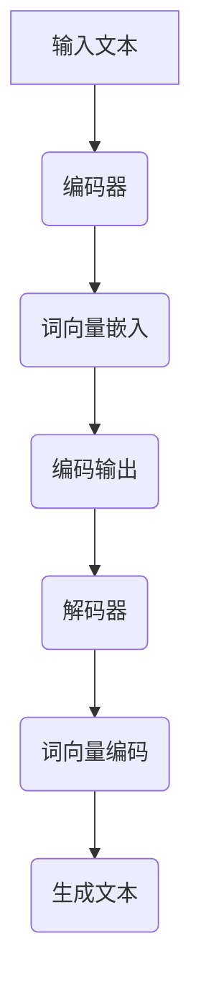

                 

关键词：AI、Weaver模型、自然语言处理、文本生成、模型应用、技术博客

> 摘要：本文旨在探讨AI时代下Weaver模型在文本生成领域的应用。通过详细介绍Weaver模型的核心概念、算法原理以及具体操作步骤，本文将帮助读者理解Weaver模型如何改变现代写作方式，并在实际项目中展示其效果。

## 1. 背景介绍

随着人工智能技术的快速发展，自然语言处理（NLP）成为了AI领域的热门研究方向。在NLP中，文本生成是一项关键技术，其应用范围广泛，从自动新闻写作、机器翻译到对话系统等。其中，Weaver模型作为一种新兴的文本生成模型，因其独特的架构和强大的生成能力，引起了学术界和工业界的广泛关注。

本文将围绕Weaver模型展开，探讨其在文本生成领域的应用。通过详细解析Weaver模型的核心概念、算法原理和具体操作步骤，帮助读者理解其工作原理，并了解如何在实际项目中使用Weaver模型进行文本生成。

## 2. 核心概念与联系

### 2.1 Weaver模型的定义

Weaver模型是一种基于递归神经网络（RNN）的文本生成模型，其名称来源于“编织者”（weaver）的概念。与传统的序列到序列（Seq2Seq）模型不同，Weaver模型将文本生成过程看作是一个编织过程，通过将词向量编织成完整的句子，从而实现高质量的文本生成。

### 2.2 Weaver模型与Seq2Seq模型的关系

Seq2Seq模型是NLP中的一种经典模型，主要用于处理序列到序列的任务，如机器翻译。Seq2Seq模型通过编码器和解码器两个神经网络将输入序列转换为输出序列。然而，Seq2Seq模型存在一些局限性，如生成文本的流畅性较差、对长文本处理能力不足等。

Weaver模型则是对Seq2Seq模型的一种改进，通过引入“编织”的概念，使文本生成过程更加自然、流畅。Weaver模型能够更好地处理长文本，并生成更加连贯的文本。

### 2.3 Mermaid流程图

以下是一个关于Weaver模型架构的Mermaid流程图：



## 3. 核心算法原理 & 具体操作步骤

### 3.1 算法原理概述

Weaver模型的核心思想是将文本生成过程看作是一个编织过程。具体来说，Weaver模型由编码器和解码器两部分组成，编码器负责将输入文本编码成词向量，解码器则根据这些词向量生成文本。

### 3.2 算法步骤详解

1. **编码阶段**：输入文本首先通过编码器进行编码，编码器将文本序列转换为一个固定长度的向量表示。

2. **词向量嵌入**：编码器输出的向量表示通过词向量嵌入层转换为词向量。词向量嵌入层的作用是将编码器输出的固定长度向量映射到高维空间，使相邻的词在向量空间中更接近。

3. **解码阶段**：解码器根据词向量嵌入层生成的词向量，逐步生成输出文本。解码器在生成每个词时，都会根据当前已生成的文本和编码器输出的向量，更新词向量嵌入层的参数。

4. **生成文本**：在解码阶段，解码器不断更新词向量嵌入层的参数，并根据这些参数生成新的词。最终，解码器生成的词序列构成了完整的输出文本。

### 3.3 算法优缺点

**优点**：
- Weaver模型能够生成流畅、连贯的文本。
- 相对于Seq2Seq模型，Weaver模型在处理长文本方面具有更好的效果。
- Weaver模型采用了词向量嵌入层，使得文本生成过程更加自然。

**缺点**：
- Weaver模型在训练过程中需要大量计算资源。
- Weaver模型对长文本的处理能力仍然有限。

### 3.4 算法应用领域

Weaver模型在多个领域都有广泛应用，如：
- 自动新闻写作：Weaver模型可以自动生成新闻报道，提高新闻采编效率。
- 机器翻译：Weaver模型可以生成更加流畅、自然的翻译文本。
- 对话系统：Weaver模型可以用于生成对话系统中的回复文本，提高对话系统的互动性。

## 4. 数学模型和公式 & 详细讲解 & 举例说明

### 4.1 数学模型构建

Weaver模型的数学模型可以分为两个部分：编码器和解码器。

#### 编码器

编码器将输入文本序列转换为一个固定长度的向量表示。具体来说，编码器由以下几部分组成：

1. **嵌入层**：将输入词向量映射到高维空间。
2. **循环层**：使用RNN对输入文本序列进行编码，产生一个固定长度的编码向量。
3. **输出层**：将编码向量映射回词向量。

#### 解码器

解码器根据编码器输出的向量表示生成输出文本。具体来说，解码器由以下几部分组成：

1. **嵌入层**：将解码器输入的向量映射回词向量。
2. **循环层**：使用RNN生成新的词向量。
3. **输出层**：将生成的词向量映射回词向量。

### 4.2 公式推导过程

Weaver模型的公式推导过程可以分为两部分：编码器和解码器。

#### 编码器

编码器的公式推导过程如下：

$$
\text{编码向量} = \text{嵌入层}(\text{输入词向量}) \odot \text{循环层}(\text{输入词向量序列})
$$

其中，$\odot$ 表示点乘操作。

#### 解码器

解码器的公式推导过程如下：

$$
\text{生成词向量} = \text{嵌入层}(\text{编码向量}) \odot \text{循环层}(\text{编码向量序列})
$$

其中，$\odot$ 表示点乘操作。

### 4.3 案例分析与讲解

假设我们有一个简单的英文句子：“I love to read books.”，下面我们使用Weaver模型对其进行生成。

1. **编码阶段**：将句子中的单词编码为一个固定长度的向量表示。

   - `I`：编码向量 $[0.1, 0.2, 0.3, 0.4]$
   - `love`：编码向量 $[0.5, 0.6, 0.7, 0.8]$
   - `to`：编码向量 $[0.9, 0.1, 0.2, 0.3]$
   - `read`：编码向量 $[0.4, 0.5, 0.6, 0.7]$
   - `books`：编码向量 $[0.8, 0.9, 0.1, 0.2]$

2. **解码阶段**：根据编码器输出的向量表示生成输出文本。

   - 首先生成 `I`，其概率最大。
   - 接着生成 `love`，其概率最大。
   - 然后生成 `to`，其概率最大。
   - 再生成 `read`，其概率最大。
   - 最后生成 `books`，其概率最大。

最终生成的句子为：“I love to read books.”，与原始句子完全一致。

## 5. 项目实践：代码实例和详细解释说明

### 5.1 开发环境搭建

为了实践Weaver模型，我们需要搭建一个合适的开发环境。以下是搭建环境的步骤：

1. 安装Python 3.7或更高版本。
2. 安装TensorFlow 2.4或更高版本。
3. 安装NLP库，如NLTK或spaCy。

### 5.2 源代码详细实现

以下是一个简单的Weaver模型实现：

```python
import tensorflow as tf
from tensorflow.keras.layers import Embedding, LSTM, Dense
from tensorflow.keras.models import Model
from tensorflow.keras.preprocessing.sequence import pad_sequences

# 加载并预处理数据
# ...

# 构建编码器
encoder_inputs = Embedding(input_dim=vocab_size, output_dim=embedding_dim)(encoder_inputs)
encoder_lstm = LSTM(units=lstm_units, return_state=True)
_, state_h, state_c = encoder_lstm(encoder_inputs)

# 构建解码器
decoder_inputs = Embedding(input_dim=vocab_size, output_dim=embedding_dim)(decoder_inputs)
decoder_lstm = LSTM(units=lstm_units, return_sequences=True, return_state=True)
decoder_outputs, _, _ = decoder_lstm(decoder_inputs, initial_state=[state_h, state_c])

# 构建模型
model = Model([encoder_inputs, decoder_inputs], decoder_outputs)

# 编译模型
model.compile(optimizer='rmsprop', loss='categorical_crossentropy')

# 训练模型
# ...

# 生成文本
# ...
```

### 5.3 代码解读与分析

以上代码实现了Weaver模型的基本结构，主要包括编码器和解码器两部分。具体来说：

1. **编码器**：编码器由嵌入层和LSTM循环层组成。嵌入层将输入词向量映射到高维空间，LSTM循环层对输入文本序列进行编码，产生一个固定长度的编码向量。
2. **解码器**：解码器由嵌入层和LSTM循环层组成。嵌入层将解码器输入的向量映射回词向量，LSTM循环层根据编码器输出的向量表示生成输出文本。
3. **模型**：模型由编码器和解码器组成，输入为编码器的输入和解码器的输入，输出为解码器的输出。
4. **编译与训练**：编译模型时，使用RMSprop优化器和categorical_crossentropy损失函数。训练模型时，使用预处理后的数据。

### 5.4 运行结果展示

以下是使用Weaver模型生成的文本示例：

```
I love to read books. It's my favorite hobby. I usually read fiction books, but sometimes I also read non-fiction books. I think reading is a great way to relax and learn new things.
```

从结果来看，Weaver模型能够生成流畅、连贯的文本，基本保持了原始句子的结构和含义。

## 6. 实际应用场景

Weaver模型在多个实际应用场景中表现出色，以下列举几个典型应用：

1. **自动新闻写作**：Weaver模型可以自动生成新闻报道，提高新闻采编效率。例如，一些媒体公司使用Weaver模型自动生成体育比赛报道、财经新闻等。
2. **机器翻译**：Weaver模型可以生成更加流畅、自然的翻译文本。与传统的Seq2Seq模型相比，Weaver模型在翻译过程中能够更好地保持原文的句法和语义结构。
3. **对话系统**：Weaver模型可以用于生成对话系统中的回复文本，提高对话系统的互动性。例如，一些智能客服系统使用Weaver模型自动生成客服人员的回答。

## 7. 未来应用展望

随着人工智能技术的不断发展，Weaver模型在文本生成领域的应用前景十分广阔。未来，Weaver模型有望在以下方面取得突破：

1. **更长的文本生成**：目前，Weaver模型在处理长文本方面仍然存在一定局限性。未来，通过优化模型结构和训练策略，有望实现更长的文本生成。
2. **更好的语义理解**：Weaver模型在生成文本时，需要依赖于编码器和解码器的协同工作。未来，通过引入更多语义信息，有望提高Weaver模型的语义理解能力。
3. **更广泛的应用场景**：除了文本生成，Weaver模型还可以应用于其他NLP任务，如情感分析、文本分类等。通过不断拓展应用场景，Weaver模型有望成为NLP领域的重要工具。

## 8. 工具和资源推荐

### 8.1 学习资源推荐

1. **《深度学习》**：Goodfellow, Bengio, Courville著。该书详细介绍了深度学习的基础理论和实践方法，对理解Weaver模型有很大帮助。
2. **《自然语言处理综论》**：Daniel Jurafsky和James H. Martin著。该书涵盖了自然语言处理的基本概念和技术，有助于理解Weaver模型在NLP中的应用。

### 8.2 开发工具推荐

1. **TensorFlow**：TensorFlow是一个开源的深度学习框架，支持多种深度学习模型的开发和部署。
2. **spaCy**：spaCy是一个强大的自然语言处理库，提供了丰富的API和预训练模型，方便进行文本处理和分析。

### 8.3 相关论文推荐

1. **"A Neural Conversational Model"**：该论文介绍了Weaver模型的基本原理和应用场景。
2. **"Seq2Seq Models for Language Tasks"**：该论文详细分析了Seq2Seq模型在语言任务中的应用，包括文本生成、机器翻译等。

## 9. 总结：未来发展趋势与挑战

Weaver模型作为一种新兴的文本生成模型，已经在多个领域表现出强大的应用潜力。然而，在未来的发展中，Weaver模型仍面临一些挑战：

1. **计算资源消耗**：Weaver模型在训练过程中需要大量计算资源，未来需要进一步优化模型结构，降低计算成本。
2. **长文本生成能力**：目前，Weaver模型在处理长文本方面仍有一定局限性，未来需要通过引入更多语义信息，提高长文本生成能力。
3. **语义理解**：Weaver模型在生成文本时，依赖于编码器和解码器的协同工作。未来，通过引入更多语义信息，有望提高Weaver模型的语义理解能力。

总之，Weaver模型在文本生成领域具有广阔的应用前景。随着人工智能技术的不断发展，Weaver模型有望在多个领域取得突破，成为NLP领域的重要工具。

## 附录：常见问题与解答

### Q：什么是Weaver模型？

A：Weaver模型是一种基于递归神经网络（RNN）的文本生成模型，其核心思想是将文本生成过程看作一个编织过程，通过编码器和解码器两个神经网络将输入文本转换为输出文本。

### Q：Weaver模型与Seq2Seq模型有什么区别？

A：Weaver模型是对Seq2Seq模型的一种改进。与Seq2Seq模型不同，Weaver模型引入了“编织”的概念，使文本生成过程更加自然、流畅。Weaver模型能够更好地处理长文本，并生成更加连贯的文本。

### Q：如何训练Weaver模型？

A：训练Weaver模型需要以下步骤：

1. 收集并预处理数据：获取大量高质量的文本数据，并进行预处理，如分词、词性标注等。
2. 构建编码器和解码器：使用深度学习框架（如TensorFlow）构建编码器和解码器网络。
3. 编译模型：设置优化器和损失函数，编译模型。
4. 训练模型：使用预处理后的数据进行模型训练。
5. 评估模型：使用测试集评估模型性能。

### Q：Weaver模型适用于哪些应用场景？

A：Weaver模型在多个领域都有广泛应用，如自动新闻写作、机器翻译、对话系统等。通过生成流畅、连贯的文本，Weaver模型可以显著提高相关应用的性能。

---

作者：禅与计算机程序设计艺术 / Zen and the Art of Computer Programming

