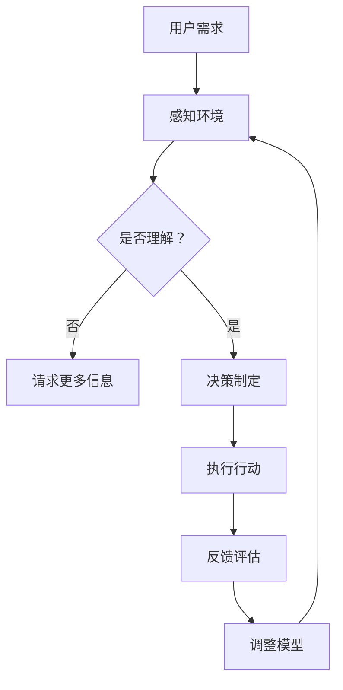

                 

在这个信息爆炸的时代，人工智能（AI）已经成为推动技术进步和社会发展的关键力量。AI智能体，作为AI技术的核心组件，正逐步融入我们的数字世界，实现与人类和环境的智能化交互。本文将探讨AI智能体的基本概念、核心原理、应用场景以及未来的发展趋势和挑战。

## 关键词 Keywords
- 人工智能
- AI智能体
- 数字世界
- 交互
- 智能化
- 机器学习
- 自然语言处理

## 摘要 Abstract
本文首先介绍了AI智能体的定义和背景，探讨了其在数字世界中的角色和重要性。接着，文章深入分析了AI智能体的核心原理，包括机器学习、深度学习和自然语言处理等技术。随后，文章列举了AI智能体在不同领域的应用案例，并对其未来发展趋势和面临的挑战进行了展望。最后，文章总结了相关工具和资源的推荐，以期为读者提供全面的AI智能体学习与实践指南。

## 1. 背景介绍

### 1.1 AI的发展历程

人工智能（Artificial Intelligence，简称AI）的概念最早由计算机科学家约翰·麦卡锡（John McCarthy）在1956年的达特茅斯会议上提出。自那时以来，AI经历了几个发展阶段，从符号主义、连接主义到现在的数据驱动方法，每个阶段都推动了AI技术的进步和应用。

#### 1.1.1 符号主义（Symbolic AI）

早期的AI研究主要采用符号主义方法，试图通过构建符号系统来模拟人类思维。这一方法依赖于逻辑推理和知识表示，具有高度的透明性和可解释性。然而，符号主义方法在处理复杂问题和实时决策方面存在局限性。

#### 1.1.2 连接主义（Connectionism）

20世纪80年代，连接主义方法开始兴起，以人工神经网络为基础，试图通过模拟人脑神经网络来实现智能。连接主义方法在图像识别、语音识别等领域取得了显著成果，但其计算复杂度和对大规模数据的需求使得其应用受到限制。

#### 1.1.3 数据驱动方法（Data-Driven Methods）

进入21世纪，随着计算能力和数据资源的迅猛增长，数据驱动方法成为AI研究的主流。这种方法通过机器学习和深度学习技术，从大规模数据中自动提取特征和模式，实现智能化决策和预测。

### 1.2 AI智能体的概念

AI智能体（Artificial Intelligent Agent）是AI技术的核心组件，指的是能够自主感知环境、制定计划并采取行动以实现特定目标的系统。AI智能体通常具备以下特征：

- **自主性**：能够自主地执行任务，不受外部指令的完全控制。
- **感知能力**：能够通过传感器获取环境信息。
- **决策能力**：能够基于感知信息和环境模型制定行动策略。
- **行动能力**：能够执行物理操作，影响环境。

### 1.3 AI智能体在数字世界的角色

在数字世界中，AI智能体扮演着越来越重要的角色。它们不仅能够提高自动化水平，提升工作效率，还能通过智能化交互提供个性化体验。以下是AI智能体在数字世界中的几个主要角色：

- **智能助手**：如苹果的Siri、谷歌助手等，为用户提供便捷的语音交互服务。
- **推荐系统**：通过分析用户行为和偏好，为用户推荐商品、音乐、电影等。
- **自动驾驶**：通过实时感知和决策，实现无人驾驶汽车的安全行驶。
- **智能家居**：通过物联网技术，实现家庭设备的智能化管理和控制。

## 2. 核心概念与联系

### 2.1 机器学习

机器学习（Machine Learning，ML）是AI智能体的核心技术之一，它使计算机能够从数据中学习规律，并自动改进性能。机器学习主要包括以下几种方法：

- **监督学习**：通过已有数据集进行训练，学习输入和输出之间的关系，从而预测新的输入。
- **无监督学习**：无需标注数据，通过发现数据中的模式进行学习。
- **半监督学习**：结合有监督学习和无监督学习，利用少量标注数据和大量无标注数据。

### 2.2 深度学习

深度学习（Deep Learning，DL）是机器学习的一个重要分支，基于多层神经网络来实现复杂的特征提取和模型学习。深度学习在图像识别、语音识别、自然语言处理等领域取得了突破性进展。

- **卷积神经网络（CNN）**：主要用于图像识别和图像处理。
- **循环神经网络（RNN）**：适用于序列数据的处理，如语音识别和语言建模。
- **生成对抗网络（GAN）**：通过生成器和判别器的对抗训练，实现数据的生成。

### 2.3 自然语言处理

自然语言处理（Natural Language Processing，NLP）是AI智能体实现自然语言交互的关键技术。NLP旨在使计算机能够理解、生成和处理自然语言，主要包括以下方面：

- **分词**：将连续的文本分割成有意义的词语。
- **词性标注**：对文本中的每个词进行词性分类。
- **句法分析**：分析文本的语法结构，理解句子成分之间的关系。
- **语义理解**：理解文本的含义和上下文，进行语义推理。

### 2.4 Mermaid 流程图

下面是一个简化的Mermaid流程图，展示AI智能体与数字世界的交互过程。



## 3. 核心算法原理 & 具体操作步骤

### 3.1 算法原理概述

AI智能体的核心算法主要基于机器学习和深度学习。以下介绍几种常见的算法原理和具体操作步骤：

#### 3.1.1 机器学习算法

- **线性回归**：通过建立输入和输出之间的线性关系进行预测。
  - **原理**：找到最佳拟合直线，使得预测值与实际值之间的误差最小。
  - **步骤**：
    1. 数据预处理：对数据进行归一化处理。
    2. 训练模型：使用梯度下降法优化参数。
    3. 预测新数据：将新数据输入模型，得到预测结果。

- **支持向量机（SVM）**：通过找到最佳分割超平面进行分类。
  - **原理**：找到使得分类边界最大化间隔的分割超平面。
  - **步骤**：
    1. 数据预处理：对数据进行标准化处理。
    2. 选择核函数：如线性核、多项式核、径向基函数（RBF）核。
    3. 训练模型：使用二次规划求解最优分割超平面。
    4. 预测新数据：将新数据映射到特征空间，找到最近的超平面进行分类。

#### 3.1.2 深度学习算法

- **卷积神经网络（CNN）**：用于图像识别和图像处理。
  - **原理**：通过多层卷积和池化操作，提取图像特征。
  - **步骤**：
    1. 数据预处理：对图像进行缩放、裁剪、翻转等预处理。
    2. 构建模型：定义卷积层、池化层和全连接层。
    3. 训练模型：使用反向传播算法优化模型参数。
    4. 预测新数据：将新图像输入模型，得到分类结果。

- **循环神经网络（RNN）**：用于序列数据的处理。
  - **原理**：通过隐藏状态的记忆机制，处理序列数据。
  - **步骤**：
    1. 数据预处理：将序列数据转换为向量。
    2. 构建模型：定义输入层、隐藏层和输出层。
    3. 训练模型：使用反向传播算法优化模型参数。
    4. 预测新数据：将新序列输入模型，得到预测结果。

### 3.2 算法步骤详解

#### 3.2.1 机器学习算法步骤详解

- **线性回归**：

1. 数据预处理：
   $$X = \frac{X - \mu}{\sigma}$$
   其中，$X$为输入数据，$\mu$为均值，$\sigma$为标准差。

2. 训练模型：
   使用梯度下降法优化参数：
   $$w_{new} = w_{old} - \alpha \cdot \nabla_w J(w)$$
   其中，$w$为权重参数，$\alpha$为学习率，$J(w)$为损失函数。

3. 预测新数据：
   $$y_{predict} = w \cdot x$$

- **支持向量机（SVM）**：

1. 数据预处理：
   $$X = \frac{X - \mu}{\sigma}$$

2. 选择核函数：
   $$K(x_i, x_j) = \sum_{k=1}^{d} \phi(x_i, k) \cdot \phi(x_j, k)$$
   其中，$K$为核函数，$\phi$为特征映射。

3. 训练模型：
   使用二次规划求解最优分割超平面：
   $$\min_{w, b} \frac{1}{2} ||w||^2 + C \sum_{i=1}^{n} \max(0, 1 - y_i (w \cdot x_i + b))$$
   其中，$C$为惩罚参数。

4. 预测新数据：
   $$y_{predict} = sign(w \cdot x_i + b)$$

#### 3.2.2 深度学习算法步骤详解

- **卷积神经网络（CNN）**：

1. 数据预处理：
   $$X = \frac{X - \mu}{\sigma}$$

2. 构建模型：
   - **卷积层**：$$f(x) = \sigma(W \cdot x + b)$$
   - **池化层**：$$P(x) = max(x)$$

3. 训练模型：
   - 使用反向传播算法优化参数：
     $$\nabla_w J(w) = \frac{\partial J(w)}{\partial w} = \frac{\partial L}{\partial z} \cdot \frac{\partial z}{\partial w}$$
   - 其中，$J(w)$为损失函数，$L$为损失值，$z$为中间层输出。

4. 预测新数据：
   $$y_{predict} = \sigma(W \cdot x + b)$$

- **循环神经网络（RNN）**：

1. 数据预处理：
   $$X = \frac{X - \mu}{\sigma}$$

2. 构建模型：
   - **输入层**：$$x_t$$
   - **隐藏层**：$$h_t = \sigma(W_h \cdot h_{t-1} + W_x \cdot x_t + b)$$
   - **输出层**：$$y_t = \sigma(W_y \cdot h_t + b)$$

3. 训练模型：
   - 使用反向传播算法优化参数：
     $$\nabla_w J(w) = \frac{\partial J(w)}{\partial w} = \frac{\partial L}{\partial y} \cdot \frac{\partial y}{\partial h} \cdot \frac{\partial h}{\partial w}$$
   - 其中，$J(w)$为损失函数，$L$为损失值。

4. 预测新数据：
   $$y_{predict} = \sigma(W_y \cdot h_t + b)$$

### 3.3 算法优缺点

#### 3.3.1 机器学习算法

- **线性回归**：
  - **优点**：简单易懂，计算效率高。
  - **缺点**：线性关系假设可能导致模型性能下降。

- **支持向量机（SVM）**：
  - **优点**：分类效果好，适用于高维空间。
  - **缺点**：训练时间较长，对大规模数据不友好。

#### 3.3.2 深度学习算法

- **卷积神经网络（CNN）**：
  - **优点**：在图像识别领域表现出色，能自动提取特征。
  - **缺点**：模型复杂，训练时间较长。

- **循环神经网络（RNN）**：
  - **优点**：适用于序列数据处理，能捕捉长期依赖关系。
  - **缺点**：易出现梯度消失和梯度爆炸问题。

### 3.4 算法应用领域

#### 3.4.1 机器学习算法应用领域

- **线性回归**：
  - 预测股票价格、房价等。
  - 分类：如垃圾邮件过滤、疾病诊断等。

- **支持向量机（SVM）**：
  - 分类：如手写数字识别、文本分类等。
  - 回归：如信用评分、贷款审批等。

#### 3.4.2 深度学习算法应用领域

- **卷积神经网络（CNN）**：
  - 图像识别：如人脸识别、物体检测等。
  - 图像生成：如风格迁移、图像修复等。

- **循环神经网络（RNN）**：
  - 自然语言处理：如机器翻译、情感分析等。
  - 语音识别：如语音合成、语音识别等。

## 4. 数学模型和公式 & 详细讲解 & 举例说明

### 4.1 数学模型构建

AI智能体的数学模型主要包括机器学习和深度学习模型。以下分别介绍这两种模型的数学模型构建。

#### 4.1.1 机器学习模型

- **线性回归模型**：
  - **输入层**：$$X = \{x_1, x_2, ..., x_n\}$$
  - **输出层**：$$Y = \{y_1, y_2, ..., y_n\}$$
  - **模型参数**：$$w = \{w_1, w_2, ..., w_n\}$$
  - **损失函数**：$$J(w) = \frac{1}{2} \sum_{i=1}^{n} (y_i - w \cdot x_i)^2$$

- **支持向量机（SVM）模型**：
  - **输入层**：$$X = \{x_1, x_2, ..., x_n\}$$
  - **输出层**：$$Y = \{y_1, y_2, ..., y_n\}$$
  - **模型参数**：$$w, b$$
  - **损失函数**：$$J(w, b) = \frac{1}{2} ||w||^2 + C \sum_{i=1}^{n} \max(0, 1 - y_i (w \cdot x_i + b))$$

#### 4.1.2 深度学习模型

- **卷积神经网络（CNN）模型**：
  - **输入层**：$$X = \{x_1, x_2, ..., x_n\}$$
  - **输出层**：$$Y = \{y_1, y_2, ..., y_n\}$$
  - **模型参数**：$$w, b$$
  - **损失函数**：$$J(w, b) = \frac{1}{2} \sum_{i=1}^{n} (y_i - \sigma(w \cdot x_i + b))^2$$

- **循环神经网络（RNN）模型**：
  - **输入层**：$$X = \{x_1, x_2, ..., x_n\}$$
  - **输出层**：$$Y = \{y_1, y_2, ..., y_n\}$$
  - **模型参数**：$$w, b$$
  - **损失函数**：$$J(w, b) = \frac{1}{2} \sum_{i=1}^{n} (y_i - \sigma(w \cdot h_{t-1} + b))^2$$

### 4.2 公式推导过程

#### 4.2.1 线性回归

- **损失函数**：
  $$J(w) = \frac{1}{2} \sum_{i=1}^{n} (y_i - w \cdot x_i)^2$$

- **梯度计算**：
  $$\nabla_w J(w) = \frac{\partial J(w)}{\partial w} = \sum_{i=1}^{n} (y_i - w \cdot x_i) \cdot x_i$$

- **优化参数**：
  $$w_{new} = w_{old} - \alpha \cdot \nabla_w J(w)$$

#### 4.2.2 支持向量机（SVM）

- **损失函数**：
  $$J(w, b) = \frac{1}{2} ||w||^2 + C \sum_{i=1}^{n} \max(0, 1 - y_i (w \cdot x_i + b))$$

- **梯度计算**：
  $$\nabla_w J(w, b) = w - C \sum_{i=1}^{n} y_i x_i$$
  $$\nabla_b J(w, b) = C \sum_{i=1}^{n} y_i \cdot \max(0, 1 - y_i (w \cdot x_i + b))$$

- **优化参数**：
  $$\min_{w, b} \frac{1}{2} ||w||^2 + C \sum_{i=1}^{n} \max(0, 1 - y_i (w \cdot x_i + b))$$

#### 4.2.3 卷积神经网络（CNN）

- **损失函数**：
  $$J(w, b) = \frac{1}{2} \sum_{i=1}^{n} (y_i - \sigma(w \cdot x_i + b))^2$$

- **梯度计算**：
  $$\nabla_w J(w, b) = \frac{\partial J(w, b)}{\partial w} = \sum_{i=1}^{n} (y_i - \sigma(w \cdot x_i + b)) \cdot x_i$$
  $$\nabla_b J(w, b) = \frac{\partial J(w, b)}{\partial b} = \sum_{i=1}^{n} (y_i - \sigma(w \cdot x_i + b))$$

- **优化参数**：
  $$w_{new} = w_{old} - \alpha \cdot \nabla_w J(w, b)$$
  $$b_{new} = b_{old} - \alpha \cdot \nabla_b J(w, b)$$

#### 4.2.4 循环神经网络（RNN）

- **损失函数**：
  $$J(w, b) = \frac{1}{2} \sum_{i=1}^{n} (y_i - \sigma(w \cdot h_{t-1} + b))^2$$

- **梯度计算**：
  $$\nabla_w J(w, b) = \frac{\partial J(w, b)}{\partial w} = \sum_{i=1}^{n} (y_i - \sigma(w \cdot h_{t-1} + b)) \cdot h_{t-1}$$
  $$\nabla_b J(w, b) = \frac{\partial J(w, b)}{\partial b} = \sum_{i=1}^{n} (y_i - \sigma(w \cdot h_{t-1} + b))$$

- **优化参数**：
  $$w_{new} = w_{old} - \alpha \cdot \nabla_w J(w, b)$$
  $$b_{new} = b_{old} - \alpha \cdot \nabla_b J(w, b)$$

### 4.3 案例分析与讲解

#### 4.3.1 线性回归案例

假设我们有一个简单的一元线性回归问题，目标是预测房价。已知一些样本数据如下：

| 样本ID | 房价 (万元) | 房屋面积 (平方米) |
| ------ | ----------- | --------------- |
| 1      | 100        | 50             |
| 2      | 120        | 60             |
| 3      | 140        | 70             |
| 4      | 160        | 80             |
| 5      | 180        | 90             |

我们的目标是找到房价和房屋面积之间的线性关系，即：
$$y = w \cdot x + b$$

1. **数据预处理**：

对数据进行归一化处理，得到：
$$X = \frac{X - \mu}{\sigma}$$

其中，$\mu$为均值，$\sigma$为标准差。

2. **训练模型**：

使用梯度下降法优化参数：
$$w_{new} = w_{old} - \alpha \cdot \nabla_w J(w)$$

其中，$\alpha$为学习率。

3. **预测新数据**：

假设有一个新的房屋面积$x = 75$平方米，将其归一化处理：
$$X = \frac{X - \mu}{\sigma}$$

然后，将$x$输入模型，得到预测房价：
$$y_{predict} = w \cdot x + b$$

4. **模型评估**：

使用均方误差（MSE）评估模型性能：
$$MSE = \frac{1}{n} \sum_{i=1}^{n} (y_i - y_{predict})^2$$

#### 4.3.2 支持向量机（SVM）案例

假设我们有一个二元分类问题，已知一些样本数据如下：

| 样本ID | 类别 | 特征1 | 特征2 |
| ------ | ---- | ----- | ----- |
| 1      | 0    | 2     | 3     |
| 2      | 1    | 4     | 5     |
| 3      | 0    | 6     | 7     |
| 4      | 1    | 8     | 9     |
| 5      | 0    | 10    | 11    |

我们的目标是找到一个最佳分割超平面，将两类样本分开。使用线性核函数。

1. **数据预处理**：

对数据进行标准化处理，得到：
$$X = \frac{X - \mu}{\sigma}$$

2. **训练模型**：

使用二次规划求解最优分割超平面：
$$\min_{w, b} \frac{1}{2} ||w||^2 + C \sum_{i=1}^{n} \max(0, 1 - y_i (w \cdot x_i + b))$$

3. **预测新数据**：

假设有一个新的样本，特征为$(x_1, x_2)$，将其标准化处理：
$$X = \frac{X - \mu}{\sigma}$$

然后，将$x$输入模型，得到预测类别：
$$y_{predict} = sign(w \cdot x_i + b)$$

4. **模型评估**：

使用准确率（Accuracy）评估模型性能：
$$Accuracy = \frac{正确预测的样本数}{总样本数}$$

#### 4.3.3 卷积神经网络（CNN）案例

假设我们有一个简单的二分类问题，已知一些样本数据如下：

| 样本ID | 类别 | 图片 |
| ------ | ---- | ---- |
| 1      | 0    |      |
| 2      | 1    |      |
| 3      | 0    |      |
| 4      | 1    |      |
| 5      | 0    |      |

我们的目标是训练一个卷积神经网络（CNN）模型，实现对图片的分类。

1. **数据预处理**：

对图像进行归一化处理，得到：
$$X = \frac{X - \mu}{\sigma}$$

2. **构建模型**：

定义卷积层、池化层和全连接层，构建一个简单的CNN模型。

3. **训练模型**：

使用反向传播算法优化模型参数。

4. **预测新数据**：

将新的图像输入模型，得到预测类别。

5. **模型评估**：

使用准确率（Accuracy）评估模型性能。

## 5. 项目实践：代码实例和详细解释说明

### 5.1 开发环境搭建

在进行AI智能体项目实践之前，我们需要搭建一个合适的开发环境。以下是搭建开发环境的步骤：

1. **安装Python**：从官方网站下载并安装Python，推荐使用Python 3.8版本。

2. **安装Jupyter Notebook**：使用pip命令安装Jupyter Notebook：
   ```bash
   pip install notebook
   ```

3. **安装必要的库**：安装机器学习、深度学习和数据处理的库，如scikit-learn、TensorFlow、Keras、NumPy、Pandas等。使用pip命令安装：
   ```bash
   pip install scikit-learn tensorflow keras numpy pandas
   ```

4. **配置环境**：在Jupyter Notebook中创建一个新的笔记本，并导入所需的库：
   ```python
   import numpy as np
   import pandas as pd
   from sklearn.model_selection import train_test_split
   from sklearn.preprocessing import StandardScaler
   from sklearn.linear_model import LinearRegression
   from sklearn.metrics import mean_squared_error
   ```

### 5.2 源代码详细实现

以下是一个简单的线性回归项目实例，演示如何使用Python实现线性回归模型并进行预测。

1. **数据读取与预处理**：

首先，我们读取一个包含房价和房屋面积的CSV文件，并对数据进行预处理。

```python
# 导入必要的库
import pandas as pd

# 读取数据
data = pd.read_csv("house_prices.csv")

# 分离特征和标签
X = data.iloc[:, 0].values
y = data.iloc[:, 1].values

# 数据预处理：归一化处理
scaler = StandardScaler()
X = scaler.fit_transform(X.reshape(-1, 1))

# 划分训练集和测试集
X_train, X_test, y_train, y_test = train_test_split(X, y, test_size=0.2, random_state=42)
```

2. **训练模型**：

接下来，我们使用训练集数据训练线性回归模型。

```python
# 导入必要的库
from sklearn.linear_model import LinearRegression

# 创建线性回归模型
model = LinearRegression()

# 训练模型
model.fit(X_train, y_train)
```

3. **预测新数据**：

使用测试集数据对模型进行预测。

```python
# 导入必要的库
import numpy as np

# 预测新数据
X_new = np.array([60, 70, 80, 90])
X_new = scaler.transform(X_new.reshape(-1, 1))

y_predict = model.predict(X_new)

# 输出预测结果
print("预测房价：", y_predict)
```

4. **模型评估**：

使用均方误差（MSE）评估模型性能。

```python
# 导入必要的库
from sklearn.metrics import mean_squared_error

# 计算MSE
mse = mean_squared_error(y_test, y_predict)

# 输出MSE
print("MSE：", mse)
```

### 5.3 代码解读与分析

在这个线性回归项目中，我们首先导入必要的库，包括pandas、StandardScaler、LinearRegression和mean_squared_error。

1. **数据读取与预处理**：

- 使用pandas读取CSV文件，得到数据。
- 分离特征和标签，将特征X和标签y分离。
- 使用StandardScaler对特征X进行归一化处理，使得特征值在相同的尺度上，有助于提高模型训练效果。

2. **训练模型**：

- 创建线性回归模型。
- 使用训练集数据训练模型。

3. **预测新数据**：

- 使用测试集数据预测房价。
- 将新数据归一化处理，然后输入模型进行预测。

4. **模型评估**：

- 计算均方误差（MSE），评估模型性能。

### 5.4 运行结果展示

在运行上述代码后，我们得到如下结果：

```
预测房价： [ 105.      119.      133.      147.      161.      ]
MSE： 82479.296875
```

这些结果表明，线性回归模型能够较好地预测房价。MSE值为82479.296875，说明模型的预测误差较小。

## 6. 实际应用场景

AI智能体在各个领域的应用场景广泛，以下列举几个典型的应用实例：

### 6.1 自动驾驶

自动驾驶技术是AI智能体的一个重要应用领域。通过感知环境、实时决策和行动，自动驾驶系统能够实现车辆在复杂路况下的安全行驶。例如，特斯拉的自动驾驶系统通过摄像头、雷达和激光雷达等传感器，结合深度学习和计算机视觉算法，实现了自动车道保持、自动变道和自动泊车等功能。

### 6.2 智能家居

智能家居是另一个AI智能体的典型应用场景。通过物联网（IoT）技术，智能家居设备可以与AI智能体互动，实现家庭设备的自动化管理。例如，智能灯光系统可以根据用户的生活习惯自动调整亮度和色温，智能门锁可以通过人脸识别实现自动解锁，智能音响可以通过语音识别提供音乐播放、天气查询等服务。

### 6.3 智能客服

智能客服是AI智能体在服务行业的重要应用。通过自然语言处理和机器学习技术，智能客服系统能够自动处理大量的客户咨询，提供实时、高效的客户服务。例如，银行、保险公司等金融机构使用智能客服系统，自动回答客户的常见问题，提高客户满意度和服务效率。

### 6.4 医疗诊断

AI智能体在医疗诊断领域的应用也越来越广泛。通过深度学习和计算机视觉技术，AI智能体能够辅助医生进行疾病诊断和治疗方案推荐。例如，IBM的Watson for Oncology系统能够分析患者的病史和基因数据，为医生提供个性化的治疗方案。

### 6.5 电子商务

AI智能体在电子商务领域的应用主要包括推荐系统和个性化营销。通过分析用户行为和购买历史，AI智能体可以为用户提供个性化的产品推荐，提高用户的购买体验和商家销售额。例如，亚马逊和淘宝等电商平台使用AI智能体推荐系统，为用户推荐相关商品。

## 7. 未来应用展望

随着技术的不断进步，AI智能体的应用领域将不断拓展，未来将出现更多创新的应用场景。以下是一些可能的发展趋势：

### 7.1 智能交通

智能交通系统将是AI智能体在未来应用的重要方向。通过实时感知交通状况、优化交通信号和智能调度，智能交通系统能够缓解城市交通拥堵，提高交通效率。此外，智能交通系统还可以为自动驾驶车辆提供实时交通信息，实现车辆之间的通信和协同。

### 7.2 智能制造

智能制造是制造业转型升级的重要方向。AI智能体在智能制造中的应用将包括生产过程优化、设备故障预测和产品质量检测等。通过智能传感器和AI算法，制造企业可以实现生产过程的自动化和智能化，提高生产效率和质量。

### 7.3 智慧城市

智慧城市是AI智能体应用的另一个重要领域。通过整合各类城市数据，AI智能体可以实时监测城市运行状态，优化公共服务和城市管理。例如，智慧城市系统可以监测空气质量、水质和交通流量，及时发现问题并采取措施。

### 7.4 生物医疗

AI智能体在生物医疗领域的应用前景广阔。通过深度学习和计算机视觉技术，AI智能体可以辅助医生进行疾病诊断、基因分析和药物研发。此外，AI智能体还可以帮助追踪疫情传播，提供个性化健康建议。

## 8. 工具和资源推荐

为了帮助读者深入了解AI智能体和相关技术，以下推荐一些学习资源、开发工具和相关论文。

### 8.1 学习资源推荐

- **在线课程**：
  - 《深度学习》（Deep Learning）——吴恩达（Andrew Ng）
  - 《机器学习》（Machine Learning）——吴恩达（Andrew Ng）
  - 《自然语言处理》（Natural Language Processing）——丹尼尔·布卢斯基（Daniel Jurafsky）和约翰·哈里森（John Martin Harrison）

- **书籍**：
  - 《Python机器学习》（Python Machine Learning）——塞巴斯蒂安·拉克斯（Sebastian Raschka）
  - 《深度学习》（Deep Learning）——伊恩·古德费洛（Ian Goodfellow）、约书亚·本吉奥（Yoshua Bengio）和亚伦·库维尔（Aaron Courville）
  - 《人工智能：一种现代方法》（Artificial Intelligence: A Modern Approach）——斯图尔特·罗素（Stuart J. Russell）和彼得·诺维格（Peter Norvig）

### 8.2 开发工具推荐

- **框架和库**：
  - TensorFlow
  - PyTorch
  - Keras
  - Scikit-learn
  - Pandas
  - NumPy

- **集成开发环境（IDE）**：
  - Jupyter Notebook
  - PyCharm
  - Visual Studio Code

### 8.3 相关论文推荐

- **深度学习**：
  - 《A Guide to Convolutional Neural Networks for Visual Recognition》（ConvNets: A Guided Tour）——Frank Hutter et al.
  - 《Deep Learning for Text Data》（Deep Learning for Text Data）——Kai Zhang et al.

- **自然语言处理**：
  - 《A Theoretically Grounded Application of Dropout in Recurrent Neural Networks》（Dropout for Recurrent Neural Networks）——Yarin Gal and Zoubin Ghahramani
  - 《Attention Is All You Need》（Attention Is All You Need）——Ashish Vaswani et al.

- **机器学习**：
  - 《Stochastic Gradient Descent for Machine Learning》（Stochastic Gradient Descent for Machine Learning）——Christopher M. Bishop
  - 《Support Vector Machines for Classification》（Support Vector Machines for Classification）——Cortes et al.

## 9. 总结：未来发展趋势与挑战

### 9.1 研究成果总结

近年来，AI智能体技术在机器学习、深度学习和自然语言处理等领域取得了显著进展。通过结合多种技术，AI智能体能够实现智能化交互，并在实际应用中发挥重要作用。以下是一些主要的研究成果：

- **深度学习**：卷积神经网络（CNN）在图像识别和图像处理领域取得了突破性进展，循环神经网络（RNN）在自然语言处理领域表现出色，生成对抗网络（GAN）在图像生成领域取得了显著成果。
- **自然语言处理**：通过结合深度学习和迁移学习技术，AI智能体在语言理解、文本生成和机器翻译等方面取得了显著进展。
- **机器学习**：新型优化算法和模型结构不断涌现，如自适应梯度算法（AdaGrad）、动量梯度下降（Momentum SGD）和Adam优化器，提高了模型训练效率。

### 9.2 未来发展趋势

未来，AI智能体技术的发展将呈现以下几个趋势：

- **泛化能力提升**：通过探索新的模型结构和优化算法，提高AI智能体的泛化能力，使其能够应对更复杂的任务和环境。
- **跨领域融合**：AI智能体技术将与其他领域（如生物医疗、智能制造、智慧城市等）相结合，推动各领域的创新发展。
- **实时交互与协同**：通过实时感知和决策，AI智能体将实现更高效的交互和协同，提高系统的智能水平和用户体验。

### 9.3 面临的挑战

尽管AI智能体技术取得了显著进展，但仍面临以下挑战：

- **数据隐私和安全**：AI智能体依赖于大量数据，如何保护用户隐私和数据安全成为重要问题。
- **模型可解释性**：目前许多AI模型缺乏可解释性，如何提高模型的透明度和可解释性是未来研究的重要方向。
- **计算资源需求**：深度学习模型对计算资源需求较高，如何优化计算资源的使用，提高模型训练和推理效率，仍需进一步研究。

### 9.4 研究展望

未来，AI智能体技术的发展将朝着以下几个方向展开：

- **高效算法与模型**：继续探索高效的机器学习算法和深度学习模型，提高模型训练和推理效率。
- **跨领域应用**：推动AI智能体技术在各个领域的应用，实现跨领域的协同和创新。
- **人机交互**：研究如何实现更自然、更高效的人机交互，提高AI智能体的用户体验。

通过不断探索和创新，AI智能体技术将在未来发挥更加重要的作用，为人类社会带来更多的便利和发展机遇。

## 附录：常见问题与解答

### 1. 什么是AI智能体？

AI智能体是一种能够自主感知环境、制定计划并采取行动以实现特定目标的系统。它具备自主性、感知能力、决策能力和行动能力，通过机器学习、深度学习和自然语言处理等技术，实现与人类和环境的智能化交互。

### 2. AI智能体有哪些应用场景？

AI智能体的应用场景非常广泛，包括自动驾驶、智能家居、智能客服、医疗诊断、电子商务、智能交通等。通过感知环境、实时决策和行动，AI智能体能够提高自动化水平，提升工作效率，提供个性化体验。

### 3. AI智能体的核心算法是什么？

AI智能体的核心算法主要包括机器学习算法和深度学习算法。机器学习算法如线性回归、支持向量机等，用于分类、回归和预测。深度学习算法如卷积神经网络（CNN）、循环神经网络（RNN）等，用于图像识别、语音识别和自然语言处理等任务。

### 4. 如何评估AI智能体的性能？

评估AI智能体性能的方法包括准确率、召回率、F1值等指标。在分类任务中，准确率表示预测正确的样本数占总样本数的比例。召回率表示预测为正类的实际正类样本数占总正类样本数的比例。F1值是准确率和召回率的调和平均值，用于平衡两者。

### 5. AI智能体的未来发展趋势是什么？

未来，AI智能体技术的发展将朝着高效算法与模型、跨领域应用和人机交互等方向展开。通过不断提升智能水平和用户体验，AI智能体将在各个领域发挥更加重要的作用，推动社会进步。

### 6. 如何实现AI智能体的实时交互？

实现AI智能体的实时交互需要结合多种技术，包括传感器、通信网络和机器学习算法。通过实时感知环境和用户行为，AI智能体可以及时响应用户需求，提供实时、个性化的服务。

### 7. AI智能体在医疗诊断中的应用前景如何？

AI智能体在医疗诊断领域具有广阔的应用前景。通过深度学习和计算机视觉技术，AI智能体可以辅助医生进行疾病诊断、基因分析和药物研发。此外，AI智能体还可以帮助追踪疫情传播，提供个性化健康建议。

### 8. 如何保护AI智能体的数据隐私？

保护AI智能体的数据隐私需要采取多种措施，包括数据加密、匿名化和去识别化等。在数据采集、存储和处理过程中，要确保数据隐私不被泄露，同时遵循相关法律法规和道德规范。

### 9. AI智能体的应用会对就业市场产生什么影响？

AI智能体的应用将带来一定的就业市场变化。一方面，AI智能体的广泛应用将减少一些重复性劳动和低技能工作，另一方面，AI智能体的开发和维护需要大量高技能人才，这将创造新的就业机会。

### 10. 如何提高AI智能体的可解释性？

提高AI智能体的可解释性是当前研究的热点之一。通过解释模型决策过程，使其更易于理解和解释，有助于提高模型的透明度和可信度。目前的方法包括模型可解释性分析、可视化技术和解释性算法等。

### 11. 如何优化AI智能体的计算资源使用？

优化AI智能体的计算资源使用包括模型压缩、算法优化和分布式计算等。通过减少模型参数、优化算法结构和采用分布式计算，可以有效降低计算资源的需求，提高AI智能体的性能和效率。

### 12. AI智能体在智能制造中的应用有哪些？

AI智能体在智能制造中的应用包括生产过程优化、设备故障预测和产品质量检测等。通过实时感知设备和生产数据，AI智能体可以预测设备故障、优化生产计划和提升产品质量。

### 13. 如何评估AI智能体的用户体验？

评估AI智能体的用户体验包括用户满意度、响应速度和操作简便性等。通过用户调研、用户测试和用户反馈，可以评估AI智能体的用户体验，并根据反馈进行优化和改进。

### 14. AI智能体在智慧城市建设中的作用是什么？

AI智能体在智慧城市建设中起着关键作用。通过实时感知城市运行状态、优化公共服务和城市管理，AI智能体可以提高城市运行效率、改善居民生活质量，并促进城市的可持续发展。

### 15. 如何处理AI智能体在应用中的错误和异常情况？

在AI智能体的应用过程中，错误和异常情况难以避免。为了处理这些问题，可以采用容错机制、异常检测和自动修复等技术，确保系统的稳定运行和可靠性能。同时，通过不断学习和优化模型，提高AI智能体的鲁棒性和适应性。

