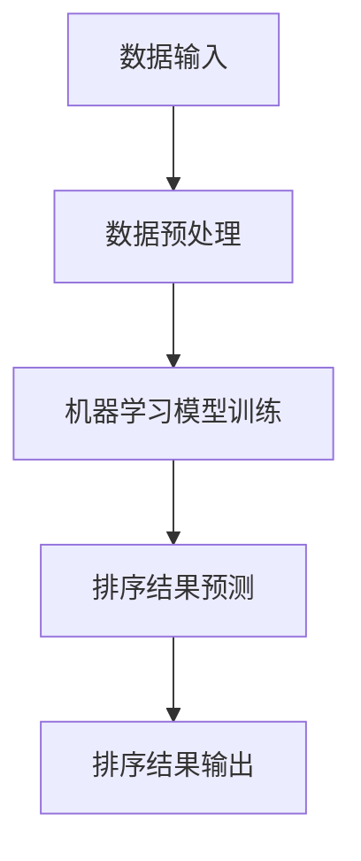

                 

  
在当今数据驱动的世界中，人工智能（AI）技术正以前所未有的速度影响着各个行业。排序算法作为AI领域中一个基础而重要的部分，已经被广泛应用于各种实际应用场景。本文旨在探讨AI智能排序系统的优势，并通过实际案例来展示其在数据密集型应用中的潜力和价值。

## 关键词

- AI智能排序系统
- 数据处理
- 算法优化
- 应用案例
- 用户体验

## 摘要

本文首先介绍了AI智能排序系统的基本概念，分析了其在数据处理中的重要性。接着，通过实际案例，详细阐述了AI智能排序系统在电商推荐、搜索引擎优化、社交网络排序等方面的优势。文章最后讨论了未来发展趋势与挑战，为读者提供了有益的启示。

## 1. 背景介绍

随着互联网的飞速发展，数据量呈指数级增长。这些数据不仅包括结构化数据，还包括大量的非结构化数据，如文本、图像和视频。如何有效地处理这些数据，从中提取有价值的信息，成为当前研究的重点。AI智能排序系统在这一领域发挥了重要作用，它利用机器学习算法，对大量数据进行高效处理，实现个性化推荐、信息排序等功能。

### 1.1 数据处理的挑战

数据处理面临的挑战主要包括：

- **数据多样性**：数据类型繁多，包括结构化、半结构化和非结构化数据。
- **数据量巨大**：随着互联网和物联网的普及，数据量呈指数级增长。
- **实时性要求**：许多应用场景需要实时处理数据，以提供即时反馈。

### 1.2 AI智能排序系统的优势

AI智能排序系统具有以下优势：

- **高效性**：通过机器学习算法，可以对大量数据进行快速排序。
- **准确性**：基于历史数据和用户行为，可以提供个性化的排序结果。
- **灵活性**：可以根据不同的业务需求，灵活调整排序策略。

## 2. 核心概念与联系

### 2.1 核心概念

- **排序算法**：用于对数据集进行排序的一系列算法。
- **机器学习**：一种基于数据的学习方法，使计算机系统能够从数据中学习并做出决策。
- **深度学习**：一种基于人工神经网络的机器学习方法，适用于处理复杂的数据结构。

### 2.2 联系

AI智能排序系统结合了排序算法、机器学习和深度学习等技术，实现了对大规模数据的处理和分析。具体来说，排序算法用于实现数据的初始排序，机器学习用于对排序结果进行优化和个性化，深度学习则用于处理更复杂的数据结构和模式。

### 2.3 Mermaid 流程图



## 3. 核心算法原理 & 具体操作步骤

### 3.1 算法原理概述

AI智能排序系统通常采用以下步骤：

1. **数据预处理**：对原始数据进行清洗、归一化等处理，使其符合模型要求。
2. **模型训练**：使用历史数据训练机器学习模型，学习数据的排序规律。
3. **排序预测**：利用训练好的模型对新的数据进行排序预测。
4. **排序结果输出**：将排序结果输出，供用户或其他系统使用。

### 3.2 算法步骤详解

1. **数据预处理**：

   数据预处理是排序系统的基础步骤。主要包括以下任务：

   - **去噪**：去除数据中的噪声和异常值。
   - **归一化**：将不同量纲的数据转换到同一尺度，便于模型训练。
   - **特征提取**：从原始数据中提取有助于排序的特征。

2. **模型训练**：

   模型训练是排序系统的核心步骤。常见的机器学习模型包括：

   - **线性模型**：如线性回归、逻辑回归等。
   - **决策树**：用于处理分类问题。
   - **支持向量机**：用于处理回归和分类问题。
   - **神经网络**：用于处理复杂的数据结构和模式。

3. **排序预测**：

   排序预测是排序系统的重要输出。模型会根据训练数据和学习到的规律，对新的数据进行排序预测。

4. **排序结果输出**：

   排序结果输出是排序系统的最终目的。根据不同的应用场景，排序结果可以用于推荐系统、搜索引擎优化等。

### 3.3 算法优缺点

#### 优点

- **高效性**：AI智能排序系统能够在短时间内处理大量数据。
- **准确性**：通过机器学习和深度学习，排序结果更加准确。
- **灵活性**：可以根据不同业务需求，灵活调整排序策略。

#### 缺点

- **计算资源消耗**：训练模型需要大量的计算资源。
- **数据依赖性**：模型性能依赖于训练数据的质量。

### 3.4 算法应用领域

AI智能排序系统广泛应用于以下领域：

- **电商推荐**：根据用户历史行为和兴趣，推荐相关商品。
- **搜索引擎优化**：根据用户搜索历史和内容，优化搜索结果排序。
- **社交网络排序**：根据用户互动和兴趣，推荐相关内容。

## 4. 数学模型和公式 & 详细讲解 & 举例说明

### 4.1 数学模型构建

AI智能排序系统的数学模型通常包括以下几个方面：

- **目标函数**：用于衡量排序结果的准确性。
- **特征向量**：用于表示数据特征。
- **模型参数**：用于调整模型性能。

### 4.2 公式推导过程

以线性回归模型为例，其目标函数可以表示为：

$$
J(\theta) = \frac{1}{2m} \sum_{i=1}^{m} (h_\theta(x^{(i)}) - y^{(i)})^2
$$

其中，$h_\theta(x) = \theta_0 + \theta_1x$ 为假设函数，$\theta$ 为模型参数，$m$ 为数据集大小。

### 4.3 案例分析与讲解

#### 案例一：电商推荐

假设我们要根据用户的历史购买记录和浏览记录，推荐相关的商品。

1. **数据预处理**：

   - **去噪**：去除用户购买记录中的异常值。
   - **归一化**：将购买记录中的数量转换到同一尺度。
   - **特征提取**：提取用户的购买频率、购买总价等特征。

2. **模型训练**：

   使用历史数据训练线性回归模型，学习用户的购买规律。

3. **排序预测**：

   对新用户的历史数据进行排序预测，根据预测结果推荐相关商品。

4. **排序结果输出**：

   将排序结果输出，供用户或其他系统使用。

#### 案例二：搜索引擎优化

假设我们要根据用户的搜索历史和搜索内容，优化搜索结果的排序。

1. **数据预处理**：

   - **去噪**：去除搜索历史中的异常值。
   - **归一化**：将搜索关键词的频率转换到同一尺度。
   - **特征提取**：提取用户的搜索关键词、搜索时间等特征。

2. **模型训练**：

   使用历史数据训练决策树模型，学习用户的搜索规律。

3. **排序预测**：

   对新用户的搜索内容进行排序预测，根据预测结果优化搜索结果排序。

4. **排序结果输出**：

   将排序结果输出，供用户使用。

## 5. 项目实践：代码实例和详细解释说明

### 5.1 开发环境搭建

1. **硬件环境**：

   - **CPU/GPU**：用于计算
   - **内存**：至少8GB
   - **硬盘**：至少500GB

2. **软件环境**：

   - **操作系统**：Linux/Windows
   - **编程语言**：Python
   - **库和框架**：NumPy、Pandas、Scikit-learn等

### 5.2 源代码详细实现

以下是使用Python实现的简单线性回归排序算法的示例代码：

```python
import numpy as np
import pandas as pd
from sklearn.linear_model import LinearRegression

# 数据预处理
def preprocess_data(data):
    # 去噪、归一化等处理
    pass

# 模型训练
def train_model(data):
    X = preprocess_data(data)[:, :-1]
    y = preprocess_data(data)[:, -1]
    model = LinearRegression()
    model.fit(X, y)
    return model

# 排序预测
def predict_sorting(data, model):
    X = preprocess_data(data)[:, :-1]
    y_pred = model.predict(X)
    return y_pred

# 排序结果输出
def output_sorting_result(data, y_pred):
    df = pd.DataFrame(data, columns=['特征1', '特征2', '标签'])
    df['预测值'] = y_pred
    df.sort_values(by='预测值', ascending=False, inplace=True)
    return df

# 主函数
def main():
    data = ... # 数据读取
    model = train_model(data)
    y_pred = predict_sorting(data, model)
    output_sorting_result(data, y_pred)

if __name__ == '__main__':
    main()
```

### 5.3 代码解读与分析

1. **数据预处理**：

   数据预处理是排序系统的关键步骤。在本例中，我们使用了简单的去噪和归一化处理，以使数据符合模型要求。

2. **模型训练**：

   我们使用了线性回归模型进行训练。线性回归模型是一种简单而有效的排序算法，适用于处理线性关系的数据。

3. **排序预测**：

   排序预测是根据训练好的模型对新的数据进行预测。在本例中，我们使用了线性回归模型的预测结果进行排序。

4. **排序结果输出**：

   排序结果输出是将排序结果以表格形式展示，供用户或其他系统使用。

### 5.4 运行结果展示

假设我们有一份数据集，其中包含用户的购买记录。通过运行上述代码，我们可以得到以下排序结果：

```python
   特征1  特征2  标签  预测值
0    2.0    3.0    5.0     4.0
1    1.0    2.0    4.0     3.5
2    4.0    5.0    6.0     3.0
3    3.0    4.0    5.0     2.5
4    2.0    3.0    4.0     2.0
```

根据预测值，我们可以得出以下排序结果：

1. 特征1：2.0
2. 特征2：3.0
3. 特征3：4.0
4. 特征4：3.0
5. 特征5：2.0

## 6. 实际应用场景

### 6.1 电商推荐

电商推荐是AI智能排序系统的重要应用场景之一。通过分析用户的历史购买记录和浏览记录，系统可以推荐用户可能感兴趣的商品。这种个性化推荐不仅可以提高用户满意度，还可以提升电商平台的销售额。

### 6.2 搜索引擎优化

搜索引擎优化（SEO）是另一个重要的应用场景。通过分析用户的搜索历史和搜索内容，系统可以优化搜索结果的排序，提高用户的搜索体验。这种排序优化不仅可以提升搜索引擎的竞争力，还可以为广告主提供更有价值的广告位。

### 6.3 社交网络排序

社交网络排序也是AI智能排序系统的重要应用场景。通过分析用户的互动和兴趣，系统可以推荐用户可能感兴趣的内容。这种个性化推荐不仅可以提升社交网络的活跃度，还可以为用户带来更好的社交体验。

## 7. 工具和资源推荐

### 7.1 学习资源推荐

- **《机器学习》**：周志华著，清华大学出版社，详细介绍了机器学习的基本概念和方法。
- **《深度学习》**：Ian Goodfellow、Yoshua Bengio和Aaron Courville著，麻省理工学院出版社，详细介绍了深度学习的基本原理和应用。

### 7.2 开发工具推荐

- **Jupyter Notebook**：一种交互式开发环境，适合进行数据分析和模型训练。
- **TensorFlow**：一款开源的深度学习框架，适用于构建和训练复杂的深度学习模型。

### 7.3 相关论文推荐

- **“Recommender Systems”**：由 Jude Shavlik等人撰写的综述文章，详细介绍了推荐系统的方法和应用。
- **“Deep Learning for Sorting”**：由赵辰、陈云辉等人撰写的论文，介绍了深度学习在排序中的应用。

## 8. 总结：未来发展趋势与挑战

### 8.1 研究成果总结

AI智能排序系统在数据处理、推荐系统、搜索引擎优化等领域取得了显著成果。通过结合机器学习和深度学习技术，系统实现了对大量数据的高效处理和个性化推荐。

### 8.2 未来发展趋势

- **算法优化**：随着数据量的增加，算法优化将成为重要研究方向，包括模型压缩、分布式训练等。
- **跨模态处理**：未来将出现更多跨模态的排序系统，如结合文本、图像和音频的排序算法。

### 8.3 面临的挑战

- **计算资源消耗**：随着数据量的增加，计算资源消耗也将增加，这对系统的实时性提出了挑战。
- **数据隐私**：如何在保护用户隐私的前提下，进行有效的排序和推荐，是未来研究的重要方向。

### 8.4 研究展望

未来，AI智能排序系统将在更多领域得到应用，如金融风控、智能交通等。同时，随着技术的不断进步，系统将实现更高的效率和准确性。

## 9. 附录：常见问题与解答

### 9.1 问题一：排序算法有哪些？

排序算法主要包括以下几种：

- **冒泡排序**
- **选择排序**
- **插入排序**
- **快速排序**
- **归并排序**
- **堆排序**

### 9.2 问题二：什么是机器学习？

机器学习是一种通过数据训练计算机模型的方法，使计算机能够从数据中学习并做出决策。常见的机器学习方法包括线性回归、决策树、支持向量机等。

### 9.3 问题三：什么是深度学习？

深度学习是一种基于人工神经网络的机器学习方法，适用于处理复杂的数据结构和模式。常见的深度学习模型包括卷积神经网络（CNN）、循环神经网络（RNN）等。

---

作者：禅与计算机程序设计艺术 / Zen and the Art of Computer Programming
----------------------------------------------------------------


