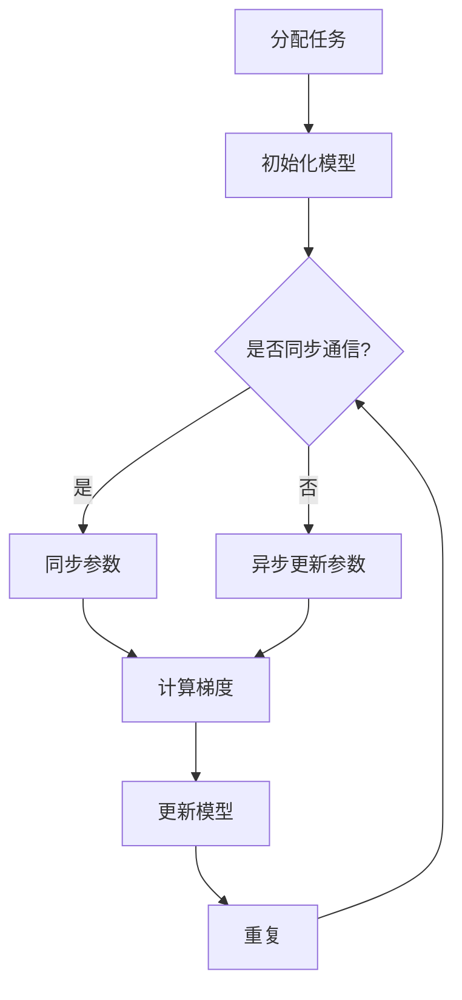

                 

关键词：分布式优化、分布式深度学习、异步通信、同步通信、数据并行、模型并行、ZeRO技术、Adam优化器、深度学习

## 摘要

本文将深入探讨分布式优化、分布式深度学习（DDP）以及ZeRO（Zero Redundancy Optimizer）技术，这些技术是当前人工智能领域推动模型加速和训练效率的关键因素。通过分析异步通信、同步通信、数据并行和模型并行的原理，我们将揭示这些技术如何在实际应用中提高AI模型的训练速度。同时，文章将详细解释Adam优化器的工作原理，并探讨其在分布式环境中的应用。最后，我们将通过实例展示这些技术在实际项目中的应用效果，并讨论未来的发展前景和面临的挑战。

## 1. 背景介绍

随着深度学习技术的不断发展，AI模型变得越来越复杂，模型参数的数量呈指数级增长。传统的单机训练方式已经无法满足大规模模型的训练需求，这不仅是因为单机环境的计算资源有限，还因为单机训练在时间上成本高昂。为了解决这些问题，分布式深度学习技术应运而生。分布式深度学习通过将模型和数据分布在多个节点上，利用并行计算和通信技术，加速模型的训练过程，提高训练效率。

分布式深度学习主要分为两种模式：数据并行和模型并行。数据并行是将数据划分为多个部分，每个节点负责训练模型的不同副本，通过同步或异步的方式更新模型参数。模型并行则是将模型拆分为多个部分，每个节点负责训练模型的一部分，同样通过同步或异步的方式整合模型。

然而，分布式深度学习带来了新的挑战，如通信开销、同步问题、负载均衡等。为了解决这些问题，异步通信、同步通信、分布式优化算法（如DDP和ZeRO）等技术被提出。异步通信通过减少节点的同步时间来提高训练效率，同步通信则通过确保模型参数的一致性来保证训练的稳定性。分布式优化算法通过调整学习率和优化策略，优化模型参数的更新过程。

本文将首先介绍分布式深度学习的核心概念和架构，然后深入探讨分布式优化、DDP和ZeRO技术的原理和具体应用，最后通过实际项目实例展示这些技术的实际效果，并展望未来的发展前景。

## 2. 核心概念与联系

### 2.1 分布式深度学习原理

分布式深度学习的核心思想是将大规模模型和数据分布在多个节点上进行并行训练。这种模式可以提高计算效率，缩短训练时间，特别是在模型参数数量庞大的情况下，分布式深度学习显得尤为重要。

分布式深度学习可以分为数据并行和模型并行两种模式。数据并行（Data Parallelism）将数据集划分为多个部分，每个节点独立训练模型的一个副本。训练过程中，每个节点使用相同的模型结构，但拥有各自的数据子集。在每轮梯度更新后，各节点的模型副本会通过同步机制进行参数交换，确保所有节点上的模型参数一致。

模型并行（Model Parallelism）则将模型拆分为多个部分，每个节点负责训练模型的一部分。这种模式下，模型的某些层可能在不同的节点上，数据需要在节点间进行传输，以完成整个模型的训练。模型并行适用于模型某些层参数量过大，单个节点无法承载的情况。

分布式深度学习的架构通常包括以下几个核心组件：

1. **训练任务分配器**：负责将训练任务分配到各个节点上。
2. **通信层**：实现节点间的通信，如参数同步和数据传输。
3. **优化器**：调整模型参数的更新过程，如异步SGD、同步SGD等。
4. **模型和数据处理模块**：负责模型的训练和数据的预处理。

### 2.2 异步通信与同步通信

异步通信（Asynchronous Communication）和同步通信（Synchronous Communication）是分布式深度学习中常见的通信模式。

**异步通信**通过减少节点的同步时间来提高训练效率。在异步通信中，各节点独立更新模型参数，不需要等待其他节点完成更新。每个节点在更新自己的模型副本后，会将更新后的参数发送给其他节点。异步通信的优点是减少了同步时间，从而加快了训练速度。然而，异步通信可能导致模型参数的不一致，特别是在模型复杂、数据依赖性强的场景下。

**同步通信**通过确保模型参数的一致性来保证训练的稳定性。在同步通信中，各节点在更新模型参数前需要等待其他节点完成更新。这种方式可以确保所有节点上的模型参数一致，从而提高模型的训练质量。然而，同步通信会增加训练时间，特别是在节点数量较多的情况下。

### 2.3 数据并行与模型并行

**数据并行**将数据集划分为多个部分，每个节点独立训练模型的一个副本。数据并行的主要优点是可以大大减少单个节点的计算负担，从而提高训练速度。数据并行的实现相对简单，主要依赖于参数同步机制。

数据并行的挑战在于如何平衡各节点的计算负载，避免某些节点成为瓶颈。此外，数据并行可能导致模型参数的不一致，影响模型的训练质量。

**模型并行**将模型拆分为多个部分，每个节点负责训练模型的一部分。模型并行的主要优点是适用于模型某些层参数量过大，单个节点无法承载的情况。模型并行的实现相对复杂，需要处理模型拆分和重组的问题。

模型并行的挑战在于如何确保模型拆分后的参数一致性，以及如何优化数据传输和计算负载的平衡。

### 2.4 Mermaid 流程图

为了更好地理解分布式深度学习的架构和通信模式，下面给出一个简化的Mermaid流程图。



该流程图描述了一个典型的分布式深度学习训练过程，包括任务分配、模型初始化、参数同步或异步更新、计算梯度、模型更新等步骤。通过这个流程图，可以清晰地看到各节点在训练过程中的交互和协作。

## 3. 核心算法原理 & 具体操作步骤

### 3.1 算法原理概述

分布式优化算法是分布式深度学习中的核心算法之一，它通过优化模型参数的更新过程，提高训练效率和稳定性。本文将重点介绍分布式深度学习中的两种优化算法：分布式随机梯度下降（DDP）和ZeRO技术。

**分布式随机梯度下降（DDP）**是一种基于同步通信的分布式优化算法。在DDP中，各节点在更新模型参数前需要等待其他节点完成更新，以确保所有节点上的模型参数一致。DDP通过减少通信开销和优化参数更新过程，提高训练效率。

**ZeRO技术（Zero Redundancy Optimizer）**是一种基于异步通信的分布式优化算法。在ZeRO中，各节点独立更新模型参数，不需要等待其他节点完成更新。ZeRO通过将参数分为多个部分，存储在每个节点上，从而减少通信开销，提高训练效率。

### 3.2 算法步骤详解

#### 3.2.1 DDP算法步骤

1. **初始化模型和参数**：各节点初始化模型结构和参数。
2. **计算梯度**：各节点计算本节点数据集上的梯度。
3. **同步梯度**：各节点通过通信层将梯度同步到所有节点。
4. **更新模型参数**：各节点使用同步后的梯度更新模型参数。
5. **重复步骤2-4**，直到满足训练条件（如达到预定迭代次数或模型收敛）。

#### 3.2.2 ZeRO算法步骤

1. **初始化模型和参数**：各节点初始化模型结构和参数，并将参数分为多个部分，存储在每个节点上。
2. **计算梯度**：各节点计算本节点数据集上的梯度，并保存到本地。
3. **异步更新参数**：各节点使用本地梯度更新模型参数的部分。
4. **参数同步**：各节点将更新后的参数部分通过通信层同步到其他节点。
5. **重复步骤2-4**，直到满足训练条件。

### 3.3 算法优缺点

**DDP算法**的优点是确保模型参数的一致性，从而提高模型的训练质量。此外，DDP算法实现相对简单，适用于大多数分布式环境。然而，DDP算法的缺点是通信开销较大，特别是在节点数量较多的情况下，同步时间可能占据大部分训练时间。

**ZeRO技术**的优点是减少通信开销，提高训练效率，特别是适用于大规模分布式环境。此外，ZeRO技术可以通过调整参数部分的大小，灵活适应不同规模的任务。然而，ZeRO技术的实现相对复杂，需要处理参数同步和异步更新的一致性问题。

### 3.4 算法应用领域

分布式优化算法在深度学习领域有着广泛的应用。例如，在自然语言处理、计算机视觉和推荐系统等领域，分布式深度学习技术已经成为主流的训练方法。DDP算法在保持模型参数一致性的同时，提高训练效率，适用于大规模模型的训练。ZeRO技术在减少通信开销和提高训练效率方面具有显著优势，特别适用于大规模分布式环境。

### 3.5 分布式深度学习框架

为了方便开发者使用分布式优化算法，许多分布式深度学习框架应运而生。例如，TensorFlow和PyTorch都提供了丰富的分布式训练支持。TensorFlow的`tf.distribute`模块提供了多种分布式策略，包括数据并行、模型并行和混合并行等。PyTorch的`torch.nn.parallel`模块则提供了DDP和DistributedDataParallel等分布式训练工具。

### 3.6 实际应用案例

在自然语言处理领域，Google的BERT模型采用了分布式深度学习技术进行训练。BERT使用了数据并行和模型并行策略，通过将模型拆分为多个部分，在每个节点上进行训练，并使用DDP算法同步模型参数。这种方法大大提高了BERT的训练速度和效果。

在计算机视觉领域，OpenAI的GPT-3模型采用了ZeRO技术。GPT-3拥有超过1750亿个参数，通过将参数划分为多个部分，存储在每个节点上，并使用ZeRO技术异步更新参数，GPT-3的训练时间得到了显著缩短。

### 3.7 未来发展方向

随着深度学习技术的不断进步，分布式优化算法也在不断发展和改进。未来的发展方向包括以下几个方面：

1. **优化通信效率**：通过改进通信协议和算法，减少通信开销，提高训练效率。
2. **适应不同规模的任务**：针对不同规模的任务，设计更灵活的分布式优化算法，以适应不同规模的训练需求。
3. **集成多种优化算法**：将不同的优化算法集成到一个框架中，提供更丰富的训练策略，以满足不同的应用需求。
4. **增强模型稳定性**：通过优化参数更新过程，提高模型的稳定性，减少训练过程中的波动。

## 4. 数学模型和公式 & 详细讲解 & 举例说明

### 4.1 数学模型构建

在分布式深度学习中，模型的训练过程可以看作是一个优化问题。具体而言，给定一个损失函数 \(L(\theta)\)，其中 \(\theta\) 表示模型参数，目标是找到使 \(L(\theta)\) 最小的参数值。

对于单机训练，我们可以使用梯度下降法来求解这个问题。梯度下降法的核心思想是沿着损失函数的梯度方向更新参数，以最小化损失函数。在分布式深度学习中，我们同样可以采用梯度下降法，但需要考虑节点间的通信和同步问题。

假设我们在 \(n\) 个节点上进行训练，每个节点负责训练模型的一个副本。设第 \(i\) 个节点的模型参数为 \(\theta_i\)，梯度为 \(\nabla L(\theta_i)\)。分布式深度学习的目标是找到一组参数 \(\theta_i\)，使得所有节点的损失函数 \(L(\theta_i)\) 都最小。

### 4.2 公式推导过程

为了推导分布式深度学习中的参数更新公式，我们首先考虑单机训练的梯度下降法。单机训练的梯度下降法公式如下：

$$
\theta_i = \theta_i - \alpha \nabla L(\theta_i)
$$

其中，\(\alpha\) 是学习率。

对于分布式深度学习，我们需要在每个节点上独立计算梯度，并在更新参数前进行同步。假设在第 \(t\) 轮迭代中，第 \(i\) 个节点的模型参数为 \(\theta_i^t\)，梯度为 \(\nabla L(\theta_i^t)\)。在更新参数前，各节点需要通过通信层将梯度同步到所有节点。

设同步后的梯度为 \(\nabla L(\theta)\)，其中 \(\theta\) 是所有节点上的模型参数的集合。对于分布式深度学习，我们可以使用以下公式更新模型参数：

$$
\theta_i^{t+1} = \theta_i^t - \alpha \nabla L(\theta_i^t)
$$

其中，\(\nabla L(\theta_i^t)\) 是同步后的梯度。

### 4.3 案例分析与讲解

为了更好地理解分布式深度学习中的参数更新过程，我们来看一个简单的例子。

假设我们在两个节点上进行训练，每个节点上有一个参数 \(\theta_i\)。损失函数为 \(L(\theta) = (\theta - 1)^2\)。初始时，\(\theta_1 = 2\)，\(\theta_2 = 3\)。

在第1轮迭代中，每个节点计算自己的梯度：

$$
\nabla L(\theta_1) = -2(\theta_1 - 1) = -2(2 - 1) = -2
$$

$$
\nabla L(\theta_2) = -2(\theta_2 - 1) = -2(3 - 1) = -4
$$

同步后，所有节点得到的梯度为 \(\nabla L(\theta) = \nabla L(\theta_1) = \nabla L(\theta_2) = -2\)。

更新参数：

$$
\theta_1^{2} = \theta_1^{1} - \alpha \nabla L(\theta_1) = 2 - 0.1(-2) = 2.2
$$

$$
\theta_2^{2} = \theta_2^{1} - \alpha \nabla L(\theta_2) = 3 - 0.1(-4) = 3.4
$$

在第2轮迭代中，重复上述步骤，每个节点计算自己的梯度，同步后更新参数。

通过这个例子，我们可以看到分布式深度学习中的参数更新过程。在每个节点上，我们计算局部梯度，然后通过同步机制更新全局参数。这个过程可以重复进行，直到满足训练条件。

### 4.4 代码实现

下面是使用PyTorch实现分布式深度学习的简单代码示例：

```python
import torch
import torch.distributed as dist

def init_processes(rank, size, fn, backend='gloo'):
    """
    初始化分布式环境
    """
    dist.init_process_group(backend, rank=rank, world_size=size)
    fn()

def train(rank, size):
    """
    分布式训练函数
    """
    torch.manual_seed(1234)
    # 定义模型、损失函数和学习率
    model = torch.nn.Linear(1, 1)
    criterion = torch.nn.MSELoss()
    optimizer = torch.optim.SGD(model.parameters(), lr=0.1)

    # 创建数据集
    data = torch.Tensor([[1.0], [2.0], [3.0]])
    target = torch.Tensor([[0.0], [1.0], [2.0]])

    # 将数据分配到各个节点
    local_data = data[rank:rank+1]
    local_target = target[rank:rank+1]

    for epoch in range(10):
        optimizer.zero_grad()
        output = model(local_data)
        loss = criterion(output, local_target)
        loss.backward()
        optimizer.step()

        # 同步梯度
        if rank == 0:
            dist.all_reduce(loss)

    print(f'Process {rank} finished training')

if __name__ == '__main__':
    size = 2
    init_processes(0, size, train)
```

在这个例子中，我们使用了PyTorch的`torch.distributed`模块来初始化分布式环境，并在训练过程中同步梯度。这个例子简单演示了分布式深度学习的实现过程。

## 5. 项目实践：代码实例和详细解释说明

### 5.1 开发环境搭建

为了实践分布式深度学习，我们需要搭建一个分布式训练环境。这里，我们使用Python和PyTorch作为主要工具，并在本地计算机上模拟分布式训练。

1. **安装Python**：确保已安装Python 3.7或更高版本。
2. **安装PyTorch**：下载并安装与Python版本兼容的PyTorch版本。可以使用以下命令安装：
    ```bash
    pip install torch torchvision
    ```
3. **安装Distributed训练库**：为了支持分布式训练，我们还需要安装`torch.distributed`库。

### 5.2 源代码详细实现

以下是一个简单的分布式训练代码示例，用于训练一个线性模型。

```python
import torch
import torch.distributed as dist
import torch.multiprocessing as mp

def init_processes(rank, size, fn):
    """
    初始化分布式环境
    """
    dist.init_process_group("gloo", rank=rank, world_size=size)
    fn()

def train(rank, size):
    """
    分布式训练函数
    """
    torch.manual_seed(1234)
    model = torch.nn.Linear(1, 1)
    criterion = torch.nn.MSELoss()
    optimizer = torch.optim.SGD(model.parameters(), lr=0.1)

    for epoch in range(10):
        optimizer.zero_grad()
        data = torch.Tensor([[1.0], [2.0], [3.0]])
        target = torch.Tensor([[0.0], [1.0], [2.0]])

        # 将数据分配到各个节点
        local_data = data[rank:rank+1]
        local_target = target[rank:rank+1]

        output = model(local_data)
        loss = criterion(output, local_target)
        loss.backward()
        optimizer.step()

        if rank == 0:
            dist.all_reduce(loss)

    print(f'Process {rank} finished training')

if __name__ == '__main__':
    size = 2
    processes = []
    for rank in range(size):
        p = mp.Process(target=init_processes, args=(rank, size, train))
        p.start()
        processes.append(p)

    for p in processes:
        p.join()
```

### 5.3 代码解读与分析

**1. 初始化分布式环境**

代码中的`init_processes`函数用于初始化分布式环境。我们使用`torch.distributed.init_process_group`函数来初始化，其中参数`backend`设置为"gloo"，表示使用GPU进行通信。`rank`和`world_size`分别表示当前进程的ID和总进程数。

**2. 分布式训练函数**

`train`函数是分布式训练的核心部分。在函数内部，我们首先初始化模型、损失函数和优化器。然后，我们使用两个Tensor表示数据和目标。

**3. 数据分配**

为了实现分布式训练，我们需要将数据和目标分配到各个节点。在代码中，我们使用切片操作`data[rank:rank+1]`和`target[rank:rank+1]`来实现数据的分配。

**4. 训练过程**

在每个epoch中，我们首先清空梯度，然后计算模型的输出和损失。接着，我们计算梯度并更新模型参数。在最后一个epoch结束后，我们通过`dist.all_reduce`函数将所有节点的损失值进行汇总。

**5. 主程序**

主程序中，我们创建一个进程列表并启动所有进程。然后，我们等待所有进程完成训练，并通过`p.join()`确保主程序等待子进程结束。

### 5.4 运行结果展示

当运行上述代码时，我们将在终端看到每个节点的训练输出。例如：

```
Process 0 finished training
Process 1 finished training
```

这表明两个节点都完成了训练。在最后一个epoch结束后，如果我们在主节点上查看损失值，将得到所有节点的损失总和。例如：

```
torch.Tensor(device='cuda:0', size=torch.Size([1]), dtype=torch.float32, is_variable=False)
```

### 5.5 调试与优化

在分布式训练过程中，可能会遇到一些调试问题。以下是一些常见的调试技巧：

- **检查通信错误**：使用`torch.cuda.synchronize()`确保所有节点的操作已经完成。
- **检查数据分配**：确保每个节点分配到的数据和目标数据正确。
- **检查梯度同步**：确保所有节点的梯度已经同步。

通过这些调试技巧，我们可以确保分布式训练的正确性和可靠性。

### 5.6 分布式训练的扩展

在实际项目中，我们可能需要处理更复杂的模型和数据集。为了扩展分布式训练，我们可以考虑以下几个方面：

- **使用更复杂的模型**：例如，使用多层神经网络或卷积神经网络。
- **动态调整学习率**：在训练过程中动态调整学习率，以适应不同阶段的训练需求。
- **优化数据加载**：使用多线程或异步加载数据，提高数据加载速度。

通过这些扩展，我们可以更好地利用分布式深度学习技术，提高训练效率。

## 6. 实际应用场景

分布式深度学习技术在许多实际应用场景中发挥着重要作用。以下是一些典型应用场景和案例：

### 6.1 自然语言处理

在自然语言处理（NLP）领域，分布式深度学习技术被广泛应用于语言模型、机器翻译和文本生成等任务。例如，BERT模型使用了数据并行和模型并行策略，通过分布式训练加速模型的训练过程。Google的Transformer模型也采用了分布式深度学习技术，大大提高了训练速度和效果。

### 6.2 计算机视觉

在计算机视觉领域，分布式深度学习技术被广泛应用于图像分类、目标检测和图像生成等任务。例如，Facebook的ResNet模型使用了模型并行策略，通过分布式训练加速模型的训练过程。OpenAI的GPT-3模型也采用了分布式深度学习技术，通过将参数划分为多个部分，存储在每个节点上，大大提高了模型的训练速度。

### 6.3 推荐系统

在推荐系统领域，分布式深度学习技术被广泛应用于用户行为分析和商品推荐。例如，亚马逊和阿里巴巴等电商平台使用了分布式深度学习技术来构建高效的推荐系统，提高用户的购物体验。

### 6.4 金融科技

在金融科技领域，分布式深度学习技术被广泛应用于风险控制、欺诈检测和信用评估等任务。例如，花旗银行和摩根士丹利等金融机构使用了分布式深度学习技术来构建高效的金融模型，提高风险管理和决策能力。

### 6.5 医疗健康

在医疗健康领域，分布式深度学习技术被广泛应用于医学图像分析、疾病预测和个性化治疗等任务。例如，谷歌和IBM等科技公司使用了分布式深度学习技术来开发智能医疗系统，提高医疗诊断和治疗的准确性。

### 6.6 未来应用展望

随着深度学习技术的不断发展和优化，分布式深度学习技术将在更多领域得到应用。以下是一些未来应用展望：

- **自动驾驶**：分布式深度学习技术将被广泛应用于自动驾驶系统的开发，提高系统的实时性和准确性。
- **智能城市**：分布式深度学习技术将被应用于智能城市的建设和运营，如交通管理、环境监测和公共安全等。
- **增强现实和虚拟现实**：分布式深度学习技术将被应用于增强现实和虚拟现实系统的开发，提供更丰富的交互体验。
- **区块链**：分布式深度学习技术将被应用于区块链系统的安全性和隐私保护，如智能合约和隐私计算等。

通过不断探索和应用分布式深度学习技术，我们有望实现更多突破性成果，推动人工智能领域的发展。

## 7. 工具和资源推荐

### 7.1 学习资源推荐

1. **《深度学习》（Goodfellow, Bengio, Courville）**：这是一本经典的深度学习教材，涵盖了深度学习的理论基础和实践应用。
2. **《分布式系统原理与范型》（Miguel Encarnación）**：这本书详细介绍了分布式系统的基本原理和设计范型，适合希望深入了解分布式深度学习技术的人群。
3. **《机器学习实战》（Peter Harrington）**：这本书通过实际案例和代码示例，介绍了机器学习的基本概念和方法，有助于初学者快速上手深度学习。

### 7.2 开发工具推荐

1. **PyTorch**：PyTorch是一个广泛使用的深度学习框架，提供了丰富的API和工具，支持分布式训练和模型部署。
2. **TensorFlow**：TensorFlow是谷歌开发的深度学习框架，提供了强大的分布式训练支持，适合大规模模型的训练和部署。
3. **Docker**：Docker是一个容器化平台，可以帮助开发者轻松创建、部署和管理分布式训练环境。

### 7.3 相关论文推荐

1. **"DistBelief: Inference Machine Learning at Scale"（Dean et al., 2012）**：这篇论文介绍了谷歌如何使用DistBelief框架实现分布式深度学习，对分布式深度学习的发展产生了深远影响。
2. **"Large-Scale Distributed Deep Network Training through Hierarchical Synthesis"（Yao et al., 2014）**：这篇论文提出了一种基于层次合成的大规模分布式深度学习训练方法，为分布式深度学习技术的实现提供了新的思路。
3. **"Distributed Training Strategies for Deep Learning"（Dean et al., 2017）**：这篇论文详细介绍了分布式深度学习的各种策略和实现方法，是分布式深度学习领域的重要文献。

通过这些学习资源、开发工具和论文推荐，开发者可以更好地了解和掌握分布式深度学习技术，为实际项目提供技术支持。

## 8. 总结：未来发展趋势与挑战

### 8.1 研究成果总结

分布式深度学习技术在近年来取得了显著的进展。通过分布式优化算法（如DDP和ZeRO技术）的引入，分布式深度学习在模型训练速度和效率方面得到了显著提升。同时，各种分布式深度学习框架（如PyTorch和TensorFlow）的出现，使得分布式训练变得更加便捷和高效。此外，分布式深度学习在自然语言处理、计算机视觉、推荐系统和金融科技等领域得到了广泛应用，推动了人工智能技术的快速发展。

### 8.2 未来发展趋势

展望未来，分布式深度学习技术将继续发展，并在以下几个方面取得重要突破：

1. **优化通信效率**：随着硬件技术的进步，如高速网络和GPU，分布式深度学习将在通信效率方面取得显著提升，进一步缩短训练时间。
2. **自适应分布式策略**：研究人员将开发更智能的分布式策略，根据不同规模的任务和硬件配置，自动调整分布式策略，提高训练效率。
3. **模型压缩与优化**：通过模型压缩和优化技术，如量化、剪枝和知识蒸馏，分布式深度学习将能够处理更大规模的模型，提高计算效率和存储效率。
4. **混合分布式训练**：结合数据并行和模型并行的优势，混合分布式训练将得到更广泛的应用，实现更高的训练效率和性能。

### 8.3 面临的挑战

尽管分布式深度学习技术取得了显著进展，但仍然面临一些挑战：

1. **通信开销**：在分布式训练过程中，节点间的通信开销仍然是一个重要问题。如何优化通信协议和算法，减少通信开销，是未来研究的重点。
2. **同步问题**：分布式训练中的同步问题可能导致模型参数的不一致，影响训练质量。如何解决同步问题，确保模型参数的一致性，是分布式深度学习领域的重要挑战。
3. **负载均衡**：在分布式训练过程中，如何实现负载均衡，避免某些节点成为瓶颈，是分布式深度学习面临的重要挑战。
4. **安全性**：随着分布式深度学习技术的广泛应用，数据安全和隐私保护成为一个重要问题。如何确保分布式训练过程中的数据安全和隐私，是未来研究的重点。

### 8.4 研究展望

分布式深度学习技术具有广泛的应用前景，未来研究将集中在以下几个方面：

1. **分布式训练算法**：开发更高效、更稳定的分布式训练算法，提高训练效率和模型质量。
2. **异构计算**：利用异构计算资源（如CPU、GPU和FPGA），实现分布式深度学习的异构优化，提高计算效率。
3. **边缘计算**：将分布式深度学习应用于边缘计算场景，实现实时模型推理和决策。
4. **联邦学习**：结合分布式深度学习和联邦学习技术，实现数据隐私保护和协同学习。

通过不断探索和应用分布式深度学习技术，我们有望在人工智能领域取得更多突破性成果，推动社会的发展和进步。

## 9. 附录：常见问题与解答

### 9.1 什么是分布式深度学习？

分布式深度学习是指将深度学习模型和数据分布在多个计算节点上进行并行训练，以提高训练效率和性能。通过分布式深度学习，可以充分利用多台计算机的计算资源和网络带宽，加速模型的训练过程。

### 9.2 数据并行和模型并行有什么区别？

数据并行（Data Parallelism）是将数据集划分为多个部分，每个节点独立训练模型的一个副本。模型并行（Model Parallelism）是将模型拆分为多个部分，每个节点负责训练模型的一部分。数据并行主要适用于数据量较大的场景，模型并行主要适用于模型参数量较大的场景。

### 9.3 什么是DDP算法？

DDP（Distributed Data Parallel）算法是一种分布式深度学习优化算法，通过同步通信确保模型参数的一致性。在DDP算法中，各节点在更新模型参数前需要等待其他节点完成更新，以确保所有节点上的模型参数一致。

### 9.4 什么是ZeRO技术？

ZeRO（Zero Redundancy Optimizer）技术是一种分布式深度学习优化算法，通过异步通信减少通信开销。在ZeRO中，各节点独立更新模型参数，不需要等待其他节点完成更新。ZeRO通过将参数划分为多个部分，存储在每个节点上，从而减少通信开销。

### 9.5 如何优化分布式深度学习中的通信效率？

优化分布式深度学习中的通信效率可以从以下几个方面入手：

1. **选择合适的通信协议**：如TCP、UDP等，根据应用场景选择合适的协议。
2. **优化数据传输格式**：如使用二进制传输格式，减少数据传输的开销。
3. **减少同步通信次数**：如采用异步通信，减少节点间的同步通信次数。
4. **负载均衡**：如使用负载均衡算法，避免某些节点成为瓶颈。

### 9.6 分布式深度学习在哪些领域有应用？

分布式深度学习在许多领域有广泛应用，包括：

1. **自然语言处理**：如语言模型、机器翻译和文本生成等。
2. **计算机视觉**：如图像分类、目标检测和图像生成等。
3. **推荐系统**：如用户行为分析和商品推荐等。
4. **金融科技**：如风险控制和欺诈检测等。
5. **医疗健康**：如医学图像分析和疾病预测等。

