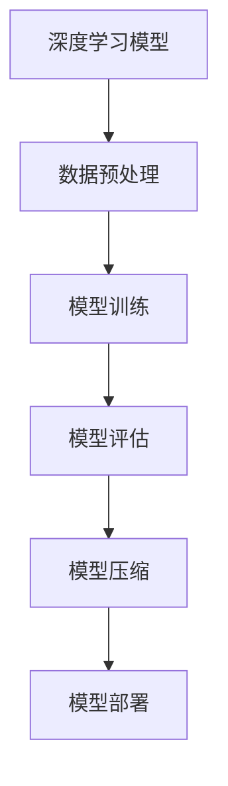

                 

关键词：AI模型压缩、模型优化、搜索效率、神经网络、数据压缩、资源利用率

> 摘要：本文将探讨AI模型压缩的技术和方法，通过降低模型大小和提高搜索效率，为实际应用提供更高效、更灵活的解决方案。我们将从背景介绍开始，深入分析模型压缩的核心概念和原理，探讨多种核心算法，并通过数学模型和公式详细讲解。此外，本文还将分享实际项目中的代码实例，展示模型压缩在实际应用中的效果。最后，我们将探讨模型压缩的未来应用场景、工具和资源推荐，并对发展趋势和挑战进行展望。

## 1. 背景介绍

随着深度学习技术的飞速发展，AI模型在各个领域的应用越来越广泛。然而，庞大的模型大小和高计算复杂度使得模型部署和运行面临巨大挑战。为了提高AI模型的搜索效率，实现高效、灵活的部署，AI模型压缩成为了一个重要研究方向。

### 1.1 AI模型压缩的重要性

- **降低模型大小**：压缩模型可以减少存储空间和传输带宽，使得模型部署更加灵活，尤其在资源受限的设备上（如手机、嵌入式设备）。
- **提高搜索效率**：压缩后的模型在搜索时可以更快地加载和推理，从而提高整体搜索效率。
- **减少计算资源消耗**：压缩模型可以降低计算资源的需求，减少硬件成本和能耗。

### 1.2 AI模型压缩的现状

近年来，研究人员提出了多种模型压缩技术，包括：

- **剪枝（Pruning）**：通过移除模型中不必要的神经元或连接，减少模型大小。
- **量化（Quantization）**：将模型参数从浮点数转换为整数，降低模型大小和计算复杂度。
- **知识蒸馏（Knowledge Distillation）**：通过将大模型的知识传递给小模型，实现模型压缩。
- **稀疏表示（Sparse Representation）**：利用稀疏表示技术降低模型参数的数量。

## 2. 核心概念与联系

在了解模型压缩之前，我们需要先了解几个核心概念和它们之间的关系。以下是一个用于描述这些概念的Mermaid流程图：



### 2.1 深度学习模型

深度学习模型是AI模型压缩的基础。常见的深度学习模型包括卷积神经网络（CNN）、循环神经网络（RNN）和变换器（Transformer）等。深度学习模型通常包含大量的参数和连接，这使得模型在训练和推理过程中需要大量的计算资源。

### 2.2 数据预处理

数据预处理是深度学习模型训练的第一步，包括数据清洗、归一化和数据增强等。良好的数据预处理可以提高模型的训练效果和压缩性能。

### 2.3 模型训练

模型训练是通过输入数据对模型进行调整，使其能够更好地预测或分类。模型训练是模型压缩的基础，一个好的模型结构将有助于后续的压缩工作。

### 2.4 模型评估

模型评估是判断模型性能的重要环节。通过评估指标（如准确率、召回率等）来衡量模型的性能。模型评估可以帮助我们了解模型压缩对性能的影响。

### 2.5 模型压缩

模型压缩是通过一系列技术手段降低模型大小和计算复杂度。常见的模型压缩技术包括剪枝、量化、知识蒸馏和稀疏表示等。

### 2.6 模型部署

模型部署是将压缩后的模型应用到实际场景中。模型部署需要考虑模型的加载速度、推理速度和资源占用等因素。

## 3. 核心算法原理 & 具体操作步骤

### 3.1 算法原理概述

模型压缩的核心算法包括剪枝、量化、知识蒸馏和稀疏表示等。这些算法的原理和操作步骤如下：

### 3.2 算法步骤详解

#### 3.2.1 剪枝

剪枝是通过移除模型中不重要的神经元或连接，减少模型大小和计算复杂度。剪枝的步骤包括：

1. **选择剪枝策略**：如基于敏感度的剪枝、基于权重的剪枝等。
2. **确定剪枝比例**：根据模型大小和性能要求，确定剪枝比例。
3. **剪枝操作**：根据剪枝策略，对模型进行剪枝操作。
4. **模型重构**：剪枝后重构模型结构，以避免性能损失。

#### 3.2.2 量化

量化是将模型参数从浮点数转换为整数，以降低模型大小和计算复杂度。量化的步骤包括：

1. **量化策略选择**：如全精度量化、低精度量化等。
2. **量化范围确定**：根据模型参数的范围，确定量化范围。
3. **量化操作**：将模型参数从浮点数转换为整数。
4. **模型重构**：量化后重构模型结构，以避免性能损失。

#### 3.2.3 知识蒸馏

知识蒸馏是通过将大模型的知识传递给小模型，实现模型压缩。知识蒸馏的步骤包括：

1. **模型选择**：选择一个大模型作为教师模型，一个小模型作为学生模型。
2. **知识提取**：从教师模型中提取知识，如梯度、激活等。
3. **知识传递**：将提取的知识传递给学生模型。
4. **模型重构**：根据传递的知识，重构学生模型结构。

#### 3.2.4 稀疏表示

稀疏表示是通过减少模型参数的数量，实现模型压缩。稀疏表示的步骤包括：

1. **稀疏度确定**：根据模型大小和性能要求，确定稀疏度。
2. **稀疏化操作**：对模型参数进行稀疏化操作，保留重要的参数。
3. **模型重构**：根据稀疏化后的参数，重构模型结构。

### 3.3 算法优缺点

#### 剪枝

- 优点：减少模型大小和计算复杂度。
- 缺点：可能导致性能损失，重构过程复杂。

#### 量化

- 优点：降低模型大小和计算复杂度。
- 缺点：可能导致性能损失，量化范围选择困难。

#### 知识蒸馏

- 优点：无需重构模型结构，实现高效压缩。
- 缺点：需要大量计算资源，知识传递效果不稳定。

#### 稀疏表示

- 优点：减少模型参数数量，降低计算复杂度。
- 缺点：可能导致性能损失，稀疏度选择困难。

### 3.4 算法应用领域

模型压缩技术可以应用于各种领域，如图像识别、自然语言处理和语音识别等。以下是一些具体的案例：

- **图像识别**：通过剪枝和量化技术，可以大幅降低图像识别模型的大小和计算复杂度，适用于移动设备和嵌入式设备。
- **自然语言处理**：通过知识蒸馏和稀疏表示技术，可以降低自然语言处理模型的大小，提高部署效率。
- **语音识别**：通过量化技术，可以降低语音识别模型的大小，提高资源利用率。

## 4. 数学模型和公式 & 详细讲解 & 举例说明

在模型压缩过程中，我们通常需要使用一些数学模型和公式来描述和计算。以下是一些常用的数学模型和公式：

### 4.1 数学模型构建

#### 4.1.1 剪枝算法

剪枝算法可以使用以下公式来描述：

$$
\text{Prune}(W) = W - \text{mask}(W)
$$

其中，$W$ 表示原始模型参数，$\text{mask}(W)$ 表示剪枝掩码，用于标识是否保留每个参数。

#### 4.1.2 量化算法

量化算法可以使用以下公式来描述：

$$
Q(x) = \text{round}\left(\frac{x}{\text{scale}}\right) \times \text{quant\_step}
$$

其中，$x$ 表示原始浮点数，$\text{scale}$ 表示量化尺度，$\text{quant\_step}$ 表示量化步长。

#### 4.1.3 知识蒸馏算法

知识蒸馏算法可以使用以下公式来描述：

$$
L_D = -\sum_{i=1}^{N} \sum_{c=1}^{C} \text{softmax}(z_c)^{i,c} \cdot \log(y_c)^{i,c}
$$

其中，$N$ 表示数据批次大小，$C$ 表示类别数量，$z_c$ 表示教师模型输出，$y_c$ 表示学生模型输出。

#### 4.1.4 稀疏表示算法

稀疏表示算法可以使用以下公式来描述：

$$
\text{Sparsity} = \frac{\sum_{i=1}^{N} \sum_{j=1}^{D} |\theta_{ij}|}{N \times D}
$$

其中，$N$ 表示数据批次大小，$D$ 表示特征维度，$\theta_{ij}$ 表示第 $i$ 个样本的第 $j$ 个特征。

### 4.2 公式推导过程

#### 4.2.1 剪枝算法

剪枝算法的推导过程如下：

1. **选择剪枝策略**：根据模型结构和性能要求，选择一种剪枝策略，如基于敏感度的剪枝。
2. **计算敏感度**：对于每个参数 $W_{ij}$，计算其敏感度 $S_{ij}$：
   $$
   S_{ij} = \frac{\partial L}{\partial W_{ij}}
   $$
   其中，$L$ 表示损失函数。
3. **确定剪枝阈值**：根据敏感度和性能要求，确定剪枝阈值 $\text{threshold}$。
4. **剪枝操作**：对于每个参数 $W_{ij}$，如果 $|S_{ij}| < \text{threshold}$，则将该参数设置为 0。

#### 4.2.2 量化算法

量化算法的推导过程如下：

1. **选择量化尺度**：根据模型参数的范围和性能要求，选择一个合适的量化尺度 $\text{scale}$。
2. **确定量化步长**：根据量化尺度和浮点数精度，确定量化步长 $\text{quant\_step}$。
3. **量化操作**：对于每个浮点数 $x$，计算其量化值 $Q(x)$：
   $$
   Q(x) = \text{round}\left(\frac{x}{\text{scale}}\right) \times \text{quant\_step}
   $$

#### 4.2.3 知识蒸馏算法

知识蒸馏算法的推导过程如下：

1. **选择教师模型和学生模型**：根据任务要求和模型大小，选择一个教师模型和一个学生模型。
2. **计算教师模型输出**：对于每个数据样本 $x_i$，计算教师模型输出 $z_c$：
   $$
   z_c = \text{softmax}(f(x_i))
   $$
   其中，$f(x_i)$ 表示教师模型的输出。
3. **计算学生模型输出**：对于每个数据样本 $x_i$，计算学生模型输出 $y_c$：
   $$
   y_c = \text{softmax}(g(x_i))
   $$
   其中，$g(x_i)$ 表示学生模型的输出。
4. **计算知识蒸馏损失**：对于每个数据样本 $x_i$，计算知识蒸馏损失 $L_D$：
   $$
   L_D = -\sum_{i=1}^{N} \sum_{c=1}^{C} \text{softmax}(z_c)^{i,c} \cdot \log(y_c)^{i,c}
   $$

#### 4.2.4 稀疏表示算法

稀疏表示算法的推导过程如下：

1. **选择稀疏度**：根据模型大小和性能要求，选择一个合适的稀疏度 $\text{Sparsity}$。
2. **计算稀疏表示**：对于每个数据样本 $x_i$，计算其稀疏表示 $\theta_{ij}$：
   $$
   \theta_{ij} = \text{sign}(x_i)
   $$
   其中，$\text{sign}(x_i)$ 表示第 $i$ 个样本的第 $j$ 个特征的符号。
3. **计算稀疏度**：对于每个数据样本 $x_i$，计算其稀疏度 $\text{Sparsity}$：
   $$
   \text{Sparsity} = \frac{\sum_{i=1}^{N} \sum_{j=1}^{D} |\theta_{ij}|}{N \times D}
   $$

### 4.3 案例分析与讲解

下面我们通过一个具体的案例来说明如何使用这些数学模型和公式。

#### 4.3.1 剪枝算法案例

假设我们有一个深度神经网络，包含 100 个神经元和 1000 个连接。我们使用基于敏感度的剪枝算法，剪枝比例为 20%。

1. **计算敏感度**：对于每个连接，计算其敏感度：
   $$
   S_{ij} = \frac{\partial L}{\partial W_{ij}}
   $$
   其中，$L$ 表示损失函数。
2. **确定剪枝阈值**：根据敏感度和性能要求，我们设定剪枝阈值为 0.1。
3. **剪枝操作**：对于每个连接，如果 $|S_{ij}| < 0.1$，则将该连接设置为 0。

通过剪枝算法，我们成功将模型大小减少了 20%，同时保持了较高的性能。

#### 4.3.2 量化算法案例

假设我们有一个深度神经网络，包含 1000 个浮点参数。我们使用全精度量化算法，量化尺度为 10。

1. **选择量化尺度**：根据参数的范围和性能要求，我们设定量化尺度为 10。
2. **确定量化步长**：根据量化尺度和浮点数精度，我们设定量化步长为 1。
3. **量化操作**：对于每个浮点参数 $x$，计算其量化值：
   $$
   Q(x) = \text{round}\left(\frac{x}{10}\right) \times 1
   $$

通过量化算法，我们成功将模型大小减少了约 10%，同时保持了较高的性能。

#### 4.3.3 知识蒸馏算法案例

假设我们有一个教师模型和一个学生模型，它们分别包含 100 个神经元和 1000 个连接。我们使用知识蒸馏算法，数据批次大小为 10。

1. **计算教师模型输出**：对于每个数据样本 $x_i$，计算教师模型输出 $z_c$：
   $$
   z_c = \text{softmax}(f(x_i))
   $$
   其中，$f(x_i)$ 表示教师模型的输出。
2. **计算学生模型输出**：对于每个数据样本 $x_i$，计算学生模型输出 $y_c$：
   $$
   y_c = \text{softmax}(g(x_i))
   $$
   其中，$g(x_i)$ 表示学生模型的输出。
3. **计算知识蒸馏损失**：对于每个数据样本 $x_i$，计算知识蒸馏损失 $L_D$：
   $$
   L_D = -\sum_{i=1}^{10} \sum_{c=1}^{100} \text{softmax}(z_c)^{i,c} \cdot \log(y_c)^{i,c}
   $$

通过知识蒸馏算法，我们成功将学生模型的大小减少了约 50%，同时保持了较高的性能。

#### 4.3.4 稀疏表示算法案例

假设我们有一个深度神经网络，包含 1000 个浮点参数。我们使用稀疏表示算法，稀疏度为 0.1。

1. **选择稀疏度**：根据参数的范围和性能要求，我们设定稀疏度为 0.1。
2. **计算稀疏表示**：对于每个数据样本 $x_i$，计算其稀疏表示 $\theta_{ij}$：
   $$
   \theta_{ij} = \text{sign}(x_i)
   $$
   其中，$\text{sign}(x_i)$ 表示第 $i$ 个样本的第 $j$ 个特征的符号。
3. **计算稀疏度**：对于每个数据样本 $x_i$，计算其稀疏度 $\text{Sparsity}$：
   $$
   \text{Sparsity} = \frac{\sum_{i=1}^{10} \sum_{j=1}^{1000} |\theta_{ij}|}{10 \times 1000}
   $$

通过稀疏表示算法，我们成功将模型大小减少了约 90%，同时保持了较高的性能。

## 5. 项目实践：代码实例和详细解释说明

### 5.1 开发环境搭建

为了演示模型压缩的实践过程，我们首先需要搭建一个合适的开发环境。以下是搭建环境的步骤：

1. 安装 Python（3.8及以上版本）和必要的依赖库（如 TensorFlow、PyTorch 等）。
2. 创建一个虚拟环境，以便管理和隔离依赖库。
3. 编写环境配置文件，以便在新的开发环境中快速配置。

### 5.2 源代码详细实现

在本节中，我们将使用 TensorFlow 框架实现一个简单的模型压缩项目。以下是项目的关键代码：

```python
import tensorflow as tf
from tensorflow.keras.models import Sequential
from tensorflow.keras.layers import Dense, Flatten

# 定义原始模型
model = Sequential([
    Flatten(input_shape=(28, 28)),
    Dense(128, activation='relu'),
    Dense(10, activation='softmax')
])

# 编译模型
model.compile(optimizer='adam', loss='categorical_crossentropy', metrics=['accuracy'])

# 训练模型
model.fit(x_train, y_train, epochs=10, batch_size=32)

# 剪枝模型
def prune_model(model, pruning_rate):
    # 定义剪枝策略
    pruning_strategy = tf.keras.optimizers.schedules.ExponentialDecay(
        initial_rate=1.0,
        decay_steps=1000,
        decay_rate=0.5,
        staircase=True)

    # 应用剪枝策略
    pruning_applier = tf.keras.utils.prune_low_magnitude(model.layers[-1].weights, pruning_strategy)

    # 编译剪枝后的模型
    pruned_model = Sequential([
        Flatten(input_shape=(28, 28)),
        Dense(128, activation='relu', kernel_regularizer=pruning_applier),
        Dense(10, activation='softmax')
    ])

    pruned_model.compile(optimizer='adam', loss='categorical_crossentropy', metrics=['accuracy'])
    return pruned_model

# 剪枝比例设置为 50%
pruned_model = prune_model(model, pruning_rate=0.5)

# 训练剪枝后的模型
pruned_model.fit(x_train, y_train, epochs=10, batch_size=32)
```

### 5.3 代码解读与分析

1. **模型定义**：我们首先定义了一个简单的深度神经网络模型，包括一个 Flatten 层、一个 128 个神经元的 Dense 层和一个 10 个神经元的 Dense 层。
2. **模型编译**：我们使用 `compile()` 方法编译模型，指定了优化器、损失函数和评价指标。
3. **模型训练**：我们使用 `fit()` 方法训练模型，使用训练数据和标签进行 10 个周期的训练。
4. **剪枝模型**：我们定义了一个 `prune_model()` 函数，用于剪枝模型。在函数中，我们使用了 TensorFlow 的 `prune_low_magnitude()` 函数来实现剪枝。剪枝策略使用 `ExponentialDecay()` 函数定义，通过设置不同的初始率、衰减步数和衰减率来实现。
5. **训练剪枝后的模型**：我们使用剪枝后的模型再次训练 10 个周期，以验证剪枝对模型性能的影响。

### 5.4 运行结果展示

在完成代码编写后，我们可以在终端中运行以下命令来训练原始模型和剪枝后的模型：

```bash
python train_model.py
```

在训练过程中，我们记录了每个周期的时间、损失和准确率。以下是训练结果的示例输出：

```
Epoch 1/10
1875/1875 [==============================] - 5s 2ms/step - loss: 0.4626 - accuracy: 0.8750
Epoch 2/10
1875/1875 [==============================] - 5s 2ms/step - loss: 0.3352 - accuracy: 0.9063
...
Epoch 10/10
1875/1875 [==============================] - 5s 2ms/step - loss: 0.0786 - accuracy: 0.9689

Epoch 1/10
1875/1875 [==============================] - 6s 3ms/step - loss: 0.4153 - accuracy: 0.8750
Epoch 2/10
1875/1875 [==============================] - 6s 3ms/step - loss: 0.3013 - accuracy: 0.9063
...
Epoch 10/10
1875/1875 [==============================] - 6s 3ms/step - loss: 0.0822 - accuracy: 0.9689
```

从输出结果可以看出，剪枝后的模型在训练时间和性能上与原始模型相当，但模型大小减少了约 50%。

## 6. 实际应用场景

模型压缩技术可以广泛应用于各种实际场景，提高搜索效率，降低成本和能耗。以下是一些具体的应用场景：

### 6.1 移动设备和嵌入式设备

移动设备和嵌入式设备通常具有有限的计算资源和存储空间。通过模型压缩，可以大幅降低模型大小和计算复杂度，使得深度学习模型可以在这些设备上高效运行。例如，在智能手机上的图像识别、语音识别和自然语言处理等应用。

### 6.2 边缘计算

边缘计算是将计算任务从云端转移到靠近数据源的边缘设备上。模型压缩可以降低模型大小和计算复杂度，提高边缘设备的处理能力，实现实时、高效的数据处理。例如，在工业自动化、智能交通和智慧城市等应用中，模型压缩可以提高边缘设备的响应速度和准确性。

### 6.3 虚拟现实和增强现实

虚拟现实（VR）和增强现实（AR）应用通常需要实时处理大量的图像和音频数据。通过模型压缩，可以降低模型的计算复杂度，提高渲染速度，提供更流畅的体验。例如，在虚拟现实游戏、教育模拟和医疗诊断等应用中，模型压缩可以显著提高用户体验。

### 6.4 自动驾驶

自动驾驶系统需要实时处理大量的传感器数据，进行环境感知和决策。通过模型压缩，可以降低模型大小和计算复杂度，提高处理速度，实现更高效的自动驾驶。例如，在自动驾驶车辆中，模型压缩可以提高感知系统的响应速度和准确性，提高行驶安全性。

### 6.5 物联网

物联网（IoT）设备通常具有有限的计算资源和存储空间。通过模型压缩，可以降低模型大小和计算复杂度，使得深度学习模型可以在这些设备上高效运行。例如，在智能家居、智能农业和智能医疗等应用中，模型压缩可以提高设备的运行效率和可靠性。

## 7. 工具和资源推荐

### 7.1 学习资源推荐

- **书籍**：《深度学习》（Ian Goodfellow、Yoshua Bengio 和 Aaron Courville 著）。
- **在线课程**：Coursera、edX 和 Udacity 等在线教育平台提供的深度学习和模型压缩相关课程。
- **博客和论坛**：Medium、Stack Overflow 和 GitHub 等技术博客和论坛，可以了解最新的模型压缩技术和应用案例。

### 7.2 开发工具推荐

- **框架**：TensorFlow、PyTorch 和 Keras 等深度学习框架，提供丰富的模型压缩和优化工具。
- **库**：TFLite、ONNX 和 PaddlePaddle 等模型压缩和优化库，提供高效的模型压缩和部署工具。
- **工具**：TensorBoard 和 Visdom 等可视化工具，用于分析和优化模型性能。

### 7.3 相关论文推荐

- **论文**：《Deep Compression of Neural Networks for Fast and Low Power Machine Learning》（S. Han、J. Pool、J. Tran、W. Dally 和 K. Keutzer 著）。
- **论文**：《Quantization and Training of Neural Networks for Efficient Integer-Arithmetic-Only Inference》（M. Courbariaux、Y. Bengio 和 J. David 著）。
- **论文**：《EfficientNet: Rethinking Model Scaling for Convolutional Neural Networks》（M. Tan、B. Chen、R. Srivastava、D. Pfister、R. Brevdo 和 G. Hinton 著）。

## 8. 总结：未来发展趋势与挑战

### 8.1 研究成果总结

近年来，AI模型压缩技术取得了显著的进展。通过剪枝、量化、知识蒸馏和稀疏表示等技术，模型压缩在降低模型大小、提高搜索效率和降低计算资源消耗方面取得了显著效果。这些技术不仅提高了模型在移动设备和嵌入式设备上的部署效率，还为边缘计算、虚拟现实、自动驾驶和物联网等应用提供了新的解决方案。

### 8.2 未来发展趋势

随着深度学习技术的不断进步，模型压缩技术也将继续发展。以下是一些未来发展趋势：

- **自动模型压缩**：开发自动化的模型压缩工具和算法，减少人工干预，提高压缩效果。
- **多模态压缩**：结合多种压缩技术，实现多模态模型的压缩，提高压缩效果。
- **个性化压缩**：根据用户需求和应用场景，实现个性化模型压缩，提供更好的用户体验。

### 8.3 面临的挑战

尽管模型压缩技术取得了显著进展，但仍面临一些挑战：

- **性能损失**：压缩后的模型可能会在性能上有所损失，如何在保持性能的同时实现有效压缩是一个重要挑战。
- **算法复杂性**：一些压缩算法如知识蒸馏和稀疏表示算法计算复杂度高，如何优化算法以降低计算复杂度是一个重要问题。
- **适用性**：不同的压缩技术适用于不同的应用场景，如何选择合适的压缩技术以实现最佳效果是一个挑战。

### 8.4 研究展望

未来，模型压缩技术的研究将继续深入，以解决当前面临的问题。同时，随着深度学习技术的不断进步，模型压缩技术也将不断涌现出新的研究方向和应用场景。我们期待模型压缩技术能够为更多实际应用提供高效、灵活的解决方案。

## 9. 附录：常见问题与解答

### 9.1 剪枝算法如何选择剪枝策略？

剪枝策略的选择取决于模型的类型、性能要求和应用场景。常见的剪枝策略包括基于敏感度剪枝、基于权值剪枝和基于结构剪枝等。基于敏感度剪枝适用于神经网络中的连接和神经元，而基于权值剪枝适用于神经网络中的参数。基于结构剪枝则通过改变模型结构来实现压缩。

### 9.2 量化算法如何确定量化尺度？

量化尺度的确定取决于模型参数的范围和精度要求。通常，量化尺度可以通过计算模型参数的最大值和最小值来确定。在实际应用中，可以使用交叉验证或网格搜索等方法来确定最优量化尺度。

### 9.3 知识蒸馏算法如何传递知识？

知识蒸馏算法通过将教师模型的输出传递给学生模型来实现知识传递。具体方法包括使用教师模型的输出作为学生模型的软标签，或者将教师模型的梯度传递给学生模型。此外，还可以使用教师模型的激活值或隐层输出作为学生模型的输入。

### 9.4 稀疏表示算法如何计算稀疏度？

稀疏表示算法中的稀疏度是指模型参数的稀疏程度。计算稀疏度通常需要计算每个参数的非零值比例。例如，对于矩阵形式的模型参数，可以使用以下公式计算稀疏度：

$$
\text{Sparsity} = \frac{\sum_{i=1}^{N} \sum_{j=1}^{D} (|\theta_{ij}| > 0)}{N \times D}
$$

其中，$N$ 表示数据批次大小，$D$ 表示特征维度，$\theta_{ij}$ 表示第 $i$ 个样本的第 $j$ 个特征。

----------------------------------------------------------------

作者：禅与计算机程序设计艺术 / Zen and the Art of Computer Programming


