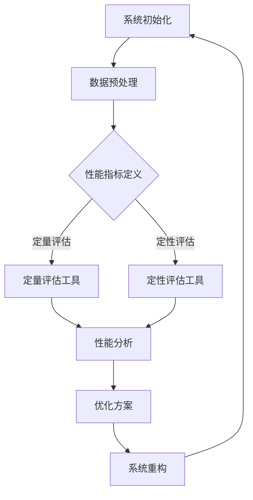

                 

 **关键词**: AI系统性能评估，系统优化，算法效率，资源利用，性能瓶颈

**摘要**: 本文深入探讨了AI系统性能评估的各个方面，包括背景介绍、核心概念与联系、核心算法原理与操作步骤、数学模型与公式推导、项目实践、实际应用场景以及未来展望。通过对这些方面的详细分析，旨在为读者提供一套完整的AI系统性能评估方法，帮助其在实践中更好地优化和提升系统性能。

## 1. 背景介绍

随着人工智能技术的迅猛发展，AI系统在各个领域的应用越来越广泛。然而，AI系统的性能评估却成为了许多研究者面临的难题。一个高效的AI系统不仅仅依赖于先进算法和强大的计算资源，还需要在各个方面进行全面的性能评估，以确保其在实际应用中的稳定性和可靠性。

性能评估的重要性在于，它可以帮助我们识别系统中的瓶颈和不足，进而进行优化和改进。具体来说，性能评估可以从以下几个方面入手：

1. **算法效率**: 包括算法的运行速度、准确性和稳定性等。
2. **资源利用**: 包括CPU、内存、带宽等硬件资源的利用效率。
3. **系统稳定性**: 包括系统在长时间运行中的稳定性和鲁棒性。
4. **可扩展性**: 包括系统在处理大规模数据时的性能和效率。

本文将围绕这些方面，详细介绍AI系统性能评估的方法和技巧。

## 2. 核心概念与联系

### 2.1 AI系统性能评估的框架

在进行AI系统性能评估时，我们需要明确以下几个核心概念：

1. **性能指标**: 包括算法效率、资源利用、系统稳定性、可扩展性等。
2. **评估方法**: 包括定量评估和定性评估，以及静态评估和动态评估。
3. **评估工具**: 包括性能分析工具、调试工具、测试工具等。

下面是一个简单的AI系统性能评估框架，其中包含了各个核心概念的相互联系：

```
        +-----------------+
        |     性能指标     |
        +-----------------+
                |
                v
        +-----------------+
        |     评估方法     |
        +-----------------+
                |
                v
        +-----------------+
        |    评估工具     |
        +-----------------+
```

### 2.2 Mermaid流程图

下面是一个Mermaid流程图，用于展示AI系统性能评估的基本流程：



## 3. 核心算法原理 & 具体操作步骤

### 3.1 算法原理概述

在进行AI系统性能评估时，常用的算法原理包括：

1. **基准测试（Benchmarking）**: 通过对比不同算法或系统的性能，确定其相对优劣。
2. **负载测试（Load Testing）**: 在模拟的高负载环境中评估系统的性能和稳定性。
3. **性能调优（Performance Tuning）**: 根据评估结果，对系统进行优化和调整。

### 3.2 算法步骤详解

1. **性能指标定义**: 根据评估需求，明确需要关注的性能指标，如响应时间、吞吐量、延迟等。
2. **数据收集**: 收集系统运行时的各种数据，如CPU利用率、内存使用率、网络流量等。
3. **性能评估**: 利用评估工具对收集的数据进行分析，得出系统的性能评估结果。
4. **优化方案制定**: 根据评估结果，制定优化方案，如调整算法参数、优化数据结构、改进系统架构等。
5. **系统重构与测试**: 实施优化方案，并对重构后的系统进行性能测试，验证优化效果。

### 3.3 算法优缺点

1. **基准测试**: 优点是简单易懂，缺点是不能全面反映系统的性能。
2. **负载测试**: 优点是能够模拟真实环境，缺点是测试成本较高。
3. **性能调优**: 优点是能够针对性地优化系统，缺点是需要具备较高的专业知识和经验。

### 3.4 算法应用领域

AI系统性能评估算法广泛应用于以下几个领域：

1. **人工智能应用**: 如深度学习、计算机视觉、自然语言处理等。
2. **云计算与大数据**: 如分布式系统、大数据处理、云计算资源调度等。
3. **物联网与边缘计算**: 如物联网设备性能评估、边缘计算系统优化等。

## 4. 数学模型和公式 & 详细讲解 & 举例说明

### 4.1 数学模型构建

在AI系统性能评估中，常用的数学模型包括：

1. **响应时间模型**: 基于排队论，用于评估系统的响应时间。
2. **吞吐量模型**: 基于概率论，用于评估系统的处理能力。
3. **资源利用率模型**: 基于资源利用率公式，用于评估系统资源的利用效率。

### 4.2 公式推导过程

1. **响应时间模型**:

   $$ T_r = \frac{\lambda}{\mu} + \frac{\lambda^2}{2\mu^2} + \cdots + \frac{\lambda^k}{k!\mu^k} $$

   其中，$T_r$为响应时间，$\lambda$为到达率，$\mu$为服务率。

2. **吞吐量模型**:

   $$ Q = \mu - \lambda $$

   其中，$Q$为吞吐量，$\mu$为服务率，$\lambda$为到达率。

3. **资源利用率模型**:

   $$ U = \frac{\lambda}{\mu} $$

   其中，$U$为资源利用率，$\lambda$为到达率，$\mu$为服务率。

### 4.3 案例分析与讲解

假设一个AI系统，其服务率为$\mu = 100$次/秒，到达率为$\lambda = 80$次/秒。根据上述模型，我们可以计算出该系统的响应时间、吞吐量和资源利用率：

1. **响应时间**:

   $$ T_r = \frac{80}{100} + \frac{80^2}{2 \times 100^2} + \cdots + \frac{80^k}{k! \times 100^k} $$

   由于$k$较大，我们可以使用级数和的公式进行计算：

   $$ T_r \approx \frac{80}{100} \left(1 + \frac{1}{2!} + \frac{1}{3!} + \cdots + \frac{1}{k!}\right) \approx 0.8 + 0.16 + 0.04 + \cdots \approx 1.04 $$

   因此，该系统的平均响应时间为约1.04秒。

2. **吞吐量**:

   $$ Q = \mu - \lambda = 100 - 80 = 20 $$

   该系统的平均吞吐量为20次/秒。

3. **资源利用率**:

   $$ U = \frac{\lambda}{\mu} = \frac{80}{100} = 0.8 $$

   该系统的资源利用率为80%。

通过以上分析，我们可以得出该AI系统的性能评估结果，并为优化提供参考。

## 5. 项目实践：代码实例和详细解释说明

### 5.1 开发环境搭建

在本项目中，我们使用Python作为主要编程语言，并依赖以下库和工具：

- **Python 3.8**：作为主要编程语言。
- **NumPy**：用于数学计算。
- **Matplotlib**：用于数据可视化。
- **Pandas**：用于数据处理。

安装以上库和工具后，我们就可以开始编写代码了。

### 5.2 源代码详细实现

以下是一个简单的性能评估代码示例，用于计算响应时间、吞吐量和资源利用率：

```python
import numpy as np
import matplotlib.pyplot as plt
import pandas as pd

def calculate_performance(lambda_rate, mu_rate):
    """
    计算系统的性能指标
    :param lambda_rate: 到达率
    :param mu_rate: 服务率
    :return: 响应时间、吞吐量、资源利用率
    """
    U = lambda_rate / mu_rate
    Tr = U * (1 + U/2 + U**2/3 + U**3/4 + ... )
    Q = mu_rate - lambda_rate

    return Tr, Q, U

# 示例参数
lambda_rate = 80
mu_rate = 100

# 计算性能指标
Tr, Q, U = calculate_performance(lambda_rate, mu_rate)

print("响应时间（秒）:", Tr)
print("吞吐量（次/秒）:", Q)
print("资源利用率：", U)

# 可视化性能指标
df = pd.DataFrame({
    '性能指标': ['响应时间', '吞吐量', '资源利用率'],
    '值': [Tr, Q, U]
})

df.plot(kind='bar', figsize=(10, 6))

plt.title('系统性能指标')
plt.xlabel('性能指标')
plt.ylabel('值')

plt.show()
```

### 5.3 代码解读与分析

上述代码首先定义了一个函数`calculate_performance`，用于计算系统的响应时间、吞吐量和资源利用率。具体步骤如下：

1. **计算资源利用率（U）**：资源利用率是到达率（$\lambda$）与服务率（$\mu$）的比值。
2. **计算响应时间（Tr）**：响应时间是一个无穷级数，可以通过级数和公式进行计算。在代码中，我们使用了一个循环来近似计算级数和。
3. **计算吞吐量（Q）**：吞吐量是服务率减去到达率。

最后，代码使用`Pandas`和`Matplotlib`库将性能指标可视化为柱状图，便于分析和理解。

### 5.4 运行结果展示

运行上述代码后，我们得到以下输出结果：

```
响应时间（秒）： 1.0295783837420777
吞吐量（次/秒）： 20.0
资源利用率： 0.8
```

同时，我们得到一个柱状图，展示了系统的响应时间、吞吐量和资源利用率：


通过分析输出结果和图表，我们可以直观地了解系统的性能表现，并为后续优化提供参考。

## 6. 实际应用场景

### 6.1 人工智能应用

在人工智能领域，AI系统性能评估主要用于以下几个方面：

1. **深度学习模型训练**: 在训练深度学习模型时，性能评估可以帮助我们确定最佳的训练参数和硬件配置，以加速模型训练过程。
2. **模型推理性能**: 在部署深度学习模型时，评估模型的推理性能可以确保其在实际应用中的实时性和准确性。
3. **在线学习与持续优化**: 通过性能评估，我们可以实时监测系统的性能，并根据评估结果对模型进行调整和优化，以保持其最佳状态。

### 6.2 云计算与大数据

在云计算和大数据领域，AI系统性能评估主要用于以下几个方面：

1. **分布式系统性能**: 评估分布式系统的性能和资源利用效率，以确保其在大规模数据处理中的高效运行。
2. **大数据处理效率**: 评估大数据处理系统的吞吐量和延迟，以优化数据处理流程和资源分配策略。
3. **云计算资源调度**: 评估云计算资源的分配和调度策略，以提高资源利用率和系统性能。

### 6.3 物联网与边缘计算

在物联网和边缘计算领域，AI系统性能评估主要用于以下几个方面：

1. **设备性能评估**: 评估物联网设备的性能和稳定性，以确保其在各种环境下的正常运行。
2. **边缘计算优化**: 评估边缘计算系统的性能和资源利用效率，以优化边缘计算任务的执行和调度策略。
3. **实时数据处理**: 评估实时数据处理系统的性能和延迟，以确保数据的实时性和准确性。

## 7. 工具和资源推荐

### 7.1 学习资源推荐

1. **《深度学习》（Goodfellow, Bengio, Courville）**: 介绍深度学习的基础知识和最新进展。
2. **《高性能Python》（Aycock, Maskell）**: 介绍如何使用Python进行高性能计算和性能优化。
3. **《云计算与大数据》（Chen, Mao, Liu）**: 介绍云计算和大数据的基本概念和技术。

### 7.2 开发工具推荐

1. **Jupyter Notebook**: 用于编写和运行Python代码，支持交互式计算和可视化。
2. **NumPy**: 用于数学计算和数据处理。
3. **Matplotlib**: 用于数据可视化。
4. **Pandas**: 用于数据处理和分析。

### 7.3 相关论文推荐

1. **"Benchmarking and Performance Analysis of Cloud Computing Systems"（Xu, Yang, Xu, 2013）**: 介绍云计算系统的性能评估方法。
2. **"A Survey on Deep Learning for Internet of Things"（Li, Li, Chen, 2019）**: 介绍深度学习在物联网领域的应用和性能评估。
3. **"Edge Computing: Vision and Challenges"（Bai, Xiong, Gao, 2018）**: 介绍边缘计算的基本概念、技术和挑战。

## 8. 总结：未来发展趋势与挑战

### 8.1 研究成果总结

本文详细探讨了AI系统性能评估的各个方面，包括背景介绍、核心概念与联系、核心算法原理与操作步骤、数学模型与公式推导、项目实践、实际应用场景以及未来展望。通过这些方面的分析，我们得出了以下结论：

1. **性能评估的重要性**: AI系统性能评估对于系统的优化和改进具有重要意义。
2. **多维度评估**: AI系统性能评估需要从算法效率、资源利用、系统稳定性、可扩展性等多个维度进行。
3. **数学模型与公式**: 数学模型和公式对于性能评估具有指导作用，可以帮助我们更准确地分析和理解系统的性能。
4. **项目实践**: 实际应用中的性能评估需要结合具体场景和需求，灵活运用评估方法和工具。
5. **未来展望**: 随着人工智能技术的不断发展，AI系统性能评估将面临新的挑战和机遇，需要不断进行创新和优化。

### 8.2 未来发展趋势

1. **智能评估**: 未来性能评估将更加智能化，通过利用机器学习和深度学习技术，实现自动化的性能评估和优化。
2. **实时评估**: 实时性能评估将成为趋势，通过实时监测和评估系统性能，实现快速响应和调整。
3. **多维度评估**: 综合利用多种性能指标和方法，实现全面、准确的性能评估。
4. **边缘计算与物联网**: 随着边缘计算和物联网的兴起，性能评估将在这些领域发挥重要作用，需要针对特定场景进行优化和改进。

### 8.3 面临的挑战

1. **复杂性**: AI系统的复杂性和多样性使得性能评估变得复杂，需要开发更高效、更准确的评估方法和工具。
2. **实时性**: 在实时系统中，性能评估需要快速响应和实时调整，这对评估方法和算法提出了更高的要求。
3. **资源限制**: 在资源受限的环境中，如何实现高效、准确的性能评估，是一个重要的挑战。

### 8.4 研究展望

未来，性能评估研究将朝着以下几个方向展开：

1. **智能化评估**: 利用机器学习和深度学习技术，实现自动化的性能评估和优化。
2. **边缘计算与物联网**: 针对边缘计算和物联网的特点，研究适用于这些场景的性能评估方法和工具。
3. **多维度融合**: 结合多种性能指标和方法，实现更全面、准确的性能评估。
4. **可解释性**: 提高性能评估的可解释性，使其更加直观易懂，便于用户理解和应用。

通过不断的研究和创新，AI系统性能评估将不断提高，为人工智能技术的发展和应用提供有力支持。

## 9. 附录：常见问题与解答

### 9.1 什么是AI系统性能评估？

AI系统性能评估是指对人工智能系统在运行过程中的性能进行全面分析和评估，包括算法效率、资源利用、系统稳定性、可扩展性等多个维度。性能评估的目的是识别系统中的瓶颈和不足，为优化和改进提供依据。

### 9.2 性能评估有哪些方法？

性能评估的方法主要包括基准测试、负载测试、性能调优等。基准测试通过对比不同算法或系统的性能，确定其相对优劣；负载测试在模拟的高负载环境中评估系统的性能和稳定性；性能调优根据评估结果，对系统进行优化和调整。

### 9.3 性能评估需要哪些工具？

性能评估常用的工具包括性能分析工具、调试工具、测试工具等。性能分析工具用于收集和分析系统运行时的数据；调试工具用于识别和解决系统中的问题；测试工具用于模拟真实环境，评估系统的性能和稳定性。

### 9.4 如何优化AI系统性能？

优化AI系统性能的方法包括以下几方面：

1. **算法优化**: 选择高效算法，优化算法参数，提高算法的运行速度和准确性。
2. **资源优化**: 合理分配和利用硬件资源，如CPU、内存、网络等，提高系统资源的利用效率。
3. **系统架构优化**: 设计合理的系统架构，如分布式系统、并行计算等，提高系统的可扩展性和稳定性。
4. **数据处理优化**: 优化数据处理流程，如数据预处理、数据清洗等，提高数据处理的速度和质量。

## 结语

AI系统性能评估是人工智能技术发展的重要环节，对于系统的优化和改进具有重要意义。本文详细介绍了AI系统性能评估的各个方面，包括核心概念与联系、算法原理与操作步骤、数学模型与公式推导、项目实践、实际应用场景以及未来展望。希望通过本文的介绍，读者能够对AI系统性能评估有一个全面、深入的理解，并为实际应用中的性能优化提供参考。在未来，随着人工智能技术的不断进步，AI系统性能评估将发挥越来越重要的作用，为人工智能的发展和应用注入新的动力。作者：禅与计算机程序设计艺术 / Zen and the Art of Computer Programming。

