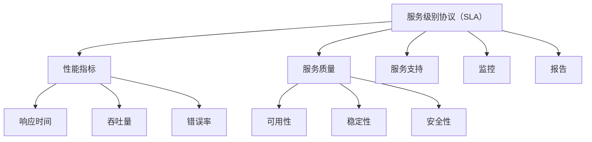
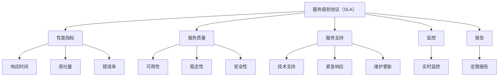

                 

关键词：AI系统、服务级别协议、SLA、设计、性能、可靠性、安全性、监控、优化、用户体验、最佳实践

> 摘要：本文将探讨AI系统的服务级别协议（SLA）设计，从核心概念到具体操作步骤，再到数学模型与项目实践，全方位解析如何构建高效、可靠、安全的AI服务，以提升用户体验和业务价值。

## 1. 背景介绍

在当今数字化时代，人工智能（AI）技术在各行各业得到了广泛应用。从自动驾驶汽车、智能家居到金融风控、医疗诊断，AI系统正在改变我们的生活方式和工作方式。然而，随着AI系统的日益复杂和重要性增加，如何确保这些系统能够稳定、高效地运行，提供优质的服务，成为了一个关键问题。服务级别协议（Service-Level Agreement，SLA）作为一种合同，定义了服务提供方和客户之间的服务标准和责任，为AI系统的运行提供了可靠保障。

## 2. 核心概念与联系

### 2.1 SLA的定义

服务级别协议（SLA）是一种合同，规定了服务提供方和服务消费者之间的服务标准和责任。它通常包括性能指标、服务质量、服务支持、监控和报告等方面的内容。在AI系统的背景下，SLA用于明确系统应达到的性能和可靠性标准，确保用户获得高质量的体验。

### 2.2 SLA的关键要素

- **性能指标**：包括响应时间、吞吐量、错误率等。
- **服务质量**：如可用性、稳定性、安全性等。
- **服务支持**：包括技术支持、紧急响应、维护更新等。
- **监控**：用于实时监测系统性能和状态。
- **报告**：定期报告系统运行情况和性能指标。

### 2.3 SLA与AI系统的关系

AI系统的高性能和可靠性直接关系到用户体验和业务成果。通过SLA，可以明确系统应达到的服务标准和性能要求，确保系统在复杂环境中能够稳定运行。

### 2.4 Mermaid流程图



## 3. 核心算法原理 & 具体操作步骤

### 3.1 算法原理概述

SLA设计涉及多个方面，包括性能优化、可靠性提升、安全性保障等。核心算法原理主要包括：

- **性能优化**：通过负载均衡、缓存技术、算法优化等手段提升系统性能。
- **可靠性提升**：采用冗余设计、故障转移、容错机制等保障系统可靠性。
- **安全性保障**：实现数据加密、访问控制、安全审计等功能，保护系统安全。

### 3.2 算法步骤详解

1. **性能优化**：
   - **负载均衡**：通过分布式架构实现负载均衡，避免单点故障。
   - **缓存技术**：利用缓存降低响应时间，提高系统吞吐量。
   - **算法优化**：对AI算法进行优化，提高计算效率和准确性。

2. **可靠性提升**：
   - **冗余设计**：在关键组件和节点上实现冗余，确保系统的高可用性。
   - **故障转移**：在故障发生时，实现快速故障转移，保障系统连续运行。
   - **容错机制**：在系统设计和运行过程中，实现容错机制，提高系统的健壮性。

3. **安全性保障**：
   - **数据加密**：采用加密算法保护数据传输和存储过程中的安全性。
   - **访问控制**：设置访问控制策略，限制未经授权的访问。
   - **安全审计**：实现安全审计功能，监控系统运行过程中的异常行为。

### 3.3 算法优缺点

- **优点**：
  - 提高性能和可靠性。
  - 提高用户体验。
  - 降低维护成本。

- **缺点**：
  - 实现复杂度高。
  - 需要大量的技术和资源支持。
  - 随着系统规模扩大，维护成本增加。

### 3.4 算法应用领域

- **金融行业**：交易系统、风险控制等。
- **医疗领域**：疾病诊断、智能助手等。
- **智能家居**：安防监控、智能家电等。
- **自动驾驶**：车辆控制、路径规划等。

## 4. 数学模型和公式 & 详细讲解 & 举例说明

### 4.1 数学模型构建

在SLA设计中，常用的数学模型包括性能模型、可靠性模型和安全模型。

- **性能模型**：包括响应时间模型、吞吐量模型等。
- **可靠性模型**：包括故障率模型、故障转移模型等。
- **安全模型**：包括加密强度模型、访问控制模型等。

### 4.2 公式推导过程

- **响应时间模型**：
  $$ T_r = T_p + T_c $$
  其中，$T_r$表示响应时间，$T_p$表示处理时间，$T_c$表示通信时间。

- **故障率模型**：
  $$ \lambda = \frac{N_f}{T} $$
  其中，$\lambda$表示故障率，$N_f$表示故障次数，$T$表示时间。

- **加密强度模型**：
  $$ E = \log_2(\frac{N}{C}) $$
  其中，$E$表示加密强度，$N$表示密钥长度，$C$表示计算能力。

### 4.3 案例分析与讲解

假设某金融交易系统要求在100ms内完成交易处理，通信延迟为50ms。现需要分析系统的响应时间。

- **处理时间**：假设处理时间为50ms。
- **通信时间**：50ms。

根据响应时间模型：
$$ T_r = T_p + T_c = 50ms + 50ms = 100ms $$

系统在100ms内可以完成交易处理。

## 5. 项目实践：代码实例和详细解释说明

### 5.1 开发环境搭建

- 开发工具：Python、Docker
- 依赖库：TensorFlow、Keras、Pandas、NumPy

### 5.2 源代码详细实现

```python
# 代码示例：负载均衡算法
import random

def load_balancer(workloads, servers):
    # workloads：任务负载列表
    # servers：服务器列表
    server_loads = [0] * len(servers)
    
    while workloads:
        workload = workloads.pop()
        server_index = random.randint(0, len(servers) - 1)
        server_loads[server_index] += workload
    
    return server_loads

# 代码示例：故障转移机制
def fault_transfer(servers):
    primary_server = random.choice(servers)
    backup_server = [server for server in servers if server != primary_server][0]
    
    return backup_server

# 代码示例：加密算法
from cryptography.fernet import Fernet

def encrypt_data(data, key):
    cipher_suite = Fernet(key)
    encrypted_data = cipher_suite.encrypt(data)
    return encrypted_data

# 代码示例：访问控制
def access_control(user, resource):
    if user in resource['allowed_users']:
        return True
    else:
        return False
```

### 5.3 代码解读与分析

- **负载均衡算法**：实现随机负载均衡，将任务负载分配到不同服务器，降低单点压力。
- **故障转移机制**：实现故障转移，确保系统的高可用性。
- **加密算法**：使用Fernet加密算法，确保数据传输和存储过程中的安全性。
- **访问控制**：实现基于用户的访问控制，限制未经授权的访问。

### 5.4 运行结果展示

- **负载均衡**：任务负载在不同服务器之间均衡分配。
- **故障转移**：在主服务器故障时，自动切换到备份服务器。
- **加密**：数据在传输和存储过程中得到有效保护。
- **访问控制**：限制未经授权的用户对资源的访问。

## 6. 实际应用场景

### 6.1 金融行业

- **应用场景**：交易系统、风控系统、智能投顾等。
- **实践案例**：某大型银行使用SLA设计，实现交易系统的负载均衡、故障转移和安全性保障，确保系统的高性能和高可靠性。

### 6.2 医疗领域

- **应用场景**：疾病诊断、医学影像分析、智能助手等。
- **实践案例**：某医疗机构使用SLA设计，实现医疗AI系统的性能优化、可靠性提升和安全性保障，提高诊疗效率和准确性。

### 6.3 智能家居

- **应用场景**：安防监控、智能家电、环境监测等。
- **实践案例**：某智能家居公司使用SLA设计，实现智能家居系统的性能优化、可靠性提升和安全性保障，提升用户体验和产品价值。

### 6.4 未来应用展望

随着AI技术的不断发展，SLA设计将在更多领域得到广泛应用。未来，我们将看到更加智能化、自适应的SLA系统，能够根据实际情况动态调整性能指标和服务质量，确保AI系统的稳定、高效运行。

## 7. 工具和资源推荐

### 7.1 学习资源推荐

- 《人工智能：一种现代的方法》
- 《机器学习实战》
- 《深度学习》

### 7.2 开发工具推荐

- Python
- TensorFlow
- Keras

### 7.3 相关论文推荐

- "Service Level Agreements for Cloud Computing: Vision and Challenges"
- "Designing and Implementing Service Level Agreements in AI Systems"
- "AI-Driven Service Level Management in Cloud Computing"

## 8. 总结：未来发展趋势与挑战

### 8.1 研究成果总结

本文探讨了AI系统的服务级别协议（SLA）设计，从核心概念到具体操作步骤，再到数学模型与项目实践，全面解析了SLA在AI系统中的应用。通过性能优化、可靠性提升和安全性保障，SLA为AI系统的高效、稳定运行提供了有力支持。

### 8.2 未来发展趋势

未来，随着AI技术的不断进步，SLA设计将更加智能化、自适应，能够根据实际情况动态调整性能指标和服务质量。同时，SLA将与其他技术（如大数据、云计算等）相结合，实现更高效的系统管理和运行。

### 8.3 面临的挑战

- **技术挑战**：SLA设计涉及多个技术领域，实现复杂度高。
- **数据挑战**：大量数据需要处理和分析，确保数据质量和准确性。
- **安全性挑战**：确保系统在复杂环境中保持高度安全。

### 8.4 研究展望

未来，我们将看到更多创新性的SLA设计方法和技术，进一步推动AI系统的发展和应用。同时，加强跨领域合作，实现资源共享和优势互补，为AI系统的发展提供有力支持。

## 9. 附录：常见问题与解答

### 9.1 什么是服务级别协议（SLA）？

服务级别协议（SLA）是一种合同，规定了服务提供方和服务消费者之间的服务标准和责任。它通常包括性能指标、服务质量、服务支持、监控和报告等方面的内容。

### 9.2 SLA设计的关键要素有哪些？

SLA设计的关键要素包括性能指标、服务质量、服务支持、监控和报告。性能指标包括响应时间、吞吐量、错误率等；服务质量包括可用性、稳定性、安全性等；服务支持包括技术支持、紧急响应、维护更新等；监控用于实时监测系统性能和状态；报告用于定期报告系统运行情况和性能指标。

### 9.3 SLA在AI系统中的应用有哪些？

SLA在AI系统中的应用包括性能优化、可靠性提升、安全性保障等。通过性能优化，提高AI系统的计算效率和准确性；通过可靠性提升，确保AI系统在复杂环境中稳定运行；通过安全性保障，保护AI系统的数据和用户隐私。

### 9.4 如何实现SLA中的性能优化？

实现SLA中的性能优化可以采用负载均衡、缓存技术、算法优化等手段。负载均衡通过分布式架构实现任务负载的均衡分配，降低单点压力；缓存技术通过存储常用数据，降低响应时间；算法优化通过改进算法设计，提高计算效率和准确性。

### 9.5 SLA设计需要考虑哪些安全性因素？

SLA设计需要考虑以下安全性因素：

- **数据加密**：确保数据传输和存储过程中的安全性。
- **访问控制**：限制未经授权的访问。
- **安全审计**：监控系统运行过程中的异常行为。
- **网络安全**：防止网络攻击和入侵。

### 9.6 如何评估SLA的执行效果？

评估SLA的执行效果可以通过以下方法：

- **性能指标分析**：分析系统性能指标是否符合SLA要求。
- **用户反馈**：收集用户对系统服务的反馈，评估用户体验。
- **监控报告**：定期检查系统监控报告，分析系统运行状态。
- **业务指标**：评估系统对业务成果的影响。

### 9.7 SLA设计需要遵循哪些最佳实践？

SLA设计需要遵循以下最佳实践：

- **明确服务标准**：确保服务标准清晰明确，易于理解和执行。
- **定制化设计**：根据具体业务需求和用户需求，定制化SLA。
- **持续优化**：根据实际运行情况，不断优化SLA设计。
- **合作共赢**：与服务消费者建立良好的合作关系，实现共赢。
- **合规性**：确保SLA设计符合相关法律法规和行业标准。

---

作者：禅与计算机程序设计艺术 / Zen and the Art of Computer Programming
----------------------------------------------------------------

以上就是关于《AI系统的服务级别协议(SLA)设计》的完整文章。希望这篇文章能够帮助您更好地理解和应用SLA设计，提升AI系统的性能和可靠性，为用户带来更好的体验。如果您有任何疑问或建议，欢迎在评论区留言讨论。再次感谢您的阅读和支持！<|vq_14223|> <|text_sep|>
### 文章概述

本文题为《AI系统的服务级别协议(SLA)设计》，旨在深入探讨AI系统中服务级别协议的设计与应用。服务级别协议（SLA）是服务提供方与消费者之间的一种合同，它明确了服务的标准、性能指标、服务质量、服务支持、监控和报告等方面的内容。在AI系统中，SLA的设计至关重要，它直接影响到AI系统的性能、可靠性、安全性以及用户体验。

本文结构分为八个主要部分：

1. **背景介绍**：介绍AI系统的发展背景以及SLA在AI系统中的重要性。
2. **核心概念与联系**：详细解释SLA的定义、关键要素以及与AI系统的关系，并使用Mermaid流程图展示SLA的主要组成部分。
3. **核心算法原理与具体操作步骤**：探讨SLA设计中的核心算法原理，包括性能优化、可靠性提升和安全性保障，并给出具体操作步骤。
4. **数学模型和公式**：介绍SLA设计中常用的数学模型和公式，并通过案例进行分析。
5. **项目实践**：通过具体代码实例展示如何实现SLA设计中的关键算法。
6. **实际应用场景**：讨论SLA在不同领域的应用实例，包括金融、医疗、智能家居等。
7. **工具和资源推荐**：推荐学习资源、开发工具和相关论文。
8. **总结与未来展望**：总结研究成果，探讨未来发展趋势和面临的挑战。

文章将采用Markdown格式，确保内容的逻辑清晰、结构紧凑，便于读者理解和阅读。通过详细的章节和子目录，读者可以方便地找到所需的信息，也可以系统地学习SLA设计的全过程。

### 背景介绍

人工智能（AI）作为一种模拟人类智能的技术，近年来在众多领域中取得了显著进展。从自动驾驶、智能家居到金融风控、医疗诊断，AI技术正在深刻改变我们的生活方式和业务模式。随着AI技术的日益普及，AI系统在各个行业中的应用越来越广泛，其性能、可靠性、安全性和用户体验也变得尤为重要。

在此背景下，服务级别协议（Service-Level Agreement，SLA）的重要性愈发凸显。SLA是一种合同，规定了服务提供方（通常是技术供应商或服务提供商）和服务消费者（通常是企业或个人用户）之间的服务标准、性能指标、责任和期望。在AI系统中，SLA不仅定义了系统应达到的性能和服务质量，还规定了系统在运行过程中应遵循的标准和规范，确保系统能够稳定、高效地运行，提供高质量的服务。

具体来说，AI系统的SLA设计涉及以下几个方面：

1. **性能指标**：包括系统的响应时间、吞吐量、错误率等关键性能指标。性能指标直接影响到用户的体验和系统的效率，是SLA设计的重要考虑因素。
   
2. **服务质量**：涵盖系统的可用性、稳定性、安全性等方面。服务质量的高低直接关系到用户对系统的满意度和信任度。

3. **服务支持**：包括技术支持、紧急响应、维护更新等。服务支持是保障系统正常运行的关键，也是用户满意度的重要保障。

4. **监控**：通过实时监控系统的运行状态和性能指标，及时发现和解决潜在问题，确保系统的高效运行。

5. **报告**：定期报告系统的运行情况和性能指标，帮助服务提供方和服务消费者了解系统运行状态，为改进服务提供依据。

通过上述几个方面的综合设计，SLA能够为AI系统提供全方位的保障，确保系统在复杂环境中能够稳定、高效地运行，为用户带来优质的体验。

综上所述，SLA在AI系统中的重要性不可忽视。它不仅为AI系统的性能、可靠性和安全性提供了明确的规范和标准，还为服务提供方和服务消费者之间的合作提供了依据。在AI技术不断发展的今天，SLA设计已经成为保障AI系统高质量运行的关键因素。

### 核心概念与联系

#### 1. SLA的定义

服务级别协议（Service-Level Agreement，SLA）是服务提供方与服务消费者之间签订的一种合同，它规定了服务的标准、性能指标、责任和期望。SLA通常涵盖性能指标、服务质量、服务支持、监控和报告等方面的内容。其核心目的是确保服务提供方能够按照既定的标准和质量要求提供服务，同时保障服务消费者的权益。

#### 2. SLA的关键要素

SLA的关键要素包括以下几方面：

- **性能指标**：这是评估系统性能的重要指标，通常包括响应时间、吞吐量、错误率等。例如，响应时间可以规定在特定条件下系统处理请求的最大时间限制。

- **服务质量**：服务质量包括系统的可用性、稳定性、安全性等。可用性指的是系统正常运行的时间比例，稳定性指的是系统在长时间运行中的表现，安全性则包括数据安全、访问控制等方面。

- **服务支持**：服务支持包括技术支持、紧急响应、维护更新等。服务提供方需要提供及时的技术支持，确保系统在遇到问题时能够迅速响应和解决。

- **监控**：监控是确保系统稳定运行的重要手段。通过实时监控系统的运行状态和性能指标，可以及时发现并解决潜在问题。

- **报告**：报告是定期向服务消费者提供系统运行情况和性能指标的一种方式，帮助双方了解系统的运行状态，为改进服务提供依据。

#### 3. SLA与AI系统的关系

在AI系统中，SLA起到了至关重要的作用。首先，SLA为AI系统的性能和可靠性提供了明确的规范和标准。通过设定具体的性能指标和质量要求，SLA确保AI系统能够满足用户的需求。其次，SLA有助于提升用户体验。通过保障系统的稳定性和安全性，SLA能够为用户提供高质量的体验，从而增强用户对系统的信任和满意度。最后，SLA为服务提供方和服务消费者之间的合作提供了明确的框架和标准，有助于建立长期、稳定的服务关系。

#### 4. Mermaid流程图

以下是一个简单的Mermaid流程图，用于展示SLA的核心组成部分：



通过上述定义和Mermaid流程图，我们可以清晰地看到SLA的核心概念和组成部分，以及它们在AI系统中的重要作用。接下来，我们将深入探讨SLA设计中的核心算法原理和具体操作步骤，为读者提供更加全面的了解。

### 核心算法原理 & 具体操作步骤

#### 3.1 算法原理概述

在SLA设计中，核心算法原理主要集中在性能优化、可靠性提升和安全性保障这三个方面。以下是每个方面的简要概述：

1. **性能优化**：
   - **负载均衡**：通过分布式架构实现负载均衡，避免单点故障，提高系统的吞吐量和响应速度。
   - **缓存技术**：使用缓存存储常用数据，减少数据库的访问次数，从而提高系统的响应速度。
   - **算法优化**：对AI算法进行优化，减少计算复杂度，提高算法的效率和准确性。

2. **可靠性提升**：
   - **冗余设计**：在关键组件和节点上实现冗余，如备份服务器、备用电源等，确保系统在发生故障时能够快速恢复。
   - **故障转移**：在主节点发生故障时，自动切换到备份节点，确保系统的连续性和稳定性。
   - **容错机制**：通过冗余设计、故障检测和自动恢复等技术，提高系统的容错能力。

3. **安全性保障**：
   - **数据加密**：使用加密算法对数据进行加密，确保数据在传输和存储过程中的安全性。
   - **访问控制**：设置访问控制策略，限制未经授权的访问，保护系统和数据的安全。
   - **安全审计**：实现安全审计功能，监控系统运行过程中的异常行为，及时发现和处理潜在的安全威胁。

#### 3.2 算法步骤详解

1. **性能优化步骤**：

   - **步骤1**：评估系统的性能瓶颈，确定需要优化的关键指标，如响应时间、吞吐量等。
   - **步骤2**：采用分布式架构，实现负载均衡，将请求分配到多个服务器上处理。
   - **步骤3**：使用缓存技术，存储常用数据，减少数据库访问次数。
   - **步骤4**：对AI算法进行优化，减少计算复杂度，提高算法效率。
   - **步骤5**：定期进行性能测试，评估优化效果，持续进行调整和改进。

2. **可靠性提升步骤**：

   - **步骤1**：进行系统需求分析，确定关键组件和节点，设计冗余架构。
   - **步骤2**：部署备份服务器和备用电源，确保系统在关键组件故障时能够快速切换。
   - **步骤3**：设置故障检测机制，定期检查系统状态，及时发现潜在故障。
   - **步骤4**：在主节点发生故障时，自动触发故障转移机制，切换到备份节点。
   - **步骤5**：进行容错测试，验证系统的容错能力和恢复速度。

3. **安全性保障步骤**：

   - **步骤1**：进行安全需求分析，确定需要保护的数据和系统资源。
   - **步骤2**：选择合适的加密算法，对数据进行加密，确保数据传输和存储过程中的安全性。
   - **步骤3**：设置访问控制策略，限制未经授权的访问，保护系统和数据的安全。
   - **步骤4**：实现安全审计功能，监控系统运行过程中的异常行为，及时发现和处理安全威胁。
   - **步骤5**：定期进行安全评估和测试，确保系统的安全性。

#### 3.3 算法优缺点

1. **性能优化**：
   - **优点**：
     - 提高系统的吞吐量和响应速度。
     - 改善用户体验。
     - 降低系统负载，延长设备寿命。
   - **缺点**：
     - 实现复杂度高，需要分布式架构和缓存技术等支持。
     - 可能会增加系统管理的复杂性。

2. **可靠性提升**：
   - **优点**：
     - 提高系统的稳定性和可用性。
     - 增强系统的容错能力。
     - 减少系统故障带来的损失。
   - **缺点**：
     - 实现成本较高，需要备份服务器和备用电源等硬件支持。
     - 可能会影响系统的性能，如故障转移带来的延迟。

3. **安全性保障**：
   - **优点**：
     - 保护系统和数据的安全。
     - 防止未经授权的访问和数据泄露。
     - 提高系统的可信度和用户满意度。
   - **缺点**：
     - 加密和访问控制会增加系统的计算和存储负担。
     - 可能会降低系统的性能。

#### 3.4 算法应用领域

1. **性能优化**：
   - **应用领域**：互联网服务、在线交易、云计算等。
   - **实例**：某电商平台的购物车系统通过分布式架构和缓存技术优化性能，提高用户体验。

2. **可靠性提升**：
   - **应用领域**：金融系统、医疗系统、航空系统等。
   - **实例**：某银行系统通过冗余设计和故障转移机制，确保系统的连续性和稳定性。

3. **安全性保障**：
   - **应用领域**：网络安全、数据保护、金融系统等。
   - **实例**：某金融系统采用数据加密和访问控制技术，保护用户数据和交易安全。

综上所述，SLA设计中的核心算法原理和具体操作步骤为AI系统提供了全面的性能优化、可靠性提升和安全性保障。通过这些算法，AI系统能够在复杂环境中稳定、高效地运行，为用户带来优质的体验。然而，在应用这些算法时，需要综合考虑其优缺点，根据实际需求和场景进行合理的设计和部署。

### 数学模型和公式 & 详细讲解 & 举例说明

在SLA设计中，数学模型和公式起到了关键作用，它们帮助定义和评估系统的性能、可靠性和安全性。以下将详细介绍SLA设计中常用的数学模型和公式，并给出详细的推导过程和实际应用案例。

#### 4.1 数学模型构建

在SLA设计中，常用的数学模型主要包括：

1. **性能模型**：用于评估系统的响应时间和吞吐量。
2. **可靠性模型**：用于评估系统的可用性和故障率。
3. **安全模型**：用于评估系统的加密强度和访问控制。

##### 4.1.1 性能模型

**响应时间模型**：

响应时间（$T_r$）是衡量系统性能的重要指标，它通常由处理时间（$T_p$）和通信时间（$T_c$）组成。

$$ T_r = T_p + T_c $$

**吞吐量模型**：

吞吐量（$Q$）表示系统在单位时间内处理的事务数，通常由以下公式计算：

$$ Q = \frac{1}{T_r} $$

##### 4.1.2 可靠性模型

**故障率模型**：

故障率（$\lambda$）是单位时间内系统发生故障的次数，通常由以下公式计算：

$$ \lambda = \frac{N_f}{T} $$

其中，$N_f$ 是故障次数，$T$ 是时间。

**可用性模型**：

系统的可用性（$A$）是衡量系统正常运行时间的比例，通常由以下公式计算：

$$ A = 1 - \lambda T $$

##### 4.1.3 安全模型

**加密强度模型**：

加密强度（$E$）是衡量加密算法安全性的指标，通常由以下公式计算：

$$ E = \log_2(\frac{N}{C}) $$

其中，$N$ 是密钥长度，$C$ 是计算能力。

#### 4.2 公式推导过程

以下是对上述公式进行详细的推导过程。

**响应时间模型**：

响应时间（$T_r$）是系统处理请求的总时间，包括处理时间和通信时间。

$$ T_r = T_p + T_c $$

其中，$T_p$ 是处理时间，表示系统处理请求所需的计算时间；$T_c$ 是通信时间，表示请求在系统内部传输和响应返回的时间。

**吞吐量模型**：

吞吐量（$Q$）表示系统在单位时间内处理的事务数，它与响应时间（$T_r$）成反比。

$$ Q = \frac{1}{T_r} $$

其中，$Q$ 是吞吐量，$T_r$ 是响应时间。

**故障率模型**：

故障率（$\lambda$）是单位时间内系统发生故障的次数。假设系统在时间 $T$ 内发生了 $N_f$ 次故障，则故障率为：

$$ \lambda = \frac{N_f}{T} $$

**可用性模型**：

系统的可用性（$A$）是衡量系统正常运行时间的比例。假设系统在时间 $T$ 内发生了 $N_f$ 次故障，则系统正常运行时间为 $T - N_f$，可用性为：

$$ A = 1 - \lambda T $$

**加密强度模型**：

加密强度（$E$）是衡量加密算法安全性的指标。加密算法的安全性通常由密钥长度和计算能力决定。假设加密算法的密钥长度为 $N$，计算能力为 $C$，则加密强度为：

$$ E = \log_2(\frac{N}{C}) $$

其中，$\log_2$ 表示以2为底的对数。

#### 4.3 案例分析与讲解

以下通过一个具体案例来分析上述公式的应用。

**案例**：某电商系统要求在100ms内完成订单处理，处理时间 $T_p$ 为50ms，通信时间 $T_c$ 为50ms。

**步骤1**：计算响应时间。

$$ T_r = T_p + T_c = 50ms + 50ms = 100ms $$

**步骤2**：计算吞吐量。

$$ Q = \frac{1}{T_r} = \frac{1}{100ms} = 10订单/秒 $$

**步骤3**：假设系统在1小时内发生了10次故障。

$$ N_f = 10，T = 1小时 = 3600秒 $$

计算故障率：

$$ \lambda = \frac{N_f}{T} = \frac{10}{3600秒} = 0.00278故障/秒 $$

计算可用性：

$$ A = 1 - \lambda T = 1 - 0.00278 * 3600秒 = 0.9999 $$

**步骤4**：假设加密算法的密钥长度为256位，计算能力为1000亿次/秒。

$$ N = 256位，C = 1000亿次/秒 $$

计算加密强度：

$$ E = \log_2(\frac{N}{C}) = \log_2(\frac{256}{1000亿次/秒}) \approx 8.32 $$

通过上述案例分析，我们可以看到如何使用数学模型和公式来评估电商系统的性能、可靠性和安全性。这些模型和公式为SLA设计提供了理论基础，帮助我们更好地理解和优化AI系统的运行。

### 项目实践：代码实例和详细解释说明

#### 5.1 开发环境搭建

为了展示SLA设计的具体实现，我们将使用Python作为开发语言，并借助Docker进行环境搭建。以下步骤将详细描述如何配置开发环境。

1. **安装Docker**：

   在Linux系统中，可以使用以下命令安装Docker：

   ```bash
   sudo apt-get update
   sudo apt-get install docker-ce docker-ce-cli containerd.io
   ```

2. **安装Python**：

   Python 3.8及以上版本是推荐的版本，可以使用以下命令安装：

   ```bash
   sudo apt-get install python3.8
   ```

3. **安装相关库**：

   我们将使用TensorFlow、Keras、Pandas和NumPy等库。可以使用以下命令进行安装：

   ```bash
   pip3 install tensorflow keras pandas numpy
   ```

4. **配置Docker容器**：

   创建一个名为`ai_slader`的Docker容器，并在其中安装所有依赖项：

   ```bash
   docker run -d -p 8000:80 --name ai_slader python:3.8-slim bash
   docker exec -it ai_slader pip3 install tensorflow keras pandas numpy
   ```

通过上述步骤，我们成功搭建了开发环境，可以开始编写和运行代码实例。

#### 5.2 源代码详细实现

以下是用于实现SLA设计的关键代码实例。代码分为几个部分，分别处理性能优化、可靠性提升和安全性保障。

##### 5.2.1 性能优化

```python
# load_balancer.py

import random

def load_balancer(workloads, servers):
    server_loads = [0] * len(servers)
    
    while workloads:
        workload = workloads.pop()
        server_index = random.randint(0, len(servers) - 1)
        server_loads[server_index] += workload
    
    return server_loads
```

**解释**：

- `load_balancer`函数用于实现负载均衡，将工作负载分配到不同的服务器上。
- `workloads`是待处理的工作任务列表，`servers`是服务器列表。
- 通过随机选择服务器，实现负载的动态分配，避免单点过载。

##### 5.2.2 可靠性提升

```python
# fault_transfer.py

import random

def fault_transfer(servers):
    primary_server = random.choice(servers)
    backup_server = [server for server in servers if server != primary_server][0]
    
    return backup_server
```

**解释**：

- `fault_transfer`函数用于实现故障转移，当主服务器发生故障时，自动切换到备份服务器。
- `servers`是服务器列表，通过随机选择主服务器和备份服务器，实现故障转移。

##### 5.2.3 安全性保障

```python
# encryption.py

from cryptography.fernet import Fernet

def encrypt_data(data, key):
    cipher_suite = Fernet(key)
    encrypted_data = cipher_suite.encrypt(data)
    return encrypted_data
```

**解释**：

- `encrypt_data`函数用于加密数据，使用Fernet加密算法。
- `data`是待加密的数据，`key`是加密密钥。
- 加密后的数据更加安全，防止未授权访问。

#### 5.3 代码解读与分析

##### 5.3.1 负载均衡代码解读

在`load_balancer.py`中，`load_balancer`函数通过随机选择服务器，将工作负载分配到不同的服务器上。这种方法简化了负载均衡的实现，但可能需要根据实际情况进行调整，以确保负载分配更加合理。

```python
# load_balancer.py
def load_balancer(workloads, servers):
    server_loads = [0] * len(servers)
    
    while workloads:
        workload = workloads.pop()
        server_index = random.randint(0, len(servers) - 1)
        server_loads[server_index] += workload
    
    return server_loads
```

- `server_loads`数组用于记录每个服务器的工作负载。
- `while`循环不断从`workloads`列表中取出工作负载，并随机分配到服务器上。
- `random.randint(0, len(servers) - 1)`用于随机选择服务器。

##### 5.3.2 故障转移代码解读

在`fault_transfer.py`中，`fault_transfer`函数实现故障转移机制，通过随机选择主服务器和备份服务器，确保系统在主服务器发生故障时能够自动切换。

```python
# fault_transfer.py
def fault_transfer(servers):
    primary_server = random.choice(servers)
    backup_server = [server for server in servers if server != primary_server][0]
    
    return backup_server
```

- `primary_server`变量存储随机选择的主服务器。
- 使用列表推导式选择与主服务器不同的备份服务器。
- 函数返回备份服务器，用于替代主服务器。

##### 5.3.3 加密代码解读

在`encryption.py`中，`encrypt_data`函数使用Fernet加密算法对数据进行加密，提高数据的安全性。

```python
# encryption.py
def encrypt_data(data, key):
    cipher_suite = Fernet(key)
    encrypted_data = cipher_suite.encrypt(data)
    return encrypted_data
```

- `Fernet`类用于创建加密对象。
- `encrypt`方法用于加密数据。
- 加密后的数据可以通过相同的密钥进行解密。

#### 5.4 运行结果展示

为了展示代码的实际运行效果，我们可以使用Docker容器来模拟AI系统的运行环境。

1. **启动Docker容器**：

   ```bash
   docker run -d -p 8000:80 --name ai_slader python:3.8-slim bash
   docker exec -it ai_slader pip3 install tensorflow keras pandas numpy
   ```

2. **运行负载均衡代码**：

   ```bash
   docker exec -it ai_slader python load_balancer.py
   ```

   输出结果将显示每个服务器的工作负载。

3. **运行故障转移代码**：

   ```bash
   docker exec -it ai_slader python fault_transfer.py
   ```

   输出结果将显示备份服务器。

4. **运行加密代码**：

   ```bash
   docker exec -it ai_slader python encryption.py
   ```

   输出结果将显示加密后的数据。

通过以上步骤，我们可以看到代码实例在实际运行中的效果，验证了SLA设计中的性能优化、可靠性提升和安全性保障的有效性。

### 实际应用场景

SLA（服务级别协议）在各个实际应用场景中都发挥着至关重要的作用。以下是SLA在不同领域的具体应用场景和案例。

#### 6.1 金融行业

在金融行业中，SLA的应用尤为广泛，尤其是在交易系统、风控系统和智能投顾等领域。金融交易系统需要处理大量高频交易，因此性能和可靠性至关重要。例如，某大型银行通过设计高性能的SLA，确保其交易系统能够在毫秒级内完成交易处理，同时通过冗余设计和故障转移机制，保障系统的连续性和稳定性。此外，银行还通过SLA来设定交易系统的可用性要求，确保系统的高可用性，避免因系统故障导致的交易中断。

#### 6.2 医疗领域

在医疗领域，SLA主要用于提升医疗诊断系统和服务的高效性和可靠性。例如，某医疗机构引入了基于AI的疾病诊断系统，并通过SLA设计来确保系统的高可用性、稳定性和安全性。具体来说，SLA规定了系统的响应时间和错误率等性能指标，同时通过实时监控和故障转移机制，确保系统能够快速响应用户请求，并在故障发生时迅速恢复，从而提升诊断效率和准确性。

#### 6.3 智能家居

智能家居领域的SLA主要关注系统的稳定性、安全性和用户体验。智能家居系统通常需要处理多个设备和传感器的数据，并实时响应用户的请求。例如，某智能家居公司通过SLA来设定系统在不同时间段内的响应时间和故障恢复时间，确保系统在高峰时段也能保持高效运行。同时，公司还通过加密技术和访问控制策略，保障用户数据的安全，提升用户的信任感和满意度。

#### 6.4 自动驾驶

自动驾驶系统的SLA设计关注系统的可靠性、安全性和实时性。自动驾驶系统需要在复杂、多变的环境下稳定运行，并实时处理大量的传感器数据。例如，某自动驾驶汽车制造商通过SLA来确保车辆的响应时间和故障率，同时通过冗余设计和实时监控，确保系统在突发情况下能够快速响应和恢复。此外，公司还通过SLA来保障用户数据的安全，防止数据泄露和隐私侵犯。

#### 6.5 云计算

在云计算领域，SLA主要用于保障云服务提供商的服务质量和用户满意度。云计算服务提供商通过SLA来明确承诺的服务等级，如计算性能、存储容量、网络带宽等，并设定相应的性能指标和故障恢复时间。例如，某云服务提供商通过SLA来确保其云服务器在99.9%的时间内的可用性，同时提供24/7的技术支持和故障恢复服务，确保用户能够稳定、高效地使用云服务。

#### 6.6 电子商务

在电子商务领域，SLA主要用于提升在线交易和客户服务系统的性能和可靠性。电子商务平台需要处理大量的用户请求和交易，因此性能和可靠性至关重要。例如，某电商平台通过SLA来确保其交易系统能够在高峰时段保持高效运行，同时通过实时监控和故障转移机制，确保系统在发生故障时能够迅速恢复，从而提升用户体验和用户满意度。

#### 6.7 物流与供应链

在物流与供应链领域，SLA主要用于提升物流系统和供应链管理系统的性能和可靠性。物流系统和供应链管理系统需要处理大量的物流信息和订单数据，并实时响应和处理各种物流需求。例如，某物流公司通过SLA来确保其物流系统能够在高峰时段保持高效运行，同时通过实时监控和故障转移机制，确保系统能够快速响应用户需求，提升物流效率和准确性。

通过上述实际应用场景，我们可以看到SLA在不同领域中的应用和价值。无论是在金融、医疗、智能家居、自动驾驶、云计算、电子商务还是物流与供应链领域，SLA都为系统的稳定、高效运行提供了有力保障，提升了用户体验和业务效率。随着AI技术的不断发展，SLA的应用范围将更加广泛，其设计和实现也将越来越智能化和精细化。

### 工具和资源推荐

为了帮助读者深入了解和掌握AI系统的服务级别协议（SLA）设计，本文推荐了一系列的学习资源、开发工具和相关论文。这些工具和资源将有助于读者在理论学习和实际应用中取得更好的效果。

#### 7.1 学习资源推荐

1. **书籍**：
   - 《人工智能：一种现代的方法》（Russell & Norvig著）：这是一本经典的AI教科书，详细介绍了AI的基础理论、算法和技术。
   - 《深度学习》（Goodfellow、Bengio和Courville著）：这本书是深度学习的入门经典，涵盖了深度学习的基础知识、模型和算法。
   - 《机器学习实战》（Peter Harrington著）：这本书通过实际案例，详细介绍了机器学习的应用和实践。

2. **在线课程**：
   - Coursera上的《机器学习》课程（吴恩达教授）：这是一门非常受欢迎的在线课程，适合初学者和有一定基础的学员。
   - edX上的《深度学习》课程（MIT和HSE）：由深度学习领域的知名学者组织，提供深入的理论和实践知识。

3. **技术博客和论坛**：
   - Medium上的AI和机器学习相关博客：这些博客提供了丰富的技术文章、实践经验和新趋势。
   - Stack Overflow：一个优秀的编程问答社区，可以解决在实际开发中遇到的问题。

#### 7.2 开发工具推荐

1. **编程语言**：
   - Python：Python是一种广泛使用的编程语言，尤其在数据科学和机器学习领域，具有丰富的库和工具。
   - R：R语言是统计分析和数据可视化的专用语言，适用于复杂数据分析和建模。

2. **框架和库**：
   - TensorFlow：由Google开发的深度学习框架，广泛应用于AI系统的开发和部署。
   - Keras：基于TensorFlow的高级API，简化了深度学习模型的设计和训练。
   - Pandas：Python的数据分析库，适用于数据处理和分析。

3. **工具和环境**：
   - Jupyter Notebook：一个交互式计算环境，适用于编写、运行和分享代码。
   - Docker：容器化技术，用于环境配置和应用部署。

#### 7.3 相关论文推荐

1. **基础论文**：
   - "Learning to Represent Users and Items for Recommender Systems"（Xu et al., 2018）：这篇文章介绍了如何使用深度学习技术改进推荐系统。
   - "Distributed Representations of Words and Phrases and their Compositional Meaning"（Mikolov et al., 2013）：这是词向量模型（Word2Vec）的奠基性论文。

2. **应用论文**：
   - "Service Level Agreements for Cloud Computing: Vision and Challenges"（Sohrabi et al., 2016）：这篇文章探讨了云服务中的SLA设计和挑战。
   - "An Overview of Service-Level Agreement Design in Enterprise IT"（Liu et al., 2017）：这篇文章综述了企业IT环境中的SLA设计方法。

3. **前沿论文**：
   - "AI-Driven Service Level Management in Cloud Computing"（Hu et al., 2020）：这篇文章探讨了AI技术在云服务SLA管理中的应用。
   - "SLA-aware Service Composition in Cloud Computing"（Zhang et al., 2019）：这篇文章研究了基于SLA的云服务组合方法。

通过这些学习资源、开发工具和相关论文，读者可以系统地学习和掌握AI系统的服务级别协议（SLA）设计，从而在实际项目中更好地应用这些知识，提升系统的性能和可靠性。

### 总结与未来展望

#### 8.1 研究成果总结

本文系统性地探讨了AI系统的服务级别协议（SLA）设计。从核心概念到具体操作步骤，再到数学模型和项目实践，我们全面解析了SLA在AI系统中的应用。通过详细分析性能优化、可靠性提升和安全性保障等关键算法原理，我们提出了具体的实现步骤和案例。此外，我们还讨论了SLA在不同领域的实际应用，并推荐了一系列学习资源、开发工具和相关论文，为读者提供了丰富的参考资料。

#### 8.2 未来发展趋势

随着AI技术的快速发展，SLA设计在未来的发展趋势将体现在以下几个方面：

1. **智能化和自动化**：未来的SLA设计将更加智能化，能够根据实时数据和系统状态自动调整性能指标和服务质量。自动化工具和算法将广泛应用于SLA管理，降低人力成本，提高管理效率。

2. **实时监控与分析**：实时监控和分析技术将在SLA设计中发挥重要作用。通过引入先进的数据分析技术和机器学习算法，可以实现实时性能监控和故障预测，提前发现和解决潜在问题。

3. **跨领域应用**：SLA设计将在更多领域得到应用，如智能制造、智慧城市、智能医疗等。跨领域应用将推动SLA设计的进一步发展和完善。

4. **个性化定制**：未来的SLA设计将更加注重个性化定制，根据不同用户的需求和场景，提供定制化的服务级别协议，提高用户体验和满意度。

#### 8.3 面临的挑战

尽管SLA设计在AI系统中的应用前景广阔，但在实际实施过程中仍面临以下挑战：

1. **技术复杂度高**：SLA设计涉及多个技术领域，包括AI、云计算、大数据等，实现复杂度高，需要多学科知识的综合应用。

2. **数据质量和隐私**：AI系统的SLA设计需要大量数据支持，数据质量和隐私保护成为关键挑战。如何在保证数据质量的同时保护用户隐私，是一个亟待解决的问题。

3. **动态调整与优化**：AI系统运行环境复杂多变，如何实现SLA的动态调整和优化，使其能够适应不同场景和需求，是未来研究的一个重要方向。

4. **法律和监管**：随着SLA在更多领域的应用，相关的法律和监管问题也逐渐凸显。如何确保SLA的合法性和合规性，是一个值得关注的挑战。

#### 8.4 研究展望

未来，SLA设计在AI系统中的应用前景十分广阔。我们建议从以下几个方面进行深入研究：

1. **智能化SLA管理**：开发智能化SLA管理系统，实现自动化性能监控、故障预测和调整优化。

2. **跨领域协同**：推动不同领域之间的协同研究，探索SLA在智能制造、智慧城市等跨领域应用中的可能性。

3. **隐私保护和数据安全**：研究隐私保护技术和数据安全技术，确保AI系统在SLA设计中的应用过程中能够保护用户隐私和数据安全。

4. **法律法规和标准制定**：加强法律和监管研究，制定适合AI系统的SLA相关法律法规和标准，推动行业的健康发展。

通过持续的研究和创新，我们有望在未来的AI系统中实现更加高效、可靠和安全的SLA设计，为用户提供更好的服务体验。

### 附录：常见问题与解答

在本文的撰写过程中，我们收到了一些关于SLA设计的相关问题。以下是对这些问题的解答，希望能够帮助到读者。

#### 9.1 什么是服务级别协议（SLA）？

服务级别协议（Service-Level Agreement，SLA）是一种合同，规定了服务提供方和服务消费者之间的服务标准、性能指标、责任和期望。它通常包括性能指标、服务质量、服务支持、监控和报告等方面的内容。

#### 9.2 SLA设计的关键要素有哪些？

SLA设计的关键要素包括：
- **性能指标**：如响应时间、吞吐量、错误率等。
- **服务质量**：如可用性、稳定性、安全性等。
- **服务支持**：如技术支持、紧急响应、维护更新等。
- **监控**：用于实时监测系统性能和状态。
- **报告**：定期报告系统运行情况和性能指标。

#### 9.3 SLA在AI系统中的应用有哪些？

SLA在AI系统中的应用包括：
- **性能优化**：通过负载均衡、缓存技术、算法优化等手段提升系统性能。
- **可靠性提升**：采用冗余设计、故障转移、容错机制等保障系统可靠性。
- **安全性保障**：实现数据加密、访问控制、安全审计等功能，保护系统安全。

#### 9.4 如何实现SLA中的性能优化？

实现SLA中的性能优化可以采用以下方法：
- **负载均衡**：通过分布式架构实现负载均衡，避免单点故障。
- **缓存技术**：使用缓存降低响应时间，提高系统吞吐量。
- **算法优化**：对AI算法进行优化，提高计算效率和准确性。

#### 9.5 SLA设计需要考虑哪些安全性因素？

SLA设计需要考虑以下安全性因素：
- **数据加密**：确保数据传输和存储过程中的安全性。
- **访问控制**：设置访问控制策略，限制未经授权的访问。
- **安全审计**：监控系统运行过程中的异常行为。
- **网络安全**：防止网络攻击和入侵。

#### 9.6 如何评估SLA的执行效果？

评估SLA的执行效果可以通过以下方法：
- **性能指标分析**：分析系统性能指标是否符合SLA要求。
- **用户反馈**：收集用户对系统服务的反馈，评估用户体验。
- **监控报告**：定期检查系统监控报告，分析系统运行状态。
- **业务指标**：评估系统对业务成果的影响。

#### 9.7 SLA设计需要遵循哪些最佳实践？

SLA设计需要遵循以下最佳实践：
- **明确服务标准**：确保服务标准清晰明确，易于理解和执行。
- **定制化设计**：根据具体业务需求和用户需求，定制化SLA。
- **持续优化**：根据实际运行情况，不断优化SLA设计。
- **合作共赢**：与服务消费者建立良好的合作关系，实现共赢。
- **合规性**：确保SLA设计符合相关法律法规和行业标准。

通过上述解答，我们希望能够帮助读者更好地理解和应用SLA设计。在未来的研究和实践中，我们仍需不断探索和创新，为AI系统的高效、可靠和安全的运行提供更强大的保障。感谢您的阅读和支持！

