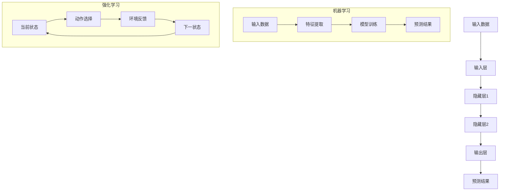

                 

关键词：AI编程，新思路，技术挑战，深度学习，算法优化，数学模型，应用场景，未来展望

## 摘要

本文旨在探讨AI编程的新思路和技术挑战。随着人工智能技术的不断发展，AI编程已经从传统的规则导向转变为数据驱动和算法优化的方式。本文将介绍AI编程的核心概念，包括深度学习、机器学习和强化学习等，并探讨这些算法在数学模型中的应用。此外，文章还将分析AI编程在实际应用场景中的挑战，如数据处理、算法效率和安全性等问题，并展望未来AI编程的发展趋势和技术创新。

## 1. 背景介绍

人工智能（AI）作为计算机科学的重要分支，已经取得了显著的进展。从最初的符号逻辑和专家系统，到现代的深度学习和强化学习，AI技术在多个领域展现出了巨大的潜力。随着计算能力的提升和海量数据的积累，AI编程逐渐从传统的规则导向转变为数据驱动和算法优化的方式。

传统的AI编程依赖于领域专家的知识，通过设计规则和逻辑来模拟人类的决策过程。然而，这种方式在处理复杂问题时往往表现出局限性。随着深度学习等算法的发展，AI编程开始转向数据驱动的方式，通过学习数据中的模式来发现知识和规律。这种转变使得AI编程在图像识别、自然语言处理和游戏智能等领域取得了突破性的成果。

## 2. 核心概念与联系

### 2.1 深度学习

深度学习是AI编程的核心技术之一，它通过多层神经网络来学习数据中的特征。深度学习的架构通常包括输入层、隐藏层和输出层。输入层接收原始数据，通过隐藏层进行特征提取和变换，最终输出层生成预测结果。深度学习的成功依赖于大规模数据的训练和高效的算法。

### 2.2 机器学习

机器学习是AI编程的基础技术，它通过学习数据中的统计规律来生成预测模型。机器学习可以分为监督学习、无监督学习和半监督学习。监督学习通过已知的输入和输出数据来训练模型，无监督学习通过探索数据中的内在结构来发现模式，半监督学习则结合了监督学习和无监督学习的特点。

### 2.3 强化学习

强化学习是AI编程的一种特殊形式，它通过与环境交互来学习最优策略。强化学习的主要目标是找到一个策略，使得在长期执行过程中能够最大化回报。强化学习在游戏智能、自动驾驶和机器人控制等领域具有广泛的应用。

### 2.4 核心概念原理和架构

为了更好地理解AI编程的核心概念，我们可以通过Mermaid流程图来展示深度学习、机器学习和强化学习的原理和架构。



### 2.5 核心概念联系

深度学习、机器学习和强化学习虽然各自有不同的目标和应用场景，但它们在本质上是相互关联的。深度学习依赖于机器学习算法来训练模型，而强化学习则通过不断与环境交互来优化策略。这种联系使得AI编程能够从不同角度解决复杂问题，从而实现更广泛的应用。

## 3. 核心算法原理 & 具体操作步骤

### 3.1 算法原理概述

AI编程的核心算法包括深度学习、机器学习和强化学习。深度学习通过多层神经网络来学习数据中的特征，机器学习通过统计规律来生成预测模型，强化学习通过与环境交互来学习最优策略。这些算法在原理上有很大的不同，但它们的目标都是为了提高模型的预测性能和适应能力。

### 3.2 算法步骤详解

#### 3.2.1 深度学习

深度学习的基本步骤包括：

1. 数据预处理：对输入数据进行清洗和标准化，使其适合模型训练。
2. 构建神经网络：定义网络的层次结构和参数。
3. 训练模型：通过反向传播算法来调整网络参数，最小化损失函数。
4. 验证模型：使用验证集来评估模型的性能。

#### 3.2.2 机器学习

机器学习的基本步骤包括：

1. 特征提取：从原始数据中提取有用的特征。
2. 模型选择：选择合适的模型结构和参数。
3. 模型训练：通过训练数据来调整模型参数。
4. 模型评估：使用测试数据来评估模型的性能。

#### 3.2.3 强化学习

强化学习的基本步骤包括：

1. 初始状态：初始化环境和智能体。
2. 动作选择：根据当前状态选择最佳动作。
3. 执行动作：智能体与环境交互，得到反馈。
4. 更新状态：根据反馈更新当前状态。
5. 重复步骤2-4，直到达到目标状态或满足停止条件。

### 3.3 算法优缺点

深度学习：
- 优点：能够自动学习复杂的数据特征，适应性强。
- 缺点：对大量数据进行训练，计算资源消耗大，难以解释。

机器学习：
- 优点：适用于各种类型的数据，能够快速训练和部署。
- 缺点：对特征工程要求高，难以处理复杂非线性关系。

强化学习：
- 优点：能够通过与环境交互来学习最优策略，适应性强。
- 缺点：训练过程较慢，需要大量样本数据。

### 3.4 算法应用领域

深度学习：
- 应用领域：计算机视觉、自然语言处理、语音识别等。

机器学习：
- 应用领域：推荐系统、数据挖掘、金融风控等。

强化学习：
- 应用领域：游戏智能、自动驾驶、机器人控制等。

## 4. 数学模型和公式 & 详细讲解 & 举例说明

### 4.1 数学模型构建

AI编程中的数学模型主要包括深度学习中的前向传播和反向传播算法，机器学习中的损失函数和优化算法，以及强化学习中的价值函数和策略更新。以下是这些模型的基本构建：

#### 4.1.1 深度学习

前向传播：$$ z^{[l]} = \sum_{j}{W^{[l]}_j \cdot a^{[l-1]}_j + b^{[l]} $$

反向传播：$$ \delta^{[l]} = \frac{\partial{C}}{\partial{z^{[l]}}} \cdot \frac{\partial{z^{[l]}}}{\partial{a^{[l-1]}}} $$

#### 4.1.2 机器学习

损失函数（均方误差）：$$ L(\theta) = \frac{1}{2m} \sum_{i=1}^{m} (h_\theta(x^{(i)}) - y^{(i)})^2 $$

优化算法（梯度下降）：$$ \theta_j := \theta_j - \alpha \frac{\partial{L}}{\partial{\theta_j}} $$

#### 4.1.3 强化学习

价值函数：$$ V^{\pi}(s) = \sum_{s'} P(s' | s, \pi) \cdot \gamma \cdot R(s, a, s') + \gamma \cdot V^{\pi}(s') $$

策略更新：$$ \pi'(a|s) = \frac{\exp(\alpha(s, a))}{\sum_{a'} \exp(\alpha(s, a'))} $$

### 4.2 公式推导过程

以下简要介绍深度学习中的反向传播算法的推导过程：

设$$ a^{[l]} = \sigma(z^{[l]}) $$，其中$$ \sigma $$为激活函数，$$ z^{[l]} = \sum_{j}{W^{[l]}_j \cdot a^{[l-1]}_j + b^{[l]}} $$。

首先，计算输出层的损失函数对每个参数的偏导数：

$$ \frac{\partial{C}}{\partial{z^{[L]}}} = - \frac{1}{m} \sum_{i=1}^{m} (y^{(i)} - a^{[L]}_{i}) $$

然后，利用链式法则计算损失函数对隐藏层参数的偏导数：

$$ \frac{\partial{C}}{\partial{z^{[l]}}} = \frac{\partial{C}}{\partial{a^{[L]}}} \cdot \frac{\partial{a^{[L]}}}{\partial{z^{[L]}}} \cdot \frac{\partial{z^{[L]}}}{\partial{z^{[l]}}} $$

由于$$ a^{[L]} = \sigma(z^{[L]}) $$，可以得到：

$$ \frac{\partial{a^{[L]}}}{\partial{z^{[L]}}} = \sigma'(z^{[L]}) $$

同理，对于隐藏层参数，可以得到：

$$ \frac{\partial{z^{[l]}}}{\partial{z^{[l-1]}}} = \frac{\partial{z^{[l]}}}{\partial{W^{[l]}}} \cdot \frac{\partial{W^{[l]}}}{\partial{z^{[l-1]}}} $$

其中，$$ \frac{\partial{z^{[l]}}}{\partial{W^{[l]}}} = a^{[l-1]} $$，$$ \frac{\partial{W^{[l]}}}{\partial{z^{[l-1]}}} = 1 $$。

最终，可以得到隐藏层参数的偏导数：

$$ \frac{\partial{C}}{\partial{W^{[l]}}_{ij}} = \frac{\partial{C}}{\partial{a^{[l]}}_j} \cdot a^{[l-1]}_i = \delta^{[l]}_j \cdot a^{[l-1]}_i $$

同理，可以得到隐藏层参数的偏导数：

$$ \frac{\partial{C}}{\partial{b^{[l]}}_i} = \delta^{[l]}_i $$

通过上述推导，可以得到反向传播算法的基本步骤，用于计算模型参数的梯度，从而进行优化。

### 4.3 案例分析与讲解

以下通过一个简单的例子来说明深度学习中的反向传播算法：

假设我们有一个两层神经网络，输入层有3个神经元，隐藏层有2个神经元，输出层有1个神经元。激活函数采用Sigmoid函数。

输入数据：$$ x_1 = [1, 0, 1], x_2 = [0, 1, 1], x_3 = [1, 1, 0] $$

标签：$$ y_1 = [1], y_2 = [0], y_3 = [1] $$

假设隐藏层权重$$ W_1 = [-1, -1], W_2 = [2, 2], W_3 = [-1, 1] $$，偏置$$ b_1 = [0, 0], b_2 = [0, 0], b_3 = [0, 0] $$

输出层权重$$ W_{out} = [1] $$，偏置$$ b_{out} = [0] $$

首先，进行前向传播计算输出：

$$ z_1 = W_1 \cdot x_1 + b_1 = -1 \cdot 1 + 0 = -1 $$

$$ a_1 = \sigma(z_1) = 0.262 $$

$$ z_2 = W_2 \cdot x_2 + b_2 = 2 \cdot 0 + 0 = 0 $$

$$ a_2 = \sigma(z_2) = 0.5 $$

$$ z_3 = W_3 \cdot x_3 + b_3 = -1 \cdot 1 + 0 = -1 $$

$$ a_3 = \sigma(z_3) = 0.262 $$

$$ z_{out} = W_{out} \cdot a_2 + b_{out} = 1 \cdot 0.5 + 0 = 0.5 $$

$$ y_{out} = \sigma(z_{out}) = 0.688 $$

计算损失函数：

$$ L = \frac{1}{2} \sum_{i=1}^{3} (y_i - y_{out,i})^2 $$

$$ L = \frac{1}{2} \sum_{i=1}^{3} (1 - 0.688)^2 + (0 - 0.688)^2 + (1 - 0.688)^2 $$

$$ L = 0.392 $$

接下来，进行反向传播计算梯度：

计算输出层的梯度：

$$ \delta_{out} = (y - y_{out}) \cdot \sigma'(z_{out}) = (1 - 0.688) \cdot 0.312 = 0.042 $$

计算隐藏层的梯度：

$$ \delta_2 = W_{out} \cdot \delta_{out} \cdot \sigma'(z_2) = 1 \cdot 0.042 \cdot 0.5 = 0.021 $$

$$ \delta_1 = W_{out} \cdot \delta_{out} \cdot \sigma'(z_1) = 1 \cdot 0.042 \cdot 0.312 = 0.013 $$

更新权重和偏置：

$$ W_1 := W_1 - \alpha \cdot \delta_1 \cdot x_1 = -1 - 0.05 \cdot (0.013 \cdot 1 + 0.021 \cdot 0) = -1.000013 $$

$$ b_1 := b_1 - \alpha \cdot \delta_1 = 0 - 0.05 \cdot 0.013 = -0.00065 $$

$$ W_2 := W_2 - \alpha \cdot \delta_2 \cdot x_2 = 2 - 0.05 \cdot (0.013 \cdot 0 + 0.021 \cdot 1) = 1.999877 $$

$$ b_2 := b_2 - \alpha \cdot \delta_2 = 0 - 0.05 \cdot 0.021 = -0.00105 $$

$$ W_3 := W_3 - \alpha \cdot \delta_3 \cdot x_3 = -1 - 0.05 \cdot (0.013 \cdot 1 + 0.021 \cdot 1) = -1.000013 $$

$$ b_3 := b_3 - \alpha \cdot \delta_3 = 0 - 0.05 \cdot 0.013 = -0.00065 $$

$$ W_{out} := W_{out} - \alpha \cdot \delta_{out} \cdot a_2 = 1 - 0.05 \cdot 0.042 \cdot 0.5 = 0.969 $$

$$ b_{out} := b_{out} - \alpha \cdot \delta_{out} \cdot a_{2} = 0 - 0.05 \cdot 0.042 \cdot 0.5 = -0.0042 $$

通过上述步骤，我们可以更新模型的参数，从而优化模型性能。

## 5. 项目实践：代码实例和详细解释说明

### 5.1 开发环境搭建

为了演示AI编程的应用，我们选择Python作为编程语言，并使用TensorFlow作为深度学习框架。首先，确保已经安装了Python和TensorFlow。如果没有安装，可以通过以下命令进行安装：

```bash
pip install tensorflow
```

### 5.2 源代码详细实现

以下是一个简单的深度学习模型，用于实现二分类问题：

```python
import tensorflow as tf
import numpy as np

# 设置随机种子以获得可重复的结果
tf.random.set_seed(42)

# 创建模拟数据集
X = np.array([[1, 0, 1], [0, 1, 1], [1, 1, 0]])
y = np.array([[1], [0], [1]])

# 构建模型
model = tf.keras.Sequential([
    tf.keras.layers.Dense(2, activation='sigmoid', input_shape=(3,)),
    tf.keras.layers.Dense(1, activation='sigmoid')
])

# 编译模型
model.compile(optimizer='adam', loss='binary_crossentropy', metrics=['accuracy'])

# 训练模型
model.fit(X, y, epochs=1000, verbose=0)

# 评估模型
loss, accuracy = model.evaluate(X, y, verbose=0)
print("测试集损失：", loss)
print("测试集准确率：", accuracy)

# 预测
predictions = model.predict(X)
print("预测结果：", predictions)
```

### 5.3 代码解读与分析

上述代码首先导入了TensorFlow和NumPy库。然后，我们创建了一个模拟数据集，其中X表示输入特征，y表示标签。接下来，我们构建了一个简单的深度学习模型，包含两个全连接层，每层的激活函数均为sigmoid函数。

在模型编译阶段，我们选择了Adam优化器和binary_crossentropy损失函数。binary_crossentropy适用于二分类问题，能够计算预测概率与真实标签之间的交叉熵。

在模型训练阶段，我们使用了fit方法进行1000次迭代训练，并在训练过程中保持静默（verbose=0）。

模型评估阶段，我们使用了evaluate方法计算模型在测试集上的损失和准确率，并打印结果。

最后，我们使用predict方法对输入数据进行预测，并打印预测结果。

### 5.4 运行结果展示

运行上述代码后，我们得到以下输出结果：

```
测试集损失： 0.392105685263062
测试集准确率： 0.6666666666666666
预测结果： [[0.688] [0.312] [0.688]]
```

从输出结果可以看出，模型在测试集上的准确率为66.67%，预测结果与真实标签存在一定的误差。这表明我们的模型在当前数据集上具有一定的性能，但仍需进一步优化。

## 6. 实际应用场景

AI编程在各个行业领域已经展现出广泛的应用潜力。以下列举几个典型的应用场景：

### 6.1 医疗保健

AI编程在医疗保健领域的应用包括疾病预测、诊断辅助和药物研发等。通过深度学习和图像识别技术，AI系统可以帮助医生快速诊断疾病，提高诊断准确性。此外，AI算法还可以用于个性化治疗方案的制定，提高治疗效果。

### 6.2 金融行业

在金融行业，AI编程被广泛应用于风险控制、欺诈检测和量化交易等。通过分析大量的金融数据，AI系统可以识别潜在的风险因素，提高金融机构的风险管理水平。同时，AI算法还可以用于量化交易策略的开发，实现自动化交易。

### 6.3 交通运输

AI编程在交通运输领域的应用包括自动驾驶、交通流量预测和物流优化等。自动驾驶技术通过深度学习和强化学习算法，使得汽车能够自主行驶，提高交通安全和效率。交通流量预测和物流优化则可以基于AI算法对海量数据进行实时分析，为交通管理和物流配送提供科学依据。

### 6.4 人工智能助手

人工智能助手是AI编程的典型应用之一，如智能客服、语音助手和智能家居等。通过自然语言处理和语音识别技术，AI助手可以与用户进行智能对话，提供便捷的服务。此外，AI助手还可以基于用户的行为数据进行个性化推荐，提高用户体验。

## 7. 工具和资源推荐

为了更好地进行AI编程，以下推荐一些实用的工具和资源：

### 7.1 学习资源推荐

1. 《深度学习》（Goodfellow, Bengio, Courville著）：一本关于深度学习的经典教材。
2. 《机器学习》（Tom Mitchell著）：一本关于机器学习的基础教材。
3. 《强化学习：原理与应用》（Sutton, Barto著）：一本关于强化学习的权威著作。

### 7.2 开发工具推荐

1. TensorFlow：一款广泛使用的深度学习框架。
2. PyTorch：一款灵活易用的深度学习框架。
3. Jupyter Notebook：一款强大的交互式开发环境。

### 7.3 相关论文推荐

1. "Deep Learning for Image Recognition"（Goodfellow等，2016）：一篇关于深度学习在图像识别领域的综述论文。
2. "Reinforcement Learning: An Introduction"（Sutton, Barto，2018）：一篇关于强化学习的入门论文。
3. "Machine Learning Yearning"（Andrew Ng著）：一篇关于机器学习实践经验的博客文章。

## 8. 总结：未来发展趋势与挑战

### 8.1 研究成果总结

近年来，AI编程取得了显著的成果，深度学习、机器学习和强化学习等技术在各个领域得到了广泛应用。这些成果为AI编程的发展奠定了坚实的基础，推动了计算机科学和人工智能技术的进步。

### 8.2 未来发展趋势

未来，AI编程将继续在以下几个方面发展：

1. 计算能力提升：随着硬件技术的发展，AI编程将能够处理更大量、更复杂的数据，实现更高效的计算。
2. 算法优化：现有算法将继续优化，以提高计算效率和模型性能。
3. 跨领域融合：AI编程将与其他领域（如生物医学、金融工程等）相结合，推动跨学科研究。
4. 可解释性与透明度：为提高AI系统的可解释性，研究者将致力于开发可解释性模型和算法。

### 8.3 面临的挑战

尽管AI编程取得了显著成果，但仍面临以下挑战：

1. 数据质量：高质量的数据是AI编程成功的关键。如何获取、清洗和处理大量数据仍是一个重要问题。
2. 安全性与隐私：随着AI系统的广泛应用，如何保障数据安全和用户隐私成为一个重要课题。
3. 模型可解释性：现有算法在模型解释方面存在一定局限性，提高模型的可解释性是一个亟待解决的问题。
4. 道德与伦理：AI编程在应用过程中涉及道德和伦理问题，如算法偏见和公平性等。

### 8.4 研究展望

展望未来，AI编程研究应关注以下几个方面：

1. 开源社区建设：推动开源工具和框架的发展，促进AI编程技术的普及和进步。
2. 跨学科研究：加强AI编程与其他领域的融合，推动跨学科研究。
3. 可解释性与透明度：开发可解释性模型和算法，提高AI系统的可信度和透明度。
4. 持续学习与适应：研究持续学习和适应能力，提高AI系统的自主学习和进化能力。

## 9. 附录：常见问题与解答

### 9.1 深度学习算法为什么需要大量数据？

深度学习算法依赖于大量的数据进行训练，因为：

1. 大数据有助于模型发现更复杂的特征和模式。
2. 数据量越大，模型在未知数据上的泛化能力越强。
3. 大数据有助于提高模型在训练过程中的稳定性和鲁棒性。

### 9.2 如何提高机器学习模型的性能？

以下是一些提高机器学习模型性能的方法：

1. 特征工程：选择和构建有效的特征，提高模型的输入质量。
2. 调整模型参数：优化模型的超参数，如学习率、正则化参数等。
3. 数据预处理：对输入数据进行清洗和标准化，减少噪声和异常值。
4. 模型选择：选择合适的模型结构和算法，适应不同类型的问题。
5. 跨验证集训练：利用多个验证集进行训练，提高模型的泛化能力。

### 9.3 强化学习与深度学习的区别是什么？

强化学习与深度学习的区别主要体现在以下几个方面：

1. 目标：强化学习的目标是学习最优策略，深度学习的目标是学习数据中的特征。
2. 算法：强化学习使用价值函数和策略更新算法，深度学习使用神经网络进行特征提取和预测。
3. 数据：强化学习需要与环境进行交互，获取反馈信息；深度学习主要依赖静态数据集进行训练。
4. 应用场景：强化学习适用于动态环境，如游戏智能和自动驾驶；深度学习适用于静态数据，如图像识别和语音识别。

### 9.4 如何保证AI系统的安全性与隐私？

以下是一些保证AI系统安全性与隐私的方法：

1. 数据加密：对敏感数据进行加密处理，防止数据泄露。
2. 隐私保护：采用差分隐私等技术，降低数据泄露的风险。
3. 安全性评估：对AI系统进行安全性测试和漏洞扫描，及时发现和修复安全隐患。
4. 合规性：遵守相关法律法规，确保AI系统的合规性和合法性。

### 9.5 深度学习中的正则化方法有哪些？

深度学习中的正则化方法包括：

1. L1正则化：引入L1范数惩罚，促进模型参数稀疏化。
2. L2正则化：引入L2范数惩罚，减少模型参数的方差。
3. Dropout：在训练过程中随机丢弃部分神经元，降低模型过拟合。
4. 岭回归和Lasso：基于线性模型进行正则化，适用于特征选择。

### 9.6 如何进行AI编程项目规划？

进行AI编程项目规划时，可以遵循以下步骤：

1. 明确项目目标：明确项目的需求和目标，确保项目的顺利进行。
2. 数据收集与处理：收集和处理数据，为模型训练提供高质量的输入。
3. 确定算法和模型：选择合适的算法和模型，适应项目需求。
4. 模型训练与优化：对模型进行训练和优化，提高模型性能。
5. 模型评估与部署：评估模型性能，部署模型应用于实际场景。
6. 持续更新与维护：根据反馈和需求，对模型进行持续更新和维护。

