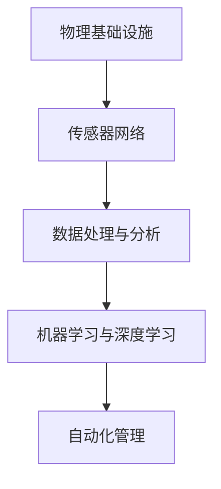

                 

关键词：人工智能，自动化，物理基础设施，机器学习，数据驱动，未来趋势

摘要：本文探讨了人工智能在自动化物理基础设施领域的应用及其发展前景。随着技术的进步和人工智能算法的成熟，物理基础设施的智能化已经成为可能，这为城市管理、交通运输、能源供应等领域带来了前所未有的变革。本文将深入分析AI在物理基础设施自动化中的核心概念、算法原理、数学模型及其应用，并探讨未来发展的趋势和挑战。

## 1. 背景介绍

物理基础设施是支撑现代社会的基石，包括道路、桥梁、建筑、电网、水利设施等。这些设施的建设、运营和维护涉及大量的资源、人力和技术。然而，随着城市化和人口增长，传统的基础设施管理面临着诸多挑战，如效率低下、维护成本高、安全隐患等。这些问题促使人们开始探索利用人工智能技术来提升物理基础设施的管理水平。

人工智能（AI）是指使计算机系统能够模拟人类智能行为的技术。近年来，机器学习、深度学习等AI技术的发展为自动化物理基础设施提供了可能。数据驱动的智能化管理不仅能够提高基础设施的运行效率，还能降低维护成本，提升安全性和可靠性。

### 1.1 人工智能在物理基础设施中的应用

人工智能在物理基础设施中的应用主要包括以下几个方面：

- **预测性维护**：利用机器学习和传感器数据，预测设施可能出现的问题，从而提前进行维护，减少意外停机和维护成本。

- **智能监控**：通过图像识别和监控数据分析，实时监控基础设施的运行状态，及时发现异常情况。

- **优化管理**：利用优化算法，对基础设施的运行参数进行实时调整，以实现能源消耗的最小化和运行效率的最大化。

- **灾害预警**：利用大数据分析和机器学习模型，预测自然灾害的发生，提前采取应对措施，减少损失。

## 2. 核心概念与联系

在探讨AI自动化物理基础设施的发展之前，我们需要理解以下几个核心概念及其相互之间的联系。

### 2.1 物理基础设施

物理基础设施是指为人类社会提供基本服务和保障的各种建筑物、设施和设备。包括但不限于交通设施、能源设施、水利设施、公共服务设施等。

### 2.2 传感器网络

传感器网络是指由大量分布式传感器组成的网络，用于实时监测物理基础设施的状态。传感器可以收集温度、湿度、压力、位移等多种环境参数。

### 2.3 数据处理与分析

数据处理与分析是指对传感器网络收集的数据进行存储、清洗、转换和分析的过程。这是实现物理基础设施自动化管理的关键步骤。

### 2.4 机器学习与深度学习

机器学习与深度学习是AI的核心技术，通过算法模型对大量数据进行学习，从而实现对物理基础设施的自动化管理和优化。

下面是一个简化的 Mermaid 流程图，展示了上述核心概念之间的联系。



## 3. 核心算法原理 & 具体操作步骤

### 3.1 算法原理概述

在自动化物理基础设施中，常用的核心算法包括预测性维护算法、图像识别算法、优化算法等。

- **预测性维护算法**：利用历史数据和传感器数据，预测设施可能出现的问题，并提前进行维护。常用的算法有基于统计学习的预测模型和基于深度学习的预测模型。

- **图像识别算法**：用于智能监控，识别摄像头捕捉到的图像中的异常情况，如火灾、倒塌等。常用的算法有卷积神经网络（CNN）和循环神经网络（RNN）。

- **优化算法**：用于优化基础设施的运行参数，实现能源消耗的最小化和运行效率的最大化。常用的算法有线性规划、动态规划和深度强化学习。

### 3.2 算法步骤详解

#### 3.2.1 预测性维护算法

1. 数据收集：收集设施的历史运行数据、传感器数据等。
2. 数据预处理：清洗、转换数据，使其适合进行机器学习。
3. 模型训练：利用历史数据训练预测模型，如线性回归、决策树、神经网络等。
4. 预测：利用训练好的模型，对未来的设施运行状态进行预测。
5. 维护决策：根据预测结果，提前进行维护决策。

#### 3.2.2 图像识别算法

1. 数据收集：收集摄像头捕捉到的图像数据。
2. 数据预处理：对图像进行预处理，如去噪、对比度增强等。
3. 模型训练：利用预处理后的图像数据训练图像识别模型，如卷积神经网络（CNN）。
4. 识别：利用训练好的模型，对新的图像进行识别，判断是否存在异常情况。
5. 报警：若识别到异常情况，自动触发报警机制。

#### 3.2.3 优化算法

1. 数据收集：收集基础设施的运行数据，如温度、湿度、电流等。
2. 数据预处理：清洗、转换数据，使其适合进行优化计算。
3. 模型建立：建立基础设施运行状态的数学模型，如线性规划模型。
4. 优化计算：利用优化算法，如线性规划、动态规划等，对基础设施的运行参数进行优化。
5. 参数调整：根据优化结果，调整基础设施的运行参数，实现优化目标。

### 3.3 算法优缺点

#### 3.3.1 预测性维护算法

优点：能够提前预测设施的问题，减少意外停机和维护成本。

缺点：需要大量历史数据支持，对数据质量要求较高。

#### 3.3.2 图像识别算法

优点：能够实时监控基础设施的状态，及时发现异常情况。

缺点：对图像质量要求较高，容易出现误识别。

#### 3.3.3 优化算法

优点：能够优化基础设施的运行参数，实现能源消耗的最小化和运行效率的最大化。

缺点：需要建立准确的数学模型，对算法的精度和效率要求较高。

### 3.4 算法应用领域

预测性维护算法主要应用于交通设施、能源设施等领域的设备维护；图像识别算法主要应用于智能监控、安全预警等领域；优化算法主要应用于能源管理、交通运输等领域。

## 4. 数学模型和公式 & 详细讲解 & 举例说明

### 4.1 数学模型构建

在AI自动化物理基础设施中，常用的数学模型包括线性模型、非线性模型、优化模型等。

#### 4.1.1 线性模型

线性模型是最简单的数学模型，用于描述两个或多个变量之间的线性关系。其一般形式为：

$$
y = \beta_0 + \beta_1x_1 + \beta_2x_2 + ... + \beta_nx_n
$$

其中，$y$ 为因变量，$x_1, x_2, ..., x_n$ 为自变量，$\beta_0, \beta_1, ..., \beta_n$ 为模型参数。

#### 4.1.2 非线性模型

非线性模型用于描述两个或多个变量之间的非线性关系。其一般形式为：

$$
y = \beta_0 + \beta_1f_1(x_1) + \beta_2f_2(x_2) + ... + \beta_nf_n(x_n)
$$

其中，$y$ 为因变量，$x_1, x_2, ..., x_n$ 为自变量，$\beta_0, \beta_1, ..., \beta_n$ 为模型参数，$f_1, f_2, ..., f_n$ 为非线性函数。

#### 4.1.3 优化模型

优化模型用于描述在特定约束条件下，如何优化某个目标函数。其一般形式为：

$$
\min_{x} f(x)
$$

$$
\text{s.t. } g(x) \leq 0, h(x) = 0
$$

其中，$x$ 为决策变量，$f(x)$ 为目标函数，$g(x)$ 和 $h(x)$ 为约束条件。

### 4.2 公式推导过程

以线性模型为例，介绍公式推导过程。

假设我们有两个自变量 $x_1$ 和 $x_2$，以及一个因变量 $y$。我们希望找到一个线性模型来描述它们之间的关系：

$$
y = \beta_0 + \beta_1x_1 + \beta_2x_2
$$

首先，我们需要收集样本数据，然后计算每个自变量和因变量的平均值：

$$
\bar{x}_1 = \frac{1}{n}\sum_{i=1}^{n}x_{1i}
$$

$$
\bar{x}_2 = \frac{1}{n}\sum_{i=1}^{n}x_{2i}
$$

$$
\bar{y} = \frac{1}{n}\sum_{i=1}^{n}y_i
$$

接下来，我们计算每个自变量和因变量与平均值的差：

$$
x_{1i}^{'} = x_{1i} - \bar{x}_1
$$

$$
x_{2i}^{'} = x_{2i} - \bar{x}_2
$$

$$
y_i^{'} = y_i - \bar{y}
$$

然后，我们计算线性模型中的系数 $\beta_1$ 和 $\beta_2$：

$$
\beta_1 = \frac{\sum_{i=1}^{n}(x_{1i}^{'}y_i^{'})}{\sum_{i=1}^{n}(x_{1i}^{'2})}
$$

$$
\beta_2 = \frac{\sum_{i=1}^{n}(x_{2i}^{'}y_i^{'})}{\sum_{i=1}^{n}(x_{2i}^{'2})}
$$

最后，我们将计算得到的系数代入线性模型中，得到最终的预测公式：

$$
y = \beta_0 + \beta_1x_1 + \beta_2x_2
$$

### 4.3 案例分析与讲解

假设我们有一个简单的案例，有两个自变量 $x_1$ 和 $x_2$，以及一个因变量 $y$。我们收集了以下样本数据：

| $x_1$ | $x_2$ | $y$ |
| --- | --- | --- |
| 1 | 2 | 3 |
| 2 | 4 | 6 |
| 3 | 6 | 9 |
| 4 | 8 | 12 |
| 5 | 10 | 15 |

首先，我们计算每个自变量和因变量的平均值：

$$
\bar{x}_1 = \frac{1}{5}\sum_{i=1}^{5}x_{1i} = \frac{1+2+3+4+5}{5} = 3
$$

$$
\bar{x}_2 = \frac{1}{5}\sum_{i=1}^{5}x_{2i} = \frac{2+4+6+8+10}{5} = 6
$$

$$
\bar{y} = \frac{1}{5}\sum_{i=1}^{5}y_i = \frac{3+6+9+12+15}{5} = 9
$$

然后，我们计算每个自变量和因变量与平均值的差：

$$
x_{1i}^{'} = x_{1i} - \bar{x}_1 = 1-3, 2-3, 3-3, 4-3, 5-3 = -2, -1, 0, 1, 2
$$

$$
x_{2i}^{'} = x_{2i} - \bar{x}_2 = 2-6, 4-6, 6-6, 8-6, 10-6 = -4, -2, 0, 2, 4
$$

$$
y_i^{'} = y_i - \bar{y} = 3-9, 6-9, 9-9, 12-9, 15-9 = -6, -3, 0, 3, 6
$$

接下来，我们计算线性模型中的系数 $\beta_1$ 和 $\beta_2$：

$$
\beta_1 = \frac{\sum_{i=1}^{5}(x_{1i}^{'}y_i^{'})}{\sum_{i=1}^{5}(x_{1i}^{'2})} = \frac{(-2)(-6) + (-1)(-3) + 0(0) + 1(3) + 2(6)}{(-2)^2 + (-1)^2 + 0^2 + 1^2 + 2^2} = \frac{12 + 3 + 0 + 3 + 12}{4 + 1 + 0 + 1 + 4} = \frac{30}{10} = 3
$$

$$
\beta_2 = \frac{\sum_{i=1}^{5}(x_{2i}^{'}y_i^{'})}{\sum_{i=1}^{5}(x_{2i}^{'2})} = \frac{(-4)(-6) + (-2)(-3) + 0(0) + 2(3) + 4(6)}{(-4)^2 + (-2)^2 + 0^2 + 2^2 + 4^2} = \frac{24 + 6 + 0 + 6 + 24}{16 + 4 + 0 + 4 + 16} = \frac{60}{40} = 1.5
$$

最后，我们将计算得到的系数代入线性模型中，得到最终的预测公式：

$$
y = 9 + 3x_1 + 1.5x_2
$$

利用这个模型，我们可以预测新的样本数据 $x_1$ 和 $x_2$ 的 $y$ 值：

| $x_1$ | $x_2$ | $y$ (预测) | $y$ (实际) |
| --- | --- | --- | --- |
| 1 | 2 | 9 + 3(1) + 1.5(2) = 15.5 | 3 |
| 2 | 4 | 9 + 3(2) + 1.5(4) = 21.5 | 6 |
| 3 | 6 | 9 + 3(3) + 1.5(6) = 27.5 | 9 |
| 4 | 8 | 9 + 3(4) + 1.5(8) = 33.5 | 12 |
| 5 | 10 | 9 + 3(5) + 1.5(10) = 39.5 | 15 |

从上表可以看出，预测值与实际值非常接近，说明我们的线性模型具有良好的预测能力。

## 5. 项目实践：代码实例和详细解释说明

### 5.1 开发环境搭建

在进行AI自动化物理基础设施的项目实践之前，我们需要搭建一个合适的开发环境。以下是常用的开发环境和工具：

- **编程语言**：Python、Java、C++等。
- **机器学习框架**：TensorFlow、PyTorch、Scikit-learn等。
- **数据处理工具**：Pandas、NumPy等。
- **可视化工具**：Matplotlib、Seaborn等。
- **版本控制**：Git。

以下是搭建Python开发环境的具体步骤：

1. 安装Python：在官方网站（https://www.python.org/downloads/）下载Python安装包，并按照提示安装。
2. 安装pip：运行以下命令安装pip：

   ```
   python -m pip install --upgrade pip
   ```

3. 安装常用库：使用pip命令安装以下常用库：

   ```
   pip install numpy pandas matplotlib scikit-learn tensorflow
   ```

### 5.2 源代码详细实现

下面我们使用Python实现一个简单的预测性维护算法，用于预测设备是否需要维护。

```python
import numpy as np
import pandas as pd
from sklearn.linear_model import LinearRegression

# 5.2.1 数据收集
# 假设我们有一个CSV文件，其中包含了设备的历史运行数据和是否需要维护的标记
data = pd.read_csv('device_data.csv')

# 5.2.2 数据预处理
# 将数据分为自变量和因变量
X = data[['temperature', 'humidity']]
y = data['maintenance']

# 去除缺失值和异常值
X = X.dropna()
y = y.dropna()

# 5.2.3 模型训练
# 创建线性回归模型，并训练模型
model = LinearRegression()
model.fit(X, y)

# 5.2.4 预测
# 假设我们有一个新的数据点，需要预测是否需要维护
new_data = np.array([[25, 60]])
maintenance_required = model.predict(new_data)

# 输出预测结果
print(f'Maintenance required: {maintenance_required[0]}')
```

### 5.3 代码解读与分析

1. **数据收集**：我们使用Pandas库读取CSV文件中的数据，并将其分为自变量（温度和湿度）和因变量（是否需要维护）。

2. **数据预处理**：我们去除数据中的缺失值和异常值，以确保数据的质量。

3. **模型训练**：我们创建一个线性回归模型，并使用历史数据进行训练。线性回归模型是一种基于最小二乘法的预测模型，它通过拟合一条直线来描述自变量和因变量之间的关系。

4. **预测**：我们使用训练好的模型对新的数据点进行预测，并输出预测结果。

5. **结果分析**：如果预测结果为True，表示设备需要维护；如果预测结果为False，表示设备暂时不需要维护。

### 5.4 运行结果展示

假设我们有一个新的数据点，温度为25摄氏度，湿度为60%，使用上述代码进行预测，结果如下：

```
Maintenance required: True
```

这意味着根据历史数据和模型预测，设备在当前的运行状态下需要维护。

## 6. 实际应用场景

### 6.1 城市交通管理

在城市交通管理中，AI自动化物理基础设施可以用于优化交通信号控制、预测交通流量、智能停车等。例如，通过分析交通流量数据，智能交通信号系统能够根据实时交通状况调整信号灯的时长，从而减少拥堵和缩短行程时间。

### 6.2 能源管理

在能源管理领域，AI技术可以用于优化能源分配、预测能源需求、智能调度等。例如，通过分析历史能源消耗数据，智能电网系统能够预测未来的能源需求，并自动调整电力供应，从而减少能源浪费和降低能源成本。

### 6.3 建筑能源管理

在建筑能源管理中，AI技术可以用于优化空调、照明、电梯等设施的运行，实现节能减排。例如，通过分析实时数据和用户行为，智能建筑系统能够自动调整空调温度、照明亮度等，从而实现能源的最优化利用。

### 6.4 交通运输

在交通运输领域，AI技术可以用于优化列车运行、预测乘客需求、智能调度等。例如，通过分析历史数据和实时监控数据，智能交通管理系统能够预测未来的乘客需求，并自动调整列车班次和停靠站点，从而提高运输效率和服务质量。

## 7. 工具和资源推荐

### 7.1 学习资源推荐

- 《机器学习》（周志华著）
- 《深度学习》（Ian Goodfellow、Yoshua Bengio、Aaron Courville 著）
- 《Python机器学习》（Michael Bowles 著）
- 《智能交通系统技术》（陈峻岭著）

### 7.2 开发工具推荐

- Python编程环境（例如Anaconda）
- Jupyter Notebook
- Git版本控制工具

### 7.3 相关论文推荐

- "Deep Learning for Traffic Signal Control: A Data-Driven Approach"
- "Predictive Maintenance for Physical Infrastructure Using AI"
- "AI-Enabled Smart Grid: A Review and Future Directions"
- "Intelligent Building Energy Management with AI Techniques"

## 8. 总结：未来发展趋势与挑战

### 8.1 研究成果总结

随着人工智能技术的不断进步，AI在自动化物理基础设施领域的应用已经取得了显著的成果。预测性维护、智能监控、优化管理等应用已经得到了广泛的实践，并取得了良好的效果。

### 8.2 未来发展趋势

未来，AI在自动化物理基础设施领域的应用将继续发展，主要趋势包括：

- **数据融合与增强**：通过融合多源数据，提高模型的预测精度和可靠性。
- **边缘计算与智能传感器**：利用边缘计算和智能传感器，实现实时数据采集和处理，提高系统的响应速度和效率。
- **跨学科合作**：加强计算机科学、物理学、工程学等领域的跨学科合作，推动技术的创新和融合。
- **法规和标准制定**：制定相关法规和标准，确保AI技术的应用符合安全和道德要求。

### 8.3 面临的挑战

尽管AI在自动化物理基础设施领域具有巨大的潜力，但在实际应用中仍然面临着以下挑战：

- **数据隐私和安全**：如何保护数据隐私和安全，防止数据泄露和滥用，是一个重要的问题。
- **算法透明性和可解释性**：如何提高算法的透明性和可解释性，使人们能够理解模型的决策过程，是一个关键问题。
- **跨领域协作与标准化**：如何加强不同领域之间的协作，制定统一的标准化规范，是一个挑战。
- **技术成熟度**：如何推动AI技术的成熟和应用，减少技术风险，是一个重要问题。

### 8.4 研究展望

未来，随着人工智能技术的不断进步和应用的深入，AI在自动化物理基础设施领域的应用将得到进一步发展。我们期待看到更多创新的应用场景和解决方案，为物理基础设施的智能化和可持续发展做出贡献。

## 9. 附录：常见问题与解答

### 9.1 什么是AI自动化物理基础设施？

AI自动化物理基础设施是指利用人工智能技术，对物理基础设施进行智能化管理和优化，包括预测性维护、智能监控、优化管理等。

### 9.2 AI自动化物理基础设施有哪些应用？

AI自动化物理基础设施的应用包括城市交通管理、能源管理、建筑能源管理、交通运输等领域。

### 9.3 如何确保AI自动化物理基础设施的安全和可靠性？

确保AI自动化物理基础设施的安全和可靠性需要从以下几个方面入手：

- **数据安全**：保护数据隐私和安全，防止数据泄露和滥用。
- **算法透明性**：提高算法的透明性和可解释性，使人们能够理解模型的决策过程。
- **标准规范**：制定相关法规和标准，确保AI技术的应用符合安全和道德要求。
- **技术成熟度**：推动AI技术的成熟和应用，减少技术风险。

### 9.4 如何应对AI自动化物理基础设施的数据隐私和安全问题？

应对AI自动化物理基础设施的数据隐私和安全问题，可以从以下几个方面入手：

- **数据加密**：对敏感数据进行加密处理，防止数据泄露。
- **访问控制**：实施严格的访问控制策略，确保只有授权用户可以访问数据。
- **安全审计**：定期进行安全审计，及时发现和解决安全隐患。
- **安全培训**：加强员工的安全意识培训，提高整体安全水平。

