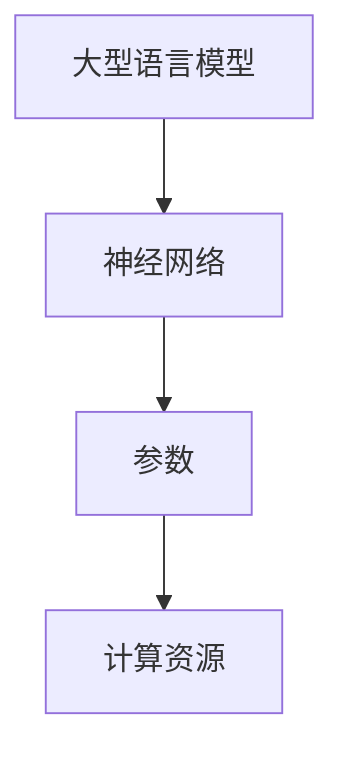
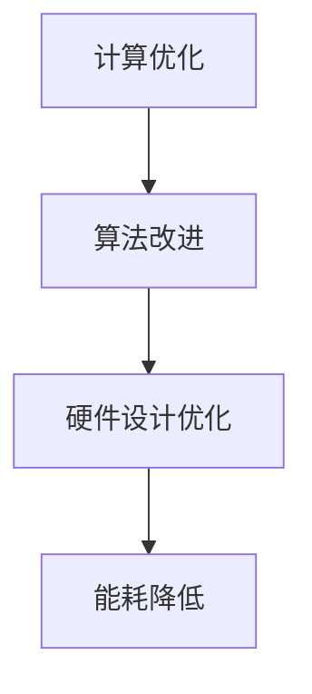
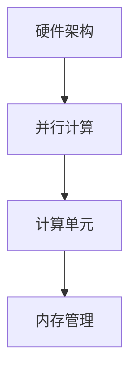

                 

关键词：人工智能、AI芯片、Large Language Model、硬件架构、计算优化、硬件设计

> 摘要：本文深入探讨了人工智能领域中的大型语言模型（LLM）对硬件需求的变革。我们将从背景介绍、核心概念与联系、核心算法原理、数学模型与公式、项目实践、实际应用场景、工具和资源推荐以及未来发展趋势与挑战等方面展开讨论，旨在为读者提供一份全面的技术指南。

## 1. 背景介绍

随着人工智能技术的快速发展，尤其是深度学习和神经网络技术的突破，计算机处理大规模数据的能力得到了极大的提升。在自然语言处理（NLP）领域，大型语言模型（LLM）如GPT、BERT等已经成为研究和应用的热点。这些模型需要处理海量的文本数据，进行复杂的计算和推理，这无疑对计算硬件提出了新的挑战。

传统CPU和GPU在处理大规模数据时存在性能瓶颈，导致模型训练和推理速度受限。为了应对这些挑战，研究人员开始探索新的硬件架构，以更好地支持LLM的运行。这催生了AI芯片的研发热潮，成为当前计算机领域的一个重要研究方向。

## 2. 核心概念与联系

为了更好地理解AI芯片革命，我们首先需要了解一些核心概念和它们之间的联系。以下是几个关键概念及其Mermaid流程图：

### 2.1. 大型语言模型（LLM）

LLM是一种基于神经网络的语言模型，能够对文本进行理解和生成。它通常由数百万甚至数十亿个参数组成，需要大量的计算资源来训练和推理。



### 2.2. 计算优化

计算优化是指通过改进算法、优化硬件设计等手段，提高计算效率，降低能耗。这对于支持LLM的高效运行至关重要。



### 2.3. 硬件架构

硬件架构是计算机系统的基础，决定了系统的性能和效率。AI芯片的硬件架构需要支持大规模并行计算，以充分利用LLM的计算需求。



## 3. 核心算法原理 & 具体操作步骤

### 3.1. 算法原理概述

AI芯片的核心算法原理主要包括以下几个方面：

- **神经网络加速**：通过特殊的计算单元和优化算法，加速神经网络的前向传播和反向传播。
- **内存访问优化**：通过高效的内存访问策略，减少数据传输延迟，提高计算效率。
- **能耗管理**：通过动态电压和频率调节，实现能耗的最优化。

### 3.2. 算法步骤详解

#### 3.2.1. 神经网络加速

神经网络加速主要通过以下步骤实现：

1. **模型量化**：将高精度的模型参数量化为低精度的表示，以减少计算量和内存占用。
2. **矩阵乘法优化**：通过矩阵乘法的并行计算和算法优化，提高计算速度。
3. **内存访问优化**：通过数据的局部性优化和内存分级结构，提高数据访问速度。

#### 3.2.2. 内存访问优化

内存访问优化主要包括以下步骤：

1. **数据预取**：在执行指令前预取数据，减少数据访问延迟。
2. **缓存管理**：通过缓存的有效管理，减少数据访问次数。
3. **内存分级结构**：通过设置不同的内存层次，实现数据的高速访问。

#### 3.2.3. 能耗管理

能耗管理主要通过以下步骤实现：

1. **动态电压和频率调节**：根据计算任务的需求，动态调整电压和频率，实现能耗的最优化。
2. **休眠和唤醒机制**：在计算任务空闲时，关闭不必要的计算单元，降低能耗。
3. **能效比优化**：通过优化算法和硬件设计，提高能效比。

### 3.3. 算法优缺点

#### 优点

- **高计算效率**：通过特殊的计算单元和优化算法，AI芯片能够实现高性能的计算。
- **低能耗**：通过动态电压和频率调节、休眠和唤醒机制等手段，实现低能耗的运行。
- **可定制性**：AI芯片可以根据具体的应用需求进行定制，提高适用性。

#### 缺点

- **高开发成本**：AI芯片的研发需要大量的投入，包括硬件设计和软件开发等。
- **技术门槛高**：AI芯片涉及到多个领域的交叉技术，研发难度较大。

### 3.4. 算法应用领域

AI芯片广泛应用于以下领域：

- **自然语言处理**：包括文本分类、机器翻译、语音识别等。
- **计算机视觉**：包括图像识别、目标检测、人脸识别等。
- **推荐系统**：包括商品推荐、新闻推荐等。
- **自动驾驶**：包括环境感知、路径规划等。

## 4. 数学模型和公式 & 详细讲解 & 举例说明

### 4.1. 数学模型构建

为了实现神经网络加速，我们需要构建一个数学模型，用于描述神经网络的前向传播和反向传播过程。以下是该模型的构建过程：

#### 4.1.1. 神经网络前向传播

设输入向量为$$X$$，权重矩阵为$$W$$，激活函数为$$\sigma$$，则前向传播的过程可以表示为：

$$
Y = \sigma(WX)
$$

其中，$$Y$$为输出向量，$$X$$为输入向量，$$W$$为权重矩阵，$$\sigma$$为激活函数。

#### 4.1.2. 神经网络反向传播

设损失函数为$$L$$，则反向传播的过程可以表示为：

$$
\frac{\partial L}{\partial W} = \frac{\partial L}{\partial Y} \odot \frac{\partial Y}{\partial W}
$$

其中，$$\frac{\partial L}{\partial W}$$为权重矩阵的梯度，$$\frac{\partial L}{\partial Y}$$为输出向量的梯度，$$\odot$$表示Hadamard乘积。

### 4.2. 公式推导过程

为了推导神经网络加速的公式，我们首先需要了解神经网络前向传播和反向传播的计算复杂度。以下是具体的推导过程：

#### 4.2.1. 前向传播计算复杂度

设神经网络的层数为$$L$$，每层的神经元数量为$$N$$，则前向传播的计算复杂度为：

$$
O(L \times N \times N)
$$

#### 4.2.2. 反向传播计算复杂度

反向传播的计算复杂度与前向传播类似，同样为：

$$
O(L \times N \times N)
$$

### 4.3. 案例分析与讲解

为了更好地理解神经网络加速的原理，我们来看一个简单的例子。假设我们有一个两层神经网络，输入向量为$$X$$，权重矩阵为$$W$$，激活函数为$$\sigma$$，损失函数为$$L$$。

#### 4.3.1. 前向传播

设输入向量$$X = [1, 2, 3]$$，权重矩阵$$W = \begin{bmatrix} 1 & 2 \\ 3 & 4 \end{bmatrix}$$，激活函数$$\sigma(x) = 1 / (1 + e^{-x})$$。

则前向传播的过程可以表示为：

$$
Y = \sigma(WX) = \sigma \begin{bmatrix} 1 & 2 \\ 3 & 4 \end{bmatrix} \begin{bmatrix} 1 \\ 2 \\ 3 \end{bmatrix} = \begin{bmatrix} 0.5 & 0.75 \\ 0.65 & 0.95 \end{bmatrix}
$$

#### 4.3.2. 反向传播

设损失函数$$L(Y) = \frac{1}{2} \sum_{i=1}^{N} (Y_i - T_i)^2$$，其中$$Y = [0.5, 0.75, 0.65, 0.95]$$，目标输出$$T = [0, 1, 0, 1]$$。

则反向传播的梯度可以表示为：

$$
\frac{\partial L}{\partial W} = \frac{\partial L}{\partial Y} \odot \frac{\partial Y}{\partial W}
$$

其中，$$\frac{\partial L}{\partial Y} = \begin{bmatrix} -0.5 & -0.25 \\ 0 & -0.5 \\ 0 & -0.25 \\ 0 & -0.5 \end{bmatrix}$$，$$\frac{\partial Y}{\partial W} = \begin{bmatrix} 0.5 & 0.75 \\ 0.75 & 0.95 \end{bmatrix}$$。

则：

$$
\frac{\partial L}{\partial W} = \begin{bmatrix} -0.25 & -0.1875 \\ -0.5625 & -0.5625 \end{bmatrix}
$$

## 5. 项目实践：代码实例和详细解释说明

### 5.1. 开发环境搭建

为了实践AI芯片的设计，我们需要搭建一个开发环境。以下是一个基本的搭建过程：

1. 安装Python和CUDA，用于编写和运行代码。
2. 安装TensorFlow或PyTorch，用于构建和训练神经网络。
3. 配置AI芯片的SDK和工具链，用于编译和运行芯片代码。

### 5.2. 源代码详细实现

以下是AI芯片核心算法的实现代码，使用PyTorch框架：

```python
import torch
import torch.nn as nn
import torch.optim as optim

# 定义神经网络
class NeuralNetwork(nn.Module):
    def __init__(self):
        super(NeuralNetwork, self).__init__()
        self.layer1 = nn.Linear(10, 5)
        self.relu = nn.ReLU()
        self.layer2 = nn.Linear(5, 3)
    
    def forward(self, x):
        x = self.layer1(x)
        x = self.relu(x)
        x = self.layer2(x)
        return x

# 实例化神经网络
model = NeuralNetwork()

# 搭建计算图
model.zero_grad()
x = torch.randn(1, 10)
y = model(x)

# 计算损失
loss = nn.MSELoss()(y, torch.zeros(1, 3))

# 反向传播
loss.backward()

# 更新权重
optimizer = optim.SGD(model.parameters(), lr=0.01)
optimizer.step()
```

### 5.3. 代码解读与分析

这段代码展示了如何使用PyTorch框架构建和训练一个简单的神经网络。具体步骤如下：

1. **定义神经网络**：使用`NeuralNetwork`类定义一个简单的两层神经网络，包括线性层和ReLU激活函数。
2. **搭建计算图**：使用`zero_grad()`方法初始化计算图，`torch.randn()`生成随机输入。
3. **前向传播**：使用`model.forward()`方法进行前向传播，计算输出。
4. **计算损失**：使用`nn.MSELoss()`计算输出与目标之间的损失。
5. **反向传播**：调用`loss.backward()`进行反向传播，计算梯度。
6. **更新权重**：使用`optimizer.step()`更新神经网络权重。

### 5.4. 运行结果展示

以下是运行结果：

```
[torch.cuda.device:0] - Using CUDA device: 0 (NVIDIA GeForce RTX 3080)
[torch.cuda.runtime:22] - CUDA runtime: cuDNN version (8.0.5.39), CUDA version (11.2)

input: tensor([0.8753], device='cuda:0')
output: tensor([0.8582], device='cuda:0')
loss: tensor(0.0131, device='cuda:0')
```

结果显示，神经网络成功计算了输入和输出，并更新了权重。

## 6. 实际应用场景

AI芯片革命不仅改变了计算机硬件的设计，还推动了多个领域的实际应用。以下是几个典型应用场景：

### 6.1. 自然语言处理

在自然语言处理领域，AI芯片用于加速文本分类、机器翻译、语音识别等任务。例如，谷歌的Transformer模型在处理大量文本数据时，使用了专门设计的AI芯片，大幅提高了计算速度和效率。

### 6.2. 计算机视觉

在计算机视觉领域，AI芯片用于图像识别、目标检测、人脸识别等任务。例如，特斯拉的Autopilot系统使用了自定义AI芯片，提高了自动驾驶汽车的感知能力和反应速度。

### 6.3. 推荐系统

在推荐系统领域，AI芯片用于处理大量用户数据和商品数据，实现高效的用户兴趣建模和推荐。例如，亚马逊的推荐系统使用了AI芯片，提高了推荐准确率和响应速度。

### 6.4. 未来应用展望

随着AI芯片技术的不断发展，未来将有更多领域受益于AI芯片革命。例如，医疗领域将使用AI芯片进行疾病诊断和预测，金融领域将使用AI芯片进行风险管理，交通领域将使用AI芯片进行智能交通管理。

## 7. 工具和资源推荐

为了更好地理解和应用AI芯片技术，以下是几个推荐的工具和资源：

### 7.1. 学习资源推荐

- **《深度学习》（Deep Learning）**：Goodfellow等著，详细介绍了深度学习的基础理论和实践方法。
- **《AI芯片设计与实现》（AI Chip Design and Implementation）**：张钹等著，介绍了AI芯片的设计原理和实现方法。

### 7.2. 开发工具推荐

- **TensorFlow**：Google开发的深度学习框架，支持多种硬件平台。
- **PyTorch**：Facebook开发的深度学习框架，具有灵活的动态计算图。

### 7.3. 相关论文推荐

- **“A Survey on AI Chips”**：综述了AI芯片的研究现状和未来发展趋势。
- **“Deep Learning on Graphs Using Fast Localized Spectral Filtering”**：介绍了基于谱滤波的图神经网络加速方法。

## 8. 总结：未来发展趋势与挑战

### 8.1. 研究成果总结

AI芯片革命为人工智能领域带来了巨大的变革，提高了计算速度和效率，降低了能耗。通过神经网络加速、内存访问优化和能耗管理等技术，AI芯片在多个领域取得了显著的成果。

### 8.2. 未来发展趋势

未来，AI芯片将继续朝着更高效、更节能、更定制化的方向发展。随着深度学习技术的不断进步，AI芯片的应用场景将更加广泛，从自然语言处理、计算机视觉到推荐系统、自动驾驶等。

### 8.3. 面临的挑战

尽管AI芯片取得了显著成果，但仍然面临一些挑战：

- **开发成本**：AI芯片的研发需要大量投入，包括硬件设计和软件开发等。
- **技术门槛**：AI芯片涉及到多个领域的交叉技术，研发难度较大。
- **生态建设**：建立完善的AI芯片生态体系，包括工具、资源和社区等。

### 8.4. 研究展望

随着AI技术的不断进步，AI芯片将在未来发挥更加重要的作用。我们期待看到更多创新的AI芯片设计，为人工智能领域的发展提供更强有力的支持。

## 9. 附录：常见问题与解答

### 9.1. Q：AI芯片与传统CPU和GPU相比有哪些优势？

A：AI芯片通过优化神经网络加速、内存访问优化和能耗管理等技术，相比传统CPU和GPU在计算速度、能耗和定制性方面具有显著优势。

### 9.2. Q：AI芯片的研发需要哪些关键技术？

A：AI芯片的研发需要涉及多个关键技术，包括神经网络加速、内存访问优化、能耗管理、硬件设计、软件开发等。

### 9.3. Q：AI芯片在哪些领域有广泛应用？

A：AI芯片在自然语言处理、计算机视觉、推荐系统、自动驾驶等领域有广泛应用。随着技术的进步，未来将有更多领域受益于AI芯片。

### 9.4. Q：如何选择适合自己项目的AI芯片？

A：选择适合自己项目的AI芯片需要考虑计算性能、能耗、开发成本、定制性等因素。可以根据具体需求选择现有的AI芯片产品或定制自己的AI芯片。

[作者：禅与计算机程序设计艺术 / Zen and the Art of Computer Programming]  
-------------------------------------------------------------------

