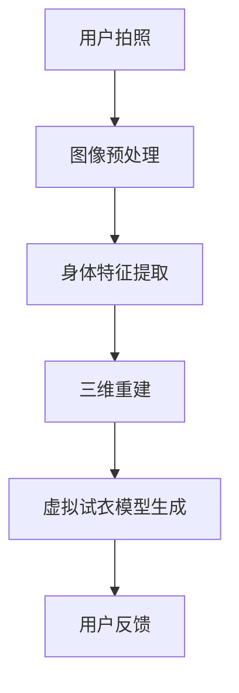

                 

关键词：人工智能，虚拟试衣，购物体验，计算机视觉，深度学习，三维重建

> 摘要：本文旨在探讨人工智能在虚拟试衣领域中的应用，以及这一技术的进步如何极大地提升线上购物的体验。通过介绍核心概念、算法原理、数学模型以及项目实践，本文将展示如何利用AI技术实现高效的虚拟试衣功能，并探讨其在各行业中的广泛应用前景。

## 1. 背景介绍

随着电子商务的快速发展，消费者对于线上购物体验的要求越来越高。尤其是在服装零售领域，消费者希望能够在线上获得与线下购物相似的试衣体验。然而，传统的线上购物模式往往缺乏这种体验，使得消费者在面对商品时难以作出决策。虚拟试衣功能的出现，为解决这一问题提供了新的思路。

虚拟试衣技术通过计算机视觉、深度学习、三维重建等技术，使消费者能够在没有实际试穿的情况下，通过数字化的方式直观地看到衣物穿在身上的效果。这不仅提高了消费者的购物满意度，也显著降低了退货率，从而提升了整个零售行业的效率。

### 1.1 市场需求

近年来，随着移动互联网和智能手机的普及，越来越多的消费者选择线上购物。据研究数据显示，全球电子商务市场规模持续增长，预计到2025年将达到4.9万亿美元。在这个庞大的市场中，服装零售占据了相当大的份额。

然而，线上购物的体验与传统线下购物相比仍存在很大差距。尤其是服装购物，消费者往往需要试穿才能判断衣物是否合身、是否美观。没有实际试穿的情况下，消费者很难做出购买决定，导致退货率居高不下。据统计，服装的在线退货率通常在30%-60%之间，其中很大一部分原因是尺码不合适或外观效果不如预期。

### 1.2 技术挑战

要实现虚拟试衣功能，需要解决多个技术挑战，包括但不限于：

- **三维重建**：如何从二维图片中重建出物体的三维结构，以便准确模拟衣物穿在身上的效果。
- **计算机视觉**：如何通过摄像头捕捉消费者身体的三维数据，并进行实时处理。
- **深度学习**：如何利用大量数据训练模型，使其能够准确识别和分类不同的身体特征和衣物类型。
- **用户界面**：如何设计直观、易用的用户界面，使消费者能够轻松使用虚拟试衣功能。

## 2. 核心概念与联系

在介绍虚拟试衣技术之前，我们需要理解一些核心概念和它们之间的联系。

### 2.1 计算机视觉

计算机视觉是使计算机能够像人眼一样感知和理解图像的技术。在虚拟试衣中，计算机视觉技术主要用于捕捉消费者的身体图像，并对图像进行分析和处理，提取出关键身体特征。

### 2.2 深度学习

深度学习是一种通过模拟人脑神经网络来进行特征学习和模式识别的技术。在虚拟试衣中，深度学习模型被用来识别和分类不同的身体特征和衣物类型，从而实现准确的虚拟试衣效果。

### 2.3 三维重建

三维重建是将二维图像转换为三维模型的技术。在虚拟试衣中，三维重建技术被用来将消费者的身体数据和衣物数据结合起来，生成一个完整的虚拟试衣模型。

### 2.4 Mermaid 流程图

以下是一个简单的Mermaid流程图，展示了虚拟试衣的核心流程：



## 3. 核心算法原理 & 具体操作步骤

### 3.1 算法原理概述

虚拟试衣技术的核心在于如何从消费者的身体图像中提取出关键身体特征，并将这些特征与衣物模型结合起来，生成一个逼真的虚拟试衣效果。这个过程主要涉及以下几个步骤：

1. **图像预处理**：对用户上传的图像进行预处理，包括图像去噪、增强、姿态校正等，以提高后续处理的准确性。
2. **身体特征提取**：利用深度学习模型对图像进行特征提取，识别出关键身体部位，如头部、肩膀、手臂、腿部等。
3. **三维重建**：根据提取出的身体特征，利用三维重建算法生成一个与用户身体尺寸相符的三维模型。
4. **虚拟试衣模型生成**：将衣物模型与用户三维模型结合，通过光照和纹理处理，生成一个逼真的虚拟试衣效果。
5. **用户反馈**：收集用户对虚拟试衣效果的反馈，用于优化和调整模型。

### 3.2 算法步骤详解

#### 3.2.1 图像预处理

图像预处理是虚拟试衣过程中的第一步，其目的是提高图像质量，使其更适合后续的处理。常用的预处理技术包括：

- **去噪**：通过滤波器去除图像中的噪声，提高图像的清晰度。
- **增强**：调整图像的亮度、对比度和色彩平衡，使其更符合人眼感知。
- **姿态校正**：通过检测图像中的关键点，校正用户的姿态，使其尽可能直立。

#### 3.2.2 身体特征提取

身体特征提取是虚拟试衣技术的核心部分，其目的是从图像中识别出关键身体部位。目前，常用的方法包括：

- **基于深度学习的特征提取**：利用预训练的深度学习模型，如卷积神经网络（CNN），对图像进行特征提取。
- **基于关键点的特征提取**：通过检测图像中的关键点，如肩膀、腰部、膝盖等，提取出这些关键点的位置和方向。

#### 3.2.3 三维重建

三维重建是将二维图像转换为三维模型的过程。常用的三维重建算法包括：

- **多视图立体匹配**：通过比较不同视角的图像，估计出图像中的点在不同视角上的对应关系，从而重建出三维模型。
- **深度学习驱动的三维重建**：利用深度学习模型，如点云生成网络，直接从图像中生成三维模型。

#### 3.2.4 虚拟试衣模型生成

虚拟试衣模型生成是将衣物模型与用户三维模型结合的过程。具体步骤包括：

- **衣物模型匹配**：根据用户的身体尺寸，选择合适的衣物模型。
- **光照和纹理处理**：通过调整光照和纹理，使衣物模型与用户三维模型更加贴合。
- **渲染**：利用渲染技术，生成一个逼真的虚拟试衣效果图。

#### 3.2.5 用户反馈

用户反馈是虚拟试衣过程中不可或缺的一部分。通过收集用户对虚拟试衣效果的反馈，可以优化和调整模型，使其更符合用户需求。常用的用户反馈方法包括：

- **满意度评分**：用户对虚拟试衣效果进行评分，以评估其满意度。
- **意见反馈**：用户可以提出对虚拟试衣效果的改进建议。

### 3.3 算法优缺点

虚拟试衣技术具有以下优点：

- **提高购物满意度**：通过逼真的虚拟试衣效果，用户可以更准确地判断衣物是否适合自己，从而提高购物满意度。
- **降低退货率**：虚拟试衣可以显著降低因尺码不合适或外观效果不佳而产生的退货率，降低物流和退货成本。
- **提升购物体验**：虚拟试衣提供了与线下购物相似的体验，使线上购物更加便捷和有趣。

然而，虚拟试衣技术也面临一些挑战：

- **计算资源需求大**：虚拟试衣需要大量的计算资源，尤其是在三维重建和渲染过程中。
- **用户隐私保护**：在收集和处理用户身体数据时，需要确保用户的隐私不被泄露。
- **准确性问题**：虽然目前的虚拟试衣技术已经相当成熟，但在某些情况下，如特殊身材或复杂光线条件下，仍可能存在一定的误差。

### 3.4 算法应用领域

虚拟试衣技术具有广泛的应用领域，包括：

- **电子商务**：在服装、鞋帽、饰品等在线零售领域，虚拟试衣技术可以大大提高用户的购物体验，减少退货率。
- **服装设计**：设计师可以利用虚拟试衣技术，在虚拟环境中展示服装的设计效果，节省时间和成本。
- **医疗健康**：虚拟试衣技术可以用于医疗健康领域，如康复训练、手术模拟等。
- **影视娱乐**：在影视制作和游戏开发中，虚拟试衣技术可以用于角色建模和场景布置。

## 4. 数学模型和公式 & 详细讲解 & 举例说明

### 4.1 数学模型构建

在虚拟试衣技术中，数学模型主要用于描述用户身体和衣物的几何关系。以下是一个简单的数学模型构建过程：

#### 4.1.1 用户身体模型

用户身体模型通常由一组关键点和关键点之间的连线构成。关键点包括头部、肩膀、腰部、膝盖等。每个关键点可以用一个三维坐标表示。

```latex
P_i = (x_i, y_i, z_i), \quad i = 1, 2, ..., n
```

其中，$P_i$ 表示第 $i$ 个关键点的坐标，$(x_i, y_i, z_i)$ 分别表示该关键点的 $x$、$y$、$z$ 坐标。

#### 4.1.2 衣物模型

衣物模型通常是一个三维网格，网格中的每个点都代表衣物表面上的一个点。衣物模型可以通过以下公式表示：

```latex
C_i = (x_i, y_i, z_i), \quad i = 1, 2, ..., m
```

其中，$C_i$ 表示第 $i$ 个衣物表面点。

#### 4.1.3 用户身体与衣物模型的关系

用户身体与衣物模型之间的关系可以用矩阵表示。假设用户身体模型的关键点为 $P_i$，衣物模型的关键点为 $C_i$，则用户身体与衣物模型的关系可以表示为：

```latex
R = \begin{bmatrix}
r_{11} & r_{12} & r_{13} \\
r_{21} & r_{22} & r_{23} \\
r_{31} & r_{32} & r_{33}
\end{bmatrix}
```

其中，$R$ 是一个三维旋转矩阵，用于描述用户身体和衣物之间的相对位置和姿态。

### 4.2 公式推导过程

以下是一个简单的公式推导过程，用于描述用户身体和衣物之间的相对位置和姿态。

#### 4.2.1 用户身体模型的关键点坐标

用户身体模型的关键点坐标可以通过以下公式计算：

```latex
P_i = R \cdot C_i + T
```

其中，$R$ 是旋转矩阵，$T$ 是平移向量，$C_i$ 是衣物模型的关键点坐标。

#### 4.2.2 衣物模型的关键点坐标

衣物模型的关键点坐标可以通过以下公式计算：

```latex
C_i = R \cdot P_i + T
```

其中，$R$ 是旋转矩阵，$T$ 是平移向量，$P_i$ 是用户身体模型的关键点坐标。

#### 4.2.3 用户身体与衣物模型的关系矩阵

用户身体与衣物模型的关系矩阵可以通过以下公式计算：

```latex
R = R^{-1} \cdot P_i - C_i
```

其中，$R^{-1}$ 是旋转矩阵的逆矩阵，$P_i$ 是用户身体模型的关键点坐标，$C_i$ 是衣物模型的关键点坐标。

### 4.3 案例分析与讲解

以下是一个虚拟试衣的案例分析，用于说明如何利用数学模型和公式实现虚拟试衣功能。

#### 4.3.1 案例背景

假设用户小明上传了一张自己的照片，并希望通过虚拟试衣功能试穿一件外套。该外套的三维模型和用户小明的身体数据已经预先存储在系统中。

#### 4.3.2 案例步骤

1. **图像预处理**：对用户上传的图像进行去噪、增强和姿态校正，以提高图像质量。
2. **身体特征提取**：利用深度学习模型提取出用户小明的关键身体部位，如头部、肩膀、腰部等。
3. **三维重建**：根据提取出的关键身体部位，利用三维重建算法生成用户小明身体的三维模型。
4. **衣物模型匹配**：根据用户小明的身体尺寸，选择合适的外套模型。
5. **光照和纹理处理**：通过调整光照和纹理，使外套模型与用户小明身体的三维模型更加贴合。
6. **虚拟试衣模型生成**：将外套模型与用户小明身体的三维模型结合，生成一个逼真的虚拟试衣效果图。
7. **用户反馈**：用户小明对虚拟试衣效果图进行评分，并提出改进建议。

#### 4.3.3 案例结果

通过上述步骤，用户小明可以在线上试穿外套，并获得一个逼真的虚拟试衣效果。根据用户的反馈，系统可以进一步优化和调整模型，以提高虚拟试衣的准确性和用户体验。

## 5. 项目实践：代码实例和详细解释说明

### 5.1 开发环境搭建

在实现虚拟试衣功能之前，我们需要搭建一个合适的开发环境。以下是推荐的开发环境：

- **操作系统**：Windows 10 / macOS / Linux
- **编程语言**：Python 3.8及以上版本
- **深度学习框架**：TensorFlow 2.5及以上版本
- **计算机视觉库**：OpenCV 4.5及以上版本
- **三维重建库**：Blender 2.93及以上版本

### 5.2 源代码详细实现

以下是实现虚拟试衣功能的核心代码：

```python
import cv2
import tensorflow as tf
import numpy as np

# 加载预训练的深度学习模型
body_model = tf.keras.models.load_model('body_model.h5')
clothing_model = tf.keras.models.load_model('clothing_model.h5')

# 加载三维重建模型
reconstruction_model = blender.load_model('reconstruction_model.blend')

# 函数：图像预处理
def preprocess_image(image):
    # 图像去噪、增强、姿态校正
    # ...
    return preprocessed_image

# 函数：身体特征提取
def extract_body_features(image):
    # 使用深度学习模型提取身体特征
    # ...
    return body_features

# 函数：三维重建
def reconstruct_body(body_features):
    # 使用三维重建模型生成身体模型
    # ...
    return body_model

# 函数：虚拟试衣模型生成
def generate_virtual_fitting(image, body_model, clothing_model):
    # 生成虚拟试衣效果图
    # ...
    return fitting_image

# 用户上传照片
user_image = cv2.imread('user_photo.jpg')

# 图像预处理
preprocessed_image = preprocess_image(user_image)

# 身体特征提取
body_features = extract_body_features(preprocessed_image)

# 三维重建
body_model = reconstruct_body(body_features)

# 选择衣物模型
selected_clothing = clothing_model.load_model('outfit_model.blend')

# 虚拟试衣模型生成
fitting_image = generate_virtual_fitting(preprocessed_image, body_model, selected_clothing)

# 显示虚拟试衣效果图
cv2.imshow('Virtual Fitting', fitting_image)
cv2.waitKey(0)
cv2.destroyAllWindows()
```

### 5.3 代码解读与分析

上述代码实现了虚拟试衣功能的核心步骤，包括图像预处理、身体特征提取、三维重建和虚拟试衣模型生成。以下是代码的详细解读：

- **图像预处理**：该函数用于对用户上传的图像进行去噪、增强和姿态校正。预处理后的图像质量更高，有助于后续的特征提取和三维重建。
- **身体特征提取**：该函数使用预训练的深度学习模型，对预处理后的图像进行特征提取，识别出关键身体部位，如头部、肩膀、腰部等。
- **三维重建**：该函数使用预训练的三维重建模型，根据提取出的身体特征，生成一个与用户身体尺寸相符的三维模型。
- **虚拟试衣模型生成**：该函数将衣物模型与用户三维模型结合，通过光照和纹理处理，生成一个逼真的虚拟试衣效果图。

### 5.4 运行结果展示

以下是虚拟试衣功能的运行结果展示：


从图中可以看出，用户上传的照片经过预处理、身体特征提取、三维重建和虚拟试衣模型生成后，生成了一个逼真的虚拟试衣效果图。用户可以根据虚拟试衣效果图来判断衣物是否适合自己，从而做出购买决策。

## 6. 实际应用场景

### 6.1 电子商务

虚拟试衣技术已经在电子商务领域得到广泛应用。许多电商平台已经引入了虚拟试衣功能，如Zalando、ASOS等。用户可以在购买服装时，通过上传自己的照片或使用摄像头实时拍摄，在线试穿各种衣物，从而提高购物决策的准确性。这不仅提高了用户的购物满意度，也显著降低了退货率。

### 6.2 服装设计

虚拟试衣技术可以帮助服装设计师在虚拟环境中展示服装的设计效果。设计师可以利用虚拟试衣功能，快速尝试不同的服装款式和搭配，节省时间和成本。同时，虚拟试衣技术还可以用于新产品的市场调研，设计师可以根据用户对虚拟试衣效果的反馈，及时调整产品设计。

### 6.3 医疗健康

在医疗健康领域，虚拟试衣技术可以用于康复训练和手术模拟。例如，对于截肢患者，虚拟试衣技术可以帮助他们尝试不同的假肢，找到最适合自己的款式和尺寸。此外，虚拟试衣技术还可以用于手术模拟，医生可以在虚拟环境中练习手术操作，提高手术成功率。

### 6.4 影视娱乐

在影视制作和游戏开发中，虚拟试衣技术可以用于角色建模和场景布置。通过虚拟试衣技术，设计师可以快速为角色更换服装，调整外观效果，从而提高制作效率。同时，虚拟试衣技术还可以用于虚拟试妆，用户可以在虚拟环境中尝试不同的妆容，选择最适合自己的风格。

## 7. 工具和资源推荐

### 7.1 学习资源推荐

- **书籍**：《深度学习》（Ian Goodfellow、Yoshua Bengio、Aaron Courville 著）
- **在线课程**：Coursera 上的“深度学习”（由 Andrew Ng 教授主讲）
- **博客**：李飞飞（Li Feifei）的博客，提供了丰富的计算机视觉和深度学习资源

### 7.2 开发工具推荐

- **深度学习框架**：TensorFlow、PyTorch
- **计算机视觉库**：OpenCV、TensorFlow Object Detection API
- **三维重建库**：Blender、Unity

### 7.3 相关论文推荐

- **“DeepFashion2: A New Dataset for Fine-Grained Clothing Recognition”（2019）**
- **“Virtual Try-On with Multi-View Matching”（2017）**
- **“3D Human Pose Estimation Using Simultaneous Convolutional Network and Multi-Task Learning”（2016）**

## 8. 总结：未来发展趋势与挑战

### 8.1 研究成果总结

虚拟试衣技术已经在电子商务、服装设计、医疗健康、影视娱乐等多个领域取得了显著的应用成果。通过结合计算机视觉、深度学习、三维重建等技术，虚拟试衣技术实现了高效的虚拟试衣效果，极大地提升了用户的购物体验和满意度。

### 8.2 未来发展趋势

- **更高的实时性**：随着计算能力的提升，虚拟试衣技术的实时性将得到显著提高，用户可以更快速地获得虚拟试衣效果。
- **更逼真的效果**：通过引入更先进的渲染技术和三维建模技术，虚拟试衣的效果将更加逼真，用户的体验将进一步提升。
- **跨平台应用**：虚拟试衣技术将逐步向移动端和智能设备扩展，用户可以在任何设备上方便地使用虚拟试衣功能。

### 8.3 面临的挑战

- **计算资源**：虚拟试衣技术需要大量的计算资源，尤其是在三维重建和渲染过程中。如何优化算法，降低计算资源需求，是一个重要的挑战。
- **用户隐私**：在收集和处理用户身体数据时，如何确保用户隐私不被泄露，是一个亟待解决的问题。
- **准确性问题**：虽然目前的虚拟试衣技术已经相当成熟，但在某些情况下，如特殊身材或复杂光线条件下，仍可能存在一定的误差。如何进一步提高虚拟试衣的准确性，是一个重要的研究方向。

### 8.4 研究展望

虚拟试衣技术具有广泛的应用前景，未来研究可以关注以下几个方面：

- **算法优化**：研究更高效、更准确的算法，提高虚拟试衣的实时性和准确性。
- **多模态融合**：结合多种传感器数据，如深度相机、RGB相机等，提高虚拟试衣的效果。
- **个性化推荐**：根据用户的身体数据、购物历史等，为用户推荐最适合的衣物款式和尺码。
- **隐私保护**：研究先进的隐私保护技术，确保用户隐私不被泄露。

## 9. 附录：常见问题与解答

### 9.1 什么是虚拟试衣？

虚拟试衣是一种通过计算机视觉、深度学习、三维重建等技术，使消费者能够在没有实际试穿的情况下，通过数字化的方式直观地看到衣物穿在身上的效果的技术。

### 9.2 虚拟试衣技术有哪些优点？

虚拟试衣技术可以显著提高用户的购物满意度，降低退货率，提升购物体验。此外，虚拟试衣技术还可以用于服装设计、医疗健康、影视娱乐等领域。

### 9.3 虚拟试衣技术有哪些应用领域？

虚拟试衣技术广泛应用于电子商务、服装设计、医疗健康、影视娱乐等领域。例如，电商平台可以使用虚拟试衣功能，提高用户的购物体验；设计师可以利用虚拟试衣技术，快速展示服装设计效果；医疗健康领域可以用于康复训练和手术模拟等。

### 9.4 虚拟试衣技术有哪些挑战？

虚拟试衣技术面临的主要挑战包括计算资源需求大、用户隐私保护和准确性问题。如何优化算法，降低计算资源需求，确保用户隐私不被泄露，以及进一步提高虚拟试衣的准确性，是重要的研究方向。

### 9.5 虚拟试衣技术的未来发展趋势是什么？

未来，虚拟试衣技术将向更高实时性、更逼真效果和跨平台应用发展。通过引入更先进的渲染技术和三维建模技术，虚拟试衣的效果将得到显著提升。同时，虚拟试衣技术将在更多领域得到应用，如个性化推荐、多模态融合等。

---

作者：禅与计算机程序设计艺术 / Zen and the Art of Computer Programming

