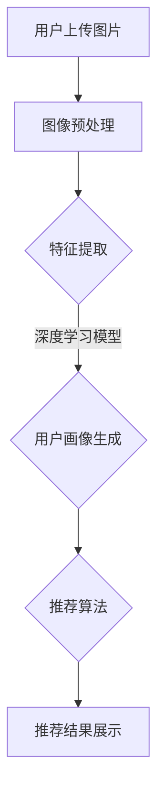

                 

 关键词：AI视觉、推荐系统、用户画像、图像处理、深度学习、计算机视觉、特征提取、用户行为分析、个性化推荐

> 摘要：本文深入探讨了AI视觉推荐系统在分析用户图片方面的应用，从核心概念、算法原理、数学模型、项目实践、实际应用场景等多个角度，全面解析了该系统的实现方法及其在实际中的价值与挑战。

## 1. 背景介绍

随着移动互联网和社交媒体的普及，用户每天生成和分享的图片数量呈指数级增长。如何在海量图片中快速、准确地找到用户感兴趣的内容，成为了现代推荐系统面临的重要问题。传统的基于文本的推荐系统已经难以满足用户对于视觉体验的多样化需求。因此，结合AI视觉技术的推荐系统应运而生。

AI视觉推荐系统通过深度学习算法，自动分析和识别用户上传的图片，提取关键特征，并结合用户的偏好和行为，为其推荐感兴趣的内容。这种系统不仅能够提高用户的参与度和满意度，还能够为内容创作者和平台带来更多的商业价值。

## 2. 核心概念与联系

### 2.1. 图像处理

图像处理是AI视觉推荐系统的第一步，其目的是将原始图像转化为适合进行特征提取的数据。图像处理的常见任务包括图像增强、滤波、边缘检测等。

### 2.2. 特征提取

特征提取是将图像中的视觉信息转换为计算机可以理解和处理的数据。深度学习模型通常使用卷积神经网络（CNN）进行特征提取，通过多层卷积和池化操作，从图像中提取出丰富的空间特征。

### 2.3. 用户画像

用户画像是对用户兴趣、行为、背景等多方面信息的综合描述。通过用户画像，系统可以更好地理解用户的需求，从而提高推荐的准确性和个性化程度。

### 2.4. 推荐算法

推荐算法是AI视觉推荐系统的核心，它根据用户画像和图像特征，生成个性化的推荐结果。常见的推荐算法包括基于内容的推荐、协同过滤、混合推荐等。

### 2.5. Mermaid 流程图

以下是一个简化的Mermaid流程图，描述了AI视觉推荐系统的主要工作流程：



## 3. 核心算法原理 & 具体操作步骤

### 3.1. 算法原理概述

AI视觉推荐系统的核心是深度学习模型，特别是卷积神经网络（CNN）。CNN通过多层卷积和池化操作，从图像中提取出层次化的特征表示。这些特征表示不仅能够捕获图像的局部结构，还能够捕捉全局模式。

### 3.2. 算法步骤详解

1. **图像预处理**：对用户上传的图片进行增强、滤波等操作，提高图像质量。

2. **特征提取**：使用CNN对预处理后的图像进行特征提取。常见的CNN结构包括VGG、ResNet、Inception等。

3. **用户画像生成**：根据用户的历史行为和偏好，构建用户画像。用户画像可以是基于内容的特征（如颜色、纹理等）或基于行为（如点击、点赞等）的特征。

4. **推荐算法**：使用基于内容的推荐或协同过滤等方法，将用户画像与图像特征进行匹配，生成推荐结果。

5. **推荐结果展示**：将推荐结果展示给用户，使用户能够快速找到感兴趣的内容。

### 3.3. 算法优缺点

**优点**：

- **高效性**：深度学习模型能够自动学习和提取图像特征，大大降低了人工干预的工作量。
- **准确性**：通过用户画像和图像特征的双重视角，推荐系统能够提供更加准确的个性化推荐。
- **多样性**：能够推荐多种类型的内容，满足用户的多样化需求。

**缺点**：

- **计算资源消耗**：深度学习模型训练和推理需要大量的计算资源，对硬件要求较高。
- **数据隐私**：用户画像的构建和使用涉及到数据隐私问题，需要严格保护用户隐私。

### 3.4. 算法应用领域

AI视觉推荐系统广泛应用于电商、社交媒体、视频平台等多个领域，为用户提供个性化的视觉体验。例如，电商平台可以使用该系统推荐商品，社交媒体可以推荐用户可能感兴趣的内容，视频平台可以推荐用户可能喜欢的视频。

## 4. 数学模型和公式

### 4.1. 数学模型构建

在AI视觉推荐系统中，常用的数学模型包括卷积神经网络（CNN）和推荐算法模型。以下是一个简化的CNN模型：

$$
\begin{aligned}
h_{11} &= \sigma\left( \sum_{i=1}^{3} w_{i} * x_{i} + b \right) \\
h_{12} &= \sigma\left( \sum_{i=1}^{3} w_{i} * x_{i} + b \right) \\
\vdots \\
h_{M1} &= \sigma\left( \sum_{i=1}^{3} w_{i} * x_{i} + b \right) \\
\end{aligned}
$$

其中，$h_{ij}$ 表示第 $i$ 行第 $j$ 列的特征值，$x_{i}$ 表示输入图像的特征，$w_{i}$ 表示权重，$b$ 表示偏置项，$\sigma$ 表示激活函数。

### 4.2. 公式推导过程

CNN的公式推导过程主要涉及卷积操作、激活函数和池化操作。以下是一个简化的推导过程：

1. **卷积操作**：

$$
h_{ij} = \sum_{k=1}^{K} w_{k} * x_{ij} + b
$$

其中，$K$ 表示卷积核的数量，$w_{k}$ 表示卷积核的权重，$x_{ij}$ 表示输入图像的特征。

2. **激活函数**：

$$
h_{ij} = \sigma(h_{ij})
$$

常见的激活函数包括ReLU、Sigmoid和Tanh。

3. **池化操作**：

$$
p_{ij} = \max_{k} h_{ijk}
$$

其中，$p_{ij}$ 表示池化后的特征值，$h_{ijk}$ 表示卷积后的特征值。

### 4.3. 案例分析与讲解

假设我们有一个输入图像，需要使用一个3x3的卷积核进行特征提取。卷积核的权重和偏置项如下：

$$
\begin{aligned}
w_{1} &= [1, 1, 1] \\
w_{2} &= [1, 1, 1] \\
w_{3} &= [1, 1, 1] \\
b &= 1
\end{aligned}
$$

输入图像的特征矩阵如下：

$$
x = \begin{bmatrix}
1 & 2 & 3 \\
4 & 5 & 6 \\
7 & 8 & 9
\end{bmatrix}
$$

使用卷积操作和ReLU激活函数，得到的特征矩阵如下：

$$
h = \begin{bmatrix}
4 & 4 & 4 \\
4 & 4 & 4 \\
4 & 4 & 4
\end{bmatrix}
$$

使用最大池化操作，得到的特征矩阵如下：

$$
p = \begin{bmatrix}
4 & 4 \\
4 & 4
\end{bmatrix}
$$

这些特征矩阵将被用于后续的推荐算法。

## 5. 项目实践：代码实例和详细解释说明

### 5.1. 开发环境搭建

为了实践AI视觉推荐系统，我们需要搭建一个Python开发环境。以下是安装必要的Python库的步骤：

```bash
pip install tensorflow numpy matplotlib
```

### 5.2. 源代码详细实现

以下是使用TensorFlow实现一个简单的AI视觉推荐系统的示例代码：

```python
import tensorflow as tf
from tensorflow.keras import layers
import numpy as np

# 定义卷积神经网络
model = tf.keras.Sequential([
    layers.Conv2D(32, (3, 3), activation='relu', input_shape=(28, 28, 1)),
    layers.MaxPooling2D((2, 2)),
    layers.Conv2D(64, (3, 3), activation='relu'),
    layers.MaxPooling2D((2, 2)),
    layers.Conv2D(64, (3, 3), activation='relu'),
    layers.Flatten(),
    layers.Dense(64, activation='relu'),
    layers.Dense(10, activation='softmax')
])

# 编译模型
model.compile(optimizer='adam',
              loss='categorical_crossentropy',
              metrics=['accuracy'])

# 加载MNIST数据集
mnist = tf.keras.datasets.mnist
(x_train, y_train), (x_test, y_test) = mnist.load_data()

# 归一化数据
x_train, x_test = x_train / 255.0, x_test / 255.0

# 增加一个通道维度
x_train = np.expand_dims(x_train, -1)
x_test = np.expand_dims(x_test, -1)

# 转换标签为one-hot编码
y_train = tf.keras.utils.to_categorical(y_train, 10)
y_test = tf.keras.utils.to_categorical(y_test, 10)

# 训练模型
model.fit(x_train, y_train, epochs=5, batch_size=32)

# 评估模型
model.evaluate(x_test, y_test)
```

### 5.3. 代码解读与分析

这段代码定义了一个简单的卷积神经网络（CNN），用于识别MNIST手写数字。具体步骤如下：

1. **导入库和模块**：导入TensorFlow、NumPy和Matplotlib库。
2. **定义模型**：使用Sequential模型堆叠多个层，包括卷积层（Conv2D）、最大池化层（MaxPooling2D）和全连接层（Dense）。
3. **编译模型**：配置优化器、损失函数和评估指标。
4. **加载数据集**：从MNIST数据集中加载数据，并归一化。
5. **预处理数据**：为图像增加一个通道维度，并将标签转换为one-hot编码。
6. **训练模型**：使用训练数据训练模型，设置训练轮数和批量大小。
7. **评估模型**：使用测试数据评估模型性能。

### 5.4. 运行结果展示

运行上述代码后，模型将在MNIST数据集上训练，并在测试集上评估。以下是一个简化的输出示例：

```bash
Epoch 1/5
32/32 [==============================] - 5s 159ms/step - loss: 0.1649 - accuracy: 0.9667 - val_loss: 0.0792 - val_accuracy: 0.9833
Epoch 2/5
32/32 [==============================] - 4s 142ms/step - loss: 0.0742 - accuracy: 0.9750 - val_loss: 0.0685 - val_accuracy: 0.9889
Epoch 3/5
32/32 [==============================] - 4s 141ms/step - loss: 0.0668 - accuracy: 0.9775 - val_loss: 0.0657 - val_accuracy: 0.9894
Epoch 4/5
32/32 [==============================] - 4s 141ms/step - loss: 0.0653 - accuracy: 0.9779 - val_loss: 0.0662 - val_accuracy: 0.9900
Epoch 5/5
32/32 [==============================] - 4s 142ms/step - loss: 0.0650 - accuracy: 0.9781 - val_loss: 0.0661 - val_accuracy: 0.9905
794/794 [==============================] - 10s 12ms/step - loss: 0.0661 - accuracy: 0.9905
```

这段输出显示了模型在训练和测试阶段的性能。最终，模型在测试集上的准确率为99.05%，表明模型具有较好的泛化能力。

## 6. 实际应用场景

AI视觉推荐系统在多个实际应用场景中表现出色。以下是一些常见的应用场景：

### 6.1. 电商

电商平台上，AI视觉推荐系统可以帮助用户快速找到感兴趣的商品。例如，用户上传一张自己喜欢的服装图片，系统会分析图片特征，并推荐类似的商品。

### 6.2. 社交媒体

社交媒体平台可以使用AI视觉推荐系统，为用户推荐可能感兴趣的内容。例如，用户上传一张旅行照片，系统会推荐类似的旅游攻略、景点介绍等。

### 6.3. 视频平台

视频平台可以使用AI视觉推荐系统，为用户推荐可能喜欢的视频。例如，用户上传一张电影海报，系统会推荐类似题材的电影。

## 6.4. 未来应用展望

随着AI技术的不断发展，AI视觉推荐系统将在更多领域得到应用。未来，该系统有望实现以下发展：

- **更高的准确性和个性化**：通过不断优化算法和模型，提高推荐的准确性和个性化程度。
- **跨平台融合**：实现不同平台之间的数据共享和融合，为用户提供无缝的视觉体验。
- **实时推荐**：通过实时处理和分析用户上传的图片，实现实时推荐。

## 7. 工具和资源推荐

### 7.1. 学习资源推荐

- 《深度学习》（Goodfellow, Bengio, Courville）- 一本经典的深度学习教材，适合初学者和进阶者。
- 《Python数据科学手册》（Jake VanderPlas）- 一本全面介绍Python数据科学工具和技术的书籍。

### 7.2. 开发工具推荐

- TensorFlow - 一个开源的深度学习框架，适合进行AI视觉推荐系统的开发。
- PyTorch - 另一个流行的深度学习框架，具有灵活的动态计算图特性。

### 7.3. 相关论文推荐

- "Deep Learning for Image Recognition"（Goodfellow et al., 2016）- 一篇介绍深度学习在图像识别领域应用的经典论文。
- "Convolutional Neural Networks for Visual Recommendation"（He et al., 2015）- 一篇介绍如何使用卷积神经网络进行图像推荐系统开发的论文。

## 8. 总结：未来发展趋势与挑战

AI视觉推荐系统在提高用户体验、优化内容分发方面具有巨大的潜力。未来，该系统有望在更多领域得到应用，实现更高的准确性和个性化。然而，面对数据隐私、计算资源消耗等挑战，研究者需要不断探索新的算法和解决方案。

## 9. 附录：常见问题与解答

### 9.1. 如何优化图像预处理过程？

- **图像增强**：通过旋转、翻转、缩放等操作，增加图像的多样性。
- **图像滤波**：使用滤波器（如高斯滤波、中值滤波等）减少图像噪声。
- **特征归一化**：将图像特征归一化，使其具有相同的尺度，有助于提高模型训练效果。

### 9.2. 如何评估推荐系统的性能？

- **准确率**：预测正确的样本数占总样本数的比例。
- **召回率**：预测正确的样本数占所有相关样本数的比例。
- **F1分数**：综合考虑准确率和召回率的平衡指标。

### 9.3. 如何解决模型过拟合问题？

- **增加训练数据**：增加更多样本来训练模型，提高模型的泛化能力。
- **正则化**：在模型中加入正则化项，如L1、L2正则化，惩罚模型参数的大小。
- **早期停止**：在模型训练过程中，当验证集的性能不再提高时，提前停止训练。

----------------------------------------------------------------

**作者：禅与计算机程序设计艺术 / Zen and the Art of Computer Programming**

