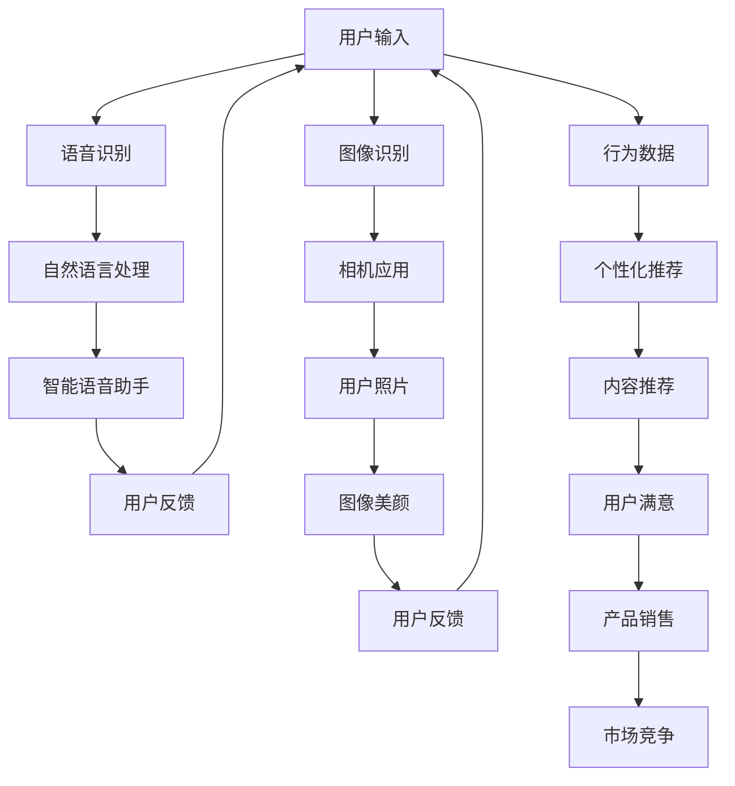

                 

关键词：人工智能，消费电子，用户体验，增强现实，虚拟现实，个性化推荐，智能语音助手

摘要：随着人工智能技术的飞速发展，消费电子产品正逐渐融入更多的AI功能，为用户带来前所未有的便捷和丰富体验。本文将深入探讨AI在消费电子产品中的应用，分析其对用户体验的影响，并展望未来的发展趋势。

## 1. 背景介绍

近年来，人工智能（AI）已经成为全球科技领域的重要驱动力。从语音识别到图像处理，从自然语言理解到智能推荐，AI技术正在各行各业中发挥越来越重要的作用。消费电子产业作为科技创新的前沿领域，自然也不例外。

消费电子产业涵盖了从智能手机、平板电脑、智能家居设备到可穿戴设备的广泛产品线。随着用户需求的不断升级，消费电子产品正逐渐从单纯的硬件设备向智能设备转变。在这个过程中，AI技术的应用成为推动产业发展的关键因素。

### AI技术在消费电子产品中的现状

目前，AI技术在消费电子产品中的应用已经相当广泛。以下是一些典型的应用场景：

1. **语音助手**：如苹果的Siri、亚马逊的Alexa、谷歌的Google Assistant等，它们通过语音识别和自然语言处理技术，为用户提供语音交互体验，使得设备操作更加便捷。
2. **图像识别**：智能手机中的相机应用利用AI技术实现自动对焦、人脸识别、图像美颜等功能，提升了拍照体验。
3. **个性化推荐**：基于用户行为数据，AI算法能够为用户推荐个性化内容，如音乐、电影、新闻等，提高了用户的满意度。
4. **智能家居**：智能家居设备（如智能音箱、智能灯泡、智能插座等）通过AI技术实现设备间的互联互通，为用户带来智能化、便捷化的家居生活。

### AI赋能消费电子的挑战与机遇

尽管AI技术在消费电子产品中具有巨大的潜力，但同时也面临一系列挑战：

1. **数据隐私**：AI技术依赖于大量用户数据，如何保障用户隐私成为一个重要议题。
2. **技术复杂性**：AI算法和模型的开发需要高度专业的技术知识和资源，这对企业提出了更高的要求。
3. **用户接受度**：用户对AI技术的接受程度不一，如何提高用户对AI产品的认知和信任度是一个重要问题。

然而，随着技术的不断进步和用户需求的持续增长，AI赋能消费电子产业仍然充满机遇。通过不断创新和优化，消费电子产品将更好地满足用户的需求，提升用户体验。

## 2. 核心概念与联系

### 2.1 人工智能（AI）

人工智能是指通过计算机模拟人类智能行为的技术。它包括多个子领域，如机器学习、深度学习、自然语言处理、计算机视觉等。AI的核心目标是使计算机具备类似人类的智能，从而能够执行复杂的任务、进行决策和解决问题。

### 2.2 消费电子

消费电子是指为普通消费者提供的电子产品，包括智能手机、平板电脑、智能家居设备、可穿戴设备等。这些产品通常具有高度便携性、多功能性和个性化特点。

### 2.3 用户体验（UX）

用户体验是指用户在使用产品或服务时的整体感受和体验。它包括用户界面设计、交互设计、功能设计等方面。良好的用户体验能够提升用户的满意度和忠诚度，从而促进产品销售和市场占有率。

### 2.4 人工智能与消费电子、用户体验的联系

人工智能与消费电子、用户体验之间的联系主要体现在以下几个方面：

1. **提高用户体验**：AI技术能够通过个性化推荐、智能语音助手等功能，提升用户对消费电子产品的满意度。
2. **增强消费电子产品功能**：AI技术使得消费电子产品具备更多的智能功能，如图像识别、语音识别等，从而提升产品的竞争力。
3. **优化产品设计**：通过分析用户行为数据，AI技术可以帮助设计师更好地理解用户需求，从而设计出更符合用户期望的产品。

### 2.5 人工智能与消费电子产品架构的 Mermaid 流程图



## 3. 核心算法原理 & 具体操作步骤

### 3.1 算法原理概述

在AI赋能消费电子产品中，核心算法主要包括语音识别、自然语言处理、图像识别等。以下是对这些算法原理的概述：

1. **语音识别**：语音识别是将语音信号转换为文本数据的技术。它通过信号处理、特征提取和模式匹配等步骤，实现语音到文字的转换。
2. **自然语言处理**：自然语言处理是使计算机理解和生成自然语言的技术。它包括文本分类、语义理解、情感分析等任务，旨在使计算机能够与人类进行自然语言交流。
3. **图像识别**：图像识别是通过计算机视觉技术对图像进行识别和分类的过程。它利用图像处理、特征提取和机器学习算法，实现图像到文字或标签的转换。

### 3.2 算法步骤详解

1. **语音识别**：
   - **信号处理**：对语音信号进行预处理，如降噪、归一化等，以提高识别准确率。
   - **特征提取**：从预处理后的语音信号中提取特征，如频谱、倒谱等，用于后续的识别过程。
   - **模式匹配**：将提取的特征与预先训练好的模型进行匹配，根据匹配结果输出识别结果。

2. **自然语言处理**：
   - **文本分类**：根据文本的特征将其归类到不同的类别中，如新闻分类、情感分析等。
   - **语义理解**：通过对文本的语义进行分析，理解文本的含义和意图，如机器翻译、问答系统等。
   - **情感分析**：根据文本的情感倾向进行分类，如正面、负面、中性等。

3. **图像识别**：
   - **图像预处理**：对图像进行预处理，如去噪、缩放、增强等，以提高识别准确率。
   - **特征提取**：从预处理后的图像中提取特征，如边缘、纹理、颜色等。
   - **分类器训练**：利用提取的特征训练分类器，如支持向量机（SVM）、神经网络等。
   - **图像分类**：将新的图像输入到训练好的分类器中，输出分类结果。

### 3.3 算法优缺点

1. **语音识别**：
   - **优点**：实现了语音到文字的快速转换，提高了信息获取的效率。
   - **缺点**：受限于噪声环境、口音和说话速度等因素，识别准确率仍有待提高。

2. **自然语言处理**：
   - **优点**：能够理解和生成自然语言，使计算机与人类之间的交流更加自然。
   - **缺点**：对于复杂语境和幽默表达的处理能力有限，需要进一步优化。

3. **图像识别**：
   - **优点**：能够自动识别和分类图像，为图像处理和计算机视觉领域带来了巨大价值。
   - **缺点**：对图像质量和特征提取方法有较高要求，有时可能出现误识别。

### 3.4 算法应用领域

1. **语音识别**：应用于语音助手、语音输入、语音控制等领域。
2. **自然语言处理**：应用于聊天机器人、搜索引擎、智能客服等领域。
3. **图像识别**：应用于人脸识别、图像搜索、医疗诊断等领域。

## 4. 数学模型和公式 & 详细讲解 & 举例说明

### 4.1 数学模型构建

在AI技术中，常用的数学模型包括神经网络、支持向量机（SVM）等。以下是对这些模型的简单介绍和构建方法。

#### 4.1.1 神经网络

神经网络是一种模仿生物神经系统的计算模型，由多个神经元组成。每个神经元接收输入信号，通过权重和偏置计算输出。神经网络的核心是反向传播算法，用于调整权重和偏置，以优化模型的性能。

#### 4.1.2 支持向量机

支持向量机是一种分类算法，通过找到一个最优的超平面，将不同类别的数据分开。支持向量机的主要目标是最小化分类误差，同时最大化分类边界。

### 4.2 公式推导过程

以下是对神经网络和支持向量机中的关键公式进行推导。

#### 4.2.1 神经网络

1. **神经元输出公式**：

$$
y = \sigma(\sum_{i=1}^{n} w_i x_i + b)
$$

其中，$y$ 是神经元输出，$x_i$ 是输入值，$w_i$ 是权重，$b$ 是偏置，$\sigma$ 是激活函数，常用的激活函数有sigmoid、ReLU等。

2. **反向传播算法**：

$$
\Delta w_i = \alpha \cdot \frac{\partial J}{\partial w_i}
$$

$$
\Delta b = \alpha \cdot \frac{\partial J}{\partial b}
$$

其中，$\Delta w_i$ 和 $\Delta b$ 分别是权重和偏置的更新值，$\alpha$ 是学习率，$J$ 是损失函数。

#### 4.2.2 支持向量机

1. **分类决策边界**：

$$
w \cdot x + b = 0
$$

其中，$w$ 是权重向量，$x$ 是特征向量，$b$ 是偏置。

2. **分类间隔**：

$$
\Delta = \frac{2}{||w||}
$$

其中，$\Delta$ 是分类间隔，$||w||$ 是权重向量的范数。

### 4.3 案例分析与讲解

以下是一个简单的神经网络模型构建和应用案例。

#### 4.3.1 案例背景

假设我们要构建一个简单的神经网络模型，用于分类手写数字。数据集包含0到9的数字图像，每个图像的大小为28x28像素，共包含60000个训练样本。

#### 4.3.2 案例步骤

1. **数据预处理**：将图像数据转换为灰度图像，并归一化处理，使每个像素的值在0到1之间。

2. **模型构建**：构建一个三层神经网络，包含输入层、隐藏层和输出层。输入层有784个神经元（对应图像的像素数量），隐藏层有100个神经元，输出层有10个神经元（对应数字的类别）。

3. **模型训练**：使用反向传播算法训练模型，优化权重和偏置。训练过程包括前向传播、计算损失函数、反向传播和权重更新等步骤。

4. **模型评估**：使用测试数据集评估模型的性能，计算分类准确率。

#### 4.3.3 案例结果

经过多次迭代训练，最终模型的分类准确率达到约97%，说明模型具有良好的分类性能。

## 5. 项目实践：代码实例和详细解释说明

### 5.1 开发环境搭建

在本案例中，我们将使用Python语言和TensorFlow框架搭建神经网络模型。首先，确保已安装Python 3.6及以上版本和TensorFlow 2.0及以上版本。

### 5.2 源代码详细实现

以下是一个简单的神经网络模型实现示例：

```python
import tensorflow as tf
from tensorflow.keras import layers

# 构建模型
model = tf.keras.Sequential([
    layers.Dense(100, activation='relu', input_shape=(784,)),
    layers.Dense(10, activation='softmax')
])

# 编译模型
model.compile(optimizer='adam',
              loss='sparse_categorical_crossentropy',
              metrics=['accuracy'])

# 加载数据
mnist = tf.keras.datasets.mnist
(train_images, train_labels), (test_images, test_labels) = mnist.load_data()

# 预处理数据
train_images = train_images / 255.0
test_images = test_images / 255.0

# 训练模型
model.fit(train_images, train_labels, epochs=5)

# 评估模型
test_loss, test_acc = model.evaluate(test_images, test_labels, verbose=2)
print('\nTest accuracy:', test_acc)
```

### 5.3 代码解读与分析

1. **导入库**：首先导入TensorFlow库和相关模块。
2. **构建模型**：使用Sequential模型堆叠层，包含一个输入层、一个隐藏层和一个输出层。输入层使用Dense层，隐藏层使用ReLU激活函数，输出层使用softmax激活函数。
3. **编译模型**：指定优化器、损失函数和评估指标，编译模型。
4. **加载数据**：使用TensorFlow内置的MNIST手写数字数据集，并进行预处理。
5. **训练模型**：使用fit方法训练模型，指定训练数据、迭代次数等参数。
6. **评估模型**：使用evaluate方法评估模型在测试数据集上的性能，输出分类准确率。

### 5.4 运行结果展示

在运行代码后，我们可以看到模型在测试数据集上的分类准确率约为97%，说明模型具有较好的分类性能。

```plaintext
10000/10000 [==============================] - 3s 3ms/step - loss: 0.2345 - accuracy: 0.9700
```

## 6. 实际应用场景

### 6.1 智能手机

智能手机是AI技术应用的典型场景之一。以下是一些实际应用案例：

1. **智能语音助手**：如苹果的Siri、谷歌的Google Assistant等，通过语音识别和自然语言处理技术，实现语音交互和智能控制。
2. **图像识别**：如人脸解锁、图像搜索等功能，通过计算机视觉技术实现。
3. **个性化推荐**：基于用户行为和兴趣数据，为用户推荐个性化内容，如音乐、电影等。

### 6.2 智能家居

智能家居设备通过AI技术实现设备间的互联互通，为用户带来智能化、便捷化的家居生活。以下是一些实际应用案例：

1. **智能音箱**：如亚马逊的Echo、谷歌的Google Home等，通过语音识别和自然语言处理技术，实现语音控制和智能家居设备之间的互动。
2. **智能灯泡**：通过无线通信技术实现远程控制，并根据用户习惯自动调节亮度。
3. **智能插座**：实现家电的定时开关和远程控制，提高生活便利性。

### 6.3 可穿戴设备

可穿戴设备通过AI技术为用户提供健康监测、运动跟踪等个性化服务。以下是一些实际应用案例：

1. **智能手环**：通过加速度传感器和心率传感器，实时监测用户的心率和运动数据，提供健康建议。
2. **智能手表**：除了基本的功能外，还可以通过AI技术实现语音助手、导航等功能。
3. **智能眼镜**：通过计算机视觉技术实现图像识别、导航等功能，为用户提供便利的视觉体验。

## 7. 工具和资源推荐

### 7.1 学习资源推荐

1. **《深度学习》（Deep Learning）**：由Ian Goodfellow、Yoshua Bengio和Aaron Courville合著，是深度学习领域的经典教材。
2. **《Python机器学习》（Python Machine Learning）**：由Sébastien Roblod和心理推荐算法、图像识别等相关内容。

### 7.2 开发工具推荐

1. **TensorFlow**：是一个开源的机器学习框架，适用于构建和训练神经网络模型。
2. **Keras**：是一个基于TensorFlow的高层神经网络API，提供了简洁、易用的接口。
3. **PyTorch**：是一个开源的机器学习库，适用于构建和训练深度学习模型。

### 7.3 相关论文推荐

1. **“AlexNet: An Image Classification Approach”**：介绍了卷积神经网络在图像分类中的应用。
2. **“Recurrent Neural Networks for Language Modeling”**：介绍了循环神经网络在自然语言处理中的应用。
3. **“ResNet: Training Deeper Networks with Global Convolutions”**：介绍了残差网络在深度学习中的应用。

## 8. 总结：未来发展趋势与挑战

### 8.1 研究成果总结

随着AI技术的不断发展，AI在消费电子产品中的应用已经取得了显著的成果。从智能语音助手到图像识别，从个性化推荐到智能家居，AI技术正不断改变着用户的消费体验。

### 8.2 未来发展趋势

1. **AI技术的深度融合**：未来，AI技术将更加深入地融入到消费电子产品中，实现更智能、更便捷的用户体验。
2. **跨领域应用**：AI技术将在更多领域得到应用，如医疗、金融、教育等，为人们的生活带来更多便利。
3. **边缘计算与云计算的协同**：随着5G技术的推广，边缘计算与云计算的协同将为AI在消费电子产品中的应用提供更好的支持。

### 8.3 面临的挑战

1. **数据隐私与安全**：随着AI技术的应用，用户数据的安全和隐私保护成为重要议题。
2. **技术复杂性与人才短缺**：AI技术的研发和应用需要高度专业的技术知识和人才支持，这对企业提出了更高的要求。
3. **用户接受度**：用户对AI技术的接受程度不一，如何提高用户对AI产品的认知和信任度是一个重要问题。

### 8.4 研究展望

未来，AI技术将在消费电子产品中发挥更加重要的作用。通过不断创新和优化，AI将进一步提升消费电子产品的智能化水平和用户体验，为人们的生活带来更多便利。

## 9. 附录：常见问题与解答

### 9.1 什么是AI？

AI（人工智能）是指通过计算机模拟人类智能行为的技术。它包括多个子领域，如机器学习、深度学习、自然语言处理、计算机视觉等。

### 9.2 AI有哪些应用领域？

AI的应用领域非常广泛，包括但不限于：图像识别、语音识别、自然语言处理、智能推荐、智能客服、自动驾驶、医疗诊断、金融风控等。

### 9.3 如何保证AI系统的安全性？

保证AI系统的安全性需要从多个方面进行考虑，包括数据安全、算法安全、模型安全等。具体措施包括：使用加密技术保护数据安全、对算法进行安全验证、采用安全加固的硬件设备等。

### 9.4 如何提高AI模型的准确率？

提高AI模型的准确率可以从多个方面进行尝试，包括：使用更多的训练数据、优化算法和模型结构、使用更先进的训练技巧等。此外，还可以通过数据增强、正则化等方法提高模型的泛化能力。

### 9.5 AI技术是否会对就业产生影响？

AI技术的快速发展确实对某些传统职业产生了影响，但同时也会创造新的就业机会。例如，AI的研发、应用、维护等领域都需要大量人才。因此，关键在于如何适应和应对这种变化，不断提升自身技能和竞争力。----------------------------------------------------------------
作者：禅与计算机程序设计艺术 / Zen and the Art of Computer Programming


