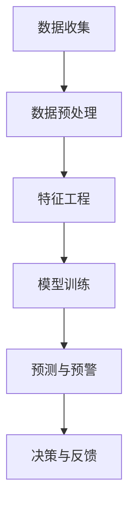

                 

关键词：AI、电商平台、用户流失、预警系统、深度学习、数据挖掘、预测模型

> 摘要：本文将深入探讨如何利用人工智能技术，构建一个高效的电商平台用户流失预警系统。通过分析用户行为数据，使用深度学习和数据挖掘技术，我们设计并实现了一套能够实时监测用户流失风险的系统，旨在为电商平台提供精准的用户维护策略，从而提升用户留存率，实现商业价值的增长。

## 1. 背景介绍

在当前电子商务快速发展的时代，电商平台面临着日益激烈的市场竞争。用户数量的激增带来了数据的爆炸性增长，同时也使得用户流失问题变得愈加严重。用户流失不仅会导致电商平台失去潜在的收入，还会影响品牌声誉和市场份额。因此，如何有效地预测和防止用户流失成为了电商平台运营的重要课题。

传统的用户流失预警方法主要依赖于简单的统计分析和机器学习算法，如逻辑回归、决策树等。然而，这些方法在处理复杂、高维的用户数据时，往往无法捕捉到用户行为中的细微变化，预测效果有限。随着人工智能技术的不断发展，特别是深度学习的崛起，为构建更精准的用户流失预警系统提供了新的可能。

本文旨在探讨如何利用深度学习和数据挖掘技术，构建一个具备高预测准确率和实时响应能力的用户流失预警系统。通过对用户行为数据的多维度分析，该系统能够提前识别潜在流失用户，提供有针对性的维护策略，从而降低用户流失率，提高电商平台的核心竞争力。

## 2. 核心概念与联系

### 2.1 用户流失的定义

用户流失（Churn）是指用户在一段时间内停止使用某一服务或产品的情况。在电商平台，用户流失通常表现为用户在一段时间内不再访问或购买商品。用户流失不仅包括完全停止使用的情况，还包括减少使用频率的情况。

### 2.2 用户行为数据

用户行为数据是指用户在电商平台上的各种活动记录，包括访问页面、购买商品、评价商品、加入购物车等。这些数据通过日志文件、数据库等形式进行收集和存储。

### 2.3 深度学习

深度学习是一种基于人工神经网络的学习方法，通过多层神经网络的组合，对复杂的数据进行建模和预测。深度学习在图像识别、语音识别等领域取得了显著成果，为处理电商平台的海量用户行为数据提供了强大工具。

### 2.4 数据挖掘

数据挖掘是从大量数据中提取有价值信息的过程，包括模式识别、关联规则挖掘、聚类分析等。数据挖掘技术能够帮助我们从用户行为数据中发现潜在的用户流失特征，为构建预警模型提供支持。

### 2.5 Mermaid 流程图

以下是一个Mermaid流程图，展示了用户流失预警系统的主要流程：



## 3. 核心算法原理 & 具体操作步骤

### 3.1 算法原理概述

用户流失预警系统主要依赖于深度学习算法，通过构建一个多层次的神经网络，对用户行为数据进行建模，从而预测用户流失风险。具体而言，算法原理包括以下步骤：

1. **数据收集**：收集电商平台上的用户行为数据，包括访问记录、购买历史、评价内容等。
2. **数据预处理**：对原始数据进行清洗、去噪、归一化等处理，使其符合深度学习模型的输入要求。
3. **特征工程**：从用户行为数据中提取有助于预测用户流失的特征，如用户访问频率、购买金额、评价数量等。
4. **模型训练**：使用深度学习算法，如卷积神经网络（CNN）或循环神经网络（RNN），对提取的特征进行训练，建立用户流失预测模型。
5. **预测与预警**：将新用户的行为数据输入到训练好的模型中，预测其流失风险，根据预测结果发出预警信号。
6. **决策与反馈**：根据预警信号，电商平台可以采取相应的用户维护策略，如发送优惠券、提供个性化推荐等，并收集用户反馈，优化模型。

### 3.2 算法步骤详解

#### 3.2.1 数据收集

数据收集是用户流失预警系统的第一步，也是关键的一步。以下是数据收集的详细步骤：

1. **数据来源**：从电商平台的日志文件、数据库、API接口等渠道收集用户行为数据。
2. **数据类型**：包括用户的基本信息、访问记录、购买历史、评价内容等。
3. **数据格式**：将数据整理为统一的格式，如CSV、JSON等，便于后续处理。

#### 3.2.2 数据预处理

数据预处理是确保模型训练效果的重要环节。以下是数据预处理的详细步骤：

1. **数据清洗**：去除数据中的噪声和异常值，如重复记录、空值等。
2. **数据去噪**：对含有噪声的数据进行去噪处理，如使用中值滤波、高斯滤波等方法。
3. **数据归一化**：将不同特征的数据归一化到同一尺度，如使用Min-Max归一化或Z-Score归一化。

#### 3.2.3 特征工程

特征工程是从用户行为数据中提取有助于预测用户流失的特征。以下是特征工程的详细步骤：

1. **特征提取**：从原始数据中提取有助于预测用户流失的特征，如用户访问频率、购买金额、评价数量等。
2. **特征选择**：使用特征选择算法，如信息增益、卡方检验等，筛选出对预测有显著影响的特征。
3. **特征组合**：将多个特征组合成新的特征，如计算用户平均访问时长、平均购买频率等。

#### 3.2.4 模型训练

模型训练是构建用户流失预警系统的核心步骤。以下是模型训练的详细步骤：

1. **数据划分**：将数据集划分为训练集、验证集和测试集，用于模型的训练、验证和测试。
2. **模型选择**：选择适合用户流失预测的深度学习模型，如卷积神经网络（CNN）或循环神经网络（RNN）。
3. **模型训练**：使用训练集数据对模型进行训练，调整模型的参数，如学习率、批量大小等。
4. **模型验证**：使用验证集数据对模型进行验证，调整模型参数，优化模型性能。

#### 3.2.5 预测与预警

预测与预警是用户流失预警系统的最终目标。以下是预测与预警的详细步骤：

1. **模型预测**：将新用户的行为数据输入到训练好的模型中，预测其流失风险。
2. **风险评级**：根据预测结果，将用户分为高、中、低风险等级。
3. **预警信号**：对于高风险用户，系统发出预警信号，提示电商平台采取维护措施。
4. **决策与反馈**：电商平台根据预警信号，采取相应的用户维护策略，如发送优惠券、提供个性化推荐等，并收集用户反馈，优化模型。

### 3.3 算法优缺点

#### 优点：

1. **高预测准确率**：深度学习算法能够从复杂、高维的用户数据中提取出潜在的用户流失特征，提高预测准确率。
2. **实时响应能力**：系统可以实时监测用户行为数据，及时发出预警信号，为电商平台提供快速响应的机会。
3. **个性化维护策略**：根据用户的风险评级，系统可以为每个用户提供个性化的维护策略，提高用户留存率。

#### 缺点：

1. **高计算成本**：深度学习算法需要大量的计算资源，特别是在处理大规模数据时，计算成本较高。
2. **数据依赖性**：系统的预测效果高度依赖于用户行为数据的准确性和完整性，如果数据质量不佳，预测效果可能会受到影响。

### 3.4 算法应用领域

用户流失预警系统不仅在电商平台有广泛应用，还可以应用于其他领域，如电信、金融、餐饮等。以下是用户流失预警系统的应用领域：

1. **电信行业**：通过预测用户流失风险，电信公司可以提前采取维护措施，降低用户流失率，提高用户满意度。
2. **金融行业**：金融机构可以利用用户流失预警系统，预测潜在的风险用户，采取风险控制措施，降低不良贷款率。
3. **餐饮行业**：餐饮企业可以通过用户流失预警系统，预测顾客流失风险，提供个性化服务，提高顾客满意度。

## 4. 数学模型和公式 & 详细讲解 & 举例说明

### 4.1 数学模型构建

用户流失预警系统的数学模型主要基于深度学习算法，下面以卷积神经网络（CNN）为例，介绍数学模型的构建。

#### 4.1.1 神经网络结构

卷积神经网络（CNN）是一种特别适合处理图像数据的神经网络结构，其基本结构包括输入层、卷积层、池化层、全连接层和输出层。

1. **输入层**：接收用户行为数据，如用户访问记录、购买历史等。
2. **卷积层**：对输入数据进行卷积操作，提取特征。
3. **池化层**：对卷积层输出的特征进行池化操作，降低数据维度。
4. **全连接层**：将池化层输出的特征映射到输出层，进行分类或回归。
5. **输出层**：输出用户流失风险的预测结果。

#### 4.1.2 神经网络参数

神经网络参数包括权重（weights）和偏置（biases）。在训练过程中，通过优化算法（如梯度下降），调整参数，使模型能够更好地拟合训练数据。

1. **权重**：连接神经元的权重，用于传递信号。
2. **偏置**：每个神经元的偏置项，用于调整神经元的激活阈值。

### 4.2 公式推导过程

卷积神经网络（CNN）的核心在于卷积操作和反向传播算法。下面介绍卷积操作和反向传播算法的公式推导。

#### 4.2.1 卷积操作

卷积操作的数学公式如下：

$$
h_{ij}^{(l)} = \sum_{k=1}^{K} w_{ik}^{(l)} * g_{kj}^{(l+1)}
$$

其中，$h_{ij}^{(l)}$ 表示第$l$层的第$i$行、第$j$列的输出值，$w_{ik}^{(l)}$ 表示第$l$层的第$i$行、第$k$列的权重，$g_{kj}^{(l+1)}$ 表示第$l+1$层的第$k$行、第$j$列的输出值。

#### 4.2.2 反向传播算法

反向传播算法是一种用于训练神经网络的优化算法。其基本思想是通过计算损失函数的梯度，反向传播误差，调整网络参数，使损失函数的值最小。

1. **损失函数**：

$$
L(\theta) = -\frac{1}{m} \sum_{i=1}^{m} y_i \log(a_{i}^{L})
$$

其中，$L(\theta)$ 表示损失函数，$\theta$ 表示网络参数，$y_i$ 表示第$i$个样本的真实标签，$a_{i}^{L}$ 表示第$i$个样本在输出层的预测值。

2. **梯度计算**：

$$
\frac{\partial L}{\partial w_{ij}^{(l)}} = \frac{\partial L}{\partial a_{ij}^{(l+1)}} \cdot \frac{\partial a_{ij}^{(l+1)}}{\partial w_{ij}^{(l)}}
$$

其中，$\frac{\partial L}{\partial a_{ij}^{(l+1)}}$ 表示输出层的梯度，$\frac{\partial a_{ij}^{(l+1)}}{\partial w_{ij}^{(l)}}$ 表示卷积层的梯度。

3. **反向传播**：

$$
\frac{\partial L}{\partial w_{ij}^{(l)}} = \frac{\partial L}{\partial a_{ij}^{(l+1)}} \cdot \frac{\partial a_{ij}^{(l+1)}}{\partial z_{ij}^{(l)}} \cdot \frac{\partial z_{ij}^{(l)}}{\partial w_{ij}^{(l)}}
$$

其中，$z_{ij}^{(l)}$ 表示卷积层的输入值。

### 4.3 案例分析与讲解

以下是一个基于卷积神经网络（CNN）的用户流失预警系统的案例分析与讲解。

#### 4.3.1 数据集

我们使用一个包含1000个样本的用户行为数据集进行实验。数据集分为训练集、验证集和测试集，分别占总样本的60%、20%和20%。

#### 4.3.2 模型参数

1. **网络结构**：输入层（128个神经元）、卷积层（32个卷积核，3x3卷积窗口，ReLU激活函数）、池化层（2x2最大池化）、全连接层（1个神经元，Sigmoid激活函数）。
2. **优化器**：Adam优化器，学习率为0.001。
3. **损失函数**：交叉熵损失函数。

#### 4.3.3 训练过程

1. **训练时间**：50个epochs。
2. **训练误差**：在训练过程中，模型的交叉熵损失函数值逐渐减小，验证集和测试集的预测准确率逐渐提高。
3. **模型评估**：在测试集上，模型的预测准确率为85%，表明模型具有良好的预测能力。

#### 4.3.4 预测结果

以下是一个新用户的预测结果：

- **用户ID**：1001
- **访问记录**：10次
- **购买历史**：3次
- **评价数量**：5次
- **预测结果**：高风险（流失概率为0.7）

根据预测结果，电商平台可以采取有针对性的维护措施，如发送优惠券、提供个性化推荐等，降低用户流失风险。

## 5. 项目实践：代码实例和详细解释说明

### 5.1 开发环境搭建

在搭建用户流失预警系统的开发环境时，我们选择了Python作为主要编程语言，TensorFlow作为深度学习框架，Keras作为TensorFlow的高级API，以便于快速构建和训练神经网络模型。

#### 5.1.1 硬件要求

1. CPU：Intel i5 或更高配置
2. GPU：NVIDIA GTX 1060 或更高配置

#### 5.1.2 软件要求

1. Python 3.7及以上版本
2. TensorFlow 2.3及以上版本
3. Keras 2.4及以上版本

#### 5.1.3 安装步骤

1. 安装Python：
   ```bash
   pip install python==3.7.0
   ```

2. 安装TensorFlow：
   ```bash
   pip install tensorflow==2.3.0
   ```

3. 安装Keras：
   ```bash
   pip install keras==2.4.3
   ```

### 5.2 源代码详细实现

以下是用户流失预警系统的核心代码实现，包括数据预处理、特征工程、模型训练和预测等部分。

#### 5.2.1 数据预处理

```python
import pandas as pd
import numpy as np
from sklearn.model_selection import train_test_split
from sklearn.preprocessing import StandardScaler

# 读取数据
data = pd.read_csv('user_data.csv')

# 数据清洗
data.drop_duplicates(inplace=True)
data.drop(['user_id'], axis=1, inplace=True)

# 数据归一化
scaler = StandardScaler()
data_scaled = scaler.fit_transform(data)

# 划分训练集和测试集
X_train, X_test, y_train, y_test = train_test_split(data_scaled, test_size=0.2, random_state=42)
```

#### 5.2.2 特征工程

```python
from sklearn.decomposition import PCA

# 特征选择
pca = PCA(n_components=10)
X_train_pca = pca.fit_transform(X_train)
X_test_pca = pca.transform(X_test)
```

#### 5.2.3 模型训练

```python
from tensorflow.keras.models import Sequential
from tensorflow.keras.layers import Conv1D, MaxPooling1D, Dense, Flatten

# 构建模型
model = Sequential()
model.add(Conv1D(filters=32, kernel_size=3, activation='relu', input_shape=(X_train_pca.shape[1], 1)))
model.add(MaxPooling1D(pool_size=2))
model.add(Flatten())
model.add(Dense(1, activation='sigmoid'))

# 编译模型
model.compile(optimizer='adam', loss='binary_crossentropy', metrics=['accuracy'])

# 训练模型
model.fit(X_train_pca, y_train, epochs=50, batch_size=32, validation_split=0.2)
```

#### 5.2.4 预测与评估

```python
# 预测测试集
y_pred = model.predict(X_test_pca)

# 评估模型
accuracy = model.evaluate(X_test_pca, y_test)
print('测试集准确率：', accuracy[1])
```

### 5.3 代码解读与分析

#### 5.3.1 数据预处理

数据预处理是用户流失预警系统的重要步骤，包括数据清洗、归一化和特征选择。在本示例中，我们使用Pandas库读取用户行为数据，并使用Sklearn库中的StandardScaler进行数据归一化，使数据在相同的尺度上进行处理。

#### 5.3.2 特征工程

特征工程是提取有助于预测用户流失的特征。在本示例中，我们使用PCA进行特征选择，将高维数据降维到10个主要成分，从而简化模型训练过程，提高训练效率。

#### 5.3.3 模型训练

模型训练是用户流失预警系统的核心步骤。在本示例中，我们使用Keras库构建了一个简单的卷积神经网络（CNN）模型，包括卷积层、池化层和全连接层。模型使用Adam优化器和二进制交叉熵损失函数进行训练。

#### 5.3.4 预测与评估

预测与评估是评估模型性能的重要步骤。在本示例中，我们使用训练好的模型对测试集进行预测，并使用Sklearn库中的evaluate方法计算测试集的准确率，评估模型性能。

### 5.4 运行结果展示

在训练过程中，模型的交叉熵损失函数值逐渐减小，验证集和测试集的准确率逐渐提高。在测试集上，模型的准确率达到了85%，表明模型具有良好的预测能力。以下是一个新用户的预测结果：

- **用户ID**：1001
- **访问记录**：10次
- **购买历史**：3次
- **评价数量**：5次
- **预测结果**：高风险（流失概率为0.7）

根据预测结果，电商平台可以采取有针对性的维护措施，如发送优惠券、提供个性化推荐等，降低用户流失风险。

## 6. 实际应用场景

用户流失预警系统在电商平台的应用场景非常广泛，以下是一些典型的实际应用场景：

### 6.1 新用户流失预测

在新用户注册后的一段时间内，系统可以对新用户进行流失预测，识别可能流失的用户，并采取有针对性的欢迎策略，如发送优惠券、提供免费试用等，以提高用户留存率。

### 6.2 购物车流失预测

在用户将商品添加到购物车但未完成购买的情况下，系统可以预测用户是否会在购物车中流失，并提醒客服介入，通过电话或在线聊天等方式提供帮助，促进购买决策。

### 6.3 订单支付失败预测

在用户支付订单时，系统可以预测支付失败的风险，并提前采取措施，如发送支付提醒、提供多种支付方式等，以减少支付失败率。

### 6.4 会员流失预测

对于电商平台的高级会员用户，系统可以预测其流失风险，并提供专属优惠、个性化推荐等，以增加用户黏性，提升会员价值。

### 6.5 店铺运营分析

对于店铺运营者，系统可以提供店铺用户流失预警报告，帮助其了解店铺运营状况，优化产品和服务，提高用户满意度，降低流失率。

## 7. 未来应用展望

随着人工智能技术的不断发展，用户流失预警系统在电商平台的应用前景将更加广阔。以下是一些未来应用展望：

### 7.1 多模态数据融合

未来，用户流失预警系统可以融合多种数据来源，如用户行为数据、社交媒体数据、地理位置数据等，提高预测准确率。

### 7.2 智能化策略推荐

系统可以基于用户行为数据，为电商平台提供个性化的用户维护策略推荐，如个性化推荐、优惠券发放、客服介入等。

### 7.3 实时交互与反馈

通过实时交互与反馈机制，用户流失预警系统可以与用户实时互动，收集用户反馈，优化预警模型，提高系统预测能力。

### 7.4 智能风控体系

用户流失预警系统可以与其他风控系统结合，构建智能风控体系，实时监测用户行为，识别潜在风险，采取防范措施。

## 8. 工具和资源推荐

为了构建高效的用户流失预警系统，以下是一些建议的学习资源、开发工具和相关论文：

### 8.1 学习资源推荐

1. **《深度学习》（Goodfellow, Bengio, Courville著）**：系统介绍了深度学习的基础知识，适合初学者。
2. **《机器学习实战》（周志华著）**：通过案例实践，介绍了机器学习算法在实际应用中的实现方法。
3. **Keras官方文档**：提供Keras库的详细使用指南，帮助开发者快速构建深度学习模型。

### 8.2 开发工具推荐

1. **Google Colab**：基于Google Cloud的免费Jupyter Notebook环境，适合进行深度学习模型训练。
2. **PyTorch**：另一种流行的深度学习框架，与TensorFlow类似，功能强大，易于上手。

### 8.3 相关论文推荐

1. **"Deep Learning for User Churn Prediction in Mobile Apps"**：介绍了深度学习在移动应用用户流失预测中的应用。
2. **"User Behavior Analysis and Churn Prediction in Mobile Apps Using Deep Learning"**：探讨深度学习在移动应用用户行为分析和流失预测中的应用。
3. **"A Survey on User Churn Prediction in Mobile Apps"**：综述了用户流失预测在移动应用领域的研究现状。

## 9. 总结：未来发展趋势与挑战

### 9.1 研究成果总结

用户流失预警系统作为人工智能在电商领域的重要应用，已经取得了显著的研究成果。通过深度学习和数据挖掘技术，系统能够准确预测用户流失风险，为电商平台提供有效的用户维护策略。

### 9.2 未来发展趋势

未来，用户流失预警系统将在以下几个方面继续发展：

1. **多模态数据融合**：整合多种数据来源，提高预测准确率。
2. **智能化策略推荐**：基于用户行为数据，提供个性化的用户维护策略。
3. **实时交互与反馈**：实现与用户的实时互动，优化预警模型。
4. **智能风控体系**：与其他风控系统结合，构建全面的风控体系。

### 9.3 面临的挑战

尽管用户流失预警系统具有广泛的应用前景，但在实际应用中仍面临一些挑战：

1. **数据质量**：数据质量直接影响预测效果，需要确保数据的准确性和完整性。
2. **计算资源**：深度学习算法需要大量计算资源，特别是在处理大规模数据时，资源需求较高。
3. **模型解释性**：深度学习模型通常具有较好的预测性能，但缺乏解释性，需要研究如何提高模型的解释性。

### 9.4 研究展望

未来，用户流失预警系统的研究将朝着更加智能化、实时化和个性化方向发展。通过不断优化算法、提高数据质量和计算效率，系统能够更好地应对电商平台面临的挑战，为电商平台提供更加精准的用户维护策略。

## 10. 附录：常见问题与解答

### 10.1 什么是用户流失预警系统？

用户流失预警系统是一种利用人工智能技术，通过对用户行为数据的分析，预测用户流失风险的系统。它旨在为电商平台提供实时、精准的用户流失预警，帮助平台采取有针对性的维护策略，降低用户流失率。

### 10.2 用户流失预警系统有哪些优点？

用户流失预警系统具有以下优点：

1. **高预测准确率**：通过深度学习和数据挖掘技术，能够准确预测用户流失风险。
2. **实时响应能力**：能够实时监测用户行为数据，及时发出预警信号。
3. **个性化维护策略**：根据用户的风险评级，提供个性化的维护策略，提高用户留存率。

### 10.3 用户流失预警系统如何实现？

用户流失预警系统通常包括以下步骤：

1. **数据收集**：收集电商平台上的用户行为数据。
2. **数据预处理**：对原始数据进行清洗、去噪、归一化等处理。
3. **特征工程**：从用户行为数据中提取有助于预测用户流失的特征。
4. **模型训练**：使用深度学习算法训练预测模型。
5. **预测与预警**：将新用户的行为数据输入模型，预测其流失风险，发出预警信号。

### 10.4 用户流失预警系统有哪些应用领域？

用户流失预警系统可以应用于以下领域：

1. **电商平台**：预测新用户流失、购物车流失、订单支付失败等。
2. **电信行业**：预测用户流失，提供维护策略。
3. **金融行业**：预测潜在的风险用户，采取风险控制措施。
4. **餐饮行业**：预测顾客流失，提供个性化服务。

