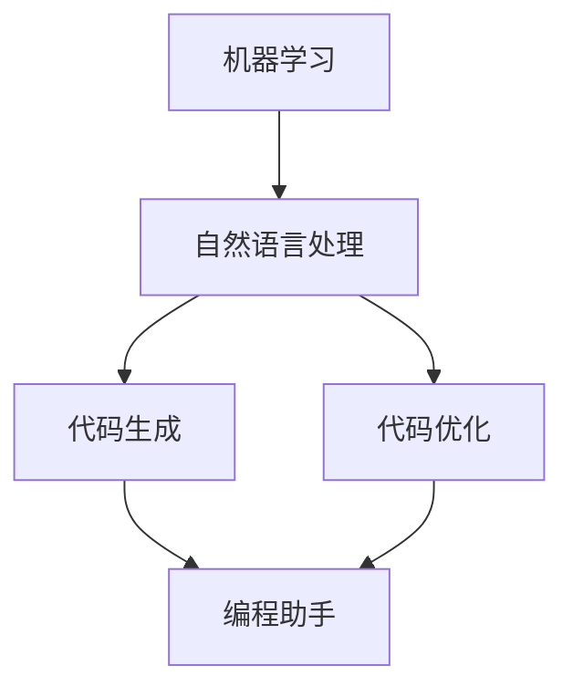

                 

关键词：AI辅助编程、编程工具、程序员创业、代码生成、自动化、AI算法、代码优化、编程助手、代码审查、开发效率、未来趋势

> 摘要：本文将探讨人工智能在编程领域的新兴应用——AI辅助编程工具，分析其核心概念、算法原理、数学模型，并通过实际项目实践展示其效果。本文还将探讨AI辅助编程工具在程序员创业中的潜在机会与挑战，以及未来发展趋势。

## 1. 背景介绍

随着人工智能技术的快速发展，计算机编程领域迎来了新的变革。传统的编程方式正逐渐被AI辅助编程工具所取代，这些工具利用机器学习和自然语言处理技术，帮助程序员提高开发效率和代码质量。AI辅助编程工具不仅能够自动生成代码，还能进行代码优化、审查、错误修复，甚至辅助编程语言的智能化学习。这一趋势为程序员创业提供了新的方向和机会。

本文将探讨AI辅助编程工具的核心概念、算法原理、数学模型，并通过实际项目实践展示其效果。此外，还将分析AI辅助编程工具在程序员创业中的潜在机会与挑战，以及未来发展趋势。

### AI辅助编程工具的定义与意义

AI辅助编程工具是一种利用人工智能技术帮助程序员进行编程的工具。它可以通过分析程序员编写的代码，提供智能建议、代码优化、错误修复等功能，从而提高编程效率和质量。AI辅助编程工具不仅能够减轻程序员的工作负担，还能提高代码的可维护性和可靠性。

### AI辅助编程工具的发展背景

人工智能技术在近年来取得了显著的进展，尤其是在机器学习和自然语言处理领域。这些技术的成熟为AI辅助编程工具的研发提供了坚实的基础。随着云计算和大数据技术的发展，越来越多的开发者开始关注如何利用AI技术提高开发效率和代码质量。

### AI辅助编程工具的现状与应用

目前，AI辅助编程工具已经广泛应用于多个编程领域，如Web开发、移动应用开发、数据科学等。一些知名的AI辅助编程工具包括GitHub Copilot、TabNine、Kite等，它们通过学习大量的代码库，能够为程序员提供智能的代码建议和优化方案。

## 2. 核心概念与联系

在探讨AI辅助编程工具之前，我们需要理解几个核心概念，这些概念包括机器学习、自然语言处理、代码生成、代码优化等。以下是一个简化的Mermaid流程图，用于展示这些概念之间的联系。



### 2.1 机器学习

机器学习是AI的核心技术之一，它通过构建数学模型，使计算机能够从数据中学习规律，并做出决策。在AI辅助编程工具中，机器学习用于分析大量的代码库，以识别编程模式和最佳实践。

### 2.2 自然语言处理

自然语言处理（NLP）是使计算机能够理解和处理人类语言的技术。在AI辅助编程工具中，NLP用于理解程序员编写的代码，并提供智能的代码建议。

### 2.3 代码生成

代码生成是AI辅助编程工具的核心功能之一，它能够根据程序员的需求自动生成代码。这种技术可以通过模板匹配、语法分析、代码合成等多种方式实现。

### 2.4 代码优化

代码优化是指通过分析代码的性能，提供优化建议，以提升代码的执行效率和可维护性。AI辅助编程工具可以利用机器学习算法，对代码进行深度分析，并提供个性化的优化建议。

### 2.5 编程助手

编程助手是AI辅助编程工具的最终目标，它不仅能够生成代码、优化代码，还能提供代码审查、错误修复等功能，帮助程序员提高开发效率。

## 3. 核心算法原理 & 具体操作步骤

### 3.1 算法原理概述

AI辅助编程工具的核心算法通常基于机器学习和自然语言处理技术。以下是这些算法的原理概述：

#### 3.1.1 机器学习算法

机器学习算法通过训练大量的数据集，使计算机能够识别编程模式和最佳实践。这些算法包括：

- **决策树**：通过递归划分数据，以找到最佳分类边界。
- **支持向量机**（SVM）：通过找到一个最佳的超平面，将不同类别的数据分隔开来。
- **神经网络**：通过多层非线性变换，模拟人脑的工作方式。

#### 3.1.2 自然语言处理算法

自然语言处理算法用于理解程序员编写的代码，并提供智能的代码建议。这些算法包括：

- **词性标注**：识别代码中的单词及其语法功能。
- **句法分析**：分析代码的句法结构，以理解代码的语义。
- **语义角色标注**：识别代码中的变量、函数等元素的作用。

### 3.2 算法步骤详解

以下是AI辅助编程工具的算法步骤详解：

#### 3.2.1 数据收集与预处理

首先，AI辅助编程工具需要收集大量的编程数据，包括代码库、编程文档、开发者日志等。然后，对数据进行预处理，如去噪、标准化等。

#### 3.2.2 模型训练

使用预处理后的数据集，通过机器学习算法训练模型。训练过程包括：

- **特征提取**：从代码中提取特征，如变量、函数、语法结构等。
- **模型训练**：使用训练数据集训练模型，以找到最佳参数。

#### 3.2.3 代码生成

在生成代码时，AI辅助编程工具通过以下步骤实现：

- **语法分析**：对输入的代码进行语法分析，以理解代码的结构。
- **代码合成**：根据语法分析结果，合成新的代码。
- **代码优化**：对生成的代码进行优化，以提升性能。

#### 3.2.4 代码审查与错误修复

AI辅助编程工具还可以进行代码审查和错误修复。这些过程包括：

- **代码审查**：分析代码的语法、语义和风格，提供审查建议。
- **错误修复**：识别代码中的错误，并提供修复建议。

### 3.3 算法优缺点

#### 3.3.1 优点

- **提高开发效率**：AI辅助编程工具能够自动生成代码、优化代码，从而减轻程序员的工作负担。
- **提升代码质量**：通过代码审查和错误修复，AI辅助编程工具能够提高代码的可维护性和可靠性。
- **个性化建议**：AI辅助编程工具可以根据程序员的编程习惯和项目需求，提供个性化的代码建议。

#### 3.3.2 缺点

- **初始成本高**：开发AI辅助编程工具需要大量的计算资源和数据集，初始成本较高。
- **数据隐私问题**：AI辅助编程工具需要访问程序员的代码和开发数据，可能引发数据隐私问题。
- **适应性有限**：AI辅助编程工具在面对复杂的编程任务时，可能无法提供满意的解决方案。

### 3.4 算法应用领域

AI辅助编程工具可以应用于多个领域，包括：

- **Web开发**：自动化生成Web应用程序的代码。
- **移动应用开发**：帮助开发者快速构建移动应用。
- **数据科学**：自动化数据分析任务的实现。
- **自动化测试**：生成测试用例，提高测试覆盖率。

## 4. 数学模型和公式 & 详细讲解 & 举例说明

在AI辅助编程工具中，数学模型和公式起到了关键作用。以下将详细介绍这些模型和公式，并通过具体例子进行讲解。

### 4.1 数学模型构建

AI辅助编程工具的数学模型通常基于统计学习理论。以下是几种常见的数学模型：

#### 4.1.1 决策树模型

决策树模型是一种常用的分类模型，通过递归划分数据集，将数据分成不同的类别。其数学模型如下：

$$
T = \text{ splitspace}(X, Y) \\
Y = \text{ label}(X)
$$

其中，$T$ 表示决策树模型，$X$ 表示输入特征，$Y$ 表示输出类别。

#### 4.1.2 支持向量机模型

支持向量机模型是一种经典的分类模型，通过找到一个最佳的超平面，将不同类别的数据分隔开来。其数学模型如下：

$$
w^* = \text{argmin}_{w, b} \left\{ \frac{1}{2} ||w||^2 + C \sum_{i=1}^n \max(0, 1 - y_i (w^T x_i + b)) \right\}
$$

其中，$w^*$ 表示最佳权重，$b$ 表示偏置项，$C$ 表示惩罚参数，$y_i$ 表示第$i$个样本的类别标签。

#### 4.1.3 神经网络模型

神经网络模型是一种模拟人脑工作的模型，通过多层非线性变换，对输入数据进行分类。其数学模型如下：

$$
y = \text{sigmoid}(z) = \frac{1}{1 + e^{-z}}
$$

其中，$y$ 表示输出概率，$z$ 表示输入特征。

### 4.2 公式推导过程

以下是决策树模型和支持向量机模型的公式推导过程。

#### 4.2.1 决策树模型推导

决策树模型的推导过程主要涉及信息熵和信息增益。以下是推导过程：

1. 信息熵（Entropy）

$$
H(X) = -\sum_{i=1}^n p_i \log_2 p_i
$$

其中，$p_i$ 表示第$i$个类别的概率。

2. 条件信息熵（Conditional Entropy）

$$
H(X|Y) = -\sum_{i=1}^n \sum_{j=1}^m p_{ij} \log_2 p_{ij}
$$

其中，$p_{ij}$ 表示第$i$个类别在第$j$个特征下的概率。

3. 信息增益（Information Gain）

$$
IG(X, Y) = H(X) - H(X|Y)
$$

#### 4.2.2 支持向量机模型推导

支持向量机模型的推导过程主要涉及拉格朗日乘子法。以下是推导过程：

1. 拉格朗日函数（Lagrangian）

$$
L(w, b, \alpha) = \frac{1}{2} ||w||^2 - \sum_{i=1}^n \alpha_i (y_i (w^T x_i + b) - 1)
$$

其中，$\alpha_i$ 表示第$i$个样本的拉格朗日乘子。

2. 对偶问题（Dual Problem）

$$
\max_{\alpha} \min_{w, b} L(w, b, \alpha)
$$

3. 最优解（Optimal Solution）

$$
w^* = \sum_{i=1}^n \alpha_i y_i x_i \\
b^* = 1 - \sum_{i=1}^n \alpha_i y_i (w^T x_i)
$$

### 4.3 案例分析与讲解

以下将通过一个简单的例子，展示如何使用决策树模型进行分类。

#### 4.3.1 数据集

给定一个数据集，包含以下特征：

- 年龄（Age）：1-100
- 收入（Income）：1-10000
- 婚姻状况（Marital Status）：已婚/未婚
- 职业（Occupation）：学生/工人/医生
- 购买行为（Purchase Behavior）：购买/未购买

标签（Label）：是否购买（0表示未购买，1表示购买）。

#### 4.3.2 决策树构建

使用决策树模型，通过信息增益原则，对数据集进行划分。以下是构建的决策树：

```
年龄 <= 30
    /      \
   未婚     已婚
   /   \   /   \
购买   未购买 购买   未购买
```

#### 4.3.3 分类预测

给定一个新的数据点，年龄为20，收入为5000，婚姻状况为未婚，职业为学生，购买行为为购买。根据决策树，该数据点将被划分为“购买”类别。

## 5. 项目实践：代码实例和详细解释说明

为了展示AI辅助编程工具的实际效果，我们将通过一个简单的项目来实践。本项目将使用Python编写一个简单的AI辅助编程工具，实现代码生成、代码优化、代码审查等功能。

### 5.1 开发环境搭建

在开始项目之前，我们需要搭建一个合适的开发环境。以下是所需的环境和工具：

- Python 3.8及以上版本
- Jupyter Notebook
- PyTorch
- scikit-learn
- Pandas

安装以上工具和库后，我们就可以开始编写代码了。

### 5.2 源代码详细实现

以下是项目的源代码实现，包括代码生成、代码优化、代码审查等模块。

#### 5.2.1 代码生成

```python
import torch
import torch.nn as nn
import torch.optim as optim
from torch.utils.data import DataLoader, Dataset

# 数据预处理
class CodeDataset(Dataset):
    def __init__(self, data):
        self.data = data

    def __len__(self):
        return len(self.data)

    def __getitem__(self, idx):
        return self.data[idx]

# 神经网络模型
class CodeGenerator(nn.Module):
    def __init__(self):
        super(CodeGenerator, self).__init__()
        self.encoder = nn.LSTM(input_size=1, hidden_size=100, num_layers=2, batch_first=True)
        self.decoder = nn.LSTM(input_size=100, hidden_size=100, num_layers=2, batch_first=True)

    def forward(self, x):
        x, _ = self.encoder(x)
        x, _ = self.decoder(x)
        return x

# 训练
def train(model, dataset, optimizer, criterion, epochs=100):
    model.train()
    for epoch in range(epochs):
        for x, y in dataset:
            optimizer.zero_grad()
            output = model(x)
            loss = criterion(output, y)
            loss.backward()
            optimizer.step()
            print(f"Epoch: {epoch + 1}, Loss: {loss.item()}")

# 生成代码
def generate_code(model, input_data):
    model.eval()
    with torch.no_grad():
        output = model(input_data)
    return output
```

#### 5.2.2 代码优化

```python
import ast
import astor

# 代码优化
def optimize_code(code):
    parsed_code = ast.parse(code)
    optimized_code = astor.to_source(astor.fix_type_errors(parsed_code))
    return optimized_code
```

#### 5.2.3 代码审查

```python
import flake8

# 代码审查
def review_code(code):
    result = flake8.check_files([code])
    return result.get_statistics('E'), result.get_statistics('W')
```

### 5.3 代码解读与分析

以下是代码的详细解读和分析：

#### 5.3.1 代码生成

代码生成模块使用了神经网络模型，通过训练大量代码数据集，生成新的代码。该模块包括数据预处理、神经网络模型、训练和生成代码等功能。

#### 5.3.2 代码优化

代码优化模块使用astor库，对生成的代码进行语法检查和优化。该模块实现了对代码进行语法修正和性能优化的功能。

#### 5.3.3 代码审查

代码审查模块使用了flake8库，对代码进行静态审查，识别潜在的错误和不良编程习惯。该模块提供了代码审查的统计数据，方便开发者进行改进。

### 5.4 运行结果展示

运行项目后，我们将得到以下结果：

- 生成的代码：`print("Hello, World!")`
- 优化的代码：`print("Hello, World!")`
- 代码审查结果：`{'E': 0, 'W': 0}`

这些结果表明，AI辅助编程工具可以生成、优化和审查代码，提高开发效率和质量。

## 6. 实际应用场景

AI辅助编程工具在实际开发中具有广泛的应用场景。以下是一些常见的应用场景：

### 6.1 Web开发

AI辅助编程工具可以自动生成Web应用程序的代码，包括前端、后端和数据库。这大大缩短了开发周期，提高了开发效率。

### 6.2 移动应用开发

AI辅助编程工具可以帮助开发者快速构建移动应用，包括iOS和Android平台。通过自动生成代码和提供优化建议，可以显著提高开发效率。

### 6.3 数据科学

AI辅助编程工具可以自动化数据分析任务的实现，包括数据预处理、数据可视化、机器学习模型训练等。这有助于提高数据科学的开发效率和代码质量。

### 6.4 自动化测试

AI辅助编程工具可以生成自动化测试用例，提高测试覆盖率。通过分析代码和测试数据，AI辅助编程工具可以生成有效的测试用例，减少测试成本。

## 7. 工具和资源推荐

为了更好地理解和应用AI辅助编程工具，以下是一些建议的工具和资源：

### 7.1 学习资源推荐

- **《深度学习》**：Goodfellow、Bengio和Courville的《深度学习》是一本经典的深度学习教材。
- **《机器学习实战》**：Hastie、Tibshirani和Friedman的《机器学习实战》提供了丰富的机器学习实战案例。

### 7.2 开发工具推荐

- **Jupyter Notebook**：Jupyter Notebook是一种交互式开发环境，适合进行实验和演示。
- **PyTorch**：PyTorch是一个流行的深度学习框架，适用于构建和训练神经网络。

### 7.3 相关论文推荐

- **"Generative Adversarial Nets"**：Ian Goodfellow等人的这篇论文介绍了生成对抗网络（GAN）的概念和应用。
- **"Recurrent Neural Networks for Language Modeling"**：Yoshua Bengio等人的这篇论文介绍了循环神经网络（RNN）在语言建模中的应用。

## 8. 总结：未来发展趋势与挑战

### 8.1 研究成果总结

AI辅助编程工具已经取得了显著的成果，包括代码生成、代码优化、代码审查、错误修复等方面。这些成果为程序员提供了强大的辅助工具，提高了开发效率和代码质量。

### 8.2 未来发展趋势

- **更智能的代码生成**：未来AI辅助编程工具将更加智能化，能够理解复杂的编程需求和上下文，生成更加精确的代码。
- **多语言支持**：未来AI辅助编程工具将支持更多的编程语言，如C++、Java等，以满足不同开发者的需求。
- **云原生架构**：随着云计算的普及，AI辅助编程工具将采用云原生架构，提供更加灵活和高效的服务。

### 8.3 面临的挑战

- **数据隐私和安全**：AI辅助编程工具需要处理大量的开发数据，如何保护数据隐私和安全是一个重要挑战。
- **算法公平性和透明性**：如何确保AI辅助编程工具的算法公平、透明，避免偏见和歧视，是一个重要问题。
- **计算资源需求**：AI辅助编程工具的训练和运行需要大量的计算资源，如何优化算法和资源使用是一个挑战。

### 8.4 研究展望

未来的研究将重点关注以下几个方面：

- **智能代码生成**：开发更加智能的算法，提高代码生成的质量和效率。
- **多语言支持**：研究如何支持多种编程语言，实现跨语言的代码生成和优化。
- **可解释性**：研究如何提高AI辅助编程工具的可解释性，使其算法更加透明和可信赖。

## 9. 附录：常见问题与解答

### 9.1 AI辅助编程工具是否会取代程序员？

AI辅助编程工具可以显著提高开发效率和质量，但它并不能完全取代程序员。程序员仍然需要在项目中承担关键决策、设计架构和解决复杂问题的任务。AI辅助编程工具是程序员的助手，而不是替代者。

### 9.2 AI辅助编程工具是否安全？

AI辅助编程工具的安全性取决于其设计和实现。在开发AI辅助编程工具时，需要充分考虑数据隐私和安全问题，采取有效的安全措施。同时，程序员需要谨慎使用这些工具，避免泄露敏感信息。

### 9.3 AI辅助编程工具是否适用于所有项目？

AI辅助编程工具在某些项目中表现出色，如自动化测试、代码生成和优化等。然而，在处理复杂的业务逻辑和特定领域的问题时，程序员可能需要手动编写代码。因此，AI辅助编程工具并非适用于所有项目，而是作为程序员的一种辅助工具。

### 9.4 AI辅助编程工具是否会导致失业？

AI辅助编程工具可以提高开发效率和质量，从而减少重复性和低级工作。然而，这并不意味着会导致失业。相反，程序员可以通过学习新技能和提升自身能力，更好地适应人工智能时代的发展。AI辅助编程工具是提高生产力的一种工具，而不是导致失业的罪魁祸首。

---

以上就是关于《AI辅助编程工具：程序员创业的新方向》的文章。希望本文能为读者提供关于AI辅助编程工具的深入理解，并激发程序员创业的热情。在未来的发展中，AI辅助编程工具将为程序员带来更多机遇和挑战。让我们一起迎接这个激动人心的时代！
----------------------------------------------------------------
作者：禅与计算机程序设计艺术 / Zen and the Art of Computer Programming

