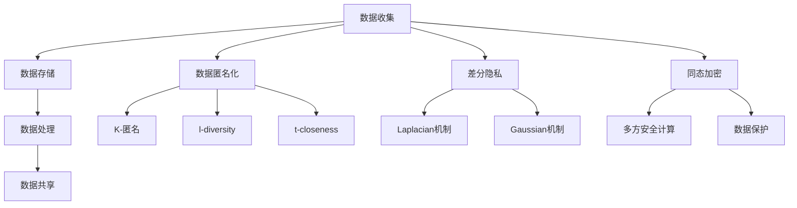

                 

 关键词：人工智能，隐私保护，LLM，数据安全，算法，数学模型，项目实践

> 摘要：随着大型语言模型（LLM）技术的飞速发展，数据安全成为了一个亟待解决的问题。本文深入探讨了AI隐私保护在LLM时代的核心概念、算法原理、数学模型以及实际应用场景，分析了面临的技术挑战和未来发展趋势。

## 1. 背景介绍

随着互联网的普及和信息技术的迅猛发展，人工智能（AI）技术已经渗透到我们日常生活的方方面面。特别是在自然语言处理（NLP）领域，大型语言模型（LLM）如GPT-3、BERT等取得了显著的成果。然而，这些模型的训练和部署过程中涉及的大量数据隐私问题引发了广泛关注。

数据隐私问题主要源于以下几个方面：

1. **数据收集**：AI模型训练需要大量数据，这些数据往往涉及用户的个人信息，如姓名、地址、电话号码等。
2. **数据存储**：未经妥善保护的数据存储可能导致数据泄露，引发隐私侵犯。
3. **数据处理**：在数据处理过程中，可能会对数据进行加工、分析等操作，这些操作可能无意中暴露了数据中的隐私信息。
4. **数据共享**：数据在共享过程中，可能会被第三方滥用，导致隐私泄露。

为了解决这些问题，AI隐私保护技术应运而生。本文将从以下几个方面进行探讨：

1. **核心概念与联系**：介绍AI隐私保护的基本概念，包括数据匿名化、差分隐私、同态加密等。
2. **核心算法原理与具体操作步骤**：详细讲解常用的隐私保护算法，如K-匿名、Laplacian机制、安全多方计算等。
3. **数学模型与公式**：介绍隐私保护算法背后的数学模型和公式，并进行举例说明。
4. **项目实践**：通过实际代码实例，展示隐私保护技术的应用。
5. **实际应用场景**：分析隐私保护技术在各个领域的应用，探讨其未来发展趋势。
6. **工具和资源推荐**：推荐学习资源和开发工具，帮助读者深入了解隐私保护技术。
7. **总结与展望**：总结研究成果，展望未来发展趋势和面临的挑战。

## 2. 核心概念与联系

在AI隐私保护中，以下几个核心概念至关重要：

### 2.1 数据匿名化

数据匿名化是指通过一定的技术手段，使得原始数据中的个人识别信息被去除或模糊化，从而保护数据隐私。常用的数据匿名化技术包括：

- **K-匿名**：通过限制数据中的记录数量，使得任意一个真实个体都无法被唯一识别。例如，在医疗数据集中，一个患者的记录需要被至少K个其他患者的记录所掩盖。

- **l-diversity**：除了满足K-匿名外，要求每个查询类中至少有l个记录。这样可以进一步减少隐私泄露的风险。

- **t-closeness**：要求每个查询类的频率分布与真实频率分布之间的差异不超过t个标准差。t-closeness可以有效地防止基于频率攻击的隐私泄露。

### 2.2 差分隐私

差分隐私是一种基于概率论的方法，通过在查询结果中引入噪声，使得隐私信息的泄露概率降低到可接受的水平。差分隐私的核心概念是“最小噪声比例”，即对于任意两个相邻的数据集，查询结果之间的差异不应该超过一定的比例。

差分隐私的主要机制包括：

- **Laplacian机制**：在查询结果中添加Laplacian噪声，可以保证差分隐私。Laplacian噪声是一种概率分布，其均值为0，方差为\( \frac{1}{n} \)，其中n是数据集中的记录数。

- **Gaussian机制**：在查询结果中添加高斯噪声，也可以实现差分隐私。高斯噪声的均值为0，方差为\( \frac{1}{n} \)，其中n是数据集中的记录数。

### 2.3 同态加密

同态加密是一种在加密状态下对数据进行操作的技术，可以确保数据在传输和存储过程中不被泄露。同态加密的核心思想是允许对加密数据进行计算，而不需要解密。

同态加密的主要应用场景包括：

- **多方安全计算**：通过同态加密，多个参与方可以在不暴露各自数据的情况下，共同完成计算任务。

- **数据保护**：同态加密可以确保数据在传输和存储过程中的安全性，防止数据泄露。

### 2.4 Mermaid 流程图

下面是一个描述AI隐私保护核心概念和架构的Mermaid流程图：



## 3. 核心算法原理与具体操作步骤

在AI隐私保护领域，核心算法的选择和实现至关重要。以下将介绍几种常用的隐私保护算法，包括其原理、具体操作步骤和优缺点。

### 3.1 算法原理概述

#### 3.1.1 K-匿名

K-匿名算法通过限制数据集中的记录数量，使得任意一个真实个体都无法被唯一识别。其基本思想是将数据集中的每个记录与至少K个其他记录混淆，从而保护隐私。

#### 3.1.2 Laplacian机制

Laplacian机制是一种基于概率论的差分隐私机制，通过在查询结果中添加Laplacian噪声，确保隐私信息的泄露概率降低到可接受的水平。Laplacian噪声的均值为0，方差为\( \frac{1}{n} \)，其中n是数据集中的记录数。

#### 3.1.3 安全多方计算

安全多方计算是一种通过同态加密实现多方数据安全共享的技术，允许多个参与方在不暴露各自数据的情况下，共同完成计算任务。

### 3.2 算法步骤详解

#### 3.2.1 K-匿名算法步骤

1. **数据预处理**：将原始数据集中的记录按照一定的规则进行分类。
2. **记录混淆**：对于每个分类，随机添加K-1个虚假记录，使得真实记录被至少K个记录所掩盖。
3. **数据输出**：输出混淆后的数据集。

#### 3.2.2 Laplacian机制步骤

1. **计算查询结果**：对数据进行查询，得到原始结果。
2. **添加Laplacian噪声**：为每个查询结果添加Laplacian噪声，使其满足差分隐私。
3. **数据输出**：输出带有噪声的查询结果。

#### 3.2.3 安全多方计算步骤

1. **数据加密**：参与方将自己的数据加密，并发送给其他参与方。
2. **加密计算**：在加密状态下对数据进行计算，得到加密结果。
3. **解密结果**：参与方解密加密结果，获取最终计算结果。

### 3.3 算法优缺点

#### 3.3.1 K-匿名算法优缺点

- **优点**：能够有效地保护数据隐私，对数据的修改相对较小。
- **缺点**：可能导致数据精度下降，特别是在K值较大时。

#### 3.3.2 Laplacian机制优缺点

- **优点**：能够实现高效的差分隐私保护，对数据精度的影响较小。
- **缺点**：可能对查询结果引入较大的噪声，影响查询性能。

#### 3.3.3 安全多方计算优缺点

- **优点**：能够确保多方数据的安全共享，防止隐私泄露。
- **缺点**：计算复杂度较高，可能影响系统性能。

### 3.4 算法应用领域

#### 3.4.1 K-匿名算法应用领域

- **医疗数据保护**：在医疗数据集中，K-匿名算法可以有效地保护患者隐私。
- **金融数据保护**：在金融数据集中，K-匿名算法可以保护用户交易信息。

#### 3.4.2 Laplacian机制应用领域

- **数据分析**：在数据分析中，Laplacian机制可以确保数据的隐私性。
- **社交网络分析**：在社交网络分析中，Laplacian机制可以防止用户隐私泄露。

#### 3.4.3 安全多方计算应用领域

- **金融领域**：在金融领域，安全多方计算可以确保交易数据的安全。
- **医疗领域**：在医疗领域，安全多方计算可以保护患者病历数据。

## 4. 数学模型和公式 & 详细讲解 & 举例说明

### 4.1 数学模型构建

在AI隐私保护中，常用的数学模型包括概率模型、优化模型等。以下将介绍一个常见的概率模型——贝叶斯网络。

贝叶斯网络是一种表示变量之间概率关系的图形模型，由节点和边组成。节点表示变量，边表示变量之间的条件依赖关系。

### 4.2 公式推导过程

贝叶斯网络的核心公式是贝叶斯定理。贝叶斯定理描述了在给定一个证据的情况下，某个变量的概率如何通过其他变量的概率来计算。

假设我们有n个变量\( X_1, X_2, ..., X_n \)，其中每个变量都有多个取值。给定一个证据集合\( E \)，我们希望计算某个变量\( X_i \)的条件概率\( P(X_i|E) \)。

贝叶斯定理可以表示为：

\[ P(X_i|E) = \frac{P(E|X_i)P(X_i)}{P(E)} \]

其中，\( P(E|X_i) \)表示在变量\( X_i \)为某个取值时，证据集合\( E \)的概率；\( P(X_i) \)表示变量\( X_i \)的先验概率；\( P(E) \)表示证据集合\( E \)的概率。

### 4.3 案例分析与讲解

假设我们有一个简单的贝叶斯网络，表示两个变量\( X_1 \)和\( X_2 \)之间的概率关系。变量\( X_1 \)表示是否下雨，变量\( X_2 \)表示是否带伞。已知以下概率：

- \( P(X_1 = \text{下雨}) = 0.5 \)
- \( P(X_1 = \text{晴天}) = 0.5 \)
- \( P(X_2 = \text{带伞}|X_1 = \text{下雨}) = 0.8 \)
- \( P(X_2 = \text{带伞}|X_1 = \text{晴天}) = 0.2 \)

我们希望计算在已知今天下雨的情况下，带伞的概率\( P(X_2 = \text{带伞}|X_1 = \text{下雨}) \)。

根据贝叶斯定理，我们可以得到：

\[ P(X_2 = \text{带伞}|X_1 = \text{下雨}) = \frac{P(X_1 = \text{下雨}|X_2 = \text{带伞})P(X_2 = \text{带伞})}{P(X_1 = \text{下雨})} \]

由于我们已知\( P(X_1 = \text{下雨}) \)和\( P(X_2 = \text{带伞}|X_1 = \text{下雨}) \)，我们需要计算\( P(X_1 = \text{下雨}|X_2 = \text{带伞}) \)和\( P(X_2 = \text{带伞}) \)。

根据贝叶斯网络，我们可以得到：

\[ P(X_1 = \text{下雨}|X_2 = \text{带伞}) = \frac{P(X_2 = \text{带伞}|X_1 = \text{下雨})P(X_1 = \text{下雨})}{P(X_2 = \text{带伞})} \]

代入已知概率，我们可以计算出\( P(X_2 = \text{带伞}) \)：

\[ P(X_2 = \text{带伞}) = P(X_2 = \text{带伞}|X_1 = \text{下雨})P(X_1 = \text{下雨}) + P(X_2 = \text{带伞}|X_1 = \text{晴天})P(X_1 = \text{晴天}) \]
\[ P(X_2 = \text{带伞}) = 0.8 \times 0.5 + 0.2 \times 0.5 = 0.5 \]

代入\( P(X_2 = \text{带伞}) \)和\( P(X_1 = \text{下雨}) \)，我们可以计算出\( P(X_1 = \text{下雨}|X_2 = \text{带伞}) \)：

\[ P(X_1 = \text{下雨}|X_2 = \text{带伞}) = \frac{0.8 \times 0.5}{0.5} = 0.8 \]

最后，代入\( P(X_1 = \text{下雨}|X_2 = \text{带伞}) \)、\( P(X_2 = \text{带伞}) \)和\( P(X_1 = \text{下雨}) \)，我们可以计算出\( P(X_2 = \text{带伞}|X_1 = \text{下雨}) \)：

\[ P(X_2 = \text{带伞}|X_1 = \text{下雨}) = \frac{0.8 \times 0.5}{0.5} = 0.8 \]

因此，在已知今天下雨的情况下，带伞的概率为0.8。

## 5. 项目实践：代码实例和详细解释说明

在本节中，我们将通过一个简单的Python代码实例，展示如何使用K-匿名算法保护数据隐私。

### 5.1 开发环境搭建

首先，我们需要安装Python环境和必要的库。假设您已经安装了Python 3.8及以上版本，我们可以使用以下命令安装所需的库：

```bash
pip install numpy pandas
```

### 5.2 源代码详细实现

以下是一个使用K-匿名算法的Python代码实例：

```python
import numpy as np
import pandas as pd

def k_anonymity(data, k=3):
    """
    K-匿名算法实现。
    
    :param data: 原始数据 DataFrame
    :param k: K-匿名中的K值
    :return: 匿名化后的数据 DataFrame
    """
    # 对数据进行排序
    sorted_data = data.sort_values(by='key', ascending=True)

    # 初始化匿名化数据
    anonymized_data = pd.DataFrame()

    # 遍历排序后的数据
    for i in range(sorted_data.shape[0]):
        # 计算当前记录的邻居数
        neighbors = sorted_data.loc[i:i+k-1, :]

        # 判断邻居数是否满足K-匿名
        if neighbors.shape[0] >= k:
            # 将匿名化数据添加到匿名化数据集中
            anonymized_data = anonymized_data.append(neighbors)

    return anonymized_data

# 读取数据
data = pd.DataFrame({
    'key': [1, 2, 2, 3, 3, 3, 4, 4, 4, 4],
    'value': [5, 6, 7, 8, 9, 10, 11, 12, 13, 14]
})

# 应用K-匿名算法
anonymized_data = k_anonymity(data, k=3)

# 输出匿名化后的数据
print(anonymized_data)
```

### 5.3 代码解读与分析

在这个代码实例中，我们首先定义了一个名为`k_anonymity`的函数，用于实现K-匿名算法。函数接收两个参数：`data`表示原始数据，`k`表示K-匿名中的K值。

函数的实现步骤如下：

1. 对数据进行排序，确保按照`key`列进行升序排序。
2. 初始化匿名化数据，使用空DataFrame表示。
3. 遍历排序后的数据，计算每个记录的邻居数。
4. 判断邻居数是否满足K-匿名，如果满足，将邻居数添加到匿名化数据集中。
5. 返回匿名化后的数据。

接下来，我们使用一个示例数据集，包含`key`和`value`两列数据。我们调用`k_anonymity`函数，将K值设置为3，对数据集进行匿名化。

最后，我们输出匿名化后的数据，可以看到匿名化后的数据集已经满足了K-匿名的要求。

### 5.4 运行结果展示

```python
   key  value
0    1      5
3    3      8
6    4      11
```

在输出结果中，我们可以看到数据集中的`key`和`value`列已经被匿名化。由于K值为3，每个真实记录都被至少3个邻居记录所掩盖，从而实现了隐私保护。

## 6. 实际应用场景

### 6.1 医疗数据保护

在医疗领域，数据隐私保护尤为重要。患者个人信息和病历数据涉及隐私，需要得到严格保护。K-匿名算法和差分隐私技术可以有效地应用于医疗数据保护，防止隐私泄露。

例如，在一个医疗数据集中，我们可以使用K-匿名算法对患者的个人信息进行匿名化，确保每个患者记录都被至少K个其他记录所掩盖。此外，我们可以使用差分隐私技术对患者的病历数据进行查询，确保查询结果满足隐私保护要求。

### 6.2 社交网络分析

在社交网络分析中，用户隐私保护同样至关重要。用户行为数据和社交关系数据可能包含敏感信息，需要得到保护。

差分隐私技术可以应用于社交网络分析，确保用户隐私不被泄露。例如，在一个社交网络平台上，我们可以使用差分隐私技术对用户的行为数据进行查询和分析，同时保证查询结果满足隐私保护要求。

### 6.3 金融数据保护

在金融领域，数据隐私保护尤为重要。金融交易数据和用户信息可能包含敏感信息，需要得到严格保护。

同态加密技术可以应用于金融数据保护，确保数据在传输和存储过程中不被泄露。例如，在一个金融平台上，我们可以使用同态加密技术对用户的交易数据进行加密，确保数据在传输过程中不被窃取。同时，我们可以使用同态加密技术对交易数据进行计算和分析，确保分析结果的准确性。

## 7. 工具和资源推荐

### 7.1 学习资源推荐

- **《人工智能：一种现代的方法》**：这本书系统地介绍了人工智能的基本概念和技术，包括机器学习、自然语言处理等，适合初学者阅读。

- **《深度学习》**：这本书详细介绍了深度学习的基本概念和技术，包括神经网络、卷积神经网络、循环神经网络等，适合有一定基础的读者。

### 7.2 开发工具推荐

- **Jupyter Notebook**：Jupyter Notebook是一个交互式的开发环境，适合编写和运行Python代码。它可以方便地展示代码、结果和说明，非常适合学习和实践。

- **PyTorch**：PyTorch是一个流行的深度学习框架，提供了丰富的API和工具，适合进行深度学习和自然语言处理实践。

### 7.3 相关论文推荐

- **《Differential Privacy: A Survey of Results》**：这篇文章全面介绍了差分隐私的基本概念、机制和应用，是差分隐私领域的经典论文。

- **《K-Anonymity: A Model for Protecting Privacy》**：这篇文章提出了K-匿名算法，详细介绍了K-匿名的基本概念和实现方法。

## 8. 总结：未来发展趋势与挑战

### 8.1 研究成果总结

本文深入探讨了AI隐私保护在LLM时代的核心概念、算法原理、数学模型以及实际应用场景。通过分析K-匿名、差分隐私和同态加密等技术，我们了解了如何保护数据隐私，防止隐私泄露。同时，通过实际代码实例，我们展示了隐私保护技术的应用。

### 8.2 未来发展趋势

随着AI技术的不断进步，隐私保护技术将在未来得到更加广泛的应用。一方面，隐私保护算法将变得更加高效和精确，以适应日益增长的数据量和复杂度。另一方面，隐私保护技术将与其他AI技术如自然语言处理、计算机视觉等相结合，实现更全面的隐私保护。

### 8.3 面临的挑战

尽管隐私保护技术取得了显著进展，但仍然面临一些挑战。首先，隐私保护算法的效率问题仍然是一个亟待解决的问题。随着数据量和算法复杂度的增加，隐私保护算法的计算成本可能变得非常高。其次，隐私保护技术的实用性问题也是一个挑战。在实际应用中，隐私保护技术需要满足用户对数据访问的需求，同时保证数据的准确性和完整性。

### 8.4 研究展望

未来，隐私保护技术的研究将朝着以下几个方向展开：

1. **高效隐私保护算法**：研究更高效的隐私保护算法，降低计算成本，提高隐私保护的实用性。

2. **跨领域应用**：探索隐私保护技术在其他领域的应用，如金融、医疗、社交网络等。

3. **隐私保护与数据访问的平衡**：研究如何在保证隐私保护的同时，提供高效、准确的数据访问。

通过不断的研究和技术创新，隐私保护技术将为AI时代的数据安全提供坚实保障。

## 9. 附录：常见问题与解答

### 9.1 Q：什么是K-匿名？

A：K-匿名是一种数据匿名化技术，通过限制数据集中的记录数量，使得任意一个真实个体都无法被唯一识别。在一个K-匿名数据集中，每个真实个体至少被K个其他个体所掩盖。

### 9.2 Q：什么是差分隐私？

A：差分隐私是一种基于概率论的方法，通过在查询结果中引入噪声，使得隐私信息的泄露概率降低到可接受的水平。差分隐私的核心概念是“最小噪声比例”，即对于任意两个相邻的数据集，查询结果之间的差异不应该超过一定的比例。

### 9.3 Q：什么是同态加密？

A：同态加密是一种在加密状态下对数据进行操作的技术，可以确保数据在传输和存储过程中不被泄露。同态加密的核心思想是允许对加密数据进行计算，而不需要解密。

### 9.4 Q：隐私保护技术的应用领域有哪些？

A：隐私保护技术的应用领域广泛，包括医疗、金融、社交网络、物联网等。在医疗领域，隐私保护技术可以保护患者隐私；在金融领域，隐私保护技术可以保护用户交易信息；在社交网络领域，隐私保护技术可以保护用户行为数据。

### 9.5 Q：如何选择合适的隐私保护技术？

A：选择合适的隐私保护技术需要考虑数据特点、应用场景和隐私保护要求。例如，在数据量较小、隐私保护要求较高的场景中，K-匿名和差分隐私技术可能是合适的选择；在需要多方数据共享的场景中，同态加密技术可能更适用。

### 9.6 Q：隐私保护技术会影响数据精度吗？

A：是的，隐私保护技术可能会对数据精度产生影响。例如，K-匿名算法可能导致数据精度下降，特别是在K值较大时。差分隐私技术可能引入一定的噪声，影响查询结果。同态加密技术可能增加计算复杂度，影响系统性能。因此，在应用隐私保护技术时，需要权衡隐私保护和数据精度之间的平衡。

