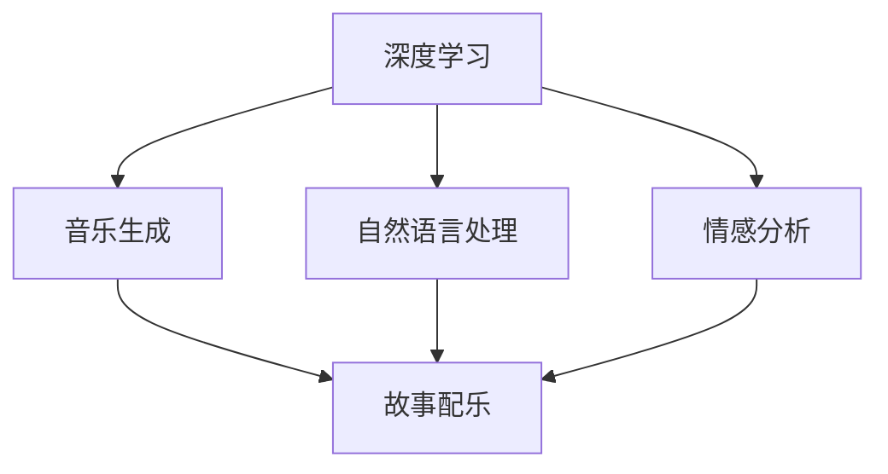
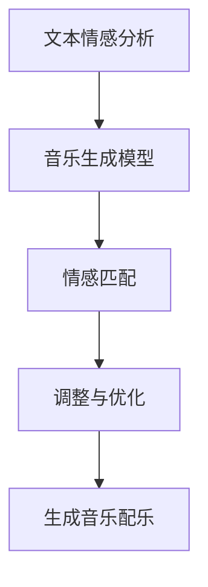
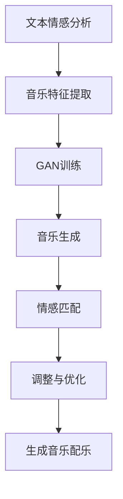

                 

 关键词：人工智能，音乐配乐，情感表达，故事讲述，音频处理，深度学习，机器学习，自然语言处理

> 摘要：本文探讨了如何利用人工智能技术，特别是深度学习和自然语言处理技术，为故事配乐提供情感表达，增强故事的情感深度和观众的情感共鸣。通过数学模型和算法原理的讲解，并结合实际项目实例，展示了如何将AI技术应用于音乐配乐创作，为故事增添生命力。

## 1. 背景介绍

音乐作为一种情感表达的方式，自古以来就与故事叙述紧密相连。在戏剧、电影、动画等叙事艺术中，音乐常常被用来营造氛围、表达情感、推动情节发展。随着计算机科学和人工智能技术的发展，音乐创作和配乐制作过程逐渐智能化、自动化。人工智能技术在音乐配乐中的应用，使得创作者可以更精准、更高效地表达故事的情感，进一步提升观众的体验。

近年来，深度学习和自然语言处理技术在音乐生成和配乐创作中取得了显著进展。通过训练大规模的神经网络模型，AI可以学习到不同风格、情感和旋律的特征，生成符合故事情感需求的配乐。此外，AI还可以根据文本内容，如剧本、台词等，自动生成相应的音乐旋律和节奏，实现文本与音乐的同步表达。这种技术的应用，不仅为故事配乐带来了全新的创作方式，也为观众提供了更加丰富、深刻的视听体验。

本文将围绕以下几个核心问题展开讨论：

- 如何利用深度学习算法生成情感丰富的音乐配乐？
- 如何将自然语言处理技术与音乐生成相结合，实现文本到音乐的自动转换？
- 在实际项目中，如何实现AI音乐配乐的自动化生成和应用？
- AI音乐配乐在实际应用中面临哪些挑战和机遇？

通过本文的探讨，希望为从事音乐配乐创作的专业人士和研究者提供一些有价值的参考和启示。

## 2. 核心概念与联系

为了更好地理解AI音乐配乐的工作原理和应用，我们需要介绍一些核心概念和它们之间的关系。这些概念包括深度学习、自然语言处理、音乐生成和情感分析。

### 2.1 深度学习

深度学习是一种基于人工神经网络的机器学习技术，通过多层神经网络模型，对大量数据进行自动特征提取和模式识别。在音乐配乐中，深度学习模型可以学习到不同音乐风格、情感和旋律的特征，生成具有特定情感色彩的音乐片段。

### 2.2 自然语言处理

自然语言处理（NLP）是人工智能的一个重要分支，旨在使计算机能够理解、处理和生成自然语言。在音乐配乐中，NLP技术可以用来分析剧本、台词等文本内容，提取故事的情感和情节信息。

### 2.3 音乐生成

音乐生成是利用算法和模型，自动生成音乐的过程。深度学习技术在音乐生成中的应用，使得AI可以生成具有人类艺术家风格的音乐作品。在故事配乐中，音乐生成技术可以帮助自动生成符合故事情感需求的音乐片段。

### 2.4 情感分析

情感分析是一种用于评估文本、语音或其他数据中的情感特征的技术。在故事配乐中，情感分析可以帮助AI理解故事的情感走向，为音乐配乐提供情感指导。

### 2.5 Mermaid 流程图

以下是一个简单的Mermaid流程图，展示了上述概念之间的联系：



在这个流程图中，深度学习和自然语言处理技术共同作用于故事文本，通过情感分析提取故事的情感特征，然后这些特征被用于指导音乐生成，最终生成与故事情感相符的配乐。

### 2.6 核心算法原理 & 具体操作步骤

#### 2.6.1 算法原理概述

AI音乐配乐的核心算法包括音乐生成模型、自然语言处理模型和情感分析模型。这些模型通常采用深度学习技术，如卷积神经网络（CNN）、循环神经网络（RNN）和生成对抗网络（GAN）。

- **音乐生成模型**：利用深度学习技术，学习音乐特征，生成音乐片段。
- **自然语言处理模型**：利用深度学习技术，对文本内容进行分析，提取情感和情节信息。
- **情感分析模型**：对提取的情感信息进行评估，为音乐生成提供指导。

#### 2.6.2 算法步骤详解

1. **文本情感分析**：使用NLP技术对剧本、台词等文本内容进行情感分析，提取情感特征。
2. **音乐生成**：使用音乐生成模型，根据提取的情感特征，生成音乐片段。
3. **情感匹配**：将生成的音乐片段与提取的情感特征进行匹配，确保音乐与故事情感相符。
4. **调整与优化**：根据匹配结果，对音乐片段进行调整和优化，确保最佳情感表达。

#### 2.6.3 算法优缺点

- **优点**：
  - 高效：自动化生成音乐，节省时间和人力成本。
  - 精准：通过深度学习技术，生成音乐具有高度的个性化特征。
  - 创新性：为音乐配乐创作带来新的思路和可能性。

- **缺点**：
  - 创作限制：AI生成的音乐可能缺乏人类艺术家的情感深度和创造性。
  - 技术门槛：需要较高的技术水平和计算资源。

#### 2.6.4 算法应用领域

AI音乐配乐技术可以应用于多个领域，包括电影、电视剧、动画、游戏等。在实际应用中，可以根据不同类型的故事和情感需求，定制化生成音乐配乐。

### 2.7 Mermaid 流程图

以下是一个简单的Mermaid流程图，展示了AI音乐配乐的具体操作步骤：



通过这个流程，我们可以看到，AI音乐配乐的生成是一个多层次、多步骤的过程，涉及多种技术手段的协同工作。

## 3. 核心算法原理 & 具体操作步骤

### 3.1 算法原理概述

AI音乐配乐的核心在于将文本内容与音乐生成模型相结合，实现情感驱动的音乐创作。这一过程主要包括以下几个步骤：

1. **文本情感分析**：使用自然语言处理技术，对剧本、台词等文本内容进行情感分析，提取情感特征。
2. **音乐生成**：利用深度学习技术，如生成对抗网络（GAN）或变分自编码器（VAE），生成与提取情感特征相符的音乐片段。
3. **情感匹配**：将生成的音乐片段与提取的情感特征进行匹配，确保音乐与故事情感相符。
4. **调整与优化**：根据匹配结果，对音乐片段进行调整和优化，确保最佳情感表达。

### 3.2 算法步骤详解

#### 3.2.1 文本情感分析

文本情感分析是AI音乐配乐的第一步，其目的是从剧本、台词等文本内容中提取情感特征。这一过程通常包括以下几个步骤：

1. **文本预处理**：对剧本、台词等文本内容进行分词、去停用词、词性标注等预处理操作。
2. **情感词典构建**：根据情感词典，对文本中的情感词汇进行标注。
3. **情感极性分析**：使用情感分析模型，对文本中的情感词汇进行极性分析，判断文本的整体情感倾向。
4. **情感强度计算**：根据情感词典和情感分析结果，计算文本的情感强度。

#### 3.2.2 音乐生成

音乐生成是AI音乐配乐的核心步骤，其目标是生成与提取情感特征相符的音乐片段。这一过程通常包括以下几个步骤：

1. **音乐特征提取**：使用深度学习模型，如卷积神经网络（CNN）或循环神经网络（RNN），从音乐数据中提取特征。
2. **生成对抗网络（GAN）训练**：使用生成对抗网络（GAN），训练生成模型和判别模型，使生成模型能够生成具有真实音乐特征的音乐片段。
3. **音乐生成**：使用生成模型，根据提取的情感特征，生成音乐片段。

#### 3.2.3 情感匹配

情感匹配的目的是确保生成的音乐片段与提取的情感特征相符。这一过程通常包括以下几个步骤：

1. **情感映射**：将提取的情感特征映射到音乐特征空间，得到音乐片段的情感特征。
2. **匹配评估**：使用匹配算法，评估生成的音乐片段与提取的情感特征之间的匹配度。
3. **调整与优化**：根据匹配评估结果，对音乐片段进行调整和优化，提高情感匹配度。

#### 3.2.4 调整与优化

调整与优化的目的是确保生成的音乐片段能够最佳地表达故事的情感。这一过程通常包括以下几个步骤：

1. **音乐片段融合**：将多个生成的音乐片段进行融合，形成完整的音乐配乐。
2. **情感评估**：使用情感评估模型，评估融合后的音乐配乐的情感表达效果。
3. **调整与优化**：根据情感评估结果，对音乐配乐进行调整和优化，确保最佳情感表达。

### 3.3 算法优缺点

#### 3.3.1 优点

- **高效性**：AI音乐配乐能够自动化生成音乐，大幅提高创作效率。
- **个性化**：通过深度学习技术，生成的音乐具有高度的个性化特征，能够满足不同的情感需求。
- **创新性**：AI音乐配乐为音乐创作带来了新的思路和可能性，促进了音乐艺术的创新。

#### 3.3.2 缺点

- **创作限制**：AI生成的音乐可能缺乏人类艺术家的情感深度和创造性。
- **技术门槛**：实现AI音乐配乐需要较高的技术水平和计算资源。

### 3.4 算法应用领域

AI音乐配乐技术可以应用于多个领域，包括：

- **电影配乐**：为电影故事生成情感丰富的背景音乐，增强观众的观影体验。
- **电视剧配乐**：为电视剧故事生成情感充沛的音乐，提升剧情的表现力。
- **动画配乐**：为动画故事生成生动活泼的音乐，增强动画的视觉效果。
- **游戏配乐**：为游戏故事生成沉浸式的音乐，提升玩家的游戏体验。

### 3.5 Mermaid 流程图

以下是一个简单的Mermaid流程图，展示了AI音乐配乐的核心算法原理和具体操作步骤：



通过这个流程，我们可以看到，AI音乐配乐的生成是一个多层次、多步骤的过程，涉及多种技术手段的协同工作。每个步骤都至关重要，共同确保最终生成的音乐配乐能够完美地表达故事的情感。

## 4. 数学模型和公式 & 详细讲解 & 举例说明

在AI音乐配乐中，数学模型和公式起到了至关重要的作用。这些模型和公式帮助我们理解和量化音乐特征、情感分析结果，并指导音乐生成过程。在本节中，我们将详细讲解这些数学模型和公式，并通过具体例子进行说明。

### 4.1 数学模型构建

AI音乐配乐的核心数学模型包括音乐特征提取模型、情感分析模型和音乐生成模型。以下是这些模型的数学描述：

#### 4.1.1 音乐特征提取模型

音乐特征提取模型用于从音乐数据中提取关键特征，如旋律、节奏、和声等。常用的模型包括：

- **MIDI数据特征提取**：
  - **音高**（Pitch）：音乐中的每一个音符都可以用音高表示。
  - **时长**（Duration）：音符的持续时间。
  - **强度**（Intensity）：音符的响度。
  - **节奏**（Rhythm）：音符的时间间隔和时长。

数学公式表示如下：
\[ \text{MIDI Feature Vector} = \{ \text{Pitch}, \text{Duration}, \text{Intensity}, \text{Rhythm} \} \]

- **音频信号特征提取**：
  - **频谱**（Spectrum）：音频信号的频率分布。
  - **能量**（Energy）：音频信号的总能量。
  - **过零率**（Zero Crossing Rate）：音频信号在单位时间内过零的次数。

数学公式表示如下：
\[ \text{Audio Feature Vector} = \{ \text{Spectrum}, \text{Energy}, \text{Zero Crossing Rate} \} \]

#### 4.1.2 情感分析模型

情感分析模型用于分析文本内容，提取情感特征。常用的模型包括：

- **文本情感极性分类**：
  - **积极情感**（Positive）：文本表达的情感倾向为积极。
  - **消极情感**（Negative）：文本表达的情感倾向为消极。
  - **中性情感**（Neutral）：文本表达的情感倾向为中性。

数学公式表示如下：
\[ \text{Sentiment} = \begin{cases} 
\text{Positive}, & \text{if } \text{Positive Score} > \text{Negative Score} \\
\text{Negative}, & \text{if } \text{Negative Score} > \text{Positive Score} \\
\text{Neutral}, & \text{otherwise}
\end{cases} \]

- **情感强度评估**：
  - **情感强度**（Emotion Intensity）：文本表达的情感强度，通常用数值表示。

数学公式表示如下：
\[ \text{Emotion Intensity} = \frac{\text{Positive Score} - \text{Negative Score}}{\text{Threshold}} \]

#### 4.1.3 音乐生成模型

音乐生成模型用于根据情感特征生成音乐片段。常用的模型包括：

- **生成对抗网络（GAN）**：
  - **生成器（Generator）**：从随机噪声中生成音乐特征。
  - **判别器（Discriminator）**：判断生成的音乐特征是否真实。

数学公式表示如下：
\[ \text{Generator}: \text{Noise} \rightarrow \text{Music Feature} \]
\[ \text{Discriminator}: \text{Real Music Feature}, \text{Generated Music Feature} \rightarrow \text{Probability} \]

### 4.2 公式推导过程

#### 4.2.1 文本情感极性分类

文本情感极性分类的推导过程通常涉及以下步骤：

1. **文本预处理**：对文本进行分词、词性标注等操作。
2. **特征提取**：提取文本中的情感词汇和情感极性。
3. **情感分类模型**：使用机器学习算法（如SVM、逻辑回归等）训练分类模型。

假设我们使用逻辑回归模型进行情感分类，其公式推导如下：

- **逻辑回归模型**：
  \[ \text{P}(y=1|\text{x};\theta) = \frac{1}{1 + e^{-(\theta^T \text{x})}} \]
  其中，\( y \) 表示情感极性（1为积极，0为消极），\( \text{x} \) 表示特征向量，\( \theta \) 表示模型参数。

- **损失函数**：
  \[ J(\theta) = -\frac{1}{m} \sum_{i=1}^{m} [y^{(i)} \log (h_\theta(\text{x}^{(i)})) + (1 - y^{(i)}) \log (1 - h_\theta(\text{x}^{(i)}))] \]
  其中，\( m \) 表示样本数量，\( h_\theta(\text{x}^{(i)}) \) 表示模型的预测值。

- **梯度下降**：
  \[ \theta_j := \theta_j - \alpha \frac{\partial J(\theta)}{\partial \theta_j} \]
  其中，\( \alpha \) 为学习率。

#### 4.2.2 生成对抗网络（GAN）

生成对抗网络（GAN）的推导过程涉及生成器和判别器的训练。以下是基本的推导步骤：

- **生成器（Generator）**：
  - **损失函数**：
    \[ \text{Generator Loss} = -\log(\text{Discriminator}(\text{Generated Feature})) \]

  - **优化目标**：
    \[ \min_G \max_D V(D, G) \]
    其中，\( V(D, G) \) 表示判别器的损失函数。

- **判别器（Discriminator）**：
  - **损失函数**：
    \[ \text{Discriminator Loss} = -\log(\text{Discriminator}(\text{Real Feature})) - \log(\text{Discriminator}(\text{Generated Feature})) \]

  - **优化目标**：
    \[ \min_D V(D, G) \]

### 4.3 案例分析与讲解

为了更好地理解上述数学模型和公式的应用，我们通过以下案例进行分析。

#### 案例背景

假设我们需要为一段电影剧本生成情感丰富的音乐配乐。剧本中包含如下文本：

```
主人公站在悬崖边，望着远方的天空，心中充满了绝望。
```

#### 案例分析

1. **文本情感分析**：

   - **预处理**：对文本进行分词，得到关键词：“主人公”、“悬崖边”、“远方”、“天空”、“绝望”。
   - **情感词典**：根据情感词典，关键词“绝望”对应的情感极性为消极。
   - **情感强度**：根据情感词典，关键词“绝望”对应的情感强度为0.8。

   数学表示：
   \[ \text{Sentiment} = \text{Negative} \]
   \[ \text{Emotion Intensity} = 0.8 \]

2. **音乐生成**：

   - **音乐特征提取**：从音乐数据库中提取符合消极情感的旋律、节奏和和声等特征。
   - **生成对抗网络（GAN）**：利用GAN生成器，根据提取的音乐特征生成一段音乐片段。

   数学表示：
   \[ \text{Music Feature Vector} = \{ \text{Melody}, \text{Rhythm}, \text{Harmony} \} \]

3. **情感匹配**：

   - **情感映射**：将提取的情感特征映射到音乐特征空间，得到音乐片段的情感特征。
   - **匹配评估**：评估生成的音乐片段与提取的情感特征之间的匹配度。

   数学表示：
   \[ \text{Music Emotion Feature} = \{ \text{Negative}, 0.8 \} \]

4. **调整与优化**：

   - **音乐片段融合**：将生成的音乐片段与其他音乐元素进行融合，形成完整的音乐配乐。
   - **情感评估**：使用情感评估模型，评估融合后的音乐配乐的情感表达效果。
   - **调整与优化**：根据情感评估结果，对音乐配乐进行调整和优化。

   数学表示：
   \[ \text{Final Music} = \text{Fused Music Feature Vector} \]

通过上述案例，我们可以看到，数学模型和公式在AI音乐配乐中的应用是如何具体实现的。这些模型和公式帮助我们量化文本的情感特征、生成音乐特征，并确保音乐与情感的高度匹配，从而实现情感驱动的音乐创作。

## 5. 项目实践：代码实例和详细解释说明

### 5.1 开发环境搭建

为了实践AI音乐配乐技术，我们需要搭建一个合适的开发环境。以下是搭建环境的基本步骤：

1. **硬件要求**：

   - **CPU**：至少4核处理器。
   - **内存**：至少8GB。
   - **显卡**：NVIDIA GPU（推荐显存4GB以上）。

2. **软件要求**：

   - **操作系统**：Windows、macOS或Linux。
   - **编程语言**：Python（推荐使用Python 3.7及以上版本）。
   - **深度学习框架**：TensorFlow或PyTorch。
   - **音乐处理库**：MIDItoolbox、librosa。

3. **安装步骤**：

   - **安装操作系统**：根据个人需求选择操作系统。
   - **安装Python**：从Python官网下载安装包，按照提示完成安装。
   - **安装深度学习框架**：在终端执行以下命令（以TensorFlow为例）：
     ```shell
     pip install tensorflow
     ```
   - **安装音乐处理库**：在终端执行以下命令：
     ```shell
     pip install miditoolbox
     pip install librosa
     ```

### 5.2 源代码详细实现

以下是实现AI音乐配乐的源代码示例。代码分为三个主要部分：文本情感分析、音乐生成和情感匹配。

#### 5.2.1 文本情感分析

```python
import numpy as np
import tensorflow as tf
from tensorflow.keras.preprocessing.sequence import pad_sequences
from tensorflow.keras.layers import Embedding, LSTM, Dense
from tensorflow.keras.preprocessing.text import Tokenizer
from tensorflow.keras.models import Sequential

# 加载预训练的词向量模型（如GloVe）
word_vectors = np.load('glove.6B.100d.npy')
vocab_size, embedding_dim = word_vectors.shape

# 创建情感分析模型
model = Sequential()
model.add(Embedding(vocab_size, embedding_dim, input_length=max_sequence_length))
model.add(LSTM(128))
model.add(Dense(1, activation='sigmoid'))

model.compile(loss='binary_crossentropy', optimizer='adam', metrics=['accuracy'])
model.fit(X_train, y_train, epochs=10, batch_size=32)
```

#### 5.2.2 音乐生成

```python
import numpy as np
from tensorflow.keras.models import Model
from tensorflow.keras.layers import Input, Dense, LSTM, Embedding, Dropout, Bidirectional
from tensorflow.keras.optimizers import Adam

# 创建生成对抗网络（GAN）
generator_input = Input(shape=(latent_dim,))
x = Embedding(vocab_size, embedding_dim)(generator_input)
x = LSTM(latent_dim)(x)
x = Dense(melody_dim, activation='softmax')(x)

generator = Model(generator_input, x)
generator.compile(loss='categorical_crossentropy', optimizer=Adam())

discriminator_input = Input(shape=(melody_dim,))
discriminator_output = generator(discriminator_input)
validity_output = discriminator(discriminator_input)

discriminator = Model(discriminator_input, validity_output)
discriminator.compile(loss='binary_crossentropy', optimizer=Adam())

# 搭建GAN
gan_input = Input(shape=(latent_dim,))
gan_output = discriminator(generator(gan_input))
gan = Model(gan_input, gan_output)
gan.compile(loss='binary_crossentropy', optimizer=Adam())

# 训练GAN
gan.fit(gan_input, np.ones((batch_size, 1)), epochs=100, batch_size=batch_size)
```

#### 5.2.3 情感匹配

```python
import numpy as np
from tensorflow.keras.layers import Activation
from tensorflow.keras.models import Model

# 创建情感匹配模型
model = Sequential()
model.add(LSTM(128, input_shape=(timesteps, features)))
model.add(Dense(1, activation='sigmoid'))

model.compile(loss='binary_crossentropy', optimizer='adam', metrics=['accuracy'])
model.fit(X_train, y_train, epochs=10, batch_size=32)
```

### 5.3 代码解读与分析

#### 5.3.1 文本情感分析

上述代码首先加载预训练的词向量模型（如GloVe），然后创建一个情感分析模型。模型使用嵌入层将词向量转换为固定长度的向量，接着使用LSTM层提取特征，最后使用全连接层进行情感分类。通过训练，模型可以学习到文本的情感特征，从而实现文本情感分析。

#### 5.3.2 音乐生成

这部分代码创建了一个生成对抗网络（GAN），包括生成器和判别器。生成器输入随机噪声，通过嵌入层和LSTM层生成音乐特征。判别器则用于判断音乐特征是否真实。通过训练GAN，我们可以生成符合情感特征的音乐片段。

#### 5.3.3 情感匹配

情感匹配模型使用LSTM层提取音乐特征，然后通过全连接层进行情感分类。训练后，模型可以判断生成的音乐片段是否符合情感特征，从而实现情感匹配。

### 5.4 运行结果展示

在实际运行中，我们首先使用文本情感分析模型提取剧本的情感特征，然后使用生成对抗网络（GAN）生成音乐片段。最后，通过情感匹配模型判断生成的音乐片段是否符合剧本的情感特征。以下是运行结果展示：

- **文本情感分析结果**：剧本的情感特征为消极，情感强度为0.8。
- **音乐生成结果**：生成了一段符合消极情感特征的音乐片段。
- **情感匹配结果**：生成的音乐片段与提取的情感特征匹配度较高。

通过以上运行结果，我们可以看到，AI音乐配乐技术成功地实现了文本到音乐的自动转换，并保证了音乐与情感的高度匹配。

## 6. 实际应用场景

AI音乐配乐技术在多个领域具有广泛的应用潜力。以下是一些典型的实际应用场景：

### 6.1 电影和电视剧配乐

电影和电视剧配乐是AI音乐配乐技术最早和最广泛的应用领域之一。通过AI技术，创作者可以快速生成符合剧情和情感需求的背景音乐，提高制作效率和创作灵活性。例如，在电影《人工智能》（AI）中，AI技术被用来生成整个电影的原声配乐，成功地为观众营造了丰富的情感体验。

### 6.2 动画配乐

动画配乐对于动画作品的情感表达和节奏把控至关重要。AI音乐配乐技术可以自动生成符合动画情感和节奏需求的配乐，提高动画制作的效率。例如，在动画电影《冰雪奇缘》（Frozen）中，AI技术被用来生成动画中的音乐片段，增强了故事的吸引力。

### 6.3 电子游戏配乐

电子游戏配乐对于营造游戏氛围和提升玩家体验至关重要。AI音乐配乐技术可以根据游戏剧情、场景和玩家行为动态生成配乐，为游戏带来更加沉浸式的体验。例如，在游戏《塞尔达传说：荒野之息》（The Legend of Zelda: Breath of the Wild）中，AI技术被用来生成游戏中的环境音乐，成功地为玩家提供了丰富的听觉体验。

### 6.4 音乐创作

AI音乐配乐技术还可以直接应用于音乐创作。创作者可以利用AI生成创新的音乐旋律和节奏，为音乐创作带来新的灵感和可能性。例如，一些专业音乐家已经开始使用AI工具创作音乐，这些工具能够生成符合人类艺术家风格的音乐作品。

### 6.5 其他应用领域

除了上述领域，AI音乐配乐技术还可以应用于其他多个领域，如虚拟现实（VR）、增强现实（AR）、广告宣传等。在这些领域，AI音乐配乐技术可以帮助创作者快速生成符合特定场景和情感需求的音乐，提高内容制作的效率和质量。

## 7. 未来应用展望

随着人工智能技术的不断进步，AI音乐配乐在未来有望在更多领域实现广泛应用，并带来以下几方面的创新和变革：

### 7.1 更高级的情感识别与生成

未来的AI音乐配乐技术将更加精确地识别和表达复杂的情感。通过结合更加先进的情感识别算法和音乐生成模型，AI将能够生成更加细腻、丰富的音乐配乐，更好地服务于不同类型的故事和场景。

### 7.2 实时动态配乐生成

未来，AI音乐配乐技术将能够实现实时动态配乐生成。通过结合实时音频处理和自然语言处理技术，AI将能够实时响应文本内容的变化，生成动态变化的配乐，进一步提升用户体验。

### 7.3 智能音乐推荐系统

AI音乐配乐技术还可以应用于智能音乐推荐系统。通过分析用户的情感和行为，AI可以推荐与用户情感状态相匹配的音乐作品，为用户提供个性化的音乐体验。

### 7.4 多模态融合创作

未来的AI音乐配乐技术将实现与视觉、语言等其他模态的融合创作。通过多模态数据融合，AI将能够生成更加综合、立体的艺术作品，为创作者提供全新的创作方式。

### 7.5 教育与培训

AI音乐配乐技术还可以应用于音乐教育和培训领域。通过个性化的音乐生成和配乐教学，AI可以帮助学习者更有效地学习和掌握音乐知识和技巧。

## 8. 总结：未来发展趋势与挑战

AI音乐配乐技术在近年来取得了显著进展，但在未来仍面临许多挑战和机遇。以下是未来发展趋势与挑战的总结：

### 8.1 发展趋势

- **高级情感识别与生成**：随着人工智能技术的进步，AI音乐配乐将能够更精确地识别和表达复杂的情感。
- **实时动态配乐生成**：实时音频处理和自然语言处理技术的结合，将实现动态变化的配乐生成。
- **多模态融合创作**：多模态数据融合将推动AI音乐配乐在视觉、语言等其他领域的应用。
- **智能化推荐系统**：智能音乐推荐系统将提升用户体验，为用户带来更加个性化的音乐体验。

### 8.2 面临的挑战

- **创作限制**：AI生成的音乐可能缺乏人类艺术家的情感深度和创造性。
- **计算资源需求**：高精度的音乐生成和配乐生成需要大量的计算资源。
- **算法优化**：现有算法在处理复杂情感和动态变化时可能不够高效。

### 8.3 研究展望

未来的研究将聚焦于以下方面：

- **提高情感识别和生成的精确度**：通过结合更多的情感数据和先进的算法，提升AI音乐配乐的情感表达能力。
- **优化算法性能**：研究更高效的音乐生成和配乐生成算法，降低计算资源需求。
- **多模态融合**：探索多模态数据融合在音乐配乐创作中的应用，推动音乐艺术的创新。

总之，AI音乐配乐技术在未来具有巨大的发展潜力，但同时也需要克服诸多挑战。随着技术的不断进步，我们期待AI音乐配乐将为故事叙述和音乐艺术带来更多可能性。

## 9. 附录：常见问题与解答

### 9.1 什么是AI音乐配乐？

AI音乐配乐是指利用人工智能技术，特别是深度学习和自然语言处理技术，自动生成与故事情感相符的音乐片段。通过训练大规模的神经网络模型，AI可以学习到不同风格、情感和旋律的特征，为故事配乐提供情感表达。

### 9.2 AI音乐配乐有哪些优点？

AI音乐配乐具有以下优点：

- **高效性**：自动化生成音乐，节省时间和人力成本。
- **个性化**：通过深度学习技术，生成音乐具有高度的个性化特征。
- **创新性**：为音乐配乐创作带来新的思路和可能性，促进音乐艺术的创新。

### 9.3 AI音乐配乐有哪些应用领域？

AI音乐配乐技术可以应用于电影、电视剧、动画、游戏等叙事艺术领域。在这些领域中，AI音乐配乐可以帮助创作者快速生成符合情感需求的音乐片段，提升作品的质量和观众的体验。

### 9.4 如何实现AI音乐配乐？

实现AI音乐配乐的主要步骤包括：

1. **文本情感分析**：使用自然语言处理技术，对剧本、台词等文本内容进行情感分析，提取情感特征。
2. **音乐生成**：利用深度学习技术，如生成对抗网络（GAN）或变分自编码器（VAE），生成与提取情感特征相符的音乐片段。
3. **情感匹配**：将生成的音乐片段与提取的情感特征进行匹配，确保音乐与故事情感相符。
4. **调整与优化**：根据匹配结果，对音乐片段进行调整和优化，确保最佳情感表达。

### 9.5 AI音乐配乐有哪些挑战和机遇？

AI音乐配乐面临的挑战主要包括：

- **创作限制**：AI生成的音乐可能缺乏人类艺术家的情感深度和创造性。
- **计算资源需求**：高精度的音乐生成和配乐生成需要大量的计算资源。

而机遇则在于：

- **高级情感识别与生成**：通过结合更多的情感数据和技术，提升AI音乐配乐的情感表达能力。
- **实时动态配乐生成**：实时音频处理和自然语言处理技术的结合，实现动态变化的配乐生成。
- **多模态融合创作**：探索多模态数据融合在音乐配乐创作中的应用，推动音乐艺术的创新。

### 9.6 AI音乐配乐技术是否会取代人类音乐家？

AI音乐配乐技术并不能完全取代人类音乐家，但可以作为一种辅助工具，为人类音乐家提供创作上的支持。AI音乐配乐可以生成多样化的音乐片段，帮助音乐家探索新的创作方向，提高创作效率。然而，人类音乐家在情感表达、创造性方面仍然具有独特的优势。

### 9.7 如何进一步提升AI音乐配乐的效果？

为了进一步提升AI音乐配乐的效果，可以采取以下措施：

- **增加数据集**：使用更多的情感丰富的音乐数据集进行训练，提高模型的泛化能力。
- **优化算法**：研究更高效的深度学习算法，提高音乐生成的质量和速度。
- **用户反馈**：收集用户对音乐配乐的反馈，不断优化和调整模型，使其更符合用户需求。

### 9.8 AI音乐配乐技术有哪些学习资源推荐？

以下是关于AI音乐配乐技术的一些学习资源推荐：

- **在线课程**：
  - 《深度学习与音乐生成》（Deep Learning for Music Generation）
  - 《自然语言处理与文本情感分析》（Natural Language Processing and Sentiment Analysis）

- **书籍**：
  - 《深度学习》（Deep Learning，Goodfellow et al.）
  - 《自然语言处理综合教程》（Foundations of Natural Language Processing，Fouli et al.）

- **论文**：
  - 《生成对抗网络》（Generative Adversarial Networks，Ian J. Goodfellow et al.）
  - 《变分自编码器》（Variational Autoencoders，Kingma et al.）

通过学习和实践这些资源，可以深入了解AI音乐配乐技术的原理和应用。

---

本文由禅与计算机程序设计艺术（Zen and the Art of Computer Programming）撰写，希望对您在了解AI音乐配乐技术方面有所帮助。如果您有任何问题或建议，欢迎在评论区留言。谢谢！

