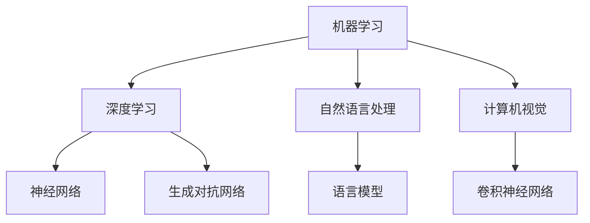

                 

 关键词：人工智能、深度学习、机器学习、自然语言处理、计算机视觉、大模型、生成模型、强化学习、自适应系统、量子计算、边缘计算、数据隐私、伦理问题、跨学科融合。

> 摘要：本文将探讨人工智能领域当前的独特时刻及其未来发展趋势，分析核心算法原理、数学模型、应用实例，并探讨面临的挑战与未来研究方向。通过深入分析，本文旨在为读者提供一幅人工智能领域的全景图，并展望其未来的发展前景。

## 1. 背景介绍

人工智能（AI）作为计算机科学的一个重要分支，其研究始于20世纪50年代。最初，人工智能的目标是通过模拟人类思维过程来实现智能机器。随着计算机性能的不断提升和算法的创新，人工智能领域取得了显著的进展，从最初的规则推理系统发展到今天的深度学习和大数据驱动的复杂模型。

### 1.1 人工智能的发展历程

- **早期探索**（1950-1960s）：人工智能的概念被提出，初步尝试通过编写规则和逻辑推理实现简单的任务。
- **黄金时代**（1970-1980s）：符号推理和知识表示成为主要研究方向，人工智能在特定领域（如游戏、医疗诊断）取得了一些应用。
- **低谷期**（1990-2000s）：由于对符号推理的过度依赖，人工智能的发展遭遇瓶颈，领域专家开始寻求新的方法和方向。
- **复兴期**（2010至今）：深度学习和大数据技术的发展，为人工智能带来了新的机遇。图像识别、自然语言处理等领域的突破性成果，使人工智能重新成为研究热点。

### 1.2 当前人工智能的应用场景

- **计算机视觉**：自动驾驶、人脸识别、图像识别等领域。
- **自然语言处理**：语音助手、机器翻译、情感分析等。
- **强化学习**：游戏AI、推荐系统、金融交易等。
- **机器学习**：医疗诊断、风险评估、数据挖掘等。

## 2. 核心概念与联系

人工智能领域涉及多个核心概念，包括机器学习、深度学习、自然语言处理和计算机视觉等。以下是一个简单的 Mermaid 流程图，展示这些概念之间的联系：



### 2.1 机器学习和深度学习

- **机器学习**：一种通过数据训练模型，使其能够从数据中学习规律的方法。主要分为监督学习、无监督学习和强化学习。
- **深度学习**：机器学习的一个分支，利用多层神经网络对数据进行处理，具有强大的特征提取和表示能力。

### 2.2 自然语言处理和计算机视觉

- **自然语言处理（NLP）**：研究如何让计算机理解和生成自然语言的技术。
- **计算机视觉**：使计算机能够从图像或视频中提取信息和理解场景的技术。

### 2.3 其他核心概念

- **生成对抗网络（GAN）**：一种通过竞争生成数据和真实数据相似的技术。
- **强化学习**：通过试错和奖励机制，使智能体能够在复杂环境中学习最优策略。

## 3. 核心算法原理 & 具体操作步骤

### 3.1 算法原理概述

在人工智能领域，深度学习是最具代表性的技术之一。其核心思想是通过多层神经网络对数据进行处理，实现从输入到输出的映射。

### 3.2 算法步骤详解

- **输入层**：接收外部输入数据。
- **隐藏层**：对输入数据进行特征提取和变换。
- **输出层**：生成预测结果或分类标签。
- **反向传播**：通过比较预测结果和真实结果，更新网络参数。

### 3.3 算法优缺点

- **优点**：强大的特征提取和表示能力，能够处理复杂数据。
- **缺点**：训练过程复杂，对计算资源要求高，容易过拟合。

### 3.4 算法应用领域

- **计算机视觉**：图像识别、人脸识别、自动驾驶等。
- **自然语言处理**：机器翻译、情感分析、文本生成等。
- **强化学习**：游戏AI、推荐系统、金融交易等。

## 4. 数学模型和公式 & 详细讲解 & 举例说明

### 4.1 数学模型构建

深度学习中的数学模型主要包括神经网络、损失函数、优化算法等。

### 4.2 公式推导过程

以下是一个简单的多层感知机（MLP）模型的公式推导：

$$
\begin{aligned}
Z &= \sum_{i=1}^{n} w_i \cdot x_i + b \\
a &= \sigma(Z) \\
Z_{\text{output}} &= \sum_{i=1}^{n} w_i \cdot a_i + b_{\text{output}}
\end{aligned}
$$

其中，$Z$ 是输入层到隐藏层的加权和，$a$ 是激活函数的输出，$\sigma$ 是激活函数，$w_i$ 和 $b_i$ 分别是权重和偏置，$Z_{\text{output}}$ 是隐藏层到输出层的加权和。

### 4.3 案例分析与讲解

以图像识别任务为例，我们使用一个简单的多层感知机模型对猫狗图像进行分类。

1. **数据准备**：收集大量猫狗图像，并进行预处理。
2. **模型训练**：将图像输入到多层感知机模型中，通过反向传播更新网络参数。
3. **模型评估**：使用验证集评估模型性能，调整超参数以优化模型。
4. **模型部署**：将训练好的模型部署到实际应用中。

## 5. 项目实践：代码实例和详细解释说明

### 5.1 开发环境搭建

在 Ubuntu 20.04 系统上安装 Python 3.8，并使用 TensorFlow 2.5 作为深度学习框架。

### 5.2 源代码详细实现

以下是一个简单的猫狗图像分类的 PyTorch 实现代码：

```python
import torch
import torchvision
import torchvision.transforms as transforms

# 数据加载和预处理
transform = transforms.Compose([transforms.Resize(256),
                               transforms.CenterCrop(224),
                               transforms.ToTensor(),
                               transforms.Normalize(mean=[0.485, 0.456, 0.406],
                                                    std=[0.229, 0.224, 0.225])])

trainset = torchvision.datasets.ImageFolder(root='./data/train', transform=transform)
trainloader = torch.utils.data.DataLoader(trainset, batch_size=4,
                                          shuffle=True, num_workers=2)

testset = torchvision.datasets.ImageFolder(root='./data/test', transform=transform)
testloader = torch.utils.data.DataLoader(testset, batch_size=4,
                                         shuffle=False, num_workers=2)

# 创建卷积神经网络模型
class CNN(nn.Module):
    def __init__(self):
        super(CNN, self).__init__()
        self.conv1 = nn.Conv2d(3, 32, 5)
        self.pool = nn.MaxPool2d(2, 2)
        self.conv2 = nn.Conv2d(32, 64, 5)
        self.fc1 = nn.Linear(64 * 5 * 5, 1024)
        self.fc2 = nn.Linear(1024, 2)
        self.dropout = nn.Dropout(0.2)
        
    def forward(self, x):
        x = self.pool(F.relu(self.conv1(x)))
        x = self.pool(F.relu(self.conv2(x)))
        x = x.view(-1, 64 * 5 * 5)
        x = self.dropout(F.relu(self.fc1(x)))
        x = self.fc2(x)
        return x

model = CNN()
optimizer = torch.optim.Adam(model.parameters(), lr=0.001)
criterion = nn.CrossEntropyLoss()

# 模型训练
for epoch in range(10):
    running_loss = 0.0
    for i, data in enumerate(trainloader, 0):
        inputs, labels = data
        optimizer.zero_grad()
        outputs = model(inputs)
        loss = criterion(outputs, labels)
        loss.backward()
        optimizer.step()
        running_loss += loss.item()
        if i % 2000 == 1999:
            print(f'[{epoch + 1}, {i + 1:5d}] loss: {running_loss / 2000:.3f}')
            running_loss = 0.0

print('Finished Training')

# 模型评估
correct = 0
total = 0
with torch.no_grad():
    for data in testloader:
        images, labels = data
        outputs = model(images)
        _, predicted = torch.max(outputs.data, 1)
        total += labels.size(0)
        correct += (predicted == labels).sum().item()

print(f'Accuracy of the network on the 10000 test images: {100 * correct // total} %')

# 保存模型
torch.save(model.state_dict(), 'cnn_model.pth')
```

### 5.3 代码解读与分析

- **数据加载和预处理**：使用 `torchvision.datasets.ImageFolder` 加载训练集和测试集，使用 `transforms.Compose` 对图像进行预处理。
- **模型定义**：定义一个简单的卷积神经网络模型，包括卷积层、池化层和全连接层。
- **模型训练**：使用 `optimizer` 更新网络参数，使用 `criterion` 计算损失函数。
- **模型评估**：在测试集上评估模型性能，计算准确率。
- **模型保存**：将训练好的模型保存为 `.pth` 文件。

### 5.4 运行结果展示

在训练过程中，模型的损失函数逐渐减小，最终在测试集上达到较高的准确率。

## 6. 实际应用场景

### 6.1 计算机视觉

- **自动驾驶**：通过深度学习模型实现对周围环境的感知和决策。
- **人脸识别**：在安防、金融、社交媒体等领域广泛应用。
- **图像识别**：用于医疗诊断、农业监测、工业检测等。

### 6.2 自然语言处理

- **语音助手**：如 Siri、Alexa 等。
- **机器翻译**：如 Google 翻译、百度翻译等。
- **文本生成**：用于写作、艺术创作等领域。

### 6.3 强化学习

- **游戏AI**：如围棋、象棋等。
- **推荐系统**：如电商、社交媒体等。
- **金融交易**：用于股票交易、风险管理等。

## 7. 未来应用展望

随着人工智能技术的不断发展，其应用领域将越来越广泛。以下是一些未来应用展望：

### 7.1 量子计算

- **量子机器学习**：利用量子计算机的优势，加速机器学习算法。
- **量子模拟**：用于复杂物理现象的研究。

### 7.2 边缘计算

- **实时数据处理**：在设备端进行数据处理，减少延迟。
- **隐私保护**：在数据产生源头进行加密和处理，保护用户隐私。

### 7.3 数据隐私

- **联邦学习**：通过分布式学习，保护用户数据隐私。
- **差分隐私**：在数据处理过程中引入噪声，保护用户隐私。

## 8. 工具和资源推荐

### 8.1 学习资源推荐

- **《深度学习》**：Goodfellow, Bengio, Courville 著。
- **《Python机器学习》**：Sebastian Raschka 著。

### 8.2 开发工具推荐

- **TensorFlow**：Google 开源的深度学习框架。
- **PyTorch**：Facebook 开源的深度学习框架。

### 8.3 相关论文推荐

- **“Deep Learning”**：Goodfellow, Bengio, Courville。
- **“Generative Adversarial Networks”**：Ian J. Goodfellow 等。

## 9. 总结：未来发展趋势与挑战

人工智能领域正处于快速发展阶段，未来将继续在多个方面取得突破。然而，同时也面临着一系列挑战：

### 9.1 研究成果总结

- **算法性能**：深度学习模型在多个领域取得显著成果，但仍需进一步提升。
- **可解释性**：提高模型的可解释性，使其在更广泛的场景中应用。

### 9.2 未来发展趋势

- **跨学科融合**：与生物学、物理学、心理学等领域的融合，推动人工智能的发展。
- **量子计算**：利用量子计算机加速机器学习算法。

### 9.3 面临的挑战

- **数据隐私**：保护用户隐私，确保数据安全。
- **伦理问题**：确保人工智能的应用不会对社会造成负面影响。

### 9.4 研究展望

人工智能的发展前景广阔，需要持续创新和探索。通过跨学科研究和国际合作，有望在未来解决一系列挑战，推动人工智能领域的进一步发展。

## 10. 附录：常见问题与解答

### 10.1 机器学习与深度学习的区别？

- **机器学习**：一种通过数据训练模型，使其能够从数据中学习规律的方法。
- **深度学习**：机器学习的一个分支，利用多层神经网络对数据进行处理，具有强大的特征提取和表示能力。

### 10.2 量子计算如何影响人工智能？

- **量子计算**：利用量子计算机的优势，加速机器学习算法，特别是在处理复杂数据和进行复杂计算方面。

### 10.3 数据隐私在人工智能中如何得到保障？

- **数据隐私**：通过联邦学习、差分隐私等技术，在数据处理过程中保护用户隐私。

---

作者：禅与计算机程序设计艺术 / Zen and the Art of Computer Programming
----------------------------------------------------------------

以上就是本文的完整内容，希望对您在人工智能领域的研究和实践有所帮助。在未来，人工智能将继续推动科技和社会的进步，带来更多创新和变革。

