                 

 关键词：人工智能、SaaS、创业、机遇、挑战

摘要：随着人工智能技术的不断发展，AI驱动的SaaS创业成为了一个热门话题。本文将从AI技术如何赋能SaaS创业、市场机遇、面临的挑战以及未来的发展趋势等方面进行深入探讨，旨在为有意进入这一领域的创业者提供有益的参考。

## 1. 背景介绍

随着云计算、大数据和物联网等技术的普及，软件即服务（SaaS，Software as a Service）已经成为企业提供服务的重要模式。而人工智能（AI，Artificial Intelligence）作为当前技术发展的热点，其应用领域也越来越广泛。将AI技术与SaaS相结合，不仅能够提升服务的智能化水平，还能为创业者带来新的商业机会。

近年来，AI驱动的SaaS创业项目如雨后春笋般涌现。例如，利用自然语言处理技术提供的智能客服系统、基于机器学习的个性化推荐系统、利用深度学习实现的图像识别和视频分析系统等，都成为了市场上备受瞩目的产品。然而，AI驱动的SaaS创业并非一片坦途，其中蕴藏着诸多机遇与挑战。

## 2. 核心概念与联系

为了更好地理解AI驱动的SaaS创业，我们需要先了解几个核心概念：SaaS、人工智能以及二者之间的联系。

### 2.1 SaaS概述

SaaS是一种基于互联网的应用软件交付模式，用户通过互联网使用软件服务，无需购买、安装或维护软件。SaaS模型具有灵活、高效、低成本等优点，使其在商业应用中得到了广泛的应用。

### 2.2 人工智能概述

人工智能是计算机科学的一个分支，旨在使机器能够模拟、延伸和扩展人的智能。人工智能包括多个领域，如机器学习、深度学习、自然语言处理、计算机视觉等。

### 2.3 SaaS与人工智能的联系

将AI技术应用于SaaS，可以提升服务的智能化水平，实现个性化、自动化和高效化的服务。例如，利用机器学习算法，可以为用户提供个性化的推荐服务；利用自然语言处理技术，可以实现智能客服和智能问答系统；利用计算机视觉技术，可以实现图像识别和视频分析等功能。

以下是一个简单的Mermaid流程图，展示了SaaS与AI技术之间的联系：

```mermaid
graph TD
    A[SaaS] --> B[云计算]
    A --> C[大数据]
    A --> D[物联网]
    B --> E[存储]
    B --> F[计算]
    C --> G[数据挖掘]
    C --> H[机器学习]
    D --> I[传感器]
    D --> J[网络通信]
    E --> K[可靠性]
    E --> L[安全性]
    F --> M[性能]
    F --> N[可扩展性]
    G --> O[预测分析]
    G --> P[推荐系统]
    H --> Q[分类]
    H --> R[聚类]
    I --> S[环境监测]
    I --> T[智能家居]
    J --> U[低延迟]
    J --> V[高带宽]
    K --> W[数据隐私]
    K --> X[数据完整性]
    L --> Y[数据备份]
    L --> Z[灾难恢复]
    M --> AA[负载均衡]
    M --> BB[故障转移]
    N --> CC[弹性扩展]
    N --> DD[资源优化]
    O --> EE[市场预测]
    O --> FF[风险评估]
    P --> GG[内容推荐]
    P --> HH[广告推荐]
    Q --> II[图像识别]
    Q --> JJ[语音识别]
    R --> KK[社交网络分析]
    R --> LL[文本分析]
    S --> MM[智能农业]
    S --> NN[智能医疗]
    T --> OO[智能交通]
    T --> PP[智能安防]
    U --> QQ[实时通信]
    U --> RR[视频会议]
    V --> SS[虚拟现实]
    V --> TT[增强现实]
    W --> UU[数据加密]
    W --> VV[隐私保护]
    X --> WW[数据一致性]
    X --> XX[数据验证]
    Y --> YY[定期备份]
    Y --> ZZ[恢复演练]
    AA --> AAA[系统稳定性]
    BB --> BBB[服务连续性]
    CC --> CCC[成本控制]
    DD --> DDD[效率提升]
    EE --> EEE[业务增长]
    FF --> FFF[投资回报]
    GG --> GGG[用户满意度]
    HH --> HHH[广告效果]
    II --> III[人脸识别]
    JJ --> JJJ[语音助手]
    KK --> KKK[社交网络分析]
    LL --> LLP[文本挖掘]
    MM --> MMM[作物监测]
    NN --> NNN[健康监测]
    OO --> OOO[交通管理]
    PP --> PPP[安防监控]
    QQ --> QQQ[实时互动]
    RR --> RRR[远程协作]
    SS --> SSS[沉浸体验]
    TT --> TTT[智能交互]
    UU --> UUU[网络安全]
    VV --> VVV[隐私保护]
    WW --> WWW[数据安全]
    XX --> XXX[数据完整性]
    YY -->YYY[数据恢复]
    ZZ --> ZZZ[业务恢复]
```



### 3. 核心算法原理 & 具体操作步骤

#### 3.1 算法原理概述

AI驱动的SaaS创业的核心在于算法的应用。以下是一些常见的算法及其原理：

- **机器学习**：通过训练模型，让计算机从数据中学习规律，从而对未知数据进行预测或分类。
- **深度学习**：一种特殊的机器学习技术，通过多层神经网络模拟人脑处理信息的方式。
- **自然语言处理**：使计算机能够理解、生成和处理人类语言的技术。
- **计算机视觉**：使计算机能够识别和理解视觉信息的技术。

#### 3.2 算法步骤详解

以下以机器学习算法为例，介绍其具体操作步骤：

1. **数据收集**：收集用于训练的数据集。
2. **数据预处理**：对数据进行清洗、归一化等处理，使其适合用于训练。
3. **特征提取**：从原始数据中提取有助于模型训练的特征。
4. **模型选择**：选择合适的机器学习模型。
5. **模型训练**：使用训练数据对模型进行训练。
6. **模型评估**：使用测试数据对模型进行评估。
7. **模型优化**：根据评估结果调整模型参数。

#### 3.3 算法优缺点

- **优点**：机器学习算法能够自动从数据中学习，提高模型的泛化能力。
- **缺点**：需要大量数据支持，训练过程复杂，且模型的解释性较差。

#### 3.4 算法应用领域

机器学习算法在多个领域有广泛的应用，如金融、医疗、零售等。在SaaS创业中，机器学习算法可以用于个性化推荐、预测分析等。

## 4. 数学模型和公式 & 详细讲解 & 举例说明

#### 4.1 数学模型构建

在机器学习中，常见的数学模型包括线性模型、逻辑回归、决策树、神经网络等。以下以线性模型为例进行讲解。

#### 4.2 公式推导过程

线性模型的公式为：

$$y = \beta_0 + \beta_1x_1 + \beta_2x_2 + ... + \beta_nx_n$$

其中，$y$ 是目标变量，$x_1, x_2, ..., x_n$ 是特征变量，$\beta_0, \beta_1, \beta_2, ..., \beta_n$ 是模型参数。

#### 4.3 案例分析与讲解

假设我们想预测一个学生的成绩，已知其特征变量包括数学、英语和物理的成绩。我们可以使用线性模型进行预测。

首先，收集数据，并对数据进行预处理。然后，选择线性模型，通过梯度下降法进行训练。最后，使用训练好的模型进行预测。

以下是一个简单的Python代码示例：

```python
import numpy as np
from sklearn.linear_model import LinearRegression

# 收集数据
X = np.array([[70, 80, 90], [75, 85, 95], [65, 70, 85]])
y = np.array([85, 90, 80])

# 训练模型
model = LinearRegression()
model.fit(X, y)

# 预测
X_new = np.array([[60, 70, 80]])
y_pred = model.predict(X_new)
print("预测成绩：", y_pred)
```

## 5. 项目实践：代码实例和详细解释说明

#### 5.1 开发环境搭建

在开始项目实践之前，我们需要搭建一个开发环境。这里我们选择Python作为主要编程语言，并使用Jupyter Notebook进行开发。

#### 5.2 源代码详细实现

以下是一个简单的AI驱动的SaaS项目示例，该示例使用机器学习算法对用户行为进行预测。

```python
import numpy as np
import pandas as pd
from sklearn.model_selection import train_test_split
from sklearn.linear_model import LinearRegression
from sklearn.metrics import mean_squared_error

# 读取数据
data = pd.read_csv("user_data.csv")
X = data.iloc[:, :-1].values
y = data.iloc[:, -1].values

# 数据预处理
X_train, X_test, y_train, y_test = train_test_split(X, y, test_size=0.2, random_state=0)

# 训练模型
model = LinearRegression()
model.fit(X_train, y_train)

# 预测
y_pred = model.predict(X_test)

# 评估模型
mse = mean_squared_error(y_test, y_pred)
print("均方误差：", mse)

# 使用模型进行预测
new_data = np.array([[60, 70]])
y_new_pred = model.predict(new_data)
print("预测结果：", y_new_pred)
```

#### 5.3 代码解读与分析

这段代码首先导入所需的库，然后读取数据并进行预处理。接下来，使用线性回归模型进行训练，并使用测试数据对模型进行评估。最后，使用训练好的模型进行预测。

## 6. 实际应用场景

AI驱动的SaaS在多个领域有广泛的应用，以下是一些实际应用场景：

- **金融**：利用AI技术进行风险控制和欺诈检测。
- **医疗**：利用AI技术进行疾病诊断和健康监测。
- **零售**：利用AI技术进行个性化推荐和客户行为分析。
- **教育**：利用AI技术进行智能教学和个性化学习。

## 7. 工具和资源推荐

为了更好地进行AI驱动的SaaS创业，以下是一些推荐的工具和资源：

- **学习资源**：[《Python机器学习》（作者：塞巴斯蒂安·拉斯克斯）]、[《深度学习》（作者：伊恩·古德费洛等）]。
- **开发工具**：[Anaconda（Python开发环境）]、[TensorFlow（深度学习框架）]。
- **相关论文**：[《大规模机器学习的挑战》（作者：安德斯·塞伦森）]、[《深度学习在自然语言处理中的应用》（作者：雅恩·勒柯尔努等）]。

## 8. 总结：未来发展趋势与挑战

AI驱动的SaaS创业正处于快速发展阶段，未来将继续呈现出以下发展趋势：

- **技术进步**：随着AI技术的不断发展，SaaS服务的智能化水平将不断提高。
- **市场扩大**：越来越多的企业将采用AI驱动的SaaS服务，市场潜力巨大。
- **跨界融合**：AI技术与各行业的深度融合，将带来新的商业机会。

然而，AI驱动的SaaS创业也面临着诸多挑战：

- **数据安全**：如何保护用户数据的安全和隐私是一个重要问题。
- **技术门槛**：AI技术的复杂性使得创业者在开发和应用方面存在一定困难。
- **竞争加剧**：随着越来越多的创业者进入这一领域，竞争将越来越激烈。

总之，AI驱动的SaaS创业具有巨大的潜力，但也需要创业者们具备丰富的技术积累和敏锐的市场洞察力。未来，我们期待看到更多创新性的AI驱动的SaaS产品问世。

## 9. 附录：常见问题与解答

### 问题1：AI驱动的SaaS创业需要哪些技术积累？

解答：AI驱动的SaaS创业需要掌握Python编程、机器学习、深度学习等相关技术。此外，了解数据预处理、模型训练、模型评估等流程也是必不可少的。

### 问题2：如何确保用户数据的安全和隐私？

解答：确保用户数据的安全和隐私需要采取多种措施，包括数据加密、访问控制、匿名化处理等。同时，遵守相关法律法规，建立完善的数据安全管理制度。

### 问题3：AI驱动的SaaS创业在哪些领域有较好的市场前景？

解答：AI驱动的SaaS创业在金融、医疗、零售、教育等领域有较好的市场前景。这些领域的业务场景与AI技术相结合，能够带来显著的价值提升。

### 问题4：如何进行AI驱动的SaaS项目规划？

解答：进行AI驱动的SaaS项目规划需要从市场需求、技术可行性、团队建设等方面进行综合考虑。明确项目目标、制定详细计划、合理分配资源是关键。

---

作者：禅与计算机程序设计艺术 / Zen and the Art of Computer Programming
----------------------------------------------------------------

这篇文章从背景介绍、核心概念与联系、算法原理、数学模型、项目实践、实际应用场景、工具和资源推荐、未来发展趋势与挑战以及常见问题与解答等多个方面，全面、系统地阐述了AI驱动的SaaS创业的相关内容。希望这篇文章能够为有意进入这一领域的创业者提供有益的参考和指导。

