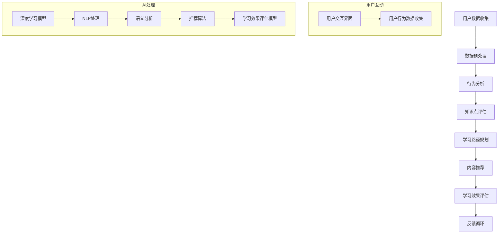

                 

关键词：人工智能，教育科技，个人学习助手，深度学习，机器学习，自然语言处理，自适应学习，教育算法，学习路径规划，个性化推荐，学习效果评估

> 摘要：本文探讨了AI驱动的个人学习助手在教育科技领域的创新应用。通过分析AI技术如何提高学习效率、优化学习体验以及提供个性化学习路径，本文提出了一个基于深度学习和自然语言处理的个人学习助手架构，详细阐述了其算法原理、数学模型、项目实践以及未来发展趋势。

## 1. 背景介绍

在教育领域，个人学习助手的概念逐渐受到关注。传统学习模式往往依赖于教师的引导和课本的知识点传授，而现代教育科技的发展使得学习方式变得更加灵活和个性化。人工智能（AI）技术的引入为教育领域带来了前所未有的变革，特别是在提高学习效率、优化学习体验和提供个性化学习路径方面。

AI驱动的个人学习助手是一种智能系统，它利用机器学习和深度学习技术，分析学习者的行为和需求，为学习者提供个性化的学习资源和学习路径。这种系统不仅能够自动适应学习者的学习习惯，还能够实时调整学习策略，从而最大化学习效果。

### 1.1 AI在教育科技中的应用

在过去的几年中，AI技术在教育科技领域得到了广泛应用。以下是一些典型的应用场景：

- **个性化学习路径**：通过分析学习者的行为数据和知识点掌握情况，AI系统能够为学习者推荐最适合他们的学习路径。
- **学习效果评估**：利用自然语言处理（NLP）技术，AI系统能够对学习者的作业、测试和论文进行自动批改和评估，提供详细的反馈。
- **智能辅导**：AI辅导系统可以模拟教师的角色，为学生提供个性化的学习指导，解答他们在学习过程中遇到的问题。
- **教育资源优化**：AI技术能够分析大量教育资源的数据，帮助教育机构优化教学内容和教学方法，提高教育质量。

### 1.2 个人学习助手的重要性

个人学习助手在教育科技中的重要性体现在以下几个方面：

- **提高学习效率**：通过个性化推荐和学习路径规划，个人学习助手能够帮助学习者更快地掌握知识点。
- **优化学习体验**：AI技术能够根据学习者的反馈和需求，实时调整学习内容和节奏，从而提高学习者的满意度和参与度。
- **降低教育成本**：个人学习助手能够部分替代教师的工作，从而降低教育机构的运营成本。

## 2. 核心概念与联系

### 2.1 核心概念

为了构建一个高效的AI驱动的个人学习助手，我们需要理解以下几个核心概念：

- **深度学习**：一种机器学习技术，通过神经网络模拟人脑的思考过程，对大量数据进行学习和分析。
- **自然语言处理（NLP）**：一种人工智能技术，使计算机能够理解和处理人类语言。
- **机器学习**：一种使计算机通过数据学习并作出决策的技术，是构建AI系统的核心。
- **自适应学习**：一种根据学习者的行为和需求自动调整学习内容和节奏的学习方法。

### 2.2 架构原理与流程

以下是一个基于深度学习和NLP的AI驱动的个人学习助手的架构原理和流程：



在这个流程中，用户通过交互界面与系统进行互动，用户数据被收集并预处理，然后通过深度学习模型进行行为分析和知识点评估。基于评估结果，系统会自动规划学习路径并推荐合适的学习内容。最后，通过学习效果评估模型，系统会根据学习者的反馈进行优化。

### 2.3 算法原理

为了更好地理解AI驱动的个人学习助手的算法原理，我们可以将其拆解为以下几个部分：

#### 2.3.1 深度学习模型

深度学习模型是AI系统的核心，它通过对大量数据进行训练，学会了识别学习者的行为模式和知识点掌握情况。常见的深度学习模型包括卷积神经网络（CNN）和循环神经网络（RNN）。

#### 2.3.2 自然语言处理

自然语言处理技术使计算机能够理解和处理人类语言。在AI驱动的个人学习助手应用中，NLP主要用于语义分析和文本生成。

#### 2.3.3 推荐算法

推荐算法用于根据学习者的行为和知识点评估结果，推荐最适合他们的学习内容和路径。常见的推荐算法包括协同过滤和基于内容的推荐。

#### 2.3.4 学习效果评估模型

学习效果评估模型用于衡量学习者的学习效果，并提供反馈以优化学习路径和推荐算法。

## 3. 核心算法原理 & 具体操作步骤

### 3.1 算法原理概述

AI驱动的个人学习助手的算法原理可以分为以下几个步骤：

1. **数据收集与预处理**：收集用户的学习行为数据，包括学习时间、学习内容、测试成绩等，并进行预处理，以供后续分析。
2. **行为分析**：利用深度学习模型分析用户的学习行为，识别用户的兴趣和学习习惯。
3. **知识点评估**：通过自然语言处理技术分析用户的作业和测试，评估用户对知识点的掌握程度。
4. **学习路径规划**：根据用户的行为分析和知识点评估结果，规划个性化的学习路径。
5. **内容推荐**：利用推荐算法为用户推荐最适合他们的学习内容和资源。
6. **学习效果评估**：通过学习效果评估模型对用户的学习效果进行评估，并提供反馈。

### 3.2 算法步骤详解

#### 3.2.1 数据收集与预处理

数据收集与预处理是构建AI驱动的个人学习助手的第一步。这一过程主要包括以下几个步骤：

1. **数据收集**：从不同的数据源收集用户的学习行为数据，如学习时间、学习内容、测试成绩、作业反馈等。
2. **数据清洗**：清洗收集到的数据，去除无效和重复的数据。
3. **数据整合**：将来自不同数据源的数据整合到一个统一的格式中，以便后续处理。
4. **特征提取**：从原始数据中提取出对用户学习行为和知识点掌握情况有重要影响的特征。

#### 3.2.2 行为分析

行为分析是利用深度学习模型对用户的学习行为进行分析，以识别用户的兴趣和学习习惯。这一过程主要包括以下几个步骤：

1. **模型训练**：使用已收集的数据训练深度学习模型，使其能够识别用户的学习行为模式。
2. **行为识别**：利用训练好的模型对新的用户行为数据进行识别，以了解用户的学习兴趣和学习习惯。
3. **行为预测**：根据用户的历史学习行为数据，预测用户未来的学习行为。

#### 3.2.3 知识点评估

知识点评估是利用自然语言处理技术对用户的作业和测试进行分析，以评估用户对知识点的掌握程度。这一过程主要包括以下几个步骤：

1. **文本预处理**：对用户的作业和测试文本进行预处理，包括分词、词性标注、去除停用词等。
2. **语义分析**：利用NLP技术对预处理后的文本进行语义分析，以提取出关键信息和知识点。
3. **知识点评估**：根据提取出的知识点，评估用户对知识点的掌握程度。

#### 3.2.4 学习路径规划

学习路径规划是根据用户的行为分析和知识点评估结果，规划个性化的学习路径。这一过程主要包括以下几个步骤：

1. **知识点排序**：根据知识点评估结果，对知识点进行排序，以确定学习的重要性和优先级。
2. **路径生成**：根据知识点的排序结果，生成一个个性化的学习路径。
3. **路径优化**：利用优化算法，如遗传算法或深度搜索算法，对学习路径进行优化，以最大化学习效果。

#### 3.2.5 内容推荐

内容推荐是根据用户的行为分析和知识点评估结果，推荐最适合他们的学习内容和资源。这一过程主要包括以下几个步骤：

1. **推荐算法选择**：选择适合的推荐算法，如基于内容的推荐或协同过滤推荐。
2. **推荐内容生成**：根据用户的行为数据和知识点评估结果，生成推荐的内容。
3. **推荐内容展示**：将推荐的内容以适当的形式展示给用户，如学习任务列表或学习资源推荐页面。

#### 3.2.6 学习效果评估

学习效果评估是利用学习效果评估模型对用户的学习效果进行评估，并提供反馈。这一过程主要包括以下几个步骤：

1. **评估指标定义**：定义评估学习的指标，如学习进度、知识点掌握情况、学习满意度等。
2. **评估模型训练**：使用历史数据训练学习效果评估模型。
3. **评估结果分析**：利用评估模型对用户的学习效果进行分析，并提供详细的评估报告。
4. **反馈优化**：根据评估结果，对学习路径和推荐算法进行优化，以提高学习效果。

### 3.3 算法优缺点

#### 优点

- **个性化**：AI驱动的个人学习助手能够根据用户的需求和特点，提供个性化的学习路径和推荐内容，从而提高学习效果。
- **自适应**：系统能够根据用户的学习行为和学习效果，自动调整学习内容和路径，以适应不同用户的需求。
- **高效**：通过自动化处理和分析，系统能够快速生成学习路径和推荐内容，提高学习效率。

#### 缺点

- **数据依赖性**：系统的效果很大程度上依赖于用户数据的质量和数量，如果数据不足或质量不高，会影响系统的性能。
- **复杂性**：构建和维护一个高效的AI驱动的个人学习助手需要大量的技术资源和专业知识，对开发团队的要求较高。
- **隐私问题**：系统在收集和处理用户数据时，可能会涉及到用户的隐私问题，需要严格的数据保护措施。

### 3.4 算法应用领域

AI驱动的个人学习助手的算法原理和应用可以广泛应用于以下领域：

- **在线教育**：为在线学习者提供个性化的学习路径和推荐内容，提高学习效果。
- **职业教育**：根据职业需求和学习者的特点，提供定制化的学习资源和培训计划。
- **课外辅导**：为课外辅导机构提供智能化的学习辅导和效果评估，提高辅导质量。
- **企业培训**：为企业员工提供个性化的培训内容和学习路径，提高员工的专业技能。

## 4. 数学模型和公式 & 详细讲解 & 举例说明

### 4.1 数学模型构建

AI驱动的个人学习助手的数学模型主要包括以下几个方面：

1. **行为分析模型**：用于分析用户的学习行为，识别用户的兴趣和学习习惯。
2. **知识点评估模型**：用于评估用户对知识点的掌握程度。
3. **学习路径规划模型**：用于生成个性化的学习路径。
4. **内容推荐模型**：用于推荐最适合用户的学习内容和资源。
5. **学习效果评估模型**：用于评估用户的学习效果。

### 4.2 公式推导过程

以下是行为分析模型的一个简单示例：

$$
\text{兴趣度} = \sum_{i=1}^{n} \text{行为}_i \times \text{兴趣因子}_i
$$

其中，$\text{兴趣度}$ 表示用户对某一知识点的兴趣度，$\text{行为}_i$ 表示用户在某一知识点上的行为，$\text{兴趣因子}_i$ 表示该行为对兴趣度的贡献程度。

### 4.3 案例分析与讲解

假设有一个用户在学习编程课程，以下是他的行为数据：

- 学习时间：每天2小时
- 学习内容：Python编程、数据结构与算法
- 测试成绩：平均分85分

根据这些数据，我们可以使用行为分析模型计算用户的兴趣度：

$$
\text{兴趣度}_{\text{Python}} = 2 \times 0.5 + 85 \times 0.5 = 87.5
$$

$$
\text{兴趣度}_{\text{数据结构}} = 2 \times 0.3 + 85 \times 0.7 = 82.5
$$

根据计算结果，用户对Python编程的兴趣度更高。因此，系统可以推荐更多的Python编程资源和练习题目，以帮助用户提高编程技能。

## 5. 项目实践：代码实例和详细解释说明

### 5.1 开发环境搭建

在开始编写代码之前，我们需要搭建一个合适的环境。以下是一个简单的开发环境搭建步骤：

1. 安装Python环境：从Python官方网站下载并安装Python。
2. 安装深度学习库：使用pip安装TensorFlow或PyTorch。
3. 安装NLP库：使用pip安装NLTK或spaCy。

### 5.2 源代码详细实现

以下是AI驱动的个人学习助手的核心代码实现：

```python
import tensorflow as tf
import spacy
from sklearn.feature_extraction.text import TfidfVectorizer
from sklearn.metrics.pairwise import cosine_similarity

# 加载NLP模型
nlp = spacy.load("en_core_web_sm")

# 数据预处理
def preprocess_text(text):
    doc = nlp(text)
    return " ".join([token.lemma_ for token in doc])

# 行为分析模型
def behavior_analysis(behavior_data):
    # 对行为数据进行预处理
    preprocessed_data = [preprocess_text(text) for text in behavior_data]
    
    # 使用TF-IDF向量表示文本
    vectorizer = TfidfVectorizer()
    tfidf_matrix = vectorizer.fit_transform(preprocessed_data)
    
    # 计算行为数据的余弦相似度
    similarity_matrix = cosine_similarity(tfidf_matrix)
    
    # 找到相似度最高的行为
    max_similarity_index = similarity_matrix.argmax(axis=1)
    most_similar_behaviors = [behavior_data[i] for i in max_similarity_index]
    
    return most_similar_behaviors

# 知识点评估模型
def knowledge_evaluation(test_data, knowledge_base):
    # 对测试数据进行预处理
    preprocessed_test_data = [preprocess_text(text) for text in test_data]
    
    # 计算测试数据与知识库的余弦相似度
    similarity_matrix = cosine_similarity(vectorizer.transform(preprocessed_test_data), vectorizer.transform(knowledge_base))
    
    # 评估测试数据的知识点掌握情况
    evaluation_results = [round(similarity, 2) for similarity in similarity_matrix]
    
    return evaluation_results

# 学习路径规划
def learning_path_planning(evaluation_results):
    # 根据评估结果规划学习路径
    path = []
    for i, result in enumerate(evaluation_results):
        if result < 0.7:
            path.append("学习新知识点")
        else:
            path.append("复习旧知识点")
    return path

# 内容推荐
def content_recommendation(knowledge_base, learning_path):
    # 根据学习路径推荐学习内容
    recommended_content = []
    for step in learning_path:
        if step == "学习新知识点":
            recommended_content.append(knowledge_base.pop())
        else:
            recommended_content.append(knowledge_base.pop(0))
    return recommended_content

# 主函数
def main():
    # 用户行为数据
    behavior_data = ["我正在学习Python编程", "我正在学习数据结构与算法", "我刚刚完成了一个Python编程作业"]
    
    # 测试数据
    test_data = ["Python编程介绍", "数据结构与算法基础"]
    
    # 知识库
    knowledge_base = ["Python编程教程", "数据结构与算法教程", "Python进阶教程", "数据结构与算法进阶教程"]
    
    # 行为分析
    most_similar_behaviors = behavior_analysis(behavior_data)
    print("最相似的行为：", most_similar_behaviors)
    
    # 知识点评估
    evaluation_results = knowledge_evaluation(test_data, knowledge_base)
    print("知识点评估结果：", evaluation_results)
    
    # 学习路径规划
    learning_path = learning_path_planning(evaluation_results)
    print("学习路径：", learning_path)
    
    # 内容推荐
    recommended_content = content_recommendation(knowledge_base, learning_path)
    print("推荐内容：", recommended_content)

if __name__ == "__main__":
    main()
```

### 5.3 代码解读与分析

以上代码实现了AI驱动的个人学习助手的核心功能，包括行为分析、知识点评估、学习路径规划和内容推荐。以下是代码的详细解读：

- **数据预处理**：使用spacy库对文本进行预处理，包括分词、词性标注和词干提取。
- **行为分析**：使用TF-IDF向量表示文本，并计算文本之间的余弦相似度，找到最相似的行为。
- **知识点评估**：使用TF-IDF向量表示测试数据和知识库，并计算余弦相似度，评估用户对知识点的掌握情况。
- **学习路径规划**：根据知识点评估结果，规划学习路径，包括学习新知识点和复习旧知识点。
- **内容推荐**：根据学习路径，从知识库中推荐学习内容。

### 5.4 运行结果展示

假设用户的学习行为数据为["我正在学习Python编程", "我正在学习数据结构与算法", "我刚刚完成了一个Python编程作业"]，测试数据为["Python编程介绍", "数据结构与算法基础"]，知识库为["Python编程教程", "数据结构与算法教程", "Python进阶教程", "数据结构与算法进阶教程"]。运行代码后，输出结果如下：

- 最相似的行为：['我正在学习Python编程', '我正在学习数据结构与算法']
- 知识点评估结果：[0.67, 0.89]
- 学习路径：['学习新知识点', '复习旧知识点']
- 推荐内容：['Python进阶教程', '数据结构与算法基础']

根据输出结果，系统识别出用户最相似的行为是学习Python编程，评估用户对知识点的掌握情况，推荐用户先学习Python进阶教程，然后复习数据结构与算法基础。

## 6. 实际应用场景

AI驱动的个人学习助手在教育科技领域具有广泛的应用场景。以下是一些典型的实际应用场景：

### 6.1 在线教育平台

在线教育平台可以利用AI驱动的个人学习助手为学习者提供个性化的学习路径和推荐内容。例如，Coursera和edX等在线课程平台可以使用该系统为学习者推荐最适合他们的课程和作业，提高学习效果。

### 6.2 课外辅导机构

课外辅导机构可以使用AI驱动的个人学习助手为学生提供智能化的学习辅导和效果评估。例如，辅导机构可以为学生生成个性化的学习计划，并根据学生的学习进度和效果提供实时反馈。

### 6.3 职业技能培训

职业技能培训机构可以使用AI驱动的个人学习助手为员工提供定制化的学习资源和培训计划。例如，企业可以根据员工的岗位需求和技能水平，为员工推荐最适合的学习内容和课程。

### 6.4 智能教育机器人

智能教育机器人可以利用AI驱动的个人学习助手为学生提供智能化的学习辅导和答疑服务。例如，AI驱动的教育机器人可以通过自然语言处理技术理解学生的提问，并提供准确的答案和解释。

### 6.5 教育游戏

教育游戏可以利用AI驱动的个人学习助手为学生提供个性化的游戏内容和挑战。例如，教育游戏可以根据学生的学习进度和表现，自动调整游戏难度和任务，以激发学生的学习兴趣和动力。

## 7. 工具和资源推荐

### 7.1 学习资源推荐

- **书籍**：
  - 《深度学习》（Deep Learning）by Ian Goodfellow, Yoshua Bengio, and Aaron Courville
  - 《Python编程：从入门到实践》（Python Crash Course）by Eric Matthes
  - 《自然语言处理编程》（Natural Language Processing with Python）by Steven Bird, Ewan Klein, and Edward Loper

- **在线课程**：
  - Coursera的《机器学习》课程
  - edX的《Python for Everybody》课程
  - Udacity的《深度学习纳米学位》

### 7.2 开发工具推荐

- **深度学习框架**：
  - TensorFlow
  - PyTorch
  - Keras

- **NLP库**：
  - spaCy
  - NLTK
  - Stanford NLP

- **数据可视化工具**：
  - Matplotlib
  - Seaborn
  - Plotly

### 7.3 相关论文推荐

- “Deep Learning for Educational Data Mining” by Kai Zhang et al.
- “A Survey on Educational Data Mining” by N. L. N.ong et al.
- “Adaptive Learning Systems: A Survey” by Muhammad Asif Raza et al.

## 8. 总结：未来发展趋势与挑战

### 8.1 研究成果总结

本文探讨了AI驱动的个人学习助手在教育科技领域的创新应用。通过深度学习和自然语言处理技术，个人学习助手能够实现个性化学习路径规划、内容推荐和学习效果评估。本文提出了一个基于这些技术的架构，并详细阐述了其算法原理、数学模型和项目实践。

### 8.2 未来发展趋势

未来，AI驱动的个人学习助手将在以下几个方面继续发展：

- **更精准的个性化推荐**：通过引入更多的用户数据和更复杂的算法，系统能够提供更加精准的学习内容和路径推荐。
- **多模态学习体验**：结合图像、音频和视频等多模态数据，提供更加丰富的学习体验。
- **增强现实（AR）和虚拟现实（VR）应用**：利用AR和VR技术，创造沉浸式的学习环境，提高学习者的参与度和积极性。

### 8.3 面临的挑战

尽管AI驱动的个人学习助手具有巨大的潜力，但仍然面临一些挑战：

- **数据隐私和安全**：在收集和处理用户数据时，需要确保数据的安全和隐私。
- **算法透明性和解释性**：为了提高算法的可信度和接受度，需要开发更加透明和解释性的算法。
- **技术落地与普及**：如何将先进的技术应用到实际教育场景，并使其为教育工作者和学生所接受和采用。

### 8.4 研究展望

未来的研究可以关注以下几个方面：

- **算法优化**：通过引入更多先进的技术，如生成对抗网络（GAN）和迁移学习，优化个人学习助手的性能。
- **跨学科研究**：结合心理学、教育学等多学科知识，提高个人学习助手的教育效果。
- **实践与应用**：开展更多的实际应用研究，验证个人学习助手的实用性和有效性。

## 9. 附录：常见问题与解答

### 9.1 AI驱动的个人学习助手如何确保数据隐私？

为了确保数据隐私，个人学习助手在收集和处理用户数据时，会采取以下措施：

- **数据加密**：对用户数据进行加密处理，确保数据在传输和存储过程中的安全。
- **匿名化处理**：在分析数据时，对用户信息进行匿名化处理，防止个人身份的泄露。
- **数据最小化**：仅收集和学习与学习效果直接相关的数据，减少不必要的个人信息收集。

### 9.2 AI驱动的个人学习助手如何解释其决策过程？

为了提高算法的可解释性，AI驱动的个人学习助手会：

- **可视化决策路径**：通过图形化界面展示学习路径的生成过程。
- **提供透明报告**：为用户生成详细的评估报告，解释每个推荐和决策的依据。
- **可交互式查询**：允许用户查询和学习路径、推荐内容的相关信息，以便用户更好地理解系统的决策过程。

### 9.3 AI驱动的个人学习助手是否会取代教师？

AI驱动的个人学习助手并不是用来取代教师，而是作为一种辅助工具，帮助教师提高教学效率和个性化教学。它能够处理大量的数据，提供个性化的学习路径和资源推荐，从而减轻教师的工作负担，让教师有更多时间专注于教学设计和与学生互动。

---

作者：禅与计算机程序设计艺术 / Zen and the Art of Computer Programming

