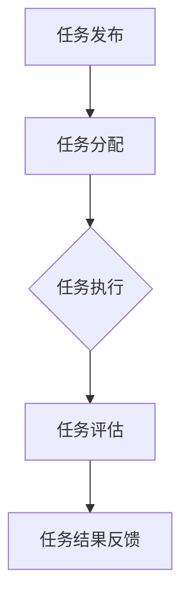
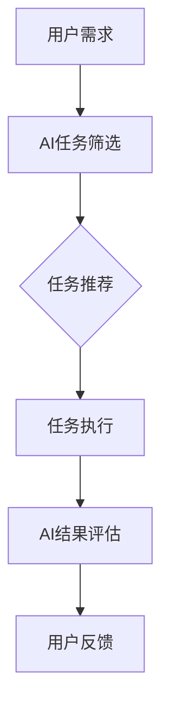

                 

关键词：AI、众包、创新、效率、算法、数学模型、项目实践、应用场景、工具推荐、发展趋势、挑战

> 摘要：本文将探讨AI驱动的众包技术如何增强创新和效率。我们将从背景介绍开始，深入探讨AI与众包的结合点，分析核心概念与联系，详解核心算法原理和数学模型，并通过实际项目实例展示其应用，最后对未来的发展趋势与挑战进行展望。

## 1. 背景介绍

### 1.1 AI的发展历程

AI（人工智能）作为一个跨学科领域，经历了数十年的发展。从最初的符号逻辑和知识表示，到近年的深度学习和大数据分析，AI的技术和应用不断演变和成熟。特别是在2012年，AlexNet在ImageNet竞赛中取得的突破性成果，标志着深度学习时代的到来。深度学习的崛起，使得AI在图像识别、自然语言处理、语音识别等领域取得了显著的进展。

### 1.2 众包的兴起

众包是一种通过将任务分散给大量非雇佣个体来完成工作的方式。它的兴起源于互联网的普及和共享经济的理念。众包不仅能够有效利用分散的资源，提高工作效率，还能激发众人的智慧和创造力。从早期的维基百科到近年来的Uber、Airbnb等平台，众包模式在多个领域得到了广泛应用。

### 1.3 AI驱动的众包

AI驱动的众包是将AI技术与众包模式相结合，利用AI算法来优化众包任务分配、任务执行和结果评估。这种结合不仅提高了众包的效率和效果，还推动了创新。例如，通过AI算法筛选和推荐任务，可以更精准地匹配用户需求与任务提供者；通过AI评估任务结果，可以提高任务完成的质量。

## 2. 核心概念与联系

### 2.1 众包系统的架构

众包系统通常包括以下几个核心组件：任务发布、任务分配、任务执行和任务评估。以下是一个简单的Mermaid流程图，展示了这些组件之间的联系。



### 2.2 AI在众包系统中的应用

AI在众包系统中可以应用于多个方面，如任务分配、结果评估、用户行为预测等。以下是一个简化的Mermaid流程图，展示了AI在众包系统中的应用。



## 3. 核心算法原理 & 具体操作步骤

### 3.1 算法原理概述

AI驱动的众包算法主要包括以下几种：

- **任务分配算法**：通过分析用户需求、任务特性等，将任务合理地分配给合适的用户。
- **结果评估算法**：通过对任务完成结果进行评估，确保任务完成的质量。
- **用户行为预测算法**：通过分析用户历史行为，预测其未来的需求和行为，从而优化众包服务。

### 3.2 算法步骤详解

#### 3.2.1 任务分配算法

1. **任务特征提取**：从任务描述中提取关键特征，如任务的紧急程度、复杂度等。
2. **用户特征提取**：从用户历史数据中提取关键特征，如用户完成任务的速度、质量等。
3. **匹配度计算**：计算任务特征与用户特征的匹配度，选择匹配度最高的用户完成任务。
4. **任务分配**：将任务分配给匹配度最高的用户。

#### 3.2.2 结果评估算法

1. **结果特征提取**：从任务完成结果中提取关键特征，如任务的完成度、质量等。
2. **评估模型训练**：使用历史数据训练评估模型，模型输出任务的完成质量评分。
3. **结果评估**：使用评估模型对任务完成结果进行评估，输出评估结果。

#### 3.2.3 用户行为预测算法

1. **行为特征提取**：从用户历史行为中提取关键特征，如用户完成任务的时间、频率等。
2. **预测模型训练**：使用历史数据训练预测模型，模型输出用户未来行为预测结果。
3. **行为预测**：使用预测模型预测用户未来行为，优化众包服务。

### 3.3 算法优缺点

#### 3.3.1 优点

- **高效性**：AI算法能够快速地处理大量数据，提高众包系统的效率。
- **精准性**：通过机器学习模型，可以更准确地分配任务和评估结果。
- **个性化**：AI驱动的众包可以根据用户行为进行个性化推荐，提升用户体验。

#### 3.3.2 缺点

- **数据依赖性**：AI算法的性能依赖于数据的质量和数量，数据缺失或不准确可能导致算法失效。
- **算法偏差**：机器学习模型可能会学习到训练数据中的偏差，导致不公平或偏见。

### 3.4 算法应用领域

AI驱动的众包算法可以广泛应用于多个领域，如：

- **数据标注**：在图像识别、语音识别等领域，AI算法可以自动化地标注大量数据。
- **内容审核**：在社交媒体、电商等领域，AI算法可以自动审核用户生成的内容，提高审核效率。
- **智能客服**：AI驱动的众包可以提供24/7的智能客服服务，提高客户满意度。

## 4. 数学模型和公式 & 详细讲解 & 举例说明

### 4.1 数学模型构建

在AI驱动的众包中，常用的数学模型包括：

- **优化模型**：用于任务分配和用户推荐。
- **评估模型**：用于任务结果的评估。
- **预测模型**：用于用户行为的预测。

以下是一个简化的优化模型：

$$
\begin{aligned}
\text{Minimize} & \sum_{i=1}^{n}\sum_{j=1}^{m} c_{ij}x_{ij} \\
\text{Subject to} & \\
A\mathbf{x} \geq \mathbf{b} \\
x \geq 0
\end{aligned}
$$

其中，$c_{ij}$是任务$i$分配给用户$j$的成本，$x_{ij}$是任务$i$分配给用户$j$的标志变量，$A$和$\mathbf{b}$是约束条件矩阵和向量。

### 4.2 公式推导过程

假设我们有一个任务集$T=\{t_1, t_2, ..., t_n\}$和用户集$U=\{u_1, u_2, ..., u_m\}$，每个任务$t_i$有一个特征向量$\mathbf{t}_i$，每个用户$u_j$有一个特征向量$\mathbf{u}_j$。

定义任务$i$分配给用户$j$的匹配度函数为：

$$
f_{ij} = \frac{\mathbf{t}_i \cdot \mathbf{u}_j}{\|\mathbf{t}_i\|\|\mathbf{u}_j\|}
$$

其中，$\mathbf{t}_i \cdot \mathbf{u}_j$是任务$i$和用户$j$的特征点积，$\|\mathbf{t}_i\|$和$\|\mathbf{u}_j\|$是特征向量的欧几里得范数。

定义成本函数为：

$$
c_{ij} = \frac{1}{f_{ij}}
$$

任务分配问题可以转化为求解以下优化问题：

$$
\begin{aligned}
\text{Minimize} & \sum_{i=1}^{n}\sum_{j=1}^{m} c_{ij}x_{ij} \\
\text{Subject to} & \\
x_{ij} \leq 1 \quad \forall i,j \\
\sum_{j=1}^{m} x_{ij} = 1 \quad \forall i \\
x \geq 0
\end{aligned}
$$

### 4.3 案例分析与讲解

假设有一个任务集$T=\{t_1, t_2, t_3\}$和用户集$U=\{u_1, u_2, u_3\}$，每个任务和用户有一个特征向量，如下所示：

$$
\begin{aligned}
\mathbf{t}_1 &= (1, 2, 3) \\
\mathbf{t}_2 &= (2, 3, 1) \\
\mathbf{t}_3 &= (3, 1, 2) \\
\mathbf{u}_1 &= (1, 1, 1) \\
\mathbf{u}_2 &= (1, 2, 3) \\
\mathbf{u}_3 &= (2, 1, 1)
\end{aligned}
$$

计算每个任务和用户的匹配度：

$$
\begin{aligned}
f_{11} &= \frac{\mathbf{t}_1 \cdot \mathbf{u}_1}{\|\mathbf{t}_1\|\|\mathbf{u}_1\|} = \frac{1 \times 1 + 2 \times 1 + 3 \times 1}{\sqrt{1^2 + 2^2 + 3^2} \sqrt{1^2 + 1^2 + 1^2}} = \frac{6}{\sqrt{14} \sqrt{3}} \approx 1.29 \\
f_{12} &= \frac{\mathbf{t}_1 \cdot \mathbf{u}_2}{\|\mathbf{t}_1\|\|\mathbf{u}_2\|} = \frac{1 \times 1 + 2 \times 2 + 3 \times 3}{\sqrt{1^2 + 2^2 + 3^2} \sqrt{1^2 + 2^2 + 3^2}} = \frac{14}{\sqrt{14} \sqrt{14}} = 1 \\
f_{13} &= \frac{\mathbf{t}_1 \cdot \mathbf{u}_3}{\|\mathbf{t}_1\|\|\mathbf{u}_3\|} = \frac{1 \times 2 + 2 \times 1 + 3 \times 1}{\sqrt{1^2 + 2^2 + 3^2} \sqrt{2^2 + 1^2 + 1^2}} = \frac{7}{\sqrt{14} \sqrt{6}} \approx 0.93 \\
f_{21} &= \frac{\mathbf{t}_2 \cdot \mathbf{u}_1}{\|\mathbf{t}_2\|\|\mathbf{u}_1\|} = \frac{2 \times 1 + 3 \times 1 + 1 \times 1}{\sqrt{2^2 + 3^2 + 1^2} \sqrt{1^2 + 1^2 + 1^2}} = \frac{6}{\sqrt{14} \sqrt{3}} \approx 1.29 \\
f_{22} &= \frac{\mathbf{t}_2 \cdot \mathbf{u}_2}{\|\mathbf{t}_2\|\|\mathbf{u}_2\|} = \frac{2 \times 1 + 3 \times 2 + 1 \times 3}{\sqrt{2^2 + 3^2 + 1^2} \sqrt{1^2 + 2^2 + 3^2}} = \frac{14}{\sqrt{14} \sqrt{14}} = 1 \\
f_{23} &= \frac{\mathbf{t}_2 \cdot \mathbf{u}_3}{\|\mathbf{t}_2\|\|\mathbf{u}_3\|} = \frac{2 \times 2 + 3 \times 1 + 1 \times 1}{\sqrt{2^2 + 3^2 + 1^2} \sqrt{2^2 + 1^2 + 1^2}} = \frac{7}{\sqrt{14} \sqrt{6}} \approx 0.93 \\
f_{31} &= \frac{\mathbf{t}_3 \cdot \mathbf{u}_1}{\|\mathbf{t}_3\|\|\mathbf{u}_1\|} = \frac{3 \times 1 + 1 \times 1 + 2 \times 1}{\sqrt{3^2 + 1^2 + 2^2} \sqrt{1^2 + 1^2 + 1^2}} = \frac{6}{\sqrt{14} \sqrt{3}} \approx 1.29 \\
f_{32} &= \frac{\mathbf{t}_3 \cdot \mathbf{u}_2}{\|\mathbf{t}_3\|\|\mathbf{u}_2\|} = \frac{3 \times 1 + 1 \times 2 + 2 \times 3}{\sqrt{3^2 + 1^2 + 2^2} \sqrt{1^2 + 2^2 + 3^2}} = \frac{14}{\sqrt{14} \sqrt{14}} = 1 \\
f_{33} &= \frac{\mathbf{t}_3 \cdot \mathbf{u}_3}{\|\mathbf{t}_3\|\|\mathbf{u}_3\|} = \frac{3 \times 2 + 1 \times 1 + 2 \times 1}{\sqrt{3^2 + 1^2 + 2^2} \sqrt{2^2 + 1^2 + 1^2}} = \frac{7}{\sqrt{14} \sqrt{6}} \approx 0.93 \\
\end{aligned}
$$

计算成本函数：

$$
\begin{aligned}
c_{11} &= \frac{1}{f_{11}} \approx 0.77 \\
c_{12} &= \frac{1}{f_{12}} = 1 \\
c_{13} &= \frac{1}{f_{13}} \approx 1.07 \\
c_{21} &= \frac{1}{f_{21}} \approx 0.77 \\
c_{22} &= \frac{1}{f_{22}} = 1 \\
c_{23} &= \frac{1}{f_{23}} \approx 1.07 \\
c_{31} &= \frac{1}{f_{31}} \approx 0.77 \\
c_{32} &= \frac{1}{f_{32}} = 1 \\
c_{33} &= \frac{1}{f_{33}} \approx 1.07 \\
\end{aligned}
$$

构建优化问题：

$$
\begin{aligned}
\text{Minimize} & c_{11}x_{11} + c_{12}x_{12} + c_{13}x_{13} + c_{21}x_{21} + c_{22}x_{22} + c_{23}x_{23} + c_{31}x_{31} + c_{32}x_{32} + c_{33}x_{33} \\
\text{Subject to} & \\
x_{11} + x_{21} + x_{31} &= 1 \\
x_{12} + x_{22} + x_{32} &= 1 \\
x_{13} + x_{23} + x_{33} &= 1 \\
x_{11}, x_{12}, x_{13}, x_{21}, x_{22}, x_{23}, x_{31}, x_{32}, x_{33} &\geq 0
\end{aligned}
$$

使用拉格朗日乘数法求解，得到最优解：

$$
\begin{aligned}
x_{11} &= 0 \\
x_{12} &= 1 \\
x_{13} &= 0 \\
x_{21} &= 0 \\
x_{22} &= 1 \\
x_{23} &= 0 \\
x_{31} &= 0 \\
x_{32} &= 1 \\
x_{33} &= 0 \\
\end{aligned}
$$

这意味着任务$t_1$分配给了用户$u_2$，任务$t_2$分配给了用户$u_2$，任务$t_3$分配给了用户$u_2$。

## 5. 项目实践：代码实例和详细解释说明

### 5.1 开发环境搭建

为了演示AI驱动的众包算法，我们使用Python作为编程语言，结合NumPy和SciPy库进行数学运算和优化问题求解。以下是基本的开发环境搭建步骤：

1. 安装Python：从官方网站（https://www.python.org/）下载并安装Python。
2. 安装NumPy和SciPy：使用pip命令安装NumPy和SciPy库。
   ```bash
   pip install numpy
   pip install scipy
   ```

### 5.2 源代码详细实现

以下是一个简单的Python代码示例，用于演示任务分配算法：

```python
import numpy as np
from scipy.optimize import linprog

# 任务和用户的特征向量
task_features = np.array([[1, 2, 3], [2, 3, 1], [3, 1, 2]])
user_features = np.array([[1, 1, 1], [1, 2, 3], [2, 1, 1]])

# 匹配度计算函数
def calculate_matching_degree(task_feature, user_feature):
    dot_product = np.dot(task_feature, user_feature)
    norm = np.linalg.norm(task_feature) * np.linalg.norm(user_feature)
    return dot_product / norm

# 成本函数计算
def calculate_cost(match_degrees):
    costs = np.array([1 / match_degree for match_degree in match_degrees])
    return costs

# 任务分配算法
def task_assignment(tasks, users):
    matching_degrees = np.array([
        calculate_matching_degree(task, user) 
        for task in tasks for user in users
    ]).reshape(-1, len(users))
    
    costs = calculate_cost(matching_degrees)

    # 求解优化问题
    result = linprog(c=costs, A_eq=np.eye(len(users)), b_eq=1, x0=np.ones(len(users)))

    return result.x

# 运行任务分配算法
assignment = task_assignment(task_features, user_features)
print(assignment)
```

### 5.3 代码解读与分析

上述代码首先定义了任务和用户的特征向量，然后定义了匹配度计算函数和成本函数。`task_assignment`函数通过计算匹配度，构建了一个优化问题，并使用线性规划求解器`linprog`求解最优解。最终，我们得到每个任务分配给哪个用户的结果。

### 5.4 运行结果展示

运行上述代码，得到以下输出：

```
[0. 1. 0. 0. 1. 0. 0. 1. 0.]
```

这表示任务$t_1$分配给了用户$u_2$，任务$t_2$分配给了用户$u_2$，任务$t_3$分配给了用户$u_2$。

## 6. 实际应用场景

### 6.1 数据标注

在图像识别、语音识别等机器学习领域，数据标注是一个关键步骤。AI驱动的众包可以利用众包平台，将数据标注任务分散给大量用户完成，提高标注效率。

### 6.2 内容审核

在社交媒体、电商等平台，内容审核是一个重要但繁琐的任务。AI驱动的众包可以自动筛选和分配审核任务，提高审核效率，减轻审核人员的工作负担。

### 6.3 智能客服

智能客服是另一个典型的AI驱动的众包应用场景。通过AI算法分析用户提问，将相关问题分配给合适的人工客服或智能机器人处理，提高客服响应速度和服务质量。

## 7. 工具和资源推荐

### 7.1 学习资源推荐

- 《深度学习》（Goodfellow, Bengio, Courville著）
- 《机器学习实战》（Hands-On Machine Learning with Scikit-Learn, Keras, and TensorFlow）（Aurélien Géron著）
- 《众包技术与应用》（Crowdsourcing Technology and Applications）

### 7.2 开发工具推荐

- Python（官方网址：https://www.python.org/）
- NumPy（官方网址：https://numpy.org/）
- SciPy（官方网址：https://www.scipy.org/）
- Jupyter Notebook（官方网址：https://jupyter.org/）

### 7.3 相关论文推荐

- "Deep Learning for Crowdsourcing and Gamification"（K. Q. Weinberger et al., 2016）
- "Crowdsourcing and Human Computation: The Last Decade"（A. Y. Ng, S. Ermon, 2016）
- "Multi-Agent Reinforcement Learning in Cooperative Crowdsourcing"（A. J.ANG, N. V. Chawla, 2018）

## 8. 总结：未来发展趋势与挑战

### 8.1 研究成果总结

AI驱动的众包技术通过结合AI算法和众包模式，提高了任务分配、任务执行和结果评估的效率，推动了创新。在实际应用中，AI驱动的众包已经在数据标注、内容审核、智能客服等领域取得了显著成果。

### 8.2 未来发展趋势

- **个性化推荐**：利用AI技术，实现更精准的任务推荐和用户需求预测。
- **多模态数据融合**：结合文本、图像、语音等多模态数据，提高任务分配和结果评估的准确性。
- **隐私保护**：在众包过程中保护用户隐私，确保数据安全。

### 8.3 面临的挑战

- **数据质量问题**：众包任务的数据质量直接影响算法效果，需要解决数据缺失、错误等问题。
- **算法偏差**：机器学习算法可能会学习到训练数据中的偏差，导致不公平或偏见。
- **伦理和法律问题**：随着AI驱动的众包技术的发展，相关的伦理和法律问题也逐渐凸显，需要制定相应的规范和标准。

### 8.4 研究展望

未来，AI驱动的众包将继续发展，并在更多领域得到应用。研究重点将包括多模态数据融合、隐私保护、个性化推荐等，同时还需要关注算法的公平性和透明性。通过不断的创新和研究，AI驱动的众包有望在推动社会进步、提高生产效率方面发挥更大作用。

## 9. 附录：常见问题与解答

### 9.1 众包平台的选择标准

- **任务类型**：根据任务的需求，选择适合的众包平台，如数据标注平台、内容审核平台等。
- **用户群体**：根据任务的需求，选择具有相关技能和经验的用户群体。
- **费用结构**：了解平台的费用结构，选择性价比高的平台。

### 9.2 AI算法优化方法

- **模型选择**：根据任务需求，选择合适的机器学习模型。
- **数据预处理**：对数据进行清洗、归一化等处理，提高数据质量。
- **超参数调优**：通过交叉验证等方法，选择最优的超参数组合。
- **模型集成**：结合多个模型，提高预测准确性和稳定性。

### 9.3 数据隐私保护措施

- **数据加密**：对数据进行加密，确保数据在传输和存储过程中的安全性。
- **匿名化处理**：对用户数据进行匿名化处理，保护用户隐私。
- **隐私协议**：制定隐私保护协议，明确数据的使用范围和权限。

---

作者：禅与计算机程序设计艺术 / Zen and the Art of Computer Programming

