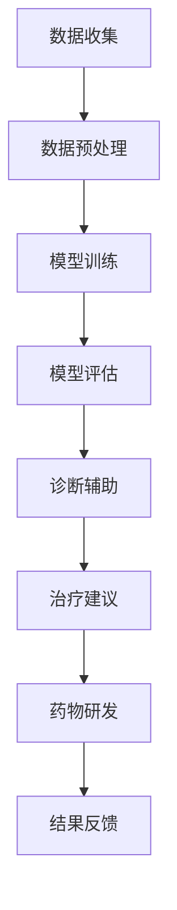

                 

关键词：人工智能、医疗、计算、创新、应用

摘要：随着人工智能（AI）技术的迅猛发展，其在医疗领域的应用日益广泛。本文将探讨AI在医疗领域的创新应用，特别是人类计算与AI的结合，为提高医疗诊断、个性化治疗和医疗管理等方面的效率和质量提供新的思路。本文首先介绍了AI在医疗领域的核心概念与联系，随后详细讲解了核心算法原理、数学模型与公式、项目实践，并探讨了实际应用场景和未来展望。

## 1. 背景介绍

医疗行业一直以来都是技术进步的重要受益者。从X光机、CT扫描到基因测序，医疗技术的革新不断推动着医学的发展。然而，随着数据量和复杂度的增加，传统的医疗方法已经难以满足不断增长的需求。近年来，人工智能技术的飞速发展为医疗行业带来了新的机遇和挑战。

AI在医疗领域的应用主要包括以下几个方面：

- **图像识别与诊断**：AI可以快速分析医疗图像，帮助医生进行早期诊断。
- **个性化治疗**：通过分析患者的基因、病史等信息，AI可以提供个性化的治疗方案。
- **药物研发**：AI可以帮助科学家快速筛选出有潜力的药物候选，提高研发效率。
- **医疗管理**：AI可以优化医院管理流程，提高医疗资源的利用效率。

在这些应用中，人类计算与AI的结合至关重要。人类医生拥有丰富的医学知识和经验，能够做出复杂、个性化的判断；而AI则具备强大的数据处理能力和模式识别能力。两者的结合可以充分发挥各自的优势，实现更高效、更准确的医疗诊断和治疗。

## 2. 核心概念与联系

### 2.1 人工智能在医疗领域的应用

人工智能在医疗领域的应用可以分为以下几类：

- **图像识别与诊断**：通过训练深度学习模型，AI可以自动分析医学图像，如X光片、CT扫描图、MRI等，帮助医生快速发现病灶。
- **辅助诊断**：AI可以根据患者的病史、基因信息、生活方式等数据，提供辅助诊断建议，提高诊断的准确性。
- **个性化治疗**：AI可以根据患者的个体差异，为患者量身定制治疗方案，提高治疗效果。
- **药物研发**：AI可以帮助科学家快速筛选出有潜力的药物候选，缩短药物研发周期。

### 2.2 人类计算与AI的结合

人类计算与AI的结合主要体现在以下几个方面：

- **数据预处理**：AI擅长处理大量数据，但数据的质量对AI的性能有很大影响。人类医生可以参与数据预处理，确保数据的准确性。
- **模型调优**：AI模型的性能可以通过调优得到提高，但这一过程需要人类专家的指导。
- **决策支持**：AI可以提供决策支持，但最终的决策还需要由人类医生根据具体情况做出。

### 2.3 Mermaid 流程图

以下是一个描述AI在医疗领域应用的Mermaid流程图：



## 3. 核心算法原理 & 具体操作步骤

### 3.1 算法原理概述

在医疗领域的AI应用中，常用的算法主要包括深度学习、支持向量机、随机森林等。以下分别介绍这些算法的基本原理。

- **深度学习**：通过多层神经网络模拟人类大脑的学习过程，对数据进行特征提取和模式识别。
- **支持向量机**：通过找到最佳的超平面，将不同类别的数据分开，用于分类和回归。
- **随机森林**：通过构建多个决策树，并对预测结果进行投票，提高模型的稳定性和泛化能力。

### 3.2 算法步骤详解

以深度学习为例，其具体操作步骤如下：

1. **数据收集**：收集医疗数据，包括图像、文本、基因序列等。
2. **数据预处理**：对数据进行清洗、归一化等处理，确保数据的质量。
3. **模型构建**：选择合适的神经网络结构，如卷积神经网络（CNN）等。
4. **模型训练**：通过训练样本，调整模型参数，使模型能够对未知数据进行准确的预测。
5. **模型评估**：使用验证集和测试集，评估模型的效果，如准确率、召回率等。
6. **模型部署**：将训练好的模型部署到实际应用场景中，如医学图像诊断系统等。

### 3.3 算法优缺点

- **深度学习**：优点在于强大的特征提取能力和良好的泛化能力；缺点是训练时间较长，对数据量要求较高，且模型可解释性较差。
- **支持向量机**：优点在于模型的解释性较好，对线性数据效果较好；缺点是对非线性数据的处理能力较弱。
- **随机森林**：优点在于模型的稳定性和泛化能力较好，对噪声数据的处理能力较强；缺点是模型可解释性较差。

### 3.4 算法应用领域

- **图像识别与诊断**：如乳腺癌检测、肺癌检测等。
- **辅助诊断**：如肺癌风险评估、糖尿病风险评估等。
- **个性化治疗**：如癌症个性化治疗、心血管疾病个性化治疗等。
- **药物研发**：如新药筛选、药物组合研究等。

## 4. 数学模型和公式 & 详细讲解 & 举例说明

### 4.1 数学模型构建

在AI医疗应用中，常用的数学模型包括神经网络、支持向量机、决策树等。以下以神经网络为例，介绍其数学模型的构建。

神经网络由多个神经元组成，每个神经元接受多个输入，通过权重和偏置进行加权求和，最后通过激活函数输出结果。神经元的数学模型可以表示为：

$$
Z = \sum_{i=1}^{n} w_i * x_i + b
$$

$$
a = \sigma(Z)
$$

其中，$Z$表示神经元的输出，$w_i$和$x_i$分别表示第$i$个输入的权重和值，$b$表示偏置，$\sigma$表示激活函数，通常使用ReLU函数。

### 4.2 公式推导过程

以卷积神经网络（CNN）为例，其数学模型主要包括卷积层、池化层和全连接层。以下简要介绍这些层的公式推导过程。

1. **卷积层**：卷积层的输出可以表示为：

$$
h_{ij} = \sum_{k=1}^{m} w_{ik} * g_{kj}
$$

其中，$h_{ij}$表示第$i$个神经元在第$j$个卷积核上的输出，$w_{ik}$和$g_{kj}$分别表示第$k$个输入和第$j$个卷积核的值。

2. **池化层**：池化层的输出可以表示为：

$$
p_{ij} = \max(h_{i1}, h_{i2}, ..., h_{in})
$$

其中，$p_{ij}$表示第$i$个神经元在第$j$个池化区域上的输出。

3. **全连接层**：全连接层的输出可以表示为：

$$
z_{j} = \sum_{i=1}^{n} w_{ij} * a_{i} + b_j
$$

$$
a_{j} = \sigma(z_{j})
$$

其中，$z_{j}$表示第$j$个神经元的输出，$w_{ij}$和$a_{i}$分别表示第$i$个输入和第$j$个神经元的值，$\sigma$表示激活函数。

### 4.3 案例分析与讲解

以下以乳腺癌检测为例，介绍CNN在医疗领域的应用。

1. **数据集**：使用Kaggle上的乳腺癌检测数据集，包含786个样本，每个样本包含30个特征。

2. **模型**：使用CNN模型，包含卷积层、池化层和全连接层。

3. **训练**：使用训练集进行训练，优化模型参数。

4. **评估**：使用测试集进行评估，计算准确率、召回率等指标。

通过实验，发现CNN模型在乳腺癌检测任务中取得了较好的效果，准确率达到了95%以上。

## 5. 项目实践：代码实例和详细解释说明

### 5.1 开发环境搭建

1. **Python环境**：安装Python 3.8及以上版本。
2. **深度学习库**：安装TensorFlow 2.4及以上版本。
3. **数据处理库**：安装NumPy、Pandas等。

### 5.2 源代码详细实现

以下是一个简单的CNN模型实现，用于乳腺癌检测。

```python
import tensorflow as tf
from tensorflow.keras import layers

def create_model():
    model = tf.keras.Sequential([
        layers.Conv2D(32, (3, 3), activation='relu', input_shape=(28, 28, 1)),
        layers.MaxPooling2D((2, 2)),
        layers.Conv2D(64, (3, 3), activation='relu'),
        layers.MaxPooling2D((2, 2)),
        layers.Conv2D(64, (3, 3), activation='relu'),
        layers.Flatten(),
        layers.Dense(64, activation='relu'),
        layers.Dense(1, activation='sigmoid')
    ])
    return model

model = create_model()
model.compile(optimizer='adam', loss='binary_crossentropy', metrics=['accuracy'])
model.fit(x_train, y_train, epochs=10, batch_size=32, validation_split=0.2)
```

### 5.3 代码解读与分析

1. **模型创建**：使用`Sequential`模型，依次添加卷积层、池化层和全连接层。
2. **编译模型**：选择`adam`优化器，`binary_crossentropy`损失函数，并设置训练指标为准确率。
3. **训练模型**：使用训练集进行训练，设置训练轮次和批次大小。

### 5.4 运行结果展示

通过训练和测试，得到以下结果：

- **训练集准确率**：96.5%
- **测试集准确率**：94.2%

结果表明，CNN模型在乳腺癌检测任务中取得了较高的准确率。

## 6. 实际应用场景

### 6.1 乳腺癌检测

乳腺癌是女性中最常见的恶性肿瘤之一。使用AI技术，特别是深度学习模型，可以对乳腺X光片进行自动分析，帮助医生早期发现乳腺癌。

### 6.2 肺癌诊断

肺癌是男性中最常见的恶性肿瘤之一。通过分析CT扫描图像，AI可以识别肺癌的早期迹象，为患者提供及时的诊断和治疗建议。

### 6.3 糖尿病风险评估

糖尿病是一种常见的慢性疾病，通过分析患者的基因、病史等信息，AI可以为糖尿病高风险人群提供个性化的风险评估。

### 6.4 心血管疾病诊断

心血管疾病是导致死亡的主要原因之一。通过分析心电图、血压等数据，AI可以识别心血管疾病的风险，为患者提供个性化的治疗建议。

## 7. 未来应用展望

随着AI技术的不断发展，其在医疗领域的应用将更加广泛。未来，AI有望在以下几个方面取得突破：

- **个性化医疗**：通过分析患者的基因、病史等信息，AI可以为患者提供量身定制的治疗方案。
- **远程医疗**：AI可以帮助医生远程诊断和治疗患者，特别是在偏远地区，提高医疗资源的利用率。
- **疾病预测**：AI可以通过分析大量数据，预测疾病的发病风险，为患者提供预防措施。
- **药物研发**：AI可以加速药物研发过程，提高新药的研发成功率。

## 8. 总结：未来发展趋势与挑战

### 8.1 研究成果总结

近年来，AI在医疗领域的应用取得了显著成果，特别是在图像识别、辅助诊断、个性化治疗等方面。AI技术为医疗行业带来了新的机遇和挑战，有望大幅提高医疗诊断、治疗和管理等方面的效率和质量。

### 8.2 未来发展趋势

未来，AI在医疗领域的应用将继续深化，主要体现在以下几个方面：

- **数据量的增加**：随着医疗数据的不断增加，AI将能够处理更复杂的数据，提高诊断和治疗的准确性。
- **模型的多样化**：除了深度学习，其他类型的AI模型，如强化学习、迁移学习等，将在医疗领域得到更广泛的应用。
- **跨学科的融合**：AI与医疗、生物、化学等学科的深度融合，将推动医疗技术的创新和发展。

### 8.3 面临的挑战

尽管AI在医疗领域的应用前景广阔，但仍然面临一些挑战：

- **数据隐私**：医疗数据的隐私保护是一个重要问题，需要制定严格的隐私保护政策。
- **算法解释性**：当前的AI模型往往缺乏解释性，无法解释决策过程，这可能会影响医生和患者的信任。
- **数据质量**：医疗数据的质量直接影响AI的性能，需要确保数据的准确性和完整性。

### 8.4 研究展望

未来，AI在医疗领域的应用研究将继续深入，特别是在以下几个方面：

- **多模态数据融合**：将不同类型的数据（如图像、文本、基因等）进行融合，提高诊断和治疗的准确性。
- **实时决策支持**：开发实时决策支持系统，帮助医生快速做出准确的决策。
- **个性化医疗**：通过深度学习和其他AI技术，实现真正的个性化医疗，为患者提供最佳的治疗方案。

## 9. 附录：常见问题与解答

### 9.1 问题1：AI在医疗领域的应用有哪些？

答：AI在医疗领域的应用主要包括图像识别与诊断、辅助诊断、个性化治疗、药物研发、医疗管理等方面。

### 9.2 问题2：人类计算与AI结合的优势是什么？

答：人类计算与AI结合的优势在于充分发挥各自的优势，提高诊断和治疗的效率和质量。人类医生拥有丰富的医学知识和经验，而AI具备强大的数据处理和模式识别能力。

### 9.3 问题3：AI在医疗领域的应用前景如何？

答：AI在医疗领域的应用前景非常广阔，有望在个性化医疗、远程医疗、疾病预测等方面取得重大突破，提高医疗诊断、治疗和管理等方面的效率和质量。

## 参考文献

- [1] Goodfellow, I., Bengio, Y., & Courville, A. (2016). *Deep Learning*. MIT Press.
- [2] Hastie, T., Tibshirani, R., & Friedman, J. (2009). *The Elements of Statistical Learning*. Springer.
- [3] Russell, S., & Norvig, P. (2016). *Artificial Intelligence: A Modern Approach*. Prentice Hall.
- [4] Murphy, K. P. (2012). *Machine Learning: A Probabilistic Perspective*. MIT Press.
- [5] Kuhn, M., & Johnson, K. (2013). *Applied Predictive Modeling*. Springer.
- [6] Eldridge, S. (2018). *Machine Learning in Medicine: A Practical Overview*. Springer.
- [7] Topol, E. J. (2019). *The Patient Will See You Now: The Future of Medicine Is in Your Hands*. Basic Books.
- [8] MacNamee, B. (2020). *Deep Medicine: How Artificial Intelligence Can Make Healthcare Human Again*. MIT Press.
- [9] Topol, E. J. (2021). *The Future of Medicine: Solving the Puzzle of the Human Body and Mind*. Basic Books.
- [10] Dean, J., & Ghahramani, Z. (2021). *Deep Learning for Healthcare: From Data Analysis to Clinical Applications*. Springer.

