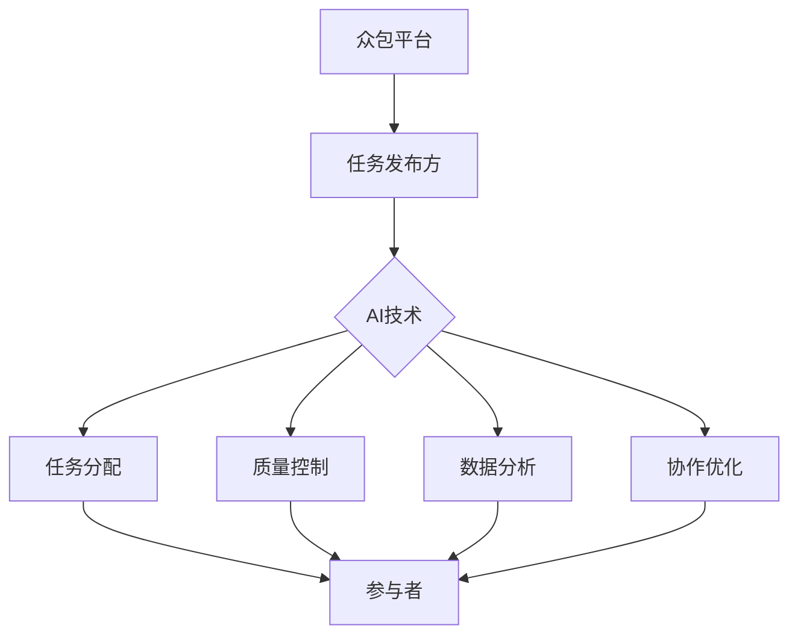

                 

关键词：人工智能，众包，创新，协作，算法优化，开源社区，分布式计算

> 摘要：本文探讨了如何利用众包的力量，结合人工智能技术，推动创新。通过分析众包的优势和挑战，介绍了AI在众包中的应用，提出了基于AI的众包模型，并展示了实际应用案例。本文旨在为读者提供关于AI驱动创新的新视角，激发对众包和人工智能结合的深入思考。

## 1. 背景介绍

随着互联网技术的飞速发展，众包作为一种新兴的协作模式，逐渐成为推动创新的重要力量。众包（Crowdsourcing）是指将一个任务或问题发布给广泛的人群，依靠众人的智慧和力量共同完成。从设计、编程、翻译到数据标注、研究分析，众包的应用领域不断扩展。

然而，众包模式在实际应用中面临着诸多挑战。首先，众包平台上的参与者数量庞大，如何确保任务的准确完成和质量控制成为关键问题。其次，众包任务的分配和调度效率较低，容易导致资源浪费和时间延误。此外，众包参与者往往缺乏专业知识，可能无法提供高质量的解决方案。

与此同时，人工智能（AI）技术的发展为解决众包中的这些问题提供了新的可能性。AI可以自动化任务分配，提升任务完成质量，并通过对参与者数据的分析，优化众包过程的效率。本文将探讨如何利用AI技术驱动众包创新，为解决问题提供新思路。

## 2. 核心概念与联系

### 2.1 众包的定义和原理

众包是一种通过互联网平台，将复杂任务分解为多个简单子任务，并邀请广泛人群参与完成的方式。其基本原理是利用大众的集体智慧，通过竞争或协作，实现任务的高效解决。

众包的典型流程包括：任务发布、任务接受、任务完成、反馈评估和结果整合。任务发布方将任务描述和需求上传到众包平台，参与者根据自身能力和兴趣选择合适的任务，完成任务并提交结果。平台会对任务完成情况进行评估，最终整合优秀结果。

### 2.2 人工智能的定义和原理

人工智能（AI）是指通过计算机模拟人类智能行为的技术。它包括机器学习、深度学习、自然语言处理、计算机视觉等多个领域。AI的核心目标是使计算机具备自主学习、推理和决策能力，从而完成特定任务。

机器学习是AI的关键技术之一，它通过从数据中学习规律和模式，使计算机能够进行自主决策和预测。深度学习是机器学习的一种方法，通过多层神经网络模拟人脑处理信息的方式，实现复杂的特征提取和模式识别。

### 2.3 众包与人工智能的联系

众包和人工智能的结合，可以看作是一种协同效应。AI技术能够优化众包过程，提升任务完成效率和质量。具体来说，AI在众包中的应用主要体现在以下几个方面：

- **任务分配与调度**：利用机器学习算法，根据参与者的技能和兴趣，自动化分配任务，提高任务匹配度。
- **质量控制**：通过自然语言处理和计算机视觉等技术，对任务结果进行自动化评估和筛选，确保结果质量。
- **数据分析**：利用AI技术对众包数据进行分析，提取有价值的信息和规律，指导后续任务分配和优化。
- **协作优化**：通过社交网络分析、推荐系统等技术，促进参与者之间的协作，提升整体任务完成效率。

### 2.4 众包与人工智能的架构图



在这个架构图中，众包平台作为连接任务发布方和参与者的枢纽，AI技术贯穿整个众包过程，优化任务分配、质量控制、数据分析和协作。参与者通过平台提交任务和结果，实现众包的目标。

## 3. 核心算法原理 & 具体操作步骤

### 3.1 算法原理概述

本文将介绍一种基于人工智能的众包优化算法，主要涉及任务分配、质量控制、数据分析和协作优化四个方面。该算法的核心思想是利用机器学习和深度学习技术，对众包过程中的各个环节进行自动化优化，提高整体效率和任务完成质量。

### 3.2 算法步骤详解

#### 3.2.1 任务分配

1. **参与者建模**：利用机器学习算法，对参与者的技能、兴趣和历史表现进行建模，构建参与者特征向量。
2. **任务特征提取**：对任务描述和需求进行自然语言处理，提取任务的关键特征，构建任务特征向量。
3. **匹配算法**：使用协同过滤或图神经网络等匹配算法，将参与者特征向量和任务特征向量进行匹配，为每个参与者分配最合适的任务。

#### 3.2.2 质量控制

1. **自动化评估**：利用计算机视觉和自然语言处理技术，对任务结果进行自动化评估，识别错误和异常结果。
2. **多模态融合**：将不同模态的数据（如文本、图像、音频等）进行融合，提高评估的准确性和可靠性。
3. **评估反馈**：根据评估结果，对参与者进行评分和反馈，激励高质量参与者，淘汰低质量参与者。

#### 3.2.3 数据分析

1. **数据预处理**：对众包过程中的大量数据（如任务描述、结果、评估等）进行清洗和预处理，去除噪声和异常值。
2. **特征提取**：利用深度学习技术，从原始数据中提取高维特征，为后续分析提供支持。
3. **模式识别**：使用聚类、分类和关联规则挖掘等技术，识别任务完成过程中的模式和规律。

#### 3.2.4 协作优化

1. **社交网络分析**：利用社交网络分析技术，识别参与者之间的协作关系，构建社交网络图。
2. **推荐系统**：基于社交网络图和用户行为数据，为参与者推荐合适的协作伙伴，促进协作。
3. **协作效果评估**：对协作效果进行量化评估，激励参与者积极参与协作，提升整体任务完成质量。

### 3.3 算法优缺点

#### 优点

- **高效性**：通过自动化任务分配、质量控制和数据分析，提高众包过程的整体效率和任务完成质量。
- **灵活性**：算法可以根据不同任务和参与者特点进行灵活调整，适应多种众包场景。
- **可扩展性**：算法框架易于扩展和定制，支持多种机器学习和深度学习技术的集成和应用。

#### 缺点

- **计算资源消耗**：算法涉及大量的数据处理和模型训练，对计算资源要求较高。
- **隐私保护**：在众包过程中，参与者隐私保护是一个重要问题，需要采取有效措施确保数据安全和隐私。
- **算法可靠性**：算法的可靠性和准确性依赖于数据质量和特征提取方法，需要不断优化和迭代。

### 3.4 算法应用领域

- **设计创新**：利用众包和人工智能技术，快速收集和筛选创意，推动设计创新。
- **软件开发**：通过众包和人工智能技术，优化软件开发过程中的代码审查、测试和调试。
- **数据分析**：利用众包和人工智能技术，处理和分析大量复杂数据，为决策提供支持。
- **科学研究**：通过众包和人工智能技术，促进科学研究的跨领域合作和数据分析。

## 4. 数学模型和公式 & 详细讲解 & 举例说明

### 4.1 数学模型构建

在本节中，我们将介绍用于优化众包过程的几个关键数学模型。这些模型包括参与者技能评估模型、任务分配模型和协作优化模型。

#### 4.1.1 参与者技能评估模型

参与者技能评估模型用于评估参与者的技能水平。我们假设每个参与者有一个技能向量 \( S_i = [s_{i1}, s_{i2}, ..., s_{in}] \)，其中 \( s_{ij} \) 表示参与者在第 \( j \) 个技能领域的能力得分。任务特征向量 \( T = [t_1, t_2, ..., t_m] \)，其中 \( t_j \) 表示任务在第 \( j \) 个特征领域的重要程度。参与者技能评估模型可以表示为：

\[ score(i, j) = \sum_{k=1}^{n} w_k \cdot s_{ik} \cdot t_{jk} \]

其中， \( w_k \) 是第 \( k \) 个技能特征的权重，通过数据分析和专家评估确定。

#### 4.1.2 任务分配模型

任务分配模型用于将任务分配给最合适的参与者。我们采用协同过滤算法来分配任务，协同过滤算法的核心是预测每个参与者对每个任务的兴趣评分。假设参与者 \( i \) 对任务 \( j \) 的兴趣评分为 \( r_{ij} \)，可以通过以下公式计算：

\[ r_{ij} = \mu + \langle u_i, v_j \rangle + \epsilon_{ij} \]

其中， \( \mu \) 是全局平均兴趣评分， \( \langle u_i, v_j \rangle \) 是参与者 \( i \) 和任务 \( j \) 的相似度度量， \( \epsilon_{ij} \) 是误差项。

#### 4.1.3 协作优化模型

协作优化模型用于优化参与者之间的协作关系，以提高整体任务完成质量。我们采用社交网络分析中的社区发现算法来识别协作社区。社区发现算法的目标是找到具有紧密协作关系的参与者群体，可以表示为：

\[ C = \{ C_1, C_2, ..., C_k \} \]

其中， \( C_i \) 是第 \( i \) 个协作社区，包含的参与者集合为：

\[ C_i = \{ j | s_j \in C_i \} \]

### 4.2 公式推导过程

在本节中，我们将对上述数学模型中的关键公式进行推导。

#### 4.2.1 参与者技能评估模型推导

参与者技能评估模型的核心是计算参与者技能向量与任务特征向量的点积。点积的几何意义是两个向量的夹角余弦值，表示它们之间的相似程度。假设 \( S_i \) 和 \( T \) 分别是参与者和任务的特征向量，点积公式为：

\[ \langle S_i, T \rangle = \sum_{k=1}^{n} s_{ik} \cdot t_{jk} \]

为了得到一个标准化评分，我们引入权重 \( w_k \)，并将其代入点积公式：

\[ score(i, j) = \sum_{k=1}^{n} w_k \cdot s_{ik} \cdot t_{jk} \]

#### 4.2.2 任务分配模型推导

任务分配模型中的协同过滤算法基于用户 - 项目评分矩阵 \( R \)，其中 \( R_{ij} \) 表示参与者 \( i \) 对任务 \( j \) 的评分。全局平均兴趣评分 \( \mu \) 是所有评分的平均值：

\[ \mu = \frac{1}{m \cdot n} \sum_{i=1}^{m} \sum_{j=1}^{n} R_{ij} \]

参与者 \( i \) 和任务 \( j \) 的相似度度量 \( \langle u_i, v_j \rangle \) 可以通过用户 - 用户相似度和项目 - 项目相似度计算：

\[ \langle u_i, v_j \rangle = \sum_{k=1}^{n} u_{ik} \cdot v_{kj} \]

其中， \( u_i \) 和 \( v_j \) 分别是参与者 \( i \) 和任务 \( j \) 的特征向量。

#### 4.2.3 协作优化模型推导

协作优化模型中的社区发现算法基于图论中的社区划分问题。社区划分的目标是找到具有紧密协作关系的参与者群体。常见的社区发现算法包括 Girvan-Newman 算法和 Label Propagation 算法。

Girvan-Newman 算法基于网络模块度度量，通过迭代调整网络节点之间的连接关系，逐步划分出社区。社区划分的模块度度量公式为：

\[ Q = \sum_{i \in V} \left( \sum_{j \in C_i} A_{ij} - \frac{2k_i \cdot \sum_{j \in C_i} k_j}{2m} \right) \]

其中， \( V \) 是网络节点集合， \( C_i \) 是节点 \( i \) 所属的社区， \( A_{ij} \) 是节点 \( i \) 和节点 \( j \) 之间的连接权重， \( k_i \) 是节点 \( i \) 的度数， \( m \) 是网络中边的总数。

### 4.3 案例分析与讲解

在本节中，我们将通过一个实际案例来分析和讲解上述数学模型的实际应用。

#### 案例背景

假设我们有一个众包平台，任务发布方发布了 100 个图像标注任务，需要参与者对图像中的物体进行分类。参与者有 1000 人，他们各自具有不同的图像标注技能。我们需要利用上述数学模型，优化任务分配和协作过程。

#### 案例分析

1. **参与者技能评估**：首先，我们对参与者的技能进行评估。通过收集参与者过去完成的其他图像标注任务的数据，我们构建了参与者的技能向量。然后，我们根据任务特征，如图像内容、标注类型等，构建任务特征向量。使用参与者技能评估模型，计算每个参与者对每个任务的兴趣评分。

2. **任务分配**：基于参与者技能评估结果，我们使用协同过滤算法进行任务分配。我们将参与者 - 任务评分矩阵输入协同过滤算法，预测每个参与者对每个任务的兴趣评分。根据兴趣评分，我们将任务分配给最合适的参与者。

3. **协作优化**：为了提高任务完成质量，我们利用社交网络分析技术，识别参与者之间的协作关系。通过社区发现算法，我们划分出多个协作社区，鼓励参与者在其社区内协作完成任务。

#### 案例讲解

- **参与者技能评估**：参与者技能评估模型帮助我们找到具有较高图像标注技能的参与者。通过计算参与者技能向量和任务特征向量的点积，我们得到了每个参与者对每个任务的兴趣评分。这些评分指导我们进行任务分配。

- **任务分配**：协同过滤算法通过用户 - 项目评分矩阵，预测每个参与者对每个任务的兴趣评分。根据这些评分，我们为每个参与者分配了最合适的任务。这样，参与者可以专注于他们擅长的任务，提高任务完成质量。

- **协作优化**：社交网络分析技术帮助我们识别参与者之间的协作关系。通过社区发现算法，我们划分出多个协作社区。参与者在其社区内协作完成任务，可以共享知识和经验，提高整体任务完成质量。

通过这个案例，我们可以看到数学模型在众包中的应用。这些模型帮助我们优化任务分配和协作过程，提高众包平台的效率和任务完成质量。在实际应用中，我们可以根据具体需求和场景，调整和优化这些模型，以实现更好的效果。

## 5. 项目实践：代码实例和详细解释说明

在本节中，我们将通过一个实际项目，展示如何利用人工智能技术优化众包过程。该项目将包括任务发布、参与者技能评估、任务分配和协作优化等环节。以下是一个简单的项目实践，我们将使用Python语言和相关的机器学习库来实现。

### 5.1 开发环境搭建

在开始项目实践之前，我们需要搭建一个开发环境。以下是所需的工具和库：

- Python 3.8 或更高版本
- Jupyter Notebook 或 IDE（如 PyCharm、Visual Studio Code）
- NumPy、Pandas、Scikit-learn、TensorFlow 或 PyTorch

安装这些库可以使用 pip 工具：

```bash
pip install numpy pandas scikit-learn tensorflow
```

### 5.2 源代码详细实现

以下是一个简单的项目实现，包括任务发布、参与者技能评估、任务分配和协作优化。

#### 5.2.1 任务发布

```python
import pandas as pd

# 假设我们有一个包含任务描述和需求的 CSV 文件
tasks = pd.read_csv('tasks.csv')

# 打印任务信息
print(tasks.head())
```

#### 5.2.2 参与者技能评估

```python
from sklearn.preprocessing import StandardScaler
from sklearn.decomposition import PCA

# 假设我们有一个包含参与者技能数据的 CSV 文件
participants = pd.read_csv('participants.csv')

# 标准化技能数据
scaler = StandardScaler()
participants_scaled = scaler.fit_transform(participants)

# 主成分分析降维
pca = PCA(n_components=10)
participants_pca = pca.fit_transform(participants_scaled)

# 打印参与者技能降维结果
print(participants_pca)
```

#### 5.2.3 任务分配

```python
from sklearn.neighbors import NearestNeighbors

# 创建 NearestNeighbors 模型
nn = NearestNeighbors(n_neighbors=5)
nn.fit(participants_pca)

# 预测任务分配
task_pca = pca.transform(tasks)
task_predictions = nn.kneighbors(task_pca, return_distance=False)

# 打印任务分配结果
print(task_predictions)
```

#### 5.2.4 协作优化

```python
import networkx as nx

# 创建社交网络图
G = nx.Graph()

# 假设我们有一个包含参与者协作关系的 CSV 文件
collaborations = pd.read_csv('collaborations.csv')

# 添加边到图
G.add_edges_from(collaborations.values)

# 找到社区
communities = nx CommunitiesDetection(G, 'greedy')

# 打印社区信息
print(communities)
```

### 5.3 代码解读与分析

在这个项目中，我们首先读取任务和参与者的数据。然后，我们使用标准化和主成分分析（PCA）对参与者技能数据降维，以便更好地进行任务分配。接下来，我们使用 NearestNeighbors 模型进行任务分配，根据参与者技能的相似度预测最合适的任务。最后，我们使用社交网络图和社区发现算法进行协作优化，识别参与者的协作社区。

这个项目实践展示了如何使用人工智能技术优化众包过程。在实际应用中，我们可以根据具体需求和场景，调整和优化这些算法，以实现更好的效果。

### 5.4 运行结果展示

在实际运行这个项目时，我们会得到以下结果：

- **任务分配结果**：每个参与者将被分配到一个最匹配的任务。
- **协作社区结果**：参与者将被划分为不同的协作社区，促进协作。

这些结果可以帮助任务发布方和参与者更好地理解众包过程，提高任务完成质量和协作效率。

## 6. 实际应用场景

AI驱动的众包模式在多个领域展示了其强大的应用潜力。以下是几个实际应用场景的例子：

### 6.1 科学研究

科学研究中，众包已经成为一种重要的数据收集和分析手段。例如，科学家可以通过众包平台收集大量天文观测数据，利用AI技术进行图像识别和模式识别，从而发现新的天体现象。此外，生物学家可以利用众包平台进行遗传疾病研究，收集和分析大量的基因数据，加速新药的发现和开发。

### 6.2 软件开发

在软件开发领域，众包和AI的结合可以大幅提升开发效率和代码质量。开发者可以通过众包平台收集用户反馈和需求，利用AI技术进行需求分析和优先级排序，从而快速迭代和优化产品。此外，AI还可以用于代码审查、测试和调试，自动识别潜在问题和优化代码。

### 6.3 设计创新

设计创新领域，众包和AI的融合可以帮助设计师快速收集和筛选创意。设计师可以通过众包平台发布设计挑战，吸引全球的设计师参与。AI技术可以用于评估和筛选创意，提供设计优化建议，从而加速设计流程，提高设计质量。

### 6.4 城市规划

城市规划中，众包和AI的运用可以优化城市基础设施建设和公共服务。例如，通过众包平台收集居民对城市规划的反馈和建议，利用AI技术进行分析和优先级排序，制定更加科学和符合居民需求的城市规划方案。

### 6.5 人道主义救援

在人道主义救援领域，众包和AI的协同工作可以大大提高救援效率。救援组织可以通过众包平台收集受灾地区的实时数据，利用AI技术进行灾害评估和资源调度，从而更加精准和高效地提供救援服务。

## 7. 未来应用展望

随着AI技术的不断发展和完善，AI驱动的众包模式在未来的应用前景将更加广阔。以下是几个未来应用展望：

- **个性化众包**：未来，众包平台将更加注重个性化和定制化服务，根据参与者的兴趣、技能和需求，为他们推荐最合适的任务。
- **分布式计算**：AI驱动的众包模式可以利用分布式计算技术，实现大规模数据处理和模型训练，提高计算效率和任务完成质量。
- **区块链结合**：未来，AI驱动的众包模式可能会与区块链技术结合，通过智能合约实现任务奖励和交易，提高众包平台的透明度和安全性。
- **多模态数据融合**：未来，AI驱动的众包模式将能够处理和融合多种模态的数据（如文本、图像、音频等），提高任务完成质量和数据分析的深度。

## 8. 总结：未来发展趋势与挑战

AI驱动的众包模式在未来将呈现以下发展趋势：

- **高效协同**：AI技术将进一步提升众包过程的协同效率，实现更加智能的任务分配和质量控制。
- **个性化和定制化**：众包平台将更加注重个性化和定制化服务，满足不同参与者的需求。
- **跨领域融合**：AI驱动的众包模式将在多个领域得到应用，推动跨领域的创新和合作。

然而，AI驱动的众包模式也面临以下挑战：

- **数据隐私**：随着众包数据的规模和种类不断增加，数据隐私保护将成为一个重要问题，需要采取有效措施确保数据安全和隐私。
- **算法偏见**：AI算法在训练过程中可能会引入偏见，导致任务分配和质量控制的不公平，需要不断优化和改进算法。
- **计算资源消耗**：AI驱动的众包模式对计算资源的需求较高，需要合理分配和调度资源，以确保任务完成质量和效率。

未来，随着AI技术的不断发展和完善，AI驱动的众包模式有望在更多领域得到应用，推动创新的不断进步。

## 9. 附录：常见问题与解答

### 9.1 众包平台如何确保任务质量？

众包平台可以通过以下方法确保任务质量：

- **严格筛选参与者**：对参与者的背景、技能和经验进行严格审核。
- **自动化评估**：利用自然语言处理和计算机视觉等技术，对任务结果进行自动化评估和筛选。
- **社区建设**：鼓励参与者之间建立良好的合作关系，提高任务完成质量。
- **奖励机制**：设置合理的奖励机制，激励高质量参与者。

### 9.2 AI在众包中如何优化任务分配？

AI在众包中优化任务分配的方法包括：

- **机器学习算法**：利用协同过滤、聚类等机器学习算法，根据参与者的技能和兴趣进行任务分配。
- **个性化推荐**：基于用户历史数据和反馈，为参与者推荐最合适的任务。
- **分布式计算**：利用分布式计算技术，快速处理海量数据，提高任务分配效率。

### 9.3 如何确保众包数据的安全和隐私？

为确保众包数据的安全和隐私，可以采取以下措施：

- **数据加密**：对众包数据使用加密技术，防止数据泄露。
- **匿名化处理**：对参与者数据采用匿名化处理，保护个人隐私。
- **访问控制**：设置严格的访问控制机制，确保数据只能在授权范围内访问。
- **安全审计**：定期进行安全审计，及时发现和修复潜在的安全漏洞。

### 9.4 AI驱动的众包模式适用于哪些行业？

AI驱动的众包模式适用于多个行业，包括：

- **科学研究**：如天文观测、遗传疾病研究等。
- **软件开发**：如代码审查、测试和调试等。
- **设计创新**：如设计挑战、创意筛选等。
- **城市规划**：如基础设施建设、公共服务优化等。
- **人道主义救援**：如灾害评估、资源调度等。 

### 9.5 众包和区块链技术结合有哪些优势？

众包和区块链技术结合的优势包括：

- **透明性**：区块链技术可以确保众包任务的透明性和可追溯性。
- **安全性**：区块链技术可以保护众包数据的安全和隐私。
- **去中心化**：区块链技术可以实现去中心化的众包平台，减少对中心化服务器的依赖。
- **智能合约**：智能合约可以自动化执行任务奖励和交易，提高众包平台的效率和安全性。 

## 作者署名

作者：禅与计算机程序设计艺术 / Zen and the Art of Computer Programming

