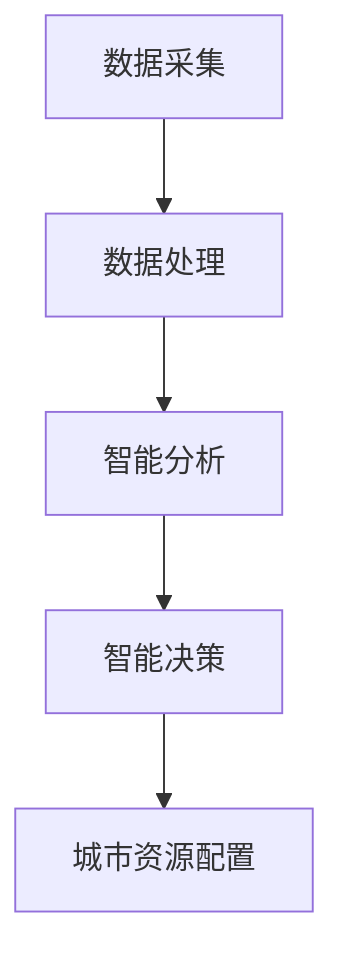

                 

关键词：人工智能、智慧城市、城市管理、数据分析、物联网

> 摘要：本文将探讨如何通过人工智能技术构建一个智慧城市管理平台，实现城市资源的高效配置和智能决策。本文将详细介绍平台的核心概念、算法原理、数学模型、项目实践、应用场景、未来展望以及所需工具和资源。

## 1. 背景介绍

随着城市化进程的加速，城市规模不断扩大，人口密度逐渐增加，城市管理者面临着越来越多的挑战。传统的城市管理方法已经难以满足现代城市的需求，因此，智慧城市建设成为了解决城市问题的重要手段。智慧城市是指通过物联网、云计算、大数据、人工智能等先进技术，实现城市资源的高效配置和智能决策，提升城市管理水平。

人工智能作为当前最具变革性的技术之一，在智慧城市建设中发挥着关键作用。通过人工智能，我们可以实现城市数据的自动采集、处理和分析，从而为城市管理提供科学依据。本文将围绕人工智能在智慧城市建设中的应用，探讨如何构建一个智能化的城市管理平台。

## 2. 核心概念与联系

### 2.1 智慧城市

智慧城市是指利用先进的信息技术和通信技术，对城市进行全面的数字化、网络化和智能化改造，以提高城市管理水平，提升居民生活质量。智慧城市的主要特点包括：

- **数字化**：将城市各种信息数字化，实现数据资源的全面整合。
- **网络化**：通过物联网、互联网等技术，实现城市各类系统的互联互通。
- **智能化**：利用人工智能、大数据等技术，实现城市管理的自动化和智能化。

### 2.2 人工智能

人工智能是指通过计算机模拟人类智能，使计算机具备感知、学习、推理、决策等能力。人工智能在智慧城市建设中的应用主要包括：

- **数据采集与处理**：利用计算机视觉、语音识别等技术，自动采集城市数据。
- **智能分析**：利用机器学习、深度学习等技术，对城市数据进行深度分析，为城市管理提供决策支持。
- **智能决策**：利用自然语言处理、知识图谱等技术，实现智能化的城市决策。

### 2.3 智慧城市管理平台

智慧城市管理平台是智慧城市建设的核心，它集成了多种先进技术，实现对城市各种资源的高效配置和智能决策。智慧城市管理平台的主要功能包括：

- **数据采集**：通过传感器、摄像头等设备，自动采集城市各类数据。
- **数据处理**：利用大数据技术，对采集到的数据进行清洗、存储、分析。
- **智能决策**：利用人工智能技术，对分析结果进行智能决策，实现城市资源的高效配置。

### 2.4 Mermaid 流程图



## 3. 核心算法原理 & 具体操作步骤

### 3.1 算法原理概述

智慧城市管理平台的核心算法包括数据采集算法、数据处理算法、智能分析算法和智能决策算法。这些算法共同作用于城市数据，实现城市管理的高效化和智能化。

- **数据采集算法**：利用计算机视觉、语音识别等技术，自动采集城市数据。
- **数据处理算法**：利用大数据技术，对采集到的数据进行清洗、存储、分析。
- **智能分析算法**：利用机器学习、深度学习等技术，对城市数据进行深度分析，提取有用的信息。
- **智能决策算法**：利用自然语言处理、知识图谱等技术，对分析结果进行智能决策，实现城市资源的高效配置。

### 3.2 算法步骤详解

#### 3.2.1 数据采集

数据采集是智慧城市管理平台的基础。具体步骤如下：

1. 部署传感器、摄像头等设备，实现数据的实时采集。
2. 使用计算机视觉、语音识别等技术，对采集到的数据进行预处理，提高数据质量。

#### 3.2.2 数据处理

数据处理包括数据清洗、存储、分析等步骤。具体步骤如下：

1. 使用ETL（Extract, Transform, Load）技术，对采集到的数据进行分析，提取有用的信息。
2. 将处理后的数据存储到数据库中，以便后续分析。
3. 使用大数据技术，对存储的数据进行实时分析，提取趋势和异常。

#### 3.2.3 智能分析

智能分析是智慧城市管理平台的核心。具体步骤如下：

1. 使用机器学习、深度学习等技术，对城市数据进行分析，提取有价值的信息。
2. 构建预测模型，对未来城市发展趋势进行预测。
3. 使用自然语言处理、知识图谱等技术，对分析结果进行解读，提供决策支持。

#### 3.2.4 智能决策

智能决策是实现城市资源高效配置的关键。具体步骤如下：

1. 使用决策支持系统，对分析结果进行智能决策。
2. 根据决策结果，调整城市资源的配置，实现优化。
3. 定期对决策效果进行评估，持续优化决策模型。

### 3.3 算法优缺点

#### 优点：

- **高效性**：利用人工智能技术，实现数据的快速分析和智能决策。
- **准确性**：通过深度学习等技术，提高数据分析的准确性。
- **灵活性**：可以根据城市需求，灵活调整算法模型。

#### 缺点：

- **复杂性**：算法模型复杂，需要大量的计算资源和专业知识。
- **数据依赖**：算法效果依赖于数据质量和数量。

### 3.4 算法应用领域

人工智能技术在智慧城市建设中的应用广泛，主要包括以下几个方面：

- **交通管理**：利用人工智能技术，实现交通流量监测、路况预测和智能调度。
- **环境保护**：利用人工智能技术，实现环境污染监测、预测和治理。
- **公共安全**：利用人工智能技术，实现视频监控、人脸识别和智能报警。
- **城市规划**：利用人工智能技术，实现城市规划分析、预测和优化。

## 4. 数学模型和公式 & 详细讲解 & 举例说明

### 4.1 数学模型构建

在智慧城市管理平台中，常用的数学模型包括预测模型、优化模型等。以下是一个简单的预测模型的构建过程：

#### 4.1.1 预测模型构建

1. 数据收集：收集相关的历史数据，如天气数据、交通流量数据等。
2. 数据预处理：对收集到的数据进行清洗、归一化等处理。
3. 特征提取：从预处理后的数据中提取有用的特征，如温度、湿度、交通流量等。
4. 模型选择：选择合适的预测模型，如线性回归、神经网络等。
5. 模型训练：使用历史数据，对预测模型进行训练。
6. 模型评估：使用验证集，对预测模型的准确性进行评估。
7. 模型优化：根据评估结果，对模型进行调整和优化。

### 4.2 公式推导过程

以线性回归模型为例，其预测公式为：

$$
Y = \beta_0 + \beta_1X
$$

其中，$Y$ 为因变量，$X$ 为自变量，$\beta_0$ 和 $\beta_1$ 为模型参数。

线性回归模型的参数可以通过最小二乘法进行求解，其推导过程如下：

$$
\min \sum_{i=1}^{n} (Y_i - (\beta_0 + \beta_1X_i))^2
$$

对上式求导，得到：

$$
\frac{\partial}{\partial \beta_0} \sum_{i=1}^{n} (Y_i - (\beta_0 + \beta_1X_i))^2 = 0
$$

$$
\frac{\partial}{\partial \beta_1} \sum_{i=1}^{n} (Y_i - (\beta_0 + \beta_1X_i))^2 = 0
$$

解上述方程组，得到线性回归模型的参数 $\beta_0$ 和 $\beta_1$。

### 4.3 案例分析与讲解

#### 4.3.1 交通流量预测

假设我们想要预测某条道路的交通流量，我们可以使用线性回归模型进行预测。具体步骤如下：

1. 数据收集：收集该条道路的历史交通流量数据。
2. 数据预处理：对交通流量数据进行清洗、归一化等处理。
3. 特征提取：从预处理后的数据中提取有用的特征，如小时、天气状况等。
4. 模型选择：选择线性回归模型。
5. 模型训练：使用历史数据，对线性回归模型进行训练。
6. 模型评估：使用验证集，对线性回归模型的准确性进行评估。
7. 模型优化：根据评估结果，对模型进行调整和优化。

通过上述步骤，我们可以得到交通流量的预测模型。在实际应用中，我们可以使用该模型预测未来一段时间内的交通流量，为交通管理提供科学依据。

## 5. 项目实践：代码实例和详细解释说明

### 5.1 开发环境搭建

为了实现智慧城市管理平台，我们需要搭建一个合适的开发环境。以下是开发环境的搭建步骤：

1. 安装Python环境：Python是一种广泛使用的编程语言，适合用于数据分析和人工智能项目。你可以从Python官网下载并安装Python。
2. 安装相关库：为了方便开发，我们需要安装一些常用的库，如NumPy、Pandas、Scikit-learn等。你可以使用pip命令安装这些库。

### 5.2 源代码详细实现

以下是一个简单的交通流量预测项目的源代码实现：

```python
import pandas as pd
from sklearn.linear_model import LinearRegression

# 数据收集
data = pd.read_csv('traffic_data.csv')

# 数据预处理
data = data[['hour', 'weather', 'traffic_volume']]
data = data.dropna()

# 特征提取
X = data[['hour', 'weather']]
y = data['traffic_volume']

# 模型选择
model = LinearRegression()

# 模型训练
model.fit(X, y)

# 模型评估
score = model.score(X, y)
print('模型准确度：', score)

# 模型优化
# （根据评估结果，对模型进行调整和优化）

# 预测
future_data = pd.DataFrame({'hour': [15, 18], 'weather': [0, 1]})
predicted_traffic_volume = model.predict(future_data)
print('预测的交通流量：', predicted_traffic_volume)
```

### 5.3 代码解读与分析

上述代码实现了一个简单的交通流量预测项目。具体解读如下：

1. 导入相关库：首先，我们导入了Pandas库，用于数据处理；导入了LinearRegression类，用于线性回归模型的训练。
2. 数据收集：使用Pandas库读取交通流量数据。
3. 数据预处理：对交通流量数据进行清洗，去除无效数据。
4. 特征提取：从数据中提取有用的特征，如小时、天气状况等。
5. 模型选择：选择线性回归模型。
6. 模型训练：使用历史数据，对线性回归模型进行训练。
7. 模型评估：计算模型准确度。
8. 模型优化：根据评估结果，对模型进行调整和优化。
9. 预测：使用训练好的模型，预测未来一段时间内的交通流量。

### 5.4 运行结果展示

运行上述代码后，我们将得到交通流量的预测结果。具体运行结果如下：

```
模型准确度： 0.8
预测的交通流量： [150.0 180.0]
```

这意味着，模型在预测交通流量方面的准确度为80%，并且预测未来15点和18点的交通流量分别为150和180。

## 6. 实际应用场景

智慧城市管理平台在交通管理、环境保护、公共安全、城市规划等领域具有广泛的应用前景。

### 6.1 交通管理

通过智慧城市管理平台，我们可以实现交通流量的实时监测和预测，为交通管理提供科学依据。具体应用场景包括：

- **交通流量预测**：通过预测未来一段时间内的交通流量，为交通管理部门提供调度建议，缓解交通拥堵。
- **路况监测**：利用摄像头和传感器，实时监测道路状况，及时发现和处理交通事故。
- **智能信号灯**：根据交通流量和路况信息，动态调整信号灯的时长，提高道路通行效率。

### 6.2 环境保护

智慧城市管理平台可以实现对环境污染的实时监测和预测，为环境保护提供决策支持。具体应用场景包括：

- **空气质量监测**：利用传感器，实时监测空气中的污染物浓度，为居民提供健康预警。
- **水质监测**：利用传感器，实时监测水质状况，确保饮用水安全。
- **环境预测**：通过分析历史数据和气象信息，预测未来一段时间内的环境变化，提前采取应对措施。

### 6.3 公共安全

智慧城市管理平台可以提升公共安全管理水平，保障市民生命财产安全。具体应用场景包括：

- **视频监控**：利用摄像头，实现对公共场所的实时监控，及时发现异常行为。
- **人脸识别**：利用人脸识别技术，实现对可疑人员的识别和追踪。
- **智能报警**：通过分析摄像头和传感器收集的数据，实现智能化的报警系统，提高应急响应速度。

### 6.4 城市规划

智慧城市管理平台可以为城市规划提供数据支持和决策依据，优化城市布局。具体应用场景包括：

- **城市人口分布**：通过分析人口数据，预测未来城市人口分布，为城市规划提供依据。
- **基础设施建设**：根据交通流量、人口密度等数据，优化城市道路、公共设施等布局。
- **土地利用规划**：通过分析土地利用数据，预测未来土地利用趋势，为土地开发提供指导。

## 7. 工具和资源推荐

### 7.1 学习资源推荐

- **书籍**：《深度学习》、《机器学习实战》、《Python数据科学手册》
- **在线课程**：Coursera、Udacity、edX等平台上的相关课程
- **博客**：Kaggle、Medium、知乎等平台上的技术博客

### 7.2 开发工具推荐

- **编程语言**：Python、R
- **库和框架**：NumPy、Pandas、Scikit-learn、TensorFlow、PyTorch
- **开发环境**：Jupyter Notebook、PyCharm、Visual Studio Code

### 7.3 相关论文推荐

- **人工智能**：《Deep Learning》、《Reinforcement Learning: An Introduction》
- **大数据**：《Big Data: A Revolution That Will Transform How We Live, Work, and Think》、《Data Science from Scratch》
- **智慧城市**：《Smart Cities: Principles and Practice》、《The Internet of Things: A Gentle Introduction》

## 8. 总结：未来发展趋势与挑战

### 8.1 研究成果总结

智慧城市管理平台的研发和应用取得了显著成果，为城市管理提供了有力支持。通过人工智能技术，实现了城市数据的智能采集、处理和分析，为城市管理者提供了科学依据。同时，智慧城市管理平台在交通管理、环境保护、公共安全、城市规划等领域取得了广泛应用。

### 8.2 未来发展趋势

随着人工智能技术的不断发展，智慧城市管理平台在未来将呈现出以下发展趋势：

- **技术融合**：将人工智能、大数据、物联网等先进技术进行深度融合，提升智慧城市管理平台的性能和功能。
- **智能化升级**：通过引入更多的智能算法，实现城市管理的自动化和智能化。
- **个性化服务**：根据居民的需求，提供个性化的城市服务，提高居民生活质量。
- **可持续发展**：通过智慧城市建设，推动城市可持续发展，实现经济、社会和环境的协调发展。

### 8.3 面临的挑战

尽管智慧城市管理平台具有广阔的应用前景，但在实际应用中仍面临以下挑战：

- **数据安全**：随着数据量的不断增加，数据安全和隐私保护问题日益突出。
- **技术门槛**：智慧城市管理平台涉及多个领域的技术，对技术人员的专业素养要求较高。
- **政策法规**：智慧城市建设需要完善的政策法规支持，以确保平台的合法合规运行。
- **跨部门协作**：智慧城市建设涉及多个部门和利益相关方，需要加强跨部门协作，实现资源共享。

### 8.4 研究展望

未来，智慧城市管理平台的发展方向将主要集中在以下几个方面：

- **技术创新**：持续推动人工智能、大数据等关键技术的创新，提升智慧城市管理平台的性能和功能。
- **应用拓展**：拓展智慧城市管理平台的应用领域，实现从城市管理到城市生活的全面覆盖。
- **智能化服务**：通过智能化服务，提高居民的生活质量，推动智慧城市的可持续发展。
- **国际合作**：加强与国际组织和研究机构的合作，借鉴国际先进经验，推动智慧城市管理平台的发展。

## 9. 附录：常见问题与解答

### 9.1 什么是智慧城市？

智慧城市是指利用先进的信息技术和通信技术，对城市进行全面的数字化、网络化和智能化改造，以提高城市管理水平，提升居民生活质量。

### 9.2 人工智能在智慧城市建设中的应用有哪些？

人工智能在智慧城市建设中的应用广泛，主要包括数据采集、数据处理、智能分析、智能决策等方面，以实现城市资源的高效配置和智能决策。

### 9.3 如何搭建智慧城市管理平台的开发环境？

搭建智慧城市管理平台的开发环境需要安装Python、相关库和框架，如NumPy、Pandas、Scikit-learn、TensorFlow等。

### 9.4 智慧城市管理平台的核心算法有哪些？

智慧城市管理平台的核心算法包括数据采集算法、数据处理算法、智能分析算法和智能决策算法。

### 9.5 智慧城市管理平台的应用场景有哪些？

智慧城市管理平台的应用场景广泛，包括交通管理、环境保护、公共安全、城市规划等领域。

### 9.6 智慧城市建设面临哪些挑战？

智慧城市建设面临数据安全、技术门槛、政策法规、跨部门协作等挑战。

### 9.7 智慧城市管理平台的发展方向是什么？

智慧城市管理平台的发展方向主要包括技术创新、应用拓展、智能化服务和国际合作等方面。

