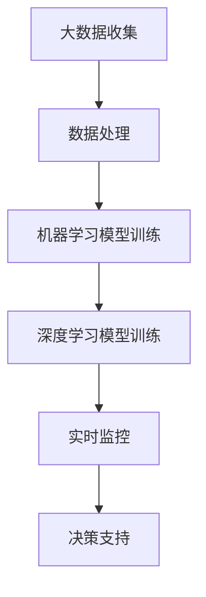

                 

关键词：智能城市，人工智能，城市规划，城市管理，数据分析，实时监控，交通流量优化，能源管理，可持续发展

摘要：随着人工智能技术的飞速发展，城市规划和管理的智能化成为当今社会发展的趋势。本文探讨了AI在智能城市规划与管理中的应用，分析了核心算法原理、数学模型和项目实践，并展望了未来的发展趋势与挑战。

## 1. 背景介绍

### 智能城市

智能城市是指利用信息技术、物联网、人工智能等先进技术，实现城市资源的高效配置、管理和运营，提高城市居民的生活质量和工作效率。智能城市的建设涵盖了交通、能源、环保、公共安全等多个方面。

### 人工智能在智能城市规划与管理中的角色

人工智能在智能城市规划与管理中发挥着关键作用。通过大数据分析和机器学习算法，AI可以预测城市发展趋势，优化资源配置，提升城市管理水平。例如，智能交通系统通过实时监控和数据分析，可以优化交通流量，减少拥堵；智能能源管理系统可以实时调整能源供应，提高能源利用效率。

## 2. 核心概念与联系

### 核心概念

- **大数据分析**：通过收集、存储、处理和分析海量数据，发现数据中的规律和趋势。
- **机器学习**：利用数据训练模型，使模型能够自动学习和预测。
- **深度学习**：一种特殊的机器学习算法，模仿人脑神经网络的结构和功能，解决复杂问题。
- **实时监控**：实时收集和处理城市运行数据，为城市管理提供实时信息。

### 架构图

## 3. 核心算法原理 & 具体操作步骤

### 3.1 算法原理概述

智能城市规划与管理主要依赖于以下几种核心算法：

- **聚类算法**：用于发现数据中的相似性，用于人口分布分析、交通流量预测等。
- **决策树算法**：用于决策支持，如城市公共服务优化。
- **神经网络算法**：用于构建深度学习模型，如交通流量预测、能源管理。

### 3.2 算法步骤详解

1. **数据收集与预处理**：收集城市运行数据，包括交通流量、能源消耗、环境质量等，进行数据清洗和格式转换。
2. **特征工程**：提取数据中的关键特征，如时间、地点、交通流量等。
3. **模型训练**：利用机器学习算法，训练预测模型。
4. **模型评估与优化**：评估模型性能，进行参数调整和优化。
5. **实时监控与决策支持**：将训练好的模型应用于实时数据，提供决策支持。

### 3.3 算法优缺点

- **优点**：提高城市管理水平，降低运营成本，提升居民生活质量。
- **缺点**：对数据质量和算法性能有较高要求，初期投入较大。

### 3.4 算法应用领域

- **交通管理**：优化交通流量，减少拥堵。
- **能源管理**：实时调整能源供应，提高能源利用效率。
- **环境监测**：实时监测环境质量，提高城市环保水平。
- **公共安全**：智能监控，提高城市安全水平。

## 4. 数学模型和公式 & 详细讲解 & 举例说明

### 4.1 数学模型构建

- **交通流量预测模型**：使用时间序列分析构建模型，如ARIMA模型。
- **能源管理模型**：使用优化算法，如线性规划，构建能源供应和需求平衡模型。

### 4.2 公式推导过程

- **交通流量预测模型**：$$Q(t) = \alpha + \beta T(t) + \epsilon(t)$$，其中$Q(t)$为$t$时刻的交通流量，$T(t)$为$t$时刻的时间特征，$\alpha$和$\beta$为参数，$\epsilon(t)$为误差项。

### 4.3 案例分析与讲解

- **案例**：使用聚类算法对城市人口分布进行分析。
- **过程**：收集城市人口数据，使用K-means算法进行聚类，分析人口分布特征。

## 5. 项目实践：代码实例和详细解释说明

### 5.1 开发环境搭建

- **Python**：用于数据处理和算法实现。
- **TensorFlow**：用于深度学习模型的训练和预测。

### 5.2 源代码详细实现

- **数据收集与预处理**：使用Python的pandas库进行数据处理。
- **模型训练与预测**：使用TensorFlow的Keras API进行深度学习模型训练。

### 5.3 代码解读与分析

- **数据预处理**：进行数据清洗、归一化和特征提取。
- **模型训练**：使用时间序列数据进行模型训练。
- **模型评估**：使用验证集评估模型性能。

### 5.4 运行结果展示

- **交通流量预测结果**：展示预测的交通流量与实际交通流量的对比。

## 6. 实际应用场景

- **智能交通管理**：通过AI算法优化交通信号灯，减少交通拥堵。
- **智能能源管理**：通过AI算法实时调整能源供应，提高能源利用效率。
- **智能环境监测**：通过AI算法实时监测环境质量，及时采取环保措施。

### 6.4 未来应用展望

- **智慧城市建设**：随着AI技术的发展，智慧城市将更加智能、高效、绿色。
- **跨领域应用**：AI技术将在更多领域得到应用，如医疗、教育等。

## 7. 工具和资源推荐

### 7.1 学习资源推荐

- **书籍**：《深度学习》、《Python机器学习》
- **在线课程**：Coursera、edX等平台上的AI课程

### 7.2 开发工具推荐

- **Python**：用于数据处理和算法实现。
- **TensorFlow**：用于深度学习模型的训练和预测。

### 7.3 相关论文推荐

- **《AI in Urban Planning and Management》**
- **《Deep Learning for Traffic Flow Prediction》**

## 8. 总结：未来发展趋势与挑战

### 8.1 研究成果总结

- AI技术在智能城市规划与管理中取得了显著成果，提高了城市管理水平。
- 未来研究方向包括算法优化、跨领域应用等。

### 8.2 未来发展趋势

- 智慧城市建设将更加普及，AI技术在城市管理中的应用将更加深入。
- 跨领域应用将更加广泛，如医疗、教育等。

### 8.3 面临的挑战

- 数据质量和算法性能仍是关键挑战。
- 如何实现AI技术在城市管理中的可持续发展。

### 8.4 研究展望

- 进一步优化算法，提高预测准确率。
- 探索AI技术在更多领域的应用，实现跨领域协同发展。

## 9. 附录：常见问题与解答

### 9.1 问题1：AI技术在智能城市规划与管理中如何实现可持续发展？

解答：通过优化算法、提高数据质量和加强跨领域合作，实现AI技术在智能城市规划与管理中的可持续发展。

### 9.2 问题2：如何处理大量城市运行数据？

解答：使用大数据处理技术，如Hadoop和Spark，进行数据收集、存储和处理。

----------------------------------------------------------------
作者：禅与计算机程序设计艺术 / Zen and the Art of Computer Programming

