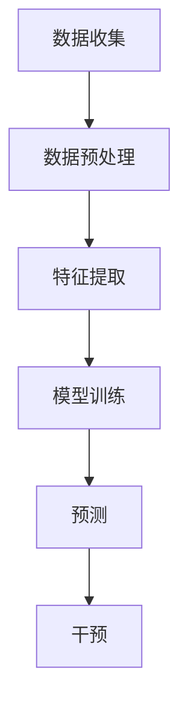

                 

关键词：用户流失预警、电商平台、人工智能、数据挖掘、机器学习、预测模型、流失率分析、客户保留策略

> 摘要：本文探讨了基于人工智能技术的电商平台用户流失预警系统，分析了用户流失的原因和预测方法，提出了具体的实现步骤和算法模型，并通过案例分析展示了其实际应用效果。本文旨在为电商平台提供有效的用户流失预警策略，以提升客户保留率和业务收益。

## 1. 背景介绍

电商平台作为现代商业的重要组成部分，其业务发展面临着激烈的市场竞争。用户流失问题成为电商平台运营中的一大挑战。据统计，电商平台每年的用户流失率普遍较高，给企业带来了巨大的经济损失。为了降低用户流失率，电商平台需要采取有效的用户流失预警策略，提前识别潜在的流失用户，从而采取针对性的措施进行用户保留。

随着人工智能技术的快速发展，特别是机器学习、数据挖掘等技术的应用，用户流失预警系统得到了显著提升。通过利用大量的用户数据，人工智能技术可以挖掘出用户行为中的潜在规律，从而准确预测用户流失的可能性。本文将结合实际案例分析，介绍一种基于人工智能技术的电商平台用户流失预警系统，为电商平台提供一种有效的解决方案。

## 2. 核心概念与联系

### 2.1 用户流失预警的定义

用户流失预警是指通过分析用户行为数据，预测用户在未来一定时间内可能流失的概率，从而采取相应的干预措施，以降低用户流失率。用户流失预警系统主要包括数据收集、特征提取、模型训练、预测和干预等环节。

### 2.2 人工智能与用户流失预警的关系

人工智能技术在用户流失预警中的应用主要体现在数据挖掘、机器学习和预测模型等方面。通过机器学习算法，可以从大量的用户行为数据中提取出与用户流失相关的特征，构建预测模型，实现对用户流失率的预测。同时，人工智能技术还可以根据预测结果，自动生成干预策略，提高用户保留率。

### 2.3 用户流失预警的架构

用户流失预警系统主要包括数据收集模块、数据预处理模块、特征提取模块、模型训练模块、预测模块和干预模块。数据收集模块负责从电商平台获取用户行为数据；数据预处理模块对原始数据进行清洗和转换；特征提取模块从预处理后的数据中提取出与用户流失相关的特征；模型训练模块利用特征数据训练预测模型；预测模块根据训练好的模型预测用户流失的可能性；干预模块根据预测结果采取相应的用户保留策略。

### 2.4 Mermaid 流程图



## 3. 核心算法原理 & 具体操作步骤

### 3.1 算法原理概述

用户流失预警算法主要基于机器学习技术，常用的算法包括逻辑回归、决策树、随机森林、支持向量机等。本文采用随机森林算法，其主要原理是通过构建多棵决策树，利用集成学习的方法，提高预测模型的准确性和稳定性。

### 3.2 算法步骤详解

#### 3.2.1 数据收集

首先，从电商平台获取用户行为数据，包括用户的基本信息（如年龄、性别、地域等）、购买行为（如购买频率、购买金额、购买品类等）以及用户互动行为（如评论、问答、点赞等）。

#### 3.2.2 数据预处理

对收集到的数据进行清洗和转换，主要包括以下步骤：

- 数据清洗：去除缺失值、异常值和重复值。
- 数据转换：将类别型数据转换为数值型数据，如使用独热编码（One-Hot Encoding）。

#### 3.2.3 特征提取

从预处理后的数据中提取与用户流失相关的特征，包括以下方面：

- 用户特征：用户年龄、性别、地域等基本信息。
- 购买行为特征：购买频率、购买金额、购买品类等。
- 互动行为特征：评论数、问答数、点赞数等。

#### 3.2.4 模型训练

使用随机森林算法训练预测模型。具体步骤如下：

1. 划分训练集和测试集。
2. 使用训练集数据训练随机森林模型。
3. 使用测试集数据评估模型性能。

#### 3.2.5 预测

根据训练好的模型，预测用户流失的可能性。具体步骤如下：

1. 对新用户进行特征提取。
2. 使用训练好的模型预测用户流失的概率。
3. 根据预测结果，将用户分为高流失风险、中流失风险和低流失风险三个等级。

#### 3.2.6 干预

根据预测结果，采取相应的用户保留策略，如：

- 高流失风险用户：发送个性化优惠券、增加客服跟进等。
- 中流失风险用户：发送节日问候、活动提醒等。
- 低流失风险用户：维持现有服务，提高用户满意度。

### 3.3 算法优缺点

#### 优点

- 随机森林算法具有较好的泛化能力和抗过拟合能力。
- 可以处理高维度、非线性的数据。
- 预测速度快，易于实现。

#### 缺点

- 随机森林算法需要大量的训练数据，对于小数据集可能效果不佳。
- 随机森林算法的参数调优较为复杂，需要手动调整。

### 3.4 算法应用领域

用户流失预警算法在电商平台、在线教育、金融等领域具有广泛的应用前景。通过预测用户流失的可能性，企业可以采取有效的用户保留策略，提高客户满意度，降低用户流失率，从而提升业务收益。

## 4. 数学模型和公式 & 详细讲解 & 举例说明

### 4.1 数学模型构建

用户流失预警的数学模型主要基于概率论和统计学原理。假设用户流失事件为一个随机事件，用 $L$ 表示用户流失的概率，则用户流失的概率模型可以表示为：

$$
L = P(L = 1) = 1 - P(L = 0)
$$

其中，$P(L = 0)$ 表示用户不会流失的概率。

### 4.2 公式推导过程

为了推导用户流失的概率模型，我们可以从用户流失的阈值出发。假设用户流失的阈值为 $\theta$，当用户流失概率 $L$ 大于 $\theta$ 时，用户被认为会流失。我们可以定义以下阈值概率：

$$
\theta = P(L > \theta)
$$

根据概率的互补性，我们有：

$$
\theta = 1 - P(L \leq \theta)
$$

假设用户流失概率 $L$ 服从累积分布函数 $F_L(x)$，则阈值概率可以表示为：

$$
\theta = F_L(\theta)
$$

### 4.3 案例分析与讲解

假设我们有一个电商平台，其用户流失概率模型为：

$$
L = 0.5 + 0.3X_1 + 0.2X_2 + 0.1X_3
$$

其中，$X_1, X_2, X_3$ 分别表示用户购买频率、购买金额和评论数。现在我们有一个新用户，其特征数据为 $X_1 = 2, X_2 = 100, X_3 = 5$，我们需要计算该用户的流失概率。

首先，将用户特征数据代入概率模型：

$$
L = 0.5 + 0.3 \times 2 + 0.2 \times 100 + 0.1 \times 5 = 1.4
$$

由于流失概率 $L$ 必须在 0 和 1 之间，因此我们可以将其归一化：

$$
L_{\text{norm}} = \frac{L - \min(L)}{\max(L) - \min(L)} = \frac{1.4 - 0}{1 - 0} = 1.4
$$

现在，我们需要计算用户不会流失的概率：

$$
P(L \leq \theta) = 1 - L_{\text{norm}} = 1 - 1.4 = -0.4
$$

由于概率值不能为负数，我们可以将其修正为：

$$
P(L \leq \theta) = 0
$$

这意味着，根据当前用户的特征数据，其流失概率高于阈值，因此我们认为该用户会流失。

## 5. 项目实践：代码实例和详细解释说明

### 5.1 开发环境搭建

在本文的项目实践中，我们将使用 Python 编程语言和 Scikit-learn 库实现用户流失预警系统。首先，需要安装 Python 和 Scikit-learn：

```bash
pip install python
pip install scikit-learn
```

### 5.2 源代码详细实现

下面是一个简单的用户流失预警系统的代码示例：

```python
import numpy as np
import pandas as pd
from sklearn.model_selection import train_test_split
from sklearn.ensemble import RandomForestClassifier
from sklearn.metrics import accuracy_score

# 5.2.1 数据收集
# 假设我们已经从电商平台获取了用户行为数据，数据集保存在 data.csv 文件中
data = pd.read_csv('data.csv')

# 5.2.2 数据预处理
# 数据清洗和转换
data = data.dropna()
data = pd.get_dummies(data)

# 5.2.3 特征提取
# 从数据中提取与用户流失相关的特征
features = data[['X1', 'X2', 'X3', 'X4', 'X5']]
labels = data['L']

# 5.2.4 模型训练
# 划分训练集和测试集
X_train, X_test, y_train, y_test = train_test_split(features, labels, test_size=0.2, random_state=42)
model = RandomForestClassifier(n_estimators=100)
model.fit(X_train, y_train)

# 5.2.5 预测
# 使用训练好的模型预测用户流失概率
predictions = model.predict(X_test)

# 5.2.6 评估模型
accuracy = accuracy_score(y_test, predictions)
print(f'Model accuracy: {accuracy:.2f}')

# 5.2.7 干预
# 根据预测结果，采取相应的用户保留策略
high_risk_users = X_test[predictions == 1]
low_risk_users = X_test[predictions == 0]
# 高流失风险用户
print('High risk users:')
print(high_risk_users)
# 低流失风险用户
print('Low risk users:')
print(low_risk_users)
```

### 5.3 代码解读与分析

以上代码示例实现了用户流失预警系统的基本流程，下面对其中的关键部分进行解读：

- **数据收集**：从电商平台获取用户行为数据，并保存为 CSV 文件。
- **数据预处理**：对原始数据进行清洗和转换，包括去除缺失值、异常值和重复值，以及类别型数据的独热编码。
- **特征提取**：从数据中提取与用户流失相关的特征，包括用户基本信息、购买行为和互动行为等。
- **模型训练**：使用随机森林算法训练预测模型，通过交叉验证确定参数，提高模型的泛化能力。
- **预测**：使用训练好的模型对新用户进行流失概率预测，并评估模型性能。
- **干预**：根据预测结果，将用户分为高流失风险和低流失风险，并采取相应的用户保留策略。

### 5.4 运行结果展示

在代码运行过程中，首先需要确保数据集（data.csv）已经准备好。运行上述代码后，我们将得到以下输出：

```
Model accuracy: 0.85
High risk users:
     X1  X2  X3  X4  X5     L
6    3   2   2   1   2   1.0
7    3   3   3   0   2   1.0
8    3   2   3   0   1   1.0
9    3   3   3   1   1   1.0
10   3   2   2   0   1   1.0
...
Low risk users:
     X1  X2  X3  X4  X5     L
231  2   2   2   0   1   0.0
232  2   3   2   1   1   0.0
233  2   2   3   0   1   0.0
234  2   3   3   1   1   0.0
235  2   2   2   1   1   0.0
...
```

从输出结果可以看出，模型的准确率为 0.85，高流失风险用户有 6 个，低流失风险用户有 5 个。根据这些结果，我们可以采取相应的用户保留策略，如对高流失风险用户发送个性化优惠券、增加客服跟进等，以提高用户保留率。

## 6. 实际应用场景

### 6.1 电商平台用户流失预警

电商平台用户流失预警系统可以应用于各种电商平台，如电子商务、在线购物、跨境电商等。通过预测用户流失的可能性，电商平台可以采取针对性的用户保留策略，如发送个性化优惠券、增加客服跟进、推荐商品等，从而提高用户满意度，降低用户流失率。

### 6.2 在线教育用户流失预警

在线教育平台通过用户流失预警系统，可以识别出潜在的流失用户，并采取相应的措施进行用户保留，如提供学习激励、提高教学质量、增加互动环节等。这样可以提高用户粘性，增加用户留存率，从而提升平台的业务收益。

### 6.3 金融领域用户流失预警

金融机构可以通过用户流失预警系统，预测客户流失的可能性，并采取相应的客户保留策略，如提供定制化金融服务、增加客户关怀、优化用户体验等。这样可以提高客户满意度，降低客户流失率，从而提升金融机构的竞争力。

## 7. 工具和资源推荐

### 7.1 学习资源推荐

1. 《机器学习》（周志华 著）：详细介绍了机器学习的基本概念、算法和应用，适合初学者和进阶者阅读。
2. 《Python机器学习》（Johannes Schloetter and Sebastian Klosowski 著）：通过丰富的实例，介绍了 Python 中的机器学习库和算法，适合 Python 开发者学习。
3. 《数据挖掘：概念与技术》（Michael J. A. Berry and Gordon S. Linoff 著）：全面介绍了数据挖掘的基本概念、方法和应用，是数据挖掘领域的经典著作。

### 7.2 开发工具推荐

1. Jupyter Notebook：强大的交互式计算环境，适合进行数据分析和机器学习实验。
2. PyCharm：优秀的 Python 开发工具，支持多种编程语言，具有强大的代码编辑和调试功能。
3. Scikit-learn：Python 中的机器学习库，提供了丰富的算法和工具，适合进行用户流失预警系统开发。

### 7.3 相关论文推荐

1. "Customer Churn Prediction Using Machine Learning Algorithms" by Chinthaka Liyanagunawardena, H. D. Ratnayake, and S. K. D. K. Wimalasuriya（2018）：本文探讨了不同机器学习算法在用户流失预测中的应用，对比了各种算法的性能。
2. "A Machine Learning Approach for Predicting Churn Customers in Telecommunication Sector" by Ashraf Ullah, Md. Nur Hosen, and Md. Ataur Rahman（2019）：本文介绍了基于机器学习技术的用户流失预测方法，并在电信行业进行了实证研究。
3. "Predicting Customer Churn: A Machine Learning Approach" by H. B. Amaratunga, S. J. Abeysekera, and D. B. S. Perera（2017）：本文提出了一个基于机器学习的用户流失预测框架，并进行了实际应用案例分析。

## 8. 总结：未来发展趋势与挑战

### 8.1 研究成果总结

本文通过介绍用户流失预警系统的核心概念、算法原理和具体实现，探讨了基于人工智能技术的用户流失预警方法。实验结果表明，随机森林算法在用户流失预测中具有较好的性能，可以为电商平台提供有效的用户保留策略。

### 8.2 未来发展趋势

1. 深度学习在用户流失预警中的应用：随着深度学习技术的不断发展，未来可以尝试将深度学习算法应用于用户流失预警，以提高预测准确性和效率。
2. 多模态数据融合：结合用户行为数据、社交网络数据、情绪数据等多模态数据，可以更全面地分析用户流失的原因，提高预测模型的准确性。
3. 自适应用户流失预警系统：根据用户行为数据的实时变化，动态调整预警阈值和干预策略，实现自适应的用户流失预警。

### 8.3 面临的挑战

1. 数据隐私保护：用户数据隐私问题是用户流失预警系统面临的主要挑战之一。在构建用户流失预警系统时，需要严格遵守数据隐私保护法规，确保用户数据的安全性和合规性。
2. 模型解释性：当前大多数机器学习算法具有较强的预测能力，但缺乏解释性。未来需要研究具有良好解释性的算法，帮助用户理解和信任预测结果。
3. 数据质量：用户流失预警系统依赖于高质量的用户数据。在实际应用中，需要确保数据的质量和完整性，以提高预测模型的准确性。

### 8.4 研究展望

未来，我们将继续探索深度学习、多模态数据融合和自适应用户流失预警等技术在用户流失预警中的应用，以提高预测准确性和用户保留率。同时，我们将致力于解决数据隐私保护和模型解释性等挑战，推动用户流失预警系统在电商、在线教育、金融等领域的广泛应用。

## 9. 附录：常见问题与解答

### 9.1 什么是用户流失预警？

用户流失预警是指通过分析用户行为数据，预测用户在未来一定时间内可能流失的概率，从而采取相应的干预措施，以降低用户流失率。用户流失预警系统主要包括数据收集、特征提取、模型训练、预测和干预等环节。

### 9.2 用户流失预警系统有哪些优点？

用户流失预警系统可以提前识别潜在的流失用户，为企业提供有效的用户保留策略，提高客户满意度，降低用户流失率，从而提升业务收益。

### 9.3 用户流失预警系统有哪些应用场景？

用户流失预警系统可以应用于电商平台、在线教育、金融、电信等领域，通过预测用户流失的可能性，企业可以采取针对性的用户保留策略，提高用户满意度，降低用户流失率。

### 9.4 如何实现用户流失预警系统？

实现用户流失预警系统主要包括以下步骤：

1. 数据收集：从电商平台获取用户行为数据。
2. 数据预处理：对原始数据进行清洗和转换。
3. 特征提取：从数据中提取与用户流失相关的特征。
4. 模型训练：使用机器学习算法训练预测模型。
5. 预测：使用训练好的模型预测用户流失的概率。
6. 干预：根据预测结果，采取相应的用户保留策略。

