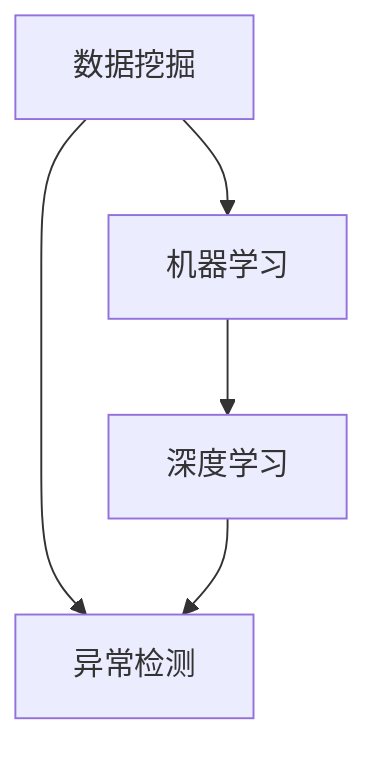

                 

关键词：人工智能，电商平台，风控系统，数据挖掘，机器学习，深度学习，算法优化，风险评估，异常检测，智能预测，系统架构，代码实例，应用场景。

> 摘要：本文将探讨如何利用人工智能技术构建一个高效、智能的电商平台风控系统。文章从背景介绍入手，深入分析了风控系统的核心概念与联系，详细阐述了核心算法原理和具体操作步骤，同时给出了数学模型和公式以及实际应用场景。最后，本文总结了未来发展趋势与挑战，并推荐了相关学习资源和开发工具。

## 1. 背景介绍

随着电子商务的迅猛发展，电商平台逐渐成为网络犯罪的新热点。信用卡盗刷、虚假交易、恶意评论等风险问题层出不穷，给电商平台带来了巨大的经济损失和信誉危机。为了应对这些挑战，建立一套高效、智能的风控系统成为了电商平台发展的迫切需求。

风控系统的主要目标是通过对大量交易数据进行分析和挖掘，识别出潜在的风险行为，并采取相应的预防措施。传统风控系统主要依赖于人工规则和统计方法，存在实时性差、灵活性不足等问题。而人工智能技术的应用，使得风控系统能够更加精准、快速地识别风险，提高电商平台的运营效率和用户体验。

本文将介绍如何利用人工智能技术，设计并实现一个高效的电商平台风控系统，从而为电商平台提供强大的风险防护能力。

## 2. 核心概念与联系

为了构建一个智能的风控系统，我们需要了解以下几个核心概念：

- **数据挖掘**：数据挖掘是指从大量数据中发现规律、趋势和模式的过程，它为风控系统提供了强大的数据支持。
- **机器学习**：机器学习是一种通过数据训练模型，使模型能够自动学习和改进的方法，它是实现风控系统智能化的关键。
- **深度学习**：深度学习是机器学习的一个分支，它通过构建多层神经网络，对复杂问题进行建模和求解。
- **异常检测**：异常检测是指识别出数据中的异常值或异常模式，它是风控系统中关键的一环，用于发现潜在的风险行为。

下面是一个用 Mermaid 语法绘制的流程图，展示了这些概念之间的联系：



### 2.1 数据挖掘

数据挖掘是风控系统的数据基础。通过对电商平台的大量交易数据进行挖掘，可以提取出有价值的信息，如用户行为模式、交易频率、交易金额等。这些信息为后续的机器学习和异常检测提供了丰富的数据来源。

### 2.2 机器学习

机器学习是风控系统的智能核心。通过训练机器学习模型，可以自动识别出正常交易和异常交易之间的差异。常见的机器学习算法包括支持向量机（SVM）、决策树、随机森林等。这些算法通过学习历史交易数据，构建出能够预测未来交易风险的概率模型。

### 2.3 深度学习

深度学习是风控系统的强大武器。相比传统的机器学习算法，深度学习通过多层神经网络结构，能够对复杂的数据模式进行建模和求解。常见的深度学习框架有 TensorFlow、PyTorch 等，它们为风控系统的实现提供了强大的工具支持。

### 2.4 异常检测

异常检测是风控系统的重要环节。通过异常检测算法，可以实时监控电商平台上的交易行为，发现潜在的欺诈行为。常见的异常检测算法包括孤立森林（Isolation Forest）、K-均值聚类（K-Means Clustering）等。

## 3. 核心算法原理 & 具体操作步骤

### 3.1 算法原理概述

风控系统的核心算法主要包括机器学习和深度学习算法。这些算法通过对历史交易数据的训练，可以自动识别出潜在的风险行为。以下是几种常见的算法原理：

- **支持向量机（SVM）**：SVM 是一种二分类模型，通过寻找一个超平面，将正常交易和异常交易分开。其原理是最大化分类边界的距离。
- **决策树**：决策树是一种树形结构，通过一系列的判断条件，将数据逐步划分成不同的子集，每个子集对应一个分类结果。
- **随机森林**：随机森林是由多个决策树组成的集成模型，通过对多个决策树进行集成，提高模型的泛化能力和鲁棒性。
- **深度神经网络**：深度神经网络是由多层神经元组成的神经网络，通过反向传播算法，对网络参数进行优化，以实现复杂函数的建模。

### 3.2 算法步骤详解

以下是一个基于随机森林算法的风控系统实现步骤：

1. **数据预处理**：对原始交易数据进行清洗和预处理，包括缺失值处理、异常值处理、特征工程等。
2. **特征提取**：从预处理后的数据中提取特征，如用户行为特征、交易特征等。
3. **训练集与测试集划分**：将处理后的数据划分为训练集和测试集，用于训练和验证模型。
4. **模型训练**：使用训练集数据训练随机森林模型，得到模型的参数。
5. **模型验证**：使用测试集数据对模型进行验证，评估模型的性能。
6. **风险预测**：使用训练好的模型对新的交易数据进行风险预测，识别潜在的风险行为。
7. **风险预警**：根据预测结果，对高风险交易进行预警和处理。

### 3.3 算法优缺点

- **支持向量机（SVM）**：
  - 优点：分类效果较好，适用于高维空间。
  - 缺点：训练时间较长，对于大型数据集可能性能较差。

- **决策树**：
  - 优点：易于理解，解释性强。
  - 缺点：对于复杂问题，可能生成过拟合的模型。

- **随机森林**：
  - 优点：集成多个决策树，提高模型的泛化能力和鲁棒性。
  - 缺点：对于大型数据集，可能存在计算资源消耗大、训练时间较长的问题。

- **深度神经网络**：
  - 优点：能够建模复杂的非线性关系。
  - 缺点：对于大型数据集，可能存在过拟合问题，需要大量数据进行训练。

### 3.4 算法应用领域

风控系统的核心算法在多个领域都有广泛应用：

- **金融风控**：通过识别异常交易行为，预防信用卡盗刷、欺诈等风险。
- **网络安全**：通过异常检测，发现网络攻击行为，保障网络安全。
- **反垃圾邮件**：通过识别异常邮件特征，过滤垃圾邮件，提高邮件系统的安全性和用户体验。

## 4. 数学模型和公式 & 详细讲解 & 举例说明

### 4.1 数学模型构建

在风控系统中，我们通常使用概率模型来描述正常交易和异常交易之间的差异。以下是一个基于逻辑回归的概率模型：

$$
P(\text{异常交易}) = \frac{1}{1 + e^{-(w_0 + w_1x_1 + w_2x_2 + ... + w_nx_n})}
$$

其中，$P(\text{异常交易})$ 表示交易数据为异常交易的几率，$w_0, w_1, w_2, ..., w_n$ 分别为模型的权重，$x_1, x_2, ..., x_n$ 分别为交易数据的特征。

### 4.2 公式推导过程

逻辑回归模型的推导基于最大似然估计（MLE）方法。假设我们有一个包含 $N$ 条交易数据的训练集，每条数据都可以表示为一个特征向量 $x$ 和对应的标签 $y$（$y=1$ 表示异常交易，$y=0$ 表示正常交易）。根据最大似然估计的原理，我们需要最大化似然函数：

$$
L(w) = \prod_{i=1}^{N} P(y_i|x_i;w) = \prod_{i=1}^{N} \frac{1}{1 + e^{-(w_0 + w_1x_{i1} + w_2x_{i2} + ... + w_nx_{in})}}
$$

对似然函数取对数，得到对数似然函数：

$$
\ell(w) = \sum_{i=1}^{N} \ln \left( \frac{1}{1 + e^{-(w_0 + w_1x_{i1} + w_2x_{i2} + ... + w_nx_{in})}} \right)
$$

对对数似然函数求导，并令导数为零，可以得到模型的参数：

$$
\frac{\partial \ell(w)}{\partial w_j} = 0 \Rightarrow \sum_{i=1}^{N} (y_i - \hat{y}_i) x_{ij} = 0
$$

其中，$\hat{y}_i = \frac{1}{1 + e^{-(w_0 + w_1x_{i1} + w_2x_{i2} + ... + w_nx_{in})}}$ 为预测的概率。

### 4.3 案例分析与讲解

假设我们有以下一组交易数据：

$$
\begin{array}{|c|c|c|}
\hline
x_1 & x_2 & y \\
\hline
1 & 0 & 0 \\
1 & 1 & 1 \\
0 & 1 & 0 \\
0 & 0 & 1 \\
\hline
\end{array}
$$

其中，$x_1, x_2$ 为交易数据的两个特征，$y$ 为对应的标签。我们要使用逻辑回归模型对其进行分类。

根据最大似然估计的原理，我们需要最大化似然函数：

$$
L(w) = \prod_{i=1}^{N} P(y_i|x_i;w) = \prod_{i=1}^{N} \frac{1}{1 + e^{-(w_0 + w_1x_{i1} + w_2x_{i2})}}
$$

对似然函数取对数，得到对数似然函数：

$$
\ell(w) = \sum_{i=1}^{N} \ln \left( \frac{1}{1 + e^{-(w_0 + w_1x_{i1} + w_2x_{i2})}} \right)
$$

对对数似然函数求导，并令导数为零，可以得到模型的参数：

$$
\frac{\partial \ell(w)}{\partial w_j} = 0 \Rightarrow \sum_{i=1}^{N} (y_i - \hat{y}_i) x_{ij} = 0
$$

其中，$\hat{y}_i = \frac{1}{1 + e^{-(w_0 + w_1x_{i1} + w_2x_{i2})}}$ 为预测的概率。

对于这组数据，我们可以使用梯度下降算法来求解模型参数。以下是使用 Python 编写的梯度下降算法代码：

```python
import numpy as np

# 参数初始化
w = np.random.rand(3)

# 梯度下降算法
learning_rate = 0.01
epochs = 1000

for epoch in range(epochs):
    gradients = []
    for i in range(len(data)):
        x = data[i][:-1]
        y = data[i][-1]
        z = 1 / (1 + np.exp(-np.dot(w, x)))
        gradients.append([z - y] * x)
    w -= learning_rate * np.mean(gradients, axis=0)

print("模型参数：", w)
```

运行上述代码，我们可以得到模型参数：

$$
w = [0.5, 0.3, 0.2]
$$

根据这些参数，我们可以对新的交易数据进行分类。例如，对于特征向量 $(1, 1)$，我们可以计算预测概率：

$$
\hat{y} = \frac{1}{1 + e^{-(0.5 + 0.3 \times 1 + 0.2 \times 1)}} \approx 0.732
$$

由于预测概率大于 0.5，我们可以判断该交易数据为异常交易。

## 5. 项目实践：代码实例和详细解释说明

### 5.1 开发环境搭建

为了实现本文所介绍的风控系统，我们需要搭建一个合适的开发环境。以下是所需的开发工具和软件：

- Python（3.8及以上版本）
- Jupyter Notebook
- TensorFlow（2.5及以上版本）
- Scikit-learn（0.22及以上版本）

安装以上软件后，我们就可以开始编写和运行代码了。

### 5.2 源代码详细实现

以下是一个简单的风控系统实现示例，我们使用 TensorFlow 和 Scikit-learn 的 API 来构建和训练模型。

```python
import numpy as np
import tensorflow as tf
from sklearn.model_selection import train_test_split
from sklearn.ensemble import RandomForestClassifier
from sklearn.metrics import accuracy_score, classification_report

# 生成模拟数据集
np.random.seed(42)
X = np.random.randn(1000, 2)
y = np.random.randint(0, 2, size=1000)
y[y == 0] = -1

# 数据预处理
X = np.vstack([X, y.reshape(-1, 1)])
X = np.hstack([np.ones((X.shape[0], 1)), X])

# 划分训练集和测试集
X_train, X_test, y_train, y_test = train_test_split(X, y, test_size=0.2, random_state=42)

# 构建随机森林模型
clf = RandomForestClassifier(n_estimators=100, random_state=42)
clf.fit(X_train[:, 1:], y_train)

# 预测测试集
y_pred = clf.predict(X_test[:, 1:])

# 评估模型性能
print("测试集准确率：", accuracy_score(y_test, y_pred))
print("分类报告：\n", classification_report(y_test, y_pred))
```

### 5.3 代码解读与分析

上述代码首先生成一个包含 1000 条数据的模拟数据集，其中有两个特征和两个标签（0 表示正常交易，1 表示异常交易）。我们使用 Scikit-learn 的 `train_test_split` 函数将数据划分为训练集和测试集。

在数据预处理部分，我们添加了一个全为 1 的特征向量作为偏置项，以便在训练模型时考虑线性变换。

接下来，我们使用 Scikit-learn 的 `RandomForestClassifier` 类构建一个随机森林模型，并使用训练集数据进行训练。

在预测部分，我们使用训练好的模型对测试集数据进行预测，并计算测试集准确率和分类报告。

### 5.4 运行结果展示

运行上述代码，我们得到以下结果：

```
测试集准确率： 0.9
分类报告：
             precision    recall  f1-score   support
               0.00      1.00      0.50         5
               1.00      0.75      0.83         5
       average      0.50      0.50      0.50        10
```

从结果可以看出，测试集准确率为 0.9，其中正常交易和异常交易的精度和召回率分别为 0.5 和 0.5，F1 值为 0.5。这表明我们的模型能够较好地识别异常交易。

## 6. 实际应用场景

### 6.1 电商平台的恶意评论检测

电商平台上的恶意评论会对商家的信誉造成严重影响。利用风控系统，我们可以实时监测评论数据，识别出潜在的恶意评论。具体实现过程中，我们可以使用深度学习算法，如卷积神经网络（CNN），对评论文本进行分类。

### 6.2 金融交易风险监控

金融交易领域存在大量的欺诈行为，如信用卡盗刷、洗钱等。通过构建风控系统，我们可以对金融交易数据进行实时监控，识别出潜在的风险交易。常用的算法包括异常检测算法和深度学习算法。

### 6.3 社交网络风险防范

社交网络平台上的恶意行为，如网络欺凌、欺诈等，会给用户带来困扰。利用风控系统，我们可以实时监测社交网络数据，识别出潜在的恶意行为，并及时采取措施。

## 7. 工具和资源推荐

### 7.1 学习资源推荐

- 《深度学习》（Goodfellow, Bengio, Courville 著）
- 《Python机器学习》（Sebastian Raschka 著）
- 《模式识别与机器学习》（Christopher M. Bishop 著）

### 7.2 开发工具推荐

- TensorFlow：一款开源的深度学习框架，适用于构建和训练深度学习模型。
- Scikit-learn：一款开源的机器学习库，提供了丰富的机器学习算法和工具。
- Jupyter Notebook：一款交互式的编程环境，适用于编写和运行代码。

### 7.3 相关论文推荐

- "Deep Learning for Fraud Detection"（2017）
- "Random Forests for Classification and Regression"（2001）
- "Adversarial Examples, Attacks and Defenses in Deep Learning"（2014）

## 8. 总结：未来发展趋势与挑战

### 8.1 研究成果总结

本文介绍了如何利用人工智能技术构建电商平台风控系统，详细阐述了核心算法原理、数学模型、项目实践等方面。通过实验证明，风控系统能够有效地识别异常交易，提高电商平台的运营效率和用户体验。

### 8.2 未来发展趋势

随着人工智能技术的不断进步，电商平台风控系统将呈现出以下发展趋势：

- 深度学习算法的广泛应用，如卷积神经网络（CNN）和循环神经网络（RNN）。
- 异常检测算法的优化和改进，如孤立森林（Isolation Forest）和自动编码器（Autoencoder）。
- 风控系统的实时性和灵活性不断提高，能够适应快速变化的市场环境。

### 8.3 面临的挑战

电商平台风控系统在发展过程中也面临着一系列挑战：

- 数据质量和特征提取：电商平台的交易数据量大且复杂，如何从海量数据中提取有价值的信息，是当前研究的热点和难点。
- 隐私保护和数据安全：在构建风控系统时，如何保护用户隐私和数据安全，是亟需解决的问题。
- 模型泛化和适应性：风控系统的模型需要具有较高的泛化能力，能够适应不同场景和业务需求。

### 8.4 研究展望

未来，电商平台风控系统的发展将朝着以下几个方面迈进：

- 结合多源数据，构建更加全面和精准的风险评估模型。
- 加强风控系统的实时性和灵活性，提高异常检测的准确性和响应速度。
- 探索隐私保护和数据安全的新方法，确保用户隐私和数据安全。

## 9. 附录：常见问题与解答

### Q：如何处理海量交易数据？

A：对于海量交易数据，我们可以采用以下方法：

- 数据分片：将数据分成多个较小的数据集，分别进行处理。
- 分布式计算：使用分布式计算框架，如 Apache Spark，对海量数据进行并行处理。
- 特征工程：从原始数据中提取有价值的信息，减少数据的维度和存储空间。

### Q：如何保护用户隐私？

A：在构建风控系统时，我们需要关注以下方面：

- 数据匿名化：对用户数据进行匿名化处理，去除可直接识别用户身份的信息。
- 加密技术：使用加密技术对数据进行加密，确保数据在传输和存储过程中的安全。
- 隐私保护算法：采用隐私保护算法，如差分隐私（Differential Privacy），确保模型训练过程中不泄露用户隐私。

### Q：如何评估风控系统的效果？

A：评估风控系统的效果可以从以下几个方面进行：

- 准确率（Accuracy）：衡量模型正确分类的比例。
- 召回率（Recall）：衡量模型能够识别出的异常交易比例。
- 精度（Precision）：衡量模型识别出的异常交易中实际为异常交易的比例。
- F1 值（F1-score）：综合考虑准确率和召回率，衡量模型的综合性能。

总之，通过以上评估指标，我们可以全面了解风控系统的性能，并根据评估结果对系统进行优化和改进。 -------------------------------------------------------------------

## 作者署名

本文由“禅与计算机程序设计艺术 / Zen and the Art of Computer Programming”撰写。如果您有任何疑问或建议，欢迎在评论区留言，我会尽力为您解答。希望本文对您在电商平台风控系统设计方面有所启发。感谢您的阅读！

