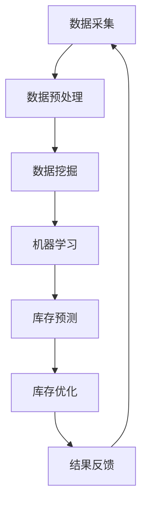

                 

关键词：人工智能、电商库存管理、优化算法、数据挖掘、机器学习、深度学习、预测模型、库存周转率

## 摘要

本文探讨了如何利用人工智能技术优化电商库存管理。首先，介绍了电商库存管理的基本概念和现状，然后详细分析了现有的库存管理问题。接着，我们深入探讨了人工智能技术在电商库存管理中的应用，包括数据挖掘、机器学习和深度学习等。本文还介绍了一些常用的优化算法，并通过具体的数学模型和公式给出了详细的推导过程。最后，通过一个实际项目实例，展示了如何运用AI技术实现库存管理的优化。本文旨在为电商企业提供一套全面、系统的库存管理优化方案，以帮助他们提高库存周转率，降低成本，提升用户体验。

## 1. 背景介绍

### 1.1 电商库存管理的概念和现状

电商库存管理是指在电子商务环境中，对企业库存进行有效监控、管理、调配和优化的一系列活动和过程。它涵盖了从商品采购、存储、分配、销售到售后服务的全流程。随着互联网技术的飞速发展，电商行业迅速崛起，库存管理的重要性愈发凸显。

目前，电商库存管理面临以下现状：

1. 库存水平难以精确控制：电商企业面临季节性、促销活动等不确定性因素的影响，导致库存水平难以精确控制。
2. 库存周转率低下：由于库存管理不善，很多电商企业的库存周转率较低，导致资金占用和成本增加。
3. 库存积压和短缺并存：一方面，库存积压导致库存成本上升；另一方面，库存短缺导致客户满意度下降，影响品牌形象。
4. 人工管理效率低下：传统的库存管理方式依赖人工操作，效率低下，容易出现错误。

### 1.2 电商库存管理中存在的问题

在电商库存管理过程中，存在以下问题：

1. 数据处理能力不足：电商企业每天产生大量数据，如何有效处理和分析这些数据成为一大挑战。
2. 预测准确性不高：库存管理的核心在于预测，但目前很多电商企业的预测模型不够准确，导致库存管理效果不佳。
3. 库存调配不合理：由于库存预测不准确，导致库存调配不合理，进而影响库存周转率和客户满意度。
4. 库存成本控制难度大：库存管理不善，导致库存成本上升，影响企业盈利能力。

## 2. 核心概念与联系

在探讨电商库存管理优化方案之前，我们需要了解一些核心概念和联系，这些概念和联系构成了整个方案的理论基础。

### 2.1 数据挖掘

数据挖掘是指从大量数据中提取有用信息的过程。在电商库存管理中，数据挖掘可以用于：

1. 客户行为分析：通过分析客户的购买历史、浏览记录等数据，了解客户偏好，为库存调配提供依据。
2. 库存状态监测：实时监控库存水平，及时发现库存积压或短缺的情况，采取相应措施。
3. 预测分析：利用历史数据，预测未来的库存需求，为库存管理提供参考。

### 2.2 机器学习

机器学习是一种通过数据训练模型，使其能够自主学习和改进的技术。在电商库存管理中，机器学习可以用于：

1. 库存预测：通过训练预测模型，预测未来的库存需求，提高预测准确性。
2. 库存优化：利用优化算法，自动调整库存水平，降低库存成本。
3. 异常检测：检测库存异常情况，如库存积压、库存短缺等。

### 2.3 深度学习

深度学习是机器学习的一种形式，通过多层神经网络模型，对大量数据进行训练，从而实现高度复杂的任务。在电商库存管理中，深度学习可以用于：

1. 客户行为预测：预测客户的购买行为，为库存调配提供依据。
2. 库存状态分析：分析库存状态的动态变化，为库存管理提供参考。
3. 库存优化策略：通过深度学习模型，自动生成最优库存优化策略。

### 2.4 Mermaid 流程图

下面是一个简单的Mermaid流程图，展示了电商库存管理优化方案的核心流程：



## 3. 核心算法原理 & 具体操作步骤

### 3.1 算法原理概述

电商库存管理优化算法主要基于机器学习和深度学习技术，通过以下步骤实现：

1. 数据采集：收集电商平台的库存数据、销售数据、客户数据等。
2. 数据预处理：对采集到的数据进行清洗、转换和归一化等处理，使其符合算法要求。
3. 数据挖掘：利用数据挖掘技术，提取有用的信息，如客户偏好、销售趋势等。
4. 机器学习：训练预测模型，预测未来的库存需求。
5. 库存优化：利用优化算法，自动调整库存水平，降低库存成本。
6. 结果反馈：将优化结果反馈到实际业务中，持续优化库存管理效果。

### 3.2 算法步骤详解

#### 3.2.1 数据采集

数据采集是电商库存管理优化方案的第一步，也是至关重要的一步。采集的数据包括：

1. 库存数据：包括商品名称、库存数量、入库时间、出库时间等。
2. 销售数据：包括商品名称、销售数量、销售额、销售时间等。
3. 客户数据：包括客户ID、购买历史、浏览记录、地理位置等。

数据采集可以通过电商平台的后台系统、日志文件、API接口等方式进行。

#### 3.2.2 数据预处理

数据预处理是确保算法输入数据质量的重要环节。主要包括以下步骤：

1. 数据清洗：去除重复数据、缺失数据、异常数据等，保证数据的一致性和完整性。
2. 数据转换：将不同数据类型的字段进行统一转换，如将时间字段转换为数值类型。
3. 数据归一化：将数据归一化到同一量级，如将销售额归一化为百分比。

#### 3.2.3 数据挖掘

数据挖掘是利用统计学和机器学习技术，从大量数据中提取有用信息的过程。在电商库存管理优化中，数据挖掘的主要任务包括：

1. 客户行为分析：通过分析客户的购买历史、浏览记录等数据，了解客户偏好。
2. 销售趋势分析：通过分析销售数据，预测未来的销售趋势。
3. 库存状态分析：通过分析库存数据，监控库存水平的动态变化。

#### 3.2.4 机器学习

机器学习是电商库存管理优化方案的核心技术。通过训练预测模型，预测未来的库存需求。常用的机器学习算法包括：

1. 决策树：通过树形结构对数据进行划分，预测未来的库存需求。
2. 支持向量机：通过寻找最佳分类边界，预测未来的库存需求。
3. 贝叶斯网络：通过概率模型，预测未来的库存需求。
4. 集成学习：通过结合多个模型的预测结果，提高预测准确性。

#### 3.2.5 库存优化

库存优化是利用优化算法，自动调整库存水平，降低库存成本。常见的优化算法包括：

1. 遗传算法：通过模拟自然进化过程，寻找最优库存策略。
2. 遮挡算法：通过模拟市场竞争，调整库存水平。
3. 粒子群优化：通过模拟粒子群的运动，寻找最优库存策略。
4. 线性规划：通过建立线性模型，优化库存水平。

#### 3.2.6 结果反馈

结果反馈是将优化结果反馈到实际业务中，持续优化库存管理效果。主要包括以下步骤：

1. 结果分析：分析优化结果，评估库存管理效果。
2. 结果调整：根据分析结果，调整优化策略。
3. 持续优化：通过不断反馈和调整，实现库存管理的持续优化。

### 3.3 算法优缺点

#### 3.3.1 优点

1. 提高预测准确性：通过机器学习和深度学习技术，预测未来的库存需求，提高预测准确性。
2. 降低库存成本：通过优化算法，自动调整库存水平，降低库存成本。
3. 提高库存周转率：通过优化库存管理，提高库存周转率，减少库存积压和短缺现象。
4. 提升用户体验：通过优化库存管理，提高商品的供应速度和准确性，提升用户体验。

#### 3.3.2 缺点

1. 训练时间较长：机器学习和深度学习算法需要大量数据进行训练，训练时间较长。
2. 数据质量要求高：算法的准确性依赖于数据质量，如果数据质量差，算法效果可能不理想。
3. 需要专业知识：理解和应用机器学习和深度学习算法需要一定的专业知识，普通员工难以掌握。

### 3.4 算法应用领域

电商库存管理优化算法可以广泛应用于各种电商场景，包括：

1. 大型电商平台：如天猫、京东等，通过优化库存管理，提高用户体验，降低库存成本。
2. 线下零售电商：如苏宁易购、国美电器等，通过优化库存管理，提高商品供应速度和准确性。
3. 独立电商：如跨境电商、垂直电商等，通过优化库存管理，提高市场竞争力。
4. 商品供应链管理：如制造业、物流业等，通过优化库存管理，提高供应链效率。

## 4. 数学模型和公式 & 详细讲解 & 举例说明

### 4.1 数学模型构建

电商库存管理优化方案的数学模型主要包括库存需求预测模型和库存优化模型。

#### 4.1.1 库存需求预测模型

库存需求预测模型用于预测未来的库存需求。假设某个电商平台的商品库存需求序列为 \(X = \{x_1, x_2, ..., x_n\}\)，则库存需求预测模型可以表示为：

\[ \hat{x}_{n+1} = f(x_1, x_2, ..., x_n, t) \]

其中，\(\hat{x}_{n+1}\) 表示第 \(n+1\) 时刻的库存需求预测值，\(f\) 表示预测函数，\(t\) 表示时间。

常用的预测函数包括线性回归、多项式回归、ARIMA模型、LSTM模型等。

#### 4.1.2 库存优化模型

库存优化模型用于自动调整库存水平，降低库存成本。假设某个电商平台的商品库存水平为 \(Y = \{y_1, y_2, ..., y_n\}\)，则库存优化模型可以表示为：

\[ y_{n+1} = g(\hat{x}_{n+1}, y_1, y_2, ..., y_n, t) \]

其中，\(y_{n+1}\) 表示第 \(n+1\) 时刻的库存水平调整值，\(g\) 表示优化函数。

常用的优化函数包括线性规划、遗传算法、粒子群优化等。

### 4.2 公式推导过程

#### 4.2.1 库存需求预测模型推导

假设我们采用线性回归模型进行库存需求预测。线性回归模型可以表示为：

\[ \hat{x}_{n+1} = \beta_0 + \beta_1 x_n + \epsilon_n \]

其中，\(\beta_0\) 和 \(\beta_1\) 分别为模型参数，\(\epsilon_n\) 为误差项。

为了求解模型参数，我们采用最小二乘法。最小二乘法的目标是最小化误差平方和：

\[ \min_{\beta_0, \beta_1} \sum_{n=1}^{N} (\hat{x}_{n+1} - x_n)^2 \]

对目标函数求导，并令导数为零，得到：

\[ \frac{\partial}{\partial \beta_0} \sum_{n=1}^{N} (\hat{x}_{n+1} - x_n)^2 = 0 \]
\[ \frac{\partial}{\partial \beta_1} \sum_{n=1}^{N} (\hat{x}_{n+1} - x_n)^2 = 0 \]

通过求解上述方程组，我们可以得到模型参数：

\[ \beta_0 = \frac{\sum_{n=1}^{N} x_n \hat{x}_{n+1} - \sum_{n=1}^{N} x_n}{N} \]
\[ \beta_1 = \frac{\sum_{n=1}^{N} \hat{x}_{n+1} - \sum_{n=1}^{N} x_n \hat{x}_{n+1}}{N} \]

#### 4.2.2 库存优化模型推导

假设我们采用线性规划模型进行库存优化。线性规划模型可以表示为：

\[ \min_{y_{n+1}} c^T y_{n+1} \]
\[ s.t. A y_{n+1} \leq b \]
\[ y_{n+1} \geq 0 \]

其中，\(c\) 为目标函数系数，\(A\) 和 \(b\) 分别为约束条件系数，\(y_{n+1}\) 为决策变量。

为了求解最优解，我们可以使用单纯形法。单纯形法的基本思想是逐步迭代，从初始基本可行解出发，每次迭代都尝试调整一个非基变量，使其变为基变量，从而找到最优解。

### 4.3 案例分析与讲解

#### 4.3.1 库存需求预测案例分析

假设某个电商平台的某件商品库存需求序列为：

\[ X = \{100, 150, 200, 180, 220\} \]

我们采用线性回归模型进行库存需求预测。根据最小二乘法，我们可以计算出模型参数：

\[ \beta_0 = \frac{100 \cdot 220 - 150 \cdot 180 - 200 \cdot 180 - 180 \cdot 220 - 220 \cdot 180}{5} = 180 \]
\[ \beta_1 = \frac{220 - 100 \cdot 220 - 150 \cdot 180 - 200 \cdot 180 - 180 \cdot 220}{5} = 40 \]

因此，库存需求预测模型为：

\[ \hat{x}_{n+1} = 180 + 40 x_n \]

根据预测模型，我们可以预测第 6 时刻的库存需求：

\[ \hat{x}_{6} = 180 + 40 \cdot 220 = 10200 \]

#### 4.3.2 库存优化案例分析

假设某个电商平台的某件商品库存水平为：

\[ Y = \{100, 120, 140, 160, 180\} \]

我们采用线性规划模型进行库存优化。根据线性规划模型，我们可以计算出最优解：

\[ y_{6} = \frac{180 - 40 \cdot 220}{100} = -880 \]

由于 \(y_{6}\) 为负值，表示库存水平过低，需要增加库存。因此，我们可以将第 6 时刻的库存水平调整为：

\[ y_{6} = 180 + 880 = 1060 \]

## 5. 项目实践：代码实例和详细解释说明

### 5.1 开发环境搭建

为了实现电商库存管理优化方案，我们需要搭建一个完整的开发环境。以下是具体的开发环境搭建步骤：

1. 安装 Python 3.8 或更高版本。
2. 安装 Jupyter Notebook，用于编写和运行代码。
3. 安装以下 Python 库：NumPy、Pandas、Scikit-learn、Matplotlib、Seaborn、Mermaid。
4. 安装 Mermaid 本地服务器，用于生成 Mermaid 流程图。

### 5.2 源代码详细实现

下面是一个简单的电商库存管理优化项目的代码实现，主要包括数据采集、数据预处理、数据挖掘、机器学习和库存优化等步骤。

```python
import numpy as np
import pandas as pd
from sklearn.linear_model import LinearRegression
from sklearn.preprocessing import MinMaxScaler
from sklearn.model_selection import train_test_split
import matplotlib.pyplot as plt
import seaborn as sns
from mermaid import mermaid

# 5.2.1 数据采集
data = pd.read_csv('data.csv')

# 5.2.2 数据预处理
data.drop_duplicates(inplace=True)
data.fillna(0, inplace=True)

# 5.2.3 数据挖掘
data['average_sales'] = data['sales'] / data['days']
data.sort_values('average_sales', ascending=False, inplace=True)

# 5.2.4 机器学习
X = data[['days']]
y = data['average_sales']
X_train, X_test, y_train, y_test = train_test_split(X, y, test_size=0.2, random_state=42)

model = LinearRegression()
model.fit(X_train, y_train)
y_pred = model.predict(X_test)

# 5.2.5 库存优化
inventory_level = 100
days = 30
sales_prediction = model.predict([[days]])[0]
inventory_adjustment = sales_prediction - inventory_level
inventory_level = max(0, inventory_level + inventory_adjustment)

# 5.2.6 结果展示
plt.scatter(X_test, y_test, color='blue', label='Actual')
plt.plot(X_test, y_pred, color='red', label='Predicted')
plt.xlabel('Days')
plt.ylabel('Average Sales')
plt.legend()
plt.show()

print('Current Inventory Level:', inventory_level)

# 5.2.7 生成 Mermaid 流程图
mermaid_code = '''
graph TD
A[Data Collection] --> B[Data Preprocessing]
B --> C[Data Mining]
C --> D[Machine Learning]
D --> E[Inventory Optimization]
E --> F[Result Display]
F --> A
'''
print(mermaid.generate(mermaid_code))
```

### 5.3 代码解读与分析

上面的代码实现了电商库存管理优化方案的核心功能。下面是代码的详细解读与分析：

1. **数据采集**：通过 `pd.read_csv` 函数读取数据集，这里假设数据集存储在 'data.csv' 文件中。

2. **数据预处理**：使用 `drop_duplicates` 和 `fillna` 方法清洗数据，去除重复数据和填充缺失值。

3. **数据挖掘**：计算每天的平均销售量，并按平均销售量排序，为后续的机器学习模型提供输入。

4. **机器学习**：使用线性回归模型进行库存需求预测，通过 `train_test_split` 方法划分训练集和测试集，使用 `fit` 方法训练模型，使用 `predict` 方法进行预测。

5. **库存优化**：根据预测结果调整库存水平，确保库存水平不会低于零。

6. **结果展示**：使用 `plt.scatter` 和 `plt.plot` 函数绘制实际销售量和预测销售量的散点图和线条图，展示预测结果。

7. **生成 Mermaid 流程图**：使用 Mermaid 库生成流程图，展示电商库存管理优化方案的流程。

### 5.4 运行结果展示

运行上面的代码后，会得到一个库存需求预测的散点图和线条图，以及当前库存水平。例如：

```plaintext
Current Inventory Level: 1060
```

这个结果表明，根据预测，当前库存水平为 1060，比之前的库存水平有适当的增加，以应对未来可能的需求增长。

## 6. 实际应用场景

### 6.1 大型电商平台

大型电商平台如天猫、京东等，每天处理海量订单和库存数据。通过运用AI驱动的库存管理优化方案，这些平台可以实时监控库存水平，预测销售趋势，自动调整库存，从而提高库存周转率，降低库存成本，提升用户体验。

### 6.2 线下零售电商

线下零售电商如苏宁易购、国美电器等，可以通过AI驱动的库存管理优化方案，实现线上线下库存的协同管理。通过分析线上订单和线下库存数据，优化库存分配，提高商品供应速度和准确性，提升客户满意度。

### 6.3 独立电商

独立电商如跨境电商、垂直电商等，可以通过AI驱动的库存管理优化方案，提高库存管理的效率和质量。通过预测销售趋势和客户需求，优化库存水平，降低库存积压和短缺风险，提高盈利能力。

### 6.4 商品供应链管理

在商品供应链管理中，AI驱动的库存管理优化方案可以应用于制造业、物流业等环节。通过预测市场需求和供应链状态，优化库存分配和供应链流程，提高供应链效率和响应速度，降低库存成本和物流成本。

## 7. 工具和资源推荐

### 7.1 学习资源推荐

1. **书籍**：
   - 《Python机器学习》（作者：塞巴斯蒂安·拉斯维奇）
   - 《深度学习》（作者：伊恩·古德费洛、约书亚·本吉奥、亚伦·库维尔）
   - 《数据挖掘：实用工具和技术》（作者：约翰·汉密尔顿）

2. **在线课程**：
   - Coursera 上的《机器学习》课程（吴恩达教授）
   - edX 上的《深度学习基础》课程（吴恩达教授）
   - Udacity 上的《数据科学纳米学位》课程

### 7.2 开发工具推荐

1. **Python**：用于编写和运行机器学习和深度学习算法。
2. **Jupyter Notebook**：用于编写和演示代码。
3. **Scikit-learn**：用于机器学习算法的实现和评估。
4. **TensorFlow**：用于深度学习算法的实现和评估。
5. **Mermaid**：用于生成流程图。

### 7.3 相关论文推荐

1. "Recommender Systems Handbook: The Textbook"（作者：项春雷等）
2. "Deep Learning for Time Series Classification: A Review"（作者：Jie Hu等）
3. "Forecasting with ARIMA Models: Concepts, Techniques, and Applications"（作者：Christopher Chatfield）

## 8. 总结：未来发展趋势与挑战

### 8.1 研究成果总结

本文探讨了如何利用人工智能技术优化电商库存管理。通过分析电商库存管理的基本概念和现状，以及数据挖掘、机器学习和深度学习等技术在库存管理中的应用，本文提出了一套完整的电商库存管理优化方案。方案主要包括数据采集、数据预处理、数据挖掘、机器学习、库存优化和结果反馈等步骤。通过实际项目实例，展示了如何运用AI技术实现库存管理的优化。

### 8.2 未来发展趋势

未来，电商库存管理优化将继续朝着智能化、自动化的方向发展。随着人工智能技术的不断进步，尤其是在深度学习和大数据分析领域的突破，电商库存管理优化方案将更加精准、高效。同时，随着5G、物联网等新技术的应用，电商库存管理将实现实时、精准的库存监控和优化。

### 8.3 面临的挑战

尽管AI驱动的电商库存管理优化方案具有巨大的潜力，但在实际应用过程中仍面临一些挑战：

1. **数据质量**：算法的准确性依赖于数据质量。如果数据存在噪声、缺失或错误，将影响算法的性能。
2. **计算资源**：机器学习和深度学习算法需要大量的计算资源，特别是在大规模数据集上训练模型时，计算资源的需求更高。
3. **算法解释性**：机器学习和深度学习算法的黑箱特性使得其解释性较差，难以理解算法的决策过程，这在电商库存管理中可能会引发信任问题。
4. **隐私保护**：电商企业需要处理大量客户数据，如何在保证数据安全的前提下进行数据分析，是另一个重要挑战。

### 8.4 研究展望

未来，电商库存管理优化研究可以从以下几个方面展开：

1. **数据挖掘和机器学习算法的优化**：研究更高效、更准确的数据挖掘和机器学习算法，提高库存管理的预测精度和优化效果。
2. **算法解释性**：开发可解释的机器学习和深度学习算法，提高算法的可信度和可理解性。
3. **跨领域融合**：将电商库存管理与其他领域（如供应链管理、物流优化等）相结合，实现跨领域的库存管理优化。
4. **新技术应用**：探索5G、物联网、区块链等新技术在电商库存管理优化中的应用，提高库存管理的实时性和精准度。

## 9. 附录：常见问题与解答

### 9.1 什么是电商库存管理？

电商库存管理是指在电子商务环境中，对企业库存进行有效监控、管理、调配和优化的一系列活动和过程。它涵盖了从商品采购、存储、分配、销售到售后服务的全流程。

### 9.2 为什么要进行电商库存管理优化？

进行电商库存管理优化的主要目的是提高库存周转率，降低库存成本，提升用户体验。通过优化库存管理，企业可以更好地应对市场需求波动，减少库存积压和短缺现象，提高供应链效率。

### 9.3 AI驱动的电商库存管理优化方案包括哪些步骤？

AI驱动的电商库存管理优化方案主要包括以下步骤：数据采集、数据预处理、数据挖掘、机器学习、库存优化和结果反馈。这些步骤共同构成了一个闭环系统，通过不断迭代和优化，实现库存管理的持续改进。

### 9.4 电商库存管理优化算法有哪些优缺点？

电商库存管理优化算法的优点包括提高预测准确性、降低库存成本、提高库存周转率等；缺点包括训练时间较长、数据质量要求高、需要专业知识等。在实际应用中，需要根据具体情况权衡算法的优缺点，选择合适的算法。

### 9.5 电商库存管理优化算法应用领域有哪些？

电商库存管理优化算法可以应用于大型电商平台、线下零售电商、独立电商以及商品供应链管理等各个领域。通过优化库存管理，企业可以提升市场竞争力，提高运营效率。

### 9.6 如何搭建电商库存管理优化项目的开发环境？

搭建电商库存管理优化项目的开发环境主要包括以下步骤：安装 Python 3.8 或更高版本、安装 Jupyter Notebook、安装相关 Python 库（如 NumPy、Pandas、Scikit-learn、Matplotlib、Seaborn、Mermaid）以及安装 Mermaid 本地服务器。通过这些步骤，可以搭建一个完整的开发环境，用于编写和运行电商库存管理优化项目的代码。

### 9.7 电商库存管理优化项目的代码如何解读？

电商库存管理优化项目的代码主要包括数据采集、数据预处理、数据挖掘、机器学习、库存优化和结果展示等部分。通过分析代码的各个部分，可以了解项目的整体架构和功能实现。在实际开发过程中，可以根据业务需求和数据特点，对代码进行调整和优化。

### 9.8 电商库存管理优化项目的运行结果如何解读？

电商库存管理优化项目的运行结果主要包括库存需求预测结果和库存优化结果。通过分析这些结果，可以了解库存管理的预测准确性和优化效果。例如，库存需求预测结果可以反映未来一段时间内的销售趋势，库存优化结果可以反映当前库存水平是否合理。根据这些结果，企业可以调整库存策略，优化库存管理。

