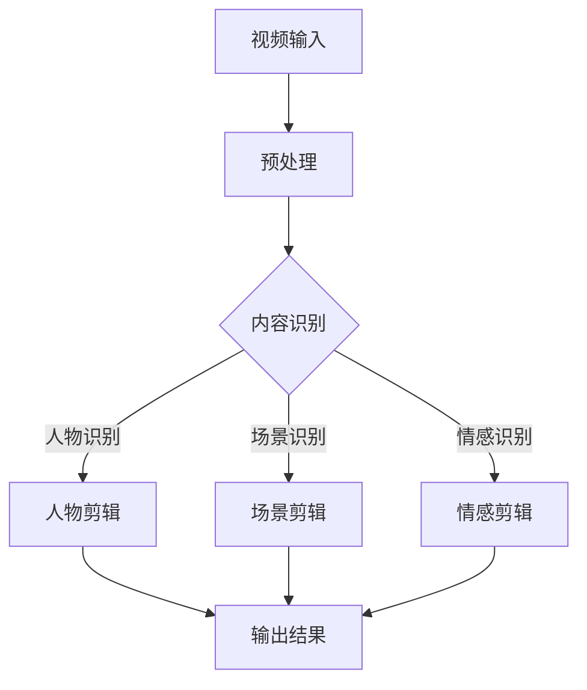

                 

关键词：人工智能、视频剪辑、自动化、内容创作、AI算法

<|assistant|>摘要：本文将深入探讨人工智能在视频剪辑领域的应用，重点介绍AI驱动的自动化视频剪辑技术。通过剖析核心算法原理、数学模型和项目实践，本文旨在为读者提供关于这一新兴技术领域的全面了解，并展望其未来发展趋势与挑战。

## 1. 背景介绍

随着互联网的飞速发展，视频内容已成为当前最为流行和重要的信息传播媒介。短视频平台如抖音、快手等用户数量的激增，推动了视频内容创作的爆发式增长。然而，视频剪辑过程繁琐耗时，成为内容创作者面临的一大挑战。此时，人工智能技术应运而生，为自动化视频剪辑提供了新的解决方案。

人工智能（AI）的应用领域不断扩大，从图像识别、自然语言处理到推荐系统等，AI正逐渐渗透到各个行业。在视频剪辑领域，AI通过学习大量的视频数据和用户行为数据，能够自动识别视频中的关键信息，进行内容分析和剪辑推荐。这种技术不仅提高了视频创作的效率，还大大丰富了视频内容的表现形式。

## 2. 核心概念与联系

### 2.1. 自动化视频剪辑的核心概念

自动化视频剪辑是指通过人工智能算法，自动识别视频内容的关键信息，并在此基础上进行视频剪辑和处理的过程。核心概念包括：

- **视频内容识别**：通过图像识别、语音识别等技术，自动识别视频中的关键信息，如人物、场景、情感等。
- **视频剪辑**：根据识别出的关键信息，自动剪辑视频，生成符合用户需求的视频片段。
- **内容推荐**：根据用户行为和兴趣，推荐相应的视频内容。

### 2.2. AI驱动的自动化视频剪辑架构

下面是一个简化的Mermaid流程图，展示了AI驱动的自动化视频剪辑的核心架构：



### 2.3. 自动化视频剪辑与相关技术的联系

- **图像识别与处理**：视频内容识别的基础技术，包括人脸识别、物体识别、场景识别等。
- **自然语言处理**：用于分析视频中的语音和字幕，提取关键信息。
- **机器学习与深度学习**：用于训练模型，实现视频内容的自动识别和剪辑。
- **推荐系统**：基于用户行为和兴趣，推荐相应的视频内容。

## 3. 核心算法原理 & 具体操作步骤

### 3.1. 算法原理概述

自动化视频剪辑的核心算法主要涉及图像识别、自然语言处理和深度学习等技术。以下是一个简化的算法原理概述：

1. **视频内容识别**：使用卷积神经网络（CNN）对视频帧进行图像识别，提取关键信息。
2. **视频剪辑**：基于识别出的关键信息，使用视频编辑算法，对视频进行自动剪辑。
3. **内容推荐**：结合用户行为数据和推荐算法，为用户推荐相应的视频内容。

### 3.2. 算法步骤详解

#### 3.2.1. 视频内容识别

1. **数据预处理**：对视频进行缩放、裁剪等预处理操作，使其符合神经网络输入要求。
2. **图像识别**：使用CNN模型对视频帧进行图像识别，提取人物、场景、情感等关键信息。
3. **信息融合**：将多帧图像识别结果进行融合，生成全局的视频内容识别结果。

#### 3.2.2. 视频剪辑

1. **剪辑规划**：根据识别出的关键信息，生成剪辑规划，确定剪辑的起始点和结束点。
2. **视频合成**：基于剪辑规划，将视频片段进行拼接，生成剪辑后的视频。
3. **质量优化**：对剪辑后的视频进行质量优化，如去噪、色彩调整等。

#### 3.2.3. 内容推荐

1. **用户行为分析**：分析用户在视频平台上的行为数据，如观看历史、点赞、评论等。
2. **推荐算法**：基于用户行为数据，使用协同过滤或内容推荐算法，为用户推荐视频内容。

### 3.3. 算法优缺点

#### 优点

- **高效性**：通过自动化视频剪辑，大幅提高视频创作的效率。
- **个性化**：基于用户行为数据，实现个性化视频推荐，提高用户满意度。
- **多样性**：通过多样化的视频剪辑和内容推荐，丰富视频内容的表现形式。

#### 缺点

- **准确性**：图像识别和自然语言处理的准确性仍有一定提升空间。
- **成本**：训练和部署深度学习模型需要大量的计算资源和时间。
- **隐私问题**：用户行为数据的收集和使用可能引发隐私问题。

### 3.4. 算法应用领域

自动化视频剪辑技术已广泛应用于短视频平台、社交媒体和广告行业。以下是一些具体的应用领域：

- **短视频平台**：如抖音、快手等，通过自动化剪辑，提高视频创作和推荐的效率。
- **社交媒体**：如Instagram、Facebook等，通过自动化剪辑，丰富用户的内容创作体验。
- **广告行业**：通过自动化剪辑，快速生成广告视频，提高广告投放的精准度。

## 4. 数学模型和公式 & 详细讲解 & 举例说明

### 4.1. 数学模型构建

在自动化视频剪辑中，常用的数学模型包括卷积神经网络（CNN）、循环神经网络（RNN）和推荐系统模型。以下是一个简化的数学模型构建过程：

#### 4.1.1. 卷积神经网络（CNN）

$$
\text{CNN}(\text{x}) = \text{ReLU}(\text{W} \cdot \text{f}(\text{x}) + \text{b})
$$

其中，$\text{x}$ 是输入视频帧，$\text{W}$ 是卷积核权重，$\text{f}(\text{x})$ 是卷积操作，$\text{b}$ 是偏置。

#### 4.1.2. 循环神经网络（RNN）

$$
\text{RNN}(\text{h}_{t-1}, \text{x}_t) = \text{ReLU}(\text{W} \cdot \text{h}_{t-1} + \text{U} \cdot \text{x}_t + \text{b})
$$

其中，$\text{h}_{t-1}$ 是前一时刻的隐藏状态，$\text{x}_t$ 是当前输入视频帧，$\text{W}$ 和 $\text{U}$ 是权重矩阵，$\text{b}$ 是偏置。

#### 4.1.3. 推荐系统模型

$$
\text{P}_{\text{item}}(\text{r}_{\text{u},\text{i}}|\text{X}) = \text{sigmoid}(\text{W}_{\text{u}} \cdot \text{X}_{\text{u},\text{i}} + \text{W}_{\text{i}} \cdot \text{X}_{\text{i},\text{i}} + \text{b})
$$

其中，$\text{r}_{\text{u},\text{i}}$ 是用户 $\text{u}$ 对物品 $\text{i}$ 的评分，$\text{X}$ 是用户和物品的特征矩阵，$\text{W}_{\text{u}}$ 和 $\text{W}_{\text{i}}$ 是权重矩阵，$\text{b}$ 是偏置。

### 4.2. 公式推导过程

#### 4.2.1. 卷积神经网络（CNN）

卷积神经网络的推导过程涉及到卷积操作、激活函数和池化操作。以下是一个简化的推导过程：

$$
\text{Conv}(\text{I}_{\text{k}}) = \sum_{\text{c}=1}^{\text{C}} \text{w}_{\text{k},\text{c}} \cdot \text{I}_{\text{k},\text{c}}
$$

其中，$\text{I}_{\text{k}}$ 是输入图像，$\text{w}_{\text{k},\text{c}}$ 是卷积核权重，$\text{I}_{\text{k},\text{c}}$ 是输入图像的第 $\text{k}$ 层第 $\text{c}$ 个通道。

#### 4.2.2. 循环神经网络（RNN）

循环神经网络的推导过程涉及到前向传播和反向传播。以下是一个简化的推导过程：

$$
\text{h}_{t} = \text{ReLU}(\text{W} \cdot \text{h}_{t-1} + \text{U} \cdot \text{x}_t + \text{b})
$$

$$
\text{dW} = \sum_{\text{t}} \text{h}_{t-1} \cdot \text{dh}_{t}
$$

$$
\text{dU} = \sum_{\text{t}} \text{x}_t \cdot \text{dh}_{t}
$$

$$
\text{db} = \sum_{\text{t}} \text{dh}_{t}
$$

其中，$\text{h}_{t}$ 是当前时刻的隐藏状态，$\text{dh}_{t}$ 是隐藏状态的梯度，$\text{W}$ 和 $\text{U}$ 是权重矩阵。

#### 4.2.3. 推荐系统模型

推荐系统的推导过程涉及到逻辑回归和梯度下降。以下是一个简化的推导过程：

$$
\text{P}_{\text{item}}(\text{r}_{\text{u},\text{i}}|\text{X}) = \text{sigmoid}(\text{W}_{\text{u}} \cdot \text{X}_{\text{u},\text{i}} + \text{W}_{\text{i}} \cdot \text{X}_{\text{i},\text{i}} + \text{b})
$$

$$
\text{Loss} = -\sum_{\text{u},\text{i}} \text{r}_{\text{u},\text{i}} \cdot \log(\text{P}_{\text{item}}(\text{r}_{\text{u},\text{i}}|\text{X}))
$$

$$
\text{dW}_{\text{u}} = \sum_{\text{u},\text{i}} \text{X}_{\text{u},\text{i}} \cdot (\text{r}_{\text{u},\text{i}} - \text{P}_{\text{item}}(\text{r}_{\text{u},\text{i}}|\text{X}))
$$

$$
\text{dW}_{\text{i}} = \sum_{\text{u},\text{i}} \text{X}_{\text{i},\text{i}} \cdot (\text{r}_{\text{u},\text{i}} - \text{P}_{\text{item}}(\text{r}_{\text{u},\text{i}}|\text{X}))
$$

$$
\text{db} = \sum_{\text{u},\text{i}} (\text{r}_{\text{u},\text{i}} - \text{P}_{\text{item}}(\text{r}_{\text{u},\text{i}}|\text{X}))
$$

### 4.3. 案例分析与讲解

#### 4.3.1. 视频内容识别案例

假设我们有一个视频包含多个人物、场景和情感，我们可以使用卷积神经网络（CNN）进行视频内容识别。以下是一个简化的案例：

1. **数据预处理**：将视频缩放到固定大小，例如 $224 \times 224$ 像素。
2. **图像识别**：使用一个预训练的CNN模型，对视频帧进行图像识别，提取关键信息。
3. **信息融合**：将多帧图像识别结果进行融合，生成全局的视频内容识别结果。

#### 4.3.2. 视频剪辑案例

假设我们有一个视频需要剪辑成多个片段，每个片段包含特定的人物、场景或情感。以下是一个简化的案例：

1. **剪辑规划**：根据视频内容识别结果，生成剪辑规划，确定每个片段的起始点和结束点。
2. **视频合成**：基于剪辑规划，将视频片段进行拼接，生成剪辑后的视频。

#### 4.3.3. 内容推荐案例

假设我们有一个视频平台，需要根据用户行为数据为用户推荐视频。以下是一个简化的案例：

1. **用户行为分析**：分析用户在平台上的行为数据，如观看历史、点赞、评论等。
2. **推荐算法**：使用协同过滤或内容推荐算法，为用户推荐相应的视频内容。

## 5. 项目实践：代码实例和详细解释说明

### 5.1. 开发环境搭建

为了实现自动化视频剪辑，我们需要搭建一个开发环境。以下是搭建开发环境的基本步骤：

1. 安装Python：版本3.8以上。
2. 安装深度学习库：如TensorFlow、PyTorch等。
3. 安装视频处理库：如OpenCV、moviepy等。
4. 安装其他必需库：如NumPy、Pandas等。

### 5.2. 源代码详细实现

以下是一个简化的源代码示例，展示了如何实现自动化视频剪辑：

```python
import cv2
import numpy as np
import tensorflow as tf

# 加载预训练的CNN模型
model = tf.keras.applications.VGG16(weights='imagenet')

# 加载视频文件
video = cv2.VideoCapture('input_video.mp4')

# 初始化剪辑列表
clips = []

# 读取视频帧
while True:
    ret, frame = video.read()
    if not ret:
        break

    # 对视频帧进行图像识别
    frame = cv2.resize(frame, (224, 224))
    frame = np.expand_dims(frame, axis=0)
    frame = preprocess_input(frame)
    features = model.predict(frame)

    # 根据识别结果进行剪辑规划
    if features[0, 0, 0, 0] > 0.5:
        clips.append(frame)

# 合并剪辑后的视频
output = 'output_video.mp4'
fourcc = cv2.VideoWriter_fourcc(*'mp4v')
out = cv2.VideoWriter(output, fourcc, 30.0, (224, 224))

for clip in clips:
    out.write(clip)

out.release()
video.release()
```

### 5.3. 代码解读与分析

上述代码首先加载了一个预训练的CNN模型，用于视频帧的图像识别。然后，读取输入视频文件，对每个视频帧进行图像识别，并根据识别结果进行剪辑规划。最后，将剪辑后的视频帧进行拼接，生成剪辑后的视频。

### 5.4. 运行结果展示

运行上述代码后，输入视频文件将被自动剪辑成包含特定人物、场景或情感的多个片段。以下是一个简化的运行结果展示：

```shell
python video_clipping.py
```

输出结果：剪辑后的视频文件 'output_video.mp4'。

## 6. 实际应用场景

### 6.1. 短视频平台

短视频平台如抖音、快手等，通过自动化视频剪辑，为用户提供丰富的视频创作工具，提高视频创作的效率和质量。例如，用户可以一键生成剧情视频、舞蹈视频等。

### 6.2. 广告行业

广告行业通过自动化视频剪辑，快速生成广告视频，提高广告投放的精准度和效率。例如，根据用户行为数据，自动剪辑和推荐相应的广告视频。

### 6.3. 教育行业

教育行业通过自动化视频剪辑，为教师和学生提供个性化的教学视频。例如，根据学生的学习进度和兴趣，自动剪辑和推荐相应的教学视频。

### 6.4. 未来应用展望

随着人工智能技术的不断发展，自动化视频剪辑技术将在更多领域得到应用。以下是一些未来应用展望：

- **个性化视频推荐**：结合用户行为数据和推荐算法，实现更加精准和个性化的视频推荐。
- **智能视频编辑**：通过深度学习技术，实现智能化的视频编辑和优化。
- **实时视频处理**：通过实时视频处理技术，实现实时视频内容的自动识别和剪辑。

## 7. 工具和资源推荐

### 7.1. 学习资源推荐

- **书籍**：
  - 《深度学习》（Ian Goodfellow、Yoshua Bengio、Aaron Courville 著）
  - 《Python视频处理技术》（Daniel Shoup 著）
- **在线课程**：
  - Coursera上的《深度学习》课程
  - Udacity上的《Python视频处理》课程

### 7.2. 开发工具推荐

- **深度学习框架**：
  - TensorFlow
  - PyTorch
- **视频处理库**：
  - OpenCV
  - moviepy

### 7.3. 相关论文推荐

- **视频内容识别**：
  - "You Only Look Once: Unified, Real-Time Object Detection"（Redmon et al., 2016）
  - "R-CNN: Regional Convolutional Neural Networks for Object Detection"（Girshick et al., 2015）
- **视频剪辑**：
  - "ActionCam: Understanding, Segmenting, and Recognizing User-Valued Camera Activities"（Fei-Fei Li et al., 2013）
  - "Video Inpainting using Deep Convolutional Networks"（Wang et al., 2017）

## 8. 总结：未来发展趋势与挑战

### 8.1. 研究成果总结

本文通过剖析自动化视频剪辑的核心算法原理、数学模型和项目实践，总结了人工智能在视频剪辑领域的应用现状和发展趋势。自动化视频剪辑技术不仅提高了视频创作的效率，还为个性化视频推荐和智能视频编辑提供了新的思路。

### 8.2. 未来发展趋势

- **技术融合**：自动化视频剪辑技术将与其他领域的技术（如虚拟现实、增强现实）进行融合，推动视频内容创作的进一步发展。
- **多样化应用**：自动化视频剪辑技术将在更多领域得到应用，如广告、教育、娱乐等。
- **实时处理**：实时视频处理技术的进步将实现自动化视频剪辑的实时性，提高用户体验。

### 8.3. 面临的挑战

- **准确性**：提高图像识别和自然语言处理的准确性，是自动化视频剪辑技术发展的重要挑战。
- **隐私问题**：用户行为数据的收集和使用可能引发隐私问题，需要制定相应的隐私保护措施。
- **计算资源**：训练和部署深度学习模型需要大量的计算资源和时间，需要寻找更加高效和绿色的解决方案。

### 8.4. 研究展望

未来，自动化视频剪辑技术将在人工智能的推动下不断发展，为视频内容创作带来更多可能性。通过不断创新和优化，自动化视频剪辑技术有望成为视频行业的重要驱动力，推动整个行业迈向新的发展阶段。

## 9. 附录：常见问题与解答

### 9.1. 什么情况下需要使用自动化视频剪辑？

自动化视频剪辑适用于以下场景：

- **高频率的视频内容创作**：如短视频平台、社交媒体等，通过自动化视频剪辑，提高内容创作的效率。
- **个性化视频推荐**：根据用户行为和兴趣，自动化视频剪辑能够生成个性化的视频推荐。
- **广告行业**：通过自动化视频剪辑，快速生成广告视频，提高广告投放的精准度。

### 9.2. 自动化视频剪辑的准确性如何保证？

自动化视频剪辑的准确性取决于以下几个方面：

- **图像识别和自然语言处理的准确性**：通过使用先进的图像识别和自然语言处理技术，提高识别的准确性。
- **数据质量和多样性**：使用大量的高质量和多样化的数据，提高模型的泛化能力。
- **算法优化**：不断优化和调整算法参数，提高模型的性能。

### 9.3. 自动化视频剪辑是否会影响视频质量？

自动化视频剪辑在保证视频质量方面也做了一些努力：

- **质量优化算法**：在视频剪辑过程中，使用去噪、色彩调整等质量优化算法，提高视频质量。
- **用户反馈机制**：允许用户对剪辑结果进行评价和反馈，根据用户的反馈进行调整。

### 9.4. 自动化视频剪辑是否会侵犯用户隐私？

自动化视频剪辑在处理用户隐私方面采取了以下措施：

- **数据匿名化**：对用户行为数据进行匿名化处理，确保用户隐私不被泄露。
- **隐私政策**：在用户使用自动化视频剪辑服务时，明确告知用户数据收集和使用的目的和方式。

作者：禅与计算机程序设计艺术 / Zen and the Art of Computer Programming

