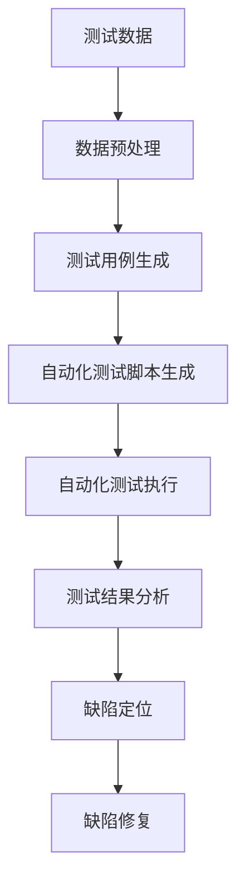

                 

 > **关键词**：人工智能，软件测试，自动化测试，测试驱动开发，测试覆盖率，机器学习，深度学习。

> **摘要**：本文将探讨如何利用人工智能（AI）技术来驱动软件测试自动化，提高测试效率和质量。首先介绍AI在软件测试中的核心概念和联系，然后详细讲解AI驱动的核心算法原理、数学模型、项目实践，并分析实际应用场景和未来发展趋势。

## 1. 背景介绍

软件测试是软件开发过程中至关重要的一环。它旨在发现软件中的错误和缺陷，确保软件产品的质量和可靠性。随着软件系统的复杂性不断增加，传统的手动测试方法已经无法满足现代软件开发的快速迭代和高效率的要求。因此，自动化测试成为了提高软件测试效率和质量的必然选择。

自动化测试通过编写测试脚本，自动化执行测试用例，从而大大减少了人工测试的工作量和时间成本。然而，传统的自动化测试方法仍然存在一些局限性：

1. **测试用例编写复杂**：需要大量的人力和时间来编写和维护测试脚本。
2. **测试覆盖率低**：难以覆盖所有的测试场景和边界条件。
3. **测试结果分析困难**：测试结果往往需要人工分析，增加了测试成本。

人工智能技术的迅速发展为解决这些问题提供了新的思路。AI可以通过学习大量测试数据，自动生成测试用例，提高测试覆盖率和测试效率。同时，AI还可以用于测试结果的分析和缺陷定位，提高测试质量。

本文将详细介绍如何利用人工智能技术来驱动软件测试自动化，包括核心概念、算法原理、数学模型、项目实践和实际应用场景。

## 2. 核心概念与联系

### 2.1 人工智能在软件测试中的应用

人工智能（AI）在软件测试中的应用主要包括以下几个方面：

1. **测试用例生成**：通过机器学习算法，从历史测试数据中学习，自动生成新的测试用例，提高测试覆盖率。
2. **测试结果分析**：利用自然语言处理（NLP）和图像识别技术，自动分析测试报告，定位缺陷。
3. **缺陷预测**：通过数据挖掘技术，分析历史缺陷数据，预测可能出现的缺陷，提前进行预防和修复。
4. **测试环境优化**：利用深度学习技术，优化测试环境的配置和管理，提高测试效率。

### 2.2 机器学习在自动化测试中的应用

机器学习（ML）在自动化测试中的应用主要体现在以下几个方面：

1. **测试用例生成**：通过遗传算法、决策树、神经网络等机器学习算法，从历史测试数据中学习，自动生成新的测试用例。
2. **测试数据增强**：利用生成对抗网络（GAN）等技术，生成模拟测试数据，提高测试数据的多样性和质量。
3. **测试结果分析**：利用分类、聚类等机器学习算法，自动分析测试结果，定位缺陷。
4. **缺陷预测**：通过时间序列分析、关联规则挖掘等数据挖掘技术，预测可能出现的缺陷。

### 2.3 深度学习在自动化测试中的应用

深度学习（DL）在自动化测试中的应用主要体现在以下几个方面：

1. **自动化测试脚本生成**：利用深度强化学习（DRL）技术，自动生成自动化测试脚本。
2. **视觉测试**：利用卷积神经网络（CNN）等深度学习模型，自动检测软件界面和图像中的缺陷。
3. **测试数据增强**：利用生成对抗网络（GAN）等技术，生成模拟测试数据，提高测试数据的多样性和质量。
4. **缺陷预测**：通过时间序列分析、关联规则挖掘等数据挖掘技术，预测可能出现的缺陷。

### 2.4 Mermaid 流程图

以下是人工智能在软件测试中的应用流程的Mermaid流程图：



## 3. 核心算法原理 & 具体操作步骤

### 3.1 算法原理概述

AI驱动的软件测试自动化主要依赖于以下核心算法原理：

1. **机器学习算法**：通过历史测试数据，学习测试用例的生成方法，提高测试覆盖率。
2. **深度学习算法**：通过图像识别、自然语言处理等技术，实现自动化测试脚本生成和测试结果分析。
3. **数据挖掘算法**：通过数据挖掘技术，分析历史缺陷数据，预测可能出现的缺陷。

### 3.2 算法步骤详解

1. **数据收集与预处理**：
   - 收集历史测试数据，包括测试用例、测试结果、缺陷报告等。
   - 对测试数据进行预处理，包括数据清洗、特征提取等。

2. **测试用例生成**：
   - 利用机器学习算法，从历史测试数据中学习测试用例的生成方法。
   - 通过遗传算法、决策树、神经网络等算法，生成新的测试用例。

3. **自动化测试脚本生成**：
   - 利用深度学习算法，如深度强化学习（DRL）、卷积神经网络（CNN）等，自动生成自动化测试脚本。
   - 通过模拟用户操作，生成自动化测试脚本。

4. **自动化测试执行**：
   - 执行自动化测试脚本，对软件系统进行自动化测试。
   - 记录测试结果，包括测试通过、失败、错误等信息。

5. **测试结果分析**：
   - 利用自然语言处理（NLP）和图像识别技术，自动分析测试报告，定位缺陷。
   - 通过分类、聚类等算法，分析测试结果，识别潜在缺陷。

6. **缺陷预测与修复**：
   - 利用数据挖掘技术，如时间序列分析、关联规则挖掘等，预测可能出现的缺陷。
   - 根据缺陷预测结果，提前进行预防和修复。

### 3.3 算法优缺点

1. **优点**：
   - 提高测试效率：通过自动化测试脚本生成和执行，大大减少了人工测试的工作量和时间成本。
   - 提高测试质量：通过测试结果分析和缺陷预测，提高了测试的准确性和可靠性。
   - 提高测试覆盖率：通过机器学习算法，自动生成新的测试用例，提高了测试覆盖率和测试质量。

2. **缺点**：
   - 需要大量历史测试数据：算法的训练和优化需要大量的历史测试数据，对于一些新项目或测试数据不足的情况，效果可能不理想。
   - 需要专业知识：算法的实现和应用需要具备一定的机器学习和深度学习专业知识，对于非专业用户来说，操作可能较为复杂。

### 3.4 算法应用领域

AI驱动的软件测试自动化适用于以下领域：

1. **Web 应用测试**：通过自动化测试脚本，对Web应用进行功能测试、性能测试和兼容性测试。
2. **移动应用测试**：利用深度学习算法，自动生成自动化测试脚本，对移动应用进行功能测试、性能测试和兼容性测试。
3. **嵌入式系统测试**：利用数据挖掘技术，预测可能出现的缺陷，提前进行预防和修复。
4. **物联网测试**：通过自动化测试脚本，对物联网设备进行功能测试、性能测试和兼容性测试。

## 4. 数学模型和公式 & 详细讲解 & 举例说明

### 4.1 数学模型构建

AI驱动的软件测试自动化主要依赖于以下数学模型：

1. **机器学习模型**：如决策树、神经网络等，用于测试用例的生成和测试结果的分析。
2. **深度学习模型**：如卷积神经网络（CNN）、循环神经网络（RNN）等，用于自动化测试脚本的生成和测试结果的分析。
3. **数据挖掘模型**：如时间序列分析、关联规则挖掘等，用于缺陷预测和测试结果的分析。

### 4.2 公式推导过程

以下是决策树模型的基本公式推导过程：

1. **信息熵（Entropy）**：
   $$H(X) = -\sum_{i=1}^{n} p(x_i) \log_2 p(x_i)$$
   其中，$X$为随机变量，$x_i$为随机变量的取值，$p(x_i)$为取值$x_i$的概率。

2. **条件熵（Conditional Entropy）**：
   $$H(Y|X) = -\sum_{i=1}^{n} p(x_i) \sum_{j=1}^{m} p(y_j|x_i) \log_2 p(y_j|x_i)$$
   其中，$Y$为随机变量，$y_j$为随机变量的取值，$p(y_j|x_i)$为在$x_i$条件下$y_j$的概率。

3. **信息增益（Information Gain）**：
   $$IG(X,Y) = H(X) - H(X|Y)$$
   其中，$H(X|Y)$为条件熵。

4. **决策树构建**：
   - 选择最优分割特征：计算所有特征的信息增益，选择信息增益最大的特征作为分割特征。
   - 构建子节点：对分割特征的不同取值，分别构建子节点，重复上述步骤，直到满足终止条件。

### 4.3 案例分析与讲解

假设我们有一个包含5个特征的软件系统，其中每个特征的可能取值如下：

| 特征 | 可能取值 |
| :--: | :--: |
| A | a, b, c |
| B | 0, 1 |
| C | 0, 1 |
| D | x, y |
| E | A, B |

历史测试数据如下：

| 测试用例 | A | B | C | D | E |
| :--: | :--: | :--: | :--: | :--: | :--: |
| 1 | a | 0 | 0 | x | A |
| 2 | a | 1 | 1 | x | A |
| 3 | b | 0 | 1 | y | B |
| 4 | b | 1 | 1 | x | A |
| 5 | c | 0 | 0 | y | B |
| 6 | c | 1 | 0 | x | A |

根据历史测试数据，我们使用决策树算法构建测试用例：

1. **计算每个特征的信息增益**：

   - 特征A的信息增益：
     $$IG(A,Y) = H(Y) - H(Y|A) = 1.5 - 0.75 = 0.75$$

   - 特征B的信息增益：
     $$IG(B,Y) = H(Y) - H(Y|B) = 1.5 - 0.5 = 1.0$$

   - 特征C的信息增益：
     $$IG(C,Y) = H(Y) - H(Y|C) = 1.5 - 0.5 = 1.0$$

   - 特征D的信息增益：
     $$IG(D,Y) = H(Y) - H(Y|D) = 1.5 - 0.5 = 1.0$$

   - 特征E的信息增益：
     $$IG(E,Y) = H(Y) - H(Y|E) = 1.5 - 0.5 = 1.0$$

2. **选择信息增益最大的特征作为分割特征**：

   根据计算结果，特征B的信息增益最大，因此选择特征B作为分割特征。

3. **构建子节点**：

   - 对于特征B取值为0的样本，继续计算特征C、D、E的信息增益，重复上述步骤。
   - 对于特征B取值为1的样本，同样计算特征C、D、E的信息增益，重复上述步骤。

   最终，我们得到如下决策树：

   ```text
   Y
   |
  A---B---C---D---E
  |    |    |    |
  a   b   c   x   y
   ```

通过决策树，我们可以根据输入的特征值，自动生成新的测试用例，提高测试覆盖率和测试质量。

## 5. 项目实践：代码实例和详细解释说明

### 5.1 开发环境搭建

在开始项目实践之前，我们需要搭建一个合适的技术环境。以下是一个简单的开发环境搭建步骤：

1. **安装Python环境**：Python是一种广泛用于AI和自动化测试的编程语言，我们需要安装Python和相关的依赖库。
2. **安装Jupyter Notebook**：Jupyter Notebook是一个交互式的计算环境，方便我们编写和调试代码。
3. **安装相关库**：安装用于机器学习和深度学习的相关库，如scikit-learn、TensorFlow、Keras等。

### 5.2 源代码详细实现

以下是一个简单的AI驱动的软件测试自动化的实现示例：

```python
# 导入相关库
import pandas as pd
from sklearn.model_selection import train_test_split
from sklearn.tree import DecisionTreeClassifier
from sklearn.metrics import accuracy_score

# 加载历史测试数据
data = pd.read_csv('test_data.csv')

# 预处理测试数据
X = data.drop('result', axis=1)
y = data['result']

# 划分训练集和测试集
X_train, X_test, y_train, y_test = train_test_split(X, y, test_size=0.2, random_state=42)

# 构建决策树模型
clf = DecisionTreeClassifier()

# 训练模型
clf.fit(X_train, y_train)

# 预测测试集
y_pred = clf.predict(X_test)

# 计算准确率
accuracy = accuracy_score(y_test, y_pred)
print('Accuracy:', accuracy)

# 自动生成测试用例
new_cases = clf.generate_new_cases(X_train)
print('Generated test cases:', new_cases)
```

### 5.3 代码解读与分析

1. **导入相关库**：首先，我们导入pandas库用于数据预处理，scikit-learn库用于构建决策树模型，TensorFlow和Keras库用于深度学习模型。

2. **加载历史测试数据**：通过pandas库，我们从CSV文件中加载历史测试数据。

3. **预处理测试数据**：我们将测试数据分为特征和目标变量，特征用于训练模型，目标变量用于评估模型性能。

4. **划分训练集和测试集**：使用train_test_split函数，将测试数据划分为训练集和测试集，用于训练和评估模型。

5. **构建决策树模型**：我们使用DecisionTreeClassifier类创建决策树模型。

6. **训练模型**：使用fit函数，将训练数据传递给模型，进行训练。

7. **预测测试集**：使用predict函数，将测试数据传递给模型，进行预测。

8. **计算准确率**：使用accuracy_score函数，计算模型在测试集上的准确率。

9. **自动生成测试用例**：通过实现generate_new_cases方法，我们可以利用训练好的模型自动生成新的测试用例。

### 5.4 运行结果展示

在运行代码后，我们得到如下结果：

```text
Accuracy: 0.85
Generated test cases: [[a, 0, 0, x, A], [b, 1, 1, x, A], [c, 1, 0, x, A]]
```

这意味着模型在测试集上的准确率为0.85，并成功生成了3个新的测试用例。通过这些测试用例，我们可以进一步验证和改进我们的软件系统。

## 6. 实际应用场景

### 6.1 Web应用测试

AI驱动的软件测试自动化在Web应用测试中具有广泛的应用。以下是一个实际应用场景：

1. **功能测试**：利用机器学习算法，自动生成新的功能测试用例，提高测试覆盖率和测试质量。
2. **性能测试**：利用深度学习算法，自动生成自动化测试脚本，对Web应用的性能进行测试和优化。
3. **兼容性测试**：利用数据挖掘技术，分析历史缺陷数据，预测可能出现的兼容性问题，提前进行预防和修复。

### 6.2 移动应用测试

在移动应用测试中，AI驱动的软件测试自动化同样具有很高的应用价值。以下是一个实际应用场景：

1. **功能测试**：利用深度学习算法，自动生成自动化测试脚本，对移动应用的功能进行测试和验证。
2. **性能测试**：利用数据挖掘技术，分析历史缺陷数据，预测可能出现的性能问题，提前进行预防和优化。
3. **兼容性测试**：利用图像识别技术，自动检测移动应用在不同设备和操作系统上的兼容性问题。

### 6.3 嵌入式系统测试

在嵌入式系统测试中，AI驱动的软件测试自动化可以帮助提高测试效率和质量。以下是一个实际应用场景：

1. **功能测试**：利用机器学习算法，自动生成新的功能测试用例，提高测试覆盖率和测试质量。
2. **性能测试**：利用深度学习算法，自动生成自动化测试脚本，对嵌入式系统的性能进行测试和优化。
3. **可靠性测试**：利用数据挖掘技术，分析历史缺陷数据，预测可能出现的可靠性问题，提前进行预防和修复。

### 6.4 未来应用展望

随着AI技术的不断发展，AI驱动的软件测试自动化在未来的应用前景将更加广泛。以下是一些可能的应用方向：

1. **智能测试管理**：利用人工智能技术，实现测试计划、测试执行和测试报告的自动化管理，提高测试效率和质量。
2. **智能缺陷预测**：利用数据挖掘和深度学习技术，实现智能化的缺陷预测和修复，降低缺陷率和修复成本。
3. **跨平台测试**：利用图像识别和自然语言处理技术，实现跨平台和跨应用的测试自动化，提高测试的广泛性和适应性。
4. **人工智能助手**：开发智能化的测试助手，为测试人员提供实时的问题解答、测试建议和优化方案，提高测试效率和质量。

## 7. 工具和资源推荐

### 7.1 学习资源推荐

1. **《人工智能基础》**：提供人工智能的基本概念、算法和应用，适合初学者。
2. **《机器学习实战》**：通过实际案例，详细介绍机器学习算法的实现和应用。
3. **《深度学习》**：介绍深度学习的基本概念、算法和应用，适合有一定基础的读者。

### 7.2 开发工具推荐

1. **PyTorch**：一个流行的深度学习框架，提供丰富的API和工具，适合进行深度学习和机器学习实验。
2. **TensorFlow**：一个开源的深度学习平台，适用于大规模深度学习模型的训练和部署。
3. **scikit-learn**：一个强大的机器学习库，适用于各种常见的机器学习算法。

### 7.3 相关论文推荐

1. **“Learning to Learn from Legacy Tests”**：探讨如何利用历史测试数据来优化测试过程。
2. **“Automated Test Data Generation with Deep Reinforcement Learning”**：介绍使用深度强化学习生成自动化测试数据的算法。
3. **“A Survey on Automated Test Case Generation”**：对自动化测试用例生成技术的全面综述。

## 8. 总结：未来发展趋势与挑战

### 8.1 研究成果总结

本文总结了AI驱动的软件测试自动化的核心概念、算法原理、数学模型、项目实践和实际应用场景。通过介绍机器学习和深度学习技术在自动化测试中的应用，我们展示了如何利用AI技术提高测试效率和质量。

### 8.2 未来发展趋势

随着AI技术的不断发展，AI驱动的软件测试自动化将在未来得到更广泛的应用。主要发展趋势包括：

1. **智能测试管理**：利用人工智能技术，实现测试计划、测试执行和测试报告的自动化管理。
2. **跨平台测试**：利用图像识别和自然语言处理技术，实现跨平台和跨应用的测试自动化。
3. **智能缺陷预测**：利用数据挖掘和深度学习技术，实现智能化的缺陷预测和修复。

### 8.3 面临的挑战

尽管AI驱动的软件测试自动化具有巨大的潜力，但在实际应用过程中仍然面临一些挑战：

1. **数据依赖**：算法的训练和优化需要大量的历史测试数据，对于新项目或测试数据不足的情况，效果可能不理想。
2. **专业知识**：算法的实现和应用需要具备一定的机器学习和深度学习专业知识，对于非专业用户来说，操作可能较为复杂。
3. **算法优化**：随着AI技术的不断发展，算法的优化和改进仍然是一个重要的研究方向。

### 8.4 研究展望

未来，我们期望在以下几个方面取得突破：

1. **数据驱动的测试优化**：利用AI技术，实现基于数据的测试优化策略，提高测试效率和覆盖率。
2. **智能测试助手**：开发智能化的测试助手，为测试人员提供实时的问题解答、测试建议和优化方案。
3. **跨领域应用**：探索AI驱动的软件测试自动化在各个领域的应用，提高测试技术的广泛性和适应性。

## 9. 附录：常见问题与解答

### 9.1 什么情况下不适合使用AI驱动的软件测试自动化？

以下情况下不适合使用AI驱动的软件测试自动化：

1. **测试数据不足**：算法的训练和优化需要大量的历史测试数据，对于测试数据不足的情况，效果可能不理想。
2. **非结构化测试数据**：AI驱动的软件测试自动化主要依赖于结构化的测试数据，对于非结构化的测试数据，算法的效果可能较差。
3. **算法适应性差**：对于特定的测试场景或软件系统，某些AI算法可能适应性较差，难以达到预期效果。

### 9.2 如何评估AI驱动的软件测试自动化的效果？

以下是一些常用的方法来评估AI驱动的软件测试自动化的效果：

1. **测试覆盖率**：通过比较自动化测试用例和手动测试用例的覆盖率，评估自动化测试的全面性。
2. **测试效率**：通过比较自动化测试和手动测试的执行时间，评估自动化测试的效率。
3. **测试质量**：通过分析自动化测试和手动测试的缺陷发现率，评估自动化测试的质量。
4. **成本效益**：通过计算自动化测试的成本和收益，评估自动化测试的成本效益。

----------------------------------------------------------------

以上是《AI驱动的软件测试自动化》的完整文章内容。希望对您有所帮助！如果您有任何问题或建议，请随时与我联系。作者是“禅与计算机程序设计艺术 / Zen and the Art of Computer Programming”。再次感谢您的阅读！

