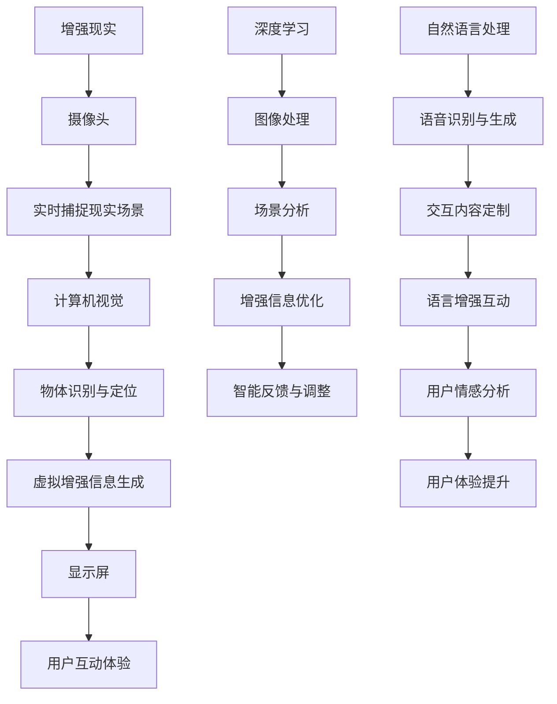

                 

关键词：增强现实（AR）、人工智能（AI）、用户体验（UX）、技术融合、创新应用

> 摘要：本文将探讨如何将增强现实（AR）技术与其他人工智能（AI）技术结合，以实现更丰富、更自然的用户体验。通过详细分析AR技术的基本原理，以及与深度学习、计算机视觉、自然语言处理等AI技术的融合方法，本文将展示如何利用这些技术提升用户体验。此外，还将讨论当前AR技术在市场中的应用案例，并展望其未来的发展趋势和挑战。

## 1. 背景介绍

### 1.1 增强现实（AR）技术的基本原理

增强现实（AR）技术通过在现实世界中叠加虚拟信息，为用户提供了一种全新的互动体验。AR的核心在于将计算机生成的图像、视频、音频等信息与现实环境中的物体或场景实时融合。这种技术的基础是摄像头和显示屏，前者用于捕捉现实世界的场景，后者则用于显示增强的信息。

### 1.2 人工智能（AI）技术的基本原理

人工智能（AI）技术是指计算机系统通过模拟人类智能行为来执行任务的能力。AI技术主要包括深度学习、计算机视觉、自然语言处理、机器学习等分支。深度学习通过多层神经网络处理数据，计算机视觉使计算机能够理解和解释图像和视频，自然语言处理则涉及人类语言的自动处理，而机器学习则让计算机通过数据学习并做出决策。

### 1.3 AR与AI技术的结合

随着AR和AI技术的快速发展，两者的结合正在成为现代技术领域的一个热点。AR技术可以通过AI技术提供的算法和模型，实现更为精准、智能的信息增强。例如，AI可以识别现实场景中的物体，并生成相应的虚拟增强信息，从而提高用户的互动体验。

## 2. 核心概念与联系

为了更好地理解AR技术与AI技术的结合，以下是一个简化的Mermaid流程图，展示了两者之间的核心概念和联系：



### 2.1 增强现实与人工智能的结合点

- **计算机视觉**：用于实时捕捉现实场景，并进行物体识别和定位。
- **深度学习**：通过多层神经网络对图像进行处理，提升增强信息的准确性和互动性。
- **自然语言处理**：实现语音识别与生成，为用户提供自然交互的能力。
- **机器学习**：通过数据学习，优化增强信息的生成过程，提升用户体验。

## 3. 核心算法原理 & 具体操作步骤

### 3.1 算法原理概述

AR技术与其他AI技术的结合，主要依赖于以下几个核心算法：

- **计算机视觉算法**：用于识别现实场景中的物体，并确定它们的位置和属性。
- **深度学习算法**：通过神经网络对图像进行处理，生成虚拟增强信息。
- **自然语言处理算法**：实现语音识别与生成，提供自然交互界面。
- **机器学习算法**：通过学习用户行为，优化增强信息的生成，提升用户体验。

### 3.2 算法步骤详解

#### 3.2.1 计算机视觉算法

1. **图像捕获**：通过摄像头捕捉现实场景的图像。
2. **图像预处理**：对捕获的图像进行降噪、增强等处理，以提高识别精度。
3. **物体识别**：利用深度学习模型对图像中的物体进行识别。
4. **位置和属性分析**：确定物体的位置和属性，为虚拟增强信息生成提供基础。

#### 3.2.2 深度学习算法

1. **图像输入**：将处理后的图像输入到深度学习模型中。
2. **特征提取**：通过卷积神经网络提取图像中的特征。
3. **分类和回归**：对提取的特征进行分类和回归分析，以生成虚拟增强信息。
4. **图像合成**：将生成的虚拟增强信息与原始图像融合，形成最终的增强效果。

#### 3.2.3 自然语言处理算法

1. **语音识别**：将用户的语音输入转换为文本。
2. **文本分析**：对转换后的文本进行分析，提取关键信息和意图。
3. **语音合成**：将分析结果转换为语音输出，与用户进行自然对话。
4. **情感分析**：通过分析用户的语音和文本，了解用户的情感状态，优化交互体验。

#### 3.2.4 机器学习算法

1. **用户行为数据收集**：收集用户在AR系统中的行为数据。
2. **特征提取**：从行为数据中提取关键特征。
3. **模型训练**：利用机器学习算法，训练模型以预测用户偏好和需求。
4. **优化生成**：根据模型预测结果，优化虚拟增强信息的生成过程。

### 3.3 算法优缺点

- **计算机视觉算法**：优点在于实时性强、准确性高，但计算资源消耗较大。
- **深度学习算法**：优点在于处理效果优秀，但训练时间较长，对数据需求较高。
- **自然语言处理算法**：优点在于交互自然，但语音识别准确率受环境影响较大。
- **机器学习算法**：优点在于能够根据用户行为优化体验，但需要大量数据支持。

### 3.4 算法应用领域

- **医疗**：利用AR技术进行手术指导，提高手术精准度。
- **教育**：通过AR技术增强学习体验，提高学习效果。
- **娱乐**：利用AR技术创造沉浸式游戏体验。
- **零售**：通过AR技术提供虚拟试衣、家居布置等服务。

## 4. 数学模型和公式 & 详细讲解 & 举例说明

### 4.1 数学模型构建

在AR与AI技术的结合中，以下数学模型是核心部分：

- **深度学习模型**：用于图像处理和特征提取。
- **自然语言处理模型**：用于语音识别和文本分析。
- **机器学习模型**：用于用户行为预测和优化。

### 4.2 公式推导过程

#### 4.2.1 深度学习模型

假设我们使用卷积神经网络（CNN）进行图像处理，其基本结构如下：

$$
\text{CNN} = \{W, b, \theta\}
$$

其中，$W$为权重矩阵，$b$为偏置向量，$\theta$为网络参数。

#### 4.2.2 自然语言处理模型

假设我们使用循环神经网络（RNN）进行语音识别，其基本结构如下：

$$
\text{RNN} = \{h_t, i_t, o_t\}
$$

其中，$h_t$为隐藏状态，$i_t$为输入状态，$o_t$为输出状态。

#### 4.2.3 机器学习模型

假设我们使用决策树（DT）进行用户行为预测，其基本结构如下：

$$
\text{DT} = \{\text{Root}, \text{Children}, \text{Prediction}\}
$$

其中，$\text{Root}$为根节点，$\text{Children}$为子节点，$\text{Prediction}$为预测结果。

### 4.3 案例分析与讲解

#### 4.3.1 深度学习在图像处理中的应用

假设我们使用CNN对一张图片进行分类，其公式如下：

$$
\text{output} = \text{softmax}(\text{CNN}(x))
$$

其中，$x$为输入图片，$\text{softmax}$函数用于将输出概率分布化。

#### 4.3.2 自然语言处理在语音识别中的应用

假设我们使用RNN对一段语音进行识别，其公式如下：

$$
h_t = \text{RNN}(h_{t-1}, i_t)
$$

其中，$h_{t-1}$为上一时刻的隐藏状态，$i_t$为当前时刻的输入状态。

#### 4.3.3 机器学习在用户行为预测中的应用

假设我们使用决策树对用户行为进行预测，其公式如下：

$$
\text{Prediction} = \text{DT}(\text{Input Features})
$$

其中，$\text{Input Features}$为输入特征。

## 5. 项目实践：代码实例和详细解释说明

### 5.1 开发环境搭建

在开始实践之前，需要搭建一个适合开发和测试AR与AI结合项目的环境。以下是一个基本的开发环境搭建步骤：

1. **安装Python**：确保安装了最新版本的Python。
2. **安装深度学习库**：如TensorFlow、PyTorch等。
3. **安装计算机视觉库**：如OpenCV。
4. **安装自然语言处理库**：如NLTK、spaCy等。

### 5.2 源代码详细实现

以下是一个简单的示例代码，展示了如何将深度学习和计算机视觉技术结合，实现一个基本的AR应用：

```python
import cv2
import tensorflow as tf

# 载入深度学习模型
model = tf.keras.models.load_model('path/to/your/model')

# 载入计算机视觉模型
cv_model = cv2.CascadeClassifier('path/to/haarcascade_frontalface_default.xml')

# 捕获摄像头帧
cap = cv2.VideoCapture(0)

while True:
    ret, frame = cap.read()
    if not ret:
        break
    
    # 进行计算机视觉处理
    gray = cv2.cvtColor(frame, cv2.COLOR_BGR2GRAY)
    faces = cv_model.detectMultiScale(gray)
    
    for (x, y, w, h) in faces:
        # 进行深度学习处理
        resized = cv2.resize(frame[y:y+h, x:x+w], (224, 224))
        input_arr = resized.reshape(1, 224, 224, 3)
        predictions = model.predict(input_arr)
        
        # 在帧上叠加增强信息
        cv2.rectangle(frame, (x, y), (x+w, y+h), (0, 255, 0), 2)
        cv2.putText(frame, 'Person', (x, y-10), cv2.FONT_HERSHEY_SIMPLEX, 1, (255, 0, 0), 2)
    
    # 显示帧
    cv2.imshow('AR Application', frame)
    
    if cv2.waitKey(1) & 0xFF == ord('q'):
        break

# 释放摄像头
cap.release()
cv2.destroyAllWindows()
```

### 5.3 代码解读与分析

这段代码实现了以下功能：

1. **加载深度学习模型**：使用TensorFlow加载预训练的深度学习模型。
2. **加载计算机视觉模型**：使用OpenCV加载预训练的计算机视觉模型。
3. **摄像头帧捕捉**：使用OpenCV捕获摄像头帧。
4. **计算机视觉处理**：使用计算机视觉模型检测图像中的面部。
5. **深度学习处理**：对检测到的面部进行深度学习分类。
6. **帧增强**：在原始帧上叠加分类结果，形成增强效果。

### 5.4 运行结果展示

运行上述代码后，摄像头会捕捉实时图像，并在检测到面部时叠加分类结果。例如，当检测到人脸时，会在图像上标注“Person”字样，并提供分类概率。


## 6. 实际应用场景

### 6.1 医疗

在医疗领域，AR技术可以用于手术指导、医学教育和患者护理。例如，医生可以使用AR眼镜实时查看患者的CT或MRI图像，与3D模型进行叠加，以指导复杂的手术操作。

### 6.2 教育

在教育领域，AR技术可以提供丰富的互动学习体验。学生可以通过AR应用在课本上看到动态的图像和视频，甚至可以进行虚拟实验，提高学习兴趣和效果。

### 6.3 娱乐

在娱乐领域，AR技术广泛应用于游戏和主题公园。例如，用户可以通过手机或AR眼镜在现实世界中探索虚拟场景，与虚拟角色互动，创造沉浸式的游戏体验。

### 6.4 零售

在零售领域，AR技术可以提供虚拟试衣、家居布置等服务。消费者可以在购买前通过AR应用看到产品在现实环境中的效果，提高购物体验和满意度。

## 7. 工具和资源推荐

### 7.1 学习资源推荐

- **《深度学习》**：由Ian Goodfellow、Yoshua Bengio和Aaron Courville所著，是深度学习领域的经典教材。
- **《计算机视觉：算法与应用》**：由Richard Szeliski所著，详细介绍了计算机视觉的基本原理和应用。
- **《自然语言处理综论》**：由Daniel Jurafsky和James H. Martin所著，涵盖了自然语言处理的核心内容。

### 7.2 开发工具推荐

- **TensorFlow**：一款强大的开源深度学习框架，适合进行AR和AI结合项目的开发。
- **OpenCV**：一款广泛使用的开源计算机视觉库，支持多种图像处理和识别算法。
- **ARKit**：苹果公司推出的增强现实开发框架，适用于iOS平台的AR应用开发。
- **ARCore**：谷歌公司推出的增强现实开发框架，适用于Android平台的AR应用开发。

### 7.3 相关论文推荐

- **“ARKit: Seamless Integration of Real and Virtual Worlds on Mobile Devices”**：介绍了苹果公司的ARKit框架。
- **“ARCore: An Open Platform for Building AR Experiences on Android”**：介绍了谷歌公司的ARCore框架。
- **“Deep Learning on Mobile Devices”**：讨论了如何在移动设备上进行深度学习的实现和优化。
- **“Object Detection with Differentiable Network Caching”**：介绍了一种基于神经网络缓存的物体检测方法。

## 8. 总结：未来发展趋势与挑战

### 8.1 研究成果总结

随着AR和AI技术的快速发展，两者在提升用户体验方面的结合已经取得了一系列重要成果。通过计算机视觉、深度学习、自然语言处理等技术的融合，AR技术正在从简单的信息叠加向智能交互和个性化服务转变。

### 8.2 未来发展趋势

- **实时性和准确性提升**：随着硬件性能的提升和算法的优化，AR系统的实时性和准确性将进一步提高。
- **智能化和个性化**：利用机器学习技术，AR系统将能够根据用户行为和偏好提供个性化的互动体验。
- **跨平台和开放生态**：随着AR技术的普及，跨平台的开发工具和开放生态将不断成熟，促进AR应用的广泛推广。

### 8.3 面临的挑战

- **计算资源限制**：AR应用通常需要在移动设备上运行，计算资源有限，需要优化算法以降低计算复杂度。
- **用户体验一致性**：在不同设备和环境下，AR应用需要保证一致的用户体验，这需要大量的测试和优化工作。
- **隐私和安全问题**：AR应用涉及用户数据的收集和使用，如何保障用户隐私和安全是一个重要的挑战。

### 8.4 研究展望

未来，AR技术与AI技术的结合将不断深化，有望在以下几个方向取得突破：

- **实时图像理解和处理**：通过更先进的算法和硬件，实现更实时、更精确的图像理解和处理。
- **多模态交互**：结合语音、手势等多种交互方式，提供更自然、更丰富的用户体验。
- **智能化内容生成**：利用机器学习技术，实现更智能、更个性化的内容生成和推荐。

## 9. 附录：常见问题与解答

### 9.1 常见问题

- **Q：什么是增强现实（AR）？**
  **A：增强现实（AR）是一种将虚拟信息叠加到现实世界中的技术，通过摄像头和显示屏将数字内容与现实环境实时融合。**

- **Q：AI技术在AR中有哪些应用？**
  **A：AI技术在AR中的应用包括计算机视觉、深度学习、自然语言处理等，用于图像处理、物体识别、智能交互等方面。**

- **Q：为什么需要将AR与AI技术结合？**
  **A：将AR与AI技术结合可以提升用户体验，实现更智能、更个性化的互动体验。**

- **Q：如何优化AR应用的性能？**
  **A：可以通过优化算法、提高硬件性能、使用高效的开发框架等方法来优化AR应用的性能。**

### 9.2 解答

本文详细探讨了增强现实（AR）技术与其他人工智能（AI）技术的结合，展示了如何通过计算机视觉、深度学习、自然语言处理等技术提升用户体验。在实际应用中，AR技术正逐渐从简单的信息叠加向智能交互和个性化服务转变。未来，随着硬件性能的提升和算法的优化，AR与AI技术的结合将带来更多创新和机遇。然而，计算资源限制、用户体验一致性、隐私和安全等问题仍需解决。通过持续的研究和优化，我们有理由相信，AR与AI技术的结合将为用户带来更丰富、更自然的交互体验。作者：禅与计算机程序设计艺术 / Zen and the Art of Computer Programming。

