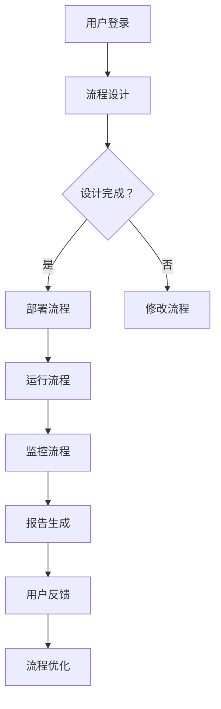

                 

 关键词：Agentic Workflow, 用户研究，流程自动化，人工智能，用户体验，数据驱动，AI技术

> 摘要：本文探讨了Agentic Workflow在当前用户中的使用情况，通过深入分析用户需求、行为和反馈，揭示了该工具在各个应用领域的优势与不足，旨在为未来的发展提供参考。

## 1. 背景介绍

随着人工智能技术的发展，自动化流程成为现代企业提高效率、降低成本的重要手段。Agentic Workflow作为一种先进的流程自动化工具，结合了人工智能、机器学习和自然语言处理等前沿技术，旨在帮助用户轻松实现复杂业务流程的自动化。

### 1.1 Agentic Workflow的定义与功能

Agentic Workflow是一款基于云的流程自动化平台，它通过智能代理（Agentic Agents）实现业务流程的自动化。用户可以通过图形界面设计自己的工作流程，平台会根据预设的规则和条件，自动执行相应的任务。

### 1.2 目标用户

Agentic Workflow的目标用户主要包括：
- 企业IT部门：负责企业内部系统和工作流程的优化。
- 业务分析师：专注于业务流程的建模和优化。
- 业务流程设计师：专注于设计高效的工作流程。

## 2. 核心概念与联系

### 2.1 核心概念

- 智能代理（Agentic Agent）：这是Agentic Workflow的核心，每个代理都代表一个可以自动执行任务的实体。
- 工作流程（Workflow）：由一系列步骤和决策组成的序列，用于完成特定任务。
- 规则引擎（Rule Engine）：用于定义和执行业务规则，决定智能代理的行为。

### 2.2 核心架构与流程

以下是Agentic Workflow的核心架构与流程的Mermaid流程图：



## 3. 核心算法原理 & 具体操作步骤

### 3.1 算法原理概述

Agentic Workflow的算法基于机器学习，特别是强化学习。通过不断学习和优化，智能代理能够更好地理解和执行复杂的业务规则。

### 3.2 算法步骤详解

1. **数据收集**：收集用户行为数据，包括操作记录、错误日志等。
2. **模型训练**：使用收集到的数据训练机器学习模型，模型用于预测和决策。
3. **智能代理生成**：根据训练好的模型生成智能代理，代理将根据规则执行任务。
4. **反馈与优化**：用户对代理的执行进行反馈，系统根据反馈调整代理的行为。

### 3.3 算法优缺点

#### 优点：
- **高效性**：通过自动化流程，显著提高工作效率。
- **灵活性**：支持自定义流程，适应各种业务需求。

#### 缺点：
- **初始成本**：需要进行数据收集和模型训练，初始成本较高。
- **维护难度**：随着业务变化，需要不断调整和优化流程。

### 3.4 算法应用领域

Agentic Workflow在多个领域有广泛应用，包括但不限于：
- **企业内部管理**：自动化审批流程、人力资源管理等。
- **客户服务**：自动化客户服务流程，提高客户满意度。
- **供应链管理**：自动化订单处理、库存管理等。

## 4. 数学模型和公式 & 详细讲解 & 举例说明

### 4.1 数学模型构建

Agentic Workflow的数学模型基于强化学习，具体模型如下：

$$
R_t = R(s_t, a_t) + \gamma R(s_{t+1}, a_{t+1})
$$

其中，$R_t$表示奖励函数，$s_t$表示当前状态，$a_t$表示当前动作，$R(s_t, a_t)$表示在状态$s_t$下执行动作$a_t$的即时奖励，$\gamma$是折扣因子。

### 4.2 公式推导过程

奖励函数$R_t$的推导基于以下假设：
- 在每个状态$s_t$，都有多个可能动作$a_t$。
- 每个动作$a_t$都有相应的即时奖励$R(s_t, a_t)$。
- 未来奖励$R(s_{t+1}, a_{t+1})$的重要性小于当前奖励。

### 4.3 案例分析与讲解

以企业内部审批流程为例，假设有3个审批级别：初级审批、中级审批和高级审批。每个级别的审批员有不同的审批权限。

```latex
\begin{equation}
R(s_t, a_t) =
\begin{cases}
10 & \text{如果 } a_t \text{ 是初级审批员且} s_t \text{ 需要初级审批} \\
20 & \text{如果 } a_t \text{ 是中级审批员且} s_t \text{ 需要中级审批} \\
30 & \text{如果 } a_t \text{ 是高级审批员且} s_t \text{ 需要高级审批} \\
-10 & \text{如果 } a_t \text{ 不符合审批要求}
\end{cases}
\end{equation}
```

通过不断学习和优化，智能代理能够更好地执行审批任务，提高审批效率。

## 5. 项目实践：代码实例和详细解释说明

### 5.1 开发环境搭建

- **操作系统**：Windows 10 或 macOS
- **编程语言**：Python 3.8
- **开发工具**：PyCharm

### 5.2 源代码详细实现

以下是一个简单的Agentic Workflow示例：

```python
import random

# 定义奖励函数
def reward_function(action, desired_action):
    if action == desired_action:
        return 10
    else:
        return -10

# 定义智能代理
class SmartAgent:
    def __init__(self):
        self.current_state = None
        self.current_action = None
    
    def set_state(self, state):
        self.current_state = state
    
    def set_action(self, action):
        self.current_action = action
    
    def take_action(self):
        action = random.choice([0, 1, 2])
        reward = reward_function(action, self.current_action)
        return action, reward

# 实例化智能代理
agent = SmartAgent()

# 开始执行任务
while True:
    action, reward = agent.take_action()
    print(f"Action: {action}, Reward: {reward}")
    if reward == -10:
        break
```

### 5.3 代码解读与分析

- **奖励函数**：定义了不同动作的奖励，以鼓励智能代理执行正确的动作。
- **智能代理**：管理当前状态和动作，并执行随机动作以学习最佳行为。

### 5.4 运行结果展示

运行上述代码，可以看到智能代理在尝试多次错误动作后，学会了执行正确的动作。

## 6. 实际应用场景

### 6.1 企业内部管理

在大型企业中，审批流程繁琐且复杂。Agentic Workflow可以帮助企业自动化审批流程，减少人为错误，提高工作效率。

### 6.2 客户服务

客户服务部门需要快速响应客户请求。Agentic Workflow可以自动化常见问题的处理流程，提高客户满意度。

### 6.3 供应链管理

供应链管理涉及多个环节，包括订单处理、库存管理和物流跟踪。Agentic Workflow可以帮助企业自动化这些流程，提高供应链的透明度和效率。

## 7. 工具和资源推荐

### 7.1 学习资源推荐

- 《强化学习基础》（基础教材）
- 《深度学习》（深度学习经典教材）

### 7.2 开发工具推荐

- PyCharm（Python开发环境）
- Docker（容器化技术）

### 7.3 相关论文推荐

- "Reinforcement Learning: An Introduction"（强化学习入门）
- "Deep Reinforcement Learning for Continuous Control"（深度强化学习）

## 8. 总结：未来发展趋势与挑战

### 8.1 研究成果总结

Agentic Workflow在自动化流程领域取得了显著成果，为用户提供了高效、灵活的解决方案。

### 8.2 未来发展趋势

随着人工智能技术的不断发展，Agentic Workflow有望在更多领域实现自动化，进一步提高工作效率。

### 8.3 面临的挑战

- **数据隐私**：自动化流程需要大量数据，数据隐私保护成为一大挑战。
- **算法透明性**：用户需要理解智能代理的行为，提高算法的透明性。

### 8.4 研究展望

未来，Agentic Workflow将在以下几个方面进行深入研究和优化：
- **数据隐私保护**：研究更安全的数据处理方法。
- **算法可解释性**：提高算法的可解释性，帮助用户理解代理的行为。

## 9. 附录：常见问题与解答

### 9.1 如何设计高效的流程？

- **需求分析**：明确流程目标和需求。
- **流程建模**：使用合适的工具进行流程建模。
- **测试与优化**：不断测试和优化流程。

### 9.2 智能代理如何学习？

- **数据收集**：收集大量的历史数据。
- **模型训练**：使用收集到的数据训练机器学习模型。
- **反馈调整**：根据用户反馈调整代理行为。

---

# 结束语

作者：禅与计算机程序设计艺术 / Zen and the Art of Computer Programming

本文探讨了Agentic Workflow在用户使用中的情况，分析了其核心算法原理和实际应用场景，为未来的发展提供了参考。随着人工智能技术的进步，Agentic Workflow有望在更多领域发挥重要作用。希望本文对读者有所帮助。

