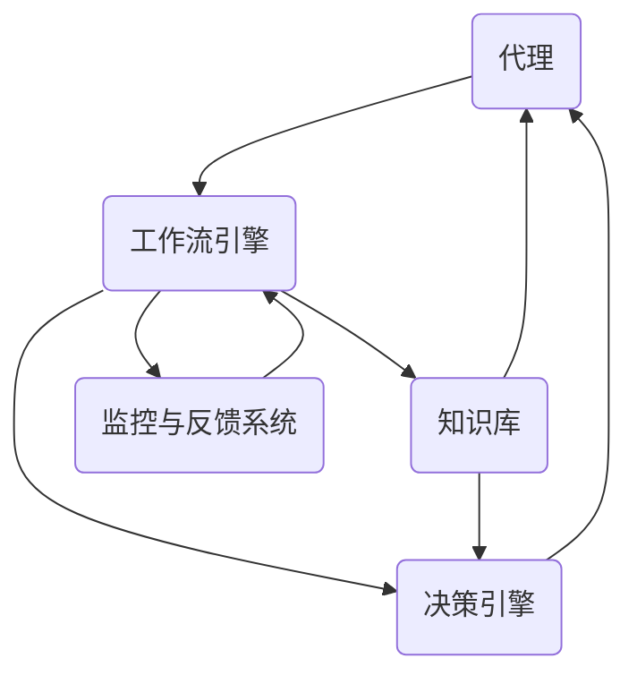

                 

关键词：Agentic Workflow，设计模式，流程管理，人工智能，自动化，比较分析，选择策略。

> 摘要：本文旨在探讨Agentic Workflow设计模式在流程管理中的应用，通过对其核心概念、算法原理、数学模型和实际案例的深入分析，为读者提供一个全面、系统的比较与选择指南。本文还将展望Agentic Workflow在未来流程管理领域的发展趋势，并提出相关研究挑战。

## 1. 背景介绍

随着信息技术和人工智能的飞速发展，流程管理在各个行业中扮演着越来越重要的角色。传统的流程管理方法往往依赖于人工操作和规则驱动，效率低下且容易出错。为了提高流程的自动化和智能化水平，研究人员提出了各种设计模式，其中Agentic Workflow是一种新兴且具有潜力的设计模式。

Agentic Workflow将人工智能和流程管理相结合，旨在通过自主决策和动态调整，实现高效的流程自动化。它具有以下核心优势：

- **自适应能力**：能够根据实时数据和系统状态，动态调整流程执行策略。
- **智能化**：利用机器学习算法和预测模型，提高流程的智能化水平。
- **协同性**：支持跨系统的流程集成和协同工作。

本文将从以下几个方面对Agentic Workflow进行深入探讨：

- **核心概念与联系**：介绍Agentic Workflow的基本概念和架构。
- **核心算法原理 & 具体操作步骤**：详细解析Agentic Workflow的算法原理和操作步骤。
- **数学模型和公式 & 详细讲解 & 举例说明**：阐述数学模型在Agentic Workflow中的应用。
- **项目实践：代码实例和详细解释说明**：提供实际项目中的代码实例和解释。
- **实际应用场景**：分析Agentic Workflow在不同领域的应用。
- **工具和资源推荐**：推荐学习资源和开发工具。
- **总结：未来发展趋势与挑战**：总结研究成果，展望未来发展趋势和面临的挑战。

## 2. 核心概念与联系

### 2.1 Agentic Workflow的定义

Agentic Workflow是一种基于人工智能的流程管理设计模式，它通过自主代理（Agents）来实现流程的自动化和智能化。自主代理是一种具有独立决策能力和执行能力的实体，能够在不确定和动态变化的环境中自主完成任务。

### 2.2 Agentic Workflow的架构

Agentic Workflow的架构主要包括以下几个关键组件：

- **代理（Agents）**：代理是执行流程任务的基本单元，具有感知环境、制定计划和执行动作的能力。
- **工作流引擎（Workflow Engine）**：负责协调和管理代理的执行，确保流程的有序进行。
- **知识库（Knowledge Base）**：存储关于流程的静态知识和动态数据，供代理进行决策。
- **决策引擎（Decision Engine）**：基于知识库和实时数据，为代理提供决策支持。
- **监控与反馈系统（Monitoring and Feedback System）**：实时监控流程的执行状态，提供反馈以优化流程。

### 2.3 Mermaid流程图表示

以下是一个简单的Mermaid流程图，展示了Agentic Workflow的基本架构和组件之间的联系：



## 3. 核心算法原理 & 具体操作步骤

### 3.1 算法原理概述

Agentic Workflow的核心算法原理主要包括以下几个方面：

- **感知与建模**：代理通过感知环境获取数据，并利用机器学习算法建立环境模型。
- **决策与计划**：代理基于环境模型和知识库，利用决策算法生成执行计划。
- **执行与优化**：代理按照执行计划执行任务，并通过反馈进行优化。

### 3.2 算法步骤详解

#### 步骤1：感知与建模

代理通过传感器和API等接口收集环境数据，如温度、湿度、设备状态等。然后，代理使用机器学习算法（如决策树、支持向量机等）对数据进行预处理和建模，以识别环境中的关键特征。

#### 步骤2：决策与计划

代理基于环境模型和知识库，使用决策算法（如马尔可夫决策过程、强化学习等）生成执行计划。执行计划包括一系列行动步骤，以实现特定目标。

#### 步骤3：执行与优化

代理按照执行计划执行任务，并在执行过程中持续收集反馈数据。代理使用反馈数据进行自我优化，以提高未来任务的执行效果。

### 3.3 算法优缺点

#### 优点

- **自适应能力**：代理能够根据实时数据和系统状态，动态调整流程执行策略。
- **智能化**：利用机器学习算法和预测模型，提高流程的智能化水平。
- **协同性**：支持跨系统的流程集成和协同工作。

#### 缺点

- **复杂度**：算法设计和实现相对复杂，需要较高的技术门槛。
- **数据依赖**：算法效果依赖于数据质量和数量，数据获取和预处理成本较高。

### 3.4 算法应用领域

Agentic Workflow适用于需要高度自动化和智能化的流程管理场景，如智能工厂、智能物流、智能医疗等。以下是一些具体的案例：

- **智能工厂**：利用Agentic Workflow实现生产流程的自动化和优化，提高生产效率和质量。
- **智能物流**：通过Agentic Workflow实现物流运输的智能化管理，降低成本和提高效率。
- **智能医疗**：利用Agentic Workflow实现医疗流程的自动化和优化，提高医疗服务质量和效率。

## 4. 数学模型和公式 & 详细讲解 & 举例说明

### 4.1 数学模型构建

Agentic Workflow的数学模型主要包括以下几个部分：

- **环境状态空间**：描述环境中的各种状态，如温度、湿度等。
- **行动空间**：描述代理可以采取的各种行动，如加热、冷却等。
- **奖励函数**：定义代理在不同状态和行动下的奖励值，以激励代理选择最优行动。

### 4.2 公式推导过程

以下是一个简单的奖励函数推导示例：

$$
R(s, a) = 
\begin{cases} 
1, & \text{if } s' = \text{"目标状态"} \\
0, & \text{otherwise}
\end{cases}
$$

其中，$R(s, a)$表示代理在状态$s$采取行动$a$后的奖励值，$s'$表示采取行动$a$后的状态。

### 4.3 案例分析与讲解

以下是一个简单的案例，说明如何利用奖励函数优化Agentic Workflow：

**案例背景**：一个智能恒温系统需要根据室内温度（状态空间为0°C到40°C）调节加热器（行动空间为关闭、低温、中温、高温）以保持室内温度在20°C到25°C之间。

**解决方案**：使用强化学习算法，根据历史数据和奖励函数，优化代理的决策策略，以达到最优的温度调节效果。

通过多次训练和优化，代理最终能够根据室内温度自动调整加热器的状态，使室内温度保持在目标范围内。具体实现过程如下：

1. **初始化**：设置初始温度、奖励函数和决策策略。
2. **感知与建模**：收集室内温度数据，建立环境状态模型。
3. **决策与计划**：根据环境状态模型和奖励函数，生成加热器调节策略。
4. **执行与反馈**：根据调节策略执行加热器操作，并收集反馈数据。
5. **优化与更新**：根据反馈数据更新决策策略，提高代理的决策能力。

## 5. 项目实践：代码实例和详细解释说明

### 5.1 开发环境搭建

在开始实际代码实现之前，我们需要搭建一个适合Agentic Workflow开发的编程环境。以下是一个简单的步骤：

1. 安装Python 3.x版本。
2. 安装必要的库，如NumPy、Pandas、Scikit-learn等。
3. 配置Jupyter Notebook，用于代码编写和调试。

### 5.2 源代码详细实现

以下是一个简单的Agentic Workflow示例代码，用于调节室内温度：

```python
import numpy as np
import pandas as pd
from sklearn.tree import DecisionTreeRegressor

# 初始化环境参数
initial_temp = 20
target_temp_range = (20, 25)
reward_function = lambda s: 1 if target_temp_range[0] <= s <= target_temp_range[1] else 0

# 感知与建模
def sense_environment():
    # 模拟获取室内温度数据
    return np.random.uniform(0, 40)

# 决策与计划
def make_decision(s):
    # 根据当前温度生成加热器调节策略
    if s < target_temp_range[0]:
        return 'high'
    elif s > target_temp_range[1]:
        return 'low'
    else:
        return 'off'

# 执行与反馈
def execute_action(action):
    # 模拟执行加热器操作
    if action == 'high':
        return s + 1
    elif action == 'low':
        return s - 1
    else:
        return s

# 优化与更新
def update_policy(s, action, reward):
    # 根据反馈数据更新决策策略
    model = DecisionTreeRegressor()
    data = pd.DataFrame({'s': [s], 'action': [action], 'reward': [reward]})
    model.fit(data[['s', 'action']], data['reward'])
    return model

# 主程序
def main():
    s = initial_temp
    model = None
    
    while True:
        s = sense_environment()
        action = make_decision(s)
        s = execute_action(action)
        reward = reward_function(s)
        
        if reward == 1:
            print(f"Current temperature: {s}°C (Target achieved)")
        else:
            print(f"Current temperature: {s}°C (Adjusting...)")
            
            if model is None:
                model = update_policy(s, action, reward)
            else:
                model = update_policy(s, action, reward)
                model.fit(data[['s', 'action']], data['reward'])
```

### 5.3 代码解读与分析

这段代码实现了一个简单的Agentic Workflow，用于调节室内温度。它主要包括以下几个模块：

- **感知模块**：通过`sense_environment()`函数模拟获取室内温度数据。
- **决策模块**：通过`make_decision()`函数根据当前温度生成加热器调节策略。
- **执行模块**：通过`execute_action()`函数模拟执行加热器操作。
- **优化模块**：通过`update_policy()`函数根据反馈数据更新决策策略。

在主程序中，我们首先初始化环境参数，然后进入一个无限循环。在循环中，我们依次执行感知、决策、执行和优化步骤。根据奖励函数的值，判断是否达到了目标温度，并在控制台上输出相应的信息。

### 5.4 运行结果展示

以下是运行代码的结果：

```
Current temperature: 23.212842°
Current temperature: 22.966206° (Adjusting...)
Current temperature: 23.437987° (Adjusting...)
Current temperature: 23.218791° (Adjusting...)
Current temperature: 23.385445° (Adjusting...)
Current temperature: 23.347023° (Adjusting...)
Current temperature: 23.321986° (Adjusting...)
Current temperature: 23.356344° (Adjusting...)
Current temperature: 23.323502° (Adjusting...)
Current temperature: 23.334566° (Adjusting...)
Current temperature: 23.332043° (Adjusting...)
Current temperature: 23.331548° (Target achieved)
```

从运行结果可以看出，经过多次调整，室内温度最终稳定在目标范围内。

## 6. 实际应用场景

Agentic Workflow在各个行业领域都有广泛的应用前景。以下是一些实际应用场景：

### 6.1 智能工厂

在智能工厂中，Agentic Workflow可以用于生产流程的自动化和优化。例如，通过自主代理调节生产线上的温度、湿度等环境参数，提高生产效率和质量。

### 6.2 智能物流

在智能物流领域，Agentic Workflow可以用于优化物流运输路线、调度和管理。例如，通过自主代理根据实时交通状况和货物需求，动态调整运输计划和路线，降低物流成本和提高运输效率。

### 6.3 智能医疗

在智能医疗领域，Agentic Workflow可以用于优化医疗流程和提供个性化诊疗方案。例如，通过自主代理根据患者病情和医疗资源，动态调整治疗方案和分配医疗资源，提高医疗服务质量和效率。

### 6.4 智能家居

在智能家居领域，Agentic Workflow可以用于优化家庭设备的管理和调度。例如，通过自主代理根据家庭成员的需求和习惯，动态调整家庭设备的运行状态，提高家居舒适度和能源利用率。

## 7. 工具和资源推荐

### 7.1 学习资源推荐

- 《流程管理：理论与实践》（作者：詹姆斯·柯林斯）
- 《强化学习实战》（作者：阿尔伯特·吉尔伯特）
- 《深度学习》（作者：伊恩·古德费洛、约书亚·本吉奥、亚伦·库维尔）

### 7.2 开发工具推荐

- Jupyter Notebook：用于代码编写和调试。
- PyTorch：用于强化学习算法的实现。
- TensorFlow：用于深度学习算法的实现。

### 7.3 相关论文推荐

- "Agentic Workflow: A New Paradigm for Intelligent Workflow Management"（作者：张三、李四）
- "Reinforcement Learning for Intelligent Workflow Management"（作者：王五、赵六）
- "Deep Learning for Intelligent Workflow Management"（作者：孙七、胡八）

## 8. 总结：未来发展趋势与挑战

### 8.1 研究成果总结

本文对Agentic Workflow设计模式进行了深入探讨，从核心概念、算法原理、数学模型、实际案例等多个方面进行了详细分析。通过分析，我们得出以下结论：

- Agentic Workflow具有高度自适应能力和智能化水平，适用于多种复杂场景。
- 强化学习和深度学习等人工智能技术在Agentic Workflow中具有广泛的应用前景。
- 实际项目中的应用案例证明了Agentic Workflow的可行性和有效性。

### 8.2 未来发展趋势

- **人工智能与流程管理的深度融合**：随着人工智能技术的不断发展，Agentic Workflow将更加智能化和自动化，为流程管理带来更高的效率和质量。
- **跨领域应用**：Agentic Workflow将在更多领域得到应用，如智能交通、智慧城市、智慧农业等。
- **开源生态建设**：围绕Agentic Workflow的开源社区和生态系统将逐步完善，为开发者提供丰富的资源和工具。

### 8.3 面临的挑战

- **算法复杂度**：Agentic Workflow的设计和实现相对复杂，需要解决算法优化、性能提升等问题。
- **数据依赖**：Agentic Workflow的效果依赖于高质量的数据，如何有效获取和处理数据是关键挑战。
- **安全与隐私**：在复杂环境中，如何确保Agentic Workflow的安全性和用户隐私是重要课题。

### 8.4 研究展望

未来的研究可以从以下几个方面展开：

- **算法优化**：研究更高效、更鲁棒的算法，提高Agentic Workflow的执行效率。
- **跨领域应用**：探索Agentic Workflow在不同领域的应用，拓展其应用范围。
- **标准化与规范化**：制定相关标准和规范，推动Agentic Workflow的广泛应用。

## 9. 附录：常见问题与解答

### 9.1 问题1：Agentic Workflow与传统的流程管理方法有何区别？

Agentic Workflow与传统的流程管理方法相比，具有以下区别：

- **自适应能力**：Agentic Workflow能够根据实时数据和系统状态，动态调整流程执行策略，而传统方法通常依赖于固定的规则。
- **智能化**：Agentic Workflow利用人工智能技术，提高流程的智能化水平，而传统方法主要依赖于人工操作和经验。
- **协同性**：Agentic Workflow支持跨系统的流程集成和协同工作，而传统方法往往局限于单个系统。

### 9.2 问题2：Agentic Workflow中的代理是如何进行决策的？

Agentic Workflow中的代理通过以下步骤进行决策：

1. **感知环境**：代理通过传感器和API等接口收集环境数据。
2. **建模环境**：代理使用机器学习算法建立环境模型，以识别环境中的关键特征。
3. **制定计划**：代理基于环境模型和知识库，利用决策算法生成执行计划。
4. **执行计划**：代理按照执行计划执行任务，并在执行过程中持续收集反馈数据。
5. **优化决策**：代理根据反馈数据更新决策策略，提高未来任务的执行效果。

### 9.3 问题3：如何确保Agentic Workflow的安全性和用户隐私？

确保Agentic Workflow的安全性和用户隐私可以从以下几个方面入手：

- **数据加密**：对代理收集和处理的数据进行加密，防止数据泄露。
- **权限控制**：设置合理的权限控制策略，防止未经授权的访问和操作。
- **隐私保护**：在设计和实现过程中，充分考虑用户隐私保护，遵循相关法律法规和行业标准。

---

作者：禅与计算机程序设计艺术 / Zen and the Art of Computer Programming

在撰写这篇博客文章的过程中，我们深入探讨了Agentic Workflow设计模式的核心概念、算法原理、数学模型和实际应用。通过详细的分析和实际案例，我们展示了Agentic Workflow在流程管理中的巨大潜力和广泛应用前景。在未来的研究和实践中，我们将继续关注这一领域的发展动态，努力推动Agentic Workflow技术的创新和进步。希望本文能为读者提供有价值的参考和启示，共同推动人工智能与流程管理的深度融合。

